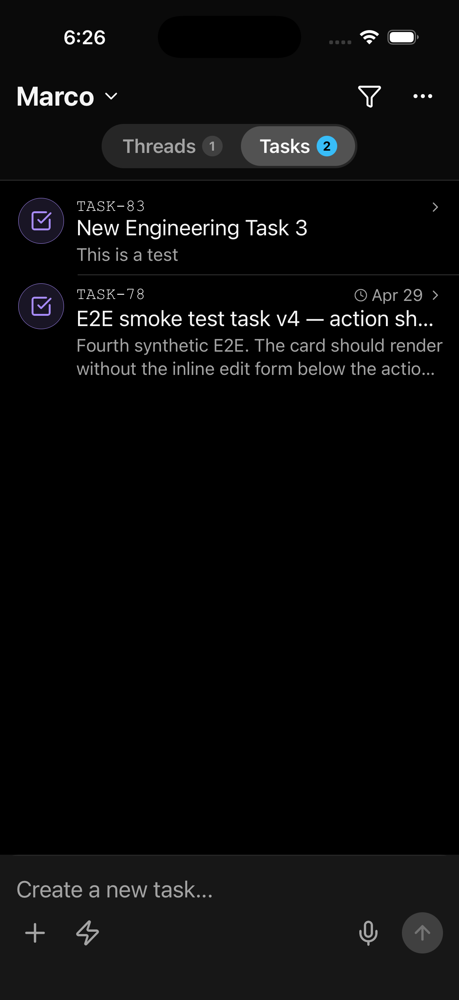

<p align="center">
  
</p>

<h1 align="center">Thinkwork</h1>

<p align="center"><strong>Production-grade open agent harness for teams that already live on AWS.</strong></p>

<p align="center">
  <a href="https://www.npmjs.com/package/thinkwork-cli"></a>
  <a href="./LICENSE"></a>
  <a href="https://docs.thinkwork.ai"></a>
</p>

---


Thinkwork makes agent infrastructure easy without handing the harness to a black-box vendor. Threads run the work, memory carries context forward, controls keep it safe, agents and connectors plug into the same system, and the whole thing drops into your existing AWS account via Terraform.

Five commands, one AWS account, and you own a production-quality agent runtime that stays open, portable, and under your control.

If you're not on AWS, this isn't the right tool for you — and that's the point. No Kubernetes, no third-party SaaS control plane, no tire-kicker mode.

## Status

🚧 **Pre-release.** v0.1.0 is in active development. Watch this repo for the release.

## What ships in v1

- **Six product modules:** Agents, Threads, Connectors, Automations, Control, Memory
- **Two clients:** an admin/operator web app (`apps/admin`) and a mobile client (`apps/mobile`, Expo)
- **A real CLI** (`thinkwork-cli`) with two surfaces: **deploy-side** (`login`, `init`, `plan`, `deploy`, `bootstrap`, `destroy`, `doctor`, `status`, `outputs`, `config`, `update`) and **API-side** (`login --stage`, `logout`, `me`, `user`, `mcp`, `tools`, plus a scaffolded roadmap of `thread`, `agent`, `template`, `tenant`, `member`, `team`, `kb`, `routine`, `scheduled-job`, `turn`, `wakeup`, `webhook`, `connector`, `skill`, `memory`, `recipe`, `artifact`, `cost`, `budget`, `performance`, `trace`, `inbox`, `dashboard` — see [apps/cli/README.md#roadmap](./apps/cli/README.md#roadmap))
- **Three connectors at launch:** Slack, GitHub, Google Workspace (plus a LastMile task connector for external task intake)
- **Agentic Tasks** and **Question Cards** for structured task intake and execution
- **Memory** as the umbrella layer for document knowledge, long-term memory, retrieval context, and portable memory contracts — including a **Knowledge Graph** view for inspecting per-agent memory relationships
- **Cost & budget analytics** — per-agent / per-model spend, time-series charts, and budget policies that auto-pause agents
- **Agent Templates** for fleet-wide configuration
- **Terraform Registry modules** at `thinkwork-ai/thinkwork/aws` — drops into your existing AWS Landing Zone with BYO-everywhere support

## Admin web

<p align="center">
  
</p>

The operator surface. A React SPA at `apps/admin`, authenticated through Cognito and tenant-scoped on every request. Platform operators configure agents and templates, wire up connectors and MCP servers, manage the credential vault, register webhooks, upload knowledge, inspect per-agent memory, and watch activity, cost, and guardrail health — all against the tenant running in their own AWS account. See the [admin docs](https://docs.thinkwork.ai/applications/admin/) for the per-route breakdown.

## Mobile app

<p align="center">
  
  
</p>

The end-user surface. An Expo + React Native client at `apps/mobile`, currently shipping on iOS via TestFlight. Users get a unified inbox across chat threads, scheduled automations, emails, and **external tasks** routed in from systems like LastMile — tasks render as native GenUI cards with realtime activity, round-trip edits, and narrow-policy push notifications. The mobile app owns per-user OAuth and MCP tokens; tenant configuration stays on the admin side. See the [mobile docs](https://docs.thinkwork.ai/applications/mobile/) for the full surface.

## Roadmap

We ship things only after they're load-bearing in production. Everything below is scoped but intentionally not in v0.1.0.

| Item | Status | Notes |
| --- | --- | --- |
| Ontology Studio | Planned | Authoring UI on top of the shipped Knowledge Graph — schema editing, relation types, ontology versioning |
| AutoResearch | Planned | Long-running research agents with structured citations; schema reserved, runtime not wired |
| Eval UI | Planned | In-app eval authoring, runs, and regression tracking against agent templates |
| Places service | Planned | Location/venue entity service for field- and route-based workflows |
| Web end-user client | Planned | Browser counterpart to the mobile inbox; today the admin web app is operator-only |

## Quick start

```bash
npm install -g thinkwork-cli
thinkwork login                    # 1. Pick an AWS profile
thinkwork init -s dev              # 2. Scaffold terraform.tfvars
thinkwork deploy -s dev            # 3. Provision ~260 AWS resources
thinkwork doctor -s dev            # 4. Sanity-check the stack
thinkwork login --stage dev        # 5. Sign in to the Cognito pool (OAuth)
thinkwork me                       # 6. Confirm identity + tenant
```

Six commands, one AWS account, and you own a production-grade agent harness instead of renting a black box. Full walkthrough in the [Getting Started guide](https://docs.thinkwork.ai/getting-started/).

## Repo layout

```
thinkwork/
  apps/        # runnable products: admin (web), mobile (Expo), cli
  packages/    # shared libraries
  terraform/   # IaC modules (registry-shaped) and reference examples
  examples/    # runnable reference packs: skill-pack, eval-pack, connector-recipe
  docs/        # Astro Starlight docs site source
  scripts/     # build, release, migration scripts
  .github/     # workflows and templates
```

## Technology

TypeScript (apps, packages, CLI, docs) + Python (Strands agent runtime) + Terraform (HCL, OpenTofu-compatible). Aurora Postgres + Bedrock + AppSync + Cognito + Lambda + Step Functions + S3 + CloudFront.

## Contributing

See [CONTRIBUTING.md](./CONTRIBUTING.md). Issues and discussions are open. Note the AWS-native scope — feature requests that assume a non-AWS substrate will be politely declined.

## Security

See [SECURITY.md](./SECURITY.md) for vulnerability disclosure.

## License

Apache 2.0 — see [LICENSE](./LICENSE) and [NOTICE](./NOTICE).
