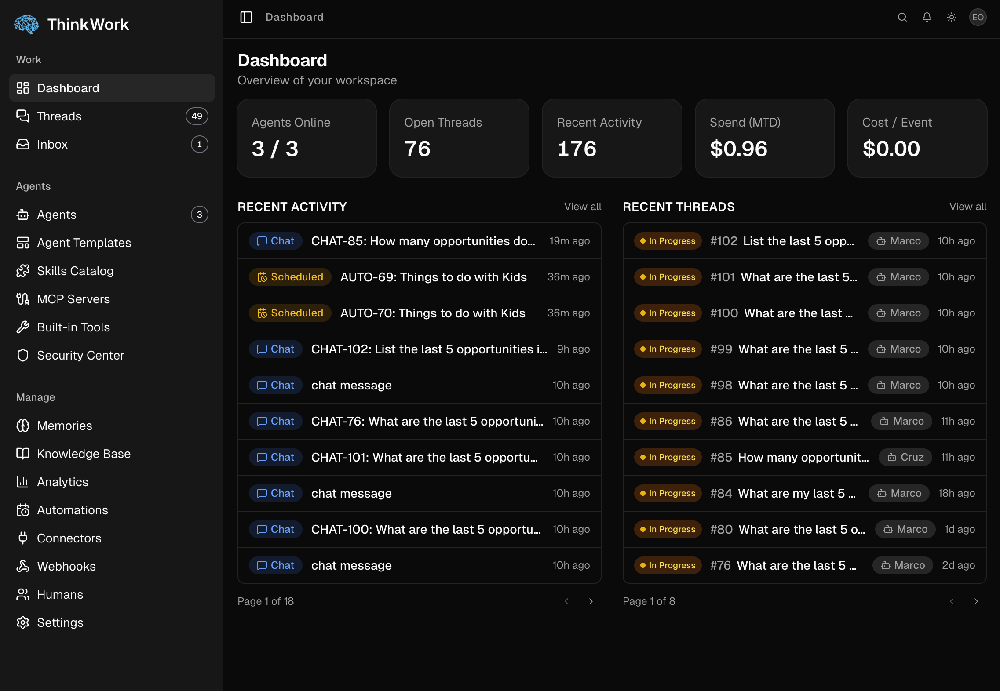
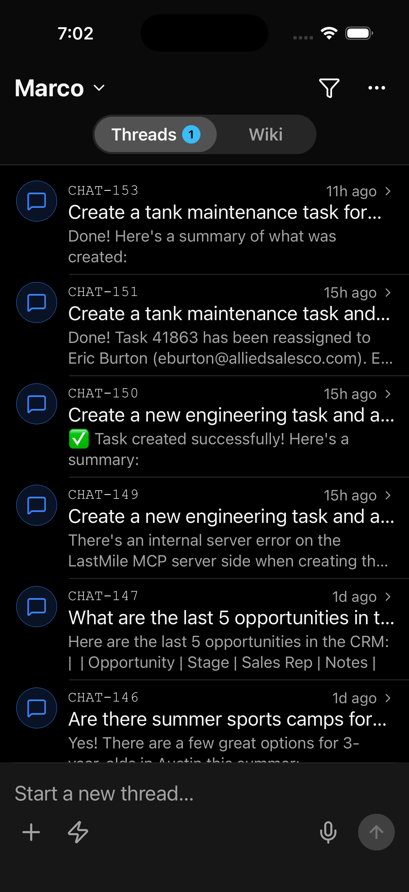
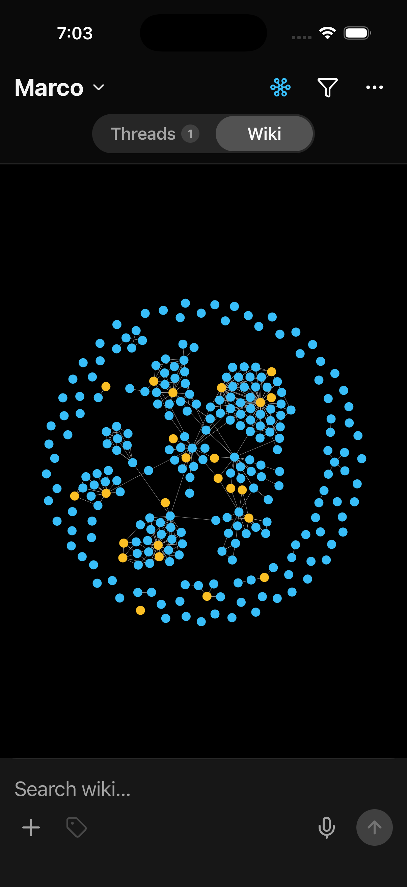

<p align="center">
  
</p>

<h1 align="center">ThinkWork</h1>

<p align="center"><strong>The open Agent Harness for Business — production-grade AI work, on the AWS account you own.</strong></p>

<p align="center">
  <a href="https://www.npmjs.com/package/thinkwork-cli"></a>
  <a href="./LICENSE"></a>
  <a href="https://docs.thinkwork.ai"></a>
</p>

---

ThinkWork is the open Agent Harness for Business. The harness is the runtime around the model — threads, memory, sandboxing, tools, controls, cost, evaluations, and audit, built in from day one. It deploys into your AWS account via Terraform and gives agents the runtime they need to do production work, not just demos.

Eight commands, one AWS account, and you own a production-grade agent runtime that stays open, portable, and under your control. **If ThinkWork the company disappears tomorrow, your deployment keeps working.**

If you're not on AWS, this isn't the right tool for you — and that's the point. No Kubernetes, no shared SaaS control plane, no tire-kicker mode.

## One harness, three ways to run it

ThinkWork is a three-tier deployment ladder. The runtime is identical across tiers; only who operates it differs.

| Tier | What you get | Who operates it |
| --- | --- | --- |
| **ThinkWork** _(this repo)_ | Apache 2.0. Self-host the harness in your AWS. Full product, no operating partner. Community-supported. | You |
| **ThinkWork for Business** | Same harness, deployed in your AWS, operated by us. Managed updates, priority support, SLA. **Managed does not mean vendor-hosted.** | Us, in your AWS |
| **ThinkWork Enterprise** | Strategy, pilot launch, managed operations, and workflow expansion services on top of either path. | Us, with you |

The harness remains yours regardless of tier. See [thinkwork.ai](https://www.thinkwork.ai) for the operated and services tiers; the rest of this README is the open self-host path.

## Status

🚧 **Pre-release.** See the [thinkwork-cli npm releases](https://www.npmjs.com/package/thinkwork-cli) for the current version and the [roadmap](https://docs.thinkwork.ai/roadmap/) for what's landed vs. planned.

## What ships in v1

- **Six product modules:** Agents, Threads, Connectors, Automations, Control, Memory
- **Two clients:** an admin/operator web app (`apps/admin`) and a mobile client (`apps/mobile`, Expo)
- **A real CLI** (`thinkwork-cli`) with two surfaces: **deploy-side** (`login`, `init`, `plan`, `deploy`, `bootstrap`, `destroy`, `doctor`, `status`, `outputs`, `config`, `update`) and **API-side** (`login --stage`, `logout`, `me`, `user`, `mcp`, `tools`, `eval`, `wiki`, plus a scaffolded roadmap of `thread`, `agent`, `template`, `tenant`, `member`, `team`, `kb`, `routine`, `scheduled-job`, `turn`, `wakeup`, `webhook`, `connector`, `skill`, `memory`, `recipe`, `artifact`, `cost`, `budget`, `performance`, `trace`, `inbox`, `dashboard` — see [apps/cli/README.md#roadmap](./apps/cli/README.md#roadmap))
- **Three connectors at launch:** Slack, GitHub, Google Workspace
- **Threads with structured channels** (CHAT, AUTO, EMAIL, SLACK, GITHUB) for task intake and execution
- **Memory** as the umbrella layer for document knowledge, long-term memory, retrieval context, and portable memory contracts — including a **memory graph view** for inspecting relationships across stored memories
- **Compounding Memory (Wiki)** — scattered memories distill into durable, browseable pages (Entity, Topic, Decision) on both the admin and mobile surfaces
- **Evaluations** — in-app test-case authoring, evaluation runs, and per-agent scoring on top of AWS Bedrock AgentCore Evaluations
- **Cost & budget analytics** — per-agent / per-model spend, time-series charts, and budget policies that auto-pause agents
- **Agent Templates** for fleet-wide configuration
- **Terraform Registry modules** at `thinkwork-ai/thinkwork/aws` — drops into your existing AWS Landing Zone with BYO-everywhere support

## Admin web

<p align="center">
  
</p>

The operator surface. A React SPA at `apps/admin`, authenticated through Cognito and tenant-scoped on every request. Platform operators configure agents and templates, wire up connectors and MCP servers, manage the credential vault, register webhooks, upload knowledge, inspect per-agent memory, and watch activity, cost, and guardrail health — all against the tenant running in their own AWS account. See the [admin docs](https://docs.thinkwork.ai/applications/admin/) for the per-route breakdown.

## Mobile app

<p align="center">
  
  
</p>

The end-user surface. An Expo + React Native client at `apps/mobile`, currently shipping on iOS via TestFlight. Users get a unified inbox across chat threads, scheduled automations, and emails — with narrow-policy push notifications and realtime activity on every turn. The companion **Wiki** tab surfaces Compounding Memory pages (Entity, Topic, Decision) that the agent builds as it learns — browseable on device, linked to each other, and scoped per agent. The mobile app owns per-user OAuth and MCP tokens; tenant configuration stays on the admin side. See the [mobile docs](https://docs.thinkwork.ai/applications/mobile/) for the full surface.

## Roadmap

We ship things only after they're load-bearing in production. Everything below is scoped but intentionally not in v1. See the [full docs roadmap](https://docs.thinkwork.ai/roadmap/) for the authoritative breakdown.

| Item | Status | Notes |
| --- | --- | --- |
| Ontology Studio | Planned | Authoring UI for entity/relation schemas — a step beyond today's memory graph view |
| AutoResearch | Planned | Long-running research agents with structured citations; schema reserved, runtime not wired |
| Places service | Planned | Location/venue entity service for field- and route-based workflows |
| Web end-user client | Planned | Browser counterpart to the mobile inbox; today the admin web app is operator-only |

## Quick start

```bash
npm install -g thinkwork-cli       # or: brew install thinkwork-ai/tap/thinkwork
thinkwork login                    # 1. Pick an AWS profile
thinkwork doctor -s dev            # 2. Check prerequisites (AWS, Terraform, Bedrock)
thinkwork init -s dev              # 3. Scaffold terraform.tfvars + modules
thinkwork plan -s dev              # 4. Review the Terraform plan
thinkwork deploy -s dev            # 5. Provision the stack
thinkwork bootstrap -s dev         # 6. Seed workspace files + skill catalog
thinkwork login --stage dev        # 7. Sign in to the Cognito pool (OAuth)
thinkwork me                       # 8. Confirm identity + tenant
```

Eight commands, one AWS account, and you own a production-grade Agent Harness — open and yours, not rented from a black box. The harness stays yours. Full walkthrough in the [Getting Started guide](https://docs.thinkwork.ai/getting-started/) and per-command reference in [`apps/cli/README.md`](./apps/cli/README.md).

## Repo layout

```
thinkwork/
  apps/        # runnable products: admin (web), mobile (Expo), cli
  packages/    # shared libraries
  terraform/   # IaC modules (registry-shaped) and reference examples
  examples/    # runnable reference packs: skill-pack, eval-pack, connector-recipe
  docs/        # Astro Starlight docs site source
  scripts/     # build, release, migration scripts
  .github/     # workflows and templates
```

## Technology

TypeScript (apps, packages, CLI, docs) + Python (Strands agent runtime) + Terraform (HCL, OpenTofu-compatible). Aurora Postgres + Bedrock + AppSync + Cognito + Lambda + Step Functions + S3 + CloudFront.

## Contributing

See [CONTRIBUTING.md](./CONTRIBUTING.md) and the [CLA](./CLA.md). Issues and discussions are open. Note the AWS-native scope — feature requests that assume a non-AWS substrate will be politely declined.

## Security

See [SECURITY.md](./SECURITY.md) for vulnerability disclosure.

## License

Apache 2.0 — see [LICENSE](./LICENSE) and [NOTICE](./NOTICE).
