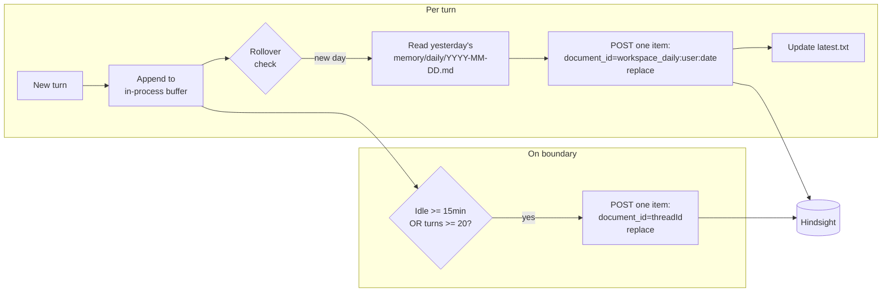

# Reshape Hindsight Ingest: Conversation-Level Thread Retain + Daily Workspace Memory Source

> **SUPERSEDED 2026-04-27.** Merged into `docs/brainstorms/2026-04-27-hindsight-ingest-and-runtime-cleanup-requirements.md`, which consolidates this brainstorm (thread reshape + daily memory + user-scope flip) with the same-day Strands-integration cleanup brainstorm. The boundary-flush trigger model defined here (idle ≥ 15 min OR ≥ 20 turns) is **dropped** in the merged document in favor of per-turn idempotent upsert. Daily-memory and user-scope decisions are preserved.

## Problem Frame

Two defects in how Thinkwork feeds Hindsight, surfaced by re-reading https://hindsight.vectorize.io/developer/api/retain:

1. **We ingest per-message, per-turn, with no `document_id`.** `retainTurn()` (verified at `packages/api/src/lib/memory/adapters/hindsight-adapter.ts:178-209`) splits each turn into 2 items with `context="thread_turn"` and no idempotency key. Hindsight's docs explicitly state a full conversation should be retained as a single item. Consequence: Hindsight's extraction only sees one turn at a time (no cross-turn context, no intent evolution), every re-ingest duplicates instead of updating, and `context` is a weak, uninformative literal.

2. **We have no "daily working memory" channel.** Earlier discussion established that the agent should keep a per-day note in the workspace memory folder and have it flow into Hindsight as a curated second signal alongside raw conversation transcripts. It isn't happening. The existing `memory/` S3 folder (per `packages/system-workspace/MEMORY_GUIDE.md` and `packages/skill-catalog/workspace-memory/SKILL.md`) is topic-based (`memory/lessons.md`, `memory/contacts.md`) and never closes a daily loop. High-signal distilled-by-the-agent memory never reaches Hindsight at all.

This matters because Hindsight is the retrieval surface that carries institutional memory across sessions for the user. Feeding it the wrong shape silently degrades every downstream recall/reflect call — something the platform quietly pays for today and will pay for more as usage scales to 4 enterprises × 100+ agents.

This brainstorm also folds in the agent→user ownership reframing from `docs/plans/2026-04-20-010-refactor-user-scoped-memory-wiki-plan.md` because the ingest shape rewrite sits on top of that scope flip and doing them coherently is cheaper than doing them in sequence.

---

## Actors

- A1. **Strands runtime** (`packages/agentcore-strands/agent-container/`): hosts conversations, decides when to flush, owns the workspace S3 prefix, writes daily memory on behalf of the agent.
- A2. **Thinkwork agent**: curates the daily memory file via the existing `workspace_memory_write` tool; decides what's worth capturing beyond the raw transcript.
- A3. **memory-retain Lambda** (`packages/api/src/handlers/memory-retain.ts`): receives retain payloads and invokes the adapter. Today shapes the payload into the broken per-message items; post-change, proxies conversation-level and daily-memory documents.
- A4. **Hindsight** (vectorize.io): the retain/recall backend. Extraction quality depends on being given conversations as single items with stable `document_id` and meaningful `context`.
- A5. **Human user** (Eric, Amy, future tenants): target of curated memory and recall results. Does not interact with retain directly.

---

## Key Flows

- F1. **Thread-conversation retain (replaces per-turn fire-and-forget)**
  - **Trigger:** Idle for ≥ flush-idle-threshold OR turns-since-last-flush ≥ flush-turn-threshold, whichever first. Per-turn Lambda invoke is removed.
  - **Actors:** A1 buffers conversation in-process; A3 proxies one HTTP call; A4 receives the whole transcript.
  - **Steps:**
    1. On each turn, A1 appends `(role, ISO-8601 timestamp, text)` to an in-memory buffer keyed by `threadId`.
    2. On flush trigger, A1 invokes A3 with `{userId, threadId, content, document_id, update_mode, context, metadata}`.
    3. A3 forwards to the Hindsight adapter, which POSTs a single item to `/memories` with `document_id = threadId`, `update_mode = "replace"`, `context = "thinkwork_thread"`, content formatted `"role (timestamp): text"` per line.
    4. On success, A1 clears the flush marker (buffer stays — next flush replaces the whole doc).
  - **Outcome:** One Hindsight document per thread, always up to date, idempotent under retries, extraction sees the full conversation.
  - **Covered by:** R1, R2, R3, R4, R5, R6, R7.

- F2. **Daily workspace memory rollover**
  - **Trigger:** On the first turn of a new calendar date (per rollover-tz policy) since last rollover.
  - **Actors:** A2 writes during the day; A1 performs the rollover check and ingest; A3/A4 receive the daily document.
  - **Steps:**
    1. During the day, A2 calls `workspace_memory_write("memory/daily/YYYY-MM-DD.md", ...)` to append notes it deems worth preserving — new learnings, decisions, recurring patterns, finished/abandoned tasks. Not every turn.
    2. On first turn of a new date, A1 reads `memory/daily/latest.txt` (or equivalent marker). If it names a prior date with a file that has content, A1 reads that file and invokes A3 with one item: `document_id = workspace_daily:<userId>:<prior-date>`, `update_mode = "replace"`, `context = "thinkwork_workspace_daily"`, `metadata = { user, date }`.
    3. A1 writes today's date into the marker file and opens today's `memory/daily/YYYY-MM-DD.md` path for writes.
  - **Outcome:** Each day's curated notes land in Hindsight as a separate, high-signal document distinct from thread transcripts. Rollover is deterministic, tied to activity (no scheduled job), and idempotent (empty files skip ingest).
  - **Covered by:** R8, R9, R10, R11, R12.

---

## Requirements

**Thread-conversation retain**

- R1. Thread content is retained to Hindsight as a **single item per conversation**, not per message. Per-message splitting at `hindsight-adapter.ts:178-209` is removed.
- R2. Each thread retain uses `document_id = threadId` and `update_mode = "replace"` so repeated flushes update the same document idempotently and let Hindsight re-extract against the full transcript each time.
- R3. Content is formatted `"<role> (<ISO-8601 timestamp>): <text>"`, one message per line, whole transcript concatenated. Empty or whitespace-only messages are dropped.
- R4. `context` is a meaningful literal (working value: `"thinkwork_thread"`) and metadata carries `{ tenantId, userId, agentId, threadId, turnCount }`.
- R5. The retain trigger is **boundary-based, not per-turn**: flush when idle for ≥ 15 min since the last turn OR when turns-since-last-flush ≥ 20, whichever fires first. Exact thresholds tunable; defaults defensible for v1.
- R6. The per-turn `memory-retain` Lambda invoke is removed from the retain path (the Lambda + dual-payload handler from plan 010 stays, but callers now fire only on boundary). This is a simplification — no additional infra.
- R7. Conversation buffer is kept in Strands runtime process memory keyed by `threadId`. Lost-on-restart is acceptable: the transcript also lives in `threads.messages` (Postgres), so a cold start can re-hydrate the buffer on demand from the authoritative store if a flush is needed without recent activity.

**Daily workspace memory source**

- R8. A per-user daily memory file convention exists at `memory/daily/YYYY-MM-DD.md`, written via the existing `workspace_memory_write` tool. The file is additive throughout the day (markdown append).
- R9. `packages/system-workspace/MEMORY_GUIDE.md` gets a new "Daily working memory" section instructing the agent when and what to write (non-routine learnings, decisions, recurring patterns, finished/abandoned tasks) and explicitly instructing it NOT to journal every turn (AgentCore managed memory already handles that; Hindsight thread retain handles raw transcript). Agent discipline — no runtime auto-distill loop.
- R10. A rollover hook in the Strands runtime (pre-turn or post-boot) detects a date change vs. a `memory/daily/latest.txt` marker. On change, it reads the prior day's file and, if non-empty, posts one Hindsight item: `document_id = workspace_daily:<userId>:<YYYY-MM-DD>`, `update_mode = "replace"`, `context = "thinkwork_workspace_daily"`, `metadata = { userId, tenantId, date }`.
- R11. Rollover is idempotent: re-running for the same (userId, date) replaces the same Hindsight document; empty files are a no-op; crash mid-rollover (marker not yet advanced) repeats the work safely.
- R12. The workspace S3 prefix for `memory/daily/*` follows the user-scoped workspace layout established by plan 010. If plan 010 does not already re-scope the workspace S3 prefix agent→user, this work extends it. (See Dependencies.)

**User-scope integration (adopted from plan 2026-04-20-010)**

- R13. All retain payloads and Hindsight bank derivation follow the user-scoped contract from plan 010: bank is `user_${userId}`, payloads carry `userId`, auth is composite via `resolveCaller(ctx)`. This brainstorm does not re-derive those decisions; it depends on them.
- R14. Existing broken per-message items in Hindsight do not require a new migration: plan 010's `wipe-external-memory-stores.ts` + journal-reload already drop and rebuild external memory. The reshape ships as part of (or immediately after) that reload so the new shape is the only shape in Hindsight.
- R15. Strands `api_memory_client.py` stops calling retain per turn. It is retained as the transport for flush-boundary posts and for the new daily rollover post. Fire-and-forget semantics stay (per plan 010's decision, with the alarm on `MISSING_USER_CONTEXT`).

---

## Acceptance Examples

- AE1. **Covers R1, R2, R3, R4.** Given a 6-turn thread `t123` between Eric and his agent, when the boundary flush fires, then exactly one Hindsight item is POSTed with `document_id=t123`, `update_mode=replace`, `context="thinkwork_thread"`, and `content` is 12 lines (6 user + 6 assistant) formatted `"<role> (<ts>): <text>"`. A subsequent turn + flush replaces the same document with 14 lines; `hindsight.memory_units` for that bank contains one row associated with `t123`, not 14.

- AE2. **Covers R5, R6.** Given a thread with turns arriving at 10:00, 10:05, 10:07, 10:10 and then no activity, when 10:25 arrives (15 min idle), then exactly one flush happens. If instead 20 turns land inside an 8-minute window with no idle gap, then a flush fires on the 20th turn and another starts the next counter.

- AE3. **Covers R10, R11.** Given yesterday's `memory/daily/2026-04-23.md` has 3 bullets and `latest.txt` names `2026-04-23`, when the first turn of `2026-04-24` fires in the user's timezone, then one Hindsight item is POSTed with `document_id="workspace_daily:<ericUserId>:2026-04-23"` and that file's content, then `latest.txt` is updated to `2026-04-24`. If the runtime crashes between the POST and the marker update, the next startup POSTs the same content again (Hindsight replaces in place) and advances the marker.

- AE4. **Covers R9.** Given the updated `MEMORY_GUIDE.md`, when the agent is asked something mundane ("what's 2+2"), then the agent does NOT write to `memory/daily/*`. When the agent learns that the user's heating schedule changed, then it writes a short dated bullet to today's file.

---

## Success Criteria

- **Human outcome — richer recall.** A user asking "what did we decide about X last week" gets a Hindsight result drawn from a full-conversation document (or a daily memory document), not a single orphaned turn. Qualitative check on Eric's and Amy's accounts after a week of usage.
- **Idempotency in practice.** `SELECT COUNT(*) FROM hindsight.memory_units WHERE bank_id = 'user_<ericUserId>' GROUP BY metadata->>'thread_id'` shows one row per thread at steady state, not one row per turn.
- **`context` signal present.** Sampling 20 retained items shows `context ∈ {"thinkwork_thread", "thinkwork_workspace_daily", "explicit_memory"}`, not `"thread_turn"`.
- **Daily files exist and flow through.** For Eric, after one active day of use, `memory/daily/<date>.md` is non-empty and the next day's first turn ingests it; `hindsight.memory_units` shows a `workspace_daily:*` document for that date.
- **Downstream-agent handoff.** `/ce-plan` can produce an implementation plan without re-deciding: ingest cadence, document_id shape, update_mode choice, context literal values, rollover trigger, the per-user scope posture, or what to do with legacy per-message items.

---

## Scope Boundaries

- **Not re-opening plan 010 decisions.** Bank naming, dual-payload Lambda, `resolveCaller` auth, wipe-and-reload migration, `users.wiki_compile_external_enabled` flag — all adopted as-is. If those prove wrong, fix them in plan 010, not here.
- **Not adding runtime auto-distill.** The runtime does not call an LLM to summarize turns for the daily file. Agent writes it or nothing does. Re-evaluate only if agent discipline fails in practice.
- **Not adding a scheduled job for rollover.** EventBridge/cron is explicitly rejected for rollover. Activity-triggered rollover is deterministic enough; cron adds infra for no gain.
- **Not introducing per-thread-per-day documents.** A thread is one Hindsight document for its lifetime. If we later want daily checkpoints *within* a long thread, that's a follow-up, not v1.
- **Not changing AgentCore managed memory.** It stays always-on and per-turn; it's a separate backend with different semantics and is not broken.
- **Not preserving today's per-message Hindsight items.** They vanish with plan 010's wipe. No migration path is owed.
- **Not exposing rollover / flush controls as user-facing toggles.** Admin owns infra; user toggles stay off the surface per `feedback_user_opt_in_over_admin_config`.
- **Not building hierarchical daily→weekly→monthly promotion.** That's the separate brainstorm `docs/brainstorms/2026-04-19-compounding-memory-hierarchical-aggregation-requirements.md`. Daily workspace memory is a leaf source that may later feed that aggregator; designing the aggregator is out of scope here.
- **Not refactoring `remember()` / `hindsight_retain` tool ingests.** Those are already single-fact items; leave them alone.

---

## Key Decisions

- **Conversation > append per turn.** Hindsight's docs recommend full conversation as a single item; `update_mode=append` is for knowledge-doc incremental merges, not chat turn-by-turn. Replace on boundary gets the documented extraction-quality story; per-turn append would lose cross-turn context in every extraction.
- **Agent-curated daily memory, no runtime auto-distill.** Agent decides what's worth saving. Zero new runtime LLM cost, zero new infra. MEMORY_GUIDE.md handles the "when/what" discipline. If the agent is sloppy about it in practice, we add an end-of-session reflect pass later — but not pre-emptively.
- **Activity-triggered rollover over scheduled cron.** Rollover only matters when the user is active; tying it to the first turn of a new date is deterministic and needs no EventBridge. Accepts that an inactive user won't roll over until they return — correct behavior.
- **Boundary trigger = idle 15 min OR ≥ 20 turns.** Idle timer is the primary; turn-count is the safety net for marathons. Exact numbers are v1 defaults, tunable.
- **Fold agent→user reframing into this effort.** Ingest shape work depends on user-scoped banks and user-scoped workspace paths; doing them in sequence means rebuilding the ingest layer twice. This brainstorm's implementation plan is expected to either supersede or extend plan 010 rather than wait behind it.
- **Buffer in Strands process memory, rehydrate from Postgres on cold-flush.** `threads.messages` is the authoritative store; process-memory buffer is a cache, not a source of truth. No Redis, no external buffer service.
- **`document_id` values are kebab-like-prefixed stable strings.** Threads: `<threadId>`. Daily memory: `workspace_daily:<userId>:<YYYY-MM-DD>`. Differentiated namespaces so future ingest sources (explicit `remember`, external MCP retains, etc.) can each have a stable prefix without colliding.
- **Sub-prefix `thinkwork_*` on `context` values** so Hindsight-side analytics can distinguish platform-originated retains from any future ingest.

---

## Dependencies / Assumptions

- **Assumes plan 010 either lands first or is merged into the same planning effort.** User-scoped banks, `resolveCaller`-based auth, and `user_${userId}` adapter naming are the foundation here. If plan 010's scope flip does not ship, this work either blocks behind it or re-derives all of its decisions — both worse outcomes than folding.
- **Assumes workspace S3 prefix flips agent→user alongside plan 010, or this brainstorm extends plan 010's in-scope list to include `memory/` S3 prefix re-scoping.** Plan 010's Scope Boundaries enumerate wiki tables + Hindsight bank + AgentCore namespace; I did not find an explicit statement about S3 workspace prefix. **[Unverified assumption]** — planning must confirm.
- **Assumes `userId` timezone is available (or UTC is acceptable for v1).** If no `users.timezone` column exists, rollover defaults to UTC with a note that we'll revisit when UX complaints arrive. **[Unverified assumption]** — planning must check.
- **Assumes `threads.messages` reliably captures the full transcript.** If retain relies on process-memory buffer and the process restarts without any prior flush, cold-flush rehydrate requires a complete thread in Postgres. Plan 010 preserves threads in place, so this should hold.
- **Assumes Hindsight's `update_mode=replace` is free enough to run every 15 min × N active threads.** Cost check during planning via an activity-volume estimate. If replace is prohibitively expensive for long threads, fall back to `append` for thread continuation and `replace` only on first-flush-per-day (hybrid acceptable but not preferred).
- **Assumes `hindsight.memory_units` bank queries remain the canonical way to inspect retained items.** Used by `memoryGraph.query.ts` and admin inspection tools.

---

## Outstanding Questions

### Resolve Before Planning

- _None._ Requirements captured as stated decisions; remaining items can be answered during implementation planning.

### Deferred to Planning

- [Affects R5][Technical] Is `idle ≥ 15 min OR turns ≥ 20` the right default? Planning should sample typical thread behavior (check TestFlight usage) and pick numbers grounded in real pacing, then expose as env config.
- [Affects R7][Technical] If the Strands process restarts mid-thread, does cold-flush rehydrate from `threads.messages` trigger automatically or wait for the next turn? Planning picks the simpler correct option.
- [Affects R10][Technical][Needs research] Is `users.timezone` stored? If not, is UTC rollover acceptable for v1, or should we default to the tenant's timezone, or to a browser-inferred value stored on sign-in? This is a product decision about user experience of the rollover boundary, not a spec decision.
- [Affects R12][Needs research] Does plan 010 already flip the workspace S3 prefix from agent-scoped to user-scoped? If yes, R12 is free; if no, this effort extends plan 010's scope.
- [Affects R14][Technical] Should this work ship inside plan 010 as additional units (Unit 9: thread reshape, Unit 10: daily memory), supersede plan 010 with a consolidated replacement, or ship as a follow-on plan gated on plan 010 merging? Planning call, guided by how close plan 010 is to implementation when this starts.
- [Affects R1, R8][Technical] Interaction with the compounding-memory-hierarchical-aggregation brainstorm (`docs/brainstorms/2026-04-19-compounding-memory-hierarchical-aggregation-requirements.md`): should daily memory be a leaf source for that aggregator's promotion pipeline? If yes, daily `document_id` conventions and `metadata` shape may need to satisfy that pipeline's input contract.
- [Affects R9][Technical] Exact copy for the new "Daily working memory" section in MEMORY_GUIDE.md — phrasing rewrite at planning time, informed by a pass over other guide sections for voice consistency.

---

## Next Steps

- -> `/ce-plan` for structured implementation planning. Expected planning output: either (a) two additional units appended to `docs/plans/2026-04-20-010-refactor-user-scoped-memory-wiki-plan.md` covering thread-ingest reshape and daily-memory rollover, or (b) a new consolidated plan that supersedes 010 and ships the full reframing + ingest reshape + daily memory in one coordinated migration. The choice depends on plan 010's implementation state at planning time.
