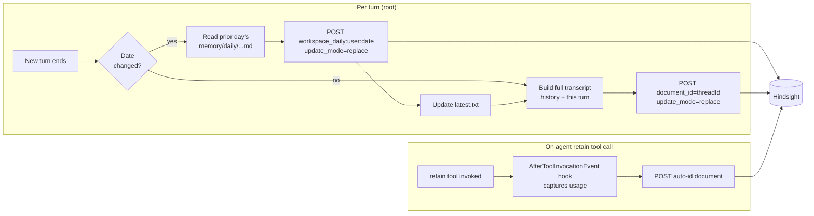

# Hindsight Ingest Reshape, Daily Workspace Memory, and Strands Integration Cleanup

## Problem Frame

Three compounding defects in how the Strands AgentCore runtime feeds Hindsight today, surfaced by re-reading https://hindsight.vectorize.io/developer/api/retain and auditing `packages/agentcore-strands/agent-container/`:

1. **Per-turn fragmentation with no `document_id`.** `_execute_agent_turn` async-invokes `memory-retain` with one user/assistant pair; the adapter (`packages/api/src/lib/memory/adapters/hindsight-adapter.ts:178-209`) splits each turn into 2 items with `context="thread_turn"` and no idempotency key. Hindsight's docs are explicit: *"A full conversation should be retained as a single item."* The current behavior creates N documents per thread, charges N retain-LLM extractions, prevents Hindsight from using cross-turn context, and silently degrades every downstream `recall`/`reflect` call. This compounds badly at 4 enterprises × 100+ agents.

2. **No "daily working memory" channel.** Earlier discussion established that the agent should keep a per-day note in the workspace memory folder and have it flow into Hindsight as a curated second signal alongside raw conversation transcripts. It isn't happening. The existing `memory/` S3 folder (per `packages/system-workspace/MEMORY_GUIDE.md` and `packages/skill-catalog/workspace-memory/SKILL.md`) is topic-based (`memory/lessons.md`, `memory/contacts.md`) and never closes a daily loop. High-signal distilled-by-the-agent memory never reaches Hindsight at all.

3. **Vendored monkey-patches.** `hindsight_usage_capture.py` patches `Hindsight.retain_batch / reflect / aretain_batch / areflect` at module scope to capture token usage for Bedrock cost attribution, and also patches `hindsight_client._run_async` to work around an upstream stale-loop bug. The first patch is doing tracing work that Strands' built-in hook system (`AfterToolInvocationEvent`) is purpose-built for. The second patch is a vendor SDK bug workaround on a separate axis from the integration model.

The desired end state: **one Hindsight document per ThinkWork thread** (idempotent upserts that grow with the thread), **one daily document per (user, date)** seeded from agent-curated workspace notes, and **zero Hindsight monkey-patches** in our integration with the vendor SDK's normal surface.

This brainstorm consolidates the two predecessors above. It also depends on the user-scope flip in `docs/plans/2026-04-24-001-refactor-user-scope-memory-and-hindsight-ingest-plan.md`; rather than ship behind that plan, this brainstorm's plan is expected to **supersede** the 4/24 and 4/27 plans and ship the full reframing in one coordinated migration.

The vendor `hindsight-strands` SDK exposes `create_hindsight_tools()` returning callable Python tools — there is no separate "lifecycle hook" the SDK provides; the integration model is just tool registration. The Strands SDK itself provides the hook system. So "use the built-in hooks" means **Strands hooks**, not Hindsight hooks.

---

## Actors

- **A1. Strands runtime — root** (`packages/agentcore-strands/agent-container/server.py:_execute_agent_turn`): hosts the user-facing thread, currently fires `retain_turn_pair` per turn. Owns the per-turn upsert, the daily-memory rollover, and the workspace S3 prefix.
- **A2. Strands runtime — sub-agent** (spawned via `delegate_to_workspace_tool` or `mode:agent` skills): runs its own Strands agent loop *inside* a root invocation; never owns a user-facing thread, never triggers thread upsert.
- **A3. Agent model**: the LLM running inside A1 or A2. Curates daily memory via `workspace_memory_write`; can call the `retain` tool when it decides a fact is worth explicit promotion.
- **A4. `memory-retain` Lambda** (`packages/api/src/handlers/memory-retain.ts`): engine-agnostic dispatch layer. Selects the active engine adapter (Hindsight or AgentCore managed) and invokes `adapter.retainConversation()` / `adapter.retainDailyMemory()`. Today's `retainTurn` adapter path is removed.
- **A5. Hindsight service** (`terraform/modules/app/hindsight-memory/`): ECS-hosted vendor service. Extracts facts, builds the entity graph, owns memory storage. Receives idempotent upserts keyed by stable `document_id`.
- **A6. Human user** (Eric, Amy, future tenants): target of curated memory and recall results. Does not interact with retain directly; is the rollover boundary's reference frame.

---

## Key Flows

- **F1. Per-turn thread upsert (replaces today's per-turn fire-and-forget per-message retain)**
  - **Trigger:** A1 finishes `_execute_agent_turn` successfully (non-error response). No buffering, no boundary thresholds.
  - **Actors:** A1, A4, A5.
  - **Steps:**
    1. A1 reads the full prior history from the invocation payload (`history` field passed to `_call_strands_agent`) plus the just-completed turn.
    2. A1 invokes A4 with `{ tenantId, userId, threadId, transcript, documentId: threadId, updateMode: "replace", context: "thinkwork_thread", metadata: { agentId, turnCount } }`.
    3. A4 dispatches to the active engine adapter; the Hindsight adapter POSTs one item to `/memories` with `document_id=threadId`, `update_mode=replace`, content formatted `"<role> (<ISO-8601 timestamp>): <text>"` per line.
    4. A5 deletes the prior version of that document and re-extracts facts from the current full transcript.
    5. Failure of the upsert logs a warning and does NOT block the agent response (R7).
  - **Outcome:** Exactly one Hindsight document per thread, always reflecting the latest state. Idempotent under retries. Extraction sees the full conversation every time.
  - **Covered by:** R1, R2, R3, R4, R7, R10.

- **F2. Daily workspace memory rollover (NEW high-signal channel)**
  - **Trigger:** On the first turn of a new calendar date (per the user's timezone, or UTC if unset) since last rollover.
  - **Actors:** A1 performs the rollover check and ingest; A3 wrote to the file during the day; A4 / A5 receive the daily document.
  - **Steps:**
    1. During the day, A3 calls `workspace_memory_write("memory/daily/YYYY-MM-DD.md", ...)` to append notes worth preserving — new learnings, decisions, recurring patterns, finished/abandoned tasks. Markdown append; not every turn.
    2. On the first turn of a new date, A1 reads `memory/daily/latest.txt`. If it names a prior date with a non-empty file, A1 invokes A4 with one item: `{ documentId: "workspace_daily:<userId>:<prior-date>", updateMode: "replace", context: "thinkwork_workspace_daily", content: <prior-day file>, metadata: { userId, tenantId, date } }`.
    3. A1 writes today's date to `latest.txt` and opens today's `memory/daily/YYYY-MM-DD.md` for writes.
  - **Outcome:** Each day's curated notes land in Hindsight as a separate, high-signal document distinct from thread transcripts. Activity-triggered rollover is deterministic, idempotent (empty files skip ingest, crash-mid-rollover replays safely), and needs no scheduled job.
  - **Covered by:** R8, R9, R10, R11, R12, R13.

- **F3. Agent-driven explicit retain (preserved, instrumentation cleaned up)**
  - **Trigger:** A3 decides a fact is worth promoting and calls the `retain` tool registered by `make_hindsight_tools`.
  - **Actors:** A1 or A2, A3, A5.
  - **Steps:**
    1. A3 calls the vendor `retain` tool (auto-generated `document_id`).
    2. The tool returns; Strands fires `AfterToolInvocationEvent`.
    3. The runtime's hook handler reads the response, captures `usage.input_tokens` / `usage.output_tokens`, appends to the per-invoke `hindsight_usage` list.
  - **Outcome:** Promoted fact lands in Hindsight as a separate small document; cost attribution is captured via the Strands hook, not via monkey-patch.
  - **Covered by:** R5, R14, R15.

- **F4. Sub-agent isolation**
  - **Trigger:** A1 invokes A2 via `delegate_to_workspace_tool` or a `mode:agent` skill.
  - **Actors:** A1, A2.
  - **Steps:**
    1. A2 runs its own Strands agent loop with its own tool surface.
    2. A2 may call the `retain` tool (F3) to promote specific facts; those calls go through A2's hook handler.
    3. When A2 finishes, A1 receives the sub-agent's output as a tool result and continues its own loop.
    4. Only A1's `_execute_agent_turn` triggers F1 — sub-agent transcripts are never auto-retained as separate documents.
  - **Outcome:** One thread document per user-facing thread; sub-agent reasoning stays as execution detail, surfacing only via explicit retain.
  - **Covered by:** R6.

---

## Requirements

### Per-turn thread upsert lifecycle

- **R1.** Thread content SHALL be retained to Hindsight as a **single item per conversation**, not per message. Per-message splitting at `hindsight-adapter.ts:178-209` is removed.
- **R2.** Each thread retain MUST use `document_id = threadId` and `update_mode = "replace"` so repeated calls update the same document idempotently and Hindsight re-extracts against the full transcript each time.
- **R3.** Content SHALL be formatted `"<role> (<ISO-8601 timestamp>): <text>"`, one message per line, whole transcript concatenated. Empty / whitespace-only messages are dropped.
- **R4.** The retain trigger SHALL be **per-turn (post-success), not buffered or threshold-flushed**. Every successful root turn fires one upsert. There is no in-process conversation buffer, no idle timer, no flush thresholds. The 4/24 buffer/threshold model is **explicitly rejected** in favor of Hindsight-side idempotency carrying the load.
- **R5.** The runtime SHALL pass the full conversation history it already receives in the invocation payload (`history` field — `_call_strands_agent`) directly to the upsert call, without an extra fetch.
- **R6.** Sub-agent invocations (delegated workspaces, `mode:agent` skills) SHALL NOT trigger F1. Only the root `_execute_agent_turn` retains transcripts. Sub-agent reasoning remains accessible only via the agent-driven retain path (F3) when explicitly promoted.
- **R7.** Failure of the upsert MUST NOT block the agent response. Retain failures log a warning with the thread id and move on. SLA on the agent response is unchanged.
- **R8.** `context` is a meaningful literal — `"thinkwork_thread"` for F1, `"thinkwork_workspace_daily"` for F2, vendor-default for F3 — and metadata carries `{ tenantId, userId, agentId, threadId, turnCount }` (or the daily-rollover equivalent).

### Daily workspace memory channel

- **R9.** A per-user daily memory file convention SHALL exist at `memory/daily/YYYY-MM-DD.md`, written via the existing `workspace_memory_write` tool. The file is additive throughout the day (markdown append).
- **R10.** `packages/system-workspace/MEMORY_GUIDE.md` SHALL gain a new "Daily working memory" section instructing the agent **when** and **what** to write — non-routine learnings, decisions, recurring patterns, finished / abandoned tasks — and explicitly instructing it **not** to journal every turn (AgentCore managed memory and Hindsight thread retain already handle that). Agent discipline; no runtime auto-distill loop.
- **R11.** A rollover hook in A1 SHALL detect a date change against `memory/daily/latest.txt`. On change, it reads the prior day's file and, if non-empty, posts one Hindsight item: `document_id = workspace_daily:<userId>:<YYYY-MM-DD>`, `update_mode = "replace"`, `context = "thinkwork_workspace_daily"`, `metadata = { userId, tenantId, date }`.
- **R12.** Rollover MUST be idempotent: re-running for the same `(userId, date)` replaces the same Hindsight document; empty files are a no-op; crash mid-rollover (marker not yet advanced) repeats the work safely.
- **R13.** The workspace S3 prefix for `memory/daily/*` SHALL follow the user-scoped layout established by the in-flight 4/24 plan (`docs/plans/2026-04-24-001-refactor-user-scope-memory-and-hindsight-ingest-plan.md`, U8). This brainstorm's plan **supersedes** that plan and folds U8 in.

### Strands hooks for usage capture

- **R14.** Bedrock token usage from agent-driven retain/reflect tool calls (F3) SHALL be captured via a Strands `AfterToolInvocationEvent` hook registered alongside `make_hindsight_tools`, **not** via module-level monkey-patches on the `Hindsight` class.
- **R15.** Bedrock token usage from runtime-driven retain (F1) SHALL be captured at the call site by reading `response.usage` from the `client.retain(...)` return value and appending to the per-invoke `hindsight_usage` list. **No** monkey-patch on `retain` / `retain_batch` / `aretain_batch`.
- **R16.** The shape of the `hindsight_usage` list returned in `_execute_agent_turn`'s `strands_usage` dict MUST remain unchanged: `[{phase, model, input_tokens, output_tokens}]`. Downstream `chat-agent-invoke` cost-event writes are untouched.
- **R17.** The `install()` monkey-patch in `hindsight_usage_capture.py` is removed once R14 and R15 are live. The `install_loop_fix()` patch is **kept as-is** — it's a vendor SDK bug workaround unrelated to the integration model. A separate dependency-upgrade follow-up may retire it.

### User-scope integration (consolidates from 4/24)

- **R18.** All retain payloads and Hindsight bank derivation SHALL follow the user-scoped contract: bank is `user_${userId}`, payloads carry `userId`, auth is composite via `resolveCaller(ctx)`. This brainstorm's plan **owns** that flip; the 4/24 plan is superseded.
- **R19.** Existing broken per-message items in Hindsight do NOT require a separate migration: the 4/24 plan's `wipe-external-memory-stores.ts` + journal-reload (now adopted into this brainstorm's plan) drops and rebuilds external memory. The reshape ships as part of that reload so the new shape is the only shape in Hindsight after migration.
- **R20.** `api_memory_client.py` stops calling per-message retain. It is retained as the transport for per-turn full-transcript upserts (F1) and for daily rollover posts (F2). The agent-callable `retain` tool (F3) keeps its current single-fact ingest shape.

### Operational behavior

- **R21.** The Hindsight document referenced by a thread SHALL be observable from the operator side: given a `thread_id`, an operator can query Hindsight and find exactly zero or one matching document. Acceptance verified by manual inspection in dev.
- **R22.** The agent-callable `retain` tool registered by `make_hindsight_tools` is **kept**. It remains available to the agent model for explicit "remember that the user prefers X" promotions and is registered for both root and sub-agents.
- **R23.** The `recall` and `reflect` tool wrappers in `hindsight_tools.py` are **unchanged**. They already match the desired async + fresh-client + retry pattern (see `feedback_hindsight_async_tools` in user memory) and are out of scope here.

---

## Acceptance Examples

- **AE1. Covers R1, R2, R3, R5.** Given a 6-turn thread `t123` between Eric and his agent, when the 6th turn completes, then exactly one Hindsight item is POSTed with `document_id=t123`, `update_mode=replace`, `context="thinkwork_thread"`, and `content` is 12 lines (6 user + 6 assistant) formatted `"<role> (<ts>): <text>"`. After turn 7, the same document is replaced with 14 lines; `hindsight.memory_units` for that bank contains one row associated with `t123`, not 14.

- **AE2. Covers R4.** Given turns arriving at 10:00, 10:05, 10:10, when 10:11 comes around, three upserts have already fired (one per completed turn). There is no buffering, no idle timer, no batch flush. If the runtime crashes between turn 4 and turn 5, the document for `t123` reflects state through turn 4 and the next successful turn brings it current.

- **AE3. Covers R6.** Given a root agent turn that delegates to a sub-agent which itself runs 4 internal turns, when the root turn completes, exactly **one** Hindsight document exists referencing this thread. The 4 sub-agent turns produced **zero** additional thread documents (unless the sub-agent's model called `retain` explicitly — see AE4).

- **AE4. Covers R14, R16, R22.** Given an agent that calls `retain("user prefers email over Slack")` mid-thread, when the tool returns, the per-invoke `hindsight_usage` list contains one entry with `phase="retain"`, non-zero `input_tokens`/`output_tokens`, and the model name from the Hindsight retain LLM env var. The entry is appended via the `AfterToolInvocationEvent` hook handler — `hindsight_usage_capture.install()` is not loaded in the import path.

- **AE5. Covers R7.** Given Hindsight is unreachable when `_execute_agent_turn` finishes, the agent response is still returned to the caller within the same SLA, the upsert failure is logged as a warning with the thread id, and `hindsight_usage` is the empty list for that invocation.

- **AE6. Covers R11, R12.** Given yesterday's `memory/daily/2026-04-26.md` has 3 bullets and `latest.txt` names `2026-04-26`, when the first turn of `2026-04-27` fires in the user's timezone, then one Hindsight item is POSTed with `document_id="workspace_daily:<ericUserId>:2026-04-26"` and that file's content, then `latest.txt` is updated to `2026-04-27`. If the runtime crashes between the POST and the marker update, the next startup POSTs the same content again (Hindsight replaces in place) and advances the marker.

- **AE7. Covers R10.** Given the updated `MEMORY_GUIDE.md`, when the agent is asked something mundane ("what's 2+2"), then the agent does NOT write to `memory/daily/*`. When the agent learns that the user's heating schedule changed, then it writes a short dated bullet to today's file.

- **AE8. Covers R21.** Given two distinct threads each with several turns, when an operator queries Hindsight `/documents?bank_id=user_<userId>`, the response contains exactly two thread documents whose `document_id` values match the two thread ids, plus any daily-memory documents present.

---

## Success Criteria

- **Human outcome — richer recall.** A user asking "what did we decide about X last week" gets a Hindsight result drawn from a full-conversation document or a daily memory document, not a single orphaned turn. Qualitative check on Eric's and Amy's accounts after a week of usage.
- **Idempotency in practice.** `SELECT COUNT(*) FROM hindsight.memory_units WHERE bank_id = 'user_<ericUserId>' GROUP BY metadata->>'thread_id'` shows one row per thread at steady state, not one row per turn.
- **`context` signal present.** Sampling 20 retained items shows `context ∈ {"thinkwork_thread", "thinkwork_workspace_daily", <vendor-default for explicit retain>}`, never `"thread_turn"`.
- **Daily files exist and flow through.** For Eric, after one active day of use, `memory/daily/<date>.md` is non-empty and the next day's first turn ingests it; `hindsight.memory_units` shows a `workspace_daily:*` document for that date.
- **Zero monkey-patches on Hindsight integration.** `grep -r "Hindsight\..*= " packages/agentcore-strands/agent-container/container-sources/hindsight_usage_capture.py` returns zero patches in `install()`'s body. The `_run_async` loop fix in `install_loop_fix()` may remain (R17) until a separate SDK upgrade lands.
- **Cost attribution preserved end-to-end.** `hindsight_usage` entries continue to flow runtime → `chat-agent-invoke` → `cost_events` rows with no observable schema change at the cost-events sink.
- **Downstream-agent handoff.** `/ce-plan` can produce an implementation plan without re-deciding: ingest cadence, document_id shape, update_mode choice, context literal values, sub-agent rule, daily-memory rollover trigger, per-user scope posture, monkey-patch fate, and what to do with legacy per-message items.

---

## Scope Boundaries

- **Not introducing buffering, idle thresholds, or boundary flush.** The 4/24 brainstorm's `idle ≥ 15 min OR ≥ 20 turns` model is explicitly dropped. Hindsight's idempotent `update_mode=replace` is the simplification; we accept paying retain-LLM cost on every turn as the simplicity premium and revisit only if dev observability shows real cost pain (sampled checkpoints / append-mode are pre-vetted alternatives).
- **Not changing AgentCore managed memory.** It stays always-on and per-turn; it's a separate engine adapter with different semantics and is not broken.
- **Not preserving today's per-message Hindsight items.** They vanish with the wipe-and-reload migration adopted from 4/24. No migration path is owed.
- **Not adding runtime auto-distill for daily memory.** The runtime does not call an LLM to summarize turns for the daily file. Agent writes it or nothing does. Re-evaluate only if agent discipline fails in practice.
- **Not adding a scheduled job for rollover.** EventBridge / cron is rejected for rollover. Activity-triggered rollover is deterministic enough; cron adds infra for no gain.
- **Not introducing per-thread-per-day documents.** A thread is one Hindsight document for its lifetime. Daily checkpoints *within* a long thread are a follow-up, not v1.
- **Not exposing rollover / retain controls as user-facing toggles.** Admin owns infra; user toggles stay off the surface (`feedback_user_opt_in_over_admin_config`).
- **Not building hierarchical daily → weekly → monthly promotion.** That's `docs/brainstorms/2026-04-19-compounding-memory-hierarchical-aggregation-requirements.md`. Daily workspace memory is a leaf source for that aggregator; designing it is out of scope here.
- **Not refactoring `recall`, `reflect`, or the agent-callable `retain` tool wrappers.** They are correct as-is.
- **Not replacing the `_run_async` monkey-patch.** Stays in `install_loop_fix()`. Replacing it requires a `hindsight-client` SDK upgrade and is a separate piece of work.
- **Not touching `chat-agent-invoke` or `cost_events` schema.** R16 freezes the contract.
- **Not touching the Pi parallel-substrate runtime** (per `project_pi_runtime_parallel_decision`). This brainstorm is for the existing Strands runtime; the Pi runtime ships its own retain integration as part of its parity work.
- **Not re-evaluating Hindsight as the brain.** The 2026-04-27 brain-engine session settled on stay-and-watch (Hindsight stays; OpenBrain monitored, not adopted). This brainstorm assumes Hindsight.

---

## Key Decisions

- **Conversation > append per turn.** Hindsight's docs recommend full conversation as a single item; `update_mode=append` is for knowledge-doc incremental merges, not chat turn-by-turn. Replace on every turn gets the documented extraction-quality story.
- **Per-turn upsert, not boundary flush.** The 4/24 buffer-and-flush model adds in-process state, idle timers, turn counters, and crash-recovery rehydration logic — to save retain-LLM cost. Hindsight's idempotent `replace` makes the simpler model correct: we just upsert every turn and let Hindsight do dedup. We accept retain-LLM cost as the simplicity premium; mitigations (sampled checkpoints, append-mode hybrid) are pre-vetted if metrics force the issue.
- **Root thread only — sub-agent transcripts are not auto-retained.** Sub-agent reasoning is execution detail. Auto-retaining it would clutter the bank, fan out cost, and noise up recall. Sub-agents can still call `retain` explicitly when they have a fact worth keeping.
- **Keep the agent-callable `retain` tool.** Explicit promotion is a useful signal — the model can flag a fact with its own context label, and Hindsight may extract more specifically from a focused snippet than from a long transcript.
- **Agent-curated daily memory, no runtime auto-distill.** Agent decides what's worth saving. Zero new runtime LLM cost, zero new infra. `MEMORY_GUIDE.md` enforces the "when/what" discipline. End-of-session reflect pass is a fallback if discipline proves insufficient — not pre-emptive.
- **Activity-triggered rollover over scheduled cron.** Rollover only matters when the user is active; first turn of a new date is deterministic and needs no EventBridge. An inactive user simply doesn't roll over until they return — correct behavior.
- **`document_id` values are kebab-prefixed stable strings.** Threads: `<threadId>`. Daily memory: `workspace_daily:<userId>:<YYYY-MM-DD>`. Sub-prefix `thinkwork_*` on `context` so Hindsight-side analytics distinguish platform-originated retains from any future ingest.
- **Strands hooks, not module-level monkey-patches, for usage capture.** Per-tool-call usage capture is exactly what `AfterToolInvocationEvent` is for. Runtime-driven retain capture happens at the call site by reading `response.usage` directly. Both replace `hindsight_usage_capture.install()`.
- **Decouple SDK bug-fix from integration cleanup.** `install_loop_fix()` (the `_run_async` workaround) stays; replacing it requires a `hindsight-client` SDK upgrade and is its own dependency-upgrade follow-up.
- **Fold user-scope flip into this plan, supersede the 4/24 plan.** Both predecessor plans are zero-units-shipped. Consolidating prevents the two plans from producing conflicting PRs and removes the sequencing question entirely.

---

## Dependencies / Assumptions

- **Both predecessor plans are unshipped.** Verified: `docs/plans/2026-04-24-001-refactor-user-scope-memory-and-hindsight-ingest-plan.md` (12 units, none checked) and `docs/plans/2026-04-27-001-feat-hindsight-retain-lifecycle-plan.md` (units present, none checked). The merged plan supersedes both with a fresh consolidated unit list.
- **Hindsight `update_mode="replace"` semantics match the docs** ("delete previous version and reprocess from scratch") for the version of Hindsight currently deployed on ECS. **[Unverified]** for our pinned image; planning to confirm.
- **The `_execute_agent_turn` invocation payload contains the full prior thread history.** **Verified** in `server.py:_call_strands_agent`; implementation will confirm the exact field name during planning.
- **Strands SDK exposes `AfterToolInvocationEvent` (or equivalent) via a hook registry attached to the `Agent` instance.** **[Unverified against this repo's pinned Strands version]** — planning will confirm. If the hook surface differs, R14 falls back to wrapping the tool callable at registration in `make_hindsight_tools` (still cleaner than module-level monkey-patching).
- **`users.timezone` may not be stored.** **[Unverified]**. If absent, rollover defaults to UTC for v1 with a note to revisit when UX complaints arrive (or default to a tenant-level timezone, or browser-inferred at sign-in).
- **`threads.messages` reliably captures the full transcript** as the authoritative store. The user-scope plan preserves threads in place, so this should hold; planning to confirm.
- **The `memory-retain` Lambda's Hindsight engine adapter** has both `retainTurn` and `retainConversation` entry points today (mirroring `api_memory_client.retain_turn_pair` and `retain_conversation`). The latter is unused. **[Unverified]** for the Lambda-side adapter shape; planning to read.
- **Cost premium of replace-every-turn is acceptable for v1.** A 50-turn document pays retain-LLM cost on every turn. Accepted (Key Decisions); if dev observability shows this to be a real cost issue, sampled-checkpoint or append-mode hybrid are pre-vetted alternatives that don't require a re-brainstorm.
- **Cost-event sink contract is `[{phase, model, input_tokens, output_tokens}]` — not changed by this work.** R16 freezes the shape.

---

## Outstanding Questions

### Resolve Before Planning

- *None.* All product decisions are settled here.

### Deferred to Planning

- [Affects R5][Technical] Exact field name in the `_execute_agent_turn` payload that carries prior thread history; whether it's the full transcript or only the recent N. Read in code, don't trust the comment.
- [Affects R2][Technical] Does the existing `memory-retain` Hindsight engine adapter already accept a `transcript` payload shape, or does it need a new entry point? Read `packages/api/src/handlers/memory-retain.ts` and the adapter, adjust accordingly.
- [Affects R14][Needs research] Confirm Strands SDK hook surface — exact event class name (`AfterToolInvocationEvent`?) and how a hook handler is registered against the `Agent` instance. Fall back to tool-callable wrapping at registration if hooks are unavailable in the pinned version.
- [Affects R15][Technical] Where in `_execute_agent_turn` does the runtime-driven retain call return a `RetainResponse` from which `usage` can be read? `api_memory_client.retain_turn_pair` currently uses `InvocationType="Event"` (fire-and-forget). Capturing usage requires either `RequestResponse`, or having the Lambda emit usage to a separate sink, or accepting that runtime-driven retain usage isn't metered. Plan to evaluate the trade-off.
- [Affects R7][Technical] If R15 picks `RequestResponse`, ensure the upsert latency is bounded (Hindsight retain extraction can take seconds) so it doesn't extend the agent's user-visible response time. Options: a separate background thread inside the runtime, or keep `Event` invocation and accept that runtime retain usage is captured by the Lambda itself rather than returned to the runtime.
- [Affects R11][Technical / Needs research] Is `users.timezone` stored? If not, UTC v1 with a note to revisit, or default-to-tenant, or browser-inferred at sign-in? Product decision about the rollover boundary's UX, not a spec decision.
- [Affects R13][Technical] The 4/24 plan's U8 (user-level S3 storage tier for daily memory) folds into this plan. Confirm S3 prefix shape and IAM at planning time.
- [Affects R17][Technical] Is the `hindsight-client` SDK upgrade that fixes the stale-loop bug feasible inside this PR's scope, or its own dependency-upgrade PR? Plan to scope.
- [Affects R10][Copy] Exact wording for the new "Daily working memory" section in `MEMORY_GUIDE.md`. Phrasing rewrite at planning time, informed by a pass over other guide sections for voice consistency.
- [Affects R1, R9][Forward-compat] Interaction with the compounding-memory-hierarchical-aggregation brainstorm (`docs/brainstorms/2026-04-19-compounding-memory-hierarchical-aggregation-requirements.md`): should daily memory be a leaf source for that aggregator's promotion pipeline? If yes, daily `document_id` conventions and `metadata` shape may need to satisfy that pipeline's input contract.

---

## Next Steps

→ `/ce-plan` for structured implementation planning. The expected planning output is **a single consolidated plan that supersedes both predecessor plans**:

- `docs/plans/2026-04-24-001-refactor-user-scope-memory-and-hindsight-ingest-plan.md` (12 units, none shipped)
- `docs/plans/2026-04-27-001-feat-hindsight-retain-lifecycle-plan.md` (units present, none shipped)

The new plan should fold in: 4/24's user-scope flip (U1–U8, U9a, U11), 4/24's daily-memory rollover (U10), 4/27's per-turn upsert and Strands hooks cleanup, and the wipe-and-reload migration. The 4/24 plan's U9 (boundary-flush scheduler) is **dropped** in favor of per-turn upsert.

Both predecessor plan files should be marked `superseded-by: <new plan path>` in their frontmatter once the new plan lands.
