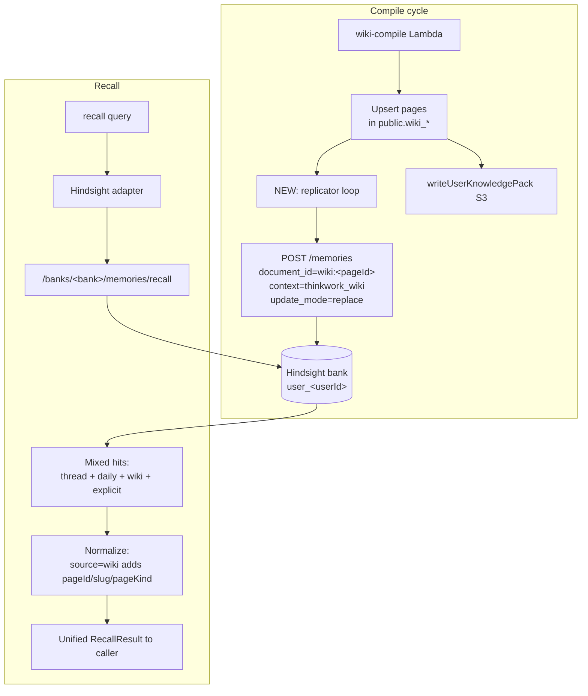

# Replicate Compiled Wiki Pages into Hindsight as a Third Document Type

## Problem Frame

ThinkWork maintains "knowledge about the user" in two separate stores today:

1. **Hindsight** (optional ECS add-on) — banks per user, raw conversation memory plus (per the in-flight Apr 24 brainstorm) full thread documents and daily workspace memory documents. Recall is semantic + entity-graph + BM25 + cross-encoder.
2. **`public.wiki_*` tables** in Aurora — compiled Entity/Topic/Decision/Place pages produced by `wiki-compile` from memory + workspace + journal sources. Surfaced via FTS, page reads, mobile force-graph, admin neighbor-ring.

The split costs us in four places at once: agent `recall()` misses the curated wiki content, the planned external Memory+Wiki MCP edge has to expose two tools, mobile/admin search is fragmented, and operators maintain two parallel knowledge stores. The duplication will compound as the platform scales to four enterprises × 100+ agents.

This brainstorm settles on **replicating compiled wiki pages into Hindsight as a third document type, with Postgres remaining the canonical wiki store.** A single Hindsight `recall()` then returns memory hits and wiki hits in one ranked list, callers disambiguate by a `source` tag, and the existing wiki UI surfaces (graph view, page reads, FTS) keep reading from Postgres unchanged.

This is the brainstorm's primary commitment. A more ambitious "retire ThinkWork's distillation entirely and surface Hindsight's native entity graph as the wiki UI" reframing was considered and parked under Scope Boundaries — it requires evidence that Hindsight's distillation is good enough to replace the curated Entity/Topic/Decision shape, which we don't have.

This work composes with — and depends on — the Apr 24 retain-reshape brainstorm (`docs/brainstorms/2026-04-24-hindsight-retain-reshape-and-daily-memory-requirements.md`). Wiki becomes a third Hindsight document context alongside `thinkwork_thread` and `thinkwork_workspace_daily`.

---

## Actors

- A1. **wiki-compile Lambda** (`packages/api/src/handlers/wiki-compile.ts` + `packages/api/src/lib/wiki/`): runs compile jobs, upserts wiki pages into Postgres, writes the user knowledge pack to S3. Gains a new inline replication step.
- A2. **Hindsight service** (`terraform/modules/app/hindsight-memory/`): receives one POST per upserted wiki page; stores it as a document in the user's bank with `context="thinkwork_wiki"`. Recall surfaces these alongside existing memory documents.
- A3. **Hindsight memory adapter** (`packages/api/src/lib/memory/adapters/hindsight-adapter.ts`): the recall path that returns hits to internal callers. Result shape extends to carry `source: "wiki" | "memory"` plus wiki-only fields (`pageId`, `slug`, `pageKind`).
- A4. **Internal `recall()` tool caller** (Strands runtime, the in-process agent): asks `recall("X")` and now sees memory + wiki in one ranked list.
- A5. **External MCP edge** (planned, `docs/brainstorms/2026-04-20-thinkwork-memory-wiki-mcp-requirements.md`): inherits unified recall through the existing `memory_recall` tool; `wiki_search` keeps its FTS-specific semantics.
- A6. **Operator** (CLI): runs `thinkwork wiki rebuild --user <userId>` to backfill a user's bank.
- A7. **Tenants without `enable_hindsight=true`**: keep the wiki working from Postgres; do not get unified recall (consistent with Hindsight being the "advanced retrieval" tier).

---

## Key Flows

- F1. **Inline replication on compile success**
  - **Trigger:** `wiki-compile` Lambda finishes a job with `status=succeeded` and one or more upserted pages.
  - **Actors:** A1, A2.
  - **Steps:**
    1. After page upserts and before `writeUserKnowledgePack`, the handler iterates the set of pages whose content changed in this job.
    2. For each page, the handler builds a Hindsight document payload (see R5) and POSTs it to the user's bank with `document_id=wiki:<pageId>`, `update_mode=replace`, `context="thinkwork_wiki"`.
    3. Successful POSTs are logged with `pageId`, `slug`, `bytes`. POST failure fails the compile job (so the existing wiki-compile retry queue replays it).
  - **Outcome:** Within one compile cycle, every changed wiki page exists as an idempotent Hindsight document keyed by `wiki:<pageId>`.
  - **Covered by:** R1, R2, R3, R4, R5, R6, R8.

- F2. **Unified recall**
  - **Trigger:** Any caller invokes the Hindsight memory adapter's `recall(query, ownerId, tenantId)`.
  - **Actors:** A2, A3, A4 (or A5).
  - **Steps:**
    1. Adapter calls Hindsight `/v1/default/banks/<bank>/memories/recall` once with the same query.
    2. Hindsight returns mixed hits drawn from `thinkwork_thread`, `thinkwork_workspace_daily`, `thinkwork_wiki`, and any explicit-memory items.
    3. Adapter normalizes each hit. Hits whose source document context is `thinkwork_wiki` are mapped to `source: "wiki"` with `pageId`, `slug`, `pageKind` populated from document metadata. All others map to `source: "memory"`.
    4. Adapter returns the merged ranked list to the caller.
  - **Outcome:** A single recall call returns memory and wiki content in one list; callers disambiguate at presentation time, no second API hop.
  - **Covered by:** R7, R9, R10, R11.

- F3. **Wiki page deletion mirror**
  - **Trigger:** A wiki page is deleted in Postgres (admin "delete page" action, lint cleanup, owner change).
  - **Actors:** A1 (or whichever code path performs the delete), A2.
  - **Steps:**
    1. The deleting code path issues a Hindsight DELETE against `document_id=wiki:<pageId>` after the Postgres delete commits.
    2. Failure is logged and surfaced; orphan documents accumulate in Hindsight if delete fails (acceptable for v1, see Outstanding Questions).
  - **Outcome:** Deleted wiki pages stop appearing in recall within one delete operation in the happy path.
  - **Covered by:** R12.

- F4. **Backfill via existing rebuild command**
  - **Trigger:** Operator runs `thinkwork wiki rebuild --user <userId>` after this feature deploys.
  - **Actors:** A6, A1, A2.
  - **Steps:**
    1. Existing rebuild path enqueues compile jobs for every page belonging to the user.
    2. Each job runs through the inline replicator (F1).
    3. After all jobs complete, the user's Hindsight bank contains every current wiki page as a `thinkwork_wiki` document.
  - **Outcome:** Backfill is a side effect of an existing operator command. No new tooling.
  - **Covered by:** R13.

---

## Requirements

**Replication trigger and shape**
- R1. Wiki replication runs **inline** in `wiki-compile` Lambda after page upserts and before `writeUserKnowledgePack` returns. No new Lambda, no outbox, no separate worker.
- R2. Each replicated wiki page is **one Hindsight document** with `document_id="wiki:<pageId>"`, `update_mode="replace"`, `context="thinkwork_wiki"`. Repeated compiles of the same page produce one document at steady state.
- R3. The replicator only POSTs pages whose content changed in the current compile job (signalled by the existing upsert pipeline). Unchanged pages are not re-POSTed, to avoid waste.
- R4. The replicator targets the existing Hindsight bank `user_<userId>` (same bank used by thread + daily memory documents). No new bank namespace.
- R5. Document content is the page rendered as markdown: `# <title>` + ordered sections joined by blank lines. Document metadata carries at minimum `{ pageId, slug, pageKind, tenantId, userId, aliases, sourceContext: "thinkwork_wiki" }`. Backlinks and place metadata are out of scope for v1 metadata; see Outstanding Questions.
- R6. The replicator preserves the existing wiki-compile error-handling contract: a Hindsight POST failure fails the compile job (`status=failed`), surfacing in the existing retry/observability path. The handler does not throw; it returns `{ ok: false, error }` per the existing convention.

**Unified recall surface**
- R7. The Hindsight adapter's `RecallResult` schema gains a `source: "wiki" | "memory"` field. Wiki hits additionally carry `pageId`, `slug`, `pageKind`. The structural change is the adapter return type plus any GraphQL/MCP types that pass these results through to callers.
- R8. The adapter does not issue a second call for wiki content. Hindsight's single recall response is the source of truth; the adapter's job is normalization, not federation.
- R9. Recall scoring is whatever Hindsight returns. No re-ranking against a separate wiki score. (Hindsight already applies BM25 + cross-encoder over its mixed corpus.)
- R10. The internal `recall()` tool exposed to the Strands runtime returns the unified result without any caller change beyond surfacing the new `source`/`pageId`/`slug`/`pageKind` fields in its docstring/output.
- R11. The external MCP server's `memory_recall` tool (planned in the Apr 20 brainstorm) inherits unified recall automatically. The `wiki_search` tool stays as the FTS-specific surface — different query intent, not redundant.

**Lifecycle and backfill**
- R12. Wiki page deletion in Postgres triggers a Hindsight DELETE against `document_id="wiki:<pageId>"`. Best-effort; logged on failure. Orphan documents are an accepted v1 risk and addressable by a periodic sweep if needed.
- R13. Backfill of existing wiki pages reuses `thinkwork wiki rebuild --user <userId>`. No new backfill script.
- R14. There is no migration of the existing Hindsight bank schema. Wiki documents are simply added under a new context tag; existing thread/daily/explicit documents are unaffected.

**Optional-add-on identity**
- R15. The "Hindsight is optional" framing is preserved. Tenants with `enable_hindsight=false` continue to use the wiki via Postgres + the user knowledge pack. They do not get unified recall — that is a Hindsight-only capability, consistent with the existing tiering.
- R16. The `wiki-compile` replicator is a no-op when `enable_hindsight=false`. Detection should be configuration-driven, not by trying to reach a non-existent Hindsight endpoint.

---

## Acceptance Examples

- AE1. **Covers R1, R2, R5.** Given a wiki page `wp_xyz` (slug `heating-preferences`, kind `Topic`) is upserted by a successful compile job for user `eric`, when the job finishes, then exactly one POST hits Hindsight at `/v1/default/banks/user_<ericUserId>/memories` with `document_id="wiki:wp_xyz"`, `update_mode="replace"`, `context="thinkwork_wiki"`, `content` is `"# Heating preferences\n\n<section bodies joined by blank lines>"`, and `metadata.pageKind="Topic"`.

- AE2. **Covers R2, R3.** Given the same page is recompiled three times in a day with content changes only on the first and third, when each compile finishes, then exactly two POSTs hit Hindsight (compile #1 and compile #3); compile #2's no-change exit path skips the POST. Hindsight's `memory_units` for `wiki:wp_xyz` shows one row at steady state regardless of compile count.

- AE3. **Covers R7, R8, R10.** Given the user's bank contains both a `thinkwork_thread` document (content: "...Eric mentioned 68F at night...") and a `thinkwork_wiki` document (page `heating-preferences`), when the runtime agent calls `recall("what temperature does Eric like at night")`, then a single Hindsight call returns ≥2 hits; the adapter normalizes them so the thread hit has `source="memory"` and the wiki hit has `source="wiki"` with `pageId="wp_xyz"`, `slug="heating-preferences"`, `pageKind="Topic"`.

- AE4. **Covers R12.** Given a wiki page `wp_xyz` exists in Hindsight, when an admin deletes that page in Postgres, then a DELETE hits Hindsight for `document_id="wiki:wp_xyz"` after the DB delete commits. A subsequent `recall()` for the relevant query no longer returns the deleted page.

- AE5. **Covers R15, R16.** Given a tenant deployed with `enable_hindsight=false`, when `wiki-compile` runs, then no Hindsight POST is attempted (the replicator path is gated on configuration). The wiki keeps working: pages upsert into Postgres, the user knowledge pack writes to S3, the mobile graph view and admin page reads function unchanged.

- AE6. **Covers R13.** Given a user with 200 existing wiki pages, when an operator runs `thinkwork wiki rebuild --user <userId>` after the feature deploys, then 200 compile jobs run, each POSTs its page through the inline replicator, and on completion the user's Hindsight bank contains 200 `thinkwork_wiki` documents (one per page, `document_id` = `wiki:<pageId>`).

---

## Success Criteria

- **Human outcome — recall sees the wiki.** A runtime agent answering a question whose answer lives in a wiki page returns the page in `recall()` results without a separate `wiki_search` call. Qualitative check on Eric's account after one week of usage: at least 25% of recall hits across a sampled day include a `source="wiki"` result.
- **Idempotency in practice.** `SELECT COUNT(*) FROM hindsight.memory_units WHERE bank_id = 'user_<ericUserId>' AND context = 'thinkwork_wiki'` equals the count of pages in `public.wiki_pages WHERE owner_id = '<ericUserId>'` at steady state, ±1 for a delete or compile in flight.
- **No regression on existing wiki UI.** Mobile force-graph, admin neighbor-ring, page reads, and FTS search behave identically before and after the change. Postgres remains canonical.
- **No regression for AgentCore-only tenants.** Tenants with `enable_hindsight=false` see no behavior change; CI includes a smoke test for that configuration.
- **Compile-latency budget held.** Inline replication adds ≤ 25% to a typical wiki-compile job's wall time. Measure on a 10-page job locally and on the dev stack before sign-off.
- **Downstream-handoff quality.** A planner reading this doc plus the Apr 24 retain-reshape brainstorm has every product decision (trigger, granularity, recall shape, backfill, optional-add-on behavior) settled; only the items in `Outstanding Questions → Deferred to Planning` remain to investigate.

---

## Scope Boundaries

- Replacing ThinkWork's wiki distillation pipeline with Hindsight's native fact-extraction (the "retire `wiki-compile`" reframing). Out of scope; revisit only after evidence that Hindsight's entity graph is sufficient to replace curated Entity/Topic/Decision pages.
- Collapsing `public.wiki_*` and making Hindsight the only wiki store. Explicitly rejected for v1: breaks the optional-add-on framing, requires rewriting the 62KB compiler, and blocks all other in-flight wiki work.
- Hindsight as canonical with Postgres as a derived cache (the "flip the polarity" option). Rejected: same costs as Collapse plus cache-invalidation complexity.
- Replicating `wiki_page_links` (backlinks) into Hindsight as edges. Out of scope: Hindsight's recall doesn't need them, and the wiki graph view reads them from Postgres.
- Replicating place metadata (lat/long) for Place pages into Hindsight metadata. Out of scope for v1; revisit if recall hits show place pages without the lat/long context callers need.
- Soft-delete semantics for wiki documents in Hindsight (mark deleted, keep for audit). Out of scope; v1 is hard-delete via mirror.
- Backfilling for the entire fleet of users in one operation. Out of scope; backfill is per-user via the existing rebuild CLI.
- Multi-user shared wiki content (one wiki page surfaces in multiple users' banks). Out of scope; current wiki is strictly per-`owner_id`.
- Re-ranking Hindsight wiki hits against an alternative scoring model (FTS, alias boost, etc.). Out of scope; Hindsight scoring stands.

---

## Key Decisions

- **Replicate, don't collapse.** Postgres stays canonical for wiki. Hindsight gains a third document context. This preserves the optional-add-on identity, the existing wiki UI, and all in-flight wiki work, at the cost of maintaining a one-way replicator.
- **Page-level opaque, not chunk-level.** Each wiki page is one Hindsight document. The recall path treats `thinkwork_wiki` documents as units, not as fact-extracted chunks. Whether this requires a Hindsight per-context "no-extract" flag or an adapter-side filter to original-document hits is a planning question (see Outstanding Questions); the product shape is the same either way.
- **Inline in `wiki-compile`, not outbox or CDC.** Lowest new infra; failure mode reuses the existing compile retry queue. Trades replication latency robustness for simplicity.
- **Backfill via existing CLI.** `thinkwork wiki rebuild --user <userId>` is the backfill mechanism. No new script, no separate code path that could drift from inline serialization.
- **Optional-add-on semantics preserved.** Tenants without Hindsight keep the wiki and lose only the unified-recall capability — same trade as today's Hindsight-vs-AgentCore tiering.

---

## Dependencies / Assumptions

- The Apr 24 retain-reshape brainstorm (`docs/brainstorms/2026-04-24-hindsight-retain-reshape-and-daily-memory-requirements.md`) is the precedent for the `document_id` + `update_mode=replace` + `context=...` pattern. This brainstorm assumes that pattern lands first or in parallel and reuses its plumbing.
- The user-scope refactor from `docs/plans/2026-04-24-001-refactor-user-scope-memory-and-hindsight-ingest-plan.md` is the precedent for `bank = user_<userId>`. This brainstorm assumes user scoping is in place; if not, replicator banks fall back to whatever scope `wiki-compile` already operates under.
- Hindsight's POST `/memories` endpoint accepts `document_id`, `update_mode=replace`, and a free-form `context` string. Verified by reading `packages/agentcore/agent-container/hindsight_client.py` and the Apr 24 brainstorm. Whether DELETE-by-document-id is supported needs verification (see Outstanding Questions).
- `wiki-compile` already knows which pages were upserted in a given job (used by `writeUserKnowledgePack`). The replicator can reuse that signal without new tracking.
- Hindsight ECS service has the bandwidth and storage budget for ~2× the current document volume per user. Modest; ARM64 Fargate cost is fixed, document storage in Aurora is small relative to memory unit count.

---

## Outstanding Questions

### Resolve Before Planning

(None — all blocking product decisions resolved during brainstorm.)

### Deferred to Planning

- [Affects R2, R5][Needs research] Does Hindsight support a per-context "skip extraction" flag? If yes, set it for `thinkwork_wiki`. If no, the adapter on the recall path filters to original-document hits (drops fact-extracted chunks whose source document context is `thinkwork_wiki`). Either way, R7's product surface is unchanged; planning picks the cheapest implementation.
- [Affects R12][Needs research] Does Hindsight expose DELETE-by-`document_id`? If not, the lifecycle requirement falls back to (a) periodic sweep that diffs `public.wiki_pages` against `hindsight.memory_units WHERE context='thinkwork_wiki'` and removes orphans, or (b) accept orphan documents in v1 and revisit. Planner picks one.
- [Affects R3][Technical] How does the replicator detect "content changed in this job"? Compile pipeline already produces an upsert set; planner confirms whether content equality is checked before write or whether every upsert triggers replication regardless. The acceptance example AE2 assumes change-detection; adjust if not feasible.
- [Affects R5][Technical] Final shape of the markdown serialization for sections — does the replicator inline section bodies verbatim, or does it apply any normalization (e.g., strip section anchors, expand template macros)? Planner reviews the section data shape and chooses.
- [Affects R6][Technical] Should replication failures fail the job in production where wiki-compile shouldn't block on Hindsight availability, or should they be logged and queued? V1 default is fail-the-job (matches the inline trigger choice and reuses the existing retry queue); planner confirms.
- [Affects R11][Technical] How does the external MCP server's `memory_recall` surface the new `source`/`pageId`/`slug`/`pageKind` fields to external clients (Claude Code, Cursor)? Planner aligns this with the Apr 20 MCP brainstorm's tool schemas.

---

## Next Steps

`-> /ce-plan` for structured implementation planning. The plan should sequence: (1) adapter recall-result type extension, (2) inline replicator in `wiki-compile` gated on `enable_hindsight`, (3) delete mirror, (4) operator backfill verification via `thinkwork wiki rebuild` on the dev stack, (5) regression tests for AgentCore-only tenants. Each step has tests; the replicator lands inert behind a feature flag if needed and turns on after backfill verifies on a real bank.
