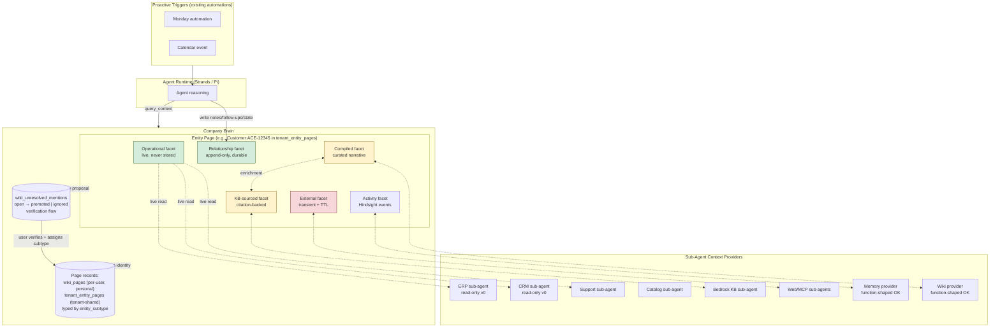

# Company Brain v0 (Reframe of Context Engine)

## Problem Frame

The 2026-04-28 Context Engine plan delivered a shared `query_context` primitive that fans out across Hindsight, wiki, workspace files, Bedrock KB, and approved MCP tools, with admin-governed adapter configuration and an MCP facade for external agents. That foundation is shipped or shipping.

The product goal has now sharpened past "enterprise search router." The Brain's job is to **pair LastMile sales reps with agents that do routine work for them** — triaging cold opportunities, prepping one-pagers before meetings, drafting check-ins. For agent output to be good enough that reps trust it, the agents need rich, current, trust-graded context that survives rep turnover.

This reframes the surface: the Brain is primarily an **agent-feeding substrate** with a secondary browseable view for reps to verify and correct. The compounding write-back loop and the operational-data integration are the product. Search is one read pattern among many.

The reframe also surfaces three things the current plan is light on:

1. **Sub-agent per provider** as the canonical provider shape (current plan implements providers as direct function calls — fine for DB lookups, insufficient for ERP/CRM/support systems with real quirks).
2. **Closed-loop write-back into the Brain** (current plan defers all writes via `act_on_context`).
3. **Page identity bound to canonical page records** (existing per-user `wiki_pages` for personal pages, plus a new tenant-scoped `tenant_entity_pages` table for shared entities like Customer/Opportunity/Order) rather than emergent from agent inference, so knowledge accumulates against stable identifiers instead of fragmenting into orphan topics. Entity typing rides on a new `entity_subtype` field; new entities go through the existing `wiki_unresolved_mentions` verification flow before becoming pages.

---

## Actors

- A1. LastMile sales rep — primary user; works alongside the agent in the mobile app.
- A2. AI agent paired with rep — reads Brain to ground output; writes Brain to capture relationship state from each interaction.
- A3. Sub-agent context provider — one per source (Memory, Wiki, KB, Workspace Files, ERP read, CRM read, support cases, catalog); owns the source's auth, pagination, schema, rate limits, and result normalization.
- A4. New rep onboarded onto an existing book — receives an agent-generated briefing on each account from accumulated Brain state.
- A5. Tenant admin — governs which adapters and KBs are live, approves MCP tools, curates ontology types.
- A6. Existing automations runtime — EventBridge-driven triggers that invoke agents against the Brain on schedule or signal.

---

## Key Flows

- F1. Cold-opportunity triage
  - **Trigger:** Monday morning automation runs for each rep.
  - **Actors:** A6, A2, A3, A1
  - **Steps:** Automation invokes the rep's agent with a "triage open opportunities" task. Agent calls `query_context` to fetch opportunities (operational facet via ERP sub-agent), recent activity (activity facet from Hindsight), and prior context per opp (relationship facet from tenant-scoped Customer/Opportunity pages). Agent writes a ranked list with "why cold" annotations per opp as a message in the rep's recurring triage thread. Push notification fires on thread update.
  - **Outcome:** Rep gets a Monday push notification, opens the thread, sees a prioritized triage with reasoning, and can ask follow-ups inline.
  - **Covered by:** R1, R8-R11, R19, R20, R24

- F2. Pre-meeting one-pager
  - **Trigger:** Calendar event 30 minutes before a meeting with a customer contact.
  - **Actors:** A6, A2, A3, A1
  - **Steps:** Automation invokes the rep's agent with the meeting context. Agent resolves the customer entity via `wiki_unresolved_mentions` lookup or direct page reference, queries the Brain for that entity's compiled facet, recent activity, open promises, and KB-sourced facts (product specs, contract terms). Agent writes a structured one-pager as a message in a per-meeting (or per-customer) thread. Push notification fires.
  - **Outcome:** Rep gets a pre-meeting push, opens the thread, walks into the meeting with current context, talking points, and landmines.
  - **Covered by:** R2, R5, R8-R11, R16, R19, R20, R24

- F3. Closed-loop write-back from interaction
  - **Trigger:** A meaningful agent or rep interaction completes (call ends, email sent, opp updated).
  - **Actors:** A2, A1
  - **Steps:** Agent distills the interaction into structured updates: notes, follow-ups, decisions, relationship-state changes. Writes them to the entity's relationship facet with citations back to the activity facet (raw Hindsight). Rep sees the captured updates in the entity's page; can edit or reject.
  - **Outcome:** The Brain compounds without the rep typing. Knowledge survives rep turnover.
  - **Covered by:** R12, R13, R23, R25

- F4. KB-backed enrichment on gap
  - **Trigger:** Agent (or rep search) hits a topic where the compiled facet is empty or stale.
  - **Actors:** A2, A3
  - **Steps:** Agent invokes the KB sub-agent and (if relevant) external sub-agents. KB hits with citations get promoted into the compiled facet of the relevant entity page. Web/MCP hits land in the external facet pending promotion logic.
  - **Outcome:** The Brain self-fills from trusted internal corpora first, transient sources second, with provenance preserved.
  - **Covered by:** R16, R17, R18

- F5. New rep onboarding briefing
  - **Trigger:** A new rep is assigned an account and asks the agent to brief them.
  - **Actors:** A4, A2
  - **Steps:** Agent reads the entity's relationship facet, recent activity, open promises, and decision-maker map. Renders a narrative briefing the new rep can absorb in minutes.
  - **Outcome:** New rep starts informed instead of cold-calling existing customers.
  - **Covered by:** R12, R23, R27, R28

- F6. Entity verification by user
  - **Trigger:** Agent proposes a new entity (a person, project, concept) that doesn't yet exist in the ontology.
  - **Actors:** A1, A2, A5
  - **Steps:** Proposed entity surfaces as pending verification in the rep's app. Rep accepts (creates ontology entity, agent writes facets), edits (corrects type/relationships), or rejects (agent discards or stores at lower trust).
  - **Outcome:** Ontology stays clean; trust is human-anchored at creation; agent learns to propose better.
  - **Covered by:** R21, R22, R23

---

## Requirements

**v0 wedge tasks**
- R1. Cold-opportunity triage runs as an automation-triggered task. Output lands in an agent thread (per-rep, e.g., a recurring "Weekly Triage" thread) with a push notification on update. The ranked list with per-opportunity "why cold" reasoning is the agent's thread message; it is grounded in Brain facets.
- R2. Pre-meeting one-pager runs from a calendar trigger. Output lands in a thread (per-meeting or per-customer) with a push notification. The structured customer brief is the agent's thread message; it is grounded in operational, relationship, activity, and KB-sourced facets.

**Identity, facets, and trust gradient**
- R3. Every Brain page is identified by exactly one canonical record: either (a) a row in the existing per-user `wiki_pages` table (personal pages — concepts, reflections, drafts) or (b) a row in a new tenant-scoped `tenant_entity_pages` table (shared entities — Customer, Opportunity, Order, Person, etc.). Identity binds 1:1 to one of these page records.
- R4. Pages compose typed facets: **operational** (live system-of-record data, never stored in Brain), **relationship** (append-only durable state — promises, landmines, decision-makers, prior objections), **activity** (Hindsight-backed event log), **compiled** (curated narrative), **KB-sourced** (snapshots from Bedrock KB with citation), **external** (transient web/MCP snapshots with TTL and provenance).
- R5. The Brain enforces a trust gradient when surfacing facts: operational > relationship/compiled > KB-sourced > external. Lower-trust facets cannot override higher-trust ones in agent reasoning without explicit reconciliation.
- R6. Every fact carries source citation and an "as of" timestamp visible to both agents and reps.

**Sub-agent context providers**
- R7. Each context source is fronted by a sub-agent provider that owns the source's auth, pagination, schema, rate limits, and error handling.
- R8. Sub-agent providers normalize hits to the existing Context Engine result contract (R11 in the 2026-04-28 brainstorm).
- R9. v0 sub-agents are read-only. The provider contract is designed with a write-capable shape so v1+ can add operational writes without re-architecting.
- R10. Sub-agents fail isolated: a single source outage shows as provider status, not a query failure.
- R11. Sub-agents replace the function-shaped providers in `packages/api/src/lib/context-engine/providers/` for any source with non-trivial quirks (ERP, CRM, support, catalog at minimum). Memory/Wiki/Workspace-Files may stay function-shaped if their quirks are genuinely thin.

**Closed-loop write-back (Brain only in v0)**
- R12. Agents write notes, follow-ups, decisions, and relationship-state updates directly to the relevant entity's relationship facet without rep manual entry.
- R13. Rep can audit, edit, or reject any agent-written fact from the entity's page in the mobile app.
- R14. Brain writes capture provenance (which interaction produced them, which agent, when).
- R15. v0 Brain writes are scoped to the Brain itself. Writes to external systems of record (ERP, CRM, support) are explicitly out of scope for v0.

**KB and external enrichment**
- R16. Bedrock KB is a privileged enrichment source: KB hits with citations may auto-promote into the compiled facet of the relevant entity page.
- R17. Web/MCP enrichment lands in the external facet only; promotion to compiled facet requires an explicit agent reasoning step or human approval.
- R18. Enrichment runs both reactively (on agent gap during a query) and proactively (scheduled via automations to fill priority entities).

**Proactive triggers via existing automations**
- R19. v0 wedge tasks (triage, one-pager) are invoked by the existing automations runtime (EventBridge-based per `2026-04-26-007`), not by rep-initiated chat.
- R20. The Brain is reachable from automation-invoked agents using the same `query_context` and write contracts as interactive chat agents.

**Entity typing, sharing, and verification**
- R21. Entity typing uses the existing 3-type page model (`type: 'entity' | 'topic' | 'decision'`) for page **shape** (which sections and semantics a page gets), plus a new `entity_subtype` field (`'customer' | 'opportunity' | 'order' | 'person' | 'concept' | …`) for **semantic** type. Compile rules and section templates dispatch on subtype. A user-extensible formal ontology is deferred to v1+.
- R22. Agent-proposed entities not yet present as pages surface as pending verification through the existing `wiki_unresolved_mentions` flow (status: `open` → `promoted` | `ignored`, with alias resolution and trigram fuzzy matching via `wiki_page_aliases`). Promotion creates the canonical page record and assigns `entity_subtype` at the same step. No orphan pages are created without going through this flow.
- R23. Users can verify, edit, or reject entity proposals from the existing unresolved-mentions surface (extended with subtype assignment). Verification status flows into the trust gradient: pending mentions never appear in agent reads as authoritative facts.
- R29. Tenant-scoped shared entities live in a new `tenant_entity_pages` table parallel to (not replacing) per-user `wiki_pages`. The new table has no `owner_id`. The existing v1 owner-scoping invariant on `wiki_pages` (and its compiled-memory siblings) is preserved unchanged. The Brain provider reads from both tables when assembling page context; trust gradient decides precedence on overlap.
- R30. Adding `entity_subtype` is an additive migration on both `wiki_pages` (nullable) and `tenant_entity_pages` (the new table — populated from creation). Backfill of existing `wiki_pages` is best-effort; null subtype is acceptable for legacy pages.

**Mobile rep-facing surface**
- R24. Agent output (triage list, one-pager) lands in an existing agent thread, surfaced via push notification on thread update. No new "Brain" tab or dedicated surface is required for v0 — the existing thread UI is the delivery mechanism.
- R25. Rep can open any entity page (`wiki_pages` or `tenant_entity_pages`), see all facets with trust labels, and edit/reject any agent-written content using the same UI affordances the thread UI already provides for thread messages.
- R26. Rep can ask follow-up questions inline by replying in the same thread the agent posted to. The thread carries entity references so the agent's follow-up calls to `query_context` retain the relevant scope.
- R31. Email is an optional alternative delivery channel for automations whose recipients are not actively in the mobile app (e.g., manager digests, weekly rollups). v0 does not require email delivery for triage or one-pager.

**Continuity and onboarding**
- R27. Durable knowledge survives rep turnover via tenant-scoped facets on `tenant_entity_pages`, not via threads. Working threads (Monday triage, per-meeting one-pager) may be per-rep and can be discarded on reassignment; per-entity threads (when used) carry interaction history but are not the source of truth for relationship facts.
- R28. New reps can request an agent-generated briefing on any account; the agent reads accumulated relationship/compiled/activity facets from `tenant_entity_pages`, not the prior rep's per-user wiki or per-rep working threads.

---

## Acceptance Examples

- AE1. **Covers R1, R8-R11, R19.** Given a rep has 8 open opportunities aged 30+ days, when the Monday automation runs, the rep's mobile app shows a ranked list with a "why cold" sentence per opportunity citing the operational facet (e.g., "no order in 47 days") and the relationship facet (e.g., "decision-maker requested pricing revision Mar 12, never followed up").

- AE2. **Covers R2, R5, R16.** Given a rep has a 9am meeting with Customer X's COO, when the calendar trigger fires at 8:30am, a one-pager appears citing live order status (operational), open promises and last-call summary (relationship/activity), and product-specific terms from the master agreement PDF (KB-sourced) — with each section labeled by trust level.

- AE3. **Covers R12-R14.** Given the rep ends a call captured in Hindsight where they promised the customer a delivery-window update by Friday, when the call ends, a follow-up titled "Send Customer X delivery-window update" appears in the customer's relationship facet with a citation back to the call activity, no rep typing required.

- AE4. **Covers R16, R17.** Given an agent enriches a Concept page about "vendor X regulatory change" by hitting both Bedrock KB (which has the actual filing PDF) and websearch (which has news commentary), the KB excerpt promotes into the compiled facet with citation; the news commentary stays in the external facet labeled with source URL and timestamp.

- AE5. **Covers R23, R27, R28.** Given a previous rep handed off Customer X with 3 years of relationship history in the Brain, when a new rep asks "brief me on Customer X," the agent returns a narrative including ownership transitions, prior pricing concessions, and current open commitments, drawn from the relationship facet — not from the prior rep's calendar or DMs.

- AE6. **Covers R10, R6.** Given the ERP sub-agent is rate-limited mid-query, when the agent renders a one-pager, the operational facet section shows "stale, last refreshed 18m ago" with a retry affordance rather than failing the whole page.

- AE7. **Covers R22, R3, R21.** Given an agent encounters a person in a transcript ("Karen at procurement") not yet present as a page, when the agent attempts to attach a note about Karen, a row appears in `wiki_unresolved_mentions` with `suggested_type: 'entity'`, `entity_subtype: 'person'`, and the rep sees a pending entity proposal ("Person: Karen at Customer X procurement?") in the verification UI. Promotion creates the canonical `tenant_entity_pages` row (because Person is a tenant-scoped entity) and links the note to it.

- AE8. **Covers R29, R3, R27.** Given Rep A captured 18 months of relationship facts about Customer X in the tenant-scoped Customer page, when Rep A leaves and Rep B is assigned to the account, Rep B opens Customer X's page and sees the full accumulated relationship facet (decision-makers, prior objections, open promises) without any data migration or handoff step — because the page lives in `tenant_entity_pages`, not in Rep A's per-user `wiki_pages`.

---

## Success Criteria

- One LastMile sales rep uses triage + one-pager weekly for 4 consecutive weeks and reports time saved or progressed deals attributable to the Brain.
- An onboarding scenario test (real or simulated) shows a new rep getting a usable account briefing in <5 minutes vs. hours of cold ramp-up.
- Agent output quality measurably improves between week 1 and week 4 of dogfood as the Brain compounds (judged by rep edit rate on agent-written notes).
- No external-system writes occur in v0 (verified by audit of sub-agent surface area).
- The sub-agent provider contract is reusable: adding one new source (e.g., support-case sub-agent) requires no changes to the core Context Engine service.
- Planning can proceed without re-deciding wedge tasks, identity model, trust gradient, write-back scope, or proactive trigger integration.

---

## Scope Boundaries

### Deferred for later

- Operational system writes (ERP, CRM, support, catalog mutations) — sub-agents are designed to support this in v1+ but ship read-only.
- Quarterly check-in drafting and other outbound communication generation — held until Brain is trusted in lower-stakes tasks.
- Schema-on-demand for novel knowledge types (Scout's `scout_<thing>` pattern) — v0 relies on the existing ontology for entity types.
- Voice or push-to-talk Brain interaction.
- First-party Slack, Drive, Gmail, GitHub, Calendar providers — arrive only via approved MCP or Bedrock KB in v0.
- Multi-tenant domain packs across non-LastMile verticals — ship LastMile first; abstract later if a second vertical materializes.
- Auto-promotion of external (web/MCP) facts into compiled facet without a reasoning gate.
- Cross-rep aggregations ("which accounts in our portfolio show the same risk pattern?") — useful but secondary.

### Outside this product's identity

- A general-purpose Notion-style wiki for human-only knowledge capture. The Brain is agent-substrate first.
- A unified vector index that ingests every source as the primary architecture. Live federation + entity-anchored facets is the bet.
- A pure CRM that competes with LastMile customers' existing operational ERP/CRM. The Brain rides on top of those, not against them.
- An agent platform that operates without a Brain — agents are the consumers, not the product.
- An "Ask anything" search bar as the primary UX. Search exists but the wedge is agent-completed tasks, not user-initiated lookups.

---

## Key Decisions

- **Brain is agent-substrate first, browse-surface second.** Output quality for agent-completed tasks is the primary metric; the rep-facing UI is for verification and correction.
- **Pages are projections of canonical page records, not orphan topics.** Identity binds 1:1 to either a per-user `wiki_pages` row or a tenant-scoped `tenant_entity_pages` row. Fixes the orphan-topic-sprawl risk Scout's pattern is vulnerable to.
- **Entity typing is `entity_subtype`, not a formal ontology.** Existing 3-type page model (`entity` / `topic` / `decision`) describes page shape; new `entity_subtype` field describes semantic type (`customer` / `opportunity` / `order` / `person` / etc.). User-extensible ontology deferred to v1+.
- **Sharing model is a parallel `tenant_entity_pages` table, not a refactor of `wiki_pages` scope.** Preserves the existing v1 owner-scoped invariant on per-user wiki, doesn't wait for the deferred `scope_type` infrastructure, and matches reality (a Customer is a tenant entity, not a personal one).
- **Verification reuses `wiki_unresolved_mentions` promotion flow**, extended to assign `entity_subtype` at promotion time and to write into `tenant_entity_pages` when the subtype is tenant-scoped (Customer, Opportunity, Order, Person) vs `wiki_pages` when personal (Concept, Reflection).
- **Trust gradient is an architectural primitive, not a UI nicety.** Operational > relationship/compiled > KB-sourced > external. Drives both rendering and agent reasoning priority.
- **Sub-agent per provider is the canonical shape.** Function-shaped providers stay only for sources whose quirks are genuinely thin (Memory, Wiki, Workspace Files).
- **v0 writes are Brain-only.** External system writes deferred to v1+. Sub-agent contract designed for write capability so v1 adds, not refactors.
- **Bedrock KB is enrichment substrate, not just a peer fan-out target.** KB hits with citation may auto-promote into compiled facet; web hits stay in external facet.
- **Proactive triggers reuse existing automations runtime.** v0 wedge tasks (triage, one-pager) fire from EventBridge per the activation work, not from new platform infrastructure.
- **Wedge is triage + one-pager.** Triage proves compounding value; one-pager proves rep-facing polish. Quarterly check-in (and other outbound) waits.
- **Borrow from Scout, don't clone it.** Adopt: sub-agent providers, scheduled triggers, closed-loop write-back, citation-first results. Keep distinct: operational facet, admin governance, multi-runtime parity, page-record-anchored identity (via `wiki_pages` + `tenant_entity_pages`), hybrid live+KB stance.
- **Wedge output rides existing threads + push, not a new Brain UI.** Automations write to threads; thread updates fire push notifications; rep audit/edit/follow-up reuses existing thread UX. No dedicated "Brain inbox" or "Brain tab" in v0. Email delivery is an optional channel for non-mobile recipients.
- **Working threads (per-rep) and durable knowledge (tenant-scoped pages) are separate.** Threads can be discarded; relationship facets on `tenant_entity_pages` are the continuity substrate. New-rep onboarding briefings are generated from page facets, not from prior threads.

---

## Dependencies / Assumptions

- The 2026-04-28 Context Engine plan is shipped or shipping (provider registry, normalized hits, MCP facade, admin governance per `2026-04-29-003`). This brainstorm extends rather than replaces it.
- The existing wiki schema (`packages/database-pg/src/schema/wiki.ts`, verified 2026-04-29) provides: a 3-type page system (`entity` / `topic` / `decision`), `wiki_page_aliases` with trigram fuzzy matching, `wiki_unresolved_mentions` with `open` → `promoted` | `ignored` lifecycle and `suggested_type`, typed page-to-page links (`reference` / `parent_of` / `child_of`), and a specialized `wiki_places` table. There is **no formal user-extensible ontology**; the schema author was explicit (`wiki.ts:101`) that tags are "never treated as ontology." Brain v0 builds on this existing infrastructure plus the `entity_subtype` column and the new `tenant_entity_pages` table.
- The existing per-user `wiki_pages` v1 owner-scoping invariant ("Every compiled object is strictly owner-scoped … no `owner_id IS NULL` escape hatch … team/company scope deferred") is preserved unchanged. Brain v0 introduces tenant-shared storage as a parallel additive table, not by widening existing scope.
- Hindsight banks are also user-keyed (per `packages/api/scripts/hindsight-bank-merge.ts`); cross-user activity facets for tenant entities will need explicit consideration during planning.
- The automations runtime (EventBridge → agent invocation) per `2026-04-26-007` can invoke agents that call the Context Engine service and write to the Brain.
- Hindsight provides the activity facet substrate.
- The compiled wiki provides the compiled facet substrate; the same compile pipeline can be extended to produce KB-sourced and external facets with appropriate provenance.
- Bedrock KB integration exists and supports the citation-backed retrieval shape needed for KB-sourced facets.
- LastMile's ERP exposes a queryable surface (REST, SOAP, or other) reachable by a sub-agent provider — concrete integration path is a planning concern.
- One LastMile rep is willing to dogfood weekly for 4+ weeks. Without this, success criteria can't be measured.

---

## Visual Aid

Trust gradient (green → yellow → red) shows what the agent privileges when forming output.

---

## Outstanding Questions

### Resolve Before Planning

- None.

> **Resolved 2026-04-29 (per dialogue):**
> - *Ontology API surface:* No formal ontology. Entity typing is the existing 3-type page model + new `entity_subtype` field; verification reuses `wiki_unresolved_mentions`; tenant sharing uses a new parallel `tenant_entity_pages` table. See R21–R23, R29, R30 and Dependencies / Assumptions.
> - *Automations integration:* Automations write to agent threads (and optionally email). Existing thread infrastructure carries the message; push notifications fire on thread update. No new wiring required. See R1, R2, R19, R20, R24, R31.
> - *Mobile placement:* Output lands in the existing thread UI via push notification. No new "Brain" tab needed for v0. See R24, R26.
> - *Sync vs async audit:* Mobile UI handles thread communication; rep audit/edit/follow-up reuses the existing thread UX. No new sync vs async UX decision required. See R25, R26.

### Deferred to Planning

- [Affects R7-R11][Technical] Concrete sub-agent provider contract: process model (separate Lambda? in-process? AgentCore container?), prompt shape, sandbox boundary, observability hooks.
- [Affects R5, R6][Technical] Trust gradient encoding: prompt-level (system message tells agent the order), schema-level (response shape carries trust labels the agent must respect), or both.
- [Affects R16, R17][Technical] KB-to-compiled-facet promotion algorithm: confidence threshold, dedupe across multiple KB hits, conflict resolution against existing compiled facts.
- [Affects R12-R15][Technical] Brain write storage model: extend the existing wiki compile pipeline, dedicated facet tables, hybrid? Affects how facets are versioned and audited.
- [Affects R6][Technical] Citation/provenance shape per facet — needs to round-trip through agent reads without bloating context.
- [Affects R26, R27][Needs research] Per-entity persistent thread state: how much context can be carried in long-running threads without quality degradation; is this a thread-scope concern or a Brain-scope concern.
- [Affects R10][Technical] Sub-agent failure semantics for partial operational facet: which fields are stale-tolerant vs. critical-fresh; how the agent should reason about gaps.

---

## Next Steps

`-> /ce-plan` for structured implementation planning. The plan should build on the existing 2026-04-28 Context Engine plan (provider registry, normalized hits, MCP facade, admin governance) rather than replacing it, and should sequence the new work into shippable phases — likely:

1. Schema additions: `entity_subtype` on `wiki_pages`; new `tenant_entity_pages` table with facets storage.
2. Sub-agent provider contract definition; convert ERP/CRM/support providers from function-shaped to sub-agent-shaped.
3. Brain write surface: agent capture into relationship facets on `tenant_entity_pages`.
4. KB enrichment promotion logic (KB → compiled facet, web/MCP → external facet).
5. Wedge integration: cold-opp triage automation + thread delivery; pre-meeting one-pager calendar trigger + thread delivery.
6. Verification UX: extend `wiki_unresolved_mentions` flow with subtype assignment and tenant-vs-personal routing.
7. Evals + dogfood: weekly use by one rep for 4 weeks, edit-rate measurement, success-criteria validation.
