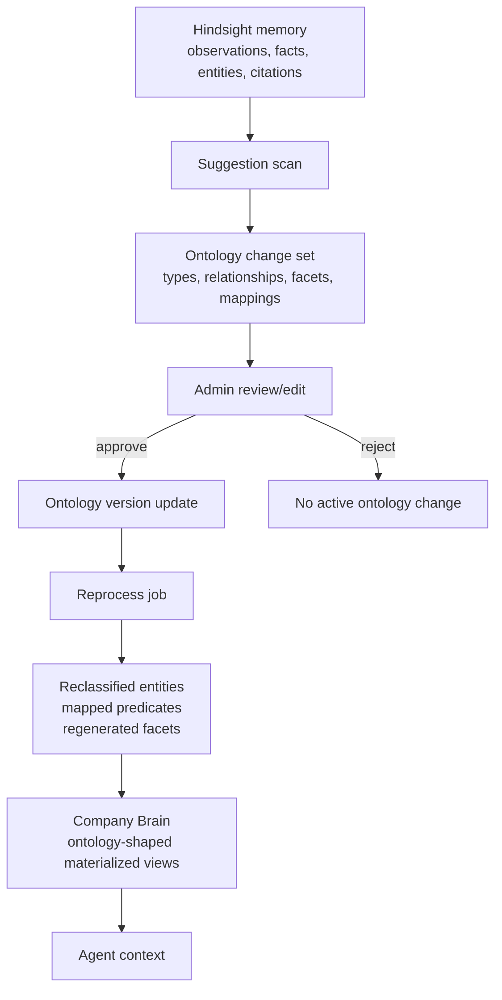

# Business Ontology Change Sets

## Problem Frame

Company Brain currently feels like a hodgepodge: durable memory, compiled wiki pages, graph edges, enrichment, provider routing, and admin inspection all blur together. Hindsight is the solid memory substrate, but the wiki compile path asks the LLM to decide page identity, page shape, sections, relationships, and summaries at the same time. That makes Company Brain feel like a second, loosely governed memory system instead of a trustworthy materialized view of what the enterprise knows.

The business ontology layer should make that boundary explicit. Hindsight remains the source of observed memory, extracted facts, entities, and citations. The ontology defines business meaning: approved entity types, relationship types, page/facet templates, aliases, predicate mappings, provenance expectations, and external vocabulary mappings. Company Brain pages become ontology-shaped materialized views over Hindsight-backed memory, regenerated when the ontology evolves.

The highest-leverage v1 feature is an ontology suggestion and reprocessing loop. The system should notice recurring business patterns, group related suggestions into reviewable change sets, let admins edit and approve those change sets, and then reprocess affected memory/entities/pages so the Brain improves retroactively.

---

## Actors

- A1. Tenant admin / business ontology owner: Reviews, edits, approves, rejects, and deprecates ontology change sets.
- A2. ThinkWork agent: Uses Company Brain context shaped by the approved business ontology.
- A3. Hindsight memory layer: Stores and retrieves observations, extracted facts, entities, and source evidence.
- A4. Ontology suggestion engine: Detects recurring types, relationships, facets, aliases, and mappings from observed memory patterns.
- A5. Company Brain compiler: Materializes tenant entity pages and facets from Hindsight memory through approved ontology templates.
- A6. ThinkWork operator: Supports rollout, monitors reprocessing health, and helps recover failed change-set applications during early dogfood.

---

## Key Flows

- F1. Suggest ontology change set from observed business patterns
  - **Trigger:** Scheduled scan, admin-triggered scan, or post-retain/compile threshold detects repeated unmodeled patterns.
  - **Actors:** A3, A4
  - **Steps:** The suggestion engine reads observed Hindsight entities/facts, current tenant entity pages, external references, and existing approved ontology. It clusters related findings into a coherent draft change set such as "Customer commitment model" or "Support case awareness." The draft includes proposed entity types, relationships, facets/templates, alias/predicate mappings, evidence examples, confidence, and estimated reprocessing impact.
  - **Outcome:** A draft change set is ready for admin review instead of a noisy list of disconnected suggestions.
  - **Covered by:** R1, R2, R3, R8, R9

- F2. Review and approve a change set
  - **Trigger:** Tenant admin opens an ontology change set in Company Brain / Ontology Studio.
  - **Actors:** A1, A4
  - **Steps:** Admin reviews the change-set summary, inspects evidence and examples, edits line items, removes weak suggestions, optionally adds external ontology mappings, and approves or rejects the full change set. Individual suggestions are editable, but approval applies at the change-set level.
  - **Outcome:** Approved change sets become durable ontology updates with audit trail; rejected change sets do not affect the active ontology.
  - **Covered by:** R4, R5, R6, R7, R11, R12

- F3. Apply ontology update and reprocess affected Brain views
  - **Trigger:** Admin approves an ontology change set.
  - **Actors:** A3, A5, A6
  - **Steps:** ThinkWork records the approved ontology version/change set, identifies affected memories/entities/pages, queues a reprocess job, reclassifies or remaps relevant observations, and regenerates affected Company Brain pages/facets using approved templates. Operators can inspect progress, failures, and before/after impact.
  - **Outcome:** Company Brain reflects the approved ontology without synchronous admin waiting, and every changed page remains source-cited.
  - **Covered by:** R13, R14, R15, R16, R17, R18

- F4. Agent uses ontology-shaped Company Brain context
  - **Trigger:** An agent asks for context about a customer, person, opportunity, order, risk, commitment, or similar business object.
  - **Actors:** A2, A3, A5
  - **Steps:** Context retrieval reads Hindsight-backed memory and ontology-materialized Brain pages/facets. Approved types and templates decide what gets surfaced and how facts are grouped. Lower-trust sources cannot silently override higher-trust operational or relationship facts.
  - **Outcome:** Agent context is structured, cited, and business-meaningful rather than an ad hoc wiki summary.
  - **Covered by:** R19, R20, R21, R22

---

## Requirements

**Product model**

- R1. Hindsight remains the source memory substrate for observations, extracted facts, entities, and citations; the ontology layer must not become a parallel raw-memory store.
- R2. Company Brain pages and facets are treated as ontology-shaped materialized views over Hindsight-backed memory, not as a separate memory system whose structure is invented during each compile.
- R3. The v1 ontology is business/domain-scoped. Agent-work ontology objects such as proposals, plans, runs, PRs, and review comments are explicitly deferred to Symphony ETL or later agent-work substrate work.

**Ontology definitions**

- R4. Tenant admins can manage business entity types with lifecycle states: proposed, approved, deprecated, and rejected or equivalent terminal rejection.
- R5. Tenant admins can manage business relationship types with lifecycle states, aliases, inverse names when useful, guidance notes, and source/target type constraints.
- R6. Tenant admins can manage entity page/facet templates that define how approved entity types materialize into Company Brain views.
- R7. Canonical ThinkWork ontology names remain practical and product-native; external ontology standards are represented as optional mappings, not as the internal source of truth.

**Change sets and suggestions**

- R8. The system proposes ontology changes from observed patterns, including candidate entity types, relationship types, facets/templates, aliases, predicate mappings, and entity-resolution concerns.
- R9. Related suggestions are grouped into ontology change sets that explain a coherent business concept or modeling improvement.
- R10. Individual suggestion line items remain editable/removable inside a change set, but approval, audit, and reprocessing happen at the change-set level.
- R11. Every change set includes evidence examples, source citations or source references, confidence, observed frequency, and expected impact in language an admin can evaluate.
- R12. Admins can approve, reject, edit, deprecate, or hold a change set without silently mutating the active ontology.

**Reprocessing and materialization**

- R13. Approving a change set queues an asynchronous reprocess job rather than synchronously rewriting memory/pages during the review action.
- R14. Reprocessing identifies impacted memories, extracted entities, relationship candidates, tenant entity pages, and facets before applying changes.
- R15. Reprocessing can reclassify entities, map observed predicates to canonical relationships, add or revise facets, and regenerate affected Company Brain pages.
- R16. Reprocessing preserves provenance: every generated or changed facet remains traceable to source memory, external reference, or curated admin input.
- R17. Reprocessing produces observable status, errors, retry behavior, and a before/after impact summary for the approved change set.
- R18. Failed reprocessing does not partially promote untrusted ontology state as if it had applied cleanly; admins/operators can see and recover failed applications.

**Agent-facing context**

- R19. Approved ontology templates determine the primary shape of Company Brain entity pages and facets for agent retrieval.
- R20. The compiler should render approved structure instead of discovering structure from scratch on each run.
- R21. Trust/facet precedence remains explicit: operational facts outrank durable relationship/compiled facts, which outrank KB/web/external enrichment unless a human or approved reconciliation path says otherwise.
- R22. Agent-facing context includes enough ontology labels, relationship meaning, and provenance that agents can reason over business objects without re-inferring the schema from prose.

**Standards and portability**

- R23. ThinkWork can attach external vocabulary mappings to canonical types and relationships using mapping kinds such as exact, close, broad, narrow, or related.
- R24. Standards mappings are used for interoperability, import/export, customer data mapping, and credibility, but they do not force ThinkWork to adopt external ontology naming or modeling wholesale.
- R25. Vertical/domain ontology packs are allowed later, but v1 should prove the loop on a small business ontology before broad standards coverage.

---

## Acceptance Examples

- AE1. **Covers R8, R9, R11.** Given Hindsight memory repeatedly contains promises, due dates, and follow-up obligations for customers, when the suggestion scan runs, it proposes a "Customer commitment model" change set with candidate type `commitment`, customer/person relationships, an `open_commitments` facet, and cited examples from source memory.
- AE2. **Covers R10, R12, R13.** Given an admin removes a weak relationship suggestion from a change set and approves the rest, when the approval is submitted, ThinkWork records the edited change set and queues one reprocess job for the remaining approved changes.
- AE3. **Covers R15, R16, R17.** Given an approved change set adds `risk` as a business entity type and a `risks_and_landmines` customer facet, when reprocessing completes, affected customer pages show the new facet with source citations and the change set shows how many pages changed.
- AE4. **Covers R7, R23, R24.** Given an admin maps ThinkWork's `customer` type to Schema.org `Organization` as a broad mapping, when agents or exports read the ontology, `customer` remains the canonical ThinkWork type while the external mapping is available as metadata.
- AE5. **Covers R19, R20, R22.** Given an agent asks for context before a customer meeting, when Company Brain retrieves the customer page, it returns ontology-shaped facets such as key people, open opportunities, commitments, risks, and recent activity instead of a generic wiki summary.

---

## Success Criteria

- Tenant admins can understand why a change set was proposed and what improves if they approve it.
- Company Brain pages become more predictable: page/facet shape follows approved ontology templates rather than per-run LLM improvisation.
- Approved ontology changes visibly improve old data through reprocessing, not only future extraction.
- Agents receive more structured, cited, business-meaningful context for customer/account work.
- A downstream `ce-plan` can design implementation units without re-deciding the Hindsight/Ontology/Company Brain boundary, approval granularity, reprocessing model, or standards stance.

---

## Scope Boundaries

### Deferred for later

- Agent-work ontology for proposals, plans, tasks, runs, artifacts, HITL questions, PRs, and review comments.
- Full standards conformance or native RDF/OWL/SKOS/FIBO/FHIR execution semantics.
- Rich vertical packs beyond a small initial business ontology.
- Cross-tenant ontology sharing or consortium pattern publication.
- Automatic operational writes back into ERP, CRM, support, or other systems of record.
- Multi-hop graph query products beyond what is needed to materialize and retrieve Company Brain facets.
- Customer-facing self-service ontology marketplace or external ontology import wizard.

### Outside this product's identity

- A generic semantic-web workbench for ontology experts.
- A replacement for Hindsight's memory extraction and retrieval engine.
- A human-authored Notion-style wiki where admins manually curate every page.
- A pure vector-search layer that ignores typed business meaning.
- An agent-work orchestration product inside core ThinkWork; that belongs with Symphony ETL or a later work substrate.

---

## Key Decisions

- Hindsight is memory; ontology is meaning; Company Brain is materialized view: This resolves the current boundary confusion and stops the wiki compiler from acting as an implicit ontology designer.
- Start with page/facet templates before making typed relationships the center: The immediate pain is inconsistent page shape. Relationships become more useful after entity types and facets are stable.
- Change sets are the approval unit: Ontology changes behave like business-schema migrations. Bundling related suggestions avoids weird partial states and lets reprocessing happen coherently.
- External standards are mapping targets, not the source of truth: ThinkWork keeps practical canonical vocabulary while preserving interoperability.
- Business/domain ontology stays in core ThinkWork; agent-work ontology waits: This keeps the first product loop focused on customer/business context rather than expanding into Symphony-style work management.
- Reprocessing is asynchronous and observable: Approval should not block on expensive rewrites, and operators need a recoverable trail when materialization fails.

---

## Dependencies / Assumptions

- Existing ThinkWork Company Brain and tenant entity page work provides a starting substrate for tenant-shared business pages and facets.
- Existing Hindsight integration remains the preferred memory engine for extraction, recall, and provenance-backed observations.
- The Maniflow Ontology Studio work is useful prior art but should be adapted rather than ported directly; ThinkWork's current page/facet model is different from Maniflow's Hindsight-entity-centered UI.
- The initial business ontology can start small and grow through change sets. The seed vocabulary is expected to include customer, person, opportunity, order, support case, commitment, risk, and decision or close equivalents.
- Admin review volume is manageable if suggestions are grouped into change sets with clear impact rather than shown as a long queue of raw predicates.

---

## Outstanding Questions

### Resolve Before Planning

_(None — scope is clear enough for planning.)_

### Deferred to Planning

- [Affects R4-R7][Technical] What exact storage model should represent active ontology versions, proposed change sets, and mappings in ThinkWork's current database layout?
- [Affects R8-R11][Technical] Which observed sources should v1 scan first: Hindsight records, tenant entity pages, external refs, or a staged combination?
- [Affects R13-R18][Technical] How should reprocessing jobs integrate with the existing compile/rebuild infrastructure without carrying forward the current wiki compiler's ad hoc structure decisions?
- [Affects R19-R22][Technical] What is the minimal compiler change that makes page/facet templates authoritative while preserving useful existing citations and enrichment behavior?
- [Affects R23-R25][Needs research] Which external vocabularies should seed default mappings for the small business ontology, and which should wait for vertical packs?

---

## Visual Aid

---

## Next Steps

-> /ce-plan for structured implementation planning.
