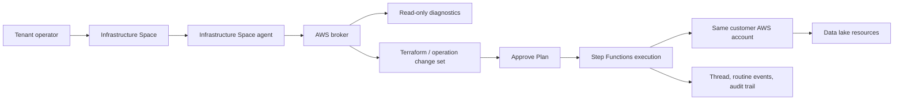

# Infrastructure Space for AWS Data Lake Management

## Problem Frame

Customers install their own ThinkWork stack in their own AWS account. They need to delegate AWS infrastructure work to a ThinkWork agent without handing raw credentials to the model or approving every individual API call. The first dogfood target is a customer data lake: Aurora, S3 imported-data buckets, Dagster on ECS, AWS Glue, Iceberg files, Athena, extraction schedules, monitoring, and ongoing management.

The product should make this feel like an agent-native infrastructure workroom: the agent can inspect AWS, propose a plan, get approval once, and then execute the approved plan through governed AWS access.

---

## Actors

- A1. Tenant operator: Approves infrastructure plans, configures autonomy mode, and reviews system health.
- A2. Infrastructure Space agent: Designs, diagnoses, plans, and executes customer AWS infrastructure work.
- A3. ThinkWork deployment: The customer-owned ThinkWork install that hosts the Space, broker, approvals, routines, and audit trail.
- A4. AWS account: The same customer AWS account where ThinkWork is installed and where the data lake resources are created.
- A5. Customer data team: Uses the resulting data lake, extraction schedules, queries, and monitoring outputs.

---

## Key Flows

- F1. Initial data lake setup
  - **Trigger:** Tenant operator asks the Infrastructure Space to create a data lake for a customer use case.
  - **Actors:** A1, A2, A3, A4
  - **Steps:** Agent inventories the AWS account, drafts the architecture, produces a change set, highlights IAM/cost/risk, requests approval, then executes the approved plan through Step Functions and the AWS broker.
  - **Outcome:** Data lake resources are deployed and recorded with run history, approval context, and rollback notes.
  - **Covered by:** R1, R2, R4, R6, R8, R9

- F2. Scheduled extractions
  - **Trigger:** Tenant operator or agent defines recurring source-data extraction needs.
  - **Actors:** A1, A2, A3, A4, A5
  - **Steps:** Agent creates or updates automation schedules in the Space, ties extraction jobs to data lake destinations, and reports each run into the Space thread/routine history.
  - **Outcome:** Data arrives on schedule and failures are visible in ThinkWork.
  - **Covered by:** R10, R11, R12

- F3. Health monitoring and incident response
  - **Trigger:** A webhook, scheduled health check, AWS event, or operator prompt indicates a data lake issue.
  - **Actors:** A1, A2, A3, A4, A5
  - **Steps:** Agent runs read-only diagnostics, correlates AWS signals, recommends remediation, and either executes pre-approved safe operations or requests plan approval for mutating repair.
  - **Outcome:** Operators can see what is broken, what changed, and whether the remediation stayed inside approved bounds.
  - **Covered by:** R3, R5, R7, R13, R14

- F4. Ongoing management
  - **Trigger:** A schema, storage, orchestration, query, or access-policy change is needed.
  - **Actors:** A1, A2, A3, A4, A5
  - **Steps:** Agent prepares a scoped plan, gets approval according to the Space autonomy mode, applies the plan, and updates docs/runbooks in the Infrastructure Space.
  - **Outcome:** The data lake evolves without unmanaged console drift becoming the normal path.
  - **Covered by:** R2, R4, R6, R8, R15

---

## Requirements

**Infrastructure Space and autonomy**

- R1. ThinkWork must provide an Infrastructure Space pattern for AWS infrastructure work inside a customer-owned ThinkWork install.
- R2. New Infrastructure Spaces must default to **Approve Plan** mode: mutating work requires approval of the plan as a whole, not approval of every individual implementation step.
- R3. The autonomy model must support at least `read_only`, `approve_every_step`, and `approve_plan` in v1, with room for later `trusted_operations`, `full_access`, and `custom_policy` modes.
- R4. An approved plan must define the execution envelope: goal, affected resources, allowed actions, expected resource changes, IAM impact, cost/risk notes, rollback notes, approver, and expiration or drift boundary.
- R5. If execution needs to exceed the approved envelope, touch new resources, materially change IAM, delete data, or apply a drifted plan, the agent must stop and request a new approval.

**AWS access and safety**

- R6. AWS access must be broker-mediated; raw AWS credentials must not be exposed to the model or general agent runtime.
- R7. The agent may run read-only AWS diagnostics without approval when allowed by Space policy.
- R8. Mutating AWS changes must be executed through approved change sets, routines, or narrowly typed operational tools, with thread/routine/audit records.
- R9. v1 AWS access is scoped to the same AWS account where the customer-owned ThinkWork stack is installed; cross-account onboarding is out of scope.
- R10. IAM mutations in v1 must be limited to ThinkWork-managed IAM resources, using required prefixes, tags, and permissions boundaries. The agent must not edit arbitrary existing customer IAM resources.

**Data lake proof of concept**

- R11. The first proof-of-concept must support initial setup for a customer data lake including Aurora, S3 imported-data buckets, Dagster on ECS, AWS Glue, Iceberg-backed storage, and Athena.
- R12. The agent must be able to configure scheduled extractions using existing ThinkWork Space automation primitives where possible.
- R13. The agent must monitor health through scheduled checks, webhooks, or AWS event inputs, and report health status in the Infrastructure Space.
- R14. The agent must support ongoing management tasks such as schema/table changes, extraction updates, orchestration updates, data-lake troubleshooting, and safe operational remediations.
- R15. Data lake management must preserve durable documentation in the Infrastructure Space: deployed resource inventory, runbooks, extraction schedules, known failure modes, and rollback/repair notes.

**Operator experience**

- R16. Approval UI must make high-risk changes obvious, especially IAM, destructive actions, public exposure, network access, data deletion, encryption changes, and cost-impacting resources.
- R17. Operators must be able to inspect what was approved, what was executed, what differed from the original plan, and what AWS evidence or CloudTrail references support the outcome.

---

## Acceptance Examples

- AE1. **Covers R1, R2, R4, R8, R11.** Given a new customer install with Infrastructure Space enabled, when the operator asks for the data lake setup, the agent produces one approve-plan request with the full resource plan instead of separate approvals for every Terraform or AWS SDK operation.
- AE2. **Covers R5, R10, R16.** Given an approved plan that creates S3 buckets and Glue resources, when execution discovers it must create a new IAM policy outside the ThinkWork-managed prefix/boundary, the agent stops and requests a revised approval.
- AE3. **Covers R7, R13.** Given the data lake is deployed, when a scheduled monitor detects Athena query failures or Glue crawler errors, the agent can read AWS health signals and summarize the issue without approval.
- AE4. **Covers R12, R14.** Given the customer needs a new nightly extraction, when the operator approves the plan, the agent creates the required automation and records the schedule, target dataset, and monitoring expectation in the Infrastructure Space.
- AE5. **Covers R6, R17.** Given an infrastructure change completes, when an operator reviews the run later, they can see approval details, executed steps, broker outputs, and AWS evidence without any raw AWS credentials appearing in the workspace.

---

## Success Criteria

- The next customer data lake can be planned, approved, deployed, monitored, and managed primarily through the Infrastructure Space.
- Operators approve meaningful plans rather than individual low-level API calls.
- AWS changes are auditable and bounded by broker policy, IAM boundaries, and approval envelopes.
- The implementation path reuses existing Spaces, automations, routines, Inbox approvals, credential handling, and audit patterns where possible.
- A downstream planner can split the work into shippable slices without inventing the autonomy model, first PoC scope, or IAM trust boundary.

---

## Scope Boundaries

- Cross-account AWS access is deferred; v1 targets the same AWS account as the installed ThinkWork stack.
- Shared/SaaS-hosted ThinkWork accounts are out of scope for this capability.
- Arbitrary customer IAM editing is out of scope for v1.
- Raw AWS CLI credentials inside the model/runtime are out of scope.
- Full autonomous AWS mutation without approvals is out of scope for v1, though the autonomy model should leave room for a future advanced mode.
- The first PoC focuses on the data lake path, not every AWS service.
- The agent should not bypass ThinkWork approvals by using direct console-style mutation tools outside the broker.

---

## Key Decisions

- Infrastructure work happens in a dedicated Infrastructure Space because Spaces already model local context, tool policy, automations, knowledge, and runtime constraints.
- `approve_plan` is the default autonomy mode because it avoids approval fatigue while preserving a human gate before mutation.
- AWS access is broker-mediated because typed tools, audit, and policy enforcement are safer than raw AWS CLI access in the agent runtime.
- v1 operates in the same customer AWS account as the ThinkWork install to avoid cross-account onboarding complexity during dogfood.
- IAM v1 is limited to ThinkWork-managed resources because the data lake needs IAM, but arbitrary IAM mutation is too risky for the first version.
- The data lake is the first vertical proof because it exercises provisioning, scheduling, monitoring, schema/table management, IAM, approvals, and operational remediation.

---

## Dependencies / Assumptions

- The customer install can opt into the Infrastructure Space capability during deployment.
- The deployed ThinkWork stack can provision an AWS broker role and permissions boundary through Terraform.
- Existing Spaces automations are sufficient for the scheduled extraction and monitoring entry points, or can be lightly extended.
- Existing routine approval and Inbox patterns can carry approve-plan requests.
- The data lake PoC can start with a bounded set of modules and operational tools rather than a generic AWS console replacement.

---

## Outstanding Questions

### Resolve Before Planning

- None.

### Deferred to Planning

- [Affects R11][Technical] Which exact data lake deployment artifact is the source of truth for v1: ThinkWork-managed Terraform modules, generated Terraform files stored in the Infrastructure Space, or a hybrid?
- [Affects R11, R14][Technical] Which operations should be first-class broker tools versus Terraform-only changes for the first customer PoC?
- [Affects R13][Technical] Which AWS health signals should be included in the first monitoring slice for Aurora, S3, Dagster/ECS, Glue, Iceberg, and Athena?
- [Affects R16, R17][Technical] What approval diff format best highlights IAM, destructive actions, public exposure, and cost risk without overwhelming the operator?

---

## Next Steps

-> /ce-plan for structured implementation planning.
