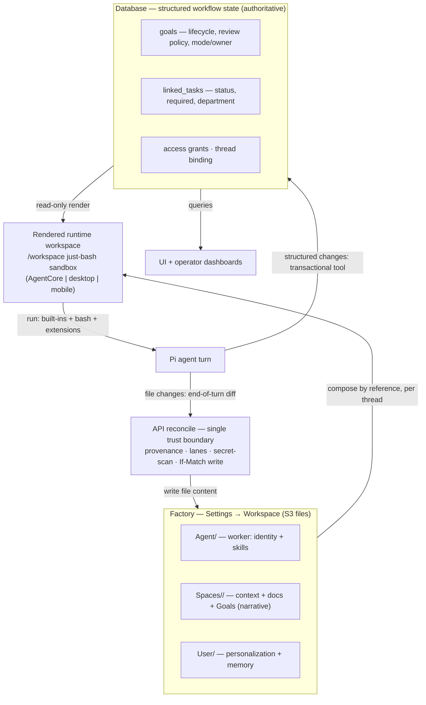

# Workspace + Agent-Turn Architecture (Simplification)

## Summary

Re-architect the workspace as three editable file source folders — **Agent** (the worker), **Spaces** (collaboration containers + Goals), **User** (personalization + memory) — that form the **factory**, shown in Settings → Workspace. When a thread is created, the three compose (by reference) into a **rendered runtime workspace** the agent executes in, via a `/workspace` `just-bash` sandbox identical on cloud, desktop, and mobile.

The core principle is a **clean ownership boundary, not a single store**: **S3 files own the agent's working and narrative content; the database owns structured workflow state** (goal/task lifecycle, status, review policy, access). No fact lives authoritatively in both, so there is no drift. The net-new build is the **reconcile path** that writes the file side back through the API; structured state keeps flowing through transactional database mutations, which is what a multi-writer world (automations, agent workers, and users acting concurrently) requires.

## Problem Frame

The workspace storage grew organically and carries three compounding problems.

**It's illegible.** The local folder tree bottoms out in raw UUIDs (and, where slugs exist, random petnames like `sleek-squirrel-230`). An operator can't map a folder to the entity a human knows.

**It's structurally muddled.** ~5 overlapping S3 prefixes, and the runtime "rendered" copy is materialized **per (agent × space × user) tuple** — the source of both deep nesting and duplication. No clean line between configuration and runtime.

**Authority overlaps between stores.** The same kind of fact lives, writably, in *both* Postgres rows and S3 files, and the two drift. This is the drift-prone core of the mess — and the key insight of this work is that **the fix is to remove the *overlap*, not to remove either store.** Each kind of data gets exactly one authoritative home.

## Ownership Model

This is the load-bearing concept — and the one the user documentation must explain clearly, because it is what makes everything else coherent.

**The rule: each kind of data has exactly one authoritative home. Authority is drawn by *data kind*, never by feature.**

| Data kind | Authoritative home | Examples | Why |
|---|---|---|---|
| **Working / narrative content** — what the agent reads, thinks in, and free-writes | **S3 files** (synced local copy) | memory, context, docs, agent-authored prose (decisions, handoff notes, artifacts) | The agent operates a filesystem; this content is plain text, editable, portable, diff-able. |
| **Structured workflow state** — relational, lifecycle-bearing, concurrently mutated | **Database** | goal lifecycle/status, task status/required/department, review policy, mode/owner, access grants, thread binding | Transactions, constraints, and concurrent-safe writes are exactly what a database provides — and what a multi-writer world demands. |

**The invariants that keep this drift-free:**

1. **No fact is authoritative in both stores.** Task status is database-only. A decision note is file-only.
2. **Status-bearing files are read-only projections.** `GOAL.md` and `PROGRESS.md` are *rendered from the database* — a one-way view the agent reads. The agent never changes status by editing a file.
3. **The agent mutates structured state only through a transactional tool** (which writes the database), never by writing a file. The agent mutates working content only by writing files (reconciled to S3).
4. **Projections are derived and rebuildable**, never independently authoritative — whether that's a database-rendered status file, or a file-listing index used for fast lookups.

The reason structured state sits in the database and not in files: **the system is multi-writer.** Automations trigger agent workers, multiple users act in a Space, and the agent process runs — concurrently. Single-writer-per-thread serializes one thread's turns but does nothing across automations and workers. Structured status under those conditions needs atomic transactions and constraints (e.g., "one active goal per thread"); LLM-authored markdown frontmatter is too fragile to be the authority for it.

## Key Decisions

- **Factory and runtime.** The factory is three editable *file* source folders (Agent, Spaces, User). Creating a thread composes them **by reference** into a rendered runtime workspace. Rendering is **per-thread**, never per `(agent × space × user)` tuple. The per-tuple permanent materialization — the explosion — dies.

- **Ownership by data kind (see Ownership Model).** S3 files own working/narrative content; the database owns structured workflow state. No overlapping authority, so no drift. This — not "eliminate the database" — is the real resolution of the S3↔DB tension.

- **Goals and tasks stay in the database, preserved.** The working Goals feature (`goals`, `linked_tasks`, review policy, the `reviewGoal` lifecycle, progress derived from task rows) is carried forward, not inverted to files and not rebuilt. This avoids regression and keeps structured state where concurrency and atomicity are safe. `GOAL.md` / `PROGRESS.md` remain database-rendered, read-only.

- **The reconcile path handles the file side only — and is the primary net-new build.** Writes the agent makes in `/workspace` do not reach S3 today (desktop cache is download-only; mobile snapshots to AsyncStorage; AgentCore persists only the transcript). Reconcile runs **through the API** as the single trust boundary: route each changed file to its owning source by path-provenance, enforce write-lanes, scan for inlined secrets, validate any frontmatter, and conditionally write S3. It extends the existing end-of-turn (`finalizeTurn`) callback. Structured-state changes never go through reconcile — they go through transactional mutations/tools.

- **Concurrency.** Structured state is protected by database transactions/constraints. File writes use **optimistic concurrency** (If-Match on ETag/version) with S3 versioning underneath; a stale write is rejected and the writer reloads — no locks, no CRDT. The per-thread session lock still serializes a thread's own turns.

- **`just-bash` `/workspace` is the universal turn substrate.** A turn is `compose → hydrate → run → reconcile`. `just-bash` is pure-JS, so the same sandbox runs on a Linux container, a Mac, and the iOS Hermes engine — that's why mobile reaches parity. (On-device *model inference* remains parked; Bedrock supplies inference on all hosts. Code Interpreter is an extra tool, not the sandbox.)

- **Legibility via human names, not generated slugs.** A node's folder is its human name (filesystem-sanitized), with a collision suffix only when needed. The stable identity stays a UUID held in the database; the path is the legible name.

- **Single agent.** A customer (tenant) shares one agent across its users. `department` on a task is a human-facing label, not an agent-routing key. Multi-agent orchestration is out.

- **Grounded in ICM** (the folder *is* the agent; plain text; configure-once / run-many; edit surfaces) — applied to the *file* substrate. Structured state living in the database is the deliberate, concurrency-driven extension ICM's single-owner model doesn't address.

- **Secrets by reference.** Secret material lives in Secrets Manager/SSM, referenced by pointer in files — never inlined. The reconcile secret-scan blocks inlined secrets before they reach S3.

- **Best-effort revocation + TTL.** Revoking access pushes a wipe signal; local copies carry a TTL and won't execute past it without re-confirming access. Offline within the window; "no live secrets in files" bounds the residual.

- **Clean migration.** No production users → a one-shot regenerate/cutover of the S3 file structure. No forward-compatibility dual-read/write window.

- **The honest ledger.**

  | Removed | Added |
  |---|---|
  | Per-tuple rendered explosion → per-thread render | **Reconcile / write-back path** for the file side — the big net-new build |
  | *Overlapping* authority between S3 and DB (the drift) | Provenance routing + lane enforcement in reconcile (reuses existing helpers) |
  | ~5 overlapping prefixes → 3 source folders + runtime | Secret-scan + frontmatter-validate in reconcile (small) |
  | UUID + random-petname illegibility → human names | Name-collision handling + TTL revalidation (small) |
  | Multi-agent blackboard / roster (not built) | — |

  The database is *not* removed; its role is clarified to "sole authority for structured state, never the file side." The duality is removed by drawing a clean ownership line.

### Composition, ownership, and turn model

## Actors

- A1. **User(s)** — humans; one or more per Space/thread. Each brings their own User source.
- A2. **The agent** — a single worker (shared per customer).
- A3. **Automations** — scheduled jobs, routines, webhooks that trigger agent workers; concurrent writers of structured state.
- A4. **Pi runtimes** — Pi AgentCore (cloud), Pi Local (desktop executor), Pi Mobile (Hermes). Share extensions and the folder contract.
- A5. **API reconcile / sync service** — the single trust boundary for file writes: provenance, lanes, secret-scan, conditional write, per-user view assembly.

## Key Flows

- F1. **Agent turn**
  - **Trigger:** Pi runs a thread turn.
  - **Steps:** compose Agent + Space + acting User by reference, plus database-rendered status files → hydrate `/workspace` → agent acts → file changes posted as an end-of-turn diff to the API (provenance, lanes, secret-scan, If-Match write); structured changes made through transactional tools against the database.
  - **Covered by:** R14–R18.

- F2. **Goal loop (single agent, DB-backed)**
  - **Trigger:** a thread has an active Goal.
  - **Steps:** the agent reads the database-rendered `GOAL.md`/`PROGRESS.md` and eligible work → does the work (writing narrative files; updating task status via the task tool) → progress is derived from `linked_tasks` → review gate fires when all required tasks complete (no auto-close).
  - **Covered by:** R9–R13.

- F3. **Access-gated view + revocation**
  - **Trigger:** a user syncs, or access is revoked.
  - **Steps:** the API assembles the per-user file view (server-side gate, from database access grants); revocation pushes a wipe signal; TTL-expired local copies refuse to execute.
  - **Covered by:** R8, R24, R26.

## Requirements

**Canonical layout & legibility**

- R1. One canonical shape across S3 and local for the *file* substrate. S3 keys are tenant-scoped (`tenants/<tenant>/…`, the security boundary); the local tree drops the tenant segment.
- R2. Every file-node folder is its **human name** (filesystem-sanitized), with a collision suffix only when needed. The stable identity stays a UUID in the database; the path is the legible name.
- R3. No raw UUID and no generated petname appears as a folder name in the local tree.

**Factory & composition**

- R4. The factory is three editable file source folders: **Agent** (worker: identity + skills), **Spaces** (context + docs + Goal narrative), **User** (personalization + memory). Settings → Workspace shows the factory.
- R5. Agent and Space sources are tenant-shared (single canonical copy). The User source is per-user.
- R6. Creating a thread composes the three sources **by reference** into a rendered runtime workspace, plus database-rendered read-only status files. Rendering is per-thread, never per tuple.
- R7. A thread runs a **single agent** for one or more participating Users in a Space.
- R8. A user's file view mounts only the spaces their access grants. Access is enforced **server-side at the API/S3 boundary** (from database access grants); sync-assembly is presentational only.

**Ownership boundary**

- R9. **Structured workflow state is database-authoritative**: goal lifecycle/status, task status/required/department, review policy, mode/owner, access grants, thread binding. It is mutated only through transactional tools/resolvers, never by writing a file.
- R10. **Working/narrative content is file-authoritative**: memory, context, docs, and agent-authored prose (decisions, handoff notes, artifacts). It is mutated only by writing files (reconciled to S3).
- R11. **No fact is authoritative in both stores.** Status-bearing files (`GOAL.md`, `PROGRESS.md`) are read-only renders of the database; the agent reads them but never edits them to change state.
- R12. Projections are derived and rebuildable, never independently authoritative — a database-rendered status file, or any file-listing index, can be reconstructed from its authoritative source.

**Goals & workflows (preserved, database-backed)**

- R13. The existing Goals feature is carried forward intact: `goals` + `linked_tasks` schema, the `threadGoal` / `threadGoalFiles` queries, the `reviewGoal` lifecycle, and progress derived from `linked_tasks` (required tasks excluding `not_applicable`). v1 supports task-set and sequential Goals; state-machine is out. The agent updates task status through a transactional task tool; `GOAL.md`/`PROGRESS.md` stay database-rendered.

**Execution & turn model**

- R14. Pi executes against a `/workspace` `just-bash` sandbox hydrated from the composed file sources plus database-rendered status files, identical across AgentCore, desktop, and mobile.
- R15. A turn is `compose → hydrate → run → reconcile`. The reconcile (file write-back to S3) leg is net-new on all three runtimes and is the effort's primary deliverable.
- R16. File reconcile goes **through the API** as the single trust boundary: route each changed file to its owning source by path-provenance, enforce write-lanes (reject + log out-of-lane writes), scan for inlined secrets, validate frontmatter, and write S3. It extends the existing `finalizeTurn` callback. Structured-state changes do not pass through reconcile.
- R17. File writes are **conditional (If-Match on ETag/version)**; a stale write is rejected and the writer reloads and reapplies. S3 object versioning is the audit/recovery net. Structured state is protected by database transactions/constraints instead. No locks, no merge engine.
- R18. Pi's built-in coding tools stay enabled; platform capabilities (including the task-status tool and reconcile) are additive shared extensions (`@thinkwork/pi-extensions`) across all three runtimes.

**File-side storage & queries**

- R19. Files (S3 authoritative, local synced copy) are the source of truth for working/narrative content and the thread transcript (the per-thread `<threadId>.jsonl` the session store already uses).
- R20. Structured queries (goal/task listings, review queues, access checks, cross-cutting reports) are served by the database, which is already the authoritative store for them — no file-derived index is needed for structured state. Any file-listing lookup that proves necessary is a derived, rebuildable projection.
- R21. Reconcile is **per-file best-effort with a structured partial-success report**; a per-file failure (If-Match conflict, secret quarantine, S3 error) does not silently drop — it is reported back on the turn. Reconcile never leaves a structured/file fact half-written across stores because the two stores own disjoint facts.

**Sync, secrets & runtimes**

- R22. Secret material lives in Secrets Manager/SSM, referenced by pointer in files — never inlined. The reconcile secret-scan rejects or quarantines inlined secrets before they reach S3.
- R23. Pi Local (desktop) is an executor: its local copy is read-write and reconciles file changes **through the API** — not a read-only view. Mobile and AgentCore reconcile through the same path. The folder contract is the stable, versioned interface shared extensions code against.
- R24. Access revocation triggers best-effort local invalidation: a wipe signal removes the de-granted space's local subtree, and local copies carry a TTL — a copy that hasn't re-confirmed access won't execute. (No live secrets in files bounds the residual.)

**Migration**

- R25. A one-shot regenerate/cutover migrates the S3 *file* layout to the new shape; per-tuple rendered copies are eliminated. The blast radius includes the boot/hydration prefix validators on all three runtimes (agentcore `bootstrap-workspace`, desktop `workspace-cache`, mobile cache). No forward-compat window (no production users). Database schema for goals/tasks is preserved, not migrated out.

**Documentation**

- R26. The ownership model, the factory→runtime composition, and the turn lifecycle are captured in **clear user-facing documentation** — what lives in files vs. the database, why, how a turn flows, and how to read the workspace. This is a first-class deliverable, not an afterthought (this is complex and operators/users need it explained).

## Acceptance Examples

- AE1. **Progress excludes not-applicable.** *Covers R13.* A Goal with 7 tasks where one is `not_applicable` reads **3/6 = 50%** — derived from `linked_tasks`.
- AE2. **Status changes go through the DB, not a file.** *Covers R9, R11.* The agent marks a task complete via the task tool (a database transaction); `PROGRESS.md` re-renders read-only from the database. Editing `PROGRESS.md` text does not change task status.
- AE3. **File provenance routing + lane enforcement.** *Covers R16.* An agent write to `memory/note.md` routes to the User source; `docs/x.md` to the Space; `skills/…` to the Agent. A write outside the agent's lane is rejected and logged.
- AE4. **No overlapping authority.** *Covers R10, R11.* A decision note the agent writes lives only as a file; a task's status lives only in the database — neither is duplicated authoritatively in the other store.
- AE5. **Collaborate mode + final-review gate.** *Covers R13.* Once all required tasks are `completed`, the goal moves to review (database lifecycle) and surfaces for human review rather than auto-closing.
- AE6. **Inlined secret is blocked.** *Covers R22.* An agent writing an API key into a file has the write rejected/quarantined by the reconcile secret-scan; the key never reaches S3.
- AE7. **Revocation wipes the local copy.** *Covers R24.* On revocation, the next connect wipes that space's local subtree; a TTL-expired copy refuses to execute until access is re-confirmed.
- AE8. **Concurrent same-file edit is caught.** *Covers R17.* Two users editing the same Space doc concurrently: the second write fails If-Match, the user reloads and reapplies; the prior version remains in S3 history.

## Scope Boundaries

**Deferred for later**

- State-machine Goal workflows (`transitions.md` / branching).
- Workflows-as-shareable-catalog.

**Outside this product's identity**

- Multi-agent department routing / rosters — `department` is a label; one agent per customer.
- Per-tuple rendered materialization — the explosion being eliminated.
- Inverting goals/tasks to file-authoritative status — explicitly rejected; structured state stays database-authoritative for concurrency and atomicity.
- Overlapping authority between stores — the duality this work removes.

## Dependencies / Assumptions

- Pi (`@earendil-works/pi-coding-agent`) and `just-bash` run on all three runtimes — verified for execution + hydration. **File reconcile/write-back to S3 is net-new.**
- A name-derivation + collision pattern exists (`slugFromDisplayName`, `assertSlugAvailable`, `nextAvailableSpaceSlug`, `resolveCollisionName`) — the basis for R2; the random `generate-slug.ts` is replaced.
- The Goals schema/resolvers exist and are preserved (`packages/database-pg/src/schema/goals.ts`, `linked-tasks.ts`; `packages/api/src/graphql/resolvers/goals/*`; `packages/api/src/lib/thread-goals/*`).
- The `finalizeTurn` → `POST /api/threads/{threadId}/finalize` → `processFinalize` path is the single widening point for reconcile (all three runtimes converge there).
- The If-Match / `SessionConflictError` pattern (`packages/agentcore-pi/.../session-store.ts`) is the precedent for conditional file writes.
- S3 object versioning is already enabled (`terraform/modules/data/s3-buckets/main.tf`) and ETag is exposed via CORS.
- Secrets-from-SSM resolution exists in Python (`load_nova_act_key`); the TS-side scan is net-new.
- Tenant isolation = S3 prefix + IAM; credentials scoped to `tenants/<tenant>/*`.

## Outstanding Questions

**Resolve before planning**

- None outstanding — the ownership boundary resolves the prior open items (concurrency belongs to the database for structured state; file conflicts use If-Match per R17).

**Deferred to planning**

- Composition/mount mechanism (overlay vs. symlink vs. bind) and how provenance is encoded in the rendered `/workspace`.
- The task-status tool surface the agent uses to mutate structured state.
- Delete/rename semantics in the reconcile diff (within-lane, conditional).
- Secret-scan ruleset + quarantine UX.
- TTL value and revocation-signal wiring.
- The one-shot migration/cutover sequencing.

## Sources / Research

- **ICM paper** — Van Clief & McDermott, *"Interpretable Context Methodology: Folder Structure as Agent Architecture"* (arXiv 2603.16021). Source of the folder-is-the-agent / plain-text-as-interface principles, applied to the file substrate.
- **Execution model (verified — execution/hydration only):** `apps/desktop/src/sidecar/{local-turn-runner,just-bash-tool,workspace-cache}.ts`; `apps/mobile/lib/agent/{session.ts,extensions/local-bash-extension.ts,workspace-cache.ts}`; `packages/agentcore-pi/agent-container/src/runtime/{session-store,bootstrap-workspace}.ts`.
- **Reconcile widening point:** `apps/desktop/src/sidecar/local-turn-runner.ts` (`finalizeTurn`), `packages/pi-runtime-core/src/finalize-client.ts` (`buildFinalizeBody`), `packages/api/src/handlers/chat-agent-finalize.ts` + `packages/api/src/lib/chat-finalize/process-finalize.ts`.
- **File write path + lane helpers:** `packages/api/workspace-files.ts`. **Key builders / renderer:** `packages/api/src/lib/workspace-renderer/{prefixes.ts,compose-tuple.ts}` (+ the duplicated builders inline in `workspace-files.ts`).
- **Goals (preserved):** `packages/database-pg/src/schema/{goals,linked-tasks}.ts`; `packages/api/src/graphql/resolvers/goals/*`; `packages/api/src/lib/thread-goals/*`; `packages/api/src/lib/spaces/customer-onboarding-*`.
- **Naming:** `tenant-credentials/shared.ts`, `spaces/createSpace.mutation.ts`, `workspace-files.ts:resolveCollisionName`; replace `packages/database-pg/src/utils/generate-slug.ts`.
- **Prior art:** `docs/plans/2026-04-27-003-refactor-materialize-at-write-time-workspace-bootstrap-plan.md`, `docs/plans/2026-05-23-005-refactor-fleet-caterpillar-workspace-blueprint-plan.md`, `docs/solutions/workflow-issues/platform-agent-space-runtime-refactor-autopilot-sequencing-2026-05-23.md`, `docs/solutions/workflow-issues/manually-applied-drizzle-migrations-drift-from-dev-2026-04-21.md`.
