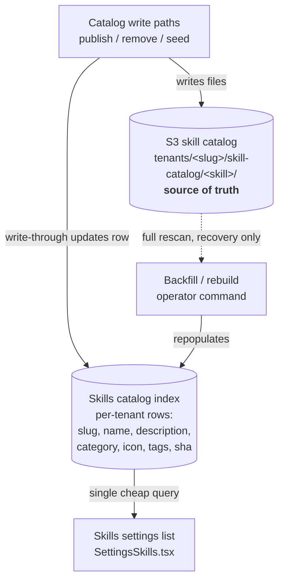

# Skills Catalog DB Index — Requirements

## Summary

Re-add a per-tenant database table that indexes the S3 skill catalog so the
Skills settings page loads from one cheap query instead of scanning S3 and
reading every skill file on each request. S3 stays the source of truth; the
table is a derived read cache holding each skill's display metadata and the
content hash used for drift detection. The settings list also upgrades from
raw slugs to human display names and descriptions.

## Problem Frame

The Skills settings list (`apps/spaces/src/components/settings/SettingsSkills.tsx`)
is slow to load. It calls `listSkillSlugs()`
(`apps/spaces/src/lib/workspace-files-api.ts`) → `listFiles({ catalog: true })`
→ the `handleCatalogList()` path in `packages/api/workspace-files.ts`. That
handler does two expensive things on every page load:

1. A full `ListObjectsV2` scan of the `tenants/<slug>/skill-catalog/` prefix.
2. A `GetObject` read of **every file in every skill folder** to compute a
   per-skill SHA256 (used as an etag-style change/drift signal).

Cost is O(skills × files-per-skill) S3 round-trips per load and grows with the
catalog. The handler already carries a `TODO` acknowledging this and proposing
"a catalog sha index file."

The catalog used to be indexed in Postgres (`skill_catalog` + `tenant_skills`),
dropped in migration `0131` (#1676, 2026-05-24) when S3 became source of truth.
Dropping the *index* alongside the source-of-truth move is the regression we're
correcting: S3 should remain authoritative, but a read should not require
fanning out across it.

## Key Decisions

- **Index the catalog listing only; install state stays derived.** One new
  table mirrors what exists in each tenant's S3 catalog. Per-tenant
  install/enabled/version state is **not** reintroduced into the DB — it
  remains derived from each agent's workspace `skills/<slug>/SKILL.md` via the
  existing `agent_skills` path (`packages/api/src/lib/derive-agent-skills.ts`).
  This avoids re-coupling the `tenant_skills` concept that was deliberately
  removed.

- **Write-through only; no background reconciler.** Catalog write paths update
  the index inline, and the list reads the DB exclusively. There is no periodic
  reconcile job. The drift safety net is a launch backfill plus an
  operator-invocable rebuild. The trade-off accepted: a missed or out-of-band
  write path produces a silently stale list until a rebuild runs.

- **The index absorbs the content hash, not just the name list.** The
  per-skill SHA that the list path computes today (the real source of slowness)
  is stored in the index and served from it. The settings list must stop
  reading file contents on the hot path entirely.

- **Enrich the displayed list.** Render human display name + description (and
  category/icon where available) from the indexed metadata, falling back to the
  slug when metadata is absent. The data is in the index regardless, so the
  display upgrade is near-zero additional cost.

- **DB table, not an S3 index file.** Both would fix latency; the DB table is
  chosen for queryability and as a return to the prior (correct) architecture.

### Source-of-truth fan-out

## Requirements

### Read path

- R1. The Skills settings list resolves entirely from the database index — a
  single query per tenant, with no `ListObjectsV2` scan and no per-file
  `GetObject` reads on the request path.
- R2. The list renders human display name and description for each skill, with
  category/icon shown where the indexed metadata provides them, and falls back
  to the slug when display metadata is missing.
- R3. The per-skill content hash that the list currently computes by reading
  files is served from the index, so drift/freshness consumers keep working
  without file reads on the hot path.

### Index content and ownership

- R4. The index is per-tenant and holds, per skill: slug, display name,
  description, category, tags, icon, and content hash (the fields needed to
  render R2 and serve R3). The full skill content and files remain in S3 and are
  not duplicated into the DB.
- R5. S3 remains the authoritative source of truth. The index is a derived
  cache; on any conflict, S3 wins and the index is corrected by a rebuild.
- R6. The index does not store or derive per-tenant install/enabled state, and
  this change does not alter the `agent_skills` table or its derivation.

### Write-through and freshness

- R7. Every path that creates, updates, or removes a skill in a tenant's S3
  catalog updates the corresponding index row in the same operation: adds insert
  a row, content changes update metadata + hash, removals delete the row. The
  set of catalog write paths must be enumerated and each one covered (the known
  entry point is the plugin-upload/publish processor; catalog seeding and any
  other writer must be confirmed during planning).
- R8. A backfill populates the index for all existing tenant catalogs at launch
  so the feature works for catalogs that predate it.
- R9. An operator-invocable rebuild re-scans a tenant's S3 catalog and
  reconstructs the index from scratch, serving as the recovery path for any
  drift. Backfill and rebuild may share the same mechanism.

## Acceptance Examples

- AE1. **Covers R1, R3.** Given a tenant with N catalogued skills, when the
  Skills settings page loads, then the response is produced from a single DB
  query and zero per-skill file reads occur on the request path.
- AE2. **Covers R2.** Given a skill whose `SKILL.md` defines a display name and
  description, when the list renders, then the human name and description are
  shown; given a skill missing that metadata, then the slug is shown instead.
- AE3. **Covers R7.** Given a new skill is published into a tenant's catalog,
  when the publish completes, then the skill appears in the settings list on the
  next load without a manual rebuild; given a skill is removed, then it
  disappears from the list on the next load.
- AE4. **Covers R5, R9.** Given the index has drifted from S3 (a row missing,
  stale metadata, or stale hash), when an operator runs the rebuild, then the
  index matches the current S3 catalog exactly.

## Scope Boundaries

- Per-tenant install / enabled / version state in the DB — out. Install state
  stays derived from the workspace (`agent_skills`). Re-adding `tenant_skills`
  is explicitly rejected.
- Changes to `agent_skills` or its derivation — out.
- A periodic background reconciler — out for now; the manual rebuild is the
  accepted recovery path. Revisit only if silent drift proves to be a recurring
  operational problem.
- Letting the agent runtime or other surfaces read skill metadata from the DB
  instead of S3 — out; this change serves the settings list only.
- An S3-side index file as the caching mechanism — rejected in favor of the DB
  table.

## Dependencies / Assumptions

- Skill display metadata (name, description, category, icon, tags) is parseable
  from each skill's `SKILL.md` frontmatter at write time — assumed; confirm the
  available fields during planning.
- The catalog's write paths are enumerable and few (primary known path: the
  plugin-upload/publish background processor; install/uninstall/reinstall write
  to agent workspaces, not the catalog, so they are not catalog write paths).
  R7's correctness depends on this enumeration being complete.
- Reintroducing the table requires a new Drizzle migration; the dropped
  `skill_catalog` schema in migration `0131` is available as a starting
  reference for column shape.

## Sources / Research

- Slow read path: `apps/spaces/src/components/settings/SettingsSkills.tsx`,
  `apps/spaces/src/lib/workspace-files-api.ts`, and `handleCatalogList()` /
  `listVisibleWorkspaceObjects()` / `listPrefix()` in
  `packages/api/workspace-files.ts` (note the existing `TODO` about a sha index).
- Per-skill hashing: `packages/api/src/lib/catalog-skill-sha.ts`.
- Catalog install/uninstall/reinstall (agent-workspace writers, not catalog
  writers): `packages/api/src/lib/catalog-install.ts`,
  `catalog-uninstall.ts`, `catalog-reinstall.ts`.
- Derived per-agent routing (distinct from this index):
  `packages/api/src/lib/derive-agent-skills.ts`,
  `packages/database-pg/src/schema/agents.ts`.
- Prior dropped tables and rationale:
  `packages/database-pg/drizzle/0131_drop_skill_catalog_and_tenant_skills.sql`
  (#1676).
