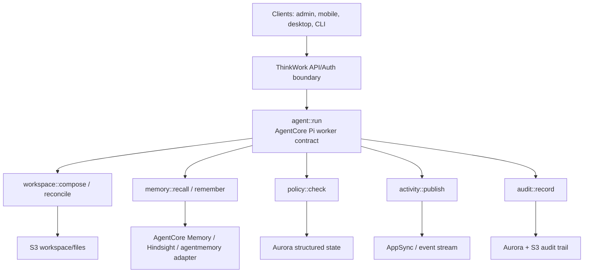

# AWS-Native Worker Contract Layer

## Problem Frame

ThinkWork has accumulated many capable but differently-shaped backend surfaces:
GraphQL resolvers, narrow REST Lambdas, AgentCore Pi runtime calls, scheduler
Lambdas, AppSync event bridges, memory providers, MCP bridges, connector
handlers, audit drainers, and evaluation workers. The user-facing product is
coalescing around a single agent harness, but the internal architecture still
requires contributors to learn too many orchestration idioms.

The iii Engine's Worker / Function / Trigger pattern points to a cleaner mental
model. ThinkWork should adopt that pattern as its internal architecture language
without adopting iii Engine as the production control plane and without
rebuilding a generic engine on AWS. The goal is a **ThinkWork Worker Contract
Layer**: typed capability contracts such as `memory::recall`, `agent::run`, and
`workspace::compose`, implemented by AWS-native substrates today and kept
portable enough that iii-compatible or on-prem worker runtimes remain plausible
later.

The first proof should include more than memory alone. It should demonstrate
interconnected workers: an agent worker invokes memory and workspace contracts,
publishes activity, and records audit evidence through the same function-call
language.

---

## Actors

- A1. Platform engineer: Adds or changes ThinkWork capabilities and needs one
  consistent way to expose them to agents, apps, automations, and operators.
- A2. Pi agent runtime: Runs AgentCore-backed turns and calls approved
  ThinkWork function contracts during perception, action, and feedback.
- A3. Operator / enterprise reviewer: Needs to inspect which functions exist,
  who may call them, how they are audited, and how failures are handled.
- A4. Future deployment maintainer: May need to replace an AWS implementation
  with an iii-compatible, ECS, Kubernetes, or on-prem adapter without rewriting
  product behavior.

---

## Key Flows

- F1. Agent turn uses worker contracts
  - **Trigger:** A user sends a message into a ThinkWork thread.
  - **Actors:** A2
  - **Steps:** The API invokes `agent::run`; the agent contract resolves the
    active workspace via `workspace::compose`, retrieves context via
    `memory::recall`, checks permissions through `policy::check`, publishes live
    progress through `activity::publish`, and closes the turn by calling
    `workspace::reconcile` plus `audit::record`.
  - **Outcome:** The turn still runs on AgentCore Pi, but the surrounding
    capabilities are called through stable function IDs rather than direct
    provider imports or bespoke callback paths.
  - **Covered by:** R1, R2, R5, R8, R9, R11

- F2. Memory provider swap stays behind one contract
  - **Trigger:** ThinkWork evaluates agentmemory or another memory backend.
  - **Actors:** A1, A2, A4
  - **Steps:** The new backend implements the same `memory::*` functions as
    AgentCore Memory or Hindsight; Pi continues calling `memory::recall` and
    `memory::remember`; operators compare latency, recall quality, tenant
    isolation, and audit behavior without changing the agent loop contract.
  - **Outcome:** Memory becomes the tracer bullet for provider portability and
    confirms whether worker contracts reduce architectural churn.
  - **Covered by:** R6, R7, R13, R14

- F3. Operator inspects the capability surface
  - **Trigger:** A turn is slow, fails, or produces unexpected behavior.
  - **Actors:** A3
  - **Steps:** The operator inspects the function contracts involved in the
    turn, sees which worker implementation handled each call, and follows trace
    and audit IDs through existing AWS observability surfaces.
  - **Outcome:** The worker model improves legibility without requiring a new
    engine console in v1.
  - **Covered by:** R3, R4, R10, R12

---

## Requirements

**Worker contract model**

- R1. ThinkWork must adopt Worker / Function / Trigger as an internal
  architecture language: a Worker owns capabilities, a Function is a typed
  callable contract, and a Trigger is an event binding that invokes a Function.
- R2. The contract layer must be a thin organization and invocation model over
  existing AWS-native primitives, not a new runtime engine.
- R3. Every function contract must carry a standard ThinkWork invocation
  envelope: tenant, user when present, Space/thread context when present, trace
  ID, idempotency key when state-changing, caller identity, and authorization
  claims.
- R4. Every function contract must declare its behavior shape: sync, async, or
  stream; timeout expectation; retry expectation; tenant scope; required
  permissions; audit level; and version.
- R5. Callers should invoke capabilities by function ID rather than by importing
  concrete provider code when the capability crosses a worker boundary.

**Proof workers**

- R6. Memory is the first proof worker, with contracts for `memory::recall`,
  `memory::remember`, `memory::forget`, `memory::inspect`, and
  `memory::export`.
- R7. The memory contract must support at least the current AgentCore Memory and
  Hindsight paths, and leave room for an experimental agentmemory / iii-backed
  implementation without changing Pi's caller contract.
- R8. Agent execution is the second proof worker, with `agent::run` wrapping the
  AgentCore Pi dispatch path rather than replacing AgentCore as the execution
  boundary.
- R9. Workspace is the third proof worker, with contracts for
  `workspace::compose` and `workspace::reconcile` so agent turns prove a
  multi-worker flow instead of a standalone memory abstraction.
- R10. Activity or audit must be included in the first proof so the worker model
  demonstrates feedback and observability, not only request/response calls.

**AWS-native implementation constraints**

- R11. The v1 implementation must keep AWS as the runtime substrate: AgentCore
  for Pi execution, Aurora/S3 for durable state, Secrets Manager/SSM for
  secrets, EventBridge/SQS/API Gateway/AppSync for eventing and trigger
  surfaces, and CloudWatch/X-Ray/OTEL for observability where those are already
  the deployed mechanisms.
- R12. ThinkWork must not build a custom queue, cron, stream bus, state store,
  worker supervisor, generic marketplace, or engine console as part of this
  requirements scope.
- R13. The contract layer must support adapter-style implementations so an
  iii-compatible worker, ECS worker, Lambda, or on-prem implementation can
  satisfy the same function contract later.

**Operational and product guarantees**

- R14. State-changing function calls must have explicit idempotency and audit
  behavior so workerization does not weaken compliance evidence or retry safety.
- R15. The worker contract layer must improve contributor legibility: a planner
  or implementer can identify a capability's owner, call shape, triggers, and
  audit expectations from the contract surface.
- R16. The worker contract layer must preserve AgentCore-first product clarity:
  desktop and mobile remain clients, and managed Pi execution remains the
  default enterprise execution story.

---

## Acceptance Examples

- AE1. **Covers R6, R7.** Given Pi needs memory context for a turn, when it calls
  `memory::recall`, then the active memory implementation can be AgentCore
  Memory, Hindsight, or an experimental agentmemory adapter without the agent
  loop changing its call contract.
- AE2. **Covers R8, R16.** Given a user sends a desktop or mobile message, when
  `agent::run` is invoked, then the turn runs through AgentCore Pi and not a new
  local or iii execution boundary.
- AE3. **Covers R9, R10, R14.** Given an AgentCore Pi turn completes with file
  changes and tool activity, when it finalizes, then workspace reconciliation,
  activity publication, and audit recording are represented as function
  contract calls with trace and idempotency context.
- AE4. **Covers R11, R12.** Given a scheduled memory consolidation trigger is
  needed, when planning implements it, then the trigger maps to EventBridge or
  another existing AWS event surface rather than a new ThinkWork cron engine.
- AE5. **Covers R15.** Given a new contributor investigates memory, workspace,
  or agent execution, when they inspect the worker contract surface, then they
  can identify the owning worker, callable functions, trigger sources, and
  audit expectations without reconstructing the flow from scattered handlers.

---

## Success Criteria

- ThinkWork gains a shared architecture language for backend capabilities:
  workers own functions, and triggers invoke functions.
- The first proof demonstrates at least three interconnected worker contracts:
  memory, agent execution, and workspace, with activity or audit in the loop.
- The memory contract makes AgentCore Memory, Hindsight, and an experimental
  agentmemory-style implementation comparable without changing Pi's caller
  contract.
- The design improves implementation planning without forcing a broad rewrite
  of GraphQL, Lambdas, AgentCore Pi, or Terraform in the first unit.
- The architecture avoids becoming "iii but worse and AWS-only": AWS remains
  the implementation substrate, not the ontology, and no generic engine is
  rebuilt.

---

## Scope Boundaries

- No adoption of iii Engine as the production control plane in this scope.
- No custom worker runtime, live worker bus, generic function registry console,
  custom queue, custom cron, custom stream bus, or custom state store.
- No replacement of AgentCore as the Pi execution boundary.
- No full migration of every existing Lambda/resolver/handler into workers in
  the first implementation plan.
- No public worker marketplace or third-party worker installation flow.
- No full on-prem or offline model runtime implementation; those remain future
  deployment targets the contract layer should not preclude.

---

## Key Decisions

- Adopt the pattern, not the engine: ThinkWork uses Worker / Function / Trigger
  as the architecture vocabulary while keeping AWS-native primitives as the v1
  machinery.
- Prove interconnected workers, not just a provider abstraction: memory alone
  is useful, but agent execution plus workspace plus activity/audit proves the
  operating model.
- AgentCore Pi remains wrapped, not replaced: `agent::run` is a contract around
  the managed Pi dispatch path.
- Portability is preserved through contracts: AWS-specific implementations are
  adapters behind stable function IDs.

---

## Dependencies / Assumptions

- AgentCore-first Pi execution is the current product direction; see
  `docs/brainstorms/2026-06-01-agentcore-first-pi-execution-requirements.md`.
- Pi extensions are the current agent-facing capability layer; see
  `docs/brainstorms/2026-05-29-pi-extensions-architecture-requirements.md`.
- Workspace composition and reconciliation are already strategic runtime
  concepts; see
  `docs/brainstorms/2026-05-31-workspace-architecture-simplification-requirements.md`.
- `agentmemory` and iii remain evaluation references, not committed production
  dependencies.
- AWS remains the reference enterprise deployment for the first implementation.

---

## Outstanding Questions

### Resolve Before Planning

- None.

### Deferred to Planning

- [Affects R1-R5][Technical] Where should the canonical worker contract
  declarations live so they are visible to runtime code, Terraform validation,
  docs, and tests without creating a new control plane?
- [Affects R6-R10][Technical] Which existing code path is the narrowest tracer
  bullet for `agent::run -> workspace::compose -> memory::recall ->
  activity/audit`?
- [Affects R11-R13][Needs research] How close should the contract shape stay to
  iii function/worker metadata to preserve future iii compatibility?
- [Affects R14][Technical] What idempotency and audit fields already exist in
  thread turns, finalize payloads, and compliance events, and which are missing
  from the common envelope?

---

## Next Steps

-> /ce-plan for structured implementation planning around a memory + agent +
workspace + activity/audit tracer bullet.
