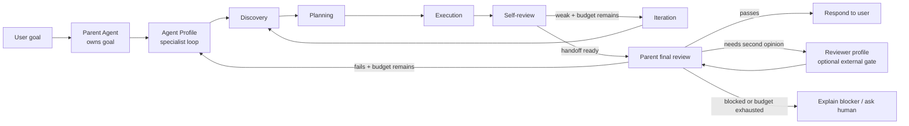

# Agent Profile Closed Loops

## Problem Frame

ThinkWork now has Agent Profiles as the model-stacking and specialist
delegation boundary, but the specialist loop is still underspecified. A profile
handoff should not be a shallow one-shot answer. Each specialist should run a
bounded closed loop: discover what it needs, plan the work, execute, self-review
against the assigned goal, iterate when weak, and return a concise handoff to
the parent Agent.

The parent Agent remains the orchestrator. It owns the user's goal, delegates to
specialists when useful, reviews the final answer before responding, and may use
an external Reviewer profile as an escalation or policy-driven review gate. V1
should favor closed, bounded loops over open-ended fleet exploration so quality
improves without unbounded token spend.

---

## Actors

- A1. Tenant user: gives the parent Agent a goal, optionally invoking profiles
  with shortcuts such as `#Research` or `#Reviewer`.
- A2. Parent Agent: owns the user goal, routes work, reviews final output, and
  decides whether to answer, retry, invoke Reviewer, or hand back a blocker.
- A3. Agent Profile specialist: owns a bounded subtask and runs its own
  discover-plan-execute-self-review-iterate loop before handing off.
- A4. Reviewer profile: optional external evaluation specialist used when the
  user, parent, or policy requests a second opinion.
- A5. Tenant operator: configures profile instructions, capabilities, execution
  controls, and loop/review policy.
- A6. Customer evaluator: inspects Activity and Traces to confirm quality loops,
  cost attribution, and specialist handoffs are understandable.

---

## Key Flows

- F1. Specialist runs an integrated closed loop
  - **Trigger:** The parent delegates a bounded subtask to an Agent Profile.
  - **Actors:** A2, A3
  - **Steps:** The specialist restates its assigned subtask, discovers needed
    context, plans a minimal path, executes with its configured capabilities,
    self-reviews against the subtask and evidence requirements, retries if weak
    and budget remains, then returns a concise handoff.
  - **Outcome:** The parent receives a higher-confidence specialist handoff
    rather than a raw first draft.
  - **Covered by:** R1, R2, R3, R4, R5, R6

- F2. Parent reviews and decides next action
  - **Trigger:** The parent receives one or more specialist handoffs or prepares
    a direct answer.
  - **Actors:** A2, A3, A4
  - **Steps:** The parent checks the candidate answer against the original user
    goal, required evidence, and known handoffs. If the result is good, it
    answers. If the result is weak and loop budget remains, it retries the
    relevant specialist with explicit feedback. If external review is requested
    or required, it delegates review to the Reviewer profile and consumes that
    handoff before deciding.
  - **Outcome:** The parent, not the Reviewer, sends the final user-facing
    response.
  - **Covered by:** R7, R8, R9, R10, R11, R12

- F3. User explicitly requests external review
  - **Trigger:** A user includes a Reviewer shortcut, for example `#Reviewer`,
    in the same turn as the task or in a follow-up.
  - **Actors:** A1, A2, A4
  - **Steps:** The parent keeps Reviewer as an evaluation step, passes the
    relevant candidate output and original goal to Reviewer, receives a review
    handoff, and decides whether to answer, retry, or report a blocker.
  - **Outcome:** Reviewer improves confidence without becoming the final speaker.
  - **Covered by:** R11, R12, R13, R14

- F4. Operator inspects loop evidence
  - **Trigger:** An operator opens Settings -> Activity -> Thread Detail after a
    turn with specialist looping.
  - **Actors:** A5, A6
  - **Steps:** Activity shows the parent turn, specialist profile runs, loop
    retries when present, Reviewer when used, model/tokens/cost/duration, and
    raw child tools under the profile that used them. Trace lanes preserve
    sequence and causality without implying parallelism when profiles ran
    sequentially.
  - **Outcome:** The loop is auditable and explainable to customers.
  - **Covered by:** R15, R16, R17, R18, R19

---

## Requirements

**Specialist loop behavior**

- R1. Each Agent Profile must be treated as a specialist that runs a bounded
  closed loop before handing off: discovery, planning, execution, self-review,
  and optional iteration.
- R2. A profile handoff must summarize the result, the evidence or assumptions
  that matter, and any unresolved gaps that the parent must know.
- R3. A profile must be able to retry its own work when self-review fails and
  loop budget remains.
- R4. A profile must stop and hand off a clear blocker when its subtask cannot
  be completed within its configured limits.
- R5. Profile loops must respect the profile's configured model, capabilities,
  space access, token/runtime/cost limits, and instructions.
- R6. Specialist self-review must be integrated into the profile loop; it should
  not require a separate Reviewer profile for ordinary low-risk tasks.

**Parent orchestration**

- R7. The parent Agent must own the overall user goal and final response.
- R8. The parent Agent must review candidate final answers against the original
  user request before responding.
- R9. When a specialist handoff is weak and retry budget remains, the parent
  should retry the relevant specialist with explicit feedback rather than
  exposing the weak output to the user.
- R10. When retry budget is exhausted, the parent must clearly explain the
  blocker or request human input instead of silently continuing.
- R11. The parent must be able to invoke multiple specialists sequentially in
  one turn and pass prior handoffs into later specialists when relevant.
- R12. The final visible response must come from the parent Agent, even when a
  Reviewer profile participated.

**External Reviewer policy**

- R13. Reviewer is an optional external evaluation profile, not mandatory
  infrastructure for every profile handoff.
- R14. Reviewer must run when explicitly requested by the user, when parent
  policy requires it, or when the parent decides a second opinion is warranted.
- R15. Reviewer output must be a handoff to the parent with pass/fail,
  concerns, and actionable feedback; it must not bypass the parent and answer
  the user directly.

**Observability and controls**

- R16. Activity must show specialist profile runs, retries, Reviewer runs when
  used, and parent final review decisions in a way that preserves order.
- R17. Trace lanes must distinguish sequential specialist execution from
  parallel execution; a later Reviewer should not look like it started at the
  same time as an earlier Research lane unless it actually did.
- R18. Profile and parent loop evidence must include model, tokens, cost,
  duration, status, and raw child tool visibility where available.
- R19. Operators must be able to configure loop budgets at least at the profile
  level, and planning may decide whether parent-level defaults or tenant-level
  defaults are also needed.
- R20. The system must prefer closed-loop execution with bounded budgets over
  open-ended exploration for V1.

---

## Acceptance Examples

- AE1. **Covers R1, R2, R3, R5, R6.** Given Research receives "find the current
  CEO of Stripe and cite one source," when its first source is weak, Research
  retries within its own profile loop and returns a handoff with a supported
  answer and source rather than handing off the weak draft.
- AE2. **Covers R7, R8, R9, R12.** Given Research returns a handoff that is
  missing a citation, when the parent reviews it and retry budget remains, the
  parent sends Research explicit feedback and waits for the corrected handoff
  before answering.
- AE3. **Covers R13, R14, R15.** Given the user asks "Research this and use
  #Reviewer to verify," when Research hands off its result, the parent sends
  the candidate result to Reviewer, consumes the Reviewer handoff, and then the
  parent sends the final answer.
- AE4. **Covers R10, R19, R20.** Given a profile reaches its loop limit without
  meeting the task requirements, when the parent receives the blocker handoff,
  the parent reports the blocker or asks for human input instead of continuing
  indefinitely.
- AE5. **Covers R16, R17, R18.** Given a turn runs Research and then Reviewer
  sequentially, when an operator opens Activity, the timeline shows
  delegate -> Research path -> delegate -> Reviewer path -> parent response,
  with token/cost/model metadata for each profile and without implying
  parallel execution.

---

## Success Criteria

- Specialist profiles behave like task-owning workers, not one-shot prompt
  wrappers.
- The parent Agent remains clearly responsible for final user-facing answers.
- Users can request stronger verification with Reviewer without making every
  normal specialist handoff pay the cost of an external review.
- Customer demos can show a closed-loop system that improves output quality
  while keeping budget and traceability understandable.
- Planning can proceed without inventing the loop shape, Reviewer role, parent
  responsibility boundary, retry behavior, or observability expectations.

---

## Scope Boundaries

- V1 does not require open-ended autonomous fleet exploration.
- V1 does not require Reviewer on every profile handoff.
- V1 does not make Reviewer the final user-facing speaker.
- V1 does not create separate AgentCore instances for looped profile work.
- V1 does not need nested profile-to-profile delegation unless planning finds
  the current Pi subagent package supports it safely and cheaply.
- V1 does not require raw tools to own independent loops; loops belong to the
  parent Agent and Agent Profiles.

---

## Key Decisions

- Integrated self-review is the default: this keeps ordinary specialist work
  cheaper and simpler than always running an external Reviewer.
- Reviewer is an escalation/eval profile: it is available for explicit user
  requests, policy-driven high-risk work, and parent-selected second opinions.
- Parent owns final response: this prevents specialist or Reviewer handoffs
  from leaking directly to the user and keeps orchestration intelligible.
- Closed loops before open loops: V1 should prove quality improvement with
  bounded cost before attempting broader exploratory fleet behavior.

---

## Dependencies / Assumptions

- This builds on Agent Profiles from
  `docs/brainstorms/2026-06-07-agent-profiles-pi-subagents-model-stacking-requirements.md`.
- Current runtime support has a `delegate_to_agent_profile` tool and persisted
  `agent_profile_runs`; planning should decide whether to extend that path or
  introduce a clearer loop state machine.
- Current profile execution controls include review-related fields such as
  review gate and review loop limits; planning should verify whether those are
  sufficient or should be reframed as generic loop policy.

---

## Outstanding Questions

### Deferred to Planning

- [Affects R3, R9, R19][Technical] Decide the exact loop budget shape:
  max retries, max profile runs, max total turn cost, max duration, or a
  combination.
- [Affects R8, R16][Technical] Decide how to persist parent final-review
  decisions so Activity can show them without inventing UI-only events.
- [Affects R11][Technical] Decide whether sequential profile chains should be
  represented as explicit loop steps, tool calls, profile runs, or a higher
  order orchestration record.
- [Affects R13, R14][Product/technical] Decide whether operators need a visible
  per-profile Reviewer policy in V1 or whether the only visible path is explicit
  `#Reviewer` invocation.

---

## Next Steps

-> /ce-plan for structured implementation planning.
