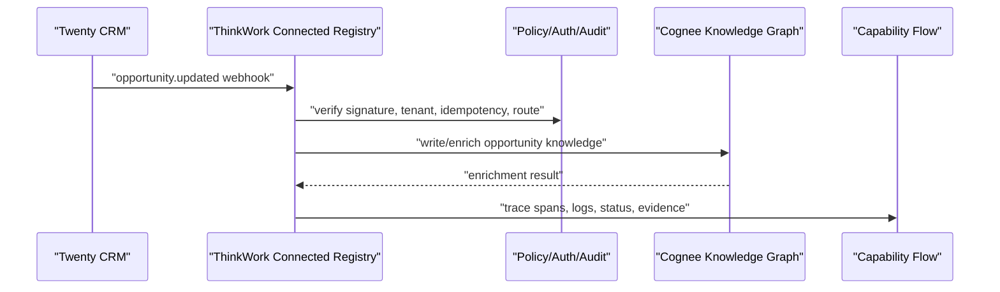

# Connected Application Registry

## Problem Frame

ThinkWork's managed applications are becoming more than infrastructure add-ons.
Cognee can hold and enrich knowledge. Twenty CRM can hold account and pipeline
state. Future apps may add workflows, documents, analytics, support, or finance.
Today ThinkWork can deploy apps and expose some MCP tools, but the apps do not
publish a shared capability surface that agents, automations, and operators can
inspect and compose.

The iii Engine model is compelling because every worker contributes functions,
triggers, events, logs, traces, and discovery metadata into one living system.
ThinkWork should pursue the same product outcome without adopting iii Engine as
the core production control plane. The right model is a **ThinkWork Connected
Application Registry**: managed apps publish capability contracts, ThinkWork
controls routing and policy, and operators can see a full capability waterfall
for cross-app work.

V1 should prove a real cross-app move:

The core product decision: applications should not call each other directly.
ThinkWork remains the hub for identity, tenancy, policy, audit, routing,
observability, and agent control. Applications publish what they can do;
ThinkWork composes those capabilities safely.

---

## Actors

- A1. ThinkWork operator: Enables managed applications, reviews capability
  availability, and investigates cross-app flows.
- A2. Platform engineer: Adds managed apps and app capabilities without
  hand-wiring each app to every other app.
- A3. ThinkWork automation runtime: Receives events and routes them through
  policy-approved capability bindings.
- A4. Pi agent runtime: Uses the registry to understand available app
  capabilities and debug prior capability flows.
- A5. Enterprise reviewer: Needs proof of auth, idempotency, audit, traceability,
  and data-boundary behavior.
- A6. Managed application: Publishes functions, triggers, events, entities,
  health, and auth requirements into ThinkWork-controlled contracts.

---

## Key Flows

- F1. Managed app publishes capabilities
  - **Trigger:** A managed application is installed, deployed, repaired, or
    upgraded.
  - **Actors:** A1, A2, A6
  - **Steps:** The app contributes a capability contract that describes its
    workers, functions, triggers, events, entities, MCP tool surface, auth
    requirements, health checks, smoke evidence, and audit/idempotency policy.
    ThinkWork validates the contract and exposes only the capabilities that are
    available for the tenant and current user.
  - **Outcome:** Operators and agents can inspect what the app can do without
    reading app-specific deployment code or MCP wiring.
  - **Covered by:** R1, R2, R3, R4, R5, R6

- F2. Twenty opportunity update enriches Cognee
  - **Trigger:** Twenty emits an `opportunity.updated` webhook.
  - **Actors:** A3, A5, A6
  - **Steps:** ThinkWork receives the webhook, validates Twenty's signature and
    timestamp, identifies the tenant and managed app instance, normalizes the
    event into the registry, applies idempotency, checks the configured binding,
    and invokes the Cognee knowledge write/enrichment capability. The flow
    records trace spans, logs, status, and audit evidence.
  - **Outcome:** A CRM opportunity change becomes updated knowledge in Cognee
    through ThinkWork-controlled routing, not direct app-to-app coupling.
  - **Covered by:** R7, R8, R9, R10, R11, R12, R13

- F3. Operator inspects the capability waterfall
  - **Trigger:** An operator investigates whether a CRM update enriched Cognee
    correctly, failed, or was skipped.
  - **Actors:** A1, A5
  - **Steps:** The operator opens the capability flow for a trace, sees each
    step in order, including Twenty webhook receipt, signature validation,
    registry route decision, Cognee write/enrichment, retries or skips, timing,
    redacted metadata, and audit/evidence links.
  - **Outcome:** Cross-app behavior is explainable without searching CloudWatch,
    reconstructing Lambda paths, or inspecting raw payloads.
  - **Covered by:** R14, R15, R16, R17

- F4. Runtime asks why a capability is unavailable
  - **Trigger:** An agent or automation wants to use an app capability that is
    not currently callable.
  - **Actors:** A4, A3
  - **Steps:** The runtime queries the registry for availability. ThinkWork
    reports whether the blocker is app not deployed, app parked, MCP not
    registered, user OAuth missing, insufficient permission, failed health, or
    policy-disabled binding.
  - **Outcome:** Agents and operators receive a specific readiness reason rather
    than a generic missing-tool or failed-call error.
  - **Covered by:** R3, R6, R18

---

## Requirements

**Registry identity and control**

- R1. ThinkWork must own the Connected Application Registry as the authoritative
  control point for managed-app capabilities.
- R2. Managed applications must not call each other directly for v1 cross-app
  automation; cross-app routing must traverse ThinkWork policy, audit, and
  observability.
- R3. The registry must model both tenant-level availability and user-specific
  readiness, because an app can be deployed while a user credential or
  permission is still missing.
- R4. The registry must use stable capability identifiers for app-owned
  workers, functions, triggers, and events so agents, automations, and traces
  can refer to the same capability over time.

**Application capability contracts**

- R5. Each managed app must publish a capability contract that can describe:
  workers, functions, triggers, emitted events, consumed events, entities, MCP
  tools, OAuth or API credential requirements, health, smoke evidence, agent
  skills, audit level, idempotency expectations, and destructive-operation
  policy.
- R6. Capability contracts must distinguish "installed", "running",
  "callable for tenant", and "callable for this user" states.
- R7. The registry must preserve the source app event name and payload summary
  while also normalizing it into a ThinkWork event contract.
- R8. The registry must allow app capabilities to be hidden, disabled, or
  policy-blocked without changing the app deployment state.

**V1 Twenty to Cognee automation**

- R9. V1 must use Twenty's real `opportunity.updated` webhook as the trigger for
  the first cross-app automation.
- R10. ThinkWork must validate Twenty webhook authenticity using the signed
  webhook headers and reject stale, malformed, or unverifiable webhook requests.
- R11. ThinkWork must apply idempotency to Twenty webhook handling so repeated
  delivery does not create duplicate Cognee writes or duplicate audit records.
- R12. The normalized Twenty opportunity event must route through a
  ThinkWork-controlled binding to a Cognee knowledge write or enrichment
  capability.
- R13. The Cognee write/enrichment result must be associated back to the source
  Twenty opportunity event so the flow is explainable and retry-safe.
- R14. Failure handling must distinguish at least: invalid webhook, duplicate
  webhook, missing route, Cognee unavailable, policy blocked, and enrichment
  failed.

**Capability observability**

- R15. Every v1 cross-app flow must produce a capability waterfall that shows
  ordered steps, function or event IDs, worker/app ownership, status, duration,
  retry/skipped state, and redacted metadata.
- R16. Capability logs and trace records must be safe for enterprise operators:
  no raw bearer tokens, API keys, full secrets, or unbounded CRM record payloads.
- R17. Operators must be able to inspect recent cross-app flows and open one
  flow to understand why it succeeded, failed, retried, or skipped.
- R18. Agents or internal tools must be able to ask the registry why a
  capability is unavailable and receive a structured readiness reason.

**Guardrails and compatibility**

- R19. The v1 registry must not become a custom worker runtime, queue, cron,
  stream bus, state store, process supervisor, generic marketplace, or iii
  Engine replacement.
- R20. The registry should remain compatible with future iii-style metadata
  import/export where useful, but iii compatibility must not override
  ThinkWork's tenant, user auth, policy, audit, and AWS-managed deployment
  requirements.
- R21. Existing managed-app lifecycle ownership must remain intact: Managed
  Applications owns infrastructure lifecycle, MCP Servers owns user OAuth/tool
  connection state, and the Connected Registry composes availability and
  capability metadata across both.

---

## Acceptance Examples

- AE1. **Covers R1, R2, R5.** Given Twenty and Cognee are managed apps, when
  their capabilities are inspected, then ThinkWork shows their functions,
  triggers, events, auth requirements, and health through the registry rather
  than app-to-app wiring.
- AE2. **Covers R9, R10, R11.** Given Twenty sends an `opportunity.updated`
  webhook, when the request has a valid signature and has not been processed
  before, then ThinkWork accepts and normalizes the event; when it is duplicate
  or unverifiable, then ThinkWork records the appropriate skipped or rejected
  state.
- AE3. **Covers R12, R13, R14.** Given a valid Twenty opportunity update has a
  configured Cognee binding, when Cognee is available, then ThinkWork writes or
  enriches the corresponding knowledge record and links the result to the
  source event; when Cognee is unavailable, then the flow records a retryable or
  blocked status.
- AE4. **Covers R15, R16, R17.** Given a cross-app flow completes, when an
  operator opens its waterfall, then they can see each step, timing, owner,
  status, and safe metadata without seeing secrets or raw unbounded CRM payloads.
- AE5. **Covers R3, R6, R18, R21.** Given an agent asks to use an app capability,
  when the tenant app is parked or the current user lacks required OAuth, then
  the registry returns a specific readiness reason and does not present the
  capability as callable.

---

## Success Criteria

- A real Twenty `opportunity.updated` event can drive a Cognee knowledge
  enrichment/write through ThinkWork-controlled routing.
- Operators can inspect a capability waterfall for the cross-app flow and
  understand what happened without searching raw logs.
- Agents and automations can discover whether a capability is available for the
  tenant and current user, and why it is unavailable when blocked.
- Managed-app additions become less bespoke: app capabilities are described in
  contract form instead of scattered across lifecycle adapters, MCP wiring, and
  UI-specific conditionals.
- The design captures iii's best product property, a live observable capability
  graph, without adopting iii Engine as the production control plane.

---

## Scope Boundaries

### Deferred for later

- Generic third-party application marketplace or public worker registry.
- Importing arbitrary iii registry workers into production ThinkWork.
- Exporting ThinkWork capabilities as live iii workers.
- Direct app-to-app calls outside ThinkWork policy/routing.
- General-purpose workflow builder UI for arbitrary cross-app automations.
- Full event filtering UI for all Twenty event types.
- Broad conversion of every existing MCP tool or Lambda into registry
  capabilities.
- On-prem or offline iii edge runtime.

### Outside this product's identity

- ThinkWork should not become a generic iii Engine clone.
- ThinkWork should not own generic process supervision for arbitrary worker
  binaries or containers in v1.
- ThinkWork should not treat MCP tool listings alone as the application
  registry; MCP is one capability source, not the whole model.
- ThinkWork should not make managed applications responsible for each other's
  identity, tenant isolation, authorization, or audit evidence.

---

## Key Decisions

- **V1 proof:** Use a real Twenty `opportunity.updated` webhook to trigger
  Cognee enrichment/write through ThinkWork.
- **Control model:** Keep ThinkWork as the hub for policy, routing, audit, and
  observability; avoid direct app-to-app calls.
- **Product proof surface:** The operator-visible proof is the capability
  waterfall, but the product move is cross-app automation.
- **Registry scope:** Build a connected application capability registry, not a
  new worker runtime or engine.
- **iii posture:** Treat iii as a strong design reference and future
  compatibility target, not as the production foundation for v1.
- **Auth/readiness:** Model user-specific readiness separately from app
  deployment state.

---

## Dependencies / Assumptions

- Twenty supports webhooks for record updates including `opportunity.updated`
  and signs webhook requests.
- The managed Twenty deployment can be configured with a ThinkWork-owned webhook
  URL for the relevant tenant/app instance.
- Cognee exposes or can be given a knowledge write/enrichment capability
  suitable for opportunity/account intelligence.
- ThinkWork can persist safe trace/capability-flow metadata without storing raw
  secrets or unbounded CRM payloads.
- The existing managed-app lifecycle and managed MCP OAuth split remains the
  right product boundary.

---

## Outstanding Questions

### Resolve Before Planning

- None.

### Deferred to Planning

- [Affects R5, R12][Technical] What is the smallest durable representation for
  app capability contracts and capability-flow records?
- [Affects R10][Needs research] How should Twenty webhook signing secrets be
  provisioned, rotated, and associated with a tenant/app instance?
- [Affects R12, R13][Technical] What exact Cognee operation should v1 invoke:
  entity upsert, memory write, graph enrichment job, or another existing
  capability?
- [Affects R15][Technical] Which existing ThinkWork trace/activity/audit tables
  should capability waterfall views read from, and what new projection is
  needed?
- [Affects R18][Technical] What is the first agent/internal tool API for
  capability availability and readiness explanations?

---

## Next Steps

-> `/ce-plan` for structured implementation planning.
