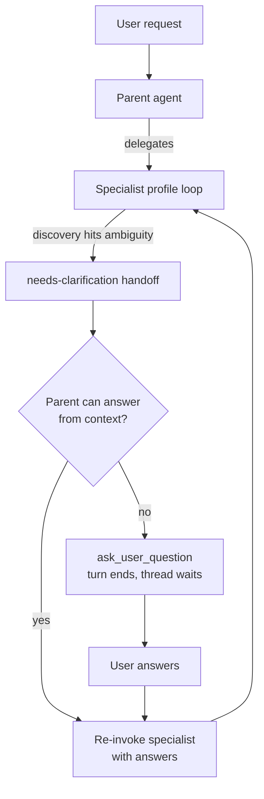

# Ask User Question — Requirements

## Summary

Give the Pi agent a native `ask_user_question` capability: the parent (user-facing) session can pause its turn with a structured, optioned question, and specialist profiles that hit ambiguity in their loop escalate it to the parent through a needs-clarification handoff instead of assuming. Both halves ship in v1, default-on for every tenant.

---

## Problem Frame

When a request is ambiguous, the agent barrels ahead on its own assumptions and never asks a clarifying question — not even in plain prose, which the wakeup substrate would already support. The cost is wasted runs and wrong outcomes on exactly the requests where a single answer up front would have redirected the work. The gap is two-sided: there is no structured mechanism for asking and pausing, and no policy pressure that makes the agent ask when uncertainty matters.

The upstream package that prompted this (`@juicesharp/rpiv-ask-user-question`) is a terminal-UI Pi extension that blocks in a local TUI dialog. The hosted runtime (Lambda/AgentCore, users in web/mobile threads) cannot use it directly; this is a native build that borrows its question contract.

---

## Key Decisions

- **Native Pi extension, not the upstream package.** The package's blocking TUI is incompatible with a hosted runtime; we adopt its schema ideas and build thinkwork-native.
- **Claude Code's `AskUserQuestion` contract is the schema model.** It is the most fully specified clarification (not approval) schema across surveyed harnesses: 1–4 questions per call, short headers, 2–4 options with label + description, `multiSelect`, free-text always available, " (Recommended)" label convention.
- **Parent-only voice; specialists escalate.** Only the parent session holds the tool. Specialists raise a needs-clarification handoff and the parent decides whether to ask the user or answer from its own context. This matches the cross-harness consensus (Claude Code sub-agents cannot ask the user; orchestrator-mediated clarification outperforms sub-agent silent assumption) and avoids suspending nested loops inside the parent's turn.
- **Wait indefinitely on an unanswered question.** No timeout-then-assume fallback — proceeding on timeout re-creates the barrel-ahead failure this feature exists to fix. No new task states; the thread simply waits.
- **Baked-in, default-on policy.** Clarification guidance ships in the platform system prompt and the profile loop's discovery-stage contract. Not an installable skill, not a profile config knob — baseline capability needs no opt-in ceremony.
- **Answers bind to the question, not the chat.** The user's answer resumes the agent as a tool result tied to the originating question, not as an independent user turn — keeps the answer semantically bound and prevents re-triggering question loops.

---

## Actors

- A1. **User** — human in the thread (web, mobile, or connector surface); answers questions, may reply free-text from any surface.
- A2. **Parent agent** — the user-facing Pi session; the only actor that invokes `ask_user_question`.
- A3. **Specialist profile** — nested profile session (Research, Coding, Analyst, Reviewer) running the closed loop; escalates ambiguity, never asks the user directly.

---

## Requirements

**Tool and question contract**

- R1. The parent session exposes an `ask_user_question` tool accepting 1–4 questions per call; each question carries full question text, a short header label, 2–4 options (label + description), and an optional multi-select flag.
- R2. A free-text answer path is always available to the user without being enumerated as an option.
- R3. When the agent has a preferred default, it marks exactly one option per question with the " (Recommended)" label convention.
- R4. The agent batches all questions for the current decision point into a single call, with at most one batch per decision point.

**Pause and resume semantics**

- R5. Invoking the tool ends the agent's turn and places the thread in a waiting-for-answer state with no timeout; the question stays pending until answered.
- R6. The user's answer resumes the agent through the existing wakeup substrate, delivered as the tool result of the originating question call.
- R7. A plain chat reply from any surface counts as an answer to the pending question (free-text bypass) and resumes the agent the same way.
- R8. At most one question batch is pending per thread at a time.

**Specialist escalation**

- R9. Specialist sessions do not receive the tool; when a loop stage (discovery foremost) hits an ambiguity whose answer changes the outcome, the specialist returns a needs-clarification handoff carrying its questions in the same question shape.
- R10. On receiving a needs-clarification handoff, the parent either answers from its own context or surfaces the questions via `ask_user_question`, then re-invokes the specialist with the answers injected, using the existing retry-with-feedback machinery.
- R11. The parent dedupes and filters escalated questions before asking — it never forwards a question it can already answer.

**Trigger policy**

- R12. Clarification guidance ships default-on for all tenants in the platform system prompt and the profile loop's discovery-stage contract.
- R13. The guidance instructs asking only when at least one holds: two or more valid approaches differ meaningfully in outcome; a required parameter cannot be inferred from context; a wrong guess wastes significant effort.
- R14. The guidance instructs not asking when the task has a single obvious path, the answer is already available in conversation, workspace, or memory, or the question is purely cosmetic.

**Surfaces and discoverability**

- R15. The web app renders a pending question as an interactive structured card (options, multi-select, free-text, submit); once answered, the card shows the chosen answers inline in thread history.
- R16. Every other surface renders a readable text form of the question; answering by plain reply works from any surface.
- R17. A thread with a pending question is discoverable as needing attention (waiting-state badge and existing needs-attention affordances), including when the asking run was scheduled or background-initiated.

---

## Key Flows

- F1. **Parent asks during intake**
  - **Trigger:** User request is ambiguous on an outcome-changing decision before any delegation.
  - **Steps:** Parent calls `ask_user_question` → turn ends, thread waits → user answers (card or plain reply) → wakeup resumes parent with answers as tool result → parent proceeds.
  - **Covers:** R1–R8.

- F2. **Specialist escalates from discovery**
  - **Trigger:** A specialist's discovery stage finds an ambiguity it cannot resolve from context.
  - **Steps:** Specialist returns needs-clarification handoff with questions → parent filters (answers what it can itself) → parent asks the user the remainder → user answers → parent re-invokes specialist with answers injected → specialist continues its loop.
  - **Covers:** R9–R11.

- F3. **Free-text answer from a fallback surface**
  - **Trigger:** A question is pending; the user is on mobile or a connector surface showing the text form.
  - **Steps:** User sends a plain reply → reply is bound to the pending question as its answer → agent resumes as in F1.
  - **Covers:** R7, R16.

---

## Acceptance Examples

- AE1. **Covers R13, R14.** Given a request with one obvious path ("fix the typo in the README"), the agent proceeds without asking. Given "set up the new tenant like last time" where two prior tenants differ materially, the agent asks which one before acting.
- AE2. **Covers R9, R10.** Given a Research profile in discovery that finds the request could mean two different data sources, it returns a needs-clarification handoff; the parent asks the user, then re-runs the specialist with the chosen source — the specialist does not guess and proceed.
- AE3. **Covers R7.** Given a pending two-option question, when the user replies in plain text with something outside both options, the reply is delivered as the answer to that question and the agent incorporates it rather than treating it as a new request.
- AE4. **Covers R5, R17.** Given a scheduled job whose run hits a clarification at 3 AM, the thread parks in waiting state and is badged as needing attention; when the user answers the next morning, the run resumes — no timeout fired, no assumption was made.
- AE5. **Covers R8, R4.** Given an agent facing three related unknowns at one decision point, it asks them as one batch of three questions, not three sequential pauses.

---

## Scope Boundaries

- **Deferred for later**
  - Structured question card on mobile and connector surfaces (text fallback ships in v1; any reply answers).
  - Per-profile chattiness controls (e.g., clarification: always/auto/never in execution controls) — add only if a profile proves to over-ask.
  - Timeout machinery, assumption-fallbacks, and blocked/backlog task states.
- **Outside this feature's identity**
  - Action-approval gating (approve/deny a tool call before it runs) — a distinct HITL feature with different semantics; this is clarification only.
  - Installable-skill packaging of the clarify behavior — the policy is baseline platform behavior.

---

## Dependencies / Assumptions

- The agent-profile closed-loop contract (plan `docs/plans/2026-06-08-001-feat-agent-profile-closed-loops-plan.md`) is the substrate for escalation; assumes its handoff/retry-with-feedback machinery can carry a needs-clarification handoff type.
- The typed message `parts` substrate (`data-*` part types with custom renderers; `RunbookConfirmation` is the interactive precedent) carries the question card.
- The `agent_wakeup_requests` substrate supports resuming the parent with the answer in context.
- Assumption: side effects performed before the pause must tolerate the resume path; the resume design must avoid the re-execution pitfall documented for LangGraph-style interrupts.

---

## Outstanding Questions

- **Deferred to planning**
  - Exact resume mechanics in the Lambda turn (serialized session state vs re-entering the loop with the answer injected), and the correlation between the pending question and its answer.
  - The needs-clarification handoff's shape within the existing handoff contract.
  - Whether a user can explicitly defer ("you decide") as a first-class answer, and cancel semantics for a pending question.
  - Which existing needs-attention affordance carries the pending badge (and whether any push notification path applies).

---

## Sources / Research

- Harness survey (2026-06-09): Claude Code `AskUserQuestion` (schema model; sub-agents cannot ask), OpenAI Agents SDK interruptions + serialized `RunState`, LangGraph `interrupt()`/`Command(resume=...)` (side-effect re-execution pitfall), Bedrock Agents `returnControl` (turn-ends-with-correlation-id pattern, the closest AWS-native analogue for our Lambda shape), Google ADK `requestConfirmation` (function-call-id correlation handshake).
- Research finding: mid-task targeted questions outperform upfront batches for coding agents (69.4% vs 61.2% task resolution, "Ask or Assume?", arxiv 2025) — supports specialist-discovery escalation rather than intake-only asking; "AgentAsk" (arxiv 2025) supports orchestrator-mediated clarification over sub-agent assumption.
- Repo substrate: `packages/pi-extensions/src/define-extension.ts` (extension contract; note the `createAgentSession` tools-allowlist gotcha), `packages/database-pg/src/schema/messages.ts` (`parts` JSONB), `apps/web/src/components/workbench/render-typed-part.tsx` (`data-*` renderer switch), `packages/agentcore-pi/agent-container/src/server.ts` (`runParentOwnedProfileOrchestration`), `packages/database-pg/src/schema/heartbeats.ts` (`agent_wakeup_requests`).
- Prior art in-repo: `AskUserQuestion` appeared as a design concept in the Strands-era docs (`docs/brainstorms/2026-05-07-thinkwork-computer-on-strands-requirements.md` R27) but was never built.
