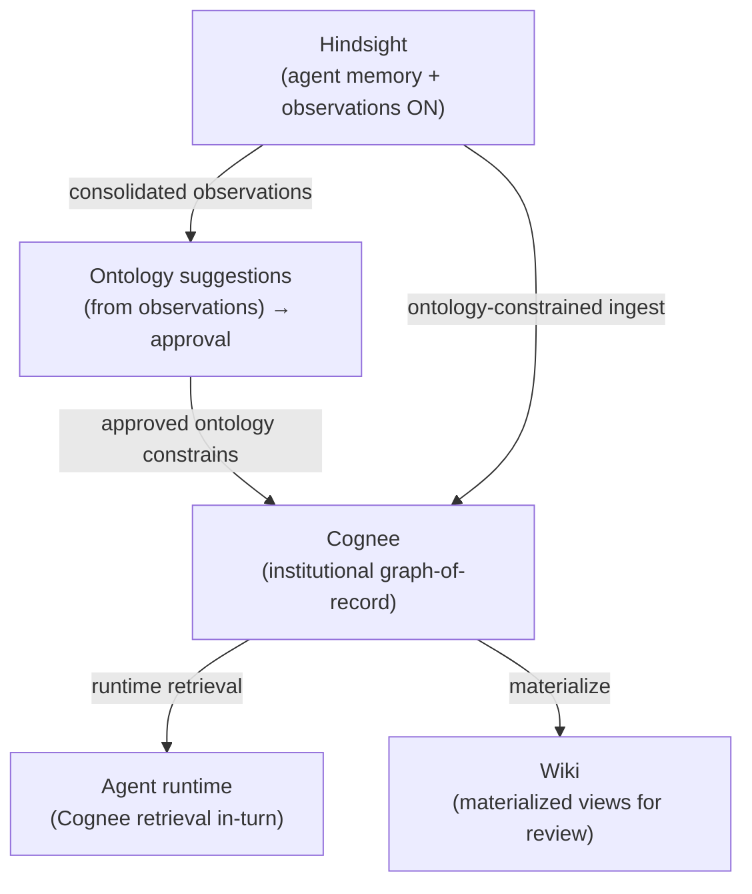

# Cognee-Centric Memory Pipeline — Requirements

## Summary

Re-center institutional memory on Cognee as the graph-of-record. Four chained features: turn on Hindsight's observation engine and consume it at runtime; drive Cognee ingest from Hindsight observations under the approved ontology; expose Cognee retrieval to the agent at runtime; and materialize the wiki *from* Cognee. The `brain.*` layer retires as a source-of-record — Cognee absorbs its role as the tenant-wide structured knowledge graph.

## Problem Frame

The three-tier memory stack (agent memory → ontology-governed structure → knowledge graph) is substantially built, but the layers are not earning their keep and the data flows in the wrong direction relative to the intended design.

Two concrete gaps, both verified against the codebase:

1. **Hindsight is run as a vector store, not an observation engine.** Each thread is retained as one document (`document_id: threadId`, `update_mode: "replace"`) — the whole-thread granularity is already correct. But `configure_bank()` exists in the client and is never called. No `observations_mission`, no consolidation config, no dedup threshold; banks are created implicitly with all defaults. Recall *requests* the `observation` fact type, yet nothing configures Hindsight to synthesize observations, and no freshness signals (stable / strengthening / weakening) or proof counts are parsed on the way back. The consolidation engine — Hindsight's actual value — is switched off.

2. **The institutional-memory pipeline runs backward and never reaches the agent.** The intended flow is Hindsight → ontology → Cognee → wiki. The built flow is Hindsight → (planner LLM) → wiki → (ontology gate) → `brain.*` → (manual ingest) → Cognee. Cognee is a *downstream, read-only consumer* of already-structured wiki/brain snapshots (Phase II explorer), with agent retrieval explicitly deferred. So the knowledge graph is not queryable mid-turn, and the wiki is built directly from raw Hindsight rather than from the graph.

The cost: the agent recalls flat memory units instead of consolidated beliefs, institutional knowledge never compounds into a graph the agent can traverse, and the wiki reflects raw memory rather than the governed entity graph users are meant to review.

## Current-State Audit

How well each layer is leveraged today, graded against the Cognee-centric target.

| Layer | Built today | Leverage | Gap to target |
|---|---|---|---|
| Hindsight retain | Whole-thread, replace-mode, one doc per thread | High | None — granularity is correct |
| Hindsight observations | Requested at recall; never configured or consolidated | **Off** | Configure bank mission + consolidation; parse freshness/proof on recall |
| Ontology suggestions | `ontology-scan` reads brain + external refs + unresolved mentions + Hindsight; proposes change-sets for approval | Medium | Re-anchor primary signal on Hindsight *observations*, not brain sections |
| `brain.*` | Tenant-scoped ontology-shaped pages; materialized from wiki planner; feeds Cognee | Medium | **Retire as source-of-record** — Cognee absorbs the role |
| wiki | User-scoped; compiled from Hindsight via planner LLM | Medium | Re-source from Cognee; planner extraction retires |
| Cognee | Ingests thread/wiki/brain snapshots; ontology-constrained OWL; read-only Phase II explorer | Low | Become graph-of-record; ingest from Hindsight; serve agent at runtime |

## Target Architecture

The approved ontology is the governance gate between observation discovery and graph ingest: observations surface candidate entity/relationship types, operators approve them, and only approved types are extracted into Cognee. The wiki and the agent are both downstream of the graph — the wiki as a human-reviewable projection, the agent as a runtime consumer.

## Key Decisions

- **Cognee is the single graph-of-record; `brain.*` retires.** One authority for the tenant knowledge graph. The trade-off accepted: loss of the SQL-queryable relational mirror `brain.*` provided — graph queries replace relational lookups. Retiring `brain.*` is the riskiest step and is sequenced last.
- **Hindsight stays the agent-memory substrate.** No engine swap, no change to the `managed`/`hindsight` toggle, no retain-granularity rework. The observation engine is the only change at this layer.
- **Observations feed Cognee, not raw facts.** Consolidated, deduped, evidence-grounded observations make a far cleaner graph than raw turn transcripts. This makes feature 1 a hard prerequisite for feature 2's quality.
- **Ontology approval stays the ingest gate.** Knowledge in unapproved entity types is deferred to ontology suggestions rather than landing in the graph ungoverned. Cleanliness over completeness.
- **Extraction moves into Cognee.** Once Cognee's ontology-constrained `cognify` is the extraction engine, the wiki planner's Hindsight→entity LLM extraction is redundant and retires; the wiki becomes a rendering of graph entities, not an extractor.

## Requirements

**Feature 1 — Hindsight observation engine**

- R1. Hindsight banks are provisioned with an explicit configuration: an `observations_mission` describing what beliefs to synthesize for a tenant/user, plus consolidation settings (dedup threshold, observation scope). Provisioning is deterministic, not implicit-on-first-retain.
- R2. The consolidation engine runs after retain so observations are synthesized from accumulated facts, not just stored.
- R3. Recall consumes observations as first-class results: freshness signals (stable / strengthening / weakening / new / stale) and proof/evidence counts are parsed and available to the runtime, not discarded.
- R4. The agent's recall→reflect path prioritizes consolidated observations over raw facts when both are available.

**Feature 2 — Cognee ingest from Hindsight observations**

- R5. Cognee ingest sources from Hindsight observations (consolidated beliefs), not from `brain.*` snapshots or raw thread transcripts.
- R6. Ingest is constrained by the approved ontology: only approved entity and relationship types are extracted into the graph.
- R7. Ontology suggestions re-anchor their primary signal on Hindsight observations — observed beliefs are the discovery source for candidate entity/relationship types.
- R8. Knowledge in unapproved types is not silently dropped: it routes to ontology suggestions as evidence for operator review.
- R9. Ingest is observable — what was ingested, what was deferred for ontology gating, and what failed extraction are inspectable.

**Feature 3 — Cognee agent access**

- R10. The agent can retrieve from the Cognee graph during a turn (graph traversal / entity lookup), not only from Hindsight recall.
- R11. Graph retrieval composes with Hindsight recall in the agent's memory path rather than replacing it — Hindsight serves episodic/experiential recall, Cognee serves entity/relationship traversal.
- R12. Retrieval is tenant-scoped and respects the same access boundaries as the rest of the memory stack.

**Feature 4 — Wiki materialization from Cognee**

- R13. Wiki pages are materialized from the Cognee graph (entities, relationships, evidence), not compiled from Hindsight via the planner.
- R14. The wiki planner's Hindsight→entity extraction path is retired once Cognee extraction is authoritative.
- R15. Wiki pages render entity/topic/decision views with provenance traceable back through the graph to source observations.

**Cross-cutting — `brain.*` retirement**

- R16. `brain.*` is retired as a source-of-record after features 1–4 are in place; no live path writes `brain.*` as authoritative structured knowledge.
- R17. Retirement is sequenced and reversible up to cutover — the graph-of-record must demonstrably serve wiki materialization and agent retrieval before `brain.*` writes stop.

## Acceptance Examples

- AE1. **Covers R1, R2, R3.** Given a user with several threads retained, when the consolidation engine has run, then recall returns at least one observation (e.g., "Alice is a Python-focused developer who values readability") with a freshness signal and proof count, distinct from the raw facts that produced it.
- AE2. **Covers R6, R8.** Given an observation referencing an entity type not in the approved ontology, when Cognee ingest runs, then no graph node of that type is created and a corresponding ontology suggestion is raised with the observation as evidence.
- AE3. **Covers R10, R11.** Given an entity with relationships in the Cognee graph, when the agent is asked a question requiring traversal ("which opportunities is this customer tied to?"), then the agent retrieves from the graph in-turn and the answer reflects relationships not present in any single Hindsight memory unit.
- AE4. **Covers R13, R15.** Given an entity materialized in the graph, when its wiki page is rendered, then the page's sections trace through the graph back to the source observations, and no content originates from the retired planner path.

## Scope Boundaries

**Deferred for later**
- Wiki scoping model (user-scoped vs tenant-scoped vs split) — see Outstanding Questions; resolve at planning.
- Retrieval mechanism for Cognee agent access (MCP tool vs memory-provider extension) — planning decision.
- Backfill strategy for existing `brain.*` / wiki content into the new pipeline.

**Outside this product's identity**
- Replacing Hindsight as the agent-memory substrate.
- Changing the `managed`/`hindsight` memory-engine toggle or retain granularity.
- Open (ungoverned) graph extraction that bypasses ontology approval.

## Dependencies / Sequencing

The four features have a hard ordering driven by data quality and migration risk:

1. **Feature 1 (observations)** first — it is a prerequisite for Feature 2's quality. Feeding raw facts to Cognee produces a noisy graph; consolidated observations produce a clean one.
2. **Feature 2 (ingest)** next — the graph must be populated and ontology-governed before anything consumes it.
3. **Features 3 and 4 (agent access, wiki)** can proceed in parallel once the graph is trustworthy — both are graph consumers.
4. **`brain.*` retirement (R16–R17)** last — only after the graph demonstrably serves both consumers.

## Outstanding Questions

**Resolve before planning**
- Wiki scoping: `brain.*` was tenant-scoped, wiki is user-scoped. Materializing wiki from the tenant graph pushes wiki toward tenant scope. Does wiki become tenant-scoped, keep a user-scoped view, or split into both?

**Deferred to planning**
- Cognee agent-retrieval mechanism: surface graph retrieval as an MCP tool, a memory-provider extension, or fold into the existing recall path?
- Ingest cadence: is Cognee ingest event-driven off observation consolidation, scheduled, or operator-triggered?
- Does the existing thread/wiki/brain Cognee source abstraction get replaced by an observation source, or extended with one during transition?

## Sources / Research

Current-state verified in:
- `packages/api/src/lib/memory/adapters/hindsight-adapter.ts` — retain (`retainConversation`, replace-mode, `document_id: threadId`), recall fact types, no bank configuration.
- `packages/agentcore/agent-container/hindsight_client.py` — `configure_bank()` defined but never called.
- `packages/api/src/handlers/memory-retain.ts`, `packages/agentcore-pi/agent-container/src/runtime/tools/memory-retain-client.ts` — per-turn whole-thread retain path.
- `packages/agentcore-pi/agent-container/src/runtime/providers/hindsight-memory-provider.ts`, `packages/pi-runtime-core/src/memory-provider.ts` — recall/reflect contract; no freshness parsing.
- `packages/api/src/lib/wiki/compiler.ts`, `packages/api/src/lib/wiki/planner.ts` — wiki compiled from Hindsight via planner LLM.
- `packages/api/src/lib/ontology/materializer.ts`, `packages/api/src/lib/ontology/suggestions.ts` — brain materialization + ontology scan sources.
- `packages/api/src/lib/knowledge-graph/{cognee-client,runs,wiki-source,brain-source,ontology-export}.ts` — Cognee ingest from thread/wiki/brain, ontology OWL constraint, read-only Phase II.
- `packages/database-pg/src/schema/{brain,wiki,ontology}.ts` — schema for the three layers.
- `terraform/modules/app/hindsight-memory/main.tf` — Hindsight config env (no consolidation vars).

Related prior planning:
- `docs/plans/2026-05-19-002-feat-ontology-gated-hindsight-wiki-plan.md` — ontology-gated materialization.
- `docs/brainstorms/2026-05-17-business-ontology-change-sets-requirements.md` — ontology change-set governance.
- `docs/plans/2026-06-04-003-feat-cognee-thread-ingest-explorer-plan.md`, `docs/brainstorms/2026-06-04-cognee-phase-ii-ingest-explorer-requirements.md` — Cognee Phase II (read-only).
- `docs/plans/2026-06-05-001-feat-knowledge-graph-wiki-brain-ingest-plan.md` — wiki/brain ingest sources.
- Hindsight observations model: https://hindsight.vectorize.io/developer/observations
