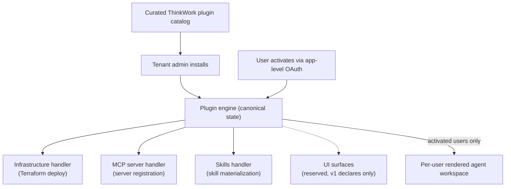

# Application Plugins

## Summary

Plugins become ThinkWork's universal packaging model for connected applications. A plugin bundles MCP servers, agent skills, future UI surfaces, and optionally managed infrastructure into one versioned package that a tenant administrator installs from a curated ThinkWork catalog. Users activate an installed application with a single app-level OAuth grant, and activation is what places the application's tools and skills into that user's dynamic agent workspace. The plugin engine owns canonical install/activation state; existing deploy, OAuth, and skill machinery become component handlers under it. V1 proves both package shapes: LastMile (external SaaS, for TEI) and Twenty (infrastructure-bundling).

---

## Problem Frame

Adding an application to ThinkWork today is bespoke hand-wiring across three subsystems: managed-application deployment (Terraform adapters in the deployment runner), managed-MCP registration (per-server rows with per-server user OAuth tokens), and the tenant skill catalog. There is no package format, no install surface, and no versioning. Users authenticate per MCP server rather than per application, and an application's skills appear for every user regardless of whether that user has connected the application.

The pressure is concrete: TEI uses LastMile daily and needs its CRM, Task, and Routing MCP servers plus accompanying skills inside ThinkWork. The next applications are already visible — Company Brain (a premium evolution of Cognee with additional lambdas and UI), and a LakeHouse application (AWS Iceberg ETL + Athena with agentic infrastructure monitoring) for another customer. Each would today require another round of scattered wiring.

This also carries the product positioning from THNK-1: ThinkWork as the centralized hub where agents and applications integrate. The hub needs a stable unit of integration, and the plugin is that unit.

---

## Key Decisions

- **Plugins are the universal application package.** Every connected application — external SaaS (LastMile), ThinkWork-deployed (Twenty), premium extensions (Company Brain), customer solutions (LakeHouse) — is packaged, installed, and activated the same way. Kestra is removed rather than migrated. This collapses THNK-1's separate Application/Plugin concepts: the plugin is the package, and installing it yields the tenant's connected application.

- **The plugin engine owns canonical state.** Plugin and component records are the source of truth for what is installed, deployed, and activated. Existing machinery — Terraform deployment, OAuth flows, skill materialization — is reused as component handlers invoked by the engine, not as parallel sources of truth. This was chosen over composing/projecting across the existing subsystems because current deployments are greenfield (Twenty exists only on a test server, Cognee is pre-production), so the rebuild is cheap now and the all-plugins end-state never needs a projection layer torn out later.

- **The v1 component taxonomy is locked to four types**: MCP servers, skills, infrastructure, and UI surfaces (reserved — declared in manifests but not rendered in v1). No other component types until a real plugin demands one.

- **No capability-namespace abstraction.** Plugins are concrete vendor bundles that name the MCP servers they ship; there is no abstract requirement layer (`crm.*` → bound application) and no install-time gap analysis. THNK-1's plugin-declares-requirements model is dropped, not deferred with a hook.

- **Distribution is a curated ThinkWork catalog.** ThinkWork publishes plugins to a catalog the platform checks; tenant admins browse and install from a Plugins surface. The v1 catalog may contain only LastMile and Twenty. Zip/bundle sideload is a later dev path.

- **Activation is per-user, per-application, via one OAuth grant.** Users authenticate against the application once — not against individual MCP servers. Per-server access derives from the app-level grant.

- **Activation gates the dynamic workspace.** A user who has not activated an application gets none of its MCP tools or skills in their rendered agent workspace. This makes skills user-aware for the first time; today skills materialize tenant/agent-wide.

- **The direct MCP-add path remains.** Plugins are the packaging pattern, not the only way to reach an MCP server. The runtime's tool surface merges plugin-installed components with directly-added servers.

- **The connected-application registry plan is paused, not consumed.** `docs/plans/2026-06-08-003-feat-connected-application-registry-plan.md` (capability contracts, Twenty→Cognee webhook automation, capability flows) has no landed code and drops out as a dependency. It may resume later on top of the plugin model.

---

## Actors

- A1. ThinkWork (plugin publisher): authors plugin packages and publishes them to the curated catalog.
- A2. Tenant administrator: browses the catalog, installs/uninstalls/updates plugins for the tenant.
- A3. End user: activates an installed application via OAuth; their activation state determines workspace contents.
- A4. Agent runtime: renders the per-thread workspace for the requesting user and exposes MCP tools accordingly.

---

## Key Flows

- F1. Publish
  - **Trigger:** ThinkWork releases a new plugin or version.
  - **Actors:** A1
  - **Steps:** ThinkWork authors the plugin manifest (identity, version, components) and publishes it to the curated catalog. Installed tenants can see an update is available.
  - **Outcome:** The plugin is discoverable and installable by tenant admins.
  - **Covered by:** R1, R2, R5, R6

- F2. Install
  - **Trigger:** A tenant admin installs a plugin from the catalog.
  - **Actors:** A2
  - **Steps:** The plugin engine records the install and provisions each component through its handler: infrastructure components deploy via the existing Terraform machinery, MCP server components register their endpoints, skill components land in the tenant skill surface. Install progress and per-component status are visible to the admin.
  - **Outcome:** The application exists for the tenant, ready for user activation; no user sees its tools yet.
  - **Covered by:** R3, R7, R8, R9, R10

- F3. Activate
  - **Trigger:** An end user activates an installed application.
  - **Actors:** A3
  - **Steps:** The user completes one OAuth flow against the application. The grant covers all of the application's MCP servers; activation state is recorded per user per application.
  - **Outcome:** The application's tools and skills appear in that user's agent workspace from the next thread/turn onward.
  - **Covered by:** R12, R13, R14

- F4. Workspace gating
  - **Trigger:** A thread turn renders the agent workspace for a requesting user.
  - **Actors:** A3, A4
  - **Steps:** The rendered workspace includes MCP tools and skills only from applications the requesting user has activated, plus directly-added MCP servers per existing behavior. Non-activated applications contribute nothing — no tools, no skills, no routing entries.
  - **Outcome:** Agents never see or describe capabilities the requesting user cannot use.
  - **Covered by:** R14, R15, R16

- F5. Uninstall / deactivate
  - **Trigger:** An admin uninstalls a plugin, or a user deactivates (or revokes) an application.
  - **Actors:** A2, A3
  - **Steps:** Deactivation removes the user's grant and their workspace presence for the app. Uninstall tears down components through the same handlers (infrastructure destroy/park, MCP deregistration, skill removal) and removes the app for all users.
  - **Outcome:** No orphaned tools, skills, credentials, or infrastructure.
  - **Covered by:** R11, R13, R15

---

## Requirements

**Packaging and manifest**

- R1. A plugin is a versioned package described by a manifest declaring identity, version, and components.
- R2. The manifest supports exactly four component types in v1: MCP servers, skills, infrastructure, and UI surfaces.
- R3. One manifest format covers both package shapes: external-SaaS plugins (no infrastructure components) and infrastructure-bundling plugins.
- R4. UI surface components are declared in v1 but not rendered; the type exists so manifests are forward-compatible with in-ThinkWork application snippets.

**Catalog and distribution**

- R5. ThinkWork publishes plugins to a curated catalog that deployed platforms can check.
- R6. Tenant admins can browse the catalog, see plugin contents and versions, and install from it.

**Install lifecycle**

- R7. The plugin engine is the canonical record of plugin install state, component provisioning state, and per-user activation state.
- R8. Installing a plugin provisions every declared component through its handler; infrastructure components reuse the existing Terraform deployment machinery.
- R9. Install is tenant-wide and admin-only; install alone exposes nothing to end users.
- R10. Admins can see per-component install/health status for an installed plugin.
- R11. Uninstalling removes all components and all derived state — infrastructure, MCP registrations, skills, and user activations — with no orphans.

**Activation and auth**

- R12. A user activates an installed application through a single app-level OAuth grant; the grant covers all of the application's MCP servers.
- R13. Users can deactivate an application, revoking the grant and removing its workspace presence for them.

**Workspace integration**

- R14. A user's rendered agent workspace includes an application's MCP tools and skills only when that user has activated the application.
- R15. Skills gating is per-requester: the same agent serves activated and non-activated users with different rendered workspaces.
- R16. Directly-added MCP servers continue to work unchanged alongside plugin-installed ones.

**V1 proof**

- R17. A LastMile plugin ships with the CRM, Task, and Routing MCP servers and accompanying skills, installable by TEI's admin and activatable by TEI users.
- R18. Twenty is rebuilt as an infrastructure-bundling plugin; its existing test-server users re-authenticate once through app-level activation.

---

## Acceptance Examples

- AE1. **Covers R9, R12, R14.** Given TEI's admin has installed the LastMile plugin and user A has activated it while user B has not, when each user's agent workspace renders, then A's agent has the LastMile MCP tools and skills and B's agent has none of them.
- AE2. **Covers R12.** Given a user activates LastMile, when they complete the single OAuth flow, then all three LastMile MCP servers are usable without further authentication steps.
- AE3. **Covers R3, R8.** Given the Twenty plugin is installed, when the engine provisions it, then its infrastructure component deploys through the existing Terraform machinery and its MCP and skill components register the same way LastMile's do.
- AE4. **Covers R11, R13.** Given a user deactivates LastMile (or the admin uninstalls it), when their next workspace renders, then no LastMile tools, skills, or routing entries remain, and uninstall leaves no orphaned infrastructure or credentials.
- AE5. **Covers R5, R6.** Given ThinkWork publishes a new plugin version to the catalog, when the tenant admin opens the Plugins surface, then the available update is visible and installable.

---

## Success Criteria

- TEI end-to-end: admin installs LastMile from the catalog, users activate via one OAuth, activated users' agents work with LastMile CRM/Task/Routing tools, everyone else's workspace stays clean.
- Both package shapes are proven by shipping plugins (LastMile external-SaaS, Twenty infrastructure-bundling) through the same manifest, install, and activation paths.
- Adding the next application (Company Brain, LakeHouse) is primarily authoring and publishing a plugin package, not scattering code across API, web, deployment, and database packages.

---

## Scope Boundaries

### Deferred for later

- Company Brain and LakeHouse plugin migrations (Company Brain subsumes Cognee and is the premium follow-up).
- Premium plugin entitlements and billing.
- Rendering UI surface components (in-ThinkWork application snippets).
- Zip/bundle sideload for custom or in-development plugins.
- Third-party plugin authoring and self-publishing to the catalog.
- Resuming the connected-application registry work (cross-app bindings, capability flows, webhook automation) on top of the plugin model.

### Outside this product's identity

- No abstract capability-requirement layer: plugins name concrete vendor MCP servers; ThinkWork does not own a cross-vendor capability taxonomy.
- No public open marketplace: the catalog is ThinkWork-curated.

---

## Dependencies / Assumptions

- LastMile's CRM, Task, and Routing MCP servers share a single auth domain; one OAuth grant covers all three (confirmed 2026-06-12).
- The deployment-runner Terraform machinery is reusable as the infrastructure component handler without rewriting its internals.
- The per-thread rendered workspace (Agent/Spaces/User source model) can take a per-requester filter for skills and tool wiring.
- Kestra has no users or dependents that block its removal.
- The existing Managed Applications and MCP Servers settings surfaces will be reshaped or absorbed by the Plugins surface; their current behavior is not a compatibility constraint.

---

## Outstanding Questions

### Resolve Before Planning

- None.

### Deferred to Planning

- Which identity provider/flow LastMile exposes for the app-level OAuth grant.

- Catalog hosting mechanism (public repo, bucket, or API) and how deployed platforms check it.
- Manifest format details and validation.
- How the plugin engine invokes the deployment runner for infrastructure components, and how install status streams back.
- Settings information architecture: what happens to the existing Managed Applications and MCP Servers pages when the Plugins surface lands.
- Upgrade semantics: what a plugin version bump may change in place versus require reinstall/re-activation.
- Per-requester skill materialization mechanics in the rendered workspace.
