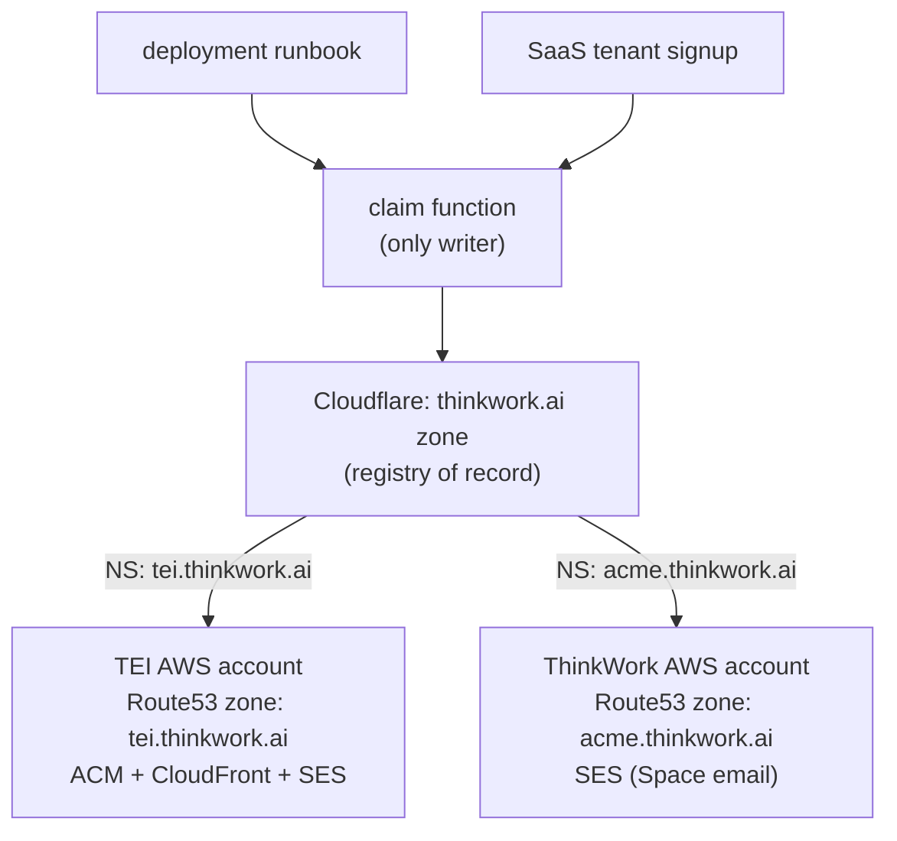

# Customer Domain Namespace — Requirements

## Summary

Every deployed ThinkWork environment gets a subdomain of `thinkwork.ai` (e.g., `tei.thinkwork.ai`) delegated into the customer's AWS account, covering the web app URL and the SES email identity (`agent@tei.thinkwork.ai`). The `*.thinkwork.ai` namespace is flat and shared between customer deployments and SaaS tenants, with the Cloudflare zone itself acting as the registry of record. TEI is the first consumer, migrating off `lastmile-tei.com`.

---

## Problem Frame

Customer deployments currently inherit whatever domain exists in the customer's AWS account. TEI's account had only `lastmile-tei.com`, so their environment's web URL and SES identity (Cognito invites, agent email) hang off a domain that misrepresents the product and varies per customer. The deploy controller exposes no domain configuration, so there is no repeatable answer for customer #2.

The SaaS stack already solves the adjacent problem in-account: tenant subdomains like `acme.thinkwork.ai` get a Route53 subzone plus SES identity for Space email. What's missing is the cross-account version of that pattern, and a single registry so the two worlds can't claim colliding names.

---

## Key Decisions

- **Flat shared namespace.** Customer deployments and SaaS tenants draw from the same `<name>.thinkwork.ai` pool. No sub-namespacing (e.g., no `*.app.thinkwork.ai` split) — the shipped Space-email pattern stays where it is, and a deployment and a tenant for the same company are conceptually the same thing.
- **Cloudflare is the registry of record.** A name is taken if any DNS record exists for it in the `thinkwork.ai` Cloudflare zone. No separate database until the control plane needs to own one; the enforcement point can move later without changing the namespace rule.
- **One claim function is the only writer.** Both the SaaS tenant-signup path and the deployment path go through a shared check-and-create function that consults Cloudflare, enforces the reserved list, writes the NS records, and stamps each record with a comment identifying owner and kind (`deployment:tei` / `tenant:acme`). Release goes through the same function.
- **Delegation, not central hosting.** Each claimed name is NS-delegated to a Route53 zone — in the customer's account for deployments, in ThinkWork's account for SaaS tenants. The owning account then manages its own ACM certs, CloudFront aliases, and SES records without cross-boundary operations.
- **v1 automation stops at the NS hop.** The customer stack creates its Route53 zone, cert, web alias, and SES identity automatically; the single manual step is ThinkWork ops pasting the 4 NS records into Cloudflare via a runbook. Full automation through the control plane is deferred until customer volume justifies it.
- **Scale escape hatch is SaaS-side only.** Each name costs ~4 NS records; Cloudflare headroom is roughly 200 names before limits matter. If self-serve tenant signup ever explodes, only the SaaS-tenant pattern changes (e.g., move `thinkwork.ai` DNS to Route53); customer-deployment delegations number in the dozens and are untouched.

---

## Requirements

**Namespace and registry**

- R1. A name is claimable iff no DNS record for `<name>.thinkwork.ai` exists in the Cloudflare zone and the name is not on the reserved list.
- R2. The reserved list lives in code and includes at least: `www`, `app`, `docs`, `api`, `admin`, `agents`, `mail`, and stage names (`dev`, `canary`).
- R3. All namespace writes (claim and release) go through the shared claim function; no hand-created records.
- R4. Each claimed name's records carry a Cloudflare record comment identifying kind and owner (e.g., `deployment:tei`, `tenant:acme`) and creation date.
- R5. The SaaS tenant-slug path adopts the same claim function so tenant signup cannot take a name already delegated to a deployment, and vice versa.

**Deployment delegation and web**

- R6. A customer deployment's Terraform creates a Route53 hosted zone for `<name>.thinkwork.ai` in the customer's account and outputs its NS records for the delegation runbook.
- R7. After delegation, the customer stack provisions its ACM certificate via DNS validation in its own zone and serves the web app at `https://<name>.thinkwork.ai`.
- R8. The deployment runbook documents the NS-hop step end to end: claim the name, paste NS records, verify resolution.

**Email**

- R9. The customer stack registers `<name>.thinkwork.ai` as an SES domain identity in the customer's account, with DKIM and MAIL FROM records in its own zone.
- R10. The identity supports both sending (Cognito invites, notifications, agent outbound) and receiving (MX + receipt rules), matching the SaaS Space-email pattern — addresses like `agent@tei.thinkwork.ai` work in both directions.
- R11. Cognito email (invites, resets) sends from the `<name>.thinkwork.ai` identity via the existing `cognito_email_source_arn` wiring.

**Lifecycle**

- R12. Decommissioning a deployment or deleting a tenant releases its name through the claim function, removing the Cloudflare records.
- R13. TEI migrates from `lastmile-tei.com` to `tei.thinkwork.ai` as the first consumer of this mechanism.

---

## Acceptance Examples

- AE1. **Covers R1, R5.** Given the TEI deployment has claimed `tei`, when a SaaS tenant signs up with slug `tei`, then the claim function rejects the slug and the user picks another.
- AE2. **Covers R1, R2.** Given `api` is on the reserved list, when any path attempts to claim `api`, then the claim is rejected regardless of Cloudflare state.
- AE3. **Covers R10.** Given delegation and SES setup are complete for `tei`, when an external user emails `agent@tei.thinkwork.ai`, then SES in TEI's account receives it via the subzone's MX records; when the agent replies, the mail is DKIM-signed by `tei.thinkwork.ai`.
- AE4. **Covers R12.** Given TEI churns, when the deployment is decommissioned, then its NS records are removed from Cloudflare and `tei` becomes claimable again.

---

## Scope Boundaries

**Deferred for later**

- Customer-owned domains (e.g., `thinkwork.tei.com`) as a first-class alternative. The Terraform custom-domain support that exists today is not removed, but no new work targets it.
- Fully automated claim via an authenticated control-plane API; v1 is the runbook + shared claim function.
- A standalone namespace registry (database/control-plane owned); Cloudflare records are the registry until self-serve volume demands more.
- Moving additional surfaces (Cognito hosted UI domain, API endpoint) under the customer subdomain.

**Out of scope**

- Changing the SaaS tenant Space-email architecture or migrating existing tenant subzones.
- Any non-AWS DNS hosting for customer stacks.

---

## Dependencies / Assumptions

- Each customer AWS account needs its own SES production access; TEI's is still pending (pool on `COGNITO_DEFAULT` until granted).
- The `thinkwork.ai` apex DMARC record's subdomain policy must not block customer-subdomain sending; the delegated zone can publish its own DMARC record if needed — verify during planning.
- The Cloudflare API token in CI has DNS-write scope usable by the claim function.
- Both naming paths are ops-gated today; the flat namespace assumes no open self-serve signup minting slugs at volume yet.

---

## Outstanding Questions

**Resolve before planning**

- None.

**Deferred to planning**

- Where the claim function lives for v1 (repo script invoked by the runbook vs. a controller-adjacent module) and how the SaaS signup path calls it.
- Sequencing of the TEI cutover: when `lastmile-tei.com` SES identity and Cognito email source are switched and decommissioned, and whether a dual-identity window is needed.
- Exact reserved-list contents and whether existing Cloudflare records (e.g., `agents.thinkwork.ai`) auto-seed it.
- DMARC/SPF specifics for delegated subzones (verify the apex policy interaction noted in Dependencies).
