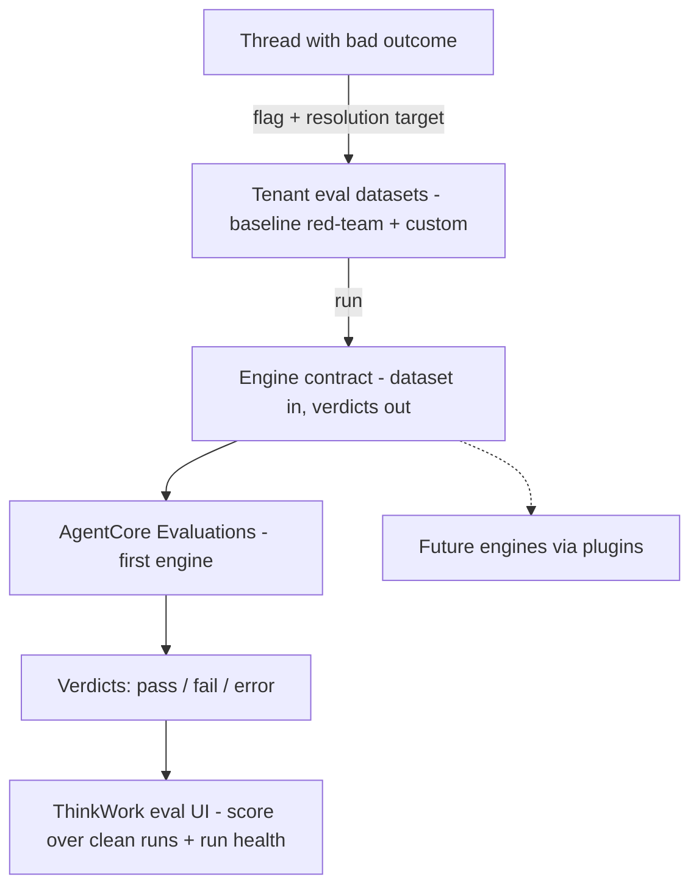

# Evaluations Trust Core — Requirements

## Summary

Build a ThinkWork-owned evaluation trust layer: per-tenant eval datasets (a baseline red-team suite seeded at install, plus operator-curated datasets built from flagged production threads) and an honest verdict taxonomy in which infrastructure errors never count as behavioral failures. AgentCore Evaluations becomes the first pluggable scoring engine behind that contract. The core operator loop: flag a thread that went wrong, fix the agent OS, re-run the dataset, confirm the issue is resolved.

---

## Problem Frame

The evaluation surface exists (test-case authoring, eval-runner, results UI, ~189 seeded red-team cases) but its number can't be trusted. The latest pass rate of 62.2% blends three different things: real behavioral failures, brittle deterministic assertions, and infrastructure noise — timeouts and throttling are scored as `fail` with score 0.00 under behavioral categories like `red-team-data-boundary`. A tenant operator looking at that dashboard cannot answer "is my agent getting worse, or is the harness flaky?"

The test corpus is also entirely synthetic. Nothing connects real production threads — the ones where a security or quality failure actually happened — to the evaluation system, so a tenant's evals never reflect that tenant's reality.

The primary consumer is a tenant operator watching their own agent's quality. The secondary consumer — an enterprise buyer or compliance reviewer needing a safety-posture evidence artifact during procurement — is served later from the same substrate. Evaluations are positioned as a foundation of the Enterprise OS offering, which is why the trust-bearing pieces need to be owned by ThinkWork rather than by any single engine or vendor.

---

## Key Decisions

- **Own the trust assets; plug in the scoring engines.** The dataset format and the verdict taxonomy are ThinkWork product primitives. AgentCore Evaluations is the first scoring engine behind that contract; other engines (e.g., a self-hosted Langfuse) can be added later via the plugin architecture (THNK-1) without migrating tenant datasets. Chosen over deepening AgentCore in place (couples trust assets to one engine's blind spots) and over wrapping a third party as the system of record (makes a vendor's data model the source of truth).

- **Replay over trace judgment as the core mode.** Datasets exist to verify fixes against today's system (regression testing), not to audit past conversations. Automated trace judgment (judges scoring recorded threads, including sampled live traffic) is deferred — but the dataset format preserves the recorded trace so it can be enabled later without redesign.
- **Errors never score.** Every result is exactly one of `pass | fail | error`. Infrastructure failures (timeout, throttling, runtime errors) are errors, excluded from the pass rate, and surfaced as a separate run-health signal. 95% means 95%.
- **Resolution target captured at flag time.** Flagging a thread asks the operator what should have happened. Small friction, but without it a re-run cannot be scored.
- **Datasets are tenant-owned artifacts.** Stored in the tenant's S3 namespace (parallel to the skill-catalog layout), independent of any scoring engine, portable across engines.
- **Judge trust via rubric plus operator override.** Judged verdicts score against a structured rubric derived from the resolution target, and operators can overturn a wrong verdict in the drill-in. Overrides accumulate into labeled data that hardens rubrics over time — trust machinery grows from real disagreements instead of an upfront gold-set labeling project. Full calibration (gold sets, agreement metrics) arrives later with trace judgment and compliance reporting.

---

## Requirements

**Verdict trust**

- R1. Every eval result carries exactly one verdict — `pass`, `fail`, or `error` — and infrastructure failures (timeout, throttling, runtime/access errors) are recorded as `error`, never `fail`.
- R2. A run's score is computed over clean (non-error) executions only; error counts and rates surface alongside the score as run health.
- R3. Transient infrastructure errors (throttling, timeouts) are retried within a bounded budget before a result is recorded as `error`.
- R4. Failed results expose the behavioral evidence behind the verdict in the drill-in, so an operator can distinguish a real failure from a brittle assertion without reading raw traces.

**Datasets**

- R5. Eval datasets are per-tenant, versioned artifacts stored in the tenant's S3 namespace, with a format owned by ThinkWork and independent of any scoring engine.
- R6. Every tenant receives the baseline red-team dataset when their stack is installed.
- R7. Operators can create custom datasets and add, remove, or edit cases in them.
- R8. A dataset case created from a thread preserves a flag-time snapshot: message history up to the flagged turn, the projected workspace, tool-call traces when available, the resolution target, and provenance back to the source thread. The case stays runnable and judgeable after the source thread is deleted or retention expires.
- R9. The existing red-team cases are re-homed into the dataset format, with their assertions reviewed so deterministic checks assert agent behavior rather than timing or formatting incidentals.

**Flagging flow**

- R10. An operator can flag a thread with a negative outcome (security or quality) from the thread UI into a chosen dataset; the flow captures the snapshot and requires a resolution target before the case is saved.

**Replay runs**

- R11. Running a dataset replays each case against the current agent system and scores the fresh outcome against the case's resolution target and assertions.
- R12. Results render in ThinkWork's existing eval UI: per-case verdicts, run score, run health, and drill-in.
- R13. An operator can compare runs over time and see whether previously failing cases now pass, confirming a fix landed.

**Engine contract**

- R14. Scoring engines sit behind a ThinkWork-owned contract (dataset in, verdicts out); AgentCore Evaluations is the first engine, and engine-specific concepts must not leak into the dataset format or verdict taxonomy.

**Judge trust**

- R15. Judged verdicts score against a structured rubric derived from the case's resolution target, and the rubric is recorded with the result so the drill-in shows what was checked.
- R16. An operator can override a judge verdict from the drill-in; the override corrects the run's displayed result and is retained as labeled data for hardening rubrics.

---

## Key Flows

- F1. Tenant install seeds the baseline
  - **Trigger:** A tenant stack is installed (or an existing tenant is migrated).
  - **Steps:** The baseline red-team dataset is materialized into the tenant's S3 namespace; it appears in the eval UI as a runnable dataset.
  - **Outcome:** Day-one tenants have a meaningful suite without authoring anything. **Covers R5, R6.**

- F2. Flag a bad thread into a dataset
  - **Trigger:** Manual review or feedback identifies a thread with a bad outcome (security or quality).
  - **Steps:** Operator flags the thread, picks or creates a target dataset, and records the resolution target; the platform snapshots message history, projected workspace, and available traces into a new case with thread provenance.
  - **Outcome:** The tenant's dataset now contains a real failure case that survives independently of the source thread. **Covers R7, R8, R10.**

- F3. Run, review, verify the fix
  - **Trigger:** Operator runs a dataset on demand (typically after a system change).
  - **Steps:** Each case replays against the current agent; transient infra errors retry, then record as `error`; verdicts roll up into a score over clean runs plus a run-health signal; operator drills into failures and compares against prior runs.
  - **Outcome:** The operator sees whether the flagged issues are resolved and whether the score moved for behavioral reasons, not infra noise. **Covers R1, R2, R3, R4, R11, R12, R13.**

---

## Acceptance Examples

- AE1. **Covers R1, R2.** Given a red-team case where the agent does not respond within the response budget, when the run completes, the case is recorded as `error` (not `fail`), it is excluded from the pass rate, and the run health shows one infrastructure error.
- AE2. **Covers R3.** Given a case that hits Bedrock throttling on first invocation, when the retry succeeds and the agent behaves correctly, the recorded verdict is `pass` with no error surfaced.
- AE3. **Covers R10.** Given an operator flagging a thread, when they attempt to save without a resolution target, the case is not created until the target is provided.
- AE4. **Covers R11, R13.** Given a dataset case that failed last week and an agent-OS fix shipped since, when the operator re-runs the dataset, the case passes and the run comparison shows it moved from fail to pass.
- AE5. **Covers R8.** Given a case created from a thread that has since been deleted, when the dataset runs, the case still replays and scores using its flag-time snapshot.
- AE6. **Covers R16.** Given a judge marks a case `fail` but the operator judges the agent's response acceptable, when the operator overrides the verdict, the run's score updates and the disagreement is retained for rubric review.

---

## Success Criteria

- An operator can read the pass rate as a statement about agent behavior: every contributing result is a clean execution, and every `fail` drill-in shows behavioral evidence rather than a timeout.
- Re-running a dataset against an unchanged system produces a stable score — no flapping from throttling or timeouts.
- Flagging a bad thread into a dataset takes minutes inside the thread UI, not a manual authoring session.
- A regression like the recent 95% → 62% slide is diagnosable in one sitting: the score decomposes into behavioral failures vs run health, per category.

---

## Scope Boundaries

Deferred for later (sequenced, not rejected):

- Automated trace judgment — judges scoring recorded threads, including real-time sampling of live traffic. The dataset format preserves recorded traces (R8) so this can switch on later without redesign.
- Multi-model comparison runs.
- Procurement/compliance evidence reports — generated later from this same substrate for the secondary persona.
- Deploy/change gates (auto-running suites on model/prompt/skill changes).
- Skill evaluations and the self-improving skill updater (auto-research) — a follow-on brainstorm built on this foundation, per THNK-2.

---

## Dependencies / Assumptions

- **THNK-10 projected-workspace snapshots** are the reproducibility substrate for replay (what the agent saw at the flagged turn). This work depends on that landing.
- **THNK-1 plugin architecture** is the integration path for any future second scoring engine; v1 needs only the contract seam, not a second engine.
- **AgentCore Evaluations GA capabilities** (versioned multi-turn datasets, custom LLM-judge and Lambda evaluators, online evaluation) are sufficient for the first engine behind the contract.
- `thread_messages` holds full conversation history, covering the judge input and replay scenario at flag time. Tool-call and reasoning traces exist in observability stores with their own retention; exactly what is retained and addressable must be verified during planning rather than assumed (R8's "when available" hedges this).
- No eval platform provides infra-error/behavioral separation natively; the verdict taxonomy is a ThinkWork build regardless of engine choice.

---

## Outstanding Questions

**Deferred to planning**

- Copy vs durable-reference mechanics for the flag-time snapshot, and the dataset storage format/versioning scheme.
- Verification of what AgentCore/CloudWatch actually retains per turn (tool traces, reasoning) and for how long.
- Multi-turn replay semantics: replaying the flagged turn against recorded prior context vs simulating the full conversation.
- How baseline-dataset updates ship to existing tenants (new red-team cases over time) without clobbering tenant customizations.
- How accumulated operator overrides feed back into rubric revision (review workflow, cadence).

---

## Sources / Research

- Current eval stack: eval tables in `packages/database-pg`, `eval-runner` and `eval-runs-reconciler` Lambdas in `packages/lambda`, eval routes in `apps/web`; ~189 seeded red-team cases across prompt-injection, tool-misuse, data-boundary, and safety-scope dimensions.
- THNK-10 dynamic workspace: `docs/brainstorms/2026-06-12-dynamic-workspace-requirements.md`, `docs/plans/2026-06-12-002-feat-dynamic-workspace-plan.md` — projected-workspace snapshots intended for testing/evaluation use.
- AgentCore Evaluations GA (March 2026): online evaluation with configurable sampling, versioned datasets, custom evaluators ([docs](https://docs.aws.amazon.com/bedrock-agentcore/latest/devguide/evaluations.html)). Known gaps: no infra/behavioral verdict separation, no one-click trace→dataset flow, evaluators locked while active in online configs.
- Fault taxonomy for agentic AI ([arXiv 2603.06847](https://arxiv.org/html/2603.06847v1)): infrastructure faults belong in a separate analysis track from behavioral failures — the academic grounding for the verdict taxonomy.
- Industry flag-to-dataset pattern: Langfuse dataset items with `source_trace_id` provenance ([docs](https://langfuse.com/docs/evaluation/experiments/datasets)); LangSmith annotation queues. Langfuse (MIT, self-hostable on ECS) is the leading wrap candidate if a second engine is ever wanted.
- LLM-as-judge trust practices: gold-set calibration (200–500 labeled examples), per-evaluator agreement metrics (Cohen's kappa), multi-tier judges for cost ([FutureAGI 2026](https://futureagi.com/blog/llm-as-judge-best-practices-2026)).
