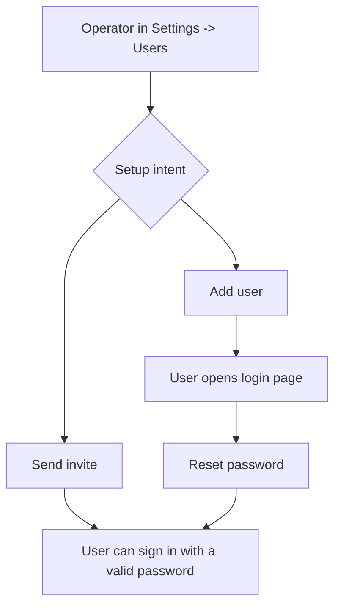

# Manual Setup

## Problem Frame

Operators can invite users by email from Settings -> Users, but some customer
setup moments need a quieter manual path: add a user record and tenant access
without sending an invitation email immediately. The same surface also needs to
make the email-invite action clearer and give password users a self-service way
to recover or establish a password from the login page.

The product shape for v1 is three related flows, not one overloaded "invite"
button: add a user without email delivery, send or resend an invite email, and
reset a password from login.

---

## Actors

- A1. Operator: an owner or admin managing tenant users in Settings.
- A2. Manual user: a person whose account is added without an invitation email.
- A3. Invited user: a person receiving a ThinkWork invitation email.
- A4. Password user: a person signing in with email/password rather than Google
  OAuth.

---

## Key Flows

- F1. Manual user setup
  - **Trigger:** An operator needs a user present in the tenant without sending
    an invitation email.
  - **Actors:** A1, A2
  - **Steps:** Operator opens Settings -> Users, chooses Add user, enters email,
    optional name, and role, submits, then sees the user in the users list with
    accurate access status. No invitation email is represented as sent.
  - **Outcome:** The user exists as a tenant member and can establish credentials
    through the login-page reset flow or another approved out-of-band process.
  - **Covered by:** R1, R2, R3, R4, R8

- F2. Invite by email
  - **Trigger:** An operator wants ThinkWork to email a setup invitation.
  - **Actors:** A1, A3
  - **Steps:** Operator chooses Send invite, enters email, optional name, and
    role, submits, and sees success only when the system has actually attempted
    delivery. Delivery or configuration failures are surfaced to the operator.
  - **Outcome:** The invitee receives an email-driven setup path, or the
    operator sees a failure that explains that no email was sent.
  - **Covered by:** R1, R5, R6, R7

- F3. Password reset from login
  - **Trigger:** A password user cannot sign in, has an expired temporary
    password, or was manually added and needs to establish credentials.
  - **Actors:** A2, A4
  - **Steps:** User opens the login page, chooses Reset password, enters email,
    receives a reset code when eligible, sets a new password, and returns to
    sign in.
  - **Outcome:** A password user can recover without asking an operator to
    resend an invite or manually handle credentials.
  - **Covered by:** R8, R9, R10, R11

---

## Requirements

**Settings -> Users actions**

- R1. The Users page must present Add user and Send invite as distinct primary
  actions, with labels and icons that make the difference clear: Add user uses a
  plus/add metaphor; Send invite uses a send/email metaphor.
- R2. Add user must create tenant access without sending or claiming to send an
  invitation email.
- R3. Add user must collect only the setup details needed for v1: email,
  optional display name, and role.
- R4. Add user must place the resulting user in the users list immediately with
  an accurate role and status, and must make duplicate or already-member cases
  explicit instead of silently succeeding.
- R5. Send invite must keep the existing email-invitation intent: the action
  attempts delivery to the user's email and should be named, iconed, and messaged
  as email delivery rather than generic creation.
- R6. Invite and resend behavior must not reuse a success result from an earlier
  create/invite attempt when no new delivery attempt happened.
- R7. Email delivery failures, Cognito configuration failures, and sandbox-style
  delivery blockers must be visible to the operator; success text must mean an
  invite or resend attempt actually happened.

**Password reset**

- R8. The login page must expose a Reset password path when email/password sign
  in is available.
- R9. Reset password must support the normal Cognito recovery shape: request a
  code by email, accept code plus new password, confirm the password change, and
  return the user to sign in.
- R10. Reset-password messaging must avoid casual account enumeration. The email
  submission step should use neutral confirmation copy unless the system must
  surface a real configuration, rate-limit, or recovery failure.
- R11. Google OAuth remains the preferred path for federated users; the reset
  path is for password users and manually added users who need password
  credentials.

**Access and safety**

- R12. Manual add, invite, resend, role assignment, and removal remain
  operator-only capabilities; ordinary members must not see or invoke them.
- R13. None of these flows should require an operator to create, view, copy, or
  distribute a user's password.
- R14. The visible UI must keep search/table operations usable while making both
  setup actions easy to discover at the top of the Users surface.

---

## Acceptance Examples

- AE1. **Covers R1, R2, R3, R4, R13.** Given an operator adds
  `new.user@example.com` as a member through Add user, when the action succeeds,
  then the user appears in Settings -> Users and the UI does not say an
  invitation email was sent.
- AE2. **Covers R1, R5, R6, R7.** Given an operator chooses Send invite for a
  user and Cognito/SES cannot send the email, when the action completes, then
  the UI shows a failure rather than "Invite sent" or "Invite resent".
- AE3. **Covers R4.** Given an operator tries to add an email that is already an
  active tenant member, when they submit, then the UI explains that the user is
  already a member and does not create a duplicate row.
- AE4. **Covers R8, R9, R10, R11.** Given a manually added password user opens
  the login page, when they choose Reset password and complete the emailed code
  challenge, then they can sign in with the new password.
- AE5. **Covers R12.** Given a non-operator member opens Settings, when they
  browse available settings pages, then they cannot access Add user, Send invite,
  or user-management reset/resend controls.

---

## Success Criteria

- Operators can choose between "create access now" and "email an invitation"
  without guessing which side effects will occur.
- A manually added user has a clear, self-service path to set or recover a
  password from login.
- Invite/resend success copy becomes trustworthy: it is not shown when delivery
  was skipped by idempotency or blocked by configuration.
- The next planning agent can move directly into implementation planning without
  inventing the user-facing flows, v1 scope boundaries, or success criteria.

---

## Scope Boundaries

- No bulk import, SCIM, Google Workspace directory sync, or external IdP user
  provisioning in v1.
- No operator-visible password assignment or password copy/paste workflow.
- No change to Google OAuth account creation, hosted OAuth behavior, or the
  "Create one" environment-onboarding path.
- No end-user-facing tenant self-join flow from the reset-password page.
- No mobile-specific password reset requirement in this artifact unless planning
  finds the same component is shared safely.
- No requirement to add a new "manual" user status if existing membership and
  Cognito statuses can communicate the state accurately.

---

## Key Decisions

- Separate Add user from Send invite: Manual setup and email delivery have
  different operator intent and different side effects.
- Prefer user-driven reset over operator password handling: Manually added users
  should establish credentials through the login reset flow, not by receiving a
  password from an operator.
- Keep resend as email delivery, not generic creation: THNK-28 showed that
  conflating create/invite/resend can produce false success when no email was
  sent.
- Keep actions top-level: The issue screenshot calls out header placement, and
  the requirement is discoverability near the Users page's existing top controls;
  exact header-vs-toolbar placement can be finalized during design/implementation
  as long as both actions remain distinct.

---

## Dependencies / Assumptions

- Linear THNK-29 has priority High, label Codex, status Brainstorming, project
  Enterprise Agent OS, no attached Linear documents, no link attachments, and no
  parent/child/blocker/dependency metadata returned by the Linear fetch.
- The issue screenshots show the current Users page with a single "+ Invite
  member" action and the current login page with Google plus email/password
  sign-in but no visible reset-password path.
- Existing code verifies the current Settings -> Users list uses only the
  `inviteMember` path from `apps/web/src/components/settings/SettingsUsers.tsx`.
- Existing code verifies `apps/web/src/lib/auth.ts` already has Cognito
  `forgotPassword` and `confirmForgotPassword` helpers, but
  `apps/web/src/components/auth/EmailPasswordForm.tsx` does not expose them.
- Existing schema includes `addTenantMember`, but the resolver only links an
  existing principal id; it is not, by itself, the operator-ready manual user
  setup flow described here.
- The THNK-28 writeup at
  `docs/solutions/integration-issues/tei-resend-invite-idempotency-and-ses-sandbox-2026-06-15.md`
  is relevant context for invite/resend semantics.

---

## Outstanding Questions

### Resolve Before Planning

- None.

### Deferred to Planning

- [Affects R2, R4, R8][Technical] Decide the safest Cognito backing behavior for
  manual add without an invitation email while still enabling login-page
  password reset.
- [Affects R1, R14][Design] Choose final placement for Add user and Send invite
  within the existing settings header/table layout, preserving the issue's
  preference for header discoverability when it fits the local UI.
- [Affects R6, R7][Technical] Decide whether resend gets a dedicated GraphQL
  mutation or another idempotency-safe contract; THNK-28 recommends a dedicated
  resend path.
- [Affects R10][Security] Verify the desired reset-password copy against
  Cognito's concrete error behavior so recovery is helpful without encouraging
  account enumeration.

---

## Next Steps

-> /ce-plan for structured implementation planning.
