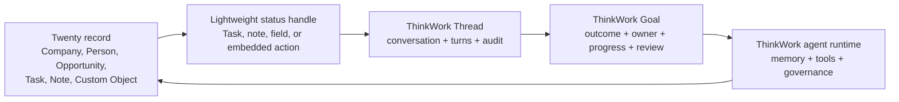

# Twenty-Native ThinkWork Operating Surface

## Problem Frame

ThinkWork can deploy Twenty as a managed app and can register Twenty as an MCP
connector. The remaining product question is whether Twenty should become a
first-class operating surface where business records are the natural place to
start, inspect, and resume agent work.

The recommended product shape is yes, but narrowly: Twenty remains the
business/customer operating surface for companies, people, opportunities,
tasks, notes, views, and custom objects. ThinkWork remains the agent runtime and
governance layer for Threads, Goals, execution history, memory, scheduling,
permissions, audit, evaluations, and long-running work.

The first valuable workflow is CRM-record-centered work promotion: a user
standing on an opportunity, company, or customer-specific record can ask
ThinkWork to pursue an outcome. ThinkWork creates or reopens a linked Thread,
promotes it to a Goal when the work is accountable, uses Twenty MCP with the
current user's authority, and writes lightweight status back to Twenty so the
business record stays the human's home base.

---

## Actors

- A1. Revenue or customer-facing user: Works from Twenty records such as
  opportunities, companies, people, tasks, notes, and custom customer objects.
- A2. ThinkWork agent runtime: Executes governed work, calls tools, records
  audit, asks for human input, and updates CRM records through authorized tools.
- A3. ThinkWork workflow owner: Defines which CRM records can start ThinkWork
  work, what Goal template applies, and which humans review outcomes.
- A4. ThinkWork operator: Deploys Twenty, manages MCP/OAuth health, and monitors
  runtime/governance surfaces from ThinkWork.
- A5. Customer or external stakeholder: Appears in CRM context and may be
  affected by agent-assisted follow-up, onboarding, renewal, support, or sales
  work.

---

## Key Flows

- F1. Start accountable work from a CRM record
  - **Trigger:** A1 selects a ThinkWork action from a Twenty opportunity,
    company, person, task, or configured custom object.
  - **Actors:** A1, A2
  - **Steps:** The user states the desired outcome in business language.
    ThinkWork links the CRM record to a Thread, creates or reopens the
    appropriate work record, and promotes it to a Goal when the workflow has a
    completion rule. The agent reads the CRM context through the user's Twenty
    authorization and starts work in the relevant Space.
  - **Outcome:** The CRM record now has a durable ThinkWork work trail and a
    visible next-action/status handle.
  - **Covered by:** R1, R2, R3, R4, R5, R9

- F2. Resume work from either surface
  - **Trigger:** A1 opens the CRM record later or opens the linked ThinkWork
    Thread/Goal directly.
  - **Actors:** A1, A2
  - **Steps:** Twenty shows the current lightweight status and link to
    ThinkWork. ThinkWork shows the full conversation, turns, tool calls,
    decisions, handoffs, approvals, and audit. New activity from either surface
    continues the same linked work rather than creating duplicates.
  - **Outcome:** Twenty remains the business user's record surface, while
    ThinkWork remains the durable execution ledger.
  - **Covered by:** R4, R5, R6, R7, R10

- F3. Human review or missing input
  - **Trigger:** The agent needs a decision, approval, customer-sensitive
    judgment, or missing CRM fact.
  - **Actors:** A1, A2, A3, A5
  - **Steps:** ThinkWork routes the review through its normal Thread/Goal
    review path. Twenty receives only enough status to show that human input is
    needed and where to continue. Customer-facing actions are not taken until
    the review policy allows them.
  - **Outcome:** Governance stays centralized in ThinkWork without making CRM
    users hunt for the current work item.
  - **Covered by:** R6, R7, R8, R11, R12

- F4. Configure the first workflow
  - **Trigger:** A3 chooses the first CRM workflow to make ThinkWork-native.
  - **Actors:** A3, A4
  - **Steps:** The workflow owner chooses a small record class, trigger/action,
    Goal template, review policy, and writeback fields. The operator verifies
    Twenty managed-app and MCP/OAuth health before enabling the workflow for a
    small user set.
  - **Outcome:** The spike proves whether record-native agent work creates
    platform leverage before broader CRM-native UI is built.
  - **Covered by:** R13, R14, R15, R16

---

## Relationship Model

Twenty is the business object source of truth. ThinkWork is the governed work
source of truth. The bridge is a lightweight handle that helps humans move
between the two without duplicating the full workflow model inside Twenty.

---

## Requirements

**Product shape**

- R1. Twenty-native mode must treat Twenty records as the starting point for
  business work, not as a secondary data source hidden behind generic chat.
- R2. ThinkWork must not rebuild CRM primitives that Twenty already owns:
  companies, people, opportunities, notes, tasks, views, workflows, dashboards,
  and custom objects remain in Twenty.
- R3. ThinkWork must remain the source of truth for agent execution: Threads,
  turns, messages, tool calls, memory reads, approvals, cost, guardrails,
  evaluations, audit, and long-running work state.
- R4. A CRM record can link to one or more ThinkWork Threads or Goals, but a
  single repeated business workflow on the same record should reopen or resume
  the existing linked work unless the user deliberately starts a separate
  outcome.

**Record-centered workflow**

- R5. The first workflow must start from a Twenty opportunity, company, person,
  task, note, or configured custom object and create or reopen a linked
  ThinkWork Thread.
- R6. When the desired work has an accountable outcome, ThinkWork must promote
  the Thread into a Goal with owner, mode, progress, completion rule, and review
  policy.
- R7. Twenty-side status must stay lightweight: show current state, owner or
  next action when available, and a link back to the ThinkWork Thread or Goal.
  It must not mirror the full execution ledger.
- R8. Human decisions, approvals, exception handling, and completion review must
  use ThinkWork's existing Thread/Goal governance rather than a CRM-only
  approval path.
- R9. The agent must use the current user's Twenty authorization for CRM reads
  and writes. No tenant-wide credential fallback is allowed for user-scoped CRM
  work.

**Surface split**

- R10. Twenty UI owns business record inspection, CRM list/kanban views, manual
  record actions, CRM task visibility, notes, workflow triggers, and
  customer-specific object context.
- R11. ThinkWork UI owns Thread detail, Goal detail, audit/timeline,
  permissions/governance, runtime health, deployment status, MCP/OAuth health,
  review queues, and operator diagnostics.
- R12. If the agent needs a human to make a customer-sensitive or
  revenue-sensitive decision, the user must be routed to the ThinkWork
  Thread/Goal context before the agent proceeds.

**Spike**

- R13. The smallest proof should use one configured record class and one
  repeatable workflow, recommended as opportunity-to-customer-onboarding or
  opportunity-follow-up because Twenty's standard objects already connect
  opportunities to companies, people, tasks, and notes.
- R14. The spike must prove the full loop: start from the CRM record, create or
  reopen linked ThinkWork work, let the agent read CRM context with user auth,
  update a lightweight CRM status/handle, and resume from both surfaces.
- R15. The spike must include at least one human review or missing-input path so
  the team can see whether ThinkWork governance still feels natural when the
  user begins in Twenty.
- R16. The spike must produce evidence that this is more than another connector:
  a user should understand the agent work in the context of the CRM record
  without needing to begin in the ThinkWork app.

---

## Acceptance Examples

- AE1. **Covers R1, R5, R14.** Given a user is viewing an open opportunity in
  Twenty, when they start the configured ThinkWork workflow, then ThinkWork
  creates or reopens a linked Thread using that opportunity, company, people,
  and related notes as CRM context.
- AE2. **Covers R3, R6, R8.** Given the workflow is "prepare customer
  onboarding," when the agent accepts the work, then the Thread becomes a Goal
  with outcome, owner, progress, completion rule, and review policy rather than
  only a CRM task.
- AE3. **Covers R4, R7, R10, R11.** Given the user returns to the same Twenty
  opportunity later, when linked work is already active, then Twenty shows a
  lightweight current status and link while the full execution timeline remains
  in ThinkWork.
- AE4. **Covers R9, R12, R15.** Given the agent needs approval before emailing a
  customer or changing an opportunity stage, when it reaches that step, then
  ThinkWork routes a review in the Thread/Goal context and does not proceed
  through a background CRM-only action.
- AE5. **Covers R13, R16.** Given the spike completes, when the team reviews the
  evidence, then they can see whether the CRM record became a better starting
  point for the work than generic ThinkWork chat plus a Twenty connector.

---

## Success Criteria

- A revenue or customer-facing user can begin meaningful agent work from a CRM
  record without first translating the record into a generic ThinkWork prompt.
- ThinkWork planning can proceed without inventing the product split between
  Twenty records, Twenty tasks, ThinkWork Threads, and ThinkWork Goals.
- The first spike demonstrates cross-surface continuity: CRM record to
  ThinkWork work, ThinkWork work back to CRM status, and resumption from either
  side.
- User-scoped authorization and review policy remain legible even though the
  workflow begins inside Twenty.
- The team has enough evidence to decide whether to deepen Twenty-native UI or
  stop at managed app plus MCP connector.

---

## Scope Boundaries

### Deferred for later

- Rich embedded ThinkWork panels inside Twenty beyond the smallest status/action
  handle needed for the spike.
- Broad support for every Twenty object type, workflow trigger, and custom
  object in the first release.
- Bidirectional synchronization of every ThinkWork status, event, task,
  approval, artifact, and audit item into Twenty.
- A generalized cross-CRM abstraction that also supports Salesforce, HubSpot,
  Attio, or other CRMs.
- ThinkWork/Cognito SSO into the Twenty web app beyond the already planned
  managed-app and MCP/OAuth foundation.
- CRM analytics or executive dashboards beyond evidence needed to judge the
  spike.

### Outside this product's identity

- Replacing Twenty with a ThinkWork-native CRM.
- Making Twenty the source of truth for agent execution, audit, guardrails,
  memory, or review policy.
- Treating Twenty tasks as ThinkWork's durable workflow engine. Twenty tasks are
  human-visible handles and follow-ups; ThinkWork Threads and Goals remain the
  governed work model.
- Building a generic "AI assistant inside every app" surface where CRM record
  context is incidental.

---

## Key Decisions

- **Primary actor:** Optimize for the revenue or customer-facing user working
  from a CRM record, not the platform operator. Operators already have managed
  app and MCP surfaces; the new product value is business work beginning where
  the customer/account context lives.
- **First workflow:** Start with opportunity/customer workflow promotion,
  preferably closed-won onboarding or high-touch opportunity follow-up. It uses
  standard Twenty objects and matches ThinkWork's existing Goal examples for
  accountable customer work.
- **Task relationship:** Twenty tasks are lightweight CRM handles. ThinkWork
  Threads are the durable execution ledger, and ThinkWork Goals are the outcome
  contract for accountable work.
- **UI split:** Put record context, CRM views, and lightweight status in Twenty.
  Put execution detail, audit, governance, review, and runtime health in
  ThinkWork.
- **Product bet:** The spike should prove whether ThinkWork becomes more useful
  when CRM records are the operating surface. If the user still has to leave
  Twenty and re-explain the record in generic chat, the product bet has not been
  proven.

---

## Dependencies / Assumptions

- The Twenty managed application and Twenty MCP/OAuth foundation from
  `docs/brainstorms/2026-06-05-twenty-crm-managed-application-requirements.md`
  and `docs/plans/2026-06-06-003-feat-twenty-crm-mcp-oauth-plan.md` are the
  substrate for this product shape.
- ThinkWork's existing concepts for Threads, Spaces, and Goals are the right
  workflow model to reuse rather than inventing CRM-specific work state.
- Twenty supports standard objects for People, Companies, Opportunities, Notes,
  and Tasks, plus custom objects for organization-specific entities.
- Twenty workflows can be triggered from record creation/update, manual
  actions, schedules, webhooks, and other CRM events; planning must choose the
  smallest reliable entry point for the spike.
- Twenty's public direction includes AI/MCP access to CRM data and app
  extensibility, but self-hosted managed-app parity for every cloud capability
  must be verified during planning.

---

## External Context

- Twenty objects documentation:
  https://docs.twenty.com/user-guide/data-model/capabilities/objects
- Twenty workflow triggers documentation:
  https://docs.twenty.com/user-guide/workflows/capabilities/workflow-triggers
- Twenty workflow actions documentation:
  https://docs.twenty.com/user-guide/workflows/capabilities/workflow-actions
- Twenty product page, including current AI/MCP and app-extension positioning:
  https://twenty.com/

---

## Outstanding Questions

### Resolve Before Planning

- None.

### Deferred to Planning

- [Affects R5, R13, R14][Technical] Which exact Twenty entry point should the
  spike use first: native app extension action, manual workflow action, webhook,
  command-menu action, or a simpler ThinkWork link/button surfaced from CRM
  configuration?
- [Affects R7, R14][Technical] What is the least invasive Twenty-side status
  handle: task, note, custom field, relation, embedded component, or another
  native extension surface?
- [Affects R9, R14][Needs research] Which Twenty MCP tools and OAuth behavior
  are available in the deployed self-hosted environment, and do they cover the
  opportunity/company/person reads and status writeback needed for the spike?
- [Affects R6, R15][Technical] Which existing ThinkWork Goal template or Space
  should the first customer workflow use, and what minimal fields are required
  to instantiate it from CRM context?
- [Affects R4][Technical] What durable linking key should prevent duplicate
  Threads/Goals when the same user restarts the same workflow from the same CRM
  record?

---

## Next Steps

-> /ce-plan for structured implementation planning.
