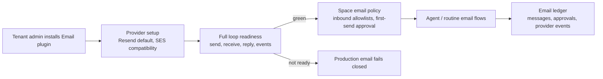

# Email Channel Plugin

## Problem Frame

ThinkWork already sends and receives agent email through SES-backed Space
addresses, reply tokens, inbound parsing, and thread auto-replies. The pain is
not that email is absent; it is that email is currently a platform assumption
rather than a tenant-owned channel capability with explicit provider readiness,
safe inbound authorization, reviewable outbound behavior, observability, and a
clear migration path.

V1 defines an installable Email plugin for agent and Space email. It should make
Resend the recommended external provider while preserving existing SES behavior
as the AWS-native compatibility and migration path. Platform transactional mail
such as Cognito invitations, Stripe/welcome email, and third-party application
invitations remains outside this first plugin boundary.

---

## Actors

- A1. Tenant administrator: installs the Email plugin, chooses provider/domain
  configuration, and manages readiness.
- A2. Space owner or responsible reviewer: approves the first outbound email in
  a conversation and manages Space-level email policy.
- A3. Tenant user: sends email into enabled Spaces and may participate in
  email-backed threads.
- A4. External sender or recipient: emails an allowed Space address or receives
  agent-authored email.
- A5. Agent runtime and routines: use the email channel for Space conversations
  and scheduled/routine email work.
- A6. Platform operator: monitors migration, provider health, and product
  boundaries without owning tenant email accounts.

---

## Key Flows

- F1. Plugin install and readiness
  - **Trigger:** A tenant administrator installs the Email plugin.
  - **Actors:** A1, A6
  - **Steps:** The admin selects Resend or SES compatibility, configures a
    dedicated tenant email domain, verifies provider credentials and DNS,
    configures inbound receiving and webhooks, and runs a send -> receive/reply
    loop test.
  - **Outcome:** Production agent email remains blocked until full loop
    readiness passes.
  - **Covered by:** R1-R7

- F2. First outbound email in a conversation
  - **Trigger:** An agent or routine attempts the first outbound email for a
    new email conversation.
  - **Actors:** A2, A5
  - **Steps:** ThinkWork creates a human review item using the existing
    HITL/inbox approval pattern. The reviewer sees recipient, subject, body,
    context, and evidence, then approves, denies, or edits and approves.
  - **Outcome:** If approved, the email sends and future replies in that
    conversation can proceed autonomously within policy.
  - **Covered by:** R10-R12, R15

- F3. Inbound email wakes agent work
  - **Trigger:** Email arrives at an enabled Space address.
  - **Actors:** A3, A4, A5
  - **Steps:** ThinkWork verifies the provider webhook, routes the recipient to
    a tenant and Space, checks reply-token or cold-contact authorization,
    applies sender allowlist and Space membership rules, deduplicates and rate
    limits, then appends or creates thread work.
  - **Outcome:** Only authorized inbound email can create or wake agent work.
  - **Covered by:** R8, R9, R13

- F4. Routine email work
  - **Trigger:** A scheduled or routine workflow reaches an `email_send` step
    that operates as agent/Space work.
  - **Actors:** A2, A5
  - **Steps:** The routine uses the same provider readiness, outbound approval,
    recipient policy, and ledger behavior as direct agent email.
  - **Outcome:** Routine email cannot bypass the Email plugin safety model.
  - **Covered by:** R10-R15

- F5. SES compatibility and migration
  - **Trigger:** A tenant already using the SES-backed Space email path moves
    to the Email plugin model.
  - **Actors:** A1, A6
  - **Steps:** Existing SES behavior is represented as the compatibility
    provider, existing Space conversations keep their reply path, and Resend can
    become the recommended provider after readiness passes.
  - **Outcome:** Existing email conversations are not stranded during the
    transition from platform-assumed SES to tenant-owned plugin configuration.
  - **Covered by:** R2, R16

---

## Requirements

**Plugin boundary and providers**

- R1. The Email plugin owns the tenant's agent and Space email channel,
  including direct agent sends, inbound Space email, thread replies, and
  routine `email_send` when it operates as agent/Space work.
- R2. V1 supports Resend as the recommended external provider and existing SES
  as the AWS-native compatibility and migration provider.
- R3. SMTP, Postmark, Mailgun, and other providers are deferred from v1 unless a
  later requirements pass explicitly pulls them in.
- R4. Platform transactional mail is outside v1: Cognito invitations,
  Stripe/welcome email, Twenty invitations, and other product-triggered email do
  not move behind the Email plugin.

**Domains and readiness**

- R5. V1 supports both ThinkWork-owned dedicated tenant subdomains as the
  default setup path and customer-owned dedicated subdomains as the production
  branding path.
- R6. V1 must not require or encourage using a customer's primary/root mail
  domain for agent email, because MX and inbound routing conflicts are too
  risky.
- R7. Production agent email fails closed until full loop readiness passes:
  provider credentials valid, sending domain verified, inbound receiving
  configured, webhook signature verified, delivery/bounce/complaint events
  reachable, and a send -> receive/reply test succeeds.
- R8. The Resend path should be optimized for fast readiness once credentials,
  DNS, receiving, and webhooks are configured. The SES path may expose slower
  readiness when AWS sandbox-to-production approval is still pending.

**Inbound authorization**

- R9. Inbound email is closed by default except for registered tenant users
  emailing enabled Spaces; private Spaces also require Space membership.
- R10. Tenant administrators can explicitly allow outside sender emails or
  domains per Space for partner, customer, vendor, support, or intake workflows.
- R11. Every inbound message must pass the provider trust boundary, recipient
  routing, reply-token or cold-contact authorization, rate limits, idempotency,
  and audit recording before it can create or wake agent work.

**Outbound control**

- R12. The first outbound email in each new email conversation requires human
  review before sending.
- R13. Review uses the existing HITL/inbox approval pattern, with email-specific
  recipient, subject, body, context/evidence, approve, deny, and
  edit-and-approve behavior.
- R14. After the first outbound email in a conversation is approved, later
  replies in the same conversation can be autonomous within readiness, recipient
  policy, rate-limit, and Space policy constraints.

**Ledger and migration scope**

- R15. The Email plugin maintains a full conversation ledger covering message
  direction, provider message IDs, delivery/bounce/complaint events,
  readiness/test results, failure reasons, normalized message headers/body
  snapshots, approval decisions, edited drafts, and inbound authorization
  decisions.
- R16. The ledger must distinguish audit metadata from raw message body
  retention and include explicit retention/redaction requirements so raw email
  is not kept indefinitely by accident.
- R17. Existing SES-backed Space email behavior must have a compatibility path
  so current conversations and reply routing are not stranded during migration.
- R18. Routine/scheduled `email_send` that behaves as agent/Space work must use
  the same readiness, approval, policy, and ledger behavior as direct agent
  email.

---

## Acceptance Examples

- AE1. **Covers R1, R2, R5, R7, R8.** Given a tenant installs the Email plugin
  and configures Resend on a ThinkWork-owned tenant subdomain, when credentials,
  DNS, receiving, webhooks, delivery events, and the send -> receive/reply test
  pass, then production Space email becomes available without waiting on SES
  production approval.
- AE2. **Covers R7.** Given the Email plugin is installed but inbound receiving
  or webhook verification is incomplete, when an agent or routine attempts
  production email behavior, then ThinkWork blocks production sends and inbound
  wakeups rather than warning and continuing.
- AE3. **Covers R9-R11.** Given a non-tenant sender emails an enabled Space
  address, when that sender is not explicitly allowlisted for the Space, then
  the email does not create or wake agent work and the rejection is auditable
  without leaking sensitive routing details to the sender.
- AE4. **Covers R12-R14.** Given an agent drafts the first outbound email in a
  new conversation, when the responsible reviewer edits and approves the draft,
  then the edited draft is sent, the approval decision is recorded, and later
  replies in that same conversation can proceed autonomously within policy.
- AE5. **Covers R15, R16.** Given a support Space receives and replies to a
  customer email, when an operator investigates the thread later, then they can
  reconstruct what arrived, what was authorized, what was sent, who approved or
  edited the first send, and what provider delivery events occurred, subject to
  retention/redaction policy.
- AE6. **Covers R4, R18.** Given a routine sends an email as part of Space work,
  when the routine reaches `email_send`, then it uses Email plugin readiness and
  approval rules; but Cognito user invitations and Stripe/welcome emails remain
  on their existing platform transactional paths.

---

## Success Criteria

- Tenant admins can install and configure email without treating SES as an
  unavoidable platform default.
- Resend provides a fast default path to production-ready agent/Space email once
  DNS and webhooks are configured.
- Existing SES-backed conversations continue working during migration.
- Inbound email cannot wake agents unless the sender and message pass explicit
  authorization gates.
- Outbound agent email has a clear trust-establishment moment: first-send human
  approval per conversation, then policy-bounded autonomy.
- Planning can decompose provider adapters, readiness checks, approvals, ledger,
  and migration without inventing product behavior.

---

## Scope Boundaries

- Do not move Cognito invitations, Stripe/welcome email, Twenty invitations, or
  other platform/product transactional email into v1.
- Do not add SMTP, Postmark, Mailgun, or other non-Resend providers in v1.
- Do not support customer primary/root mail domains for v1 agent email.
- Do not create a new review product surface when the existing HITL/inbox
  approval pattern can carry first-send review.
- Do not treat provider status alone as production readiness; the product
  requires an active full loop test.
- Do not allow open inbound email to create or wake agent work by default.
- Do not use this requirements pass to design implementation details such as
  database schema, webhook endpoints, or provider SDK internals.

---

## Key Decisions

- Email plugin boundary: agent/Space email channel plus routine email that acts
  as agent/Space work.
- Provider scope: Resend recommended, SES compatibility preserved, other
  providers deferred.
- Domain model: ThinkWork-owned dedicated tenant subdomains by default, with
  customer-owned dedicated subdomains for production branding.
- Readiness: production behavior fails closed until full loop readiness passes.
- Inbound policy: registered users plus explicit Space-level allowlists.
- Outbound policy: first outbound email per conversation requires human review;
  later replies can be autonomous within policy.
- Ledger: preserve full conversation and audit context, with explicit
  retention/redaction rules.

---

## Dependencies / Assumptions

- Resend supports the necessary sending, receiving, webhook, and event flows for
  the recommended v1 provider path.
- SES sandbox-to-production approval remains an external readiness gate for the
  SES compatibility path.
- Existing HITL/inbox approval surfaces can support email draft review and
  edit-and-approve without a new review product surface.
- Existing Space email concepts are the right product anchor for tenant
  addresses and inbound routing.
- Routine `email_send` can be classified when it is acting as agent/Space work
  versus unrelated platform transactional email.

---

## Outstanding Questions

### Resolve Before Planning

- None.

### Deferred to Planning

- [Affects R5-R8][Technical] Exact domain naming convention for ThinkWork-owned
  tenant subdomains.
- [Affects R7][Technical] Exact readiness probe mechanics for Resend and SES,
  including how delivery/bounce/complaint event reachability is tested.
- [Affects R11][Technical] Detailed inbound idempotency and rate-limit windows.
- [Affects R15-R16][Technical] Ledger storage shape, raw body retention window,
  redaction rules, and operator export/search behavior.
- [Affects R17][Technical] Migration steps for existing SES reply tokens,
  message IDs, and active Space conversations.

---

## Sources

- Linear issue: THNK-35, "Email Functionality".
- Interactive `ce-brainstorm` decisions recorded on THNK-35 on 2026-06-17.
- Application plugin model:
  `docs/brainstorms/2026-06-12-application-plugins-requirements.md`.
- Plugin source ownership model:
  `docs/brainstorms/2026-06-15-plugin-source-colocation-requirements.md`.
- Existing Space email code paths verified during brainstorming:
  `packages/api/src/handlers/email-inbound.ts`,
  `packages/api/src/handlers/email-send.ts`,
  `packages/api/src/lib/email/thread-reply.ts`,
  `packages/api/src/lib/email/space-address.ts`, and
  `terraform/modules/app/ses-email/main.tf`.

---

## Next Steps

-> `/ce-plan` for structured implementation planning after this requirements
artifact is reviewed.
