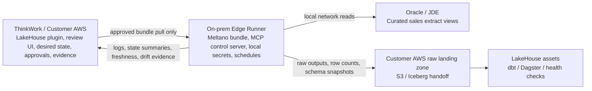

# Meltano Edge Runner for LakeHouse Integrations

## Problem Frame

ThinkWork needs a LakeHouse integration architecture for McPherson/JDE-style
customer data sources that can reduce Fivetran dependency without pretending the
customer has true low-latency CDC. The current source pattern is hourly
JDE/Oracle polling with roughly 1.5M sales rows per month, which favors a
lightweight, reviewable, code-first runner over a heavier integration platform
that ThinkWork must operate as another product.

The selected direction is a ThinkWork Edge Integration Runner: ThinkWork owns the
LakeHouse plugin, integration review loop, run policy, approvals, evidence, and
remediation experience; a customer-side edge runner executes approved Meltano
project bundles near Oracle/JDE, injects local secrets at runtime, uploads raw
outputs to customer AWS, and reports structured evidence back to ThinkWork. The
existing `lakehouse` plugin remains the product identity established by
`docs/brainstorms/2026-06-18-lakehouse-plugin-shell-requirements.md`.

---

## Actors

- A1. ThinkWork integration designer: uses agents and review surfaces to create,
  inspect, approve, and evolve LakeHouse integration definitions.
- A2. McPherson data/platform owner: provides the curated Oracle/JDE extract
  contract, local secret references, and acceptance of parity against Fivetran.
- A3. On-prem edge operator: installs and supervises the runner in the customer
  network without opening inbound Oracle access to ThinkWork cloud.
- A4. ThinkWork agent: safely inspects Meltano projects, proposes changes,
  evaluates evidence, and requests gated operations through a narrow MCP control
  surface.
- A5. LakeHouse implementer: extends the existing `lakehouse` plugin package
  with runtime components after these requirements are planned.

---

## Approaches Considered

| Approach | Fit | Main tradeoff |
| --- | --- | --- |
| Airbyte Core / self-managed platform | Strong connector catalog and mature replication platform. | Adds a Kubernetes/platform operation surface for a customer shape that is hourly polling, not high-scale CDC. Airbyte docs position self-managed deployment around Kubernetes and Helm, with enterprise guidance requiring Kubernetes and supporting platform services. |
| Direct ThinkWork cloud connector | Simplest central control surface. | Violates the default network boundary by requiring direct cloud access to on-prem Oracle/JDE or a VPN/inbound path. |
| ThinkWork Edge Integration Runner with Meltano | Best fit for code review, agent-authored diffs, local execution, outbound-only reporting, and hourly batch extracts. | Requires ThinkWork to own runner lifecycle, evidence contracts, MCP safety policy, and connector maturity validation. |

Recommendation: use the Meltano Edge Runner for v1, scoped to a McPherson sales
slice and designed so the runner contract can become reusable after the spike
proves parity.

---

## Key Flows

- F1. Author and approve an integration bundle
  - **Trigger:** McPherson selects a JDE sales slice to migrate or shadow-run.
  - **Actors:** A1, A2, A4, A5
  - **Steps:** ThinkWork agents generate or update a Meltano project bundle;
    reviewers inspect diffs for extract views, job definitions, schedule policy,
    state handling, destination, and dbt/Dagster handoff; approval records the
    desired bundle version and run policy.
  - **Outcome:** A reviewable, approved integration bundle is ready for the
    customer-side runner to pull.
  - **Covered by:** R1, R2, R3, R4, R16

- F2. Run the approved bundle on the edge
  - **Trigger:** Schedule policy or an approved manual run requests execution.
  - **Actors:** A2, A3, A4
  - **Steps:** The runner pulls only approved bundle versions outbound; injects
    local Oracle, destination, and optional Vault/secret values at runtime;
    executes allowlisted Meltano jobs; writes raw outputs to the customer AWS
    landing zone; captures state, logs, row counts, freshness, schema snapshots,
    and errors.
  - **Outcome:** Data lands in customer AWS and ThinkWork receives enough
    structured evidence to reason about health without seeing raw Oracle
    credentials or requiring inbound database access.
  - **Covered by:** R5, R6, R7, R8, R9, R10, R11, R12

- F3. Inspect, remediate, and audit through MCP
  - **Trigger:** A run fails, schema drift appears, parity falls behind, or an
    agent needs to inspect project state.
  - **Actors:** A1, A3, A4
  - **Steps:** The MCP server defaults to read-only project, catalog, stream,
    state, evidence, and log inspection; write-gated tools allow only explicit
    approved changes or allowlisted job execution; every write operation records
    actor, bundle version, inputs, redactions, and result in an audit trail.
  - **Outcome:** Agents can operate the integration safely without arbitrary
    shell access, unrestricted Meltano CLI execution, or secret exposure.
  - **Covered by:** R13, R14, R15, R16, R17

- F4. Shadow-run against Fivetran
  - **Trigger:** The first representative sales slice is ready for validation.
  - **Actors:** A1, A2, A4, A5
  - **Steps:** Meltano runs beside Fivetran for a representative window; the
    team compares row counts, freshness, update handling, late corrections,
    delete/reversal behavior, schema drift, and downstream dbt outputs.
  - **Outcome:** ThinkWork can decide whether to expand the runner, adjust the
    extract contract, or keep Fivetran for specific sources.
  - **Covered by:** R18, R19, R20

---

## Requirements

**Product boundary and plugin fit**

- R1. The Edge Integration Runner must extend the existing `lakehouse` plugin
  identity rather than creating a second LakeHouse product, catalog key, or
  local-only integration path.
- R2. ThinkWork must remain the user-facing integration product: Meltano is the
  local execution substrate, not the customer-facing UI or source of policy.
- R3. The control plane must own desired state, bundle version, approval state,
  run policy, evidence records, health summaries, and remediation workflow.
- R4. Configuration changes must be reviewable as source diffs before execution,
  not opaque remote API mutations.

**Meltano project bundle**

- R5. Each integration bundle must define the generated Meltano project shape:
  `meltano.yml`, environments, extractor and loader configuration, jobs,
  schedules or run policy references, state conventions, log conventions,
  destination handoff, and dbt/Dagster handoff metadata.
- R6. The bundle must separate non-sensitive configuration from
  environment-specific and sensitive runtime values; raw Oracle credentials must
  not be stored in ThinkWork or committed project files.
- R7. Bundle execution must pin connector/plugin versions or otherwise record
  the resolved runtime versions in evidence so parity failures are reproducible.
- R8. The runner must expose state summaries and state recovery controls as
  policy-bound operations, with destructive or overwrite-style state changes
  requiring explicit approval.

**Oracle/JDE extract contract**

- R9. V1 must prefer curated Oracle views or extract tables over raw JDE base
  table sprawl.
- R10. Every selected extract must declare stable business keys, update cursor
  fields, source timestamps, extract timestamps, and expected stream names.
- R11. The extract contract must define a rolling-window reconciliation strategy
  for late corrections and a delete/reversal strategy for records where updates
  are not append-only.
- R12. Raw landing output must preserve enough metadata for replay and audit:
  source system, extract view/table, bundle version, job/run ID, extract window,
  row counts, schema version or snapshot, and load timestamp.

**Edge runner lifecycle and security**

- R13. The runner must operate outbound-only by default: it pulls approved
  bundles or receives approved commands through a customer-accepted channel and
  reports evidence back, with no default inbound database or firewall dependency
  from ThinkWork cloud.
- R14. The runner must inject local secrets at execution time from customer
  approved sources such as local environment, file, or Vault/Secrets Manager
  integration; ThinkWork stores references and policy, not raw Oracle
  credentials.
- R15. The runner must upload raw outputs to the customer AWS landing zone and
  report structured evidence to ThinkWork without uploading source row payloads
  into ThinkWork control-plane storage.

**MCP/control surface**

- R16. The ThinkWork-owned Meltano MCP/control server must default to read-only
  tools for version, project inspection, plugin inventory, extractor/loader/job
  lists, environment lists, catalog and selected-stream introspection, recent
  redacted logs, state summaries, schema snapshots, and run evidence.
- R17. Write-capable tools must be explicitly gated by mode, policy, and
  allowlists for project changes, bundle acceptance, selected job execution,
  plugin tests, state recovery, and reruns; arbitrary shell execution and
  unrestricted Meltano CLI invocation are out of scope.
- R18. Every MCP response must use a structured success/error envelope and
  redact secrets from output; every write-capable operation must append an audit
  event with actor, tool, project, bundle version, policy decision, and result.

**Spike and parity proof**

- R19. The first spike must migrate a narrow sales slice of 5-10 representative
  JDE sales views/tables and shadow-run it beside the existing Fivetran setup
  for at least one representative window.
- R20. The parity report must compare row counts, freshness, cursor/update
  handling, late corrections, deletes/reversals, schema drift, failed-run
  recovery, and downstream dbt output.
- R21. The spike must explicitly decide whether the runner remains
  McPherson-specific for the next slice or graduates into a reusable integration
  substrate for future LakeHouse customers.

---

## Acceptance Examples

- AE1. **Covers R1-R4.** Given a ThinkWork agent proposes a change to the
  McPherson sales integration, when a reviewer inspects it, then the change is
  visible as a Meltano project bundle diff tied to the existing `lakehouse`
  plugin and cannot run until approved.
- AE2. **Covers R9-R12.** Given a JDE sales extract is selected for the spike,
  when it is added to the contract, then it declares keys, cursor fields,
  timestamps, reconciliation window, delete/reversal handling, and raw landing
  metadata before implementation planning completes.
- AE3. **Covers R13-R15.** Given the runner executes on-prem, when the hourly
  sales job runs, then Oracle access stays local, secrets are injected locally,
  raw outputs land in customer AWS, and ThinkWork receives only structured
  evidence and redacted logs.
- AE4. **Covers R16-R18.** Given an agent asks the MCP server to inspect a
  project, when it uses read-only tools, then it can see project, catalog,
  stream, state, logs, and evidence summaries; when it attempts a write or run,
  the operation is denied unless policy, mode, and allowlist all permit it and
  an audit event is recorded.
- AE5. **Covers R19-R21.** Given the spike shadow-runs beside Fivetran, when the
  representative window ends, then the team has a parity report that supports a
  go/no-go decision for expanding the runner.

---

## Success Criteria

- McPherson has a credible path to reduce Fivetran spend for hourly JDE sales
  extracts without adding inbound network exposure or pretending to deliver
  redo-log CDC.
- ThinkWork agents can author, review, inspect, and safely operate integration
  bundles as code, with policy and auditability strong enough for customer data
  operations.
- The downstream planner can design the first spike without inventing control
  plane/data plane boundaries, MCP safety behavior, extract contract
  expectations, or parity criteria.

---

## Scope Boundaries

- Do not attempt true redo-log CDC parity in v1.
- Do not expose on-prem Oracle/JDE directly to ThinkWork cloud.
- Do not require customer VPN or inbound firewall access for the default
  architecture.
- Do not expose arbitrary shell execution, unrestricted Meltano CLI execution,
  or unbounded filesystem access through MCP.
- Do not make Meltano the customer-facing product UI.
- Do not adopt `butkeraites/meltano-mcp-server` wholesale; borrow safety and
  inspection ideas for a ThinkWork-owned control surface.
- Do not introduce Kubernetes, Docker Compose, GCP, or Azure assumptions into
  the default ThinkWork LakeHouse architecture.
- Do not expand beyond a representative McPherson sales slice until the parity
  report is reviewed.

---

## Key Decisions

- Use Meltano as the v1 local execution substrate because its project is
  text-based, reviewable, versionable, and compatible with agent-authored diffs;
  Airbyte remains a contingency if connector maturity or operational evidence
  shows Meltano cannot meet the sales-slice needs.
- Keep ThinkWork as the integration brain: desired state, approvals, evidence,
  health, and remediation live in the LakeHouse plugin/control plane.
- Start McPherson-specific but design the runner contract for reuse. The spike
  must prove whether reuse is warranted rather than making the first slice carry
  speculative multi-customer complexity.
- Treat curated Oracle/JDE extract views as the source boundary for v1. Raw JDE
  table sprawl is deferred unless the curated layer cannot provide stable keys,
  cursor semantics, and correction handling.

---

## Dependencies / Assumptions

- McPherson can provide or approve curated Oracle/JDE sales extract views/tables
  with stable keys and cursor fields.
- The current Fivetran pipeline can be used as a parity benchmark for at least
  one representative sales window.
- Customer AWS has or will have a raw landing zone suitable for runner uploads
  and downstream LakeHouse/dbt/Dagster processing.
- The existing `lakehouse` plugin package is the correct source boundary for
  future runtime work.
- Meltano connector maturity for Oracle/JDE-adjacent extraction must be proven
  during the spike before broader migration claims are made.

---

## Outstanding Questions

### Resolve Before Planning

- None.

### Deferred to Planning

- [Affects R5-R8][Technical] What exact bundle format and signing/versioning
  mechanism should the runner consume?
- [Affects R13-R15][Technical] Which outbound channel should the runner use for
  approved bundle pulls and evidence reporting in the deployed ThinkWork
  environment?
- [Affects R9-R12][Needs research] Which Meltano/Singer Oracle approach is
  mature enough for the sales-slice spike, and where is a custom tap or wrapper
  required?
- [Affects R19-R20][Technical] What parity query set should compare Fivetran,
  raw landing output, and downstream dbt output?
- [Affects R16-R18][Technical] Which MCP tools are required for the first spike
  versus later operations, and what approval primitive should gate write tools?

---

## Sources / Research

- Linear issue `THNK-48`.
- `docs/brainstorms/2026-06-18-lakehouse-plugin-shell-requirements.md`.
- `docs/brainstorms/2026-06-12-application-plugins-requirements.md`.
- `docs/verification/mcpherson-lakehouse-plugin-builder-proof.md`.
- `plugins/lakehouse/README.md`.
- `plugins/lakehouse/src/manifest.ts`.
- Meltano docs: [Projects](https://docs.meltano.com/concepts/project/),
  [Command Line](https://docs.meltano.com/reference/command-line-interface/),
  [State Backends](https://docs.meltano.com/concepts/state_backends/),
  [Deployment in Production](https://docs.meltano.com/guide/production/),
  [Orchestrate Data](https://docs.meltano.com/guide/orchestration/).
- Airbyte docs: [Deploying Airbyte](https://docs.airbyte.com/platform/deploying-airbyte),
  [OSS Quickstart](https://docs.airbyte.com/platform/using-airbyte/getting-started/oss-quickstart),
  [Self-Managed Enterprise Implementation Guide](https://docs.airbyte.com/platform/enterprise-setup/implementation-guide).
- Prior art:
  [butkeraites/meltano-mcp-server](https://github.com/butkeraites/meltano-mcp-server).

---

## Next Steps

-> /ce-plan for structured implementation planning.
