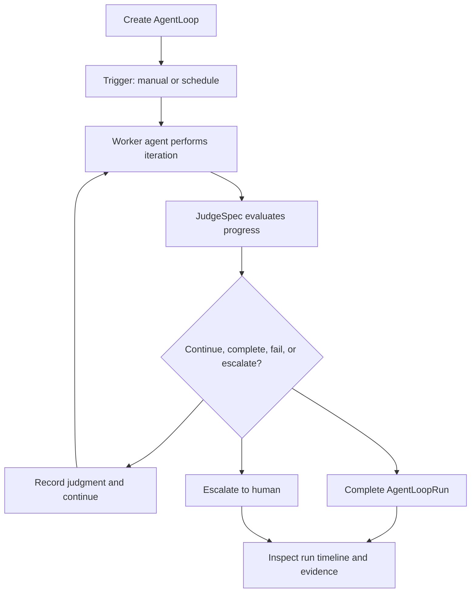

# THNK-46 AgentLoop Definition

## Supersession Note

The 2026-06-23 prompt-first Automations plan supersedes the product-language
portion of this brainstorm. The user-facing product noun is **Automation**.
AgentLoop remains the internal runtime and GraphQL/database substrate. The
current v1 product shape is prompt-first: Chat builder, Manual easy form,
Advanced inspector, configured execution Space, hidden setup thread, and visible
run thread.

## Problem Frame

ThinkWork needs a first-class automation primitive for durable agent work. The
current "Automations" direction risks describing scheduled prompts or jobs, while
the product need is broader: an autonomous loop with a trigger, goal, worker,
judge, policy, state, and evidence.

AgentLoop should become the v1 automation product object. Simple scheduled work,
verification loops, event-driven ambient loops, and future hill-climbing learning
loops should all build on the same construct in phases. Each phase must deliver
usable product value before the next phase adds more loop power.

---

## Actors

- A1. Operator or builder: Creates AgentLoops, configures trigger, goal, worker,
  judge, and policy, then reviews run history.
- A2. Worker agent: Performs the loop's task iterations toward the goal.
- A3. Judge: Evaluates progress or completion through self-check, model
  judgment, or human approval.
- A4. Human approver: Reviews sensitive or ambiguous loop outcomes when policy
  requires escalation or approval.
- A5. Planner or implementer: Uses this requirements document to plan the
  phased implementation without inventing product behavior.

---

## Key Flows

- F1. Create a Phase 1 AgentLoop
  - **Trigger:** An operator wants recurring or manually invoked agent work.
  - **Actors:** A1
  - **Steps:** The operator opens the AgentLoop builder, selects manual and/or
    schedule trigger, defines intent and completion criteria, selects the worker
    agent, chooses the judge mode, sets loop policy limits, and saves the loop.
  - **Outcome:** A first-class AgentLoop exists and can be run manually or by
    schedule.
  - **Covered by:** R1, R2, R3, R4, R5, R9

- F2. Run and inspect a Phase 1 AgentLoop
  - **Trigger:** A manual run starts or a scheduled trigger fires.
  - **Actors:** A1, A2, A3, A4
  - **Steps:** The worker performs an iteration, the judge evaluates against the
    goal criteria, policy decides whether to continue, complete, fail, or
    escalate, the system records iteration evidence, and the operator inspects
    the run timeline.
  - **Outcome:** The AgentLoopRun has a trustworthy explanation of what happened
    and why it stopped or continued.
  - **Covered by:** R6, R7, R8, R10, R11, R12, R13

- F3. Add verification behavior in Phase 2
  - **Trigger:** A loop needs stronger review than self-check before completion.
  - **Actors:** A1, A2, A3, A4
  - **Steps:** The operator configures a separate model or reviewer-style judge,
    the worker produces output, the judge accepts, rejects, or requests another
    iteration, and the run records the judgment.
  - **Outcome:** AgentLoop supports verification loops without redefining the
    product object.
  - **Covered by:** R14

- F4. Add event-driven and hill-climbing behavior in later phases
  - **Trigger:** A loop needs to wake from external events or improve a policy,
    template, output, or memory over time.
  - **Actors:** A1, A2, A3
  - **Steps:** Later phases add event/API/webhook/n8n trigger families, stateful
    resumption, comparison, promotion, and learning policies on top of the same
    AgentLoop and AgentLoopRun concepts.
  - **Outcome:** The same construct grows from basic automation into ambient
    agent work and compound learning.
  - **Covered by:** R15, R16, R17, R18

---

## Requirements

**First-class product model**

- R1. AgentLoop must replace Automations as the v1 automation product concept,
  rather than shipping both as competing user-facing features.
- R2. AgentLoop must be first-class in product language, API concepts, and UI
  navigation, even if implementation reuses existing workflow, run, or evidence
  infrastructure.
- R3. AgentLoop must have a versioned definition concept so changes to a loop's
  trigger, goal, worker, judge, or policy do not make prior runs ambiguous.
- R4. AgentLoopRun must be a first-class inspectable object with run status,
  iteration history, judgments, policy decisions, evidence, and final outcome.

**Phase 1 foundation**

- R5. Phase 1 must deliver a form-based AgentLoop builder and run inspector, not
  just backend or API-only plumbing.
- R6. Phase 1 must support manual and scheduled triggers only.
- R7. Phase 1 AgentLoops must define a GoalSpec containing both human-readable
  intent and explicit completion criteria.
- R8. Phase 1 AgentLoops must define a WorkerSpec that identifies the primary
  worker agent or profile responsible for doing the loop work.
- R9. Phase 1 AgentLoops must define a shared JudgeSpec with self-check, model
  judge, and human approval modes.
- R10. Phase 1 AgentLoops must support a primary worker plus an optional
  separate judge or reviewer, without requiring separate agents for simple loops.
- R11. Phase 1 AgentLoops must define a LoopPolicy with max iterations, max
  runtime, budget limit, retry/backoff behavior, and escalation behavior.
- R12. Phase 1 AgentLoopRun inspection must show why the run continued,
  completed, failed, budget-stopped, or escalated.
- R13. Phase 1 must record enough evidence per iteration and judgment for an
  operator to understand the loop's behavior after the fact.

**Phased growth**

- R14. Phase 2 must add verification-loop behavior where an independent judge can
  accept, reject, or request another iteration before completion.
- R15. Phase 3 must add event-driven triggers, including API/webhook-style
  triggers and workflow/app-event triggers, with appropriate idempotency,
  authorization, replay, and resume semantics defined during planning.
- R16. Phase 3 must define n8n's role as an optional visual/integration composer
  that can trigger or participate in AgentLoops without becoming the owner of
  AgentLoop identity, goal, judgment, state, or evidence.
- R17. Phase 4 must add hill-climbing or learning-loop behavior where attempts
  can be compared, better outputs or policies can be promoted, and lessons can
  compound into reusable memory, templates, or workflow improvements.
- R18. JudgeSpec should be shared across AgentLoops, evaluations, reviewer-agent
  verdicts, human approvals, and future learning judgments, with specialized
  result fields allowed where a consumer needs them.

---

## Acceptance Examples

- AE1. **Covers R1, R2, R5, R6.** Given an operator wants a weekly agent task,
  when they create it in v1, they create an AgentLoop with a scheduled trigger
  rather than a separate Automation object.
- AE2. **Covers R7, R9, R11, R12.** Given a loop has intent, completion criteria,
  judge mode, and policy limits, when a run stops, the run inspector shows the
  specific completion, failure, limit, or escalation reason.
- AE3. **Covers R9, R10, R14.** Given a worker agent produces an answer and the
  loop uses a separate model judge, when the judge rejects the answer, the run
  records the rejection and either continues within policy or escalates.
- AE4. **Covers R15, R16.** Given a future n8n workflow receives an external app
  event, when it calls into ThinkWork, ThinkWork still owns the AgentLoopRun,
  judgment, state, and evidence rather than treating n8n as the source of truth.
- AE5. **Covers R17, R18.** Given a future learning loop compares multiple
  successful approaches, when one approach is promoted, the promotion is backed
  by a JudgeSpec-compatible judgment record and auditable evidence.

---

## Phase Deliverables

- Phase 1. First-class AgentLoop foundation: definition/version/run objects,
  form builder, manual and schedule triggers, GoalSpec, WorkerSpec, shared
  JudgeSpec, LoopPolicy, and run inspector with evidence.
- Phase 2. Verification loops: independent judge/reviewer behavior that can
  accept, reject, request another iteration, or escalate.
- Phase 3. Event-driven loops: API/webhook/workflow/app-event/n8n participation
  with durable resumption and external-trigger safety.
- Phase 4. Hill-climbing loops: comparison, promotion, learning, and compounding
  of better outputs, policies, templates, or memories.

---

## Success Criteria

- A user can create and run a useful automation-style agent loop without learning
  a separate Automations feature.
- A user can inspect an AgentLoopRun and understand the trigger, goal, worker
  actions, judgments, policy decisions, evidence, and final outcome.
- Downstream planning can implement Phase 1 without inventing the core product
  model, phase ladder, trigger scope, judge scope, or UI scope.
- Later verification, event-driven, n8n, and hill-climbing capabilities extend
  the same AgentLoop construct rather than creating parallel abstractions.

---

## Scope Boundaries

### Deferred for later

- Visual loop designer.
- API/webhook/external-event triggers.
- n8n-authored loop design as a primary creation surface.
- Full eval-suite authoring inside AgentLoop v1.
- Composite judges, eval-threshold judges, external callback judges, and data
  predicate judges beyond the Phase 1 judge modes.
- Hill-climbing promotion, rollback, champion/challenger comparison, and
  compounding-memory updates.
- Advanced concurrency, prioritization, and fleet-level loop governance.

### Outside this product's identity

- Treating n8n, EventBridge, or any scheduler as the source of truth for loop
  identity, goal, judgment, state, or evidence.
- Shipping Automations and AgentLoops as separate long-term product concepts.
- Defining AgentLoop as only a prompt schedule or background job.
- Replacing evaluations with AgentLoops. They should share judgment primitives
  where useful, but remain distinct product capabilities.

---

## Key Decisions

- AgentLoop is first-class: The product concept should be visible in UI, API, and
  documentation from v1.
- AgentLoop replaces Automations in v1: Because Automations are not yet adopted,
  maintaining both nouns would add avoidable product and code complexity.
- AgentLoopRun is first-class: Users need to inspect loop execution directly, not
  infer behavior from hidden workflow or scheduler logs.
- Phase 1 includes UI: A first-class object needs a form builder and run
  inspector in the first deliverable.
- Phase 1 trigger scope is manual plus schedule: This lands the foundation
  quickly while deferring external-trigger safety and replay concerns.
- JudgeSpec is shared: AgentLoops, evals, reviewer agents, human approvals, and
  learning loops should use a common judgment abstraction where possible.
- Verification, event-driven behavior, and hill-climbing are phased extensions:
  They should add capabilities to AgentLoop rather than redefining it.

---

## Dependencies / Assumptions

- ThinkWork already has workflow/run/evidence concepts that planning should
  evaluate for reuse, but product language should still expose AgentLoop and
  AgentLoopRun directly.
- Existing scheduling infrastructure can likely provide the schedule wake source
  for Phase 1, but AgentLoop should own the durable product identity.
- Existing evaluation work is relevant to JudgeSpec design, but AgentLoop v1
  should not wait for a full evaluation-suite unification.
- n8n is valuable as an optional composer and integration surface, but ThinkWork
  should remain the authority for agent-loop state and judgment.

---

## Outstanding Questions

### Resolve Before Planning

- None.

### Deferred to Planning

- [Affects R2, R4][Technical] Decide how AgentLoopRun maps onto or reuses the
  existing workflow run and evidence ledger without leaking confusing workflow
  language into the product surface.
- [Affects R9, R18][Technical] Define the exact shared JudgeSpec and
  JudgmentResult shape, including which fields are common and which are
  consumer-specific extensions.
- [Affects R11][Technical] Decide the first budget dimensions and enforcement
  points for LoopPolicy.
- [Affects R15][Needs research] Specify idempotency, replay, authentication, and
  resume semantics for Phase 3 external event triggers.

---

## Next Steps

-> /ce-plan for structured implementation planning of Phase 1.

---

## Phase 1 Implementation Notes

Phase 1 now treats AgentLoop as the v1 automation product object in code and
operator-facing copy. Manual and scheduled triggers share the same run ledger:
AgentLoop definition/version, AgentLoopRun, iteration, judgment, and evidence.
`scheduled_jobs`, AWS Scheduler, and EventBridge are implementation plumbing,
not the durable source of truth for loop identity or judgment.

The web surface starts at Settings -> AgentLoops. Operators can create the
`Weekly Agent Check-In` preset, run it manually, inspect the AgentLoopRun, and
then trust or adjust the schedule. The loop-suitability gate remains part of
the product contract: recurring loops should have repeatable work, objective
completion criteria, available tools, and a judge or escalation path.

Phase 1 executable judge modes are self-check and human-approval escalation.
Model and reviewer-agent judges remain in the shared JudgeSpec vocabulary for
Phase 2 verification loops, but should not be exposed as working Phase 1
behavior.
