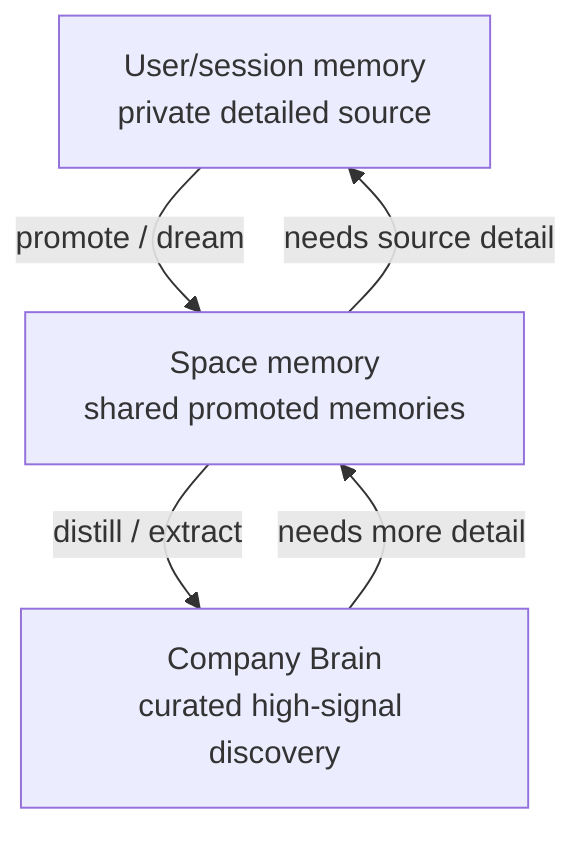

# THNK-79 Cognee-First Memory Ladder

## Problem Frame

ThinkWork has not fully implemented Company Brain yet, but the planned memory
story has already accumulated too many layers: Hindsight for session memory,
an ontology layer, Cognee as knowledge graph, and wiki materialization on top.
That stack risks making the first Brain proof spend more energy reconciling
memory systems than proving whether agents can use memory well.

THNK-79 narrows the direction before implementation: **Company Brain should use
Cognee as the primary memory substrate for this pass, and Hindsight should be
deprecated from the Brain path.** The product shape is a progressive memory
ladder:

1. User/session memory captures detailed individual context.
2. Space memory promotes important "dreamed" memories into a team-shared layer.
3. Company Brain distills the important material from space memories into the
   highest-level discovery surface.

Discovery starts at Company Brain. If the answer is too compressed, the user or
agent can follow provenance down to the space memory, then to the user/session
detail that supports it. This makes the top layer useful without losing the
audit trail.

---

## Actors

- A1. Individual user: produces detailed session memory and can search or inspect memories they are allowed to see.
- A2. Space member: benefits from promoted space memory shared with teammates.
- A3. ThinkWork agent: retains session context, promotes durable findings, searches top-down, and follows provenance when more detail is needed.
- A4. Tenant operator: configures Company Brain and needs a simpler operational story than running multiple memory systems.
- A5. Company Brain substrate: Cognee-backed memory layer that owns user, space, and company-level recall for this pass.

---

## Key Flows

- F1. User memory capture
  - **Trigger:** A user-agent session produces durable facts, decisions, preferences, or context.
  - **Actors:** A1, A3, A5
  - **Steps:** The agent stores useful session memory in a user-isolated Cognee scope. The memory preserves enough source linkage for later drilldown. Ephemeral chatter is filtered out by the retention rules for the user/session layer.
  - **Outcome:** The user has private, detailed memory available for later recall without making it team-visible by default.
  - **Covered by:** R1, R2, R5, R9

- F2. Promote to space memory
  - **Trigger:** User memory contains a durable finding useful to a team, project, or customer space.
  - **Actors:** A1, A2, A3, A5
  - **Steps:** The agent or approved promotion process extracts the useful finding into a shared space memory scope. The promoted memory links back to the supporting user/session memory and carries its sharing posture.
  - **Outcome:** Teammates can discover the promoted knowledge without seeing unrelated private session detail.
  - **Covered by:** R3, R4, R5, R6, R10

- F3. Distill Company Brain
  - **Trigger:** Space memories accumulate enough signal to produce company-level knowledge.
  - **Actors:** A2, A3, A4, A5
  - **Steps:** Cognee-first processing extracts high-signal company knowledge from shared space memory into the Company Brain layer. Company Brain entries remain linked to the space memories and original source detail that justify them.
  - **Outcome:** Company Brain becomes the top-level discovery surface, not a separate manually-authored wiki or a second memory authority.
  - **Covered by:** R7, R8, R9, R10, R11

- F4. Progressive memory discovery
  - **Trigger:** A user or agent searches Company Brain and needs more evidence or context.
  - **Actors:** A1, A2, A3, A5
  - **Steps:** Search starts at Company Brain. If the result is interesting but incomplete, the system exposes the linked space memory. If more context is still needed, it exposes permitted user/session source detail.
  - **Outcome:** The user sees concise answers first and can drill into evidence without losing authorization boundaries.
  - **Covered by:** R8, R10, R12, R13

---

## Requirements

**Cognee-first memory substrate**

- R1. Company Brain v0 for this pass must use Cognee as the primary memory substrate for user/session memory, space memory, and company-level Brain memory.
- R2. Hindsight must be deprecated from the new Company Brain memory path. New Brain behavior should not require Hindsight retain, recall, observations, mental models, or bank fan-in.
- R3. The memory model must support isolated user/session memory scopes so individual users retain private detailed context by default.
- R4. The memory model must support shared space memory scopes for promoted memories visible to authorized space members.
- R5. Promotion from user/session memory to space memory must preserve provenance back to the supporting source memory without exposing unrelated private detail.
- R6. Space memory must represent extracted or "dreamed" memories that are durable enough to help teammates, not raw session replay.
- R7. Company Brain must be distilled from space memory, not directly from every raw user/session memory by default.
- R8. Company Brain must act as the top-level discovery surface: search should start there before drilling into space or user/session detail.

**Progressive discovery and provenance**

- R9. Every promoted or distilled memory must carry a source trail that can answer "why does this exist?" and "what lower-level memory supports it?"
- R10. Drilldown must be permission-aware: a user may see a company-level or space-level summary without necessarily being allowed to inspect every user/session source behind it.
- R11. Company Brain entries must be concise enough for first-pass discovery while preserving links to richer space memory.
- R12. Agents must be able to follow the ladder during reasoning: company result first, then space support, then permitted user/session detail when needed.
- R13. User-facing search and agent-facing recall must share the same ladder semantics so humans and agents do not reason over different memory systems.

**Product simplification**

- R14. "Company Brain" is the user/operator-facing product concept. Cognee may appear in operator evidence and implementation docs, but customers should not choose between Cognee and Hindsight as product options.
- R15. The existing ontology and wiki concepts should become Cognee-backed product behaviors, not separate memory authorities for this pass.
- R16. The wiki should be treated as a rendered view or export of Cognee-backed Company Brain, not as an upstream source of truth.
- R17. Operator setup should describe one Brain substrate and one memory ladder, not a Hindsight plus ontology plus Cognee plus wiki chain.

**Transition and compatibility**

- R18. Existing Hindsight-specific UI, docs, or configuration that would confuse the Company Brain story should be retired, hidden, or clearly marked legacy during the Cognee-first pass.
- R19. Existing Cognee plugin infrastructure and Company Brain premium plugin posture should be reused as the product home for the substrate decision.
- R20. Existing Hindsight data does not need to be migrated before the first Cognee-first Brain proof unless planning identifies a specific dogfood dataset that must be preserved.

---

## Acceptance Examples

- AE1. **Covers R1, R3, R8.** Given a user has several agent sessions, when they search Company Brain for a topic, the first results come from Cognee-backed Company Brain memory, not Hindsight recall or a separate wiki index.
- AE2. **Covers R4, R5, R6, R10.** Given a private user memory contains a project decision useful to a team, when it is promoted into a space memory, authorized space members can see the promoted decision and source summary, while unrelated private session detail remains hidden.
- AE3. **Covers R7, R9, R11.** Given several space memories mention the same durable customer pattern, when Company Brain distills them, the top-level entry is concise and links to the supporting space memories.
- AE4. **Covers R12, R13.** Given an agent finds a Company Brain answer but needs more context, when it follows the source trail, it first retrieves supporting space memory and only then retrieves permitted user/session detail.
- AE5. **Covers R14, R17, R18.** Given a tenant operator configures Company Brain, the setup flow presents a Cognee-backed Brain substrate and memory ladder; it does not ask the operator to choose or tune Hindsight for the Brain path.

---

## Success Criteria

- The Company Brain memory story can be explained in one sentence: Cognee stores user memory, promotes it to space memory, and distills it into Company Brain with provenance drilldown.
- A planning agent can proceed without re-deciding whether Hindsight, Cognee, or a hybrid stack owns the first Brain implementation.
- A user or agent can search top-down and follow evidence down the ladder without crossing authorization boundaries.
- The first Brain proof removes at least one major layer from the previous Hindsight -> ontology -> Cognee -> wiki story.
- Operator-facing setup and docs no longer present Hindsight as part of the new Company Brain path.

---

## Scope Boundaries

### Deferred for later

- Migration of old Hindsight memory into Cognee.
- A formal benchmark shootout after implementation. This pass is a product and documentation decision, not an implementation bake-off.
- MemPalace evaluation. It is out of the narrowed THNK-79 decision.
- Advanced manual curation workflows for Company Brain entries.
- Full external-system writeback from Brain into CRM, ERP, Slack, or other connected applications.
- Rich wiki editing on top of Cognee. A rendered/readable view is enough for the first pass.

### Outside this product's identity

- A multi-backend memory settings page where customers choose Cognee vs. Hindsight.
- A Hindsight-first Brain with Cognee as a downstream graph materialization.
- A standalone wiki that competes with Company Brain as memory source of truth.
- A raw transcript search product that exposes every session detail before summarizing at space or company level.

---

## Key Decisions

- **Cognee-first:** Cognee owns the memory ladder for this pass because Company Brain is graph/provenance/discovery-shaped, not only per-user recall-shaped.
- **Deprecate Hindsight for Brain:** Hindsight may remain elsewhere temporarily as legacy infrastructure, but it is not part of the new Company Brain requirements.
- **Ladder over chain:** The product is not Hindsight -> ontology -> Cognee -> wiki. It is user/session memory -> space memory -> Company Brain, all under the Cognee-backed Brain contract.
- **Company Brain starts high level:** Search begins at the company layer and drills downward only when more evidence or detail is needed.
- **Wiki is a view:** Wiki-style pages are useful for reading and navigation, but they should render Cognee-backed Brain state rather than own memory state.

---

## Dependencies / Assumptions

- Current repo posture already treats Company Brain as the customer-facing plugin and Cognee as internal substrate machinery in `plugins/company-brain/src/manifest.ts`.
- Terraform currently exposes both `enable_hindsight` / `memory_engine` and `enable_cognee`; planning must simplify how these relate to the Company Brain path.
- Cognee documentation describes permanent graph memory and session memory via Remember, graph transformation via Cognify, dataset access and graph inspection APIs, and an architecture combining relational provenance, vector search, and graph relationships.
- Hindsight documentation describes isolated memory banks, observations, recall/reflect, and bank-level isolation; those are valuable, but cross-scope user -> space -> company promotion would mostly be ThinkWork orchestration around Hindsight.
- Cognee permissions, datasets, source/provenance handling, and graph recall are sufficient to model the desired ladder. Planning should verify this against the exact Cognee version and deployment mode ThinkWork pins.

---

## Sources / Research

- Cognee docs: [Remember](https://docs.cognee.ai/core-concepts/main-operations/remember), [Cognify](https://docs.cognee.ai/core-concepts/main-operations/legacy-operations/cognify), [Architecture](https://docs.cognee.ai/core-concepts/architecture), [API reference index](https://docs.cognee.ai/llms-full.txt)
- Hindsight docs: `hindsight-docs/references/best-practices.md`, `hindsight-docs/references/developer/api/memory-banks.md`, `hindsight-docs/references/developer/observations.md`, `hindsight-docs/references/faq.md`
- Prior ThinkWork docs: `docs/brainstorms/2026-06-09-cognee-centric-memory-pipeline-requirements.md`, `docs/brainstorms/2026-06-13-company-brain-premium-plugin-requirements.md`, `docs/brainstorms/2026-04-29-company-brain-v0-requirements.md`

---

## Outstanding Questions

### Resolve Before Planning

- None.

### Deferred to Planning

- [Affects R3-R8][Technical] Map Cognee's exact dataset, NodeSet, session, and permission primitives to ThinkWork user/session, space, and company scopes.
- [Affects R2, R18][Technical] Identify which Hindsight-specific GraphQL, UI, Terraform, CLI, docs, and runtime paths must be removed, hidden, or left as legacy.
- [Affects R5, R9-R13][Needs research] Verify Cognee's source/provenance output is strong enough for user-visible drilldown without building a parallel provenance store.
- [Affects R15-R16][Technical] Decide the minimal wiki rendering path once Cognee is the source of truth.

---

## Next Steps

-> /ce-plan for structured implementation planning.

---

## Scope Amendment: First Proof

After plan review, the first implementation slice is narrowed further:

- **Focus now:** convert Hindsight-backed session memory to Cognee-backed user
  memory, add explicit Cognee-backed space memory, and prove capture/recall for
  both.
- **User memory:** uses the main Cognee capture/remember path keyed to the
  user. The memory follows the user across spaces where policy allows it.
- **Space memory:** uses a separate Cognee capture/remember path keyed to the
  space. It stays with the space and is available to authorized space members.
- **Important correction:** space memory should not be treated primarily as
  "promotion from user memory." A session may produce both user and space
  captures, but the durable space write targets the space scope directly.
- **Follow-up:** company-level distillation, ontology processing, and wiki
  rendering move into a later ontology -> wiki / company Brain effort.

This amendment preserves the Cognee-first and Hindsight-deprecation direction,
but changes the first proof from the full user -> space -> company ladder to a
smaller user + space memory cutover.
