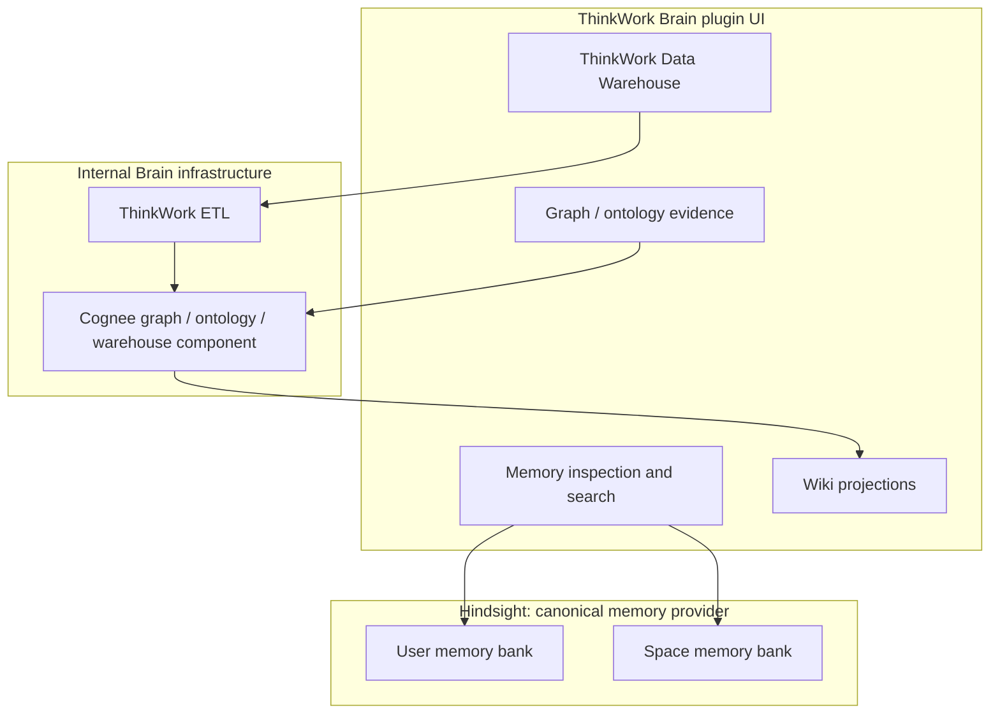

# THNK-83 Hindsight and ThinkWork Brain Boundary

## Problem Frame

THNK-79 attempted to simplify ThinkWork memory by making Cognee the primary
substrate for user memory, Space memory, and Company Brain. E2E validation then
showed a product-critical failure mode: user and Space test tokens bled across
scopes under Cognee graph-completion-style recall, and the current UI did not
provide a trustworthy per-user/per-Space Cognee inspector.

THNK-83 pivots the decision. For this pass, ThinkWork should choose one
canonical memory provider for user and Space memory: **Hindsight**. Cognee may
remain as internal ThinkWork Brain graph or warehouse infrastructure, but it
should not be the product's canonical user or Space memory provider unless a
separate future decision deliberately reopens that path.

The related product cleanup is naming and information architecture. "Company"
language makes the product feel narrower than the actual platform, and Memory
surfaces currently live under Settings even though they are becoming part of
the Brain product surface. The new product frame is:

- Company ETL -> ThinkWork ETL
- Company Data -> ThinkWork Data Warehouse
- Company Brain -> ThinkWork Brain

ThinkWork Brain becomes the product home for retained user memory, Space memory,
warehouse-backed knowledge, graph/ontology exploration, and wiki-style
projections. Hindsight is part of that Brain product story as the memory
substrate; Cognee is internal graph/warehouse machinery where it still earns its
keep.

---

## Actors

- A1. Individual user: captures and recalls private memory that follows them
  across Spaces where policy permits.
- A2. Space member: captures and recalls shared Space memory visible to
  authorized members of that Space.
- A3. ThinkWork agent: writes durable memories, retrieves the correct scopes,
  and assembles memory into useful turn context.
- A4. Tenant/operator admin: verifies memory isolation, Brain substrate health,
  and product setup from the web app.
- A5. Planner/implementer: needs one clear provider boundary before changing
  code, UI, Terraform, and docs.

---

## Key Flows

- F1. User memory capture and recall
  - **Trigger:** A user or agent captures a durable fact, preference, decision,
    or learning intended to follow the user.
  - **Actors:** A1, A3
  - **Steps:** The memory writes to the user's Hindsight bank. Later recall for
    that user reads from the same bank and does not return Space-only memories
    unless product policy explicitly asks for combined recall.
  - **Outcome:** User memory is portable, inspectable, and isolated.
  - **Covered by:** R1, R2, R3, R5

- F2. Space memory capture and recall
  - **Trigger:** A user or agent captures durable context intended for a Space.
  - **Actors:** A2, A3
  - **Steps:** The memory writes to a Space-specific Hindsight bank. Later
    Space recall reads from that bank and does not return memories from another
    Space.
  - **Outcome:** Space memory is shared by authorized Space members without
    crossing Space boundaries.
  - **Covered by:** R1, R2, R4, R5

- F3. ThinkWork Brain workspace
  - **Trigger:** An operator or user opens the Brain product surface to inspect
    memory, graph, warehouse, or wiki state.
  - **Actors:** A1, A2, A4
  - **Steps:** The Brain plugin UI exposes memory inspection/search, graph or
    ontology evidence when available, warehouse data surfaces, and wiki
    projections as parts of one Brain workspace rather than scattered Settings
    pages.
  - **Outcome:** Brain is the product home for compounding knowledge; Settings
    remains for configuration, not daily memory inspection.
  - **Covered by:** R8, R9, R10, R11, R12

- F4. Brain graph or warehouse processing
  - **Trigger:** ThinkWork needs structured graph, ontology, ETL, warehouse, or
    wiki projection behavior beyond Hindsight bank recall.
  - **Actors:** A3, A4
  - **Steps:** Cognee or another internal component may process approved shared
    data, Hindsight observations, warehouse artifacts, or graph inputs as
    ThinkWork Brain infrastructure. The user-facing memory provider remains
    Hindsight unless a future decision changes it.
  - **Outcome:** Cognee can still be useful without reintroducing ambiguity into
    user and Space memory.
  - **Covered by:** R6, R7, R13, R14

---

## Requirements

**Canonical memory provider**

- R1. Hindsight must be the canonical user and Space memory provider for this
  pass.
- R2. Product, code, UI, and docs must stop describing Hindsight as "legacy"
  when it is the active provider for user and Space memory.
- R3. User memory must map to an isolated Hindsight bank or equivalent
  Hindsight isolation primitive that follows the user across Spaces where
  product policy allows.
- R4. Space memory must map to an isolated Hindsight bank or equivalent
  Hindsight isolation primitive shared only with authorized Space members.
- R5. Combined user-plus-Space recall must be an explicit product policy path,
  not an accidental fan-in caused by backend retrieval behavior.

**Cognee boundary**

- R6. Cognee must not be the canonical provider for user or Space memory in
  THNK-83.
- R7. Cognee may remain as internal ThinkWork Brain infrastructure for graph,
  ontology, warehouse, or wiki projection work where it is deliberately scoped
  and inspectable.
- R8. Customers and normal users must not be asked to choose Hindsight versus
  Cognee as a memory product setting.

**ThinkWork Brain product home**

- R9. "Company Brain" must be rebranded to "ThinkWork Brain" in user-facing
  product surfaces for this direction.
- R10. "Company ETL" must become "ThinkWork ETL" in user-facing product
  surfaces.
- R11. "Company Data" must become "ThinkWork Data Warehouse" in user-facing
  product surfaces.
- R12. Memory inspection/search pages should move out of Settings and into the
  ThinkWork Brain plugin UI, while Settings keeps configuration, deployment,
  entitlement, and operator controls.
- R13. ThinkWork Brain must present Hindsight-backed memory as part of the Brain
  product, not as a detached vendor add-on.
- R14. ThinkWork Brain may include graph, ontology, warehouse, and wiki
  projections, but these must be positioned as Brain capabilities or internal
  components rather than competing memory authorities.

**Verification and transition**

- R15. The first implementation plan must identify and update current
  Cognee-only user/Space memory assumptions before claiming the pivot is done.
- R16. The product must expose UI-verifiable examples for user and Space memory
  isolation, including evidence that User, Space A, and Space B test memories do
  not cross scopes.
- R17. PR #3018 should remain diagnostic evidence rather than the merge path for
  user/Space memory unless the product direction is reopened.
- R18. Existing Cognee or Company Brain plugin infrastructure should be reused
  only where it helps establish the ThinkWork Brain home without preserving the
  wrong provider boundary.

---

## Acceptance Examples

- AE1. **Covers R1, R3, R5, R16.** Given a user captures a user-only test
  token and Space A captures a Space-only test token, when the user searches
  user memory, then only the user-bank token appears.
- AE2. **Covers R1, R4, R5, R16.** Given Space A and Space B each capture a
  unique Space-only token, when a member searches Space A memory, then Space B's
  token is absent, and vice versa.
- AE3. **Covers R2, R9, R12, R13.** Given Hindsight is active for user and
  Space memory, when an operator opens the Brain workspace, then Hindsight-backed
  memory is presented as active ThinkWork Brain memory, not as "legacy" memory
  buried in Settings.
- AE4. **Covers R6, R7, R8, R14.** Given Cognee remains deployed for graph or
  warehouse work, when a user inspects memory settings or Brain surfaces, then
  Cognee is not offered as the user/Space memory provider choice.
- AE5. **Covers R9, R10, R11.** Given a user-facing page, nav item, plugin card,
  or docs page names the Brain/Data/ETL product, when the rebrand is complete,
  it uses ThinkWork Brain, ThinkWork Data Warehouse, or ThinkWork ETL.

---

## Success Criteria

- THNK-83 can be planned without re-deciding whether Hindsight or Cognee owns
  user and Space memory.
- A human can verify from the product UI that Hindsight-backed user and Space
  memory are isolated.
- Product language consistently treats ThinkWork Brain as the home for memory
  and compounding knowledge, while Settings remains configuration-oriented.
- Cognee's remaining role is legible: internal graph/warehouse/ontology
  infrastructure only, not a competing memory provider.
- The rename from Company to ThinkWork removes customer-facing ambiguity without
  requiring all internal code identifiers to change in the same pass.

---

## Scope Boundaries

### Deferred for later

- A future Cognee v1 `remember`/`recall` evaluation for user or Space memory.
- Migration of old Cognee user/Space memory data into Hindsight.
- Migration of all existing internal identifiers from `company-brain` to
  `thinkwork-brain`.
- Full ThinkWork Data Warehouse implementation beyond naming and product
  boundary alignment.
- Full graph-of-record or wiki materialization redesign.
- Billing, packaging, and marketplace changes beyond preserving the Brain
  plugin home.

### Outside this product's identity

- A customer-facing backend picker for Hindsight versus Cognee memory.
- Treating Cognee graph completion as acceptable isolation for user and Space
  memory without a new explicit product decision and E2E evidence.
- A standalone Memory settings product that competes with ThinkWork Brain as
  the home for compounding knowledge.
- A generic "company brain" story that only works for one tenant-wide company
  knowledge base and not for ThinkWork's broader agent OS direction.

---

## Key Decisions

- **Hindsight owns user and Space memory for this pass:** Its bank-first model
  maps directly to ThinkWork's need for isolated user and Space memory.
- **Cognee remains possible Brain infrastructure:** Cognee is not thrown away,
  but its role is graph, ontology, warehouse, or wiki machinery rather than
  canonical user/Space memory.
- **One memory provider does not mean one knowledge substrate:** The product
  should expose one memory authority for user and Space recall while still
  allowing specialized internal components behind ThinkWork Brain.
- **ThinkWork Brain replaces Company Brain:** The Brain is a ThinkWork platform
  capability, not only a company-wide knowledge base.
- **Move Memory UI into the Brain product home:** Memory inspection is part of
  Brain usage and verification; Settings should own setup and operator controls.

---

## Dependencies / Assumptions

- THNK-83 already records live E2E concerns from THNK-79, including Cognee
  graph-completion scope bleed and lack of trustworthy per-user/per-Space Cognee
  inspection.
- PR #3018 is paused as diagnostic evidence for Cognee chunk-isolation
  mitigation rather than the intended product path.
- Current code contains Cognee-specific assumptions for Space memory, including
  GraphQL paths that reject non-Cognee adapters.
- Current UI labels active Hindsight as "Hindsight legacy" in the Memory status
  strip.
- Current Company Brain plugin detail links to a Settings memory graph
  workspace, so the product home already exists in partial form but points back
  to the old IA.
- Hindsight documentation positions memory banks as isolated stores and recall
  as multi-strategy retrieval over structured facts.
- Cognee documentation positions `recall()` as the v1 retrieval entry point and
  datasets/permissions as its graph-backed isolation model.

---

## Visual Aid

---

## Sources / Research

- `docs/brainstorms/2026-06-26-thnk-79-cognee-first-memory-ladder-requirements.md`
- `docs/brainstorms/2026-06-09-cognee-centric-memory-pipeline-requirements.md`
- `docs/brainstorms/2026-06-13-company-brain-premium-plugin-requirements.md`
- `docs/plans/archived/harness-owned-memory-positioning.md`
- `apps/web/src/components/settings/SettingsMemory.tsx`
- `apps/web/src/components/settings/SettingsMemoryHome.tsx`
- `apps/web/src/components/settings/plugins/PluginDetail.tsx`
- `packages/api/src/graphql/resolvers/memory/memorySystemConfig.query.ts`
- `packages/api/src/graphql/resolvers/memory/spaceMemorySearch.query.ts`
- `packages/api/src/graphql/resolvers/memory/captureSpaceMemory.mutation.ts`
- Hindsight docs: [Best Practices](https://hindsight.vectorize.io/best-practices),
  [Recall](https://hindsight.vectorize.io/developer/api/recall),
  [Observations](https://hindsight.vectorize.io/developer/observations),
  [Reflect](https://hindsight.vectorize.io/developer/reflect)
- Cognee docs: [Core Concepts](https://docs.cognee.ai/core-concepts/overview),
  [Recall](https://docs.cognee.ai/python-api/recall),
  [Search](https://docs.cognee.ai/core-concepts/main-operations/legacy-operations/search),
  [Sessions and Caching](https://docs.cognee.ai/core-concepts/sessions-and-caching)

---

## Outstanding Questions

### Resolve Before Planning

- None.

### Deferred to Planning

- [Affects R3-R5][Technical] What exact Hindsight bank naming and access model
  should represent user banks and Space banks?
- [Affects R12][Technical] Should Brain plugin UI embed the existing Memory
  components first, or should routes move before component ownership changes?
- [Affects R9-R11][Technical] Which user-facing "Company" strings must change
  in the first PR, and which internal identifiers should remain stable for now?
- [Affects R15][Technical] Which Cognee-only GraphQL, UI, runtime, Terraform,
  and tests need to change for Hindsight-backed Space memory?
- [Affects R7, R14][Needs research] Which Cognee capabilities remain valuable
  for ThinkWork Brain after user/Space memory pivots to Hindsight?

---

## Next Steps

-> /ce-plan for structured implementation planning.
