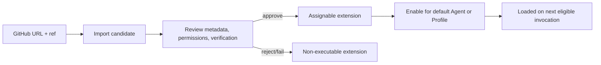

# THINK-114 Dynamic Pi Extensions

## Problem Frame

ThinkWork's Pi runtime already uses Pi's `extensionFactories` mechanism, but
first-party extensions still ship as image-baked code in `packages/pi-extensions`.
That means adding or improving an extension still tends to require a runtime image
build and deploy, even though the underlying Pi model supports TypeScript
extensions as runtime-loaded modules.

`THINK-114` should make extensions a first-class operator-managed capability on
the Agents settings page. Operators need to import an extension from a GitHub
repository, review its source/provenance/declared permissions, approve it, then
enable it for the default Agent or Agent Profiles. No imported extension should
execute until it has passed review and been approved.

V1 should prove the product loop end to end with GitHub import first. Uploads,
package-name imports, marketplace browsing, and agent-authored promotion are
valuable follow-ons, but they are not required to prove the core bet.

---

## Actors

- A1. Operator: manages tenant Agent configuration from Settings -> Agents,
  imports extensions, reviews permissions and provenance, and enables approved
  extensions.
- A2. Extension reviewer: may be the same person as A1, but represents the
  approval role that decides whether imported TypeScript may execute.
- A3. Agent/Profile user: benefits when the default Agent or delegated Agent
  Profile gains a reviewed extension capability.
- A4. ThinkWork runtime: loads only approved extension artifacts through the
  existing Pi extension factory path on eligible invocations.
- A5. Planner/implementer: uses this requirements doc to design the concrete
  storage, build, verification, and runtime integration.

---

## Key Flows

- F1. Import a GitHub extension for review
  - **Trigger:** An operator clicks an Extensions action on Settings -> Agents
    and chooses GitHub import.
  - **Actors:** A1, A2
  - **Steps:** The operator provides a GitHub repository URL and explicit ref.
    ThinkWork imports the candidate extension for review, records the source
    identity, extracts declared metadata, and marks the extension as not
    executable until review passes.
  - **Outcome:** The candidate appears in the Extensions table with a review
    status and no runtime assignment.
  - **Covered by:** R1, R2, R3, R5, R6, R9

- F2. Review and approve an extension
  - **Trigger:** An imported extension is in a needs-review or failed-review
    state.
  - **Actors:** A1, A2
  - **Steps:** The reviewer inspects source provenance, declared tool names,
    permission classes, runtime target, verification result, and version. If the
    extension is acceptable, the reviewer approves it; otherwise they reject it
    with a reason.
  - **Outcome:** Approved extensions become assignable; rejected or failed
    extensions remain non-executable.
  - **Covered by:** R4, R5, R6, R7, R8, R10, R11

- F3. Enable an approved extension for the default Agent or a profile
  - **Trigger:** An operator chooses an approved extension from the Agents page
    Extensions table.
  - **Actors:** A1, A3, A4
  - **Steps:** The operator assigns the extension to the default Agent or one or
    more Agent Profiles. The table reflects where the extension is enabled. On
    the next eligible invocation, the runtime includes the approved extension in
    the Pi extension factory surface and folds declared tool names into the
    effective model-visible tool surface.
  - **Outcome:** The selected Agent/Profile can use the extension on the next
    invocation, and the operator can see which extension version is active.
  - **Covered by:** R12, R13, R14, R15, R16, R17

- F4. Diagnose extension load or verification failure
  - **Trigger:** An extension import, review, or runtime load fails.
  - **Actors:** A1, A2, A4
  - **Steps:** ThinkWork shows the failed state in the Extensions table or
    extension detail, including a concise reason and the last verification/load
    evidence available to the operator. Failed extensions cannot be assigned or
    executed until they are corrected and re-reviewed.
  - **Outcome:** Operators can distinguish unreviewed, rejected, failed, and
    enabled extensions without inspecting runtime logs.
  - **Covered by:** R8, R10, R11, R17, R18

---

## Requirements

**Agents page experience**

- R1. Settings -> Agents must include an Extensions table near the default Agent
  and Agent Profiles configuration, rather than hiding dynamic extensions in an
  unrelated settings area.
- R2. The Extensions table must support a GitHub import action in v1.
- R3. GitHub import must require source identity precise enough for review,
  including repository URL and explicit ref or equivalent immutable source
  reference.
- R4. Imported extensions must be non-executable by default.
- R5. The table must show enough status at a glance for operators to distinguish
  at least imported, needs review, approved, rejected, failed verification,
  enabled, and disabled states.
- R6. The table must show source, version/ref, review status, declared
  permissions, and assignment target summary.

**Review and approval**

- R7. An extension must require explicit approval before it can be enabled for
  the default Agent or any Agent Profile.
- R8. Rejected or failed extensions must remain visible for diagnosis but must
  not be assignable or executable.
- R9. Review must include the extension's declared tool names, lifecycle hooks or
  equivalent extension capabilities, runtime target, and requested permission
  classes.
- R10. Review must include provenance and verification evidence sufficient for
  an operator to understand what source was reviewed.
- R11. Approval must be version/ref-specific; changing the source ref, version,
  declared permissions, or executable artifact returns the extension to review.

**Assignment and runtime contract**

- R12. Approved extensions must be assignable to the default Agent and to Agent
  Profiles.
- R13. The Agents page must make extension assignment visible alongside existing
  Tools, MCP, and Skills capability summaries.
- R14. Enabling or changing an extension must take effect on the next eligible
  invocation, not by hot-swapping code inside an already-running turn.
- R15. The runtime must only receive approved extension artifacts through the
  established Pi extension factory loading path; v1 must not load arbitrary
  workspace TypeScript directly.
- R16. Extension-declared model-visible tool names must be included in the
  effective allowlist when the extension is loaded, so approved tools do not
  register silently and then disappear from the model.
- R17. Runtime evidence must identify which extension version/ref was active for
  a turn and whether it loaded successfully.

**Failure and safety behavior**

- R18. Import, review, verification, and runtime load failures must produce
  operator-visible status and a concise reason.
- R19. Extensions must not receive secrets or privileged provider access merely
  because they are imported; any provider or permission access must be declared,
  reviewed, and granted through policy.
- R20. V1 must preserve the existing distinction between workspace skills,
  built-in tools, MCP servers, and Pi extensions.

---

## Acceptance Examples

- AE1. **Covers R1, R2, R3, R4, R5.** Given an operator is on Settings ->
  Agents, when they import a GitHub repository/ref as an extension, then a new
  row appears in the Extensions table as non-executable and requiring review.
- AE2. **Covers R7, R8, R9, R10, R11.** Given an imported extension declares a
  model-visible tool and workspace-write permission, when a reviewer rejects it,
  then the extension remains visible with the rejection state and cannot be
  assigned to any Agent/Profile.
- AE3. **Covers R12, R13, R14, R15, R16.** Given an approved extension is
  enabled for the Coding profile, when the next Coding-profile invocation
  starts, then the runtime loads the approved artifact through the Pi extension
  factory path and exposes the declared tool names to the model.
- AE4. **Covers R11, R14, R17.** Given extension version `abc123` is enabled
  and version `def456` is imported later, when the new version has not yet been
  approved, then existing eligible invocations continue using the approved
  version until the operator approves and enables the new version for a later
  invocation.
- AE5. **Covers R18, R19, R20.** Given a GitHub import fails verification because
  it requests undeclared provider access, when the operator opens the row, then
  ThinkWork shows the failure reason and does not treat the extension as a
  workspace skill, MCP server, or built-in tool.

---

## Success Criteria

- Operators can import a GitHub-hosted Pi extension from Settings -> Agents and
  see it enter review without any possibility of immediate execution.
- Approved extensions can be enabled for the default Agent or specific Agent
  Profiles, and the effective assignment is visible on the Agents page.
- The runtime only loads approved extension artifacts on subsequent invocations,
  preserving the existing `extensionFactories` direction rather than introducing
  ad hoc workspace-code execution.
- Failed or rejected extensions are understandable from the operator UI without
  reading runtime logs.
- A downstream planner can proceed without re-deciding the v1 surface, import
  source, approval gate, next-invocation semantics, or relationship to skills,
  built-ins, and MCP.

---

## Scope Boundaries

- V1 supports GitHub URL/ref import first; file upload and package-name import
  are deferred.
- V1 does not include public marketplace browsing, publisher accounts,
  auto-update feeds, ratings, or cross-tenant extension sharing.
- V1 does not execute agent-authored extension drafts. Agent-authored promotion
  is deferred until after reviewed operator imports work.
- V1 does not hot-reload extension code inside an active turn.
- V1 does not make extensions part of the workspace skill catalog or install
  them as `skills/<slug>/SKILL.md`.
- V1 does not grant arbitrary network, credential, or provider access merely
  because source import succeeded.
- V1 does not require mobile runtime execution for every extension. Runtime
  target metadata should leave room for cloud-only and future portable
  extension classes.
- V1 does not replace existing built-in tools, MCP server configuration, or
  workspace skills.

---

## Key Decisions

- **Agents page first:** The primary operator workflow starts from Settings ->
  Agents because extension assignment is part of Agent/Profile capability
  configuration.
- **GitHub import first:** GitHub URL/ref import gives a better provenance and
  review story than arbitrary upload, while avoiding package-manager
  supply-chain scope in v1.
- **Review before execution:** Imported TypeScript is never executable until
  reviewed and approved.
- **Next invocation, not hot reload:** The cloud contract is deterministic
  next-invocation loading, not Pi local `/reload` semantics.
- **Distinct capability surface:** Dynamic Pi extensions are not workspace
  skills, built-ins, or MCP servers. The UI may be on the Agents page, but the
  capability class remains distinct.

---

## Dependencies / Assumptions

- The existing Pi extension loading path through `extensionFactories` remains
  the preferred runtime mechanism.
- `packages/pi-extensions/src/define-extension.ts` is a useful reference for
  the extension authoring contract, especially `toolNames`, provider seams, and
  factory conversion.
- The existing Agents settings page in `apps/web/src/components/settings/SettingsAgents.tsx`
  is the likely user-facing surface to extend.
- Existing skill catalog trust/signature concepts can inform the review model,
  but Pi extensions require their own executable-artifact semantics.
- The exact storage, build, signing, and verification mechanics are planning
  decisions, not product requirements settled here.

---

## Outstanding Questions

### Deferred to Planning

- [Affects R3, R10, R11][Technical] What exact source identity should v1 accept
  for GitHub imports: branch, tag, commit SHA, release asset, or a constrained
  subset?
- [Affects R9, R19][Technical] What permission classes are enforceable in v1
  versus only review-declared?
- [Affects R10, R15, R17][Technical] What artifact format and signature
  verification path should bridge reviewed source into runtime
  `extensionFactories`?
- [Affects R12, R13][Technical] How should default-Agent assignment and
  Agent-Profile assignment interact when both are present?
- [Affects R17, R18][Technical] Where should per-turn extension evidence live so
  operators and support can diagnose extension behavior without leaking
  sensitive provider details?
- [Affects R20][Needs research] Which existing skill catalog trust/signature
  primitives should be reused directly, and which need a separate extension
  concept?

---

## Next Steps

-> `/ce-plan` for structured implementation planning.
