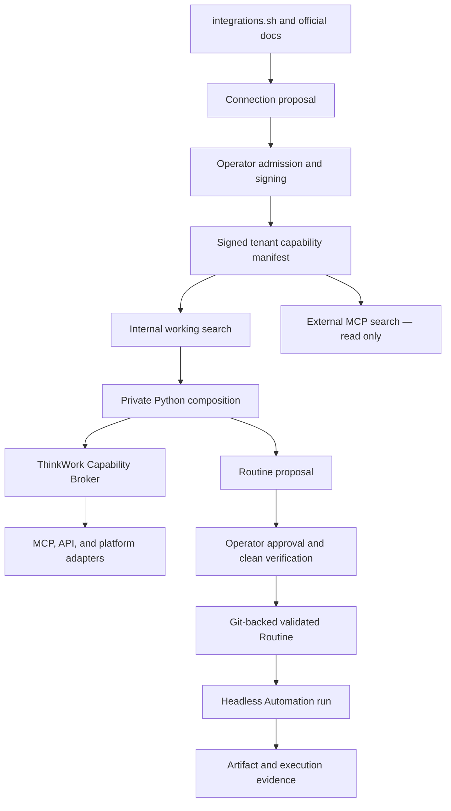

# THINK-280 Capability Runtime Requirements

## Problem Frame

ThinkWork already has signed capability manifests, folder-defined Tools and
Connections, AgentCore Code Interpreter, Git-backed deterministic Routines,
Automations, Workflows, scoped memory, credential bindings, and execution
ledgers. Those parts are individually real, but an agent cannot yet move
through one governed loop:

> discover an admitted capability → compose it in code → verify the behavior
> → promote the code to a Routine → run it headlessly

Kody demonstrates why this loop matters: an agent reasons once, composes
capabilities in sandboxed code, and preserves successful deterministic work
for later execution. ThinkWork should adopt that loop without adopting Kody's
Cloudflare implementation, its Package vocabulary, or its per-user trust
model. ThinkWork's version must preserve tenant isolation, explicit principal
resolution, operator admission, action-time authorization, immutable
compatibility contracts, and durable evidence.

The prose requirements govern if the diagram and text ever disagree.

---

## Reference Frame

- [“I was wrong about MCPs”](https://x.com/_overment/status/2076440928726708612)
- [kentcdodds/kody](https://github.com/kentcdodds/kody), reviewed at commit
  [`e34c159`](https://github.com/kentcdodds/kody/tree/e34c15953122864dbcd02ced2a18b2c1c84ffece)
- [integrations.sh](https://integrations.sh/) and
  [UsefulSoftwareCo/integrations](https://github.com/UsefulSoftwareCo/integrations)
- [executor.sh](https://executor.sh/) and
  [UsefulSoftwareCo/executor](https://github.com/UsefulSoftwareCo/executor),
  retained as later reference rather than a v1 dependency
- Existing ThinkWork seams:
  `packages/api/src/lib/capabilities/manifest-compile.ts`,
  `packages/api/src/lib/capabilities/definition-schemas.ts`,
  `packages/agentcore-pi/agent-container/src/runtime/tools/execute-code.ts`,
  `packages/agentcore-pi/agent-container/src/mcp-registry.ts`,
  `packages/agentcore-pi/agent-container/src/mcp-proxy.ts`,
  `packages/lambda/analyst-caller-context.ts`,
  `packages/lambda/analyst-query-broker.ts`,
  `packages/database-pg/src/schema/routines.ts`, and
  `packages/database-pg/src/schema/routine-code-cache.ts`
- Existing plans:
  `docs/plans/2026-07-05-002-feat-folder-defined-tools-connections-plan.md`
  and `docs/plans/2026-07-03-004-feat-deterministic-routines-v1-plan.md`

---

## Actors

- A1. Operator: admits Connection definitions, prepares credential bindings,
  approves exact Routine proposals, and inspects execution evidence.
- A2. Agent user: asks an agent to solve a problem, observes exploratory
  execution, and may request that successful behavior become reusable.
- A3. ThinkWork agent and trusted runtime: researches candidate integrations,
  discovers the active capability surface, composes Python, and creates
  non-executable proposals; the trusted host creates broker sessions.
- A4. Headless executor: runs validated Routines from Automations or Workflows
  using an explicit service principal and records exact execution identity.
- A5. External MCP host: performs read-only capability discovery as an
  explicitly mapped ThinkWork user or service principal.

---

## Key Flows

- F1. Connection research and admission
  - **Trigger:** An agent needs to connect to a service that is not already an
    admitted working capability.
  - **Actors:** A1, A3
  - **Steps:** The agent searches existing tenant/platform definitions, uses
    integrations.sh for discovery evidence when needed, verifies every
    material fact against official provider documentation, and creates a
    non-executable surface-specific Connection proposal. An operator reviews
    the definition, operations, provenance, annotations, and credential
    requirements. ThinkWork signs a new immutable tenant definition version,
    then separately verifies each credential binding.
  - **Failure/escape:** Unverified, incomplete, stale, or unsigned proposals
    remain research results with remediation guidance and cannot enter working
    discovery or execute.
  - **Outcome:** A versioned definition exists in the tenant catalog, with zero
    or more independently ready principal bindings.
  - **Covered by:** R3, R4, R5, R6, R7

- F2. Interactive composition and promotion
  - **Trigger:** An agent identifies repeatable deterministic work during a
    user conversation.
  - **Actors:** A1, A2, A3
  - **Steps:** Working discovery returns the invocation's exact executable
    operations. The trusted runtime opens a proof-of-possession broker session
    and runs Python in the private composition environment. The agent tests
    the solution, minimizes permissions, and captures sanitized fixtures and
    invariants. It creates a non-executable Routine proposal. An operator
    approves the exact proposal fingerprint; ThinkWork commits it to the
    tenant Git repository and validates it in a clean session.
  - **Failure/escape:** Authorization, readiness, replay, egress, fixture,
    invariant, or compatibility failures stop the flow without executing or
    activating unapproved behavior.
  - **Outcome:** A green commit SHA becomes the active validated `git_python`
    Routine; otherwise the proposal or candidate remains non-executable.
  - **Covered by:** R8, R9, R10, R11, R12, R13, R14, R15

- F3. Headless recurring execution
  - **Trigger:** An Automation schedule or Workflow invokes a validated
    Routine.
  - **Actors:** A1, A4
  - **Steps:** The executor resolves the pinned Routine SHA and dependency
    manifest, selects the declared service principal, checks live readiness,
    creates a fresh broker session, and runs the Routine. The Routine produces
    its declared output or Artifact. The platform records code, configuration,
    capability, principal, broker-call, budget, effect, and outcome evidence.
  - **Failure/escape:** There is no principal fallback or compatible-latest
    substitution. Revoked bindings, drifted contracts, missing approvals, or
    unavailable dependencies yield an explicit degraded/blocked run outcome.
  - **Outcome:** Repeated work runs without agent turns and remains attributable
    to the exact code and capability contracts used.
  - **Covered by:** R6, R7, R9, R10, R14, R15, R16

- F4. External discovery
  - **Trigger:** An authenticated external MCP host searches the tenant's
    permitted capability surface.
  - **Actors:** A5
  - **Steps:** ThinkWork maps the host to exactly one tenant user or service
    principal, filters the canonical manifest projection for that identity,
    and returns permitted descriptors, schemas, annotations, compatibility
    identity, and readiness/remediation summaries.
  - **Failure/escape:** Unmapped identity, cross-tenant access, sensitive
    metadata, and all execution/session-creation requests fail closed.
  - **Outcome:** External discovery validates the surface-independent
    descriptor without exposing external execution in v1.
  - **Covered by:** R2, R3, R17

---

## Requirements

**Vocabulary and authority**

- R1. Formalize a ThinkWork Capability Runtime without adding a Package noun
  or replacing existing product concepts: Skill, Tool, Connection, Routine,
  Workflow, Automation, Application Plugin, and Artifact retain their current
  meanings.
- R2. Define one immutable, operation-addressable capability descriptor shared
  by signing, manifest compilation, internal and external discovery, broker
  invocation, Capability Inspector, Routine dependencies, and run evidence.
  Its semantic identity comprises capability class/namespace/slug, definition
  version/fingerprint, operation ID, and operation contract hash. A definition
  carries provenance, adapter kind, binding requirements, and operation
  contracts; an invocation-specific manifest projection adds grants,
  readiness, and availability without mutating the definition.
- R3. Maintain separate discovery planes. `capability_search` returns only the
  signed, active, executable surface for the current invocation.
  `connection_research` searches proposals, admitted definitions, platform
  seeds, integrations.sh evidence, and remediation, but cannot execute,
  resolve credentials, admit, or sign anything.

**Connection admission, identity, and compatibility**

- R4. integrations.sh is an untrusted discovery assistant, never a runtime
  dependency or execution authority. Agents must prefer a cached result when
  fresh, bound live discovery by timeout/size, retain provenance, verify every
  URL and material auth/operation claim against official provider sources, and
  perform a cheap read-only authenticated smoke test before a binding becomes
  ready.
- R5. Connection definitions are reusable and surface-specific: GitHub MCP and
  GitHub REST are separate definitions even when grouped under one provider.
  Tenant admission affects only that tenant. Promotion to a platform seed is a
  separate review, signature, and versioning event.
- R6. Definition admission and credential readiness are separate. Each
  credential binding moves from `pending_setup` through `verifying` to
  `ready`, and may later become `degraded` or `revoked`. It records redacted
  version-specific evidence and belongs to exactly one declared principal
  mode: `requester`, `agent_owner`, or `service`. Action-time resolution has
  no fallback between modes.
- R7. Every executable operation has a signed, fail-closed contract containing
  input/output schemas plus an effect of `none`, `read`, `create`, `update`,
  `delete`, or `execute`; target/open-world scope;
  reversibility/compensation; idempotency/retry behavior; accepted principal
  modes; approval policy; input/output data classifications; and
  cost/latency/output-size classes. Definitions are immutable; refresh
  produces a candidate diff/version. Grants and Routines pin exact definition
  versions, operation IDs, and contract hashes. No new or changed operation
  auto-enters an existing grant.

**Governed composition and execution**

- R8. Use a dedicated ThinkWork Capability Broker as the action-time policy,
  credential-resolution, dispatch, and evidence boundary. The v1 service may
  use AWS-native transport, but its language-neutral contract must remain
  independent of the Pi process and of AgentCore Gateway. Gateway may later be
  an adapter/target, not the ThinkWork policy authority.
- R9. Expose one canonical invocation/result envelope over kind-specific MCP,
  HTTP/OpenAPI, platform, memory, Workflow, and future adapters. Authored code
  identifies the exact operation and supplies typed input; the result reports
  `completed`, `accepted`, or `failed`, validated data or durable references,
  typed retryability, and evidence references. Each adapter preserves its own
  authorization, durability, cancellation, approval, and effect semantics.
- R10. Re-authorize every call against tenant, actor, agent/Space/Profile,
  explicit principal mode, current grants, exact contracts, binding readiness,
  approval, budgets, data policy, and destructive-action gates. Discovery or a
  valid session never grants execution by itself.
- R11. Use short-lived, stateful proof-of-possession sessions. The trusted host
  creates a session containing exact grants/contracts/principal/budgets and
  binds an ephemeral asymmetric key. Every request signs its canonical body,
  audience, session, sequence, timestamp, and nonce. The broker rejects stale,
  duplicate, expired, cancelled, cross-tenant, or out-of-order requests and
  persists no private key or provider credential material.
- R12. Python on AgentCore Code Interpreter is the only v1 authored composition
  and Routine language. Governed composition runs in a new
  `capability-private` VPC environment that can reach only the private broker
  and approved AWS endpoints; the broker alone has external service egress.
  `default-public` remains low-sensitivity exploration, and `internal-only`
  retains its existing isolation contract. Runtime dependencies are prebuilt
  or retrieved through approved internal artifact paths.

**Routine proposal, verification, and lifecycle**

- R13. Any eligible agent session may turn successful Python into a durable,
  non-executable proposal containing normalized source, input/output contract,
  fixtures, invariants, exact capability dependencies, minimum grants,
  principal modes, effect/data/cost summary, originating evidence, and a
  content fingerprint. Creating or editing a proposal has no Git or external
  execution effect.
- R14. Only an operator/admin may approve the exact proposal fingerprint.
  ThinkWork then atomically commits code, fixtures, dependency manifest, and
  provenance to the tenant Routine Git repository and reruns validation in a
  clean `capability-private` session. Git remains the executable source of
  truth; only a green commit SHA plus current live readiness can activate.
- R15. Verification has two layers. The hermetic gate uses minimized,
  sanitized broker fixtures to validate outputs, invariants, call sequence,
  arguments, contracts, budgets, idempotency, and error handling without live
  effects. Live readiness separately checks definitions, grants, principal
  bindings, and cheap read-only smoke tests; effectful calls use provider
  dry-run/canary support when available and are never blindly repeated by the
  publication gate. Constrained repair auto-publishing may only preserve or
  narrow dependencies, principals, effects, and budgets; all expansion becomes
  a new operator-reviewed proposal.
- R16. Headless Routine execution reuses existing Automation/Workflow and
  Routine run-ledger machinery. Every run records the exact Routine SHA,
  non-secret configuration fingerprint, dependency contracts, principal and
  binding decisions, broker calls, budgets, effects, artifacts, and outcome.
  Incompatibility or revocation is an explicit readiness/run state, never a
  silent fallback to a newer capability or different principal.

**External surface and v1 scope**

- R17. Ship an external MCP `search` facade in v1 over the same canonical
  descriptor and signed manifest projection. The external host maps to exactly
  one tenant user or service principal and receives only permitted discovery
  data. It cannot create broker sessions, execute capabilities, resolve
  credentials, admit definitions, sign proposals, or mutate Routine state.
  External `execute` is deferred.
- R18. Introduce no new Values service or generic Routine-owned Storage in v1.
  Use typed inputs, immutable Git defaults, read-only references to existing
  governed configuration, Workflow/Automation state, Artifacts/workspace S3,
  domain ledgers, Git, and execution ledgers. Provider credentials remain
  Connection bindings. Revisit new state only for a concrete approved Routine
  that cannot fit these models.
- R19. Prove v1 with a scheduled GitHub issue-health digest that researches and
  admits GitHub REST, composes a deterministic digest through brokered Python,
  promotes it to a Git-backed Routine, runs it headlessly as a service
  principal, writes a ThinkWork Artifact, records complete evidence, and shows
  the same permitted GitHub descriptor through external MCP `search`.

---

## Acceptance Examples

- AE1. **Covers R3, R4, R5.** Given no admitted GitHub REST definition, when
  an agent finds GitHub through integrations.sh, it can create a sourced
  proposal but cannot execute it; only official-doc verification and operator
  admission can make a signed definition eligible for working discovery.
- AE2. **Covers R6, R10.** Given a Routine declares `service` principal mode
  and only a requesting user's GitHub binding is ready, when the Routine runs
  headlessly, the broker returns an explicit unavailable-principal result and
  never falls back to the user binding.
- AE3. **Covers R2, R7, R16.** Given GitHub changes an output schema or an
  operation annotation, when the catalog refreshes, ThinkWork creates a
  candidate version and marks the pinned Routine dependency incompatible or
  upgrade-available; the active definition and Routine do not silently change.
- AE4. **Covers R11.** Given a previously accepted broker request is replayed
  with the same session sequence or nonce, when the broker receives it, the
  call is rejected before credential resolution or provider dispatch and the
  replay decision is recorded.
- AE5. **Covers R8, R10, R12.** Given authored Python attempts to contact
  GitHub directly or inspect provider credentials, when it runs in
  `capability-private`, direct egress fails and no provider token is present;
  the admitted broker operation remains the only external path.
- AE6. **Covers R13, R14, R15.** Given an exploratory issue digest succeeded,
  when the agent proposes it as a Routine, the operator reviews the exact code,
  fixtures, invariants, dependencies, and evidence fingerprint. Any material
  edit invalidates approval. Activation occurs only after a clean hermetic
  green and current live readiness.
- AE7. **Covers R7, R15.** Given an operation creates or updates an external
  object and has no provider dry-run, when its Routine candidate is validated,
  fixtures simulate the broker result and the gate does not repeat the live
  effect; the operator reviews the original redacted effect evidence.
- AE8. **Covers R6, R16, R19.** Given the scheduled GitHub digest was active
  and its service binding is revoked, when the next Automation fires, no
  GitHub request occurs, the run becomes explicitly blocked/degraded, and the
  ledger identifies the missing binding and remediation.
- AE9. **Covers R17.** Given an external MCP host mapped to tenant A searches
  capabilities, when it requests GitHub details or tries `execute`, it receives
  only tenant-A-permitted discovery fields and cannot create an execution
  session or observe tenant B.

---

## Success Criteria

- An agent can discover and call the exact admitted GitHub operation from
  Python without provider credentials entering code, prompts, files,
  environment variables, or results.
- The same immutable capability and operation identities appear in the
  Inspector, internal search, broker evidence, Routine dependency manifest,
  headless run ledger, and external read-only search.
- An operator can trace a promoted Routine from exploratory evidence through
  proposal fingerprint, Git commit, hermetic verification, live readiness,
  active SHA, Automation run, and Artifact.
- Revocation, schema drift, missing principals, replay, direct egress,
  unapproved effects, and failing fixtures all produce explicit fail-closed
  outcomes with remediation rather than silent fallback.
- The GitHub issue-health Automation completes repeatedly with zero agent
  turns and records exact code/capability/configuration identity on every run.
- A planning agent can derive vertical implementation slices without
  inventing product vocabulary, authority boundaries, actor permissions,
  promotion behavior, verification semantics, v1 state scope, or the tracer
  use case.

---

## Scope Boundaries

- Do not port Kody, adopt its Cloudflare substrate, or introduce a Package
  product noun.
- Keep Executor as reference only; do not adopt it as the v1 runtime or broker.
- integrations.sh assists research but is neither an execution dependency nor
  an admission authority.
- Do not add JavaScript/QuickJS or another authored Routine language in v1.
- Do not add external MCP `execute` in v1; external MCP is discovery-only.
- Do not add a new Values service, generic key-value database, or arbitrary
  Routine-owned Storage.
- Do not build a public marketplace, cross-tenant sharing, or automatic
  platform promotion of tenant definitions.
- Do not collapse Connection, Tool, memory, Workflow, or platform semantics
  into MCP merely to obtain a uniform transport.
- Do not expose provider credentials, tenant-wide AWS credentials, or ambient
  principal fallback to authored code.
- Do not use unrestricted public Code Interpreter for enterprise governed
  composition or capability results.
- Do not make GitHub-to-Slack external writes part of the first tracer; they
  are a follow-on proof after the internal loop is operational.

---

## Key Decisions

- **Agent proposes; operator admits.** Research can be autonomous, but only an
  operator-authorized platform signature creates an executable definition or
  Routine.
- **Tenant catalog by default.** Platform seeds require a distinct promotion
  process; no tenant admission leaks across enterprises.
- **Definition version plus operation contract hash is compatibility
  identity.** Grants and Routines pin both; changes are candidates, not
  in-place mutation.
- **Explicit principals only.** `requester`, `agent_owner`, and `service` are
  distinct modes with no resolution fallback.
- **Dedicated broker plus private sandbox.** The broker owns credentials,
  external egress, action-time policy, adapters, and evidence; Python owns only
  deterministic composition.
- **Stateful proof of possession.** Invocation state, sequence, nonce, budgets,
  revocation, and cancellation are security controls rather than cache hints.
- **One envelope, semantic adapters.** Authored code gets a stable call shape,
  while capability kinds retain their own authorization and lifecycle rules.
- **Proposal-first Routine birth.** Exact operator approval, Git provenance,
  clean verification, and live readiness precede activation.
- **Hermetic correctness plus live readiness.** Neither deterministic fixtures
  nor connectivity alone is sufficient.
- **External search in v1, execute later.** This validates descriptor reuse
  without prematurely opening an external action surface.
- **No speculative state platform.** Existing inputs, settings, artifacts,
  Workflow state, domain ledgers, Git, and run ledgers carry v1.

---

## Dependencies / Assumptions

- AgentCore Code Interpreter supports the required VPC/private-network mode;
  planning must validate the exact supported networking and endpoint path for
  the deployed AWS region and service version.
- The existing asymmetric capability-signing and Analyst caller-context
  patterns can be extended without sharing a private signing key with the Pi
  runtime or sandbox.
- The existing folder-defined capability, manifest, credential-binding,
  Routine Git/cache/fixture, Automation, Artifact, and run-ledger substrates
  remain the systems of record to extend rather than replace.
- A tenant-scoped GitHub service principal can be configured with least-privilege
  read access for the tracer.
- integrations.sh may be unavailable, stale, or incomplete at runtime without
  affecting admitted capability execution.
- Enterprise scale remains at least hundreds of agents across multiple
  enterprises; catalog, readiness, session, and evidence designs cannot assume
  a handful of agents or definitions.

---

## Outstanding Questions

### Resolve Before Planning

- None.

### Deferred to Planning

- [Affects R2, R7][Technical] Specify the canonical descriptor JSON schema,
  canonicalization rules, operation-reference string syntax, and migration
  from current folder/manifest shapes.
- [Affects R8, R12][Needs research] Validate AgentCore VPC Code Interpreter
  reachability and choose the private broker ingress/egress topology without
  granting general AWS credentials to authored code.
- [Affects R9][Technical] Define adapter registration, common error taxonomy,
  synchronous versus accepted outcomes, cancellation, output/artifact
  thresholds, and evidence normalization.
- [Affects R11][Technical] Choose the session state store, ephemeral key
  handoff mechanism, signature algorithm, clock/sequence windows, cancellation
  behavior, and cleanup guarantees.
- [Affects R7, R10, R12][Technical] Define the initial data-classification,
  cost, latency, and output-size taxonomies and their private-environment
  enforcement matrix.
- [Affects R13, R14, R15][Technical] Specify proposal persistence, exact Git
  file conventions, fixture minimization/redaction, approval invalidation, and
  reuse of the current Routine commit/repair tools.
- [Affects R17][Needs research] Select external MCP authentication and tenant
  mapping, then define the precise discovery fields safe for external hosts.
- [Affects R19][Technical] Confirm the GitHub operation set, issue-health
  invariants, Artifact schema, Automation schedule, and end-to-end teardown
  evidence for the tracer.

---

## Next Steps

-> `/ce-plan` for structured implementation planning from this requirements
document, followed by vertical issue slicing after architecture review.
