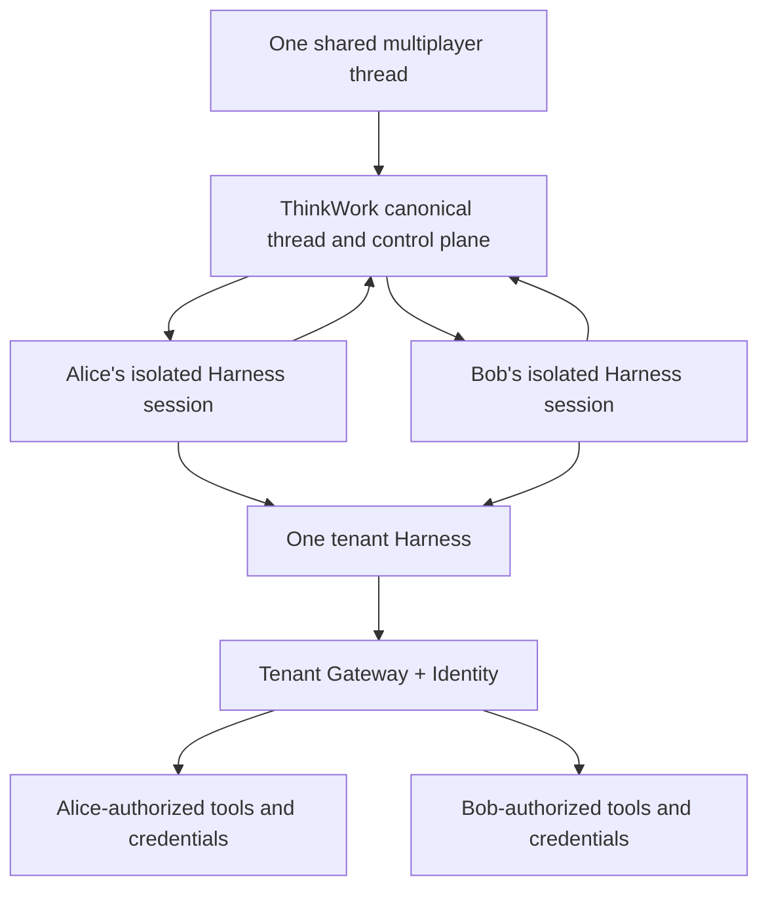

# AgentCore Harness as ThinkWork's Managed Multiplayer Execution Plane

## Problem Frame

THINK-311 proved that AgentCore Harness can execute a real ThinkWork turn and emit a durable artifact, but it did not test the product's defining multiplayer behavior: one visible agent responding with the current message author's configuration, private memory, skills, tools, and credentials while preserving a coherent shared thread.

ThinkWork currently owns the Pi model/tool loop and the operational machinery around it. The proposed direction is to replace that loop with one managed AgentCore Harness per tenant/environment, using isolated participant sessions and server-derived per-invocation configuration. ThinkWork remains authoritative for the logical agent, canonical thread, user and Space context, capability registry, and disclosure policy. AgentCore Gateway + Identity enforce tool access and resolve user-specific downstream credentials.

This brainstorm defines a focused delta proof. It does not repeat the Harness execution and artifact evidence from THINK-311 or attempt full Pi retirement certification. It tests the remaining architectural uncertainty: whether one tenant Harness can preserve a seamless shared-agent experience across participants with different capabilities, without allowing session state, private data, or authorization to bleed between them.

Prose requirements govern if the diagram and text differ.

---

## Actors

- A1. Thread participant: sends a message to the shared agent and expects the response to reflect that participant's authorized configuration without exposing another participant's private context.
- A2. ThinkWork control plane: resolves the tenant, logical agent, thread, Space, author, capabilities, context, and disclosure policy for every turn.
- A3. Tenant Harness: runs the managed model/tool loop while isolating participant sessions.
- A4. AgentCore Gateway + Identity: enforces tool authorization and supplies the correct participant's downstream credentials.
- A5. Canonical thread and memory plane: stores public conversation state and user- or Space-scoped retained context independently of disposable Harness sessions.

---

## Key Flows

- F1. Interleaved multiplayer turns
  - **Trigger:** Alice and Bob alternately address the same logical agent in one thread.
  - **Actors:** A1, A2, A3, A5
  - **Steps:** ThinkWork records each public message; resolves the current author; refreshes that author's isolated session with public events added since its last observed thread revision; invokes the same tenant Harness with the shared agent definition and author-specific context; validates and persists the public response.
  - **Outcome:** Both participants experience one coherent agent, and neither session misses public turns contributed through the other session.
  - **Covered by:** R1, R2, R3, R4, R5

- F2. Use an author-specific private capability
  - **Trigger:** Alice asks the shared agent to perform work that requires Alice's private connector, credential, skill, or memory.
  - **Actors:** A1, A2, A3, A4, A5
  - **Steps:** ThinkWork projects Alice's authorized capability surface; Gateway authorizes each operation; Identity resolves Alice's credential; the Harness produces a task-relevant result; the disclosure boundary either permits the result into the shared thread or requires Alice's confirmation.
  - **Outcome:** The useful result can enter the public conversation without promoting unrelated private source material or intermediate state.
  - **Covered by:** R6, R7, R8, R9, R10, R11

- F3. Reject cross-user capability access
  - **Trigger:** Bob's turn attempts to use a tool, credential, or retained memory granted only to Alice.
  - **Actors:** A1, A2, A3, A4
  - **Steps:** ThinkWork omits the capability from Bob's projected surface; if it is attempted anyway, Gateway denies the operation; Identity does not resolve Alice's credential; the denial is recorded without logging secrets.
  - **Outcome:** Tool visibility and prompt configuration are not treated as the security boundary, and Bob cannot exercise Alice's grants.
  - **Covered by:** R6, R7, R8, R12

- F4. Reconstruct a participant session
  - **Trigger:** A participant's Harness session expires, is deliberately terminated, becomes stale, or is poisoned.
  - **Actors:** A2, A3, A5
  - **Steps:** ThinkWork abandons the session; creates a replacement; hydrates the current public thread state and the participant's authorized private context; resumes the shared conversation without changing the visible agent identity or silently dispatching to Pi.
  - **Outcome:** Required product state is not lost because no Harness session is authoritative.
  - **Covered by:** R2, R3, R4, R13, R14

---

## Requirements

**Shared-agent product model**

- R1. Participants must interact with one stable logical agent identity and voice. Participant-specific sessions, tools, credentials, and memory must remain invisible execution details and must not create persona drift.
- R2. ThinkWork's durable thread ledger must be the authoritative public conversation record. No public message, decision, artifact reference, or required continuation state may exist only in Harness memory.
- R3. Each participant must use an isolated session for a given thread. ThinkWork must not reuse one Harness runtime session across different users.
- R4. Before a participant's turn executes, that participant's session must receive all authorized public thread changes since its last observed revision. A stale session must not overwrite or omit newer public state.
- R5. The focused proof must use one general Harness for the tenant. Logical agents, users, Spaces, and threads must be expressed through invocation configuration and isolated sessions, not additional Harness resources.

**Capabilities, identity, and enforcement**

- R6. ThinkWork must derive the effective model, system instructions, skills, tools, allowed-tool subset, actor identity, and execution limits from trusted server-side state for every turn; end users must not be able to supply or widen these values directly.
- R7. Gateway Policy must make the final authorization decision for governed tool operations. Omitting or narrowing a tool in Harness configuration is behavioral context, not sufficient authorization.
- R8. Identity must preserve stable participant identity and resolve only that participant's authorized downstream credential. A different participant, an ownerless workload, or a mixed tenant/Space/agent tuple must not retrieve or exercise it.
- R9. Different ordinary tool or skill sets must not require separate Harness resources. A second Harness is justified only by an explicit execution or trust profile such as a different IAM role, network boundary, container, filesystem, regulatory boundary, or independently operated workload.

**Memory and disclosure**

- R10. Public thread memory, Space-shared memory, user-private memory, and disposable session working state must remain distinguishable. Retrieval and retention must use the scope appropriate to the information rather than copying all context into every session.
- R11. A participant's request to use private data in a shared thread grants purpose-limited consent to publish task-relevant results. Sensitive, surprising, unrelated, or ambiguously relevant information must require confirmation before it is appended to the public thread.
- R12. Private source material, private intermediate results, raw credentials, authorization tokens, and private memory records must not be promoted to shared memory or exposed in proof telemetry merely because the final response is public.

**Recovery and decision evidence**

- R13. Harness sessions must be treated as reconstructable caches. The proof must demonstrate replacing a terminated or deliberately corrupted session from canonical public state plus the participant's currently authorized private context.
- R14. Every proof turn must either execute on Harness or fail explicitly. Silent Pi fallback is prohibited.
- R15. The proof must run interleaved turns from two distinct users whose effective capabilities and credentials differ, including one permitted operation and the equivalent denied cross-user attempt.
- R16. The proof must record enough redacted evidence to reproduce and judge the result: tenant Harness/version, logical agent and configuration fingerprint, participant/session mapping hashes, shared-thread revisions, Gateway decisions, credential-owner distinction, recovery event, latency, token usage, and cost.
- R17. The proof must end with a written pass/fail verdict. A pass authorizes retirement-certification planning; it does not itself authorize production cutover or Pi deletion.

---

## Acceptance Examples

- AE1. **Covers R1-R5, R15.** Given Alice and Bob share one thread and have separate Harness sessions, when Alice sends a turn, Bob sends a turn, and Alice sends another, every response uses one logical agent identity and Alice's final turn incorporates Bob's intervening public contribution.
- AE2. **Covers R6-R9, R15.** Given Alice is granted a private CRM operation and Bob is not, when Alice requests it, Gateway permits the call and Identity supplies Alice's credential; when Bob attempts the equivalent operation, Gateway denies it and no Alice credential is resolved.
- AE3. **Covers R10-R12.** Given Alice's authorized connector returns task-relevant facts plus unrelated sensitive content, when the shared agent prepares its response, it may publish the relevant facts but must withhold the unrelated content pending confirmation.
- AE4. **Covers R2-R4, R13.** Given Alice's session is terminated after Bob advances the thread, when Alice sends the next turn, ThinkWork reconstructs a new session containing the current public history and Alice's authorized context, and the conversation continues without visible identity change.
- AE5. **Covers R6-R8, R12.** Given a caller supplies a forged actor identifier or a wider tool list, when the turn is dispatched, trusted server resolution replaces or rejects the untrusted values and the caller gains no additional capability.
- AE6. **Covers R14, R16, R17.** Given any proof leg cannot execute on Harness, when the run completes, it reports an explicit failure with redacted diagnostic evidence and does not claim success through Pi fallback.

---

## Success Criteria

- Two participants can use one shared agent in an interleaved thread while receiving their own authorized skills, memory, tools, and credentials without cross-user leakage.
- Shared public context remains coherent across isolated sessions, including after one session is destroyed and reconstructed.
- Gateway + Identity, rather than prompt/tool visibility, demonstrably enforce the participant boundary.
- The proof produces a decisive evidence-backed verdict about whether the architecture should proceed to Pi-retirement certification.
- A subsequent `ce-plan` can define the proof without inventing product identity, memory ownership, disclosure behavior, Harness topology, proof scope, or success criteria.

---

## Scope Boundaries

- Do not repeat THINK-311's general Harness invocation and artifact-emission trial except where a minimal smoke check is needed to detect regression.
- Do not migrate every connector family, Agent Folder, skill, or existing thread.
- Do not certify sub-agent delegation, Browser, Code Interpreter, full workspace reconciliation, or all Pi extensions.
- Do not certify scheduled automation or ownerless/run-as workloads in this focused proof; carry them into retirement certification.
- Do not perform a production cutover, delete Pi, or establish permanent dual-runtime support.
- Do not create Harness resources per user, Space, thread, or logical agent.
- Do not make Harness-owned memory the canonical thread or introduce a second user-visible agent identity.
- Do not treat `allowedTools`, prompts, or client-supplied actor identifiers as authorization controls.

---

## Key Decisions

- One shared agent: the author changes effective private context and authority, not the visible agent identity.
- Contextual consent with sensitivity gates: private capability use in a public thread authorizes only task-relevant disclosure.
- One general Harness per tenant/environment: additional Harnesses represent explicit execution/trust profiles, not ordinary configuration variance.
- Harness replaces Pi after proof and retirement certification: permanent dual-runtime maintenance is not the goal.
- Harness sessions are reconstructable caches: ThinkWork owns canonical public state.
- Focused delta proof: test multiplayer isolation, dynamic capabilities, disclosure, and recovery while reusing THINK-311's prior execution/artifact evidence.

---

## Dependencies / Assumptions

- THINK-311's accepted live evidence remains valid for basic Harness execution and artifact emission.
- THINK-315 supplies or selects the Gateway, Policy, Identity, and stable turn-identity contract needed for the proof.
- THINK-302's capability registry remains the authoritative source for user, Space, role, tool, and operation bindings.
- The existing multiplayer thread ledger can provide an ordered public history and a stable revision or equivalent cursor for session refresh.
- The proof can use two distinct test users with intentionally different grants and credentials in a non-production tenant.

---

## Outstanding Questions

### Resolve Before Planning

- None.

### Deferred to Planning

- [Affects R3, R4, R13][Technical] Define the participant-session key, public-thread revision protocol, refresh payload, and deduplication behavior used during reconstruction.
- [Affects R6-R9][Needs research] Verify the final THINK-315 turn-identity contract and which Harness/Gateway invocation fields are trustworthy, forwarded, or application-enforced.
- [Affects R9][Needs research] Confirm tenant-Harness quotas, provisioning lifecycle, version/endpoint rollout behavior, and the minimum execution-role boundary.
- [Affects R11, R12][Technical] Identify the smallest deterministic disclosure contract that can be evaluated without relying exclusively on model self-policing.
- [Affects R13][Technical] Choose a safe way to terminate or corrupt a proof session without creating unrecoverable external side effects.
- [Affects R16][Technical] Reuse existing turn diagnostics and cost records where possible and define the redaction-safe evidence bundle.

---

## Next Steps

-> `/ce-plan` for structured implementation planning
