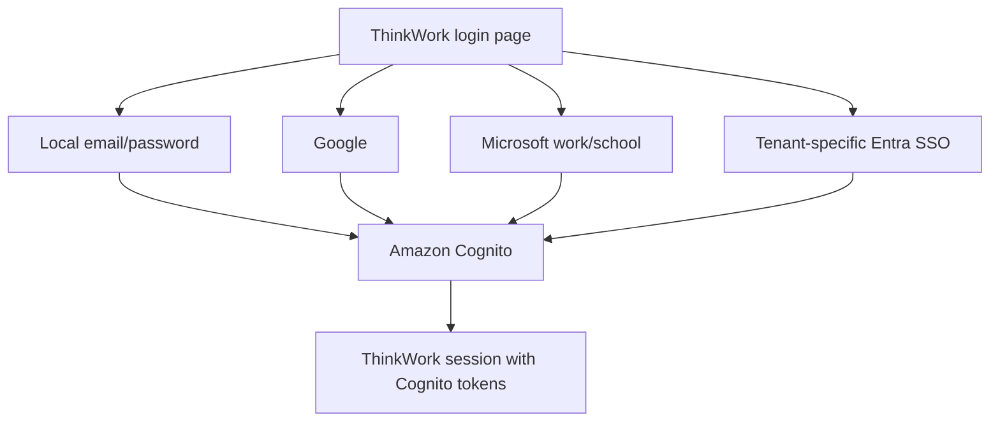

# AWS-Native Cognito Federation and WorkOS Removal

## Problem Frame

ThinkWork currently uses WorkOS as an authentication broker upstream of
Cognito, then bridges the verified WorkOS identity back into Cognito so the
rest of the platform can continue using Cognito-issued tokens. That design met
the token-compatibility requirement, but it introduced a second authentication
control plane spanning plugin configuration, public login publication, custom
auth challenges, bridge and session records, provider-specific callbacks, and
special logout behavior.

ThinkWork needs a smaller AWS-native authentication model. End users must be
able to sign in with local Cognito email/password, Google, or Microsoft
work/school accounts. Enterprise deployments must also be able to configure a
tenant-specific Microsoft Entra OIDC connection. Cognito remains the only
issuer trusted by ThinkWork clients and APIs; direct federation replaces the
WorkOS broker and custom token bridge.

This document supersedes the desired end state in
`docs/brainstorms/2026-06-18-thnk-43-workos-auth-plugin-requirements.md` but
does not rewrite that document, which remains historical context for why the
WorkOS path was built.

The prose requirements below are authoritative. A deployment exposes only the
login options allowed by its tenant authentication policy; it does not
necessarily show all four branches.

---

## Actors

- A1. End user: Signs in through an authentication option allowed by the current deployment or tenant host.
- A2. Tenant administrator: Chooses which successfully configured authentication options are visible for the tenant.
- A3. ThinkWork operator: Configures, verifies, activates, rotates, and retires Google or Microsoft/Entra federation through the deployment workflow.
- A4. ThinkWork platform: Uses Cognito as the federation boundary and final token issuer, then resolves the authenticated principal to an active ThinkWork membership.
- A5. External identity provider: Google or Microsoft Entra authenticates the upstream identity and returns control to Cognito.

---

## Key Flows

- F1. Local Cognito sign-in
  - **Trigger:** A1 chooses email/password on a host where local sign-in is enabled.
  - **Actors:** A1, A4
  - **Steps:** The user submits Cognito credentials, completes any required password challenge, and receives the existing Cognito-backed ThinkWork session.
  - **Outcome:** Local sign-in continues without WorkOS or an external provider.
  - **Covered by:** R1, R6, R15

- F2. Direct Google or general Microsoft sign-in
  - **Trigger:** A1 selects Google or Microsoft on a host where that option is enabled.
  - **Actors:** A1, A4, A5
  - **Steps:** ThinkWork starts the selected provider through Cognito; Google or Entra authenticates the user; Cognito completes federation and returns its authorization result; ThinkWork stores the Cognito-issued session and resolves the user's membership.
  - **Outcome:** The user enters ThinkWork with Cognito tokens and no WorkOS session or custom token bridge.
  - **Covered by:** R2, R3, R6, R7, R8, R15

- F3. Tenant-specific Entra SSO
  - **Trigger:** A1 chooses enterprise SSO on a tenant host with an active Entra connection.
  - **Actors:** A1, A2, A3, A4, A5
  - **Steps:** The host resolves to one approved tenant-specific Entra OIDC connection; Cognito sends the user to that Entra tenant; ThinkWork accepts the resulting identity only when its directory and membership bindings are valid; generic Microsoft is hidden on that host by default.
  - **Outcome:** The enterprise user enters the correct ThinkWork tenant through a customer-specific trust relationship and a Cognito-issued session.
  - **Covered by:** R4, R5, R8, R9, R10, R11, R12

- F4. Existing-user migration
  - **Trigger:** An existing WorkOS-authenticated user signs in through the replacement provider during the cutover.
  - **Actors:** A1, A3, A4
  - **Steps:** ThinkWork evaluates the replacement identity against existing verified identity and membership evidence; an unambiguous match resolves to the existing ThinkWork principal; ambiguous or conflicting evidence fails closed for operator review.
  - **Outcome:** The user retains the same ThinkWork identity, memberships, and workspace access without duplicate-account creation.
  - **Covered by:** R7, R8, R9, R10, R17

- F5. Logout and account switching
  - **Trigger:** A1 logs out of ThinkWork and later starts another sign-in.
  - **Actors:** A1, A4, A5
  - **Steps:** ThinkWork ends the local and Cognito application session; the next provider sign-in requires a fresh provider/account-selection step; ThinkWork does not promise to end the user's global Google or Microsoft session.
  - **Outcome:** The previous ThinkWork session cannot be silently restored, while the scope of upstream logout remains explicit.
  - **Covered by:** R15, R16

---

## Requirements

**Supported authentication modes**

- R1. The first release must preserve local Cognito email/password sign-in as an independently configurable login option.
- R2. The first release must support direct Google OAuth/OpenID Connect federation through Cognito without WorkOS in the browser or token path.
- R3. The first release must support general Microsoft OpenID Connect login for work/school accounts only; personal Microsoft accounts are not accepted.
- R4. The first release must support at least one tenant-specific Microsoft Entra OIDC connection independently of the general Microsoft login.
- R5. Tenant authentication policy must control which valid options appear. When tenant-specific Entra SSO is active, it replaces general Microsoft on that tenant's host by default; Google and local password remain independently configurable.
- R6. Every successful authentication mode must produce the same Cognito-issued token contract already trusted by ThinkWork web, mobile, desktop, CLI, API Gateway, AppSync, and runtime integrations. ThinkWork must not accept WorkOS or upstream-provider tokens as application sessions.

**Identity and tenant safety**

- R7. An existing WorkOS-authenticated user who signs in through an approved replacement provider must resolve to the same ThinkWork user and retain existing active tenant memberships; the migration must not require re-invitation or create a duplicate usable account.
- R8. Authentication proves an external identity, but workspace access requires a resolved ThinkWork user and active tenant membership. A successful Cognito token alone must not grant a workspace.
- R9. Tenant-specific Entra admission must validate an approved Entra directory identity, such as the configured tenant identifier and issuer. Email address or email domain alone must not establish tenant authorization.
- R10. Identity links with missing, unverified, ambiguous, or conflicting evidence must fail closed and remain unavailable until safely resolved; they must never silently overwrite an existing principal binding.

**Connection onboarding and publication**

- R11. Tenant-specific Entra OIDC onboarding in the first release must be operator-assisted through the normal ThinkWork CLI/Terraform deployment workflow, not through an AWS-console-only procedure or tenant-admin self-service UI.
- R12. A provider option must remain hidden until its trust configuration, required claims, Cognito attachment, callback behavior, and final Cognito token result have been validated for every supported client that will expose it.
- R13. Provider credentials and other secret material must remain in approved server-side AWS secret/configuration systems and must never appear in public runtime configuration, client bundles, requirements artifacts, or operator output.
- R14. Failed, incomplete, or drifting provider configuration must fail closed for end users while exposing actionable status to authorized operators.

**Sessions and client compatibility**

- R15. Direct federated sign-in must use the existing Cognito session lifecycle for token exchange, storage, refresh, and application authorization across supported clients.
- R16. Logout must end the local ThinkWork session and Cognito application session and require fresh provider/account selection before another ThinkWork session is established. The feature does not promise global logout from Google or Microsoft.

**Migration and WorkOS retirement**

- R17. Native providers must be introduced through a reversible cutover that can verify existing-user continuity, tenant isolation, refresh, logout/account switching, and client callbacks before WorkOS login publication is disabled.
- R18. WorkOS removal is complete only when no supported login depends on WorkOS configuration, browser sessions, API routes, custom-auth bridging, bridge/session persistence, plugin publication, WorkOS secrets, or WorkOS-specific client behavior.

---

## Acceptance Examples

- AE1. **Covers R1, R2, R3, R5.** Given a standard deployment with local password, Google, and general Microsoft enabled, when a user opens its login page, those three options appear and no enterprise SSO option is shown.
- AE2. **Covers R4, R5, R12.** Given a tenant host with a verified Entra OIDC connection and policy enabling local password, Google, and enterprise SSO, when a user opens its login page, enterprise SSO is shown and general Microsoft is hidden.
- AE3. **Covers R2, R3, R4, R6, R15.** Given a user completes Google, general Microsoft, or tenant-specific Entra sign-in, when authentication returns to ThinkWork, the stored application session contains Cognito-issued tokens and uses the existing Cognito refresh path.
- AE4. **Covers R7, R8, R10, R17.** Given an existing WorkOS-authenticated user has an unambiguous approved replacement identity, when the user first signs in through the native provider, the same ThinkWork user and active memberships are used and no second usable account is created.
- AE5. **Covers R8, R9, R10.** Given a valid Microsoft account from an unapproved Entra directory attempts tenant-specific SSO, when authentication completes upstream, ThinkWork grants no tenant workspace access even if the email domain resembles an approved domain.
- AE6. **Covers R12, R14.** Given an Entra connection is missing required claims or fails validation, when an end user loads the tenant login page, the enterprise SSO option is hidden while an authorized operator can see why activation is blocked.
- AE7. **Covers R16.** Given a user logs out and starts sign-in again in the same browser profile, when the provider flow begins, the prior ThinkWork session is not silently restored and the user reaches a fresh provider/account-selection step.
- AE8. **Covers R17, R18.** Given all native provider and migration checks pass and WorkOS sessions are no longer needed, when the retirement completes, local password, Google, general Microsoft, and tenant-specific Entra sign-in still work without any WorkOS runtime or configuration dependency.
- AE9. **Covers R11, R12, R13, R14.** Given an operator has valid customer-controlled Entra configuration, when the operator runs the supported onboarding workflow, secret values remain server-side, validation produces actionable status, and the enterprise SSO option becomes visible only after the connection passes its required checks.

---

## Success Criteria

- End users can sign in with every authentication mode allowed by their tenant policy without encountering WorkOS UI, sessions, or errors.
- Existing WorkOS-authenticated users retain their ThinkWork identity and workspace memberships after switching to an approved native provider.
- A tenant-specific Entra connection cannot authenticate a user into the wrong ThinkWork tenant, including users with plausible but unauthorized email domains.
- Operators can configure and verify the first tenant-specific Entra OIDC connection through the normal ThinkWork deployment workflow without manual AWS-console mutation.
- Web, mobile, desktop, and CLI flows that expose a provider complete authentication, refresh, logout, and account-switch checks with Cognito-issued tokens.
- Repository and deployed-state verification find no supported authentication dependency on WorkOS after retirement.
- Planning can derive implementation work directly from these requirements without deciding authentication modes, login-page policy, Microsoft audience, SSO protocol preference, identity-continuity guarantees, onboarding ownership, or logout semantics.

---

## Scope Boundaries

- Microsoft personal accounts are excluded; the general Microsoft option accepts work/school accounts only.
- SAML enterprise federation is deferred. Entra OIDC is the first-release enterprise protocol; SAML may be added later for customers with a demonstrated requirement.
- Tenant-admin self-service SSO onboarding is deferred. The first release is operator-assisted through CLI/Terraform.
- ThinkWork will not build a general-purpose identity-provider marketplace, hosted connection portal, or replacement authentication broker as part of this work.
- Global logout from Google or Microsoft is outside the feature promise.
- The work does not migrate local Cognito password users to an external provider or remove local password authentication.
- The work does not accept Google, Microsoft, Entra, or WorkOS tokens directly in ThinkWork APIs.
- The work does not introduce a user-pool-per-enterprise topology or require clients and APIs to trust multiple Cognito issuers.
- The work does not infer tenant authorization from email domain alone.

---

## Key Decisions

- Create a fresh replacement requirements document: preserve the THNK-43 WorkOS requirements as historical context instead of rewriting them.
- Extend existing Cognito federation: use Cognito's built-in Google support and generic OIDC support rather than adding another broker or token bridge.
- Separate general and enterprise Microsoft trust: use a shared work/school Microsoft option plus customer-specific Entra OIDC connections, with generic Microsoft hidden by default on enterprise SSO hosts.
- Prefer OIDC and defer SAML: support the common Entra path first and add certificate/metadata lifecycle only when a customer requirement justifies it.
- Keep onboarding operator-assisted: recover the necessary connection-setup capability through the existing deployment workflow without recreating WorkOS self-service.
- Preserve application identity: migration success means the same ThinkWork user and memberships, not merely another valid Cognito token.
- Define bounded logout semantics: terminate ThinkWork/Cognito application sessions and require fresh selection without claiming global provider logout.

---

## Dependencies / Assumptions

- The existing Cognito foundation module's Google and generic OIDC provider capabilities remain the supported AWS-native substrate.
- The general Microsoft application registration can use the Entra work/school audience, while tenant-specific enterprise connections can use customer-specific Entra issuers and credentials.
- Existing ThinkWork user and membership data contain enough verified evidence to identify or explicitly review current WorkOS-authenticated users during migration.
- Every supported client can use a provider-neutral Cognito authorization-code flow while retaining its platform-appropriate callback and secure token storage behavior.
- Operators can obtain the customer-controlled Entra information and consent needed to configure and test a tenant-specific OIDC connection.
- WorkOS remains available only for the bounded migration and rollback window, after which its runtime and secrets can be retired.

---

## Outstanding Questions

### Deferred to Planning

- [Affects R7, R10, R17][Technical] What exact inventory and linking procedure safely preserves each existing WorkOS-authenticated Cognito/ThinkWork principal during cutover?
- [Affects R5, R12, R14][Technical] Should the public-safe provider catalog be generated into deployment runtime configuration or resolved from a provider-neutral authenticated control-plane record?
- [Affects R9][Needs research] Which Entra claims and Cognito mappings provide the strongest tenant-specific issuer, directory, and subject evidence for both first and returning sign-ins?
- [Affects R12, R15, R16][Technical] What shared conformance matrix and provider/account-selection behavior can be automated across web, mobile, desktop, and CLI?
- [Affects R17, R18][Technical] What rollout, session-drain, schema-retirement, and rollback sequence removes WorkOS without stranding active users?

---

## Next Steps

-> `ce-plan` for structured implementation planning.
