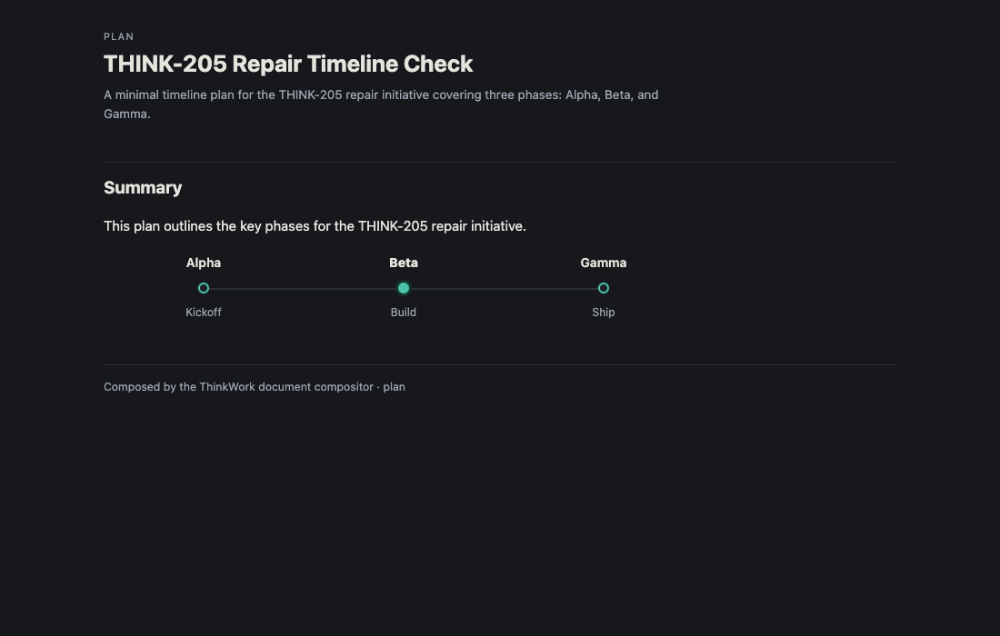
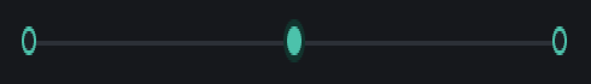
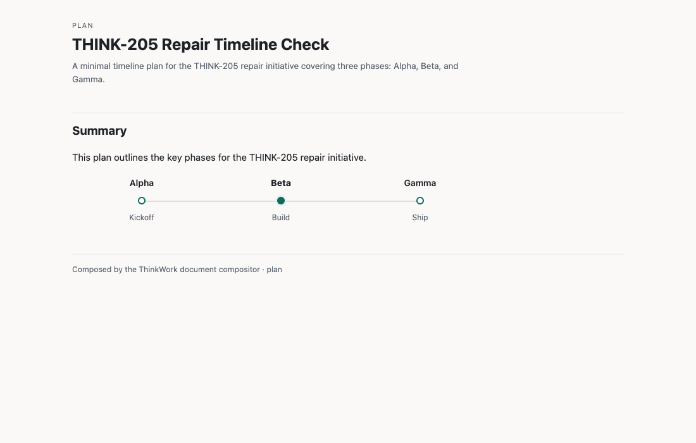
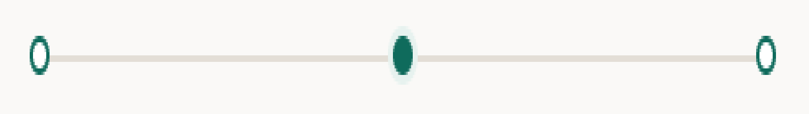
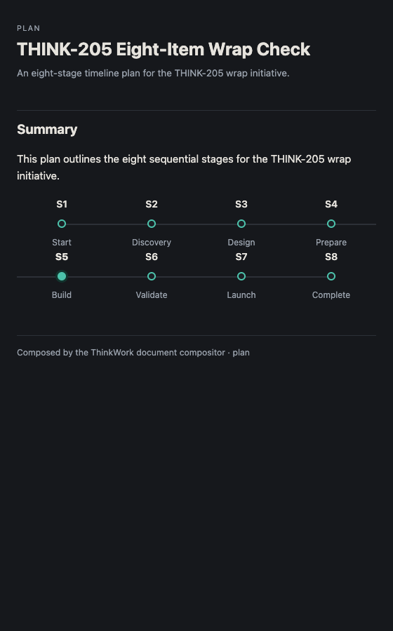
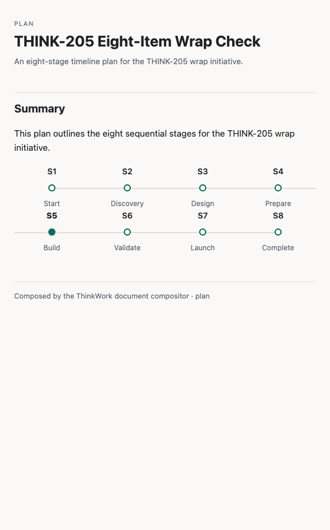

# THINK-205 repair re-verify — `tw:timeline` track continuity

**Verdict: PASS** — the track renders as one continuous line per row on freshly composed post-deploy documents, in light and dark, with zero dead space between adjacent dots.

Scope: repair-only re-verify of Eric's Verification FAILED finding (track gaps). PR [#3464](https://github.com/thinkwork-ai/thinkwork/pull/3464) (merge `62e68e711`) shipped one line of house CSS; the broader U1 contract was exercised in the prior round and is not re-run here.

Method: deployed dev (https://app.thinkwork.ai), real browser (agent-browser, Cognito refresh-grant auth). Documents were **freshly composed after the deploy** (thread `ac7cd2b0-8871-4e1b-85e3-e2defe914b52`, model Kimi K2.5), never re-opened from pre-deploy artifacts. Each artifact's `srcdoc` was extracted and confirmed to embed the **fixed** CSS before rendering; geometry was measured in-page (dot centers + resolved `::before` segment extents) and the track band was screenshotted and magnified 6× to scrutinize the pixels between adjacent dots.

## Resume checkpoint — matrix

| # | QA step | Functional | Experiential | Evidence |
|---|---------|-----------|--------------|----------|
| 1 | 3-item timeline, one `current` — continuous line, light | **PASS** | **PASS** | `3item-light.png`, `3item-light-zoom.png`; gaps Alpha→Beta 0px, Beta→Gamma 0px |
| 1 | 3-item timeline — continuous line, dark | **PASS** | **PASS** | `3item-dark.png`, `3item-dark-zoom.png`; same 0px gaps |
| 2 | 8-item wrap at ~560px — each row edge-to-edge, no clip/overlap, light+dark | **PASS** | **PASS** | `8item-dark.png`, `8item-light.png`; all intra-row gaps 0px; 2 rows of 4 |
| 3 | End-trim — no line left of first dot / right of last dot | **PASS** | **PASS** | `::before` `left:50%`/`right:50%` on first/last; measured beforeL=104px (Alpha), beforeR=104px (Gamma) |
| 4 | Current emphasis — filled dot + soft ring + bolder label | **PASS** | **PASS** | Beta / S5 filled+ring, label font-weight 800 vs 600 siblings |
| — | srcdoc carries fixed CSS (recompose, not re-open) | **PASS** | — | both srcdocs contain `.t-track::before{...left:-6px;right:-6px...}` |
| — | Deploy run 28835360661 overall success | **PASS** | — | `conclusion: success`, headBranch main |

## The fix, and why the pixels are now clean

`.timeline .t-item` carries `padding:0 6px`; the track connector is `.t-track::before`. Pre-fix it was `left:0;right:0`, so each segment spanned only the item's content box and stopped 6px short of the item border on each side — 12px of dead space flanking every dot. The fix extends the segment to `left:-6px;right:-6px`, exactly covering the padding, so a segment now spans the item's full border-box. Adjacent flex items are flush (no column-gap), so segment[i].right == item boundary == segment[i+1].left — they meet with no gap. The `:first-child{left:50%}` / `:last-child{right:50%}` overrides are untouched, preserving the end-trim.

Measured geometry (3-item, standalone render of the extracted srcdoc):

```
Alpha  seg 224→334  (beforeL 104px = first-child 50% trim; starts at dot center 224)
Beta   seg 334→554  (full border-box, current)
Gamma  seg 554→664  (beforeR 104px = last-child 50% trim; ends at dot center 664)
gaps:  Alpha→Beta 0px,  Beta→Gamma 0px
```

8-item at 560px wraps to two rows (S1–S4 / S5–S8); every intra-row adjacent gap measured 0px. The trailing segment past S4 and leading segment before S5 are the accepted KTD1 wrap half-segments (S4/S5 are not `:first/:last-child`), not defects.

## Evidence

3-item, dark (continuous Alpha→Gamma, Beta current filled+ring+bold):



3-item, dark — track band magnified 6× (line unbroken through all three dots, no dead space):



3-item, light + magnified band:




8-item wrap at 560px, dark and light (two continuous rows, S5 current, no clip/overlap):




## Verdict

**PASS.** The reported track gaps are gone on freshly composed post-deploy documents. Adjacent segments meet at exactly 0px in every measured pair, in light and dark, single-row and wrapped; end-trim and current-item emphasis are intact. The Verification Failed label can be removed and THINK-205 moved to Done.
