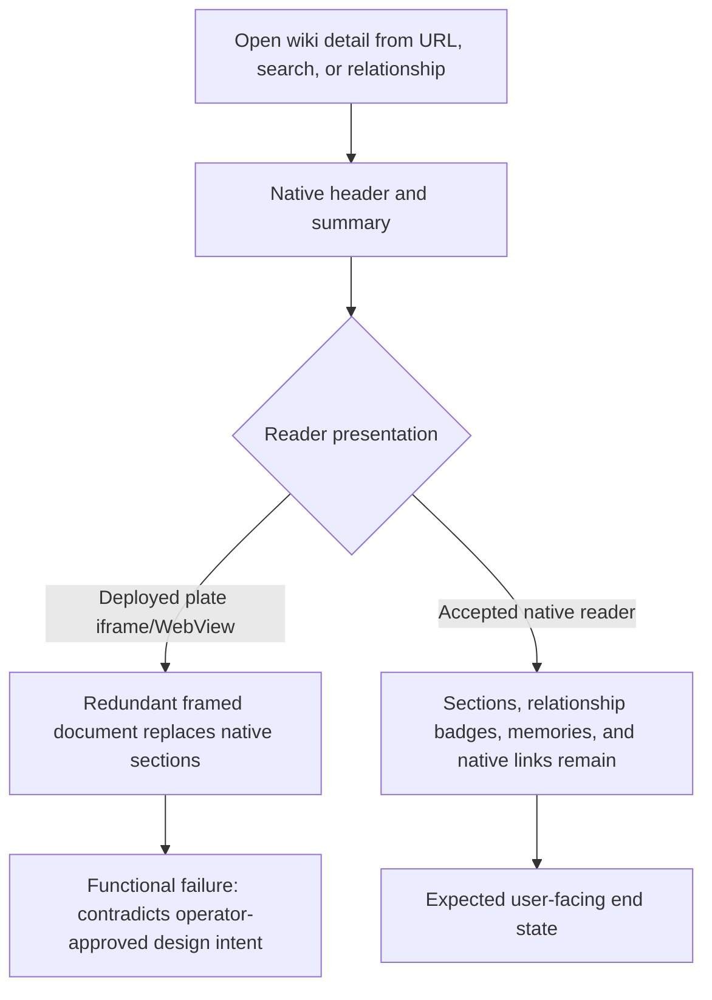
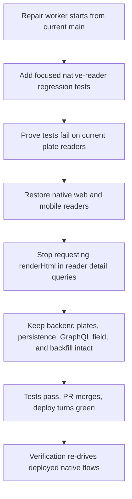
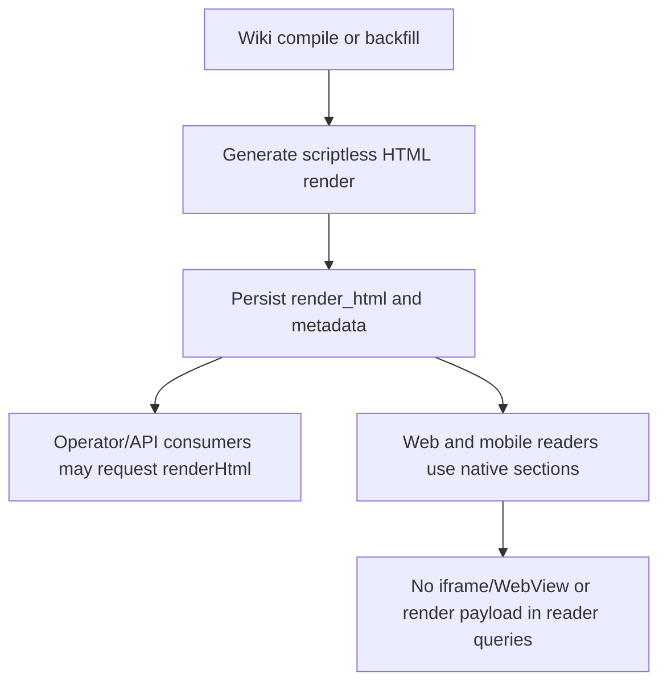

# Dogfood Report — THINK-270 Wiki HTML Plate Style

> Diff-scoped verification of the assembled THINK-270 outcome on 2026-07-13.

## Diff Summary

- PR #3674 (`1f3067d98`) added three non-emittable wiki plate definitions, tenant-palette layering, and an opt-in compositor policy that preserves only normalized `/wiki/{entity|topic|decision}/<slug>` links.
- PRs #3673 and #3681 (`4c54152c3`, `9f5cea81f`) persisted nullable HTML renders on `wiki.pages`, regenerated them at the canonical section-write seam, exposed `WikiPage.renderHtml` detail-only, and added the operator backfill.
- PR #3672 (`2ba6d70e7`) replaced the web reader's native sections region with a `DocumentFrame` when `renderHtml` is present. PR #3671 (`f12244f5a`) made the equivalent mobile change with a scriptless WebView and native wiki-link interception.
- All five implementation commits merged to `main`; their post-merge Deploy evidence was green and canary.353 put the web reader on dev.
- During operator validation, the plate reader was rejected as redundant and less useful than the native knowledge-page presentation. The accepted product direction now restores native web/mobile readers while retaining backend render generation and storage.
- The repair is locally scoped on `codex/think-270-restore-native-wiki` (10 files, 65 insertions, 555 deletions), but at this verdict it is uncommitted, has no PR, is not merged, and is not deployed.

## Personas

No `STRATEGY.md`, `VISION.md`, or persona document is present; these personas are inferred from the product and changed flows.

- **Knowledge worker** — needs compiled organizational knowledge to remain scannable, connected, and consistent with the native wiki information architecture.
- **Enterprise operator** — needs derived render generation to remain available without paying a 256 KiB detail-query cost or replacing useful native relationships, sections, and controls.

## Flows Tested

## Test Matrix & Results

| # | Flow | Journey / Scenario | Functional | Experiential | Status | Evidence |
|---|------|--------------------|------------|---------------|--------|----------|
| 1 | Contract reconciliation | Open a rendered wiki detail page and judge the plate reader against the latest operator-approved design intent | **Fail** | **Fail** | Fail | Operator validation rejected the plate as redundant and less useful than the native wiki presentation; deployed canary.353 still carries PRs #3671/#3672 |
| 2 | Web native reader | A page with `renderHtml` must still show native sections, relationships, memories, header, and summary, with no wiki iframe | **Fail on deployed main** | **Fail on deployed main** | Fail | Current main mounts `DocumentFrame`; local repair evidence shows `document-frame` count 0 plus `Overview` and `Relationships`, but it is uncommitted and undeployed |
| 3 | Mobile native reader | A page with `renderHtml` must still use native Markdown sections and native link handling, with no wiki WebView | **Fail on deployed main** | **Fail on deployed main** | Fail | Current main uses the plate WebView; local repair removes the WebView/request policy and reports 279/279 mobile tests green, but it is uncommitted and undeployed |
| 4 | Reader payload | Web/mobile detail queries do not request the unused `renderHtml` payload | **Fail on deployed main** | Pass | Fail | Both merged reader queries request `renderHtml`; local repair removes those selections but is not merged |
| 5 | Backend preservation | Compile/backfill still generates and persists scriptless HTML renders; GraphQL can expose them to explicit consumers | Pass | Pass | Pass | THINK-272/273 merged verification: 1,683/1,683 dev pages rendered, 0 NULL, 0 `<script>`, max 11,119 B; the scoped repair leaves backend code untouched |
| 6 | Native in-wiki navigation | Native section links continue to route to `/wiki/<type>/<slug>` on web/mobile | Not re-proven on deployed repair | Not re-proven | Skipped | Repair is not merged or deployed; next Verification pass must follow both clients to the destination |
| 7 | Adjacent artifacts | Document artifact reader retains zero-grant sandbox and no `<base>` tag | Pass in local repair tests | Pass | Pass | Operator evidence reports 12/12 focused web tests green; repair restores `DocumentFrame` to artifact-only behavior |
| 8 | Theme and responsiveness | Native web/mobile readers remain readable in light/dark and narrow/desktop layouts | Not re-proven on deployed repair | Not re-proven | Skipped | Requires the repair PR to merge and deploy before a meaningful browser/device verdict |
| 9 | Console and network | Re-drive native reader journeys with no new console errors or failed requests | Not re-proven on deployed repair | Not re-proven | Skipped | Existing headless session remains at the Google password challenge; this does not change the product failure verdict |
| 10 | Deploy gate | Repair PR merged, post-merge Deploy green, then freshly deployed web/mobile behavior verified | Fail | Fail | Fail | No repair PR, merge, or deployment exists at this verdict |

`Fail` is used in this report because the verification contract explicitly requires a failure verdict and repair rebound when the shipped result contradicts design intent.

## What Was Fixed

None. This verification worker is a judge and did not change product code.

The smallest correct repair is already bounded: restore native web/mobile wiki readers, remove `renderHtml` from their detail queries, delete the wiki-only frame/request-policy surface, and retain the backend plate definitions, persistence, `WikiPage.renderHtml`, and backfill.

The repair worker must add focused regressions that are demonstrably red on current `main` and green after the repair:

- Web: when a page carries `renderHtml`, native `Overview`/relationship content renders and `document-frame` is absent.
- Mobile: when a page carries `renderHtml`, native Markdown sections render, native wiki-link routing remains active, and no wiki WebView is mounted.

## Paper Cuts (by persona)

- **Knowledge worker** — the framed plate duplicates the page's purpose while hiding the more useful native section/relationship presentation — severe — promoted to functional failure by the operator's design decision.
- **Enterprise operator** — reader detail queries fetch an unused payload up to 256 KiB once the native presentation is restored — moderate — included in the repair scope.

## Console Errors

No new console-error verdict was claimed. The prior headless browser session remains stopped at the Google password challenge. Operator local validation reached the authenticated page and found the intended native layout, but the repair must still be independently re-driven after merge and deployment.

## Human Verifications

The human product judgment is complete: restore native readers and retain backend render generation/storage. No further design answer is required.

Authentication is not the blocker for this verdict. The observable blocker is that the accepted repair has not entered the PR/merge/deploy path.

## Decisions for a Human

None. The operator already made the product decision and the repair is small, bounded, reversible, and well understood.

## Learnings

- Passing an implementation checklist does not override an operator's experience verdict; a render that contradicts accepted design intent is a functional failure.
- Derived render generation and reader presentation are separable. Keeping backend HTML plates does not require web/mobile detail readers to fetch or display them.
- Parent verification must reconcile the newest issue history before executing an older handoff; the operator decision at 21:52Z superseded the plate-reader QA brief.

## Final Status

**FAIL — return THINK-270 to Ready to Work.** The currently deployed plate readers contradict the operator-approved native wiki experience. The smallest repair is locally understood and has supporting test evidence, but it is not committed, reviewed, merged, deployed, or independently verified. Preserve `Claude` and `LFG`, add `Verification Failed`, and require the repair worker to ship red-before/green-after regressions before the next Verification pass.
