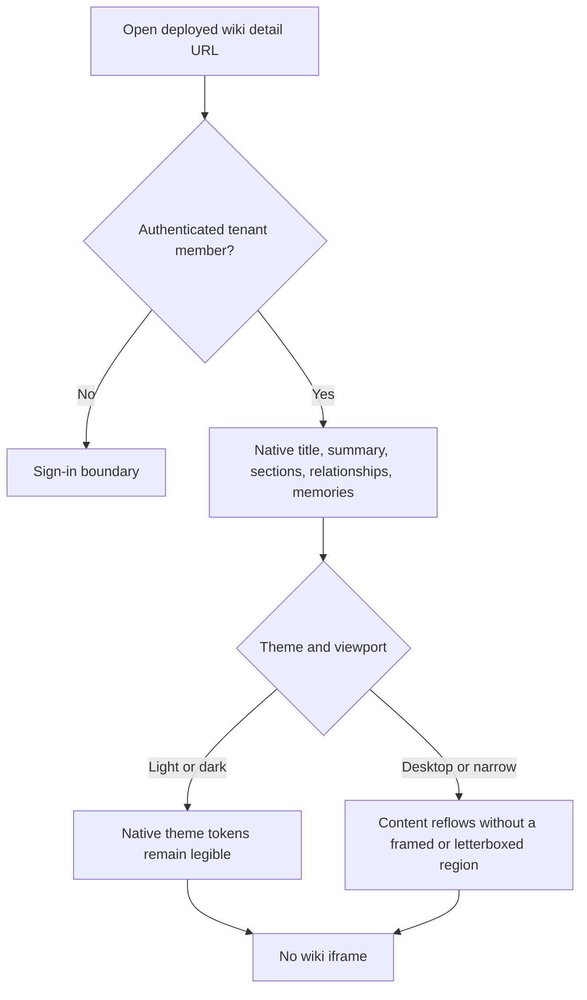
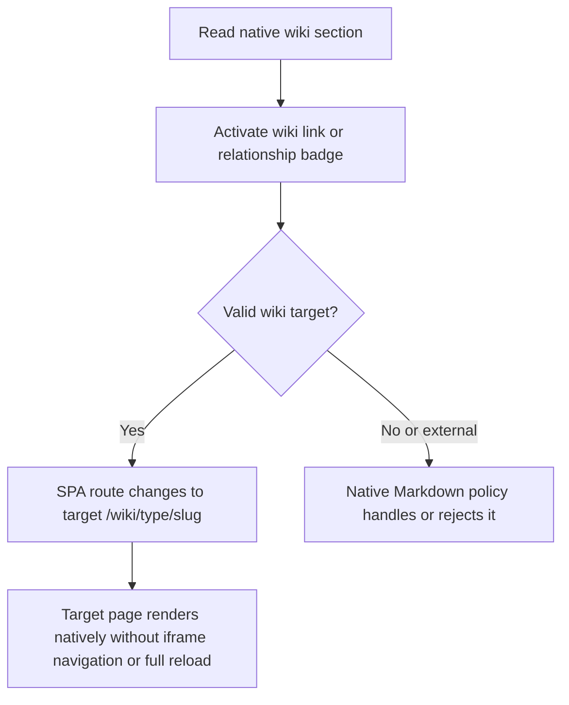
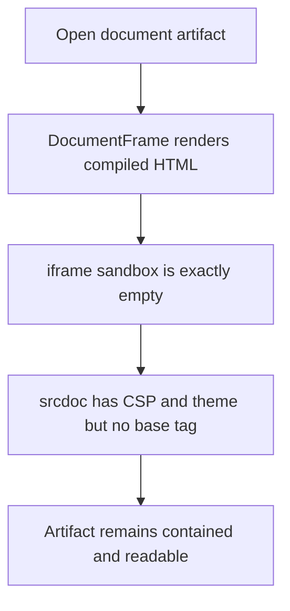
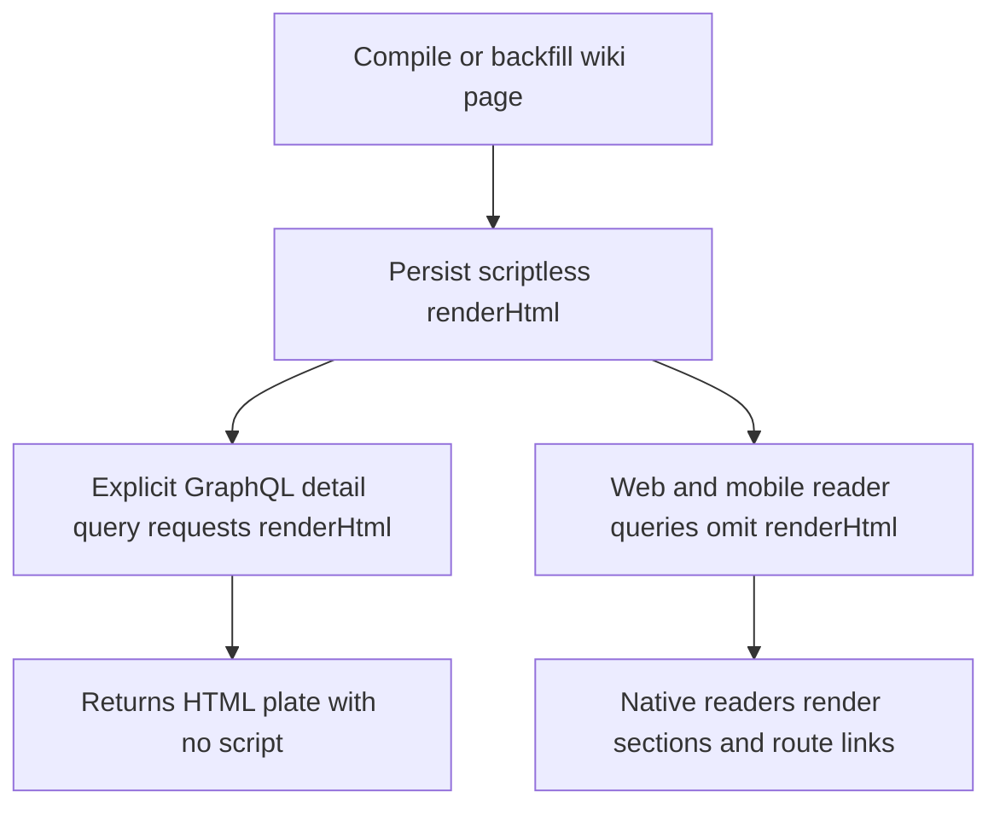
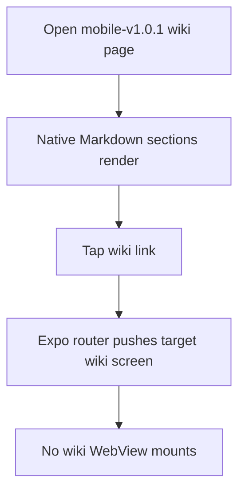

# Dogfood Report — THINK-270 Wiki HTML Plate Style (repair verification)

> Diff-scoped browser QA of repaired `main` after PRs #3714 and #3716 on 2026-07-13.

## Diff Summary

- PR #3714 (`0dcd44946`) restores the web wiki detail route to native structured sections, relationship badges, related memories, and native link handling; it removes the wiki-only `DocumentFrame` navigation variant and stops the web detail query from selecting `renderHtml`.
- The same repair restores the mobile wiki screen to native Markdown sections and native Expo routing, removes the wiki-only WebView/request-policy surface, and stops the React Native SDK detail query from selecting `renderHtml`.
- Document artifacts retain the scriptless zero-grant iframe (`sandbox=""`) and no `<base>` tag. Backend wiki plates, render persistence, compilation/backfill, and explicit GraphQL `WikiPage.renderHtml` access remain intact.
- PR #3716 (`9e9991aae`) adds the mobile native-reader regression tripwire. Its five assertions fail 3/5 on pre-repair main and pass 5/5 after #3714; the post-repair mobile suite passed 284/284.
- Both PRs target and merged to `main`. Deploy run 29290733436 succeeded at the repair commit; web/desktop canary.356 and mobile `mobile-v1.0.1` release workflows also succeeded.

## Personas

No `STRATEGY.md`, `VISION.md`, or persona document is present; these personas are inferred from the product and changed flows.

- **Knowledge worker** — needs organizational knowledge to remain scannable, connected, responsive, and consistent with the native wiki information architecture.
- **Enterprise operator** — needs compiled HTML to remain available to explicit consumers without forcing a redundant reader, weakening artifact containment, or paying the reader-side 256 KiB payload cost.

## Flows Tested

## Test Matrix & Results

| #   | Flow                            | Journey / Scenario                                                                                                                             | Functional | Experiential | Status  | Evidence                                                                                                                                                                                                                                                    |
| --- | ------------------------------- | ---------------------------------------------------------------------------------------------------------------------------------------------- | ---------- | ------------ | ------- | ----------------------------------------------------------------------------------------------------------------------------------------------------------------------------------------------------------------------------------------------------------- |
| 1   | Release gate                    | Confirm repair PRs merged to `main`, repair Deploy green, and canary.356/mobile-v1.0.1 released                                                | **Pass**   | **Pass**     | Pass    | PRs #3714/#3716 merged; Deploy 29290733436 green at `0dcd44946`; runtime config reports dev `v0.1.0-canary.356` issued 22:50:49Z; release workflows 29290764095/29290764399 green                                                                           |
| 2   | Native web reader               | Open `/wiki/entity/chef-nicolas-rondelli`; native Overview/Relationships/sections/memories render and wiki iframe count is zero                | **Pass**   | **Pass**     | Pass    | URL/title asserted; `Overview` + `Relationships` + memories visible; `iframe=0`, `document-frame=0`; [desktop dark screenshot](evidence-THINK-270-repair/web-native-desktop-light.png)                                                                      |
| 3   | Theme + responsive              | Toggle light/dark, then exercise desktop and narrow widths; native layout tracks tokens and has no framed/letterboxed region or overflow       | **Pass**   | **Pass**     | Pass    | Dark + light at 1440×900, light at 700×900; `scrollWidth == clientWidth`, iframe count 0; [desktop light](evidence-THINK-270-repair/web-native-desktop-light-theme.png), [narrow light](evidence-THINK-270-repair/web-native-narrow-light.png)              |
| 4   | Native wiki navigation          | Activate an in-body wiki link or relationship badge and follow the SPA journey to the native target page without full reload/iframe navigation | **Fail**   | **Fail**     | Fail    | Known graph edge `Restaurant Gastronomique Les Pêcheurs → Chef Nicolas Rondelli`; both badges are disabled, no `/wiki/` anchors exist, click leaves URL unchanged; [annotated evidence](evidence-THINK-270-repair/web-navigation-disabled-known-target.png) |
| 5   | Artifact containment regression | Open a document artifact; iframe `sandbox=""`, CSP present, no `<base>` tag, artifact remains readable                                         | Not run    | Not run      | Skipped | Fix-loop governor stopped product execution at S4's functional failure; retain as repair re-verification scenario                                                                                                                                           |
| 6   | Web console + network           | Re-drive wiki route with no console/page errors or failed relevant requests; detail GraphQL payload omits `renderHtml`                         | **Pass**   | **Pass**     | Pass    | `agent-browser errors` and console empty; five captured `ComputerWikiPage` payloads omit `renderHtml`; completed relevant GraphQL requests returned 200                                                                                                     |
| 7   | Backend preservation            | Explicitly query deployed `wikiPage.renderHtml`; verify persisted compiled HTML is present, scriptless, and below the cap                      | Not run    | Not run      | Skipped | Fix-loop governor stopped product execution at S4; prior child verification remains corroboration, not this run's verdict                                                                                                                                   |
| 8   | Mobile native reader            | On released mobile-v1.0.1, open a wiki page, observe native Markdown, tap a wiki link to the native target, and confirm no WebView             | Not run    | Not run      | Skipped | Fix-loop governor stopped product execution at S4; retain as repair re-verification scenario                                                                                                                                                                |
| 9   | Automated regression suite      | Re-run focused post-repair web/mobile regressions on current main                                                                              | Not run    | Not run      | Skipped | Repair needs a new red-before/green-after navigation regression before suite replay                                                                                                                                                                         |

### Scenario evidence

#### S1 — release gate — PASS

- PR #3714 merged as `0dcd44946531caaf527d7501af3883870da27548`; PR #3716 merged as `9e9991aae31c3815fad0b82378c702f255792da4`.
- Post-merge Deploy run 29290733436 completed successfully at the repair commit. Platform release 29290764126, web/desktop canary 29290764095, and mobile/TestFlight 29290764399 completed successfully.
- `https://app.thinkwork.ai/thinkwork-runtime-config.json` reported `stage=dev`, `releaseVersion=v0.1.0-canary.356`, issued `2026-07-13T22:50:49Z`.

#### S2 — native web reader — PASS

- Opened `https://app.thinkwork.ai/wiki/entity/chef-nicolas-rondelli` in real Chromium with the dev Cognito refresh-grant session. Title: `Chef Nicolas Rondelli · ThinkWork`.
- Native `Overview`, `Relationships`, relationship badges, and the memories list rendered. DOM assertions: total iframes `0`; `[data-testid=document-frame]` count `0`; viewport `1440×900`; document width equals client width (`1440`), so no horizontal overflow.
- The presentation is the accepted native knowledge page, not a framed/letterboxed HTML plate. Evidence: [web-native-desktop-light.png](evidence-THINK-270-repair/web-native-desktop-light.png) (the active saved theme was dark despite the initial filename).

#### S3 — theme and responsive layout — PASS

- Used the deployed Appearance selector to switch from Dark to Light, re-opened the wiki route at 1440×900, then resized the same real browser to 700×900. The original Dark preference was restored after evidence capture.
- At both widths the native `Overview` and `Relationships` regions remained present, iframe count stayed `0`, and `documentElement.scrollWidth == clientWidth` (1440/1440 and 700/700). No framed or letterboxed region appeared.
- Evidence: [desktop light](evidence-THINK-270-repair/web-native-desktop-light-theme.png) and [narrow light](evidence-THINK-270-repair/web-native-narrow-light.png). The prior S2 screenshot supplies the dark-theme comparison.

#### S4 — native wiki navigation — FAIL

- Opened `https://app.thinkwork.ai/wiki/entity/restaurant-gastronomique-les-pecheurs`. A read-only deployed `wikiGraph` query confirms a real active edge from this page to `Chef Nicolas Rondelli` (`/wiki/entity/chef-nicolas-rondelli`) among 1,639 nodes / 1,692 edges.
- The full-page reader exposes no `a[href^="/wiki/"]`. Its `Chef Nicolas Rondelli` relationship control is `disabled=true` with no click handler. Clicking it leaves the URL at the restaurant page; no SPA navigation occurs.
- The same failure reproduces in reverse on the Chef page: the Restaurant source badge corresponds to an active page but is disabled ([annotated reverse-path evidence](evidence-THINK-270-repair/web-navigation-disabled-badges.png)). This is functional, not a paper cut, because the explicit repair QA contract requires native relationship/wiki-link navigation to reach the target page.
- Static-on-load annotated evidence: [web-navigation-disabled-known-target.png](evidence-THINK-270-repair/web-navigation-disabled-known-target.png). DOM evidence recorded `disabled=true`, `onclick=false`, and zero wiki anchors.

#### S6 — console and network payload — PASS

- `agent-browser errors` and console output were empty throughout S2–S4.
- HAR captured five `ComputerWikiPage` request bodies. Every selection contains structured sections and omits `renderHtml`; completed relevant GraphQL POSTs returned HTTP 200. Entries still open when recording stopped are excluded from the completed-request verdict.

## What Was Fixed

Nothing. This verification worker is a judge and did not change product code.

### Required repair — enable native relationship navigation

- **Symptom:** On the full-page web wiki reader, relationship badges for known active wiki pages are disabled. A user cannot traverse the knowledge graph from the restored native page.
- **Root cause:** `WikiPageView` renders every `NodeBadge` without `onClick`; `NodeBadge` therefore sets `disabled`. The native detail sheet already resolves graph edges and supplies badge click handlers, but the full-page reader does not.
- **Smallest suggested fix:** Resolve the page's connected/backlink targets in `WikiPageView`, normalize-match relationship labels to those known pages, and supply a TanStack Router navigation handler for non-current targets. Keep unknown/current labels inert. Do not reintroduce `renderHtml` or a wiki iframe.
- **Required regression:** Extend `WikiPageView.test.tsx` with a relationship whose target resolves to a known wiki page. Prove the target badge is disabled/no navigation on current `main` (red), then enabled and SPA-navigates to `/wiki/<type>/<slug>` after the repair (green). Re-drive S2–S9 after deploy.

## Paper Cuts (by persona)

None recorded before the functional failure stopped execution. The disabled graph traversal is a functional failure, not a paper cut.

## Console Errors

None. Browser page-error and console checks were empty through the failing journey.

## Human Verifications

Not reached. The earlier web functional failure stopped execution before the released TestFlight leg; it remains mandatory on the repair's next Verification pass.

## Decisions for a Human

None. The failure is small, well understood, and low risk; it should return to the repair lane with a regression test rather than wait on product direction.

## Learnings

- Reader presentation and backend render generation are independent contracts: native readers may omit `renderHtml` while explicit API consumers continue to receive compiled plates.
- Restoring an old presentation path does not prove its journey-level affordances. Full-page and sheet readers share badge visuals but not navigation wiring; verification must follow the click to the real target.

## Final Status

**FAIL — return THINK-270 to Ready to Work.** The native layout, theme/responsive behavior, and reader payload all pass on deployed canary.356, but the required native wiki navigation journey fails: relationship badges for known pages are disabled and cannot reach the target route. Stop under the fix-loop governor, add `Verification Failed`, preserve `Claude` + `LFG`, require a red-before/green-after navigation regression, and re-run the remaining matrix after the repair merges and Deploy is green.
