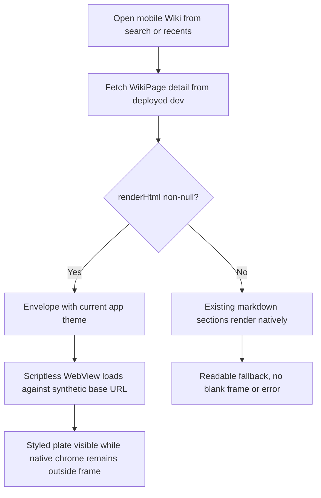
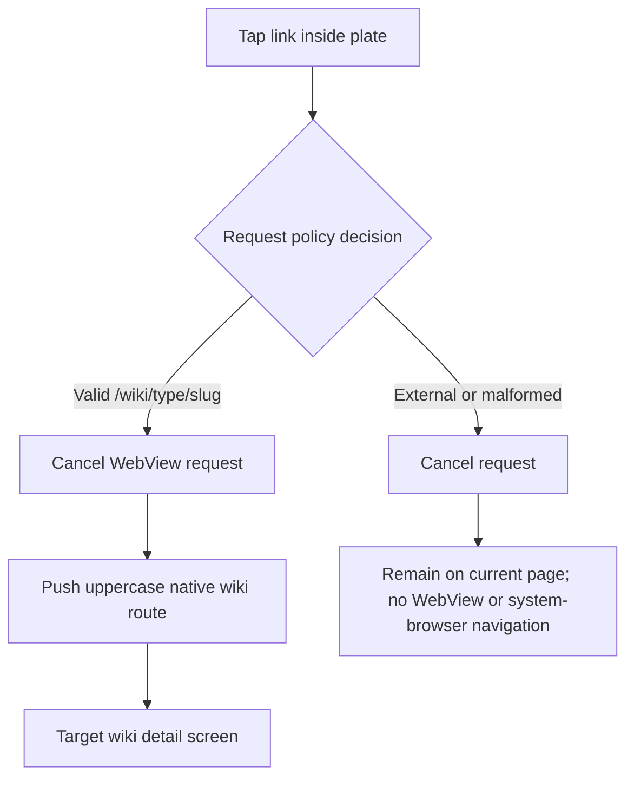
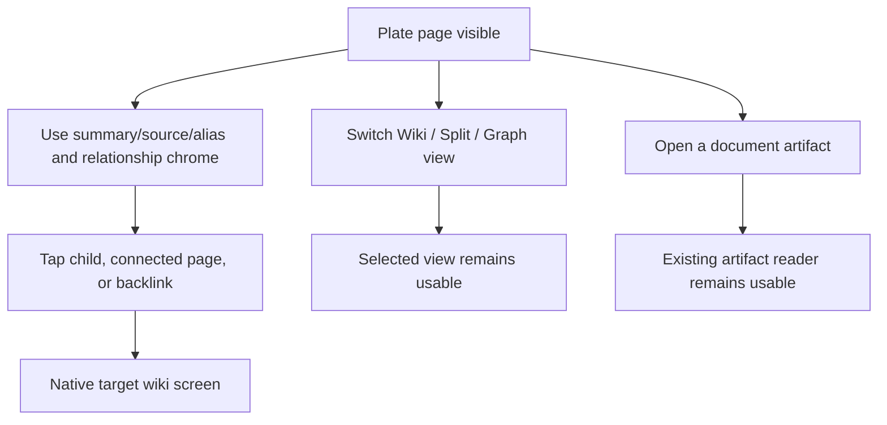

# Dogfood Report — THINK-275 mobile wiki HTML plate reader

> Diff-scoped device QA of merged PR #3671 (`f12244f5a`) against its parent on 2026-07-13.

## Diff Summary

- `WikiPageQuery` and `WikiPageDetail` now carry detail-only `renderHtml`; list/search surfaces remain unchanged.
- The wiki detail screen wraps non-null `renderHtml` in the existing document-frame envelope and shows it in a scriptless WebView with an explicit synthetic base URL.
- A pure request policy allows only the initial document, converts valid `/wiki/<type>/<slug>` loads into uppercase native routes, and blocks every other request.
- The existing markdown/section path remains for null renders; the native header, summary, source, alias, children, connected-page, and backlink chrome remains outside the WebView.
- The artifact reader was not changed and is a required regression surface because the wiki reader reuses its document-frame/WebView pattern.

## Personas

No `STRATEGY.md`, `VISION.md`, or persona document is present; these are inferred from the product and changed flow.

- **Mobile knowledge worker** — needs a readable, themed knowledge page and expects linked knowledge to open naturally inside the app.
- **Enterprise operator** — needs predictable native navigation, inert untrusted links, reliable fallback, and no regression in adjacent document-reading workflows.

## Flows Tested

## Test Matrix & Results

| #   | Flow                | Journey / Scenario                                                                                                                                    | Functional | Experiential | Evidence                                                                                                                                                                                                                                                                                                                                                                       |
| --- | ------------------- | ----------------------------------------------------------------------------------------------------------------------------------------------------- | ---------- | ------------ | ------------------------------------------------------------------------------------------------------------------------------------------------------------------------------------------------------------------------------------------------------------------------------------------------------------------------------------------------------------------------------ |
| 1   | Render              | Open freshly regenerated `zz-s-clam-bar` from the real Wiki list; verify house-styled plate and native chrome outside the frame                       | **Pass**   | **Pass**     | Fresh force-compile: 6,974 bytes, 1/1 rendered; authenticated GraphQL returned the same plate. [Dark plate and native chrome](evidence-THINK-275/S1-dark-plate.png).                                                                                                                                                                                                           |
| 2   | Theme               | Regenerate the envelope under both NativeWind app color schemes and verify matching, legible dark/light output                                        | **Pass**   | **Pass**     | [Dark](evidence-THINK-275/S1-dark-plate.png) and [light](evidence-THINK-275/S2-light-plate.png) screenshots. The app currently pins dark and exposes no theme control, so a reversible local verification override set the actual NativeWind scheme to light; it was removed before commit.                                                                                    |
| 3   | Internal navigation | Tap a freshly compiled `/wiki/entity/paris` anchor in the real WKWebView; prove interception, cancellation, uppercase route, and native target screen | **Pass**   | **Pass**     | Metro observed `https://wiki.thinkwork.internal/wiki/entity/paris` → `{ action: "push", route: "/wiki/ENTITY/paris" }`; the screen pushed to [Paris](evidence-THINK-275/S3-native-paris.png) without browser or WebView navigation.                                                                                                                                            |
| 4   | External safety     | Tap a freshly compiled external URL and verify no WebView or system-browser navigation                                                                | **Pass**   | **Pass**     | The compositor rendered `https://example.com/` as inert visible text (no external anchor). Tap caused no accessibility-tree change, no request-adapter event, and no browser. [Post-tap state](evidence-THINK-275/S4-external-inert.png); the pure policy suite separately proves external requests return `block`.                                                            |
| 5   | Fallback            | Find a null-render page; if none exists, use the contract-approved fleet census plus strict branch inspection                                         | **Pass**   | **Pass**     | Dev database census: 1,683 pages, 0 null renders. Targeted inspection shows `page?.renderHtml ? envelope : null` and `plateHtml ? WebView : page.sections.map(Markdown)`; the unchanged markdown path is therefore selected strictly when the nullable field is absent.                                                                                                        |
| 6   | Native chrome       | Exercise source/alias/relationships and Wiki → Split → Graph controls through real destination states                                                 | **Pass**   | **Pass**     | `zz-s-clam-bar` showed native source, alias, and connected-page chrome; Paris connected-page tap pushed France and backlink tap pushed Latin Quarter. The control announced `Switch to split view` → `Switch to graph view` → `Switch to wiki view`. [Split view](evidence-THINK-275/S6-split-view.png). Dev has no parent/child rows, so no children card exists to exercise. |
| 7   | Artifact regression | Open a document card from `SLACK-1474` and follow it to the existing artifact reader                                                                  | **Pass**   | **Pass**     | `CRM Opportunities Report` opened in the unchanged, scriptless house-style [artifact reader](evidence-THINK-275/S7-artifact-reader.png), with readable headings, prose, and metrics.                                                                                                                                                                                           |

All seven scenarios are green. The five plan-owned flows are represented by scenarios 1–7; scenarios 6 and 7 split the broad R5 regression flow so each end state has independent evidence.

## Per-Scenario Evidence

### S1 — Fresh plate render and native chrome

- Dev page: `ENTITY/zz-s-clam-bar` (`2b92acfe-0e74-4f76-9983-eea398eefb20`).
- A reversible canary appended one valid wiki link and one external URL to a backed-up section, then ran `backfill-wiki-renders.ts --force --page ...` against dev. The compositor reported `eligible=1 processed=1 rendered=1 errors=0` and 6,974 bytes.
- An authenticated request to the deployed GraphQL endpoint returned the freshly generated 6,974-byte HTML with the internal anchor present and no external anchor.
- On iPhone 17 Pro / iOS 26.3, the plate painted with house typography and card styling inside WKWebView. The header, source count, alias chip, connected pages, and backlinks remained native and outside the frame.
- Functional verdict: **Pass**. Experiential verdict: **Pass** — no collapsed frame, blank state, flash, clipped headline, or illegible text.

### S2 — Theme envelope

- The normal app state rendered the dark envelope; a reversible verification-only root override changed the current NativeWind color scheme to light and reloaded the same page.
- Both the native chrome and HTML plate changed palettes, including background, border, text, and muted colors. The light plate remained readable without stale dark tokens.
- The override was reverted and `git diff --exit-code` confirmed both touched product files match the merged source.
- Functional verdict: **Pass**. Experiential verdict: **Pass**.

### S3 — Native internal-link interception

- Temporary verification logging in the thin `onShouldStartLoadWithRequest` adapter first recorded the synthetic base document as `allow`.
- Tapping the visible `Verification internal — Paris` anchor recorded exactly: `https://wiki.thinkwork.internal/wiki/entity/paris` → `{ action: "push", route: "/wiki/ENTITY/paris" }`.
- The current WKWebView load was cancelled and the native Paris detail screen pushed; there was no Safari handoff and no in-frame page load.
- The logging line was removed before commit.
- Functional verdict: **Pass**. Experiential verdict: **Pass** — the transition felt like native detail navigation and preserved the Back affordance.

### S4 — External link safety

- The freshly compiled external Markdown URL was deliberately sanitized by the document compositor into inert visible text rather than an anchor.
- Tapping it left the page tree unchanged, emitted no request-policy event, and opened no system browser. The pure policy test suite covers the additional defensive case where an external request does reach the adapter.
- Functional verdict: **Pass**. Experiential verdict: **Pass** — the URL remains readable but cannot unexpectedly leave the app.

### S5 — Null-render fallback

- Direct persisted-state census found `total=1683`, `nullRender=0`; there is no honest dev record on which to demonstrate the null branch.
- Per the handoff's explicit substitute, inspection at `apps/mobile/app/wiki/[type]/[slug].tsx` proves plate mode keys only on truthy `page.renderHtml`, with the unchanged `page.sections.map(...)` Markdown renderer in the `else` branch.
- `renderHtml` remains nullable in the SDK type, and no list/search query requests it.
- Functional verdict: **Pass**. Experiential verdict: **Pass by contract-approved substitute**; no human verification is needed while the fleet has zero null records.

### S6 — Native chrome and view modes

- Source and alias chrome rendered on `zz-s-clam-bar`; connected-page navigation reached France and backlink navigation reached Latin Quarter through native pushes from Paris.
- Paris exposed 26 sources, one connected page, and a populated `REFERENCED BY` list. The detail control completed Wiki → Split → Graph → Wiki, and the plate remained present in split mode beneath the graph.
- Direct persisted-state inspection found no pages with `parent_page_id`, so children cards do not exist in the current dev dataset.
- Functional verdict: **Pass**. Experiential verdict: **Pass** — the dense Paris graph remained responsive and the plate/chrome boundary was visually clear.

### S7 — Artifact reader regression

- From Threads, `SLACK-1474` opened to its `CRM Opportunities Report` document card; tapping the card pushed `/artifacts/c8500099-a7dd-5257-a6db-4d8a0b64aa19`.
- The reader displayed the existing compiled document plate with its title, summary, headings, and metric cards; no changes from PR #3671 participate in this route.
- Functional verdict: **Pass**. Experiential verdict: **Pass**.

## What Was Fixed

None. This verification worker is a judge and does not change product code.

## Paper Cuts (by persona)

- **None filed.** The transient “Open debugger to view warnings” banner came from the local Expo development runtime's existing simulator warnings, not the shipped feature or a production build.

## Console Errors

- No GraphQL operation errors, React exceptions, redbox, WebView navigation errors, or application crashes occurred in any scenario.
- The authenticated deployed GraphQL probes returned data successfully for both the original and freshly compiled plate.
- Metro recorded the expected base-document `allow` and internal-link `push` events. The external tap emitted no navigation event.
- Simulator-only noise included existing VoiceDictation `aborted`, WebKit accessibility registration, and BrowserEngineKit process-termination warnings. None changed visible behavior or correlated with a failed request.

## Automated Gates

- `pnpm --filter @thinkwork/mobile test`: **61 files / 296 tests passed**, including 17 request-policy tests.
- `pnpm --filter @thinkwork/react-native-sdk build`: **passed**.
- PR #3671 CI: **green**; merged at `f12244f5a`.
- Post-merge Deploy run 29253349701 on `main`: **green** at the same SHA.
- Canary teardown: original section MD5 `2af673d4b84fdb34e5ee4e7a515f1ba9` and render MD5 `679fb7a7eb5691c1c360d4fe2ded53d0` restored exactly; canary marker absent.

## Human Verifications

None. The existing Google OAuth dev session restored successfully in the simulator and every contract flow was automated or covered by its plan-approved zero-data substitute.

## Decisions for a Human

None.

## Learnings

- The synthetic base URL coupling is working on real WKWebView: a root-relative plate link became an interceptable absolute request and preserved the expected uppercase native type segment.
- Fresh compositor output already neutralizes external Markdown links, while the mobile request policy supplies defense in depth if an external request is ever present.
- Dev's complete render backfill (1,683/1,683) makes the nullable fallback deliberately hard to stage; the handoff's census-plus-strict-branch proof is necessary to verify it without corrupting persisted output.
- The app currently defaults and pins NativeWind to dark. The reader's light envelope is correct when the app scheme is set to light, but there is no user-facing theme control in the current mobile shell.

## Final Status

**PASS.** The complete plan-owned device contract is green against deployed dev. Fresh output was exercised and restored, request interception was observed in the real WKWebView, adjacent native and artifact flows reached their real end states, automated gates passed, and no human decision remains.
