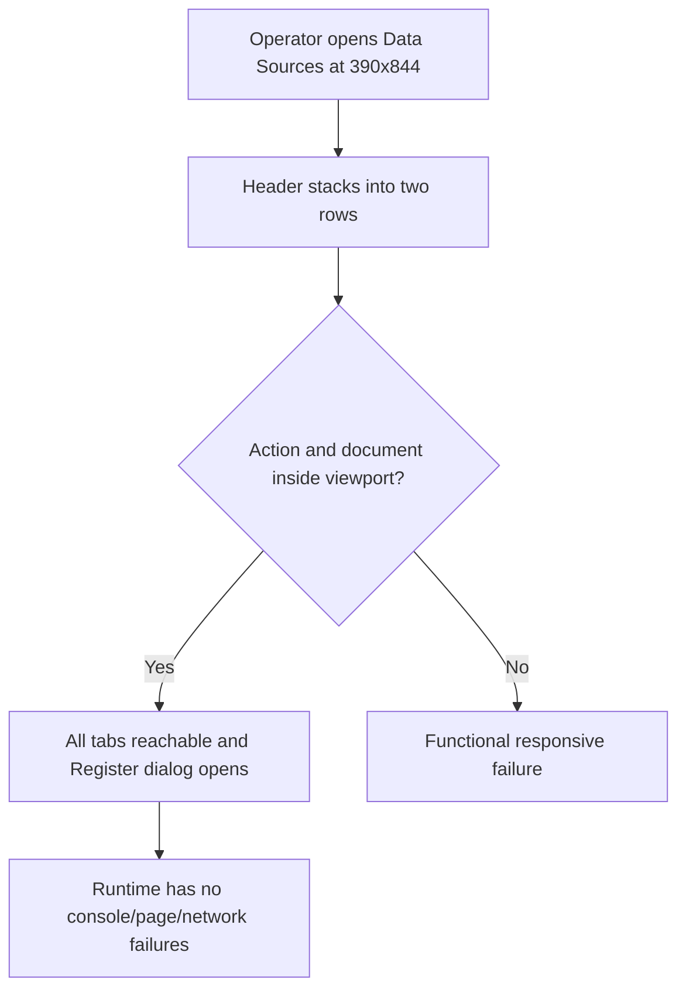

# Dogfood Report — THINK-282

> Diff-scoped browser QA of the assembled Connectors restructure from merged PRs #3734 (`64e63e658`), #3750 (`fba9e9f82`), and #3754 (`6e7d2fb6b`) on deployed dev, generated on 2026-07-14.

## Diff Summary

- Merged tenant-registered and plugin/managed-application MCP servers into one name-sorted table with a dedicated Tenant/Plugin Type column; removed the redundant inline plugin badge while preserving dedup, search, status, toggle, and detail navigation behavior.
- Renamed the operator Settings surface from **Connections** to **Connectors** in navigation, page title, and breadcrumb while retaining the `/settings/mcp-servers/*` route family and the first tab's **Connections** label.
- Promoted `/settings/mcp-servers/data-sources` from a redirect to a live, operator-guarded **Data Sources** tab and removed datasource rows from the MCP Servers tab.
- Split header actions by tab: **Register data source** on Data Sources, **New MCP Server** on MCP Servers, and no action on Connections.
- Reworked `SettingsHeaderBar` below 768px so the three tabs stack in a second horizontally scrollable row while the active tab's action remains inside a 390px viewport; desktop retains the centered single-row grid.

## Personas

No repository strategy, vision, or persona document was found, so the persona is inferred from the operator-only route and Product Contract.

- **ThinkWork operator** — needs to distinguish personal connections, tenant/plugin MCP servers, and analyst data sources quickly; expects stable bookmarks, correct per-tab actions, safe server controls, and usable desktop/mobile layouts.

## Flows Tested

```mermaid
flowchart TD
    A[Signed-in operator opens Settings] --> B[Selects Connectors]
    B --> C[/settings/mcp-servers Connections tab]
    C --> D{Chrome and navigation correct?}
    D -->|Yes| E[Connectors title/breadcrumb, exact three tabs, no action]
    D -->|No| F[Functional failure]
    E --> G[Switch among tabs and use direct bookmarks]
```

```mermaid
flowchart TD
    A[Operator opens MCP Servers] --> B[/settings/mcp-servers/servers]
    B --> C{Server request succeeds?}
    C -->|Rows| D[One name-sorted Tenant/Plugin table]
    C -->|Empty| E[No MCP servers configured state]
    C -->|Error| F[Visible error]
    D --> G[Search filters rows]
    D --> H[Tenant toggle changes and is restored]
    D --> I[Plugin toggle remains disabled]
    D --> J[Row opens server detail]
    D --> K[New MCP Server opens dialog without submitting]
```

```mermaid
flowchart TD
    A[Operator opens old Data Sources bookmark] --> B[/settings/mcp-servers/data-sources]
    B --> C{Datasource request succeeds?}
    C -->|Rows| D[Datasource-only table with required columns]
    C -->|Empty| E[No data sources registered state]
    C -->|Error| F[Visible error]
    D --> G[Search filters datasource rows]
    D --> H[Register data source opens dialog without submitting]
    G --> I[Back, refresh, and tabs preserve correct route/category]
```



## Test Matrix & Results

| #   | Flow                   | Journey / Scenario                                                                                                                                                                                                                                       | Functional | Experiential | Status | Evidence                                                                                                                                                                                                                                                                                                                                                                                   | Issue | Fix | Commit                                |
| --- | ---------------------- | -------------------------------------------------------------------------------------------------------------------------------------------------------------------------------------------------------------------------------------------------------- | ---------- | ------------ | ------ | ------------------------------------------------------------------------------------------------------------------------------------------------------------------------------------------------------------------------------------------------------------------------------------------------------------------------------------------------------------------------------------------ | ----- | --- | ------------------------------------- |
| 1   | Connectors entry       | Sidebar **Connectors** opens `/settings/mcp-servers`; title/breadcrumb are Connectors; exact tabs are Connections / MCP Servers / Data Sources; Connections has no header action (R1, R6)                                                                | Pass       | Pass         | Pass   | `01-connectors-entry.png`; URL remained `/settings/mcp-servers`; title was `Connectors · ThinkWork`; body/screenshot show Connectors navigation and breadcrumb, exact three tabs, active Connections content, and no tab-owned header action; console/page errors empty                                                                                                                    | -     | -   | `fba9e9f82`                           |
| 2   | MCP table              | Direct `/settings/mcp-servers/servers` shows one Name/Type/URL/Status/Enabled table; Tenant/Plugin rows are correctly typed and name-sorted; old section headings, inline plugin badge, and datasource rows are absent (R2-R5, R7, AE1)                  | Pass       | Pass         | Pass   | `02-mcp-merged-table.png`; one table had the exact five columns and seven rows: 3 Tenant + 4 Plugin, interleaved in ascending order (`Company Brain` … `Twenty CRM`); only `MCP Servers` heading rendered; no old group headings, lowercase name badge, or datasource columns/rows; console/page errors empty                                                                              | -     | -   | `64e63e658`                           |
| 3   | MCP preserved behavior | Search filters the merged table; tenant Enabled toggles and is restored; plugin Enabled is disabled; a row opens the correct server detail (R5)                                                                                                          | Pass       | Pass         | Pass   | `03-mcp-preserved-behavior.png`; search `LastMile` reduced seven rows to `LastMile Data Catalog` and `LastMile Dispatch`; the first tenant switch changed true→false→true and was confirmed restored; Plugin switches exposed `disabled`; clicking LastMile Data Catalog navigated to `/settings/mcp-servers/a65f6f0a-e5de-4fcd-91e4-0c766c163585`, then Back returned to `/servers`       | -     | -   | `64e63e658`                           |
| 4   | MCP action             | MCP Servers exposes only **New MCP Server** and opens its dialog without persisting a server                                                                                                                                                             | Pass       | Pass         | Pass   | `04-new-mcp-server-dialog.png`; page snapshot exposed New MCP Server and no Register action; dialog opened with Name, URL, Authentication, Cancel, and disabled Add server controls; no submission; page errors empty                                                                                                                                                                      | -     | -   | `fba9e9f82`                           |
| 5   | Data Sources bookmark  | Direct `/settings/mcp-servers/data-sources` remains on that URL, selects Data Sources, renders datasource-only columns/rows or its specified empty state, and exposes only **Register data source**, whose dialog opens without submission (R6, R7, AE2) | Pass       | Pass         | Pass   | `05-data-sources-bookmark.png`; direct URL remained `/data-sources`; active tab rendered one Name/Source/Instance/Database/Status/Enabled table with four datasource rows and no tenant/plugin columns; only Register data source action exposed; dialog opened on Internal/External choice with disabled submit and no mutation                                                           | -     | -   | `fba9e9f82`                           |
| 6   | Navigation/search      | Data-source search, three-tab navigation, direct URLs, browser Back, and Reload preserve the selected category and keep server/data-source search state isolated                                                                                         | Pass       | Pass         | Pass   | `06-navigation-search.png`; `Hindsight` reduced Data Sources to one row; selecting MCP Servers moved to `/servers` with empty server search and all seven rows; browser Back returned to `/data-sources` active with all four rows; Reload retained the Data Sources route/tab; re-filtered screenshot shows the isolated Hindsight result                                                 | -     | -   | `fba9e9f82`                           |
| 7   | Connections regression | Returning to Connections preserves its prior content and label and shows no tab-owned header action                                                                                                                                                      | Pass       | Pass         | Pass   | `07-connections-regression.png`; selecting Connections returned to `/settings/mcp-servers`; active tab and page heading both remained Connections, personal-integration content rendered, and header action list was empty; console/page errors empty                                                                                                                                      | -     | -   | `fba9e9f82`                           |
| 8   | Mobile/accessibility   | At 390x844 on Data Sources, tabs stack below breadcrumb/action; Register action right edge is <=390; document scroll width is 390; tabs/action are keyboard-accessible; dialog opens (repair regression)                                                 | Pass       | Pass         | Pass   | `08-mobile-header.png`, `08-mobile-dialog.png` (plus preserved diagnostic `08-desktop-pre-resize.png`); measured `innerWidth=390`, document/body scroll width `390`, action rect `left=346 right=374 width=28`, header children `2` and height `89`; action was focusable (`tabIndex=0`), received keyboard focus, and Enter opened the dialog; accessible tablist retained all three tabs | -     | -   | `6e7d2fb6b`                           |
| 9   | Runtime health         | Console/page errors and failed network requests remain empty throughout every exercised route and dialog                                                                                                                                                 | Pass       | Pass         | Pass   | `09-runtime-health.png`; four isolated sessions covering MCP dialog, Data Sources dialog, navigation/reload, and mobile dialog each reported `errors: []`; each reported zero 400–599 requests; console was empty except one warning-only dialog-description paper cut noted below                                                                                                         | -     | -   | `64e63e658`, `fba9e9f82`, `6e7d2fb6b` |

## What Was Fixed

None. This verification worker is a judge and will not change product code.

## Paper Cuts (by persona)

- **ThinkWork operator** — New MCP Server dialog logs a Radix accessibility warning because DialogContent lacks a description/`aria-describedby`; no visible or functional impact — low — deferred as pre-existing dialog semantics.

## Console Errors

No console errors or page errors. No 400–599 network responses were recorded in the four isolated contract sessions. Opening the pre-existing New MCP Server dialog emitted one warning-only Radix message: DialogContent lacks a description/`aria-describedby`; this is recorded as a low-severity paper cut and does not fail the explicit zero-errors contract.

## Human Verifications

Not applicable. The scoped dialogs are opened but no OAuth, external communication, payment, or destructive persistence leg is required by the Product Contract.

## Decisions for a Human

None.

## Learnings

- Parent verification must exercise the assembled child outcome; child Done evidence is context, not a substitute for the plan-owned deployed matrix.
- The current deployed asset `assets/index-CoJOUaFZ.js` (Last-Modified 2026-07-14 19:35:08Z) is newer than repair #3754 and replaces the stale pre-repair bundle.
- The `agent-browser` and `pnpm` executables were installed under `/opt/homebrew/bin`; the worker PATH omitted them. Using the absolute/augmented PATH recovered the mandated tools without installing or changing machine configuration.
- The browser's default session is shared across factory workers. Named sessions prevent unrelated runs from moving the active tab while evidence is captured.
- The root `format:check` script does not expose a root Prettier binary in this checkout and the locked Prettier check reports extensive pre-existing repository drift. The new report was formatted and checked directly with the lockfile's Prettier 3.8.2, preserving unrelated files.

## Final Status

**PASS — READY TO SHIP.** All nine deployed-dev scenarios pass functionally and experientially, including the repaired 390×844 contract. Durable screenshots are stored under the factory artifact directory. Automated verification is green: the focused Connectors/header suite passed 28/28, web typecheck passed, repository lint passed, the report passed locked Prettier 3.8.2 and `git diff --check`, implementation PRs #3734/#3750/#3754 are merged, post-repair Release run 29362390668 succeeded, and the latest completed main Test run 29362684326 succeeded. Decisions for a human: none.
