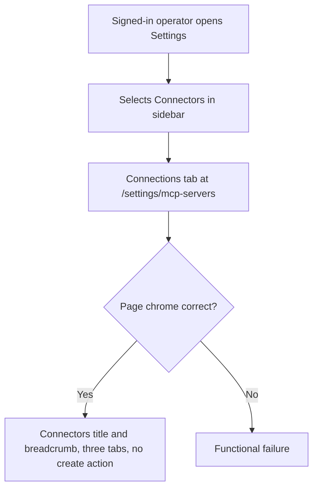
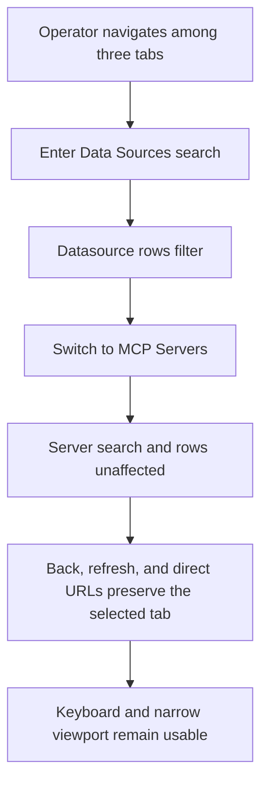

# Dogfood Report — THINK-285

> Diff-scoped browser QA of merged PR #3750 (`fba9e9f82a83bd7207f5cc8af632f4e03094df19`) on deployed dev versus its prior `main`, generated on 2026-07-14.

## Diff Summary

- Renamed the operator Settings surface from **Connections** to **Connectors** in the sidebar, page title, and breadcrumb while retaining every `/settings/mcp-servers/*` URL.
- Promoted `/settings/mcp-servers/data-sources` from a redirect stub to a live, operator-guarded **Data Sources** tab with its own search state, loading/error wiring, datasource table, and empty state.
- Removed datasource rows and the former “Datasource MCPs” section from **MCP Servers**, which now contains only the merged tenant/plugin server table.
- Split header actions by tab: **Register data source** on Data Sources, **New MCP Server** on MCP Servers, and no action on the per-user Connections tab.
- Updated component, route, navigation, and dialog tests for the three-tab contract and moved datasource interactions to the new route.

## Personas

No repository persona or strategy document exists, so the persona is inferred from the issue and operator-only route guard.

- **ThinkWork operator** — needs to distinguish per-user connections, tenant/plugin MCP servers, and analyst data sources quickly; expects stable bookmarks, correct creation actions, clear empty/error states, and no accidental cross-category rows.

## Flows Tested



```mermaid
flowchart TD
    A[Operator opens old Data Sources bookmark] --> B[/settings/mcp-servers/data-sources]
    B --> C{Authorized and data request succeeds?}
    C -->|Yes, rows| D[Data Sources active; datasource-only table and columns]
    C -->|Yes, empty| E[No data sources registered empty state]
    C -->|No| F[Visible loading then actionable error]
    D --> G[Register data source action]
    E --> G
    G --> H[Register dialog opens without mutating data]
```

```mermaid
flowchart TD
    A[Operator selects MCP Servers tab] --> B[/settings/mcp-servers/servers]
    B --> C[Merged tenant and plugin table]
    C --> D{Datasource rows or old section present?}
    D -->|No| E[New MCP Server action only]
    D -->|Yes| F[Functional failure]
    E --> G[New MCP Server dialog opens without mutating data]
```



## Test Matrix & Results

| # | Flow | Journey / Scenario | Functional | Experiential | Status | Evidence | Issue | Fix | Commit |
|---|------|--------------------|------------|---------------|--------|----------|-------|-----|--------|
| 1 | Connectors entry | Sidebar **Connectors** opens `/settings/mcp-servers`; title/breadcrumb are Connectors; tabs are Connections, MCP Servers, Data Sources; Connections has no header action | Pass | Pass | Pass | `01-connectors-entry.png`; URL `/settings/mcp-servers`; body text and screenshot show sidebar/breadcrumb Connectors, exact three tabs, active Connections, and no page-header create action; console/page errors empty | - | - | `fba9e9f82` |
| 2 | Bookmark | Direct `/settings/mcp-servers/data-sources` keeps the URL, selects Data Sources, and renders datasource columns/rows (or the specified empty state) without tenant/plugin rows | Pass | Pass | Pass | `02-data-sources-bookmark.png`; direct URL remained unchanged; active tab and six required columns rendered; four connected datasource rows appeared with datasource metadata and no tenant/plugin server rows; console/page errors empty | - | - | `fba9e9f82` |
| 3 | Data-source action | Data Sources shows only Register data source; opening it reaches the Register dialog without persisting a change | Pass | Pass | Pass | `03-register-data-source-dialog.png`; only the accessible Register data source header action was present; dialog opened with clear Internal/External choices and disabled submit until a database is selected; no mutation submitted; console/page errors empty | - | - | `fba9e9f82` |
| 4 | MCP Servers | `/settings/mcp-servers/servers` selects MCP Servers, shows the merged table only, and contains neither datasource rows nor the old Datasource MCPs section | Pass | Pass | Pass | `04-mcp-servers-table.png`; direct URL remained `/servers`; active tab rendered one Name/Type/URL/Status/Enabled table with seven Tenant/Plugin rows; all four datasource names and the old “Datasource MCPs” heading were absent; console/page errors empty | - | - | `fba9e9f82` |
| 5 | MCP action | MCP Servers shows only New MCP Server; opening it reaches the dialog without persisting a change | Pass | Pass | Pass | `05-new-mcp-server-dialog.png`; only the accessible New MCP Server header action was present; dialog opened with Name, URL, and Authentication controls and disabled Add server until required fields are supplied; no mutation submitted | - | - | `fba9e9f82` |
| 6 | Navigation/search | Three-tab navigation, direct URLs, refresh/back behavior, and per-tab searches keep route and filter state correctly isolated | Pass | Pass | Pass | `06-navigation-search.png`; “Hindsight” reduced Data Sources to the one matching row; tab click moved to `/servers` with an empty server search and all seven MCP rows; Back and Reload restored `/data-sources` with that tab active; clicking the filtered Hindsight row navigated to its server-detail URL | - | - | `fba9e9f82` |
| 7 | Cross-cutting | Keyboard navigation and a narrow viewport keep all three tabs, actions, table content, and dialogs reachable and legible | **Fail** | **Fail** | **Fail** | `07-narrow-keyboard.png`; at a 390×844 viewport the new three-tab strip consumes the header width and the Register data source action is clipped off the right edge (`x=411.7`, width `28`, viewport/scroll width `390`), with no horizontal document overflow through which a pointer user can reveal it; semantic tab/table controls remain exposed to assistive technology | Responsive header action is visually unreachable at 390 px | Repair header composition so tabs and action coexist at narrow widths; add a 390 px regression assertion | `fba9e9f82` |
| 8 | Runtime health | Console and network inspection across the exercised journeys shows no change-related errors or failed API requests | Pass | Pass | Pass | `08-runtime-health.png`; page-error and console collections were empty after each contract flow; final session recorded 107 completed responses and zero non-2xx/3xx failures | - | - | `fba9e9f82` |

## What Was Fixed

None. This verification worker is a judge and did not change product code.

### Narrow header clips the tab-owned action — not fixed

- **Symptom:** At 390×844, the Data Sources page renders the three tabs across the header but the tab-owned Register data source icon is absent from the visible viewport.
- **Reproduction:** Open `/settings/mcp-servers/data-sources`, set the viewport to 390×844, and inspect the header. The action box is at `x=411.6875` with width `28` while `innerWidth`, `documentElement.scrollWidth`, and `body.scrollWidth` are all `390`; there is no horizontal scroll path to the clipped control.
- **Root-cause boundary:** The third tab introduced by PR #3750 exhausts the narrow header row before the right-aligned action. The repair worker should choose the smallest layout change that keeps the action visibly reachable without regressing the three-tab desktop layout.
- **Required regression test:** Add a browser/component layout assertion at 390 px that fails before the fix and proves the active tab’s header action lies within the viewport after the fix. Also retain the existing per-tab ownership tests.

## Paper Cuts (by persona)

None. The narrow-header defect is a functional failure, not a paper cut.

## Console Errors

None. `agent-browser errors` and `console` were empty after the exercised desktop journeys; the final session observed 107 completed requests with zero failed responses.

## Human Verifications

Not applicable. The scoped dialogs are opened but no external OAuth, messaging, payment, or destructive persistence leg is required by the verification contract.

## Decisions for a Human

None.

## Learnings

- The deploy gate must be checked against the implementation’s exact SHA before browser proof; Deploy run 29333590298 completed successfully for `fba9e9f82`.
- The factory shell omits `/opt/homebrew/bin`; both `gh` and `agent-browser` were already installed there, so this run prepended that path without modifying the machine.
- Adding a third header tab can push the tab-owned action beyond a narrow viewport even when the document itself reports no horizontal overflow; responsive verification must measure the action box, not only confirm that its accessibility node exists.

## Final Status

**NOT READY — verification failed.** Desktop scenarios 1–6 and runtime-health scenario 8 pass functionally and experientially on deployed dev, but scenario 7 fails because the Register data source action is clipped and visually unreachable at a 390 px viewport. No product code was changed by this verification worker. The smallest next step is a responsive header-composition repair with a red-before/green-after 390 px regression test, followed by re-verification of scenarios 1, 2, 3, 6, 7, and 8. Implementation PR #3750’s package suite (2200/2200), typecheck, formatting, CI, and exact-sha Deploy workflow were green before this browser run.
