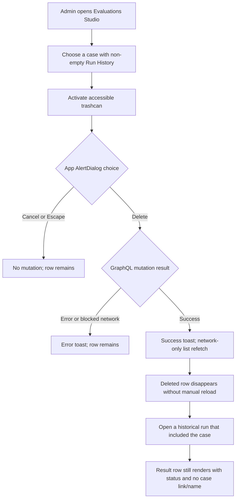
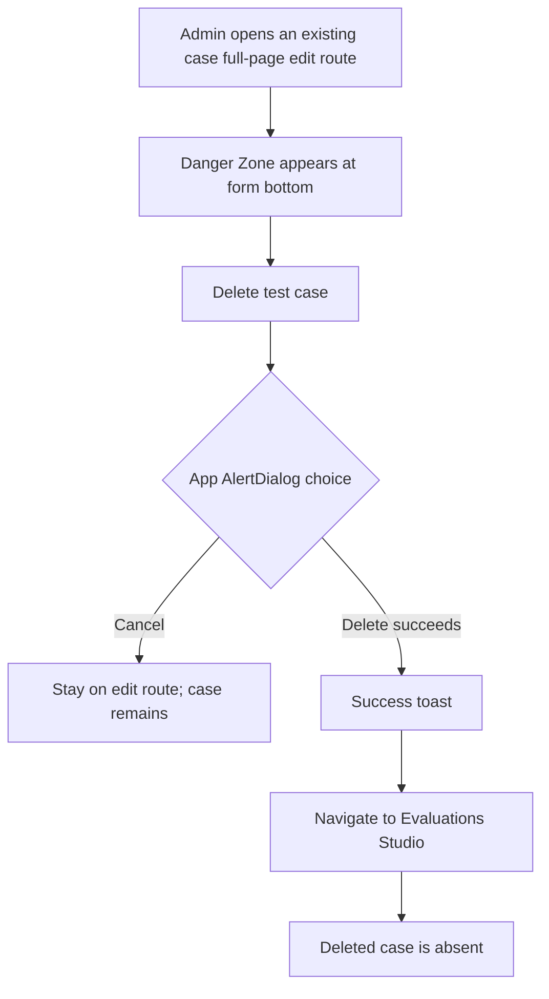
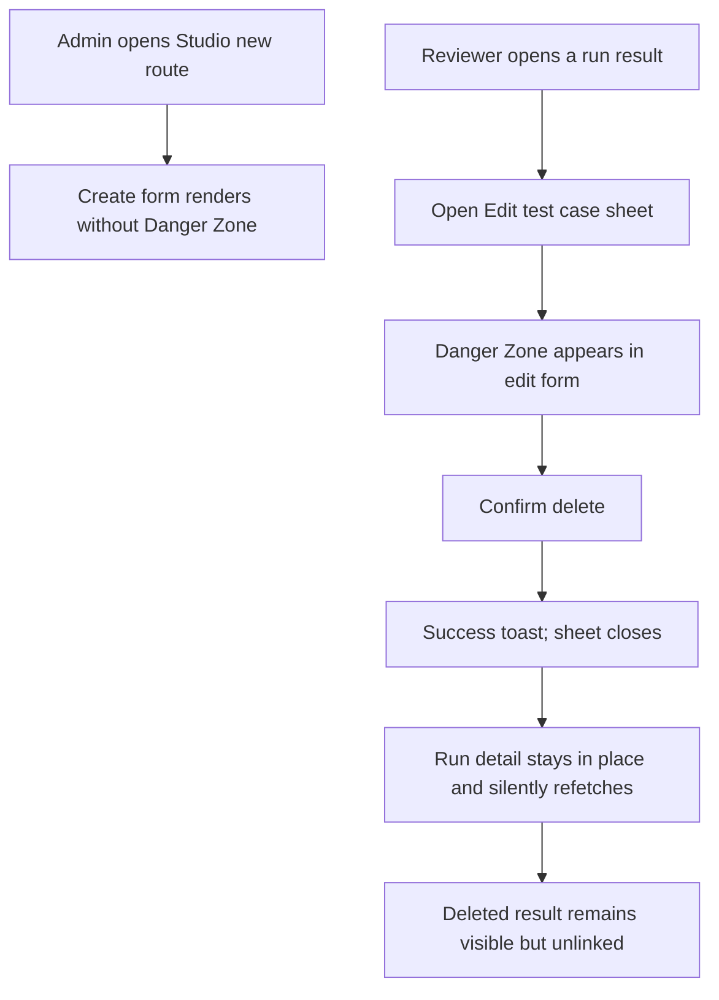

# Dogfood Report — THINK-289 Remove Eval Test

> Diff-scoped deployed-dev browser QA of PRs #3764, #3765, and #3766 versus their prior `main` parent. Generated on 2026-07-14.

## Diff Summary

- PR #3764 makes `deleteEvalTestCase` tombstone dataset-backed cases and transactionally unlink historical results, remove overrides, and delete the case while returning curated errors.
- PR #3765 replaces the Evaluations Studio trashcan's native confirm with the shared `AlertDialog`, names the control accessibly, surfaces success/error toasts, and refetches the list with `network-only` after success.
- PR #3766 adds an edit-only Danger Zone to `EvalTestCaseForm`; full-page deletion returns to Studio, while run-detail-sheet deletion closes and refreshes the run in place.
- The merged diff changes 8 files (+828/-13): four production files and four focused test files. Routes in scope are `/settings/evaluations/studio`, `/settings/evaluations/studio/new`, `/settings/evaluations/studio/edit/<id>`, and affected evaluation run-detail routes.
- Deploy workflow run 29349996870 completed successfully against `main` SHA `044a6c9ac` at 2026-07-14T17:01:08Z and includes all three implementation merges. However, the user-facing web artifact did not advance: runtime config remains `v0.1.0-canary.358` issued at 13:11:23Z and `/` is last-modified at 13:11:24Z, both more than three hours before the implementation merges.

## Personas

- **Tenant administrator / evaluation operator (inferred from the issue and admin-gated mutation)** — needs destructive cleanup to be deliberate, clearly confirmed, recoverable from ordinary errors, and immediately reflected wherever evaluation data is reviewed.
- **Evaluation reviewer (inferred from the run-detail workflow)** — needs historical runs to remain intelligible after a test case is removed and should not lose run context when deleting from the Edit Eval sheet.

## Flows Tested

### Studio delete and historical-run preservation

### Full-page edit Danger Zone

### Create form and run-detail-sheet variants

## Test Matrix & Results

| # | Flow | Journey / Scenario | Functional | Experiential | Status | Evidence | Issue | Fix | Commit |
|---|------|--------------------|------------|---------------|--------|----------|-------|-----|--------|
| 1 | Setup | Create fresh disposable full-page and sheet cases; identify a disposable case with non-empty Run History plus its historical run | Not run | Not run | Blocked (waiting on deploy) | Live web artifact predates the merges; no dev data was mutated | - | - | - |
| 2 | Studio | Trashcan has an accessible name; shared dialog names the selected prior-run case; Cancel/Escape performs no delete | Pending | Pending | Pending | - | - | - | - |
| 3 | Studio | Confirm deletion of a previously-run case; success toast appears and the row disappears without manual reload | Pending | Pending | Pending | - | - | - | - |
| 4 | History | Open the affected old run; deleted-case result remains, retains status/output, and has no stale case link/name | Pending | Pending | Pending | - | - | - | - |
| 5 | Studio error | Abort the GraphQL delete request; error toast contains a message and the row remains after networking is restored/refetched | Pending | Pending | Pending | - | - | - | - |
| 6 | Full-page edit | Existing case shows a clear edit-only Danger Zone and irreversible-history copy; cancel keeps the case | Pending | Pending | Pending | - | - | - | - |
| 7 | Full-page edit | Delete the fresh case; success toast appears, route returns to Studio, and the case is absent | Pending | Pending | Pending | - | - | - | - |
| 8 | Create | `/settings/evaluations/studio/new` contains no Danger Zone or destructive delete action | Pending | Pending | Pending | - | - | - | - |
| 9 | Run-detail sheet | Delete the fresh sheet case from Edit test case; sheet closes, run URL is unchanged, run refetches, and the historical row remains unlinked | Pending | Pending | Pending | - | - | - | - |
| 10 | Responsive | Studio dialog and edit Danger Zone remain usable at desktop and narrow viewports without clipped actions or contradictory layout | Pending | Pending | Pending | - | - | - | - |
| 11 | Diagnostics | Relevant routes and interactions produce no unexpected console/page errors or failed network requests outside the intentionally aborted AE2 request | Pending | Pending | Pending | - | - | - | - |

Status values used here: `Pending`, `Pass`, `Fail`, `Blocked (waiting on deploy)`, `Blocked (needs human verify)`, and `Blocked (human decision)`.

## Scenario Evidence

### Deployment gate — BLOCKED (`waiting-on-deploy`)

- `https://app.thinkwork.ai/thinkwork-runtime-config.json` reports `stage=dev`, `releaseVersion=v0.1.0-canary.358`, issued `2026-07-14T13:11:23Z`.
- `https://app.thinkwork.ai/` responds with `last-modified: Tue, 14 Jul 2026 13:11:24 GMT`. PRs #3764, #3765, and #3766 merged at 16:26:29Z, 16:27:59Z, and 16:28:17Z respectively.
- The live entry asset is `/assets/index-DH4sTS5C.js`. Exact-string inspection found zero occurrences of `Test case deleted`, `Delete test case?`, `Delete test case`, or `Danger Zone`.
- A real Chromium accessibility snapshot of the deployed Studio shows every row trashcan as an unnamed `button`; PR #3765 adds `aria-label="Delete test case"`. Activating the first live trashcan entered the browser-native blocking confirmation path rather than returning an in-DOM shared `AlertDialog`, consistent with the pre-merge bundle.
- `01-studio-entry.png` records the clean automation browser before documented Cognito refresh-grant restoration. `02-authenticated-studio.png` records the authenticated live Studio before any mutation. Both are durable under `/Users/ericodom/.thinkwork-factory/artifacts/THINK-289/`.
- `agent-browser errors` and console output were empty on the authenticated Studio. No test case was created, changed, or deleted because the deployment precondition failed.

## What Was Fixed

No product code is changed during verification. Any functional failure is routed to a repair worker with reproduction evidence and a required red/green regression test.

## Paper Cuts (by persona)

None assessed beyond the deployment gate; user journeys were intentionally not executed against stale code.

## Console Errors

None on the authenticated Studio before the deployment gate stopped execution.

## Human Verifications

Not applicable. The documented Cognito refresh-grant session restored successfully; authentication is not the blocker.

## Decisions for a Human

None. This is a deployment dependency wait, not a decision or product failure.

## Learnings

- A persisted delete flow is not verified by the list alone: its true end state includes old run rendering and prevention of dataset-backed resurrection.
- The two edit embeddings have intentionally different exits and both must be exercised: Studio navigation for full-page edit, in-place refresh for the run-detail sheet.

## Final Status

**WAITING ON DEPLOY.** The implementation PRs and Deploy workflow are green, but the user-facing dev web artifact predates all three merges and still serves the old delete UI. Per the verification precondition, the scenario matrix remains pending and no verdict is issued. Resume when `app.thinkwork.ai` advances to a build containing `433d8c684`, `0b37f26a1`, and `7c36acfda`; then execute scenarios 1–11, finalize the report, and open/merge the docs-only PR.
