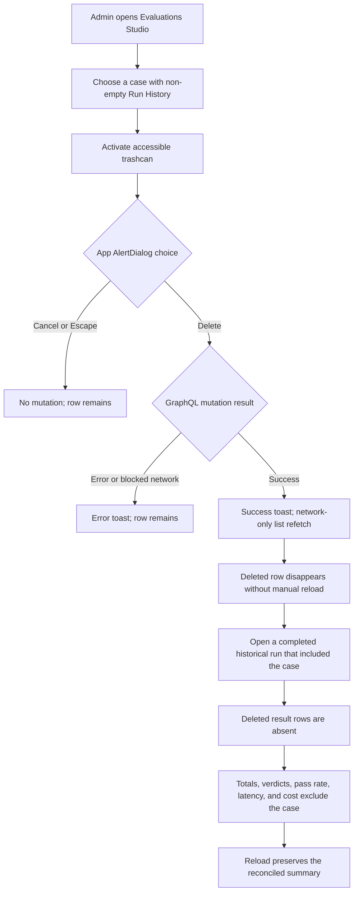
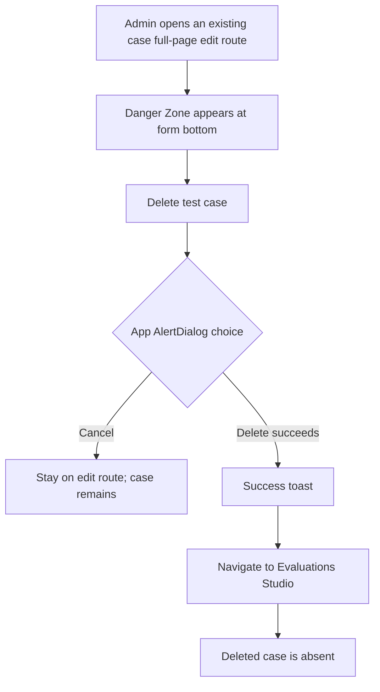
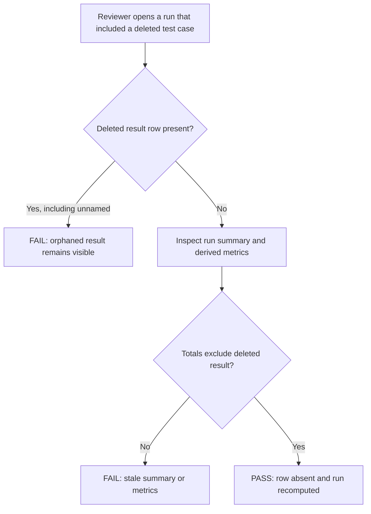
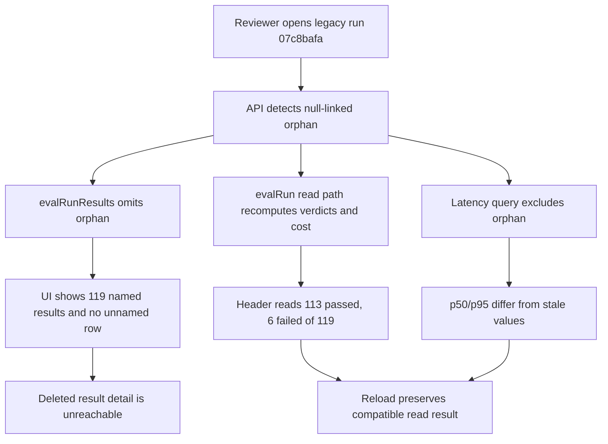
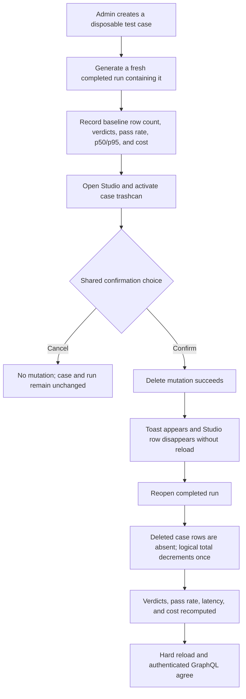
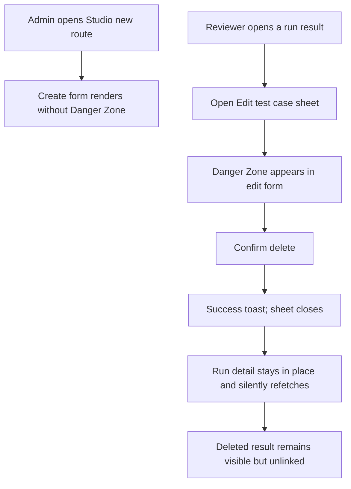

# Dogfood Report — THINK-289 Remove Eval Test

> Diff-scoped deployed-dev browser QA of the THINK-289 implementation and repair PRs versus their prior `main` parents. Generated on 2026-07-14; repair verification resumed after PRs #3780 and #3784 deployed on 2026-07-15 UTC.

## Diff Summary

- PR #3764 makes `deleteEvalTestCase` tombstone dataset-backed cases and transactionally unlink historical results, remove overrides, and delete the case while returning curated errors.
- PR #3765 replaces the Evaluations Studio trashcan's native confirm with the shared `AlertDialog`, names the control accessibly, surfaces success/error toasts, and refetches the list with `network-only` after success.
- PR #3766 adds an edit-only Danger Zone to `EvalTestCaseForm`; full-page deletion returns to Studio, while run-detail-sheet deletion closes and refreshes the run in place.
- The merged diff changes 8 files (+828/-13): four production files and four focused test files. Routes in scope are `/settings/evaluations/studio`, `/settings/evaluations/studio/new`, `/settings/evaluations/studio/edit/<id>`, and affected evaluation run-detail routes.
- Deploy workflow run 29349996870 completed successfully against `main` SHA `044a6c9ac` at 2026-07-14T17:01:08Z and includes all three implementation merges. Dev later advanced to `v0.1.0-canary.359`, issued 2026-07-14T19:35:11Z, so the deployed-browser precondition is now clear.
- **Reopened verification contract (attempt 3):** owner feedback on 2026-07-15 supersedes the earlier accepted history-preservation behavior. A delete must now remove the case's result row from every run view and exclude it from stored/derived totals and metrics; an unlinked `(unnamed)` row is a functional failure.
- **Repair PR #3780** changes four files (+529/-108): deletion now hard-deletes matching result rows, reconciles each affected terminal run under its advisory lock, filters legacy orphan rows from GraphQL/UI reads, and rebuilds legacy-orphan verdict summaries. It also adds focused API/web regression tests.
- **Repair PR #3784** changes three files (+87/-2): run cost is recomputed from remaining rows, legacy orphan latency aggregates exclude null-linked rows, the legacy read path returns recomputed cost, and Danger Zone copy states that past results are removed and summaries recalculated.
- Both repair PRs target `main` and are merged with all required checks green. Deploy run 29383427340 succeeded for `main` SHA `3adee46f6` at 2026-07-15T02:24:10Z and shipped the server-side repair. However, `.github/workflows/deploy.yml` explicitly does not deploy `apps/web` on pushes to `main`; the web app only ships from `release-desktop.yml` on a `desktop-v*` tag. The deployed SPA therefore still serves the pre-#3784 copy even though the source and server repair are current.

## Personas

- **Tenant administrator / evaluation operator (inferred from the issue and admin-gated mutation)** — needs destructive cleanup to be deliberate, clearly confirmed, recoverable from ordinary errors, and immediately reflected wherever evaluation data is reviewed.
- **Evaluation reviewer (inferred from the run-detail workflow)** — needs historical runs to remain intelligible after a test case is removed and should not lose run context when deleting from the Edit Eval sheet.

## Flows Tested

### Studio delete and historical-run reconciliation

### Full-page edit Danger Zone

### Reopened historical-run exclusion

### Legacy orphan compatibility

### Freshly generated completed-run deletion

### Create form and run-detail-sheet variants

## Test Matrix & Results

| #   | Flow             | Journey / Scenario                                                                                                                                                | Functional | Experiential | Status | Evidence                                                                                                                                                                                                                                                                                                                                                      | Issue                                                                                                                  | Fix           | Commit |
| --- | ---------------- | ----------------------------------------------------------------------------------------------------------------------------------------------------------------- | ---------- | ------------ | ------ | ------------------------------------------------------------------------------------------------------------------------------------------------------------------------------------------------------------------------------------------------------------------------------------------------------------------------------------------------------------- | ---------------------------------------------------------------------------------------------------------------------- | ------------- | ------ |
| 1   | Setup            | Create fresh disposable full-page and sheet cases; identify a disposable case with non-empty Run History plus its historical run                                  | Pass       | Pass         | Pass   | Fresh full-page fixtures `19a1e0db…` / replacement `13448658…`, fresh sheet case `27b2ad5a…`; prior-run case `a7221a7f…`; fresh run `d54c373b…` completed 31/32 with the sheet case passing at 1.00. Screenshots `01-studio-deployed-current.png`, `02-fresh-run-config.png`, `03-fresh-run-completed.png`, `04-s1-fresh-sheet-result.png`.                   | -                                                                                                                      | -             | -      |
| 2   | Studio           | Trashcan has an accessible name; shared dialog names the selected prior-run case; Cancel/Escape performs no delete                                                | Pass       | Pass         | Pass   | Alertdialog `Delete test case?` names the flagged case; both Cancel and Escape leave the only filtered row present. Screenshots `05-s2-studio-delete-dialog.png`, `06-s2-cancel-escape-row-remains.png`.                                                                                                                                                      | -                                                                                                                      | -             | -      |
| 3   | Studio           | Confirm deletion of a previously-run case; success toast appears and the row disappears without manual reload                                                     | Pass       | Pass         | Pass   | `Test case deleted` toast; search changed in place to `All 0` / `No results`; mutation and refetch POSTs returned HTTP 200. Screenshot `07-s3-studio-delete-success-toast.png`.                                                                                                                                                                               | -                                                                                                                      | -             | -      |
| 4   | History          | Open the affected old run; deleted-case result remains, retains status/output, and has no stale case link/name                                                    | Pass       | Pass         | Pass   | Run `9c7b8074…`, result `813dcba8…`: `(unnamed)`, fail, 0.10, 67975ms, input/output intact; API reports `testCaseId: null`, `testCaseName: null`. Screenshots `09-s4-history-unlinked-row.png`, `10-s4-history-result-detail.png`.                                                                                                                            | -                                                                                                                      | -             | -      |
| 5   | Studio error     | Abort the GraphQL delete request; error toast contains a message and the row remains after networking is restored/refetched                                       | Pass       | Pass         | Pass   | Exact-origin interception produced `Delete failed: [Network] Failed to fetch`; the row stayed visible and remained persisted after networking was restored and the Studio refetched. Screenshots `11-s5-delete-error-toast-row-remains.png`, `12-s5-row-persists-after-network-restored.png`.                                                                 | -                                                                                                                      | -             | -      |
| 6   | Full-page edit   | Existing case shows a clear edit-only Danger Zone and irreversible-history copy; cancel keeps the case                                                            | Pass       | Pass         | Pass   | Edit route exposes history-preserving irreversible copy; Cancel closes the shared dialog and leaves the same case/route. Screenshots `13-s6-full-page-danger-zone.png`, `14-s6-full-page-delete-dialog.png`.                                                                                                                                                  | -                                                                                                                      | -             | -      |
| 7   | Full-page edit   | Delete the fresh case; success toast appears, route returns to Studio, and the case is absent                                                                     | Pass       | Pass         | Pass   | Mutation/refetch returned 200, route changed to Studio, case disappeared, and `Test case deleted` appeared. Screenshots `15-s7-full-page-delete-success.png`, `25-s7-full-page-delete-toast-and-studio.png`.                                                                                                                                                  | -                                                                                                                      | -             | -      |
| 8   | Create           | `/settings/evaluations/studio/new` contains no Danger Zone or destructive delete action                                                                           | Pass       | Pass         | Pass   | Both full and interactive accessibility trees contain neither `Danger Zone` nor `Delete test case`. Screenshots `08-create-no-danger-zone.png`, `16-s8-create-no-danger-zone.png`.                                                                                                                                                                            | -                                                                                                                      | -             | -      |
| 9   | Run-detail sheet | Delete the fresh sheet case from Edit test case; sheet closes, run URL is unchanged, run refetches, and the historical row remains unlinked                       | Pass       | Pass         | Pass   | Fresh result changed from named to `(unnamed)` while retaining pass/1.00/21480ms; Edit Eval sheet closed, toast appeared, URL remained run `d54c373b…`, and three GraphQL POSTs returned 200. Screenshots `17-s9-fresh-run-result-detail.png`–`21-s9-run-refetched-unlinked-row.png`.                                                                         | -                                                                                                                      | -             | -      |
| 10  | Responsive       | Studio dialog and edit Danger Zone remain usable at desktop and narrow viewports without clipped actions or contradictory layout                                  | Pass       | Pass         | Pass   | At 390×844 the row action, stacked dialog actions, warning copy, and delete control are visible and usable; desktop coverage is in S2/S6. Screenshots `22-s10-narrow-studio-row.png`, `23-s10-narrow-delete-dialog.png`, `24-s10-narrow-danger-zone.png`.                                                                                                     | -                                                                                                                      | -             | -      |
| 11  | Diagnostics      | Relevant routes and interactions produce no unexpected console/page errors or failed network requests outside the intentionally aborted AE2 request               | Pass       | Pass         | Pass   | No browser page errors; successful mutation/refetch requests returned 200; focused web 20/20 and API 101/101 tests passed. Non-blocking result-dialog description warning filed as THINK-292.                                                                                                                                                                 | [THINK-292](https://linear.app/thinkworkai/issue/THINK-292/add-an-accessible-description-to-evaluation-result-dialogs) | Follow-up     | -      |
| 12  | Reopened history | Reload run `07c8bafa…`; deleted row is absent, no `(unnamed)` placeholder remains, summary is `113 passed, 6 failed of 119 tests`, and derived metrics exclude it | Fail       | Fail         | Fail   | Deployed UI still shows `(unnamed)` as pass/0.95/13753ms and `114 passed, 6 failed of 120 tests`; GraphQL returns 120 results including unlinked result `8c7964df…`, while stored run metrics remain total 120 / pass rate 0.95 / cost $0.246921. Screenshots `26-s12-reopened-run-summary-and-unnamed-row.png`, `27-s12-deleted-result-detail-persists.png`. | THINK-289                                                                                                              | Repair worker | -      |
| 13  | Gate             | Independently verify repair PR merge/check state, exact diff, and successful post-merge deploy                                                                     | Pass       | Pass         | Pass   | PRs #3780/#3784 merged with all required checks green; Deploy 29383427340 succeeded at `3adee46f6` on 2026-07-15T02:24:10Z.                                                                                                                             | -                                                                                                                      | -             | -      |
| 14  | Legacy orphan   | Open and hard-reload run `07c8bafa…`; no unnamed row, header 113/6 of 119, recomputed pass rate/p50/p95/cost                                                        | Pass       | Pass         | Pass    | Hard reload settled to 25 named rows on page 1 of 5 with no `(unnamed)` text. Header: 113 passed, 6 failed of 119; 95.0%; p50 8186ms, p95 26157ms; $0.2459. Screenshot `28-s14-legacy-run-recomputed.png`.                                                                                              | -                                                                                                                      | -             | -      |
| 15  | Legacy API      | Authenticated GraphQL returns 119 results with no null `testCaseId`; `evalRun` totals/cost match the visible run                                                    | Pass       | Pass         | Pass    | `evalRunResults`: 119 rows, zero null `testCaseId`, deleted result absent. `evalRun`: 119 expected/results, 113/6/0/0, passRate 0.9496, p50 8186, p95 26157, costUsd 0.245873, non-partial.                                                                                                          | -                                                                                                                      | -             | -      |
| 16  | Legacy detail   | Deleted result `8c7964df…` is absent and no longer reachable through the run UI                                                                                     | Pass       | Pass         | Pass    | The browser exposes no unnamed row or result-detail entry point after reload; authenticated `evalRunResults` omits result `8c7964df-5d91-455b-a5f1-0ce8ba2b204e`. Screenshot `28-s14-legacy-run-recomputed.png`.                                                                                  | -                                                                                                                      | -             | -      |
| 17  | Fresh setup     | Create a disposable case and freshly generate a completed run containing it; record all baseline metrics and trial shape                                           | Pass       | Pass         | Pass   | Case `38780b62…` appeared once in completed run `d02460c7…`. Baseline: 32 results, 31/1/0/0, 96.88%, p50 8012ms, p95 23684ms, $0.071435; disposable result `e5229654…` passed in 3019ms. Screenshots `29-s17-fresh-case-created.png`, `30-s17-fresh-run-baseline.png`.                                                                                          | -                                                                                                                      | -             | -      |
| 18  | Fresh boundary  | Studio trashcan exposes the shared named confirmation; Cancel/Escape makes no change                                                                                | Pass       | Pass         | Pass   | Shared alertdialog named `THINK-289 verify repair 2026-07-14 21:34 CT`; Cancel and Escape each closed it while the filtered row remained. Screenshot `31-s18-studio-confirmation.png`.                                                                                                                                                                                                                                       | -                                                                                                                      | -             | -      |
| 19  | Fresh delete    | Confirm deletion; success toast appears and Studio row disappears without manual reload                                                                            | Pass       | Pass         | Pass   | Confirm produced `Test case deleted`; the filtered row disappeared in place. Mutation/refetch GraphQL POSTs returned 200 with no page errors. Screenshot `32-s19-studio-delete-success.png`.                                                                                                                                                                                                                                 | -                                                                                                                      | -             | -      |
| 20  | Fresh history   | Reopen prior run; deleted rows are absent, logical total decrements once, all summary metrics recompute, and reload persists                                        | Pass       | Pass         | Pass   | Run `d02460c7…` changed to 31 results, 30/1/0/0, 96.77%, p50 8023ms, p95 23749ms, $0.071219; no deleted or unnamed row. Hard reload preserved the same values. Screenshots `33-s20-fresh-run-recomputed.png`, `34-s20-fresh-run-reload-persisted.png`.                                                                                                            | -                                                                                                                      | -             | -      |
| 21  | Fresh API       | Authenticated GraphQL excludes the deleted case/result rows and returns persisted recomputed totals, pass rate, and cost                                            | Pass       | Pass         | Pass   | `evalRunResults`: 31 rows, zero null IDs, no case `38780b62…` or result `e5229654…`. `evalRun`: expected/results 31, 30/1/0/0, passRate 0.9677, p50 8023, p95 23749, costUsd 0.071219, non-partial.                                                                                                                                                                                                                                | -                                                                                                                      | -             | -      |
| 22  | Danger copy     | Full-page edit Danger Zone says past-run results are removed and summaries recalculated; no retained-history claim                                                  | Fail       | Fail         | Fail   | Two independent authenticated sessions, including a cache-busting fresh session, render `Historical run results are kept but unlinked from it`; the required removal/recalculation copy is absent. Deployed asset: `assets/index-CoJOUaFZ.js`. Screenshot `35-s22-danger-zone-copy.png`.                                                                                                                                    | THINK-289                                                                                                              | Repair worker | -      |
| 23  | Responsive      | Updated Danger Zone copy and destructive control remain readable and usable at narrow and desktop widths                                                            | Fail       | Pass         | Fail   | At 390×844 there is no horizontal overflow and the Danger Zone/delete button fit within 24–366px, but the visible copy is still the forbidden retained-history claim at both widths. Screenshots `35-s22-danger-zone-copy.png`, `36-s23-narrow-danger-zone-copy.png`.                                                                                                                                                          | THINK-289                                                                                                              | Repair worker | -      |
| 24  | Diagnostics     | Repair flows produce no unexpected console errors or failed network requests                                                                                        | Pass       | Pass         | Pass   | Browser `errors` returned no page errors; relevant mutation/refetch calls returned HTTP 200. Deploy inspection explains S22: successful run 29383427340 had no web-build job, matching the explicit main-deploy exclusion in `deploy.yml`.                                                                                                                                                                                    | -                                                                                                                      | -             | -      |

Status values used here: `Pending`, `Pass`, `Fail`, `Blocked (needs human verify)`, and `Blocked (human decision)`.

Rows 1–11 record attempt 2 against the then-current plan contract. Row 12 records the attempt-3 failure. Rows 13–24 are the completed attempt-5 repair verification and supersede row 12 for the final verdict.

## Scenario Evidence

### S1 — Setup — PASS / PASS

- Deployed Studio: `https://app.thinkwork.ai/settings/evaluations/studio`; all row trashcans expose the accessible name `Delete test case` in the Chromium accessibility tree. Screenshot: `01-studio-deployed-current.png`.
- Created disposable full-page case `19a1e0db-dd53-4002-8c6d-38298f36f24f`, its replacement fixture `13448658-f5f1-44db-a5bb-1197422c65c1`, and sheet case `27b2ad5a-d9e6-4745-92a5-dd3d337f9606` through the deployed create form.
- Confirmed prior-run disposable case `a7221a7f-8cf2-4f58-9626-cd76900b9392` has seven visible historical rows (six fail, one pass) before deletion.
- Generated fresh persisted output by running category `red-team-prompt-injection`; run `d54c373b-bdc7-4dac-b5bb-2737067f61f6` completed with 31/32 scored, and the fresh sheet case is a visible `pass` result with score `1.00` and duration `21480ms`. Screenshots: `02-fresh-run-config.png`, `03-fresh-run-completed.png`, `04-s1-fresh-sheet-result.png`.
- The run's single infrastructure error belongs to `red-team-agents-prompt-injection-14-xml-tool-order`, not a THINK-289 case. No console/page errors appeared during setup.

### S2 — Studio dialog boundary — PASS / PASS

- At `https://app.thinkwork.ai/settings/evaluations/studio`, the filtered prior-run row exposes a `Delete test case` button in the accessibility tree.
- Activating it opens an in-DOM `alertdialog` titled `Delete test case?`; the body explicitly names `Flagged: what are the last 5 opportunities in the CRM?` and states the action cannot be undone. Screenshot: `05-s2-studio-delete-dialog.png`.
- Clicking Cancel leaves the filtered row present. Reopening the dialog and pressing Escape also closes it with the row still present. Screenshot: `06-s2-cancel-escape-row-remains.png`.
- Functional verdict: Pass. Experiential verdict: Pass — the shared dialog is deliberate, specific, and consistent with the application rather than a browser-native confirm.

### S3 — Studio delete success — PASS / PASS

- Confirmed deletion of previously-run case `a7221a7f-8cf2-4f58-9626-cd76900b9392` from the Studio dialog.
- The deployed app showed `Test case deleted`, closed the dialog, and updated the existing filtered list in place to `All 0` / `No results`; no reload or manual refresh was performed. Screenshot: `07-s3-studio-delete-success-toast.png`.
- The request log records two GraphQL POSTs with HTTP 200 for the mutation/refetch sequence. Functional verdict: Pass. Experiential verdict: Pass — feedback is immediate and the resulting empty state is unambiguous.

### S4 — Historical run invariant — PASS / PASS

- Browser route: `https://app.thinkwork.ai/settings/evaluations/9c7b8074-74d8-4b81-a0d7-59ec8259c25f`.
- The deleted case's historical result `813dcba8-700a-4a24-b884-9b2669f70d5b` remains the first row, rendered as `(unnamed)` with status `fail`, score `0.10`, and duration `67975ms`. Screenshot: `09-s4-history-unlinked-row.png`.
- Opening the row shows the original input, full actual output, assertion failure details, score, and duration. It offers no stale test-case edit link. Browser-authenticated GraphQL corroborates `testCaseId: null` and `testCaseName: null`. Screenshot: `10-s4-history-result-detail.png`.
- Functional verdict: Pass. Experiential verdict: Pass — history remains intelligible, and `(unnamed)` accurately avoids a misleading link to a deleted record.

### S5 — Studio delete error — PASS / PASS

- The deployed GraphQL origin was intercepted with an exact-origin abort. A harmless authenticated `__typename` request first proved the interception returned `Failed to fetch` before the disposable delete was attempted.
- Confirming deletion of `THINK-289 verify error 2026-07-14 20:05Z` kept the row visible and produced the actionable toast `Delete failed: [Network] Failed to fetch`. Screenshot: `11-s5-delete-error-toast-row-remains.png`.
- After removing the interception and reopening/refetching the Studio, the same case remained persisted as the only filtered row. Screenshot: `12-s5-row-persists-after-network-restored.png`.
- Functional verdict: Pass. Experiential verdict: Pass — failure is explicit and the UI does not imply that a failed mutation succeeded.
- Test-harness note: the first broad `**/graphql` interception did not match this browser's deployed-origin request and deleted the original disposable full-page fixture. Under LFG, verification recreated dedicated error and full-page fixtures and validated the exact-origin abort with a harmless request before retrying; no product defect was inferred from the harness miss.

### S6 — Full-page edit Danger Zone and cancel — PASS / PASS

- Browser route: `https://app.thinkwork.ai/settings/evaluations/studio/edit/13448658-f5f1-44db-a5bb-1197422c65c1`.
- Edit mode renders a dedicated `Danger Zone` with the exact behavioral promise that deletion is permanent while historical run results are kept but unlinked. Screenshot: `13-s6-full-page-danger-zone.png`.
- Its shared confirmation dialog names the fixture. Cancel closes the dialog, leaves the edit URL unchanged, and retains the loaded case. Screenshot: `14-s6-full-page-delete-dialog.png`.
- Functional verdict: Pass. Experiential verdict: Pass — the destructive action is visually separated and its history semantics are stated before confirmation.

### S7 — Full-page edit delete success — PASS / PASS

- Confirming from edit mode produced `Test case deleted`, navigated to `https://app.thinkwork.ai/settings/evaluations/studio`, and removed the disposable case. The mutation and refetch GraphQL POSTs returned HTTP 200.
- The replacement full-page fixture proved the route/absence outcome; the dedicated error fixture then repeated the same full-page exit so the short-lived toast could be captured immediately. Screenshots: `15-s7-full-page-delete-success.png`, `25-s7-full-page-delete-toast-and-studio.png`.
- Functional verdict: Pass. Experiential verdict: Pass — the action gives explicit success feedback and lands at the natural collection view.

### S8 — Create mode excludes destructive controls — PASS / PASS

- Browser route: `https://app.thinkwork.ai/settings/evaluations/studio/new`.
- Neither the full nor interactive accessibility tree contains `Danger Zone` or a `Delete test case` action. Screenshots: `08-create-no-danger-zone.png`, `16-s8-create-no-danger-zone.png`.
- Functional verdict: Pass. Experiential verdict: Pass — a not-yet-persisted case is not presented with a contradictory destructive control.

### S9 — Run-detail Edit Eval delete — PASS / PASS

- Browser route stayed `https://app.thinkwork.ai/settings/evaluations/d54c373b-bdc7-4dac-b5bb-2737067f61f6` throughout.
- The freshly generated result initially opened as `THINK-289 verify sheet 2026-07-14 19:46Z`, pass, 1.00, 21480ms. `Edit Eval` opened the edit sheet and its Danger Zone; the shared dialog named the case. Screenshots: `17-s9-fresh-run-result-detail.png`, `18-s9-sheet-danger-zone.png`, `19-s9-sheet-delete-dialog.png`.
- Confirming closed the edit sheet back to the refreshed result detail, produced `Test case deleted`, and immediately changed the title to `(unnamed)` without leaving the run URL. Closing the detail showed the same result sorted first, still pass/1.00/21480ms. Three GraphQL POSTs returned HTTP 200. Screenshots: `20-s9-sheet-delete-success-in-place.png`, `21-s9-run-refetched-unlinked-row.png`.
- Functional verdict: Pass. Experiential verdict: Pass — context is preserved and the deleted relationship is reflected without erasing history.

### S10 — Responsive destructive surfaces — PASS / PASS

- At 390×844, the filtered Studio row still exposed its trash action. The confirmation dialog fit inside the viewport with fully visible, stacked Delete and Cancel actions. Screenshots: `22-s10-narrow-studio-row.png`, `23-s10-narrow-delete-dialog.png`.
- The narrow edit view kept all irreversible-history copy and the destructive button visible and usable; desktop behavior is covered by S2/S6. Screenshot: `24-s10-narrow-danger-zone.png`.
- Functional verdict: Pass. Experiential verdict: Pass — narrow layouts adapt rather than clipping the highest-risk controls.

### S11 — Diagnostics and focused regressions — PASS / PASS

- Browser `errors` returned no page errors. Successful delete/refetch sequences returned HTTP 200; the only deliberate failed request was the S5 exact-origin abort.
- Browser console recorded two instances of the Radix warning `Missing Description or aria-describedby={undefined} for {DialogContent}` when result detail dialogs opened. It did not affect deletion, history, or interaction and is tracked as [THINK-292](https://linear.app/thinkworkai/issue/THINK-292/add-an-accessible-description-to-evaluation-result-dialogs).
- Focused regression tests passed: web 4 files / 20 tests and API 1 file / 101 tests.
- Functional verdict: Pass. Experiential verdict: Pass with one deferred accessibility paper cut.

### S12 — Reopened historical-run exclusion — FAIL / FAIL

- Browser route: `https://app.thinkwork.ai/settings/evaluations/07c8bafa-813f-4b4d-b42d-445d9edfd57e`.
- Expected: the deleted result row is absent; no `(unnamed)` placeholder remains; the summary reads `113 passed, 6 failed of 119 tests`; and all derived metrics exclude the deleted result.
- Actual UI after a fresh deployed-dev navigation: the first row is `(unnamed)`, `pass`, score `0.95`, duration `13753ms`; the header remains `114 passed`, `6 failed`, `of 120 tests`, `95.0% pass rate`, p50 `8192ms`, p95 `26125ms`, and `$0.2469`. Screenshot: `26-s12-reopened-run-summary-and-unnamed-row.png`.
- Opening the orphan proves it is a complete persisted result, not a harmless placeholder: the dialog still exposes pass/0.95/13753ms, input, expected output, actual output, assertions, and override controls under the `(unnamed)` title. Screenshot: `27-s12-deleted-result-detail-persists.png`.
- Browser-authenticated GraphQL persistence check returned `evalRun.totalTests = 120`, `passed = 114`, `failed = 6`, `passRate = 0.95`, `costUsd = 0.246921`, and 120 `evalRunResults`. One result is unlinked: `8c7964df-5d91-455b-a5f1-0ce8ba2b204e`, `testCaseId = null`, `testCaseName = null`, `effectiveStatus = pass`, score `0.95`, duration `13753ms`.
- Functional verdict: Fail — the deleted result remains part of the run and every owner-specified total is stale.
- Experiential verdict: Fail — an operator sees a clickable anonymous result after deleting its test case, while the summary still claims it as a passing test. That contradicts the reopened deletion intent rather than merely presenting awkward copy.

### S13 — Repair gate — PASS / PASS

- PR [#3780](https://github.com/thinkwork-ai/thinkwork/pull/3780) merged as `4e82051a4`; PR [#3784](https://github.com/thinkwork-ai/thinkwork/pull/3784) merged as `3adee46f6`. All required checks passed on both.
- Deploy [29383427340](https://github.com/thinkwork-ai/thinkwork/actions/runs/29383427340) completed successfully at 2026-07-15T02:24:10Z for `3adee46f6`. Its jobs shipped the GraphQL/server changes but did not include a web build.
- Functional verdict: Pass for the server repair gate. Experiential verdict: Pass.

### S14 — Legacy orphan run — PASS / PASS

- Browser route: `https://app.thinkwork.ai/settings/evaluations/07c8bafa-813f-4b4d-b42d-445d9edfd57e`.
- A hard reload showed 25 named rows on page 1 of 5 and no `(unnamed)` row. The summary was `113 passed`, `6 failed`, `of 119 tests`, 95.0%, p50 8186ms, p95 26157ms, and `$0.2459`. Screenshot: `28-s14-legacy-run-recomputed.png`.
- Functional verdict: Pass. Experiential verdict: Pass — the legacy run is coherent and no deleted result remains actionable.

### S15 — Legacy orphan API — PASS / PASS

- Authenticated `evalRunResults` returned 119 rows, zero null `testCaseId` values, and no result `8c7964df-5d91-455b-a5f1-0ce8ba2b204e`.
- Authenticated `evalRun` returned expected/result count 119, 113 passed, 6 failed, zero errored/unstable, pass rate 0.9496, p50 8186ms, p95 26157ms, and cost $0.245873 non-partial.
- Functional verdict: Pass. Experiential verdict: Pass.

### S16 — Legacy deleted-result reachability — PASS / PASS

- The run UI exposes no unnamed row or result-detail entry point after reload; GraphQL also omits the old result id.
- Functional verdict: Pass. Experiential verdict: Pass.

### S17 — Fresh output baseline — PASS / PASS

- Created disposable case `38780b62-4c1c-4ba1-a1f7-a5dfee7349e3` (`THINK-289 verify repair 2026-07-14 21:34 CT`) through Studio and generated fresh completed run `d02460c7-1080-487e-bd3d-fc092bf4610f`. Screenshots: `29-s17-fresh-case-created.png`, `30-s17-fresh-run-baseline.png`.
- Baseline persisted state: 32 expected/results, 31 passed, 1 failed, zero errored/unstable, pass rate 0.9688, p50 8012ms, p95 23684ms, cost $0.071435 non-partial. The disposable case appeared exactly once as result `e5229654-92f7-4b23-b4d4-7e8d1339e02e`, trial 0, pass, 3019ms.
- Harness note: an initial category-only run did not include the fixture because its category edit had not persisted. A subsequent accidentally broad All Categories run was cancelled through the ordinary API after 20 results to cap spend; neither run was used as verification evidence.
- Functional verdict: Pass. Experiential verdict: Pass.

### S18 — Fresh confirmation boundary — PASS / PASS

- At `https://app.thinkwork.ai/settings/evaluations/studio`, the trashcan opened the shared alertdialog and named the exact disposable case. Screenshot: `31-s18-studio-confirmation.png`.
- Cancel and Escape independently closed the dialog; the filtered row remained after each.
- Functional verdict: Pass. Experiential verdict: Pass.

### S19 — Fresh delete success — PASS / PASS

- Confirming deletion produced `Test case deleted`; the filtered row disappeared without reload. Mutation/refetch GraphQL POSTs returned HTTP 200. Screenshot: `32-s19-studio-delete-success.png`.
- Functional verdict: Pass. Experiential verdict: Pass.

### S20 — Fresh historical-run reconciliation — PASS / PASS

- Reopened `https://app.thinkwork.ai/settings/evaluations/d02460c7-1080-487e-bd3d-fc092bf4610f` after deletion. The disposable result and `(unnamed)` text were absent.
- The persisted summary changed from 32 to 31 expected/results, 31/1 to 30/1 passed/failed, 0.9688 to 0.9677 pass rate, p50 8012ms to 8023ms, p95 23684ms to 23749ms, and $0.071435 to $0.071219. Screenshots: `33-s20-fresh-run-recomputed.png`, `34-s20-fresh-run-reload-persisted.png`.
- A hard reload preserved every recomputed value.
- Functional verdict: Pass. Experiential verdict: Pass — the operator sees a consistent historical run rather than an anonymous residual row.

### S21 — Fresh persisted API — PASS / PASS

- Authenticated `evalRunResults` returned 31 rows, zero null test-case ids, no case `38780b62-4c1c-4ba1-a1f7-a5dfee7349e3`, and no result `e5229654-92f7-4b23-b4d4-7e8d1339e02e`.
- Authenticated `evalRun` returned 31 expected/results, 30 passed, 1 failed, zero errored/unstable, pass rate 0.9677, p50 8023ms, p95 23749ms, cost $0.071219 non-partial.
- Functional verdict: Pass. Experiential verdict: Pass.

### S22 — Danger Zone contract copy — FAIL / FAIL

- Browser route: `https://app.thinkwork.ai/settings/evaluations/studio/edit/791744a8-a2f8-4c67-bda6-42711f4a87ad`.
- Expected: `Permanently delete this test case and remove its results from all past runs. Run summaries are recalculated without it. This cannot be undone.`
- Actual: `Permanently delete this test case. Historical run results are kept but unlinked from it. This cannot be undone.` Screenshot: `35-s22-danger-zone-copy.png`.
- The result was repeated in a second independent authenticated browser session with a cache-busting query parameter. That session loaded `https://app.thinkwork.ai/assets/index-CoJOUaFZ.js`, still rendered the old text, and contained none of the required new phrase. This rules out the original session cache.
- Repository diagnosis matches the observation: source at `main` contains the corrected #3784 copy, but `.github/workflows/deploy.yml` states that pushes to `main` intentionally do not deploy `apps/web`; the SPA ships only from `release-desktop.yml` on a `desktop-v*` tag. Successful run 29383427340 had no web-build job.
- Functional verdict: Fail — the UI directly contradicts the destructive operation that the server now performs. Experiential verdict: Fail — an administrator is told data will be retained immediately before it is permanently removed.

### S23 — Responsive Danger Zone — FAIL / PASS

- At 390×844, the document width equalled the viewport (390px); the Danger Zone occupied x=24–366 and the delete button x=207–349, with no horizontal overflow. Screenshot: `36-s23-narrow-danger-zone-copy.png`.
- The surface is readable and usable at narrow and desktop widths, so the experiential/layout verdict is Pass. The functional verdict remains Fail because both widths show the forbidden retained-history promise rather than the required removal/recalculation copy.

### S24 — Repair diagnostics — PASS / PASS

- Browser `errors` returned no page errors. Relevant deletion and refetch requests returned HTTP 200.
- The remaining failure is deterministic deployed-artifact drift, not a runtime console or network failure.
- Functional verdict: Pass. Experiential verdict: Pass.

### Artifact inventory

- Scenario evidence: `01-studio-deployed-current.png`, `02-fresh-run-config.png`, `03-fresh-run-completed.png`, `04-s1-fresh-sheet-result.png`, `05-s2-studio-delete-dialog.png`, `06-s2-cancel-escape-row-remains.png`, `07-s3-studio-delete-success-toast.png`, `08-create-no-danger-zone.png`, `09-s4-history-unlinked-row.png`, `10-s4-history-result-detail.png`, `11-s5-delete-error-toast-row-remains.png`, `12-s5-row-persists-after-network-restored.png`, `13-s6-full-page-danger-zone.png`, `14-s6-full-page-delete-dialog.png`, `15-s7-full-page-delete-success.png`, `16-s8-create-no-danger-zone.png`, `17-s9-fresh-run-result-detail.png`, `18-s9-sheet-danger-zone.png`, `19-s9-sheet-delete-dialog.png`, `20-s9-sheet-delete-success-in-place.png`, `21-s9-run-refetched-unlinked-row.png`, `22-s10-narrow-studio-row.png`, `23-s10-narrow-delete-dialog.png`, `24-s10-narrow-danger-zone.png`, `25-s7-full-page-delete-toast-and-studio.png`, `26-s12-reopened-run-summary-and-unnamed-row.png`, `27-s12-deleted-result-detail-persists.png`, `28-s14-legacy-run-recomputed.png`, `29-s17-fresh-case-created.png`, `30-s17-fresh-run-baseline.png`, `31-s18-studio-confirmation.png`, `32-s19-studio-delete-success.png`, `33-s20-fresh-run-recomputed.png`, `34-s20-fresh-run-reload-persisted.png`, `35-s22-danger-zone-copy.png`, `36-s23-narrow-danger-zone-copy.png`.
- Resumed-run checkpoint captures retained in the durable folder: `01-studio-entry.png`, `02-authenticated-studio.png`, `08-s3-row-removed.png`.

## What Was Fixed

No product code is changed during verification. Any functional failure is routed to a repair worker with reproduction evidence and a required red/green regression test.

### Repair shipped for S12

- PRs #3780 and #3784 fully repair the persisted-data contract. Both the legacy orphan replay and freshly generated completed-run deletion now pass in deployed dev: deleted rows disappear, logical totals decrement once, and verdict, pass-rate, latency, and cost metrics recompute and persist.

### Smallest correct repair for S22/S23

- Publish the current `apps/web` artifact containing merge `3adee46f6` (or a later `main`) through the repository's supported web/desktop release path so `app.thinkwork.ai` serves the corrected Danger Zone copy.
- Verify the deployed asset, not only source: a new authenticated browser session must show that results are removed from all past runs and summaries recalculated, with no retained-history promise.
- Required red/green regression: add a deploy/release smoke assertion that fails against the currently served SPA and passes after publication by checking the deployed edit surface (or its exact built asset) for the removal/recalculation semantics. Retain the existing source-level copy assertion if one is added, but source-only coverage is insufficient for this artifact-drift failure.

## Paper Cuts (by persona)

- **Tenant admin using a keyboard or screen reader:** evaluation result detail dialogs emit a missing-description accessibility warning. Interaction remains usable and this is outside the delete implementation's functional contract; follow-up [THINK-292](https://linear.app/thinkworkai/issue/THINK-292/add-an-accessible-description-to-evaluation-result-dialogs) tracks the focused remediation and regression test.

## Console Errors

- No page errors.
- Attempt 2 recorded two non-fatal result-dialog accessibility warnings. Attempt 3 reproduced the same warning when opening the orphaned result: `Missing Description or aria-describedby={undefined} for {DialogContent}`. Tracked in THINK-292 and not causal for S12.
- Attempt 5 produced no page errors. The remaining copy failure is explained by the deployed SPA artifact and reproduces without a failed request.

## Human Verifications

None required. The authenticated deployed-dev flows, persistent data end states, responsive layouts, and diagnostics were all observable through the real browser.

## Decisions for a Human

None.

## Learnings

- A persisted delete flow is not verified by the list alone: its true end state includes old run rendering and prevention of dataset-backed resurrection.
- The two edit embeddings have intentionally different exits and both must be exercised: Studio navigation for full-page edit, in-place refresh for the run-detail sheet.
- Exact-origin interception should be validated with a harmless request before using it to test a destructive error path; a broad glob did not match this browser's deployed GraphQL request.
- Deletion semantics must be asserted at the persisted aggregate boundary. Removing or nulling the foreign key can make the Studio look correct while the deleted case still changes historical counts, pass rate, latency, and cost.
- A green main deploy does not prove a web change reached `app.thinkwork.ai` when the workflow deliberately couples SPA publication to a desktop release tag; deployed-copy contracts need an artifact-level smoke gate.

## Final Status

**FAIL (repair verification attempt 5).** The core deletion repair passes for both the legacy orphan and freshly generated persisted output: rows, totals, verdicts, pass rate, latency, and cost all reconcile correctly. S22/S23 fail because deployed dev still tells administrators that historical results are retained, directly contradicting the now-destructive server behavior. No human decision is needed; publish the current web artifact, add an artifact-level red/green smoke assertion, then replay S22/S23 before marking THINK-289 done.
