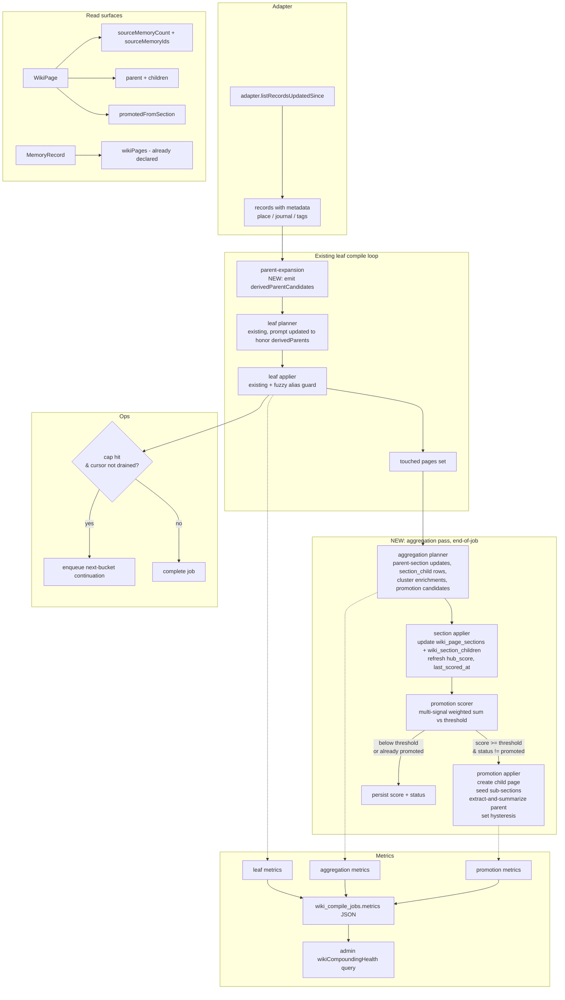
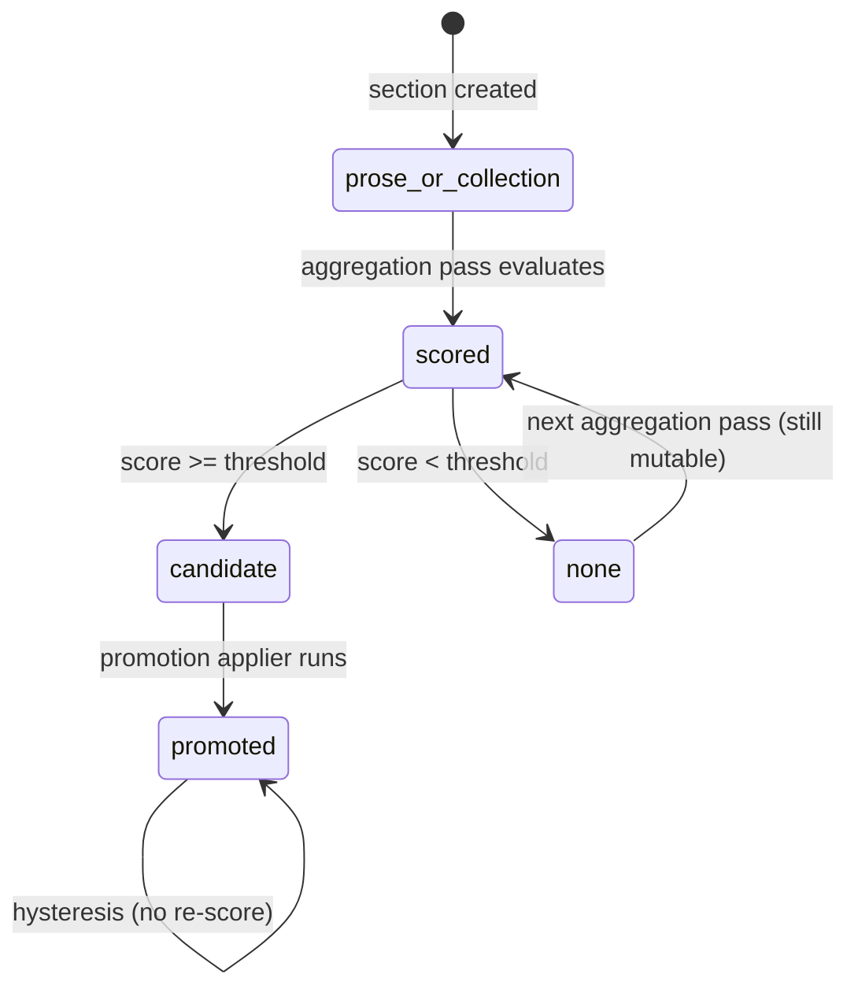

# feat: Hierarchical aggregation for Compounding Memory

## Implementation Status (2026-04-20 refresh)

This plan was drafted 2026-04-19 when only PR 1–5 of `.prds/compounding-memory-v1-build-plan.md` had landed. A day later, a mix of direct-execution PRs + collateral fixes shipped substantial portions of the aggregation engine — often in a slightly different shape than the plan proposed. This section captures what actually exists on `main` so the remaining units below can be scoped against reality, not against the original theory.

| Unit | Original plan status | Actual state on `main` | Shipping refs |
|---|---|---|---|
| Unit 1 — Schema / migration | ❌ not started | ✅ Shipped, denormalized. `parent_page_id`, `hubness_score`, `aggregation` jsonb on sections (carrying `promotion_status`, `promotion_score`, `promoted_page_id`, `linked_page_ids`, etc.), `cluster` jsonb on `wiki_unresolved_mentions`, trigram indexes on aliases + titles. No separate `wiki_section_children` table — children denormalized into `aggregation.linked_page_ids`. | PRs #279-283, #285, #288 |
| Unit 2 — Parent expansion | ❌ not started | ✅ Shipped. `packages/api/src/lib/wiki/parent-expander.ts` exports `deriveParentCandidates()` + `deriveParentCandidatesFromPageSummaries()`. Pure module — no DB lookup. Exact-title page resolution happens in `deterministic-linker.ts` (`emitDeterministicParentLinks`). | PR #285 |
| Unit 3a — Fuzzy alias dedupe | ❌ not started | ✅ Shipped. `findAliasMatchesFuzzy()` in repository.ts, pg_trgm ≥ 0.85, same-type gate in `maybeMergeIntoExistingPage`, `fuzzy_dedupe_merges` metric. Migration `0015_pg_trgm_alias_title_indexes.sql`. | PR #288 |
| Unit 3b — Section activity bump | ❌ not started | ❌ **Still missing.** No `bumpSectionLastSeen()` helper; parent `last_source_at` advances only inside the aggregation pass, not on leaf updates. | — |
| Unit 3c — Continuation chaining | ❌ not started | ❌ **Still missing.** No `MAX_RECORDS_PER_BOOTSTRAP_JOB`, no next-bucket enqueue helper, no `continuation_enqueued` metric. R8 blocked until this lands. | — |
| Unit 4 — Aggregation planner + applier | ❌ not started | ✅ Shipped, inline applier. `aggregation-planner.ts` emits `parentSectionUpdates` + `sectionPromotions` + `newPages` + `pageLinks`. Applier inlined in `compiler.ts:applyAggregationPlan()`. No separate `aggregation-applier.ts` module. Children registered via `aggregation.linked_page_ids`, not a join table. | PR B-series (prior), #285 |
| Unit 5 — Promotion scoring + applier | ❌ not started | ✅ Shipped, inline applier. Pure `promotion-scorer.ts` with 5-signal Jaccard coherence; applier inlined in `compiler.ts`. Hysteresis via `aggregation.promotion_status='promoted'`. Extract-and-summarize writes a summary + top-highlights + link on the parent section. Thresholds lowered from plan's 5.0 composite to `candidate=0.4 / promoteReady=0.55` after real-data tuning. | PR B-series, #285 |
| Unit 6 — Mention cluster enrichment + cluster promotion | ❌ not started | ❌ **Still missing.** `cluster` jsonb slot exists (`co_mentions`, `candidate_parent_page_id`, `observed_tags`) but aggregation planner does not enrich it with `cluster_summary` / `candidate_canonical_titles`, and no promotion path consumes it. Mention-seeded topic creation is not live. | — |
| Unit 7 — Continuation + health metrics + admin query | ❌ not started | 🟡 **Partially shipped.** Most metrics exist in `wiki_compile_jobs.metrics` (`links_written_*`, `fuzzy_dedupe_merges`, `alias_dedup_merged`, `duplicate_candidates_count`, `deterministic_linking_flag_suppressed`). Missing: `continuation_enqueued`, cluster-related metrics, and the `wikiCompoundingHealth` admin GraphQL query. | PR #285 (metrics) |
| Unit 8 — Mobile + GraphQL read surfaces | ❌ not started | ❌ **Mostly missing.** `MemoryRecord.wikiPages` declared but not verified end-to-end. `WikiPage.sourceMemoryCount` / `parent` / `children` / `promotedFromSection` / `sectionChildren` field resolvers do not exist. No "Contributes to:" / "Based on N memories" UI on mobile. The mobile graph viewer (#280, #283) is the one surface that shipped. | PRs #280, #283 |

**New finding from Marco recompile validation on 2026-04-20 (not in original plan):** The aggregation applier creates hub `newPage`s without cross-type dedupe. On Marco, recompile produced 3 new `topic` pages — `Portland, Oregon`, `Tokyo`, `LastMile Data Catalog MCP` — whose titles already belonged to active `entity` pages. The R5 canary (`duplicate_candidates_count`) caught this (went from 1 → 4), but the applier itself should have detected the collision and either reused the existing entity or disambiguated the topic title. See Unit 9 below.

**Recompile validation numbers (Marco, 284 active pages):**

| Metric | Before recompile | After recompile |
|---|---|---|
| Pages linked | 74.7% | 77.5% |
| Reference edges | 382 | 568 |
| `fuzzy_dedupe_merges` | — | 0 (no planner-emitted duplicates to catch in this batch) |
| `links_written_co_mention` | — | 156 |
| `links_written_deterministic` | — | 0 (6 candidates derived, 0 exact-title matches — addresses trigram-fallback gap, see Unit 10) |
| `parent_of` / `child_of` pair count | 3 / 3 | 4 / 4 |
| `duplicate_candidates_count` (R5) | 1 | 4 (the cross-type bug) |

## Overview

Teach the compile pipeline to build hierarchy. Today the compiler produces leaf pages (one per entity) with optional links between them; it does not accumulate related memories into parent-page sections, it does not promote dense sections into their own pages, and it does not score or surface "hubness." The product result is a flat graph of leaves instead of a compounding second brain.

This plan introduces a second aggregation pass that runs after the existing leaf compile, section-level aggregation metadata on `wiki_page_sections`, parent ↔ child page relationships, multi-signal section-to-page promotion with extract-and-summarize behavior on the parent, and the supporting mechanisms (evidence-backed mention clusters, deterministic parent expansion before the LLM, fuzzy alias resolution, continuation chaining, compounding-health metrics, mobile UI for backlinks and navigation).

Canonical acceptance test is the Austin restaurants walkthrough in the origin document: leaves → `Austin.restaurants` section with 20+ backlinks → `Austin Restaurants` page with cuisine sub-sections → `Austin Mexican Restaurants` page when density justifies.

## Problem Frame

See origin: `docs/brainstorms/2026-04-19-compounding-memory-hierarchical-aggregation-requirements.md`. In short:

- The current per-batch, record-first compiler is well-shaped for safe leaf creation but has no mechanism to aggregate related memories into parent-page sections, cluster mentions, canonicalize near-duplicates, or promote dense sections into their own pages.
- The hierarchical aggregation plan (`docs/plans/archived/compounding-memory-hierarchical-aggregation-plan.md`) and research memo (`.prds/compounding-memory-aggregation-research-memo.md`) specify the direction. This plan is the implementation design against the existing v1 code shape.
- The earlier refinement plan (`docs/plans/2026-04-19-001-feat-compounding-memory-refinement-plan.md`, now superseded) addressed fuzzy aliases, evidence recompile, backlink UI, and metrics. Those sub-elements are folded into this plan under the aggregation pass.

## Requirements Trace

Success criteria mirror the nine-item acceptance checklist in the origin doc:

- R1. Leaf pages exist for obvious concrete entities; surface-form variants collapse to one page (no Austin / Austin, TX / ATX fragmentation).
- R2. At least one hub page has a populated aggregation section with ≥ 5 backlinked child pages and a summary grounded in those children.
- R3. At least one section promotion occurs on the smoke-run data if density justifies it; when data density does not justify, promotion scoring is still observable and defensible via metrics.
- R4. Promoted parent section retains extract-and-summarize content (summary + top highlights + pointer to child), not hollowed out.
- R5. Mobile UI surfaces memory → page backlinks ("Contributes to:") and page → memories ("Based on N memories") with drill-in.
- R6. Duplicate-candidate metric trends to zero across repeated compiles of the same data.
- R7. Scope isolation holds: a second agent in the same tenant sees zero overlap in pages / sections / mentions.
- R8. Bootstrap-scale compile (~200 records smoke-run) completes without manual re-trigger (continuation chaining works).
- R9. Aggregation pass is observable as its own metrics slice, distinct from leaf compilation.

## Scope Boundaries

Carried from the origin document's explicit non-goals:

- No new formal page types. Hierarchy emerges from parent links, section promotion, hub behavior. Taxonomy stays `entity | topic | decision`.
- No embeddings layer. `body_embedding` stays NULL.
- No cross-agent aggregation. Every new table, column, query is strictly `(tenant_id, owner_id)` scoped.
- No tenant-shared hub pages.
- No manual page editing UI.
- No automatic cross-page merge of already-promoted pages.
- No full-page rewrites; section-level writes only.
- No changes to the Hindsight retain path.
- No tag ontology imposed; tags are soft hints only.

### Deferred to Separate Tasks

- Operator UI for reviewing promotion candidates, merges, or duplicates: separate PR after v1 lands.
- Cross-agent / team / tenant hubs: future explicit scope model; not v1.
- Replacing `pg_trgm` with embedding similarity: revisit after trigram precision is measured in real data.
- Production rollout + CloudWatch alarm tuning: follow-up PR after dev smoke-run shows metrics trending correctly.
- Full Amy → GiGi bootstrap quality review (all ~2,829 records): separate validation task; smoke-run on 100–200 records is part of this plan's verification.
- Nightly aggregation sweep via the existing `wiki-lint` handler: deferred — v1 runs aggregation inline at end of each compile job.

## Context & Research

### Relevant Code and Patterns

- `packages/api/src/lib/wiki/compiler.ts` — `runCompileJob` orchestration; per-batch planner+apply loop. Aggregation pass and continuation chaining attach here.
- `packages/api/src/lib/wiki/planner.ts` — leaf planner prompt + parser. New aggregation planner lives alongside, not blended.
- `packages/api/src/lib/wiki/section-writer.ts` — narrow section rewriter. Reused for parent section extract-and-summarize and promotion seeding.
- `packages/api/src/lib/wiki/repository.ts` — all `wiki_*` DB primitives. Every new query routes through here with `(tenant_id, owner_id)`.
- `packages/api/src/lib/wiki/templates.ts` — page/section templates. Aggregation sections and promotion-target templates extend this.
- `packages/database-pg/src/schema/wiki.ts` — Drizzle schema home for new columns / tables.
- `packages/database-pg/drizzle/` — existing migration conventions; PR 1 rework showed the hand-edit pattern for `CREATE EXTENSION` statements.
- `packages/api/src/graphql/resolvers/memory/mobileWikiSearch.query.ts` — proven reverse-join pattern (memory → sections → pages). Reuse shape for `memoryCitedByPages` and the new section/child queries.
- `packages/api/src/graphql/resolvers/memory/recentWikiPages.query.ts` — agent-scoped list pattern.
- `packages/database-pg/graphql/types/memory.graphql:30` — `MemoryRecord.wikiPages` GraphQL surface already declared; confirm resolver is wired.
- `packages/database-pg/graphql/types/wiki.graphql` — home for new types (`WikiSectionChild`, `WikiPromotionCandidate`, `WikiCompoundingHealth`).
- `packages/agentcore-strands/agent-container/hindsight_recall_filter.py:46` — established `pg_trgm` threshold 0.85.
- `packages/api/src/lib/memory/adapters/hindsight-adapter.ts:292` — `listRecordsUpdatedSince` returns `ThinkWorkMemoryRecord` with `metadata` JSON (journal, place, tags); deterministic parent expansion reads from there.
- `packages/api/src/lib/wiki/journal-import.ts` — populates `metadata = { idea, place, journal, import }` on retained records; parent expansion relies on that shape.

### Institutional Learnings

- `pg_trgm` threshold 0.85 is the repo's established bar (Hindsight). Reuse; do not invent a new threshold.
- Hindsight tool async pattern (`async def` + fresh client + `aclose()` + retry with exponential backoff) — applies to any new agent-facing tool surface introduced here.
- Fire-and-forget `LambdaClient.send(InvokeCommand, InvocationType: 'Event')` must stay wrapped in try/catch — precedent in `packages/api/src/handlers/scheduled-jobs.ts` and followed today in `packages/api/src/lib/wiki/enqueue.ts`.
- OAuth-federated tenant resolution: GraphQL resolvers must use `resolveCallerTenantId(ctx)` fallback, not `ctx.auth.tenantId` alone (see memory `feedback_oauth_tenant_resolver.md`). Applies to every new GraphQL resolver added here.
- Diagnostic logs must carry exact counters (see memory `feedback_read_diagnostic_logs_literally.md`). Metrics JSON on `wiki_compile_jobs.metrics` is the authoritative log for the aggregation pass.
- Scope-isolation test from PR 5 verification (cross-agent leak check) re-runs after this plan lands; every new surface must respect it.

### External References

None. The feature is grounded entirely in the existing hierarchical aggregation plan, research memo, v1 build plan, and repo patterns. `pg_trgm` is stock Postgres.

## Key Technical Decisions

These resolve the nine "Open questions for planning" from the origin doc plus architectural decisions that follow from the requirements.

1. **Section kinds**: add `section_kind` column on `wiki_page_sections` with values `prose` (default, current behavior) and `collection` (link-dense, aggregates child pages). Prose sections are rewritten by the section-writer from cited memories; collection sections are rewritten from their `wiki_section_children` join. Type determines rewrite path.
2. **Parent ↔ child relationships**: new `parent_page_id` column on `wiki_pages` (nullable, foreign key within the same `(tenant_id, owner_id)`). Additionally, `wiki_page_links` gets a `relationship_kind text not null default 'reference'` column with values `reference | section_child`. The two surfaces co-exist: `parent_page_id` encodes the structural hierarchy (0..1 parent per page), `wiki_page_links` with `relationship_kind='section_child'` encodes section membership (a page can appear as a child in multiple parent sections).
3. **Section-to-child join**: new `wiki_section_children` table (section_id, child_page_id, added_at, rationale nullable, supporting_record_ids jsonb). Unique on (section_id, child_page_id). Counts for promotion scoring are computed from this join, not denormalized.
4. **Mention clusters**: extend `wiki_unresolved_mentions` with new columns (`supporting_record_ids jsonb`, `co_mentioned_aliases jsonb`, `candidate_parent_page_ids jsonb`, `candidate_canonical_titles jsonb`, `cluster_summary text nullable`, `ambiguity_notes text nullable`). No new table — mention lifecycle stays contiguous.
5. **Promotion score**: deterministic weighted sum of five signals with v1 default weights and a single composite threshold. Initial weights and threshold live in env-driven constants so tuning never requires code changes. Starting values match the hierarchical plan's placeholders: `linked_children ≥ 20`, `supporting_records ≥ 30`, `temporal_spread_days ≥ 30`, `tag_coherence ≥ 0.6`, `persistence_runs ≥ 2` across distinct compile runs; composite threshold = 5.0 on the sum of normalized components.
6. **Hysteresis**: once a section's `promotion_status` moves to `promoted`, the aggregation pass never re-scores it. Demotion/merge is operator-driven (deferred).
7. **Coherence (v1, cheap)**: tag overlap via Jaccard on the child pages' observed tags + shared-metadata overlap (e.g., majority share the same `place.city`). LLM-scored coherence is deferred.
8. **Hub score (ranking candidates)**: `hub_score = ln(1 + inbound_links) + ln(1 + distinct_children) + temporal_spread_days / 30`. Cached nullable on `wiki_pages`. Used only to rank candidates when an aggregation pass must bound the number of pages it considers; not a promotion gate.
9. **Aggregation pass placement**: inline at the end of each compile job after the per-batch loop drains. Scoped to pages touched this job plus their resolved parents. No nightly sweep in v1; the existing `wiki-lint` handler could host one in a future PR.
10. **Deterministic parent expansion**: dedicated module `packages/api/src/lib/wiki/parent-expansion.ts` invoked before each planner call. Reads each record's metadata (`metadata.place.city`, `metadata.place.country`, `metadata.journal.id`, `metadata.idea.tags`) plus the owner-scoped page catalog, and emits `derivedParentCandidates[]` that are injected into the planner prompt. Adapter stays pure (records only).
11. **Aggregation planner is a separate module**, not a blended prompt. `packages/api/src/lib/wiki/aggregation-planner.ts` owns its prompt, its output schema (parent section updates, section child registrations, mention cluster enrichments, promotion candidates), and its validation.
12. **Promotion applier is separate from the leaf applier**. `packages/api/src/lib/wiki/promotion.ts` holds scoring; `packages/api/src/lib/wiki/promotion-applier.ts` executes a promotion (create child page, seed sub-sections, extract-and-summarize on parent, set hysteresis status).
13. **Fuzzy alias**: `pg_trgm` similarity ≥ 0.85 on `wiki_page_aliases.alias` and `wiki_unresolved_mentions.alias_normalized`. Type-mismatch gate: a trigram-matched existing page with a different `type` does not merge; treated as a distinct concept.
14. **Continuation chaining**: when a compile job hits a cap and the cursor is not drained, self-enqueue a continuation into the next 5-minute dedupe bucket (`now + 300s`) so it cannot self-dedupe. Keep `MAX_RECORDS_PER_JOB = 500` for `memory_retain` triggers; allow `MAX_RECORDS_PER_BOOTSTRAP_JOB = 1000` for `trigger = 'bootstrap_import'`.
15. **Health metrics** live in `wiki_compile_jobs.metrics` JSON and a single admin GraphQL query `wikiCompoundingHealth(tenantId, ownerId)`. No separate store.
16. **Test-first execution posture** on Units 4 (aggregation planner) and 5 (promotion). Both units are behavior-defining and the pass/fail line is measurable: a fixture that lands a dense Austin.restaurants section and asserts promotion status transitions correctly is the clearest way to keep these units honest.

## Open Questions

### Resolved During Planning

- Section kinds → `prose | collection` column on `wiki_page_sections`.
- Parent ↔ child schema → `parent_page_id` on `wiki_pages` + `relationship_kind` on `wiki_page_links` + `wiki_section_children` join table.
- Mention clusters → extension of `wiki_unresolved_mentions`, no new table.
- Promotion score → deterministic weighted sum, 5 signals, env-driven weights.
- Hub score formula → logarithmic composition of inbound links, distinct children, temporal spread.
- Coherence signal → cheap Jaccard overlap of tags + shared-metadata majority share. LLM coherence deferred.
- Aggregation pass placement → inline at end of compile job. Nightly sweep deferred.
- Parent expansion location → dedicated pre-planner module `parent-expansion.ts`.
- Aggregation planner → separate module, separate prompt, separate schema.
- Continuation chaining → next-bucket dedupe key so continuation can't self-dedupe.
- Trigram threshold → 0.85 (Hindsight precedent).

### Deferred to Implementation

- Final tuning of the five promotion weights after the smoke-run. Initial values are placeholders.
- Exact aggregation planner token budget and sampling behavior when a page has 200+ children (initial guess: hard cap 150 children in prompt input, sample by recency + tag diversity; confirm on real data).
- Whether the leaf planner should also emit a "reinforce parent section" proposal directly, or whether that's exclusively the aggregation planner's job. Initial v1: aggregation planner owns parent sections; leaf planner stays narrow.
- Backfill posture for the `parent_page_id` column on existing compiled pages in dev: likely left NULL on migration; aggregation pass populates it as it runs. Confirm at implementation time.
- Whether `hub_score` needs a maintenance job or can be computed on demand for every compile. Initial v1: computed at end of aggregation pass for touched pages only.

## High-Level Technical Design

> *This illustrates the intended approach and is directional guidance for review, not implementation specification. The implementing agent should treat it as context, not code to reproduce.*



Section states:



## Phased Delivery

The original plan specified three phases. After the 2026-04-20 refresh, Phases 1 and 2 are functionally landed (see status table); the remaining work reorganizes around what the Marco recompile validation revealed. Each PR leaves `main` green and ships behind the existing `tenants.wiki_compile_enabled` + `WIKI_DETERMINISTIC_LINKING_ENABLED` flags.

### ✅ Phase 1 — Foundation (shipped)

- Unit 1: Schema / migration — shipped in denormalized form via PR 1 + PRs #285, #288. Aggregation state lives in `wiki_page_sections.aggregation jsonb` rather than discrete columns.
- Unit 2: Deterministic parent expansion — shipped via PR #285 (pure module + exact-title page lookup in `deterministic-linker.ts`).
- Unit 3a: Fuzzy alias dedupe — shipped via PR #288 (pg_trgm ≥ 0.85, same-type gate, `fuzzy_dedupe_merges` metric).

### ✅ Phase 2 — Aggregation engine (shipped)

- Unit 4: Aggregation planner + applier — shipped. Applier is inlined in `compiler.ts`; children live in the section's aggregation jsonb rather than a join table.
- Unit 5: Promotion scoring + applier — shipped. Thresholds retuned to `candidate=0.4 / promoteReady=0.55` after real-data calibration.

### 🟡 Phase 3 — Operational readiness + correctness (2 PRs)

PR scope reflects real file surfaces after the refresh rather than the original plan's shape.

- **PR A — "compile ops readiness"** (one merge, small surface):
  - Unit 3b — section activity bump on leaf updates.
  - Unit 3c — continuation chaining for bootstrap-scale imports (unlocks R8).
  - Unit 9 — aggregation-applier cross-type duplicate guard (fixes the R5 canary trip surfaced on 2026-04-20 Marco recompile).
  - Unit 10 — trigram-fallback page lookup for the deterministic parent linker (closes the 0-deterministic-links gap observed on Marco).
- **PR B — "admin compounding-health query"**:
  - Residual of Unit 7 — `wikiCompoundingHealth(tenantId, ownerId)` admin GraphQL query + whatever cluster metrics we want from Unit 6 if it ships first.

### 🟢 Phase 4 — Evidence + read surfaces (2 PRs, lower urgency)

- **PR C — Unit 6**: Evidence-backed mention clusters + cluster-aware promotion. Independent of Phase 3; high value but no operator can't-compile-without-this blocker. Safe to defer after Marco validates Phases 1-3 on a real bootstrap.
- **PR D — Unit 8**: Mobile backlink UI + `WikiPage.parent`/`children`/`sourceMemoryCount`/`promotedFromSection` resolvers + `MemoryRecord.wikiPages` end-to-end. Pure UI + GraphQL layer; no compile-pipeline risk.

### Completion gates

The original nine acceptance criteria still apply. Gate them against the phase they finish in:

- R1 (no surface-form fragmentation): needs Phase 3 PR A (Unit 10 in particular).
- R2 (hub section with ≥ 5 backlinks): achievable today on bootstrap-scale data once Phase 3 PR A lands the trigram fallback.
- R3/R4 (promotion + extract-and-summarize): ✅ already observable.
- R5 (mobile backlink UI): Phase 4 PR D.
- R6 (duplicate candidates → 0 on replay): needs Unit 9 (Phase 3 PR A).
- R7 (scope isolation): ✅ holds.
- R8 (bootstrap chains): needs Unit 3c (Phase 3 PR A).
- R9 (metrics observable): Phase 3 PR B (health query).

## Implementation Units

- [x] **Unit 1: Schema + migration for hierarchical aggregation** — shipped in denormalized form (see status table above). No separate `wiki_section_children` table; children live in `aggregation.linked_page_ids`. `section_kind` / `last_scored_at` / `tag_histogram` columns not added — state lives in the `aggregation` jsonb. Acceptable for v1; revisit if children queries become a bottleneck.

**Goal:** Land the entire data model for section kinds, parent-child relationships, section-to-child join, mention clusters, hub score, promotion status, and trigram indexes in one migration so downstream units can assume the model exists.

**Requirements:** R1, R2, R6, R7

**Dependencies:** None.

**Files:**
- Modify: `packages/database-pg/src/schema/wiki.ts`
- Create: `packages/database-pg/drizzle/NNNN_wiki_hierarchical_aggregation.sql` (Drizzle-generated, hand-edited to include `CREATE EXTENSION IF NOT EXISTS pg_trgm;` and index statements Drizzle cannot emit)
- Modify: `packages/database-pg/drizzle/meta/_journal.json` and generated snapshot
- Test: `packages/api/src/__tests__/wiki-schema-aggregation.test.ts`

**Approach:**
- On `wiki_page_sections`: add `section_kind text not null default 'prose'` (values: `prose | collection`), `promotion_status text not null default 'none'` (values: `none | candidate | promoted`), `promoted_to_page_id uuid nullable` (FK to `wiki_pages.id`, owner-scoped check enforced at write time), `promotion_score numeric(6,3) nullable`, `last_scored_at timestamptz nullable`, `tag_histogram jsonb not null default '{}'::jsonb`.
- On `wiki_pages`: add `parent_page_id uuid nullable` (FK to `wiki_pages.id`; application-level check guarantees `(tenant_id, owner_id)` matches the parent), `hub_score numeric(8,3) nullable`, `promoted_from_section_id uuid nullable` (FK to `wiki_page_sections.id` when the page was produced by promotion).
- On `wiki_page_links`: add `relationship_kind text not null default 'reference'` (values: `reference | section_child`). Re-compute the unique index to include kind.
- On `wiki_unresolved_mentions`: add `supporting_record_ids jsonb not null default '[]'::jsonb`, `co_mentioned_aliases jsonb not null default '[]'::jsonb`, `candidate_parent_page_ids jsonb not null default '[]'::jsonb`, `candidate_canonical_titles jsonb not null default '[]'::jsonb`, `cluster_summary text nullable`, `ambiguity_notes text nullable`.
- New table `wiki_section_children`: `(id uuid PK, section_id uuid FK wiki_page_sections ON DELETE CASCADE, child_page_id uuid FK wiki_pages ON DELETE CASCADE, added_at timestamptz default now(), rationale text nullable, supporting_record_ids jsonb not null default '[]'::jsonb)` with `UNIQUE (section_id, child_page_id)` and `INDEX (child_page_id)`.
- Migration script prepends `CREATE EXTENSION IF NOT EXISTS pg_trgm;` and appends `CREATE INDEX CONCURRENTLY` trigram indexes on `wiki_page_aliases.alias gin_trgm_ops` and `wiki_unresolved_mentions.alias_normalized gin_trgm_ops`.
- All new columns default to safe values so existing rows remain consistent; no backfill needed at migration time.

**Patterns to follow:**
- Migration hand-edit pattern from v1 build plan PR 1 rework (`CREATE EXTENSION`, catch-up `ALTER TABLE` statements appended manually).
- Schema conventions already established in `packages/database-pg/src/schema/wiki.ts` (snake_case, `uuid` PKs, `timestamptz`).
- Index shape already present: compound indexes ordered `(tenant_id, owner_id, …)`.

**Test scenarios:**
- Happy path: `pnpm db:generate` produces a clean migration containing all new columns, the new table, and the two trigram indexes.
- Happy path: schema export list still carries every pre-existing `wiki_*` symbol plus the new `wikiSectionChildren` + relations.
- Edge case: extension already installed (Hindsight owns it) — migration is a no-op for the extension; fresh-DB case still succeeds.
- Edge case: existing compiled pages migrate with `parent_page_id = NULL`, sections with `section_kind = 'prose'`, `promotion_status = 'none'` — no behavior change until later units activate the new columns.
- Error path: attempting to insert a `wiki_pages` row with `parent_page_id` pointing at a page in a different `(tenant_id, owner_id)` scope is rejected by the repository layer's check at write time (not at schema level — v1 scope enforcement stays at the repo boundary, same as today).
- Integration: after migration applied on a dev DB, typecheck + api test suite green.

**Verification:**
- Fresh migration SQL inspected by hand.
- Schema snapshot exported; `pnpm tsx -e "import * as s from '@thinkwork/database-pg/schema'; console.log(Object.keys(s).sort())"` lists the new symbols.
- All existing api tests still pass (baseline preserved).

- [x] **Unit 2: Deterministic parent expansion module + leaf planner prompt integration** — shipped. Module is pure (no DB lookup); exact-title page resolution lives in `deterministic-linker.ts` (PR #285). See Unit 10 for the trigram-fallback gap that limits recall on titles like "Portland, Oregon" vs existing "Portland".

**Goal:** Give the leaf planner a pre-computed list of candidate parent pages derived from each record's metadata so the model no longer has to rediscover containment every batch.

**Requirements:** R1, R2

**Dependencies:** Unit 1 (uses `parent_page_id`).

**Files:**
- Create: `packages/api/src/lib/wiki/parent-expansion.ts`
- Modify: `packages/api/src/lib/wiki/planner.ts` (prompt update + input shape)
- Modify: `packages/api/src/lib/wiki/compiler.ts` (invoke parent expansion before each planner call)
- Modify: `packages/api/src/lib/wiki/repository.ts` (add `findPagesByMetadata({ tenantId, ownerId, cityCandidates, journalIds, tags })` read helper)
- Test: `packages/api/src/__tests__/wiki-parent-expansion.test.ts`

**Approach:**
- `parent-expansion.ts` exports `expandParentCandidates({ tenantId, ownerId, records, candidatePages })`. It reads each record's `metadata.place.city`, `metadata.place.country`, `metadata.journal.id`, `metadata.idea.tags`. For each normalized signal, it looks up existing pages in the scope whose title/aliases/metadata match (exact first, trigram fallback), and produces `derivedParentCandidates: Array<{ recordId, leafConceptHint, candidateParent: { pageId?, type, slug?, title, rationale } }>`.
- Each candidate is tagged with its signal (`from: 'place.city' | 'journal.id' | 'tags' | 'place.country'`) so the planner can weigh them.
- Planner prompt extended to include a `Derived parent candidates` section. Prompt instruction adds: "When a derived parent candidate exists in this scope, prefer reinforcing its matching section over creating a new sibling page."
- When no signals hit, the output is an empty array; planner behavior is unchanged.
- Runs per batch; bounded by `records.length × N signals`. No LLM calls in parent-expansion itself.

**Patterns to follow:**
- `packages/api/src/lib/wiki/aliases.ts` — normalization already in place.
- `packages/api/src/lib/wiki/journal-import.ts` — canonical metadata shape for imported records.
- `listPagesForScope` + `inArray` pattern — for the DB lookup.

**Test scenarios:**
- Happy path: a record with `metadata.place.city = "Austin"` and an existing Austin entity page in scope → returns one candidate pointing at the Austin page.
- Happy path: a record with `metadata.journal.id = "trip-2024-03"` and an existing `topic` page titled "Trip 2024-03" → candidate surfaces with `from: 'journal.id'`.
- Edge case: records with no metadata → empty candidate list, no query issued.
- Edge case: metadata references a city that doesn't have a page yet → no candidate produced; the leaf planner may still create the page from evidence, but parent expansion doesn't invent candidates.
- Edge case: two records in the batch point at the same city → deduped to one candidate.
- Error path: metadata malformed (e.g., `place.city` is an object, not a string) → helper skips gracefully with a logged warning; compiler continues.
- Integration: run a fixture batch through `runCompileJob` with parent expansion enabled → planner output includes pageUpdates referencing the derived parent rather than newPage duplicates.

**Verification:**
- Unit tests across signal types.
- Planner regression fixture still parses cleanly with the expanded prompt.
- Metric `parent_expansions` appears on job metrics.

- [ ] **Unit 3: Leaf compiler: fuzzy alias resolution + section activity tracking + continuation chaining skeleton** — **partially shipped.** Fuzzy alias dedupe landed via PR #288 (Unit 3a). Section activity bump on leaf updates (Unit 3b) and continuation chaining skeleton (Unit 3c) remain — see the unwrapped sub-units at the bottom of this list.

**Goal:** Harden the leaf compiler so surface-form variance collapses to one page (no duplicate Austin/ATX pages), so parent-section activity is recorded on every leaf update, and so the compile job's outer loop is shaped to chain continuations once metrics land in Unit 7.

**Requirements:** R1, R5, R6, R8

**Dependencies:** Unit 1 (uses `section_kind`, `parent_page_id`, trigram indexes).

**Files:**
- Modify: `packages/api/src/lib/wiki/repository.ts` (new `findSimilarAlias`, `findPageByFuzzyAlias`, `bumpSectionLastSeen`)
- Modify: `packages/api/src/lib/wiki/compiler.ts` (fuzzy-dedupe guard before newPage; section activity bump in `applyPlan`; continuation decision at job end)
- Modify: `packages/api/src/lib/wiki/aliases.ts` (surface fuzzy helpers)
- Modify: `packages/api/src/lib/wiki/enqueue.ts` (helper for next-bucket dedupe)
- Test: `packages/api/src/__tests__/wiki-alias-fuzzy.test.ts`
- Test: `packages/api/src/__tests__/wiki-continuation-chaining.test.ts`

**Approach:**
- Fuzzy alias: `findSimilarAlias({ tenantId, ownerId, candidateAliasNormalized })` returns `{ pageId, existingAlias, similarity }[]` where `similarity(alias, candidate) ≥ 0.85` using Postgres `similarity()` under `pg_trgm`. Exact-match fast path preserved.
- Fuzzy-dedupe guard: inside `applyPlan`'s newPages loop, before insert, compute seed + proposed aliases; if any fuzzy-matches an existing page of the **same type** in scope, route the proposal onto the existing page as an update + register the new alias forms. Type-mismatch is a no-match.
- Archived pages: never silently resurrect; log + treat as no-match.
- Section activity: when a leaf page update lands, the repository bumps `last_source_at` on the parent's matching collection section (if `parent_page_id` is set). This is the hook that lets the aggregation pass see "this parent section had activity this batch."
- Continuation chaining skeleton: at end of `runCompileJob`, detect `metrics.records_read >= MAX_RECORDS_PER_JOB && cursor_not_drained`. Compute next-bucket dedupe key (`now + 300s`) via a small helper in `enqueue.ts`; enqueue + attempt async invoke. `MAX_RECORDS_PER_BOOTSTRAP_JOB = 1000` gated on `job.trigger === 'bootstrap_import'`. Metrics increment `continuation_enqueued`.

**Execution note:** Fuzzy alias is the highest over-collapse risk in this plan. Start with failing unit tests that cover the threshold bands (0.90 → must merge, 0.80 → must not merge, type mismatch → must not merge) before touching compiler wiring.

**Patterns to follow:**
- `findAliasMatches` signature — keep fuzzy helpers symmetric.
- Enqueue's existing `tenants.wiki_compile_enabled` gate pattern.
- `invokeWikiCompile` fire-and-forget pattern from `enqueue.ts`.

**Test scenarios:**
- Happy path (fuzzy alias): "Austin, TX" planner-proposed newPage collides with existing "austin" alias on an entity page → routes to update; "austin tx" registered as a new alias on the existing page.
- Happy path (section activity): leaf page whose `parent_page_id` is set is updated → parent's matching section's `last_source_at` advances.
- Edge case (fuzzy alias): similarity 0.80 (below threshold) → two pages remain separate.
- Edge case: archived page fuzzy-matches → do not resurrect; log + create new page anyway.
- Edge case: type mismatch (planner emits `topic` "Austin" while `entity` "Austin" exists) → separate pages, logged.
- Error path: `pg_trgm` unavailable locally → fallback to exact-match behavior; log warning.
- Happy path (continuation): bootstrap fixture of 1,500 records → job 1 processes 1,000, enqueues continuation; job 2 processes 500, no continuation (cursor drained).
- Edge case (continuation): records_read reaches exact cap but adapter returns empty next page → no continuation.
- Error path: continuation invoke fails (Lambda down) → pending job row remains; no exception propagates.
- Integration: 3-batch fixture where batch 3 emits "ATX" as newPage while "austin" already exists → final state has one page with both aliases; metric `fuzzy_dedupe_merges = 1`.

**Verification:**
- Job metrics carry `fuzzy_dedupe_merges`, `alias_prematch_hits`, `continuation_enqueued`.
- Scope-isolation test (cross-agent fuzzy match is impossible) re-passes.

- [x] **Unit 4: Aggregation planner module + applier** — shipped. Applier is inlined in `compiler.ts:applyAggregationPlan()` rather than a separate module; output schema carries `parentSectionUpdates + sectionPromotions + newPages + pageLinks` (no `sectionChildRegistrations` or `mentionClusterEnrichments` — those collapse into the aggregation jsonb and into Unit 6 respectively). The cross-type duplicate bug discovered during Marco validation lives in this applier; addressed in Unit 9.

**Goal:** Run a second, narrowly-scoped planner after the leaf compile loop drains. Its job is to update parent-page sections, register section children, propose cluster enrichments, and emit promotion candidates.

**Requirements:** R2, R4, R9

**Dependencies:** Unit 1 (schema), Unit 2 (parent candidates), Unit 3 (touched-pages set propagates through).

**Files:**
- Create: `packages/api/src/lib/wiki/aggregation-planner.ts`
- Create: `packages/api/src/lib/wiki/aggregation-applier.ts`
- Modify: `packages/api/src/lib/wiki/compiler.ts` (invoke aggregation pass at end of per-batch loop)
- Modify: `packages/api/src/lib/wiki/repository.ts` (add `listTouchedParents`, `listChildrenForSection`, `upsertSectionChildren`, `updateSectionPromotionState`)
- Modify: `packages/api/src/lib/wiki/templates.ts` (section template extensions for collection sections on hub entities)
- Test: `packages/api/src/__tests__/wiki-aggregation-planner.test.ts`
- Test: `packages/api/src/__tests__/wiki-aggregation-applier.test.ts`

**Approach:**
- Aggregation input: set of pages touched this job (from Unit 3 section-activity bumps) plus their resolved parents. Bounded by `MAX_AGG_TARGETS_PER_JOB = 20` — excess candidates are deferred to the next job via `last_scored_at` staleness ordering.
- Aggregation planner prompt is separate from the leaf planner. Inputs per target page: page id/type/slug/title/summary, existing sections + their kinds + current child counts, scope's open mentions that fuzzy-match this page's aliases, metadata overlap across children.
- Output schema:
  ```
  {
    parentSectionUpdates: [
      { pageId, sectionSlug, heading?, bodyMd, rationale, sectionKind: "collection"|"prose",
        childPageIds: [ ... ], cluster: { tags: [ ... ], sharedMetadata: { ... } } }
    ],
    sectionChildRegistrations: [
      { pageId, sectionSlug, childPageId, supportingRecordIds: [ ... ], rationale }
    ],
    mentionClusterEnrichments: [
      { mentionId, supportingRecordIds, coMentionedAliases, candidateParentPageIds, candidateCanonicalTitles, clusterSummary, ambiguityNotes }
    ],
    promotionCandidates: [
      { sectionId, reason, suggestedChildTitle, suggestedChildType, suggestedSubSections: [ ... ] }
    ]
  }
  ```
- Applier applies updates through the repository:
  - `updateSection` (existing) on parent section bodies with `section_kind = 'collection'` when the planner says so.
  - `upsertSectionChildren` (new) — idempotent on `(section_id, child_page_id)`; rationale + supporting records appended.
  - `updateSectionPromotionState` (new) when promotion candidates come in (just marks status = `candidate` + stores score — actual promotion is Unit 5).
  - Extend `upsertUnresolvedMention` to honor cluster enrichments (Unit 6 completes this).
- Scope invariants: every write carries `(tenantId, ownerId)`; the aggregation planner only sees pages/sections/mentions from the job's scope.

**Execution note:** Test-first. Write an integration fixture that seeds an Austin entity page + 6 child restaurant entity pages, then runs the aggregation planner and asserts that (a) `Austin.restaurants` section gets updated as `collection`, (b) 6 rows land in `wiki_section_children`, (c) at least one promotion candidate is proposed once mocked thresholds are exceeded. Without this fixture the behavior target is too vague.

**Patterns to follow:**
- Leaf planner structure in `planner.ts` — same `invokeClaude` + `parseJsonResponse` + `validatePlannerResult` pattern.
- `parseJsonResponse` from `bedrock.ts` — reuse for this planner's parsing.
- `isMeaningfulChange` gate from `section-writer.ts` — applied on collection-section body updates to avoid rewrites that don't change anything.

**Test scenarios:**
- Happy path: touched-pages set contains 3 restaurant entities all with `place.city = Austin` → aggregation pass updates `Austin.restaurants` section (kind: collection) + writes 3 rows to `wiki_section_children`.
- Happy path: touched set contains leaves with heterogeneous `place.city` → aggregation pass updates each respective city hub section, no cross-pollination.
- Edge case: a touched page's parent is archived → skip; log `aggregation_skipped_parent_archived`.
- Edge case: section already exists with `promotion_status = 'promoted'` → skip (hysteresis).
- Edge case: more than `MAX_AGG_TARGETS_PER_JOB` candidates → top-ranked by `hub_score` considered; remainder left to next job via stale `last_scored_at`.
- Error path: aggregation planner returns invalid JSON → job continues (aggregation treated as best-effort); metric `aggregation_failed` increments; cursor still advances because leaf compile already committed.
- Error path: applier fails on one target (e.g., FK violation) → one target skipped; others complete; `aggregation_partial_failure` metric increments.
- Integration: end-to-end fixture (6 Austin restaurant leaves + existing Austin entity page + clean mention bucket) → observable `wiki_section_children` rows + `section_kind = 'collection'` + promotion candidate row for `Austin.restaurants` once the threshold is rigged.

**Verification:**
- New metrics populate: `aggregation_targets`, `parent_sections_updated`, `section_children_registered`, `promotion_candidates_proposed`, `aggregation_failed`, `aggregation_partial_failure`.
- Scope-isolation test re-passes; aggregation writes never cross `(tenant, owner)`.

- [x] **Unit 5: Promotion scoring + promotion applier (extract-and-summarize)** — shipped. Pure scorer in `promotion-scorer.ts`; applier inlined in `compiler.ts`. Thresholds were tuned down to `candidate=0.4 / promoteReady=0.55` after real-data evaluation showed the plan's composite=5.0 bar was unreachable on agent-scale density. Hysteresis via `aggregation.promotion_status='promoted'` on the parent section. Extract-and-summarize rewrite shipped as documented.

**Goal:** Turn promotion candidates into actual child pages. Multi-signal score, deterministic threshold, extract-and-summarize behavior on the parent (not hollowing-out), hysteresis so promoted sections never flap.

**Requirements:** R2, R3, R4

**Dependencies:** Unit 4 (candidates + section children).

**Files:**
- Create: `packages/api/src/lib/wiki/promotion.ts` (pure scoring)
- Create: `packages/api/src/lib/wiki/promotion-applier.ts`
- Modify: `packages/api/src/lib/wiki/compiler.ts` (wire applier after aggregation pass)
- Modify: `packages/api/src/lib/wiki/repository.ts` (add `promoteSectionToPage`, `listSectionChildren`, `setSectionPromoted`)
- Modify: `packages/api/src/lib/wiki/templates.ts` (promotion child skeleton: hub-collection sub-sections template)
- Test: `packages/api/src/__tests__/wiki-promotion-scoring.test.ts`
- Test: `packages/api/src/__tests__/wiki-promotion-applier.test.ts`

**Approach:**
- Scoring function in `promotion.ts` is pure and deterministic. Inputs: section children count, distinct supporting records (unioned across children), temporal spread (max - min `updated_at` across supporting records in days), tag coherence (Jaccard across children's observed tags, thresholded), persistence (number of prior compile runs where this section was marked `candidate`). Weights live in env-driven constants with v1 defaults; composite threshold likewise. Returns `{ score, components: {...}, aboveThreshold }`.
- Applier executes a promotion end-to-end as one DB transaction per section:
  1. Create the child page (`type = 'topic'` by default for collection promotions; applier may choose `entity` when the candidate is clearly a named place with children; fall-back rule lives in the module).
  2. Seed the child's sub-sections from the parent-section's cluster evidence (metadata sub-grouping, e.g., cuisine for restaurants).
  3. Move the section's `wiki_section_children` rows from parent → child (re-parent or mirror).
  4. On the parent section: replace body with an extract-and-summarize rewrite — keep a one-paragraph summary + top 3–5 highlighted children + an explicit link to the promoted child page.
  5. Set `promotion_status = 'promoted'`, `promoted_to_page_id = <child id>`, `promotion_score = <score>`, `last_scored_at = now()`.
  6. Set the new child page's `parent_page_id` to the original parent.
  7. Record a `wiki_page_link` with `relationship_kind = 'section_child'` parent → child for breadcrumb rendering.
- Hysteresis: once `promotion_status = 'promoted'`, the aggregation pass (Unit 4) never re-scores that section. Demotion is not in v1.
- Extract-and-summarize rewrite reuses `section-writer.ts` with a new prompt variant that explicitly requests "summary + top highlights + pointer to promoted page." No full-page rewrite; section-level only.

**Execution note:** Test-first. The "extract + summarize, not move + hollow out" rule is the behavior that's easy to silently regress. Write a failing fixture test that asserts the parent section still contains a summary + top highlights + pointer link after promotion before writing the applier.

**Patterns to follow:**
- Transaction pattern in existing `upsertPage` (`db.transaction`).
- Section-writer invocation shape in `compiler.ts`.
- Template registry in `templates.ts`.

**Test scenarios:**
- Happy path: section with 25 children, 50 supporting records, 45-day spread, tag coherence 0.75, persistence 3 → score above threshold → promotion executes; child page exists with sub-sections; parent section has summary + 5 highlights + link.
- Happy path (boundary): scoring inputs exactly at placeholder thresholds → above threshold by ≥ 0.01 (placeholder threshold = 5.0 composite).
- Edge case: section just below threshold → no promotion; `promotion_status` remains `candidate`; `last_scored_at` advances (so we don't re-score until stale).
- Edge case: section with ≥ threshold but `promotion_status = 'promoted'` already → skipped (hysteresis); no duplicate promotion.
- Edge case: promotion target slug already taken by another page in scope → fuzzy alias guard kicks in; applier appends the parent title as a disambiguator (e.g., "Austin Restaurants" → "Austin Restaurants (Austin)").
- Edge case: cluster has no obvious sub-grouping signal → child page seeded with a single "Overview" section + bulleted list of children.
- Error path: applier fails mid-transaction (FK violation) → transaction rolls back; `promotion_status` remains `candidate`; `promotion_failed` metric increments.
- Integration: Austin fixture (Austin entity + 25 restaurant children) → one compile cycle → `Austin Restaurants` topic page exists with cuisine sub-sections (seeded from children's tags), Austin entity's `restaurants` section is a summary + highlights + link, `wiki_page_links` has a `section_child` row.
- Integration (re-run): run the same compile again after promotion → no duplicate promotion; Austin.restaurants stays summary-shape.

**Verification:**
- Metrics: `promotions_executed`, `promotions_failed`, `promotion_extract_summary_length`.
- Acceptance: R3 and R4 observable in the Austin fixture.
- Health query reflects one `promoted` section and one promoted child page.

- [ ] **Unit 6: Evidence-backed mention clusters + cluster-aware promotion** — unchanged from the original plan. The `cluster` jsonb slot exists on `wiki_unresolved_mentions` but the planner enrichment + promotion path do not. Treat the schema-extension bullet points in the original spec as optional — the existing `cluster jsonb` shape (`{ co_mentions, candidate_parent_page_id, observed_tags }`) can absorb `supporting_record_ids`, `cluster_summary`, `ambiguity_notes` as additional keys without a migration.

**Goal:** Turn unresolved mentions into cluster candidates that carry enough evidence to promote directly into aggregate pages, not bare leaves.

**Requirements:** R1, R2, R3, R4

**Dependencies:** Unit 4 (aggregation planner writes cluster enrichments), Unit 5 (promotion applier consumes them).

**Files:**
- Modify: `packages/api/src/lib/wiki/repository.ts` (`upsertUnresolvedMention` honors cluster fields; new `enrichMentionCluster`)
- Modify: `packages/api/src/lib/wiki/aggregation-planner.ts` (already emits cluster enrichments — this unit wires them to repo)
- Modify: `packages/api/src/lib/wiki/promotion.ts` (promotion path for mention clusters emits topic page with summary + candidate canonical title + supporting records as provenance)
- Test: `packages/api/src/__tests__/wiki-mention-clusters.test.ts`

**Approach:**
- Every time a leaf planner emits an `unresolvedMention`, the bucketed row (fuzzy-bucketed per Unit 3's trigram rules) gets appended: `supporting_record_ids` ∪ new record id, `co_mentioned_aliases` ∪ planner-output sibling aliases, capped at 50 each.
- Aggregation planner periodically proposes `cluster_summary` and `ambiguity_notes` on mentions whose bucket has ≥ 3 entries.
- When a cluster's `mention_count ≥ 3` AND `last_seen_at` within 30d AND `cluster_summary` non-null AND ≥ 2 candidate canonical titles agree, the promotion applier accepts it as a topic-page candidate and emits a real page with:
  - `type = 'topic'` (default) or `entity` if the candidate canonical title looks like a named place (heuristic: metadata hit on `place.city` in supporting records).
  - Provenance rows from `supporting_record_ids` on the seeded sections.
- Cluster-aware promotion never creates a new page with zero sections; the planner must have proposed `cluster_summary` first.

**Patterns to follow:**
- Existing `upsertUnresolvedMention` idempotency + `sample_contexts` cap.
- Section-writer call pattern for seeded sections.

**Test scenarios:**
- Happy path: a cluster accumulates over 4 compiles (4 records, 3 co-mentions) → aggregation planner enriches → promotion gate passes → topic page lands with real sections.
- Edge case: cluster has enough count but no `cluster_summary` yet → promotion waits; metric `cluster_promotion_deferred` increments.
- Edge case: two open clusters trigram-match above threshold in a later batch → merge; merged row's `supporting_record_ids` is the union, capped; metric `cluster_merged`.
- Edge case: cluster reaches count threshold with `ambiguity_notes` non-empty → promotion deferred; admin surfaces it in health query.
- Error path: invalid mention payload (missing alias) → aggregation applier skips; metric `cluster_enrichment_skipped`.
- Integration: fixture where 4 batches each emit "taberna do pescador" with different surface forms and different records → final state: one cluster row with 4 supporting records + 3+ co-mentions + cluster_summary → next compile promotes to a real topic page.

**Verification:**
- Health query shows cluster counts and `cluster_promotion_deferred` reasons.
- Metric: `cluster_promotions_executed`.

- [ ] **Unit 7: Continuation chaining activation + compounding-health metrics + admin query** — **partially shipped.** Most compile-side metrics landed via PR #285 (`links_written_*`, `fuzzy_dedupe_merges`, `duplicate_candidates_count`, `deterministic_linking_flag_suppressed`). Still missing: continuation-chaining activation (needs Unit 3c first) + the `wikiCompoundingHealth` admin GraphQL query. Tighten the scope of this unit to "admin query + continuation wiring once 3c lands"; most of the metric scaffolding is done.

**Goal:** Make the bootstrap-scale compile self-complete, and expose whether compounding is actually working.

**Requirements:** R6, R8, R9

**Dependencies:** Units 3, 4, 5, 6 (they emit the metrics; this unit surfaces them).

**Files:**
- Modify: `packages/api/src/lib/wiki/compiler.ts` (wire the full metrics vocabulary into `runCompileJob`)
- Create: `packages/api/src/graphql/resolvers/wiki/wikiCompoundingHealth.query.ts`
- Modify: `packages/database-pg/graphql/types/wiki.graphql` (add `WikiCompoundingHealth` type + `wikiCompoundingHealth(tenantId, ownerId)` admin query)
- Modify: `packages/api/src/graphql/resolvers/wiki/auth.ts` (admin gate on the new query)
- Modify: `packages/api/src/graphql/resolvers/wiki/index.ts` (register query)
- Test: `packages/api/src/__tests__/wiki-compounding-health.test.ts`

**Approach:**
- Extend `wiki_compile_jobs.metrics` JSON with: `parent_expansions`, `alias_prematch_hits`, `fuzzy_dedupe_merges`, `aggregation_targets`, `parent_sections_updated`, `section_children_registered`, `promotion_candidates_proposed`, `promotions_executed`, `promotions_failed`, `cluster_enrichments`, `cluster_promotions_executed`, `cluster_promotion_deferred`, `aggregation_failed`, `aggregation_partial_failure`, `continuation_enqueued`, `hub_scores_computed`.
- Admin query `wikiCompoundingHealth(tenantId, ownerId)` returns:
  - `totalPages`, `leafPages`, `hubPages` (pages with ≥ 1 active child in `wiki_section_children`), `promotedPages`.
  - `pagesWithAtLeastFiveSources`, `avgSourcesPerPage`.
  - `openClusters`, `clustersAwaitingSummary`, `clustersWithAmbiguity`.
  - `duplicateCandidates`: pairs of pages whose titles trigram-match ≥ 0.85 and share type — a retrospective duplication signal used to tune Unit 3's fuzzy threshold.
  - `lastJobMetrics`: the most recent job's metrics JSON verbatim.
- Query is admin-only; re-uses the admin auth check already in `packages/api/src/graphql/resolvers/wiki/auth.ts`.
- Continuation chaining wiring: Unit 3 shipped the decision + enqueue helper; this unit just ensures `continuation_enqueued` lands in metrics and that the chained job carries `trigger = 'bootstrap_import'` when the originator did.

**Patterns to follow:**
- Admin resolver pattern in `compileWikiNow.mutation.ts`.
- Existing metrics shape on `wiki_compile_jobs.metrics`.

**Test scenarios:**
- Happy path: after a fixture compile, `wiki_compile_jobs.metrics` carries every new metric field; zero-values where nothing happened.
- Happy path: admin query returns sensible aggregates against the fixture; `duplicateCandidates = 0` after Unit 3's fuzzy dedupe.
- Happy path: bootstrap trigger with 1,500 fixture records → two jobs chain; admin query reflects both, `continuation_enqueued = 1` on the first.
- Edge case: empty scope → all fields zero; no div-by-zero.
- Edge case: a scope where no job has ever run → query returns empty `lastJobMetrics = null`, other aggregates still zero.
- Error path: non-admin caller → resolver throws existing admin-auth error (not silent empty).
- Integration: smoke-run a 200-record fixture; confirm `pagesWithAtLeastFiveSources > 0` and at least one promotion or one defensible near-promotion in metrics.

**Verification:**
- Query runs cleanly against dev DB.
- CloudWatch shows metrics JSON in compile-job logs.

- [ ] **Unit 8: Mobile backlink UI + parent/child navigation + GraphQL read surfaces** — unchanged. Mobile graph viewer (#280, #283) ships a different surface (force-directed graph over `wikiSubgraph`), not the per-page backlink UI this unit describes. Still a full gap.

**Goal:** Make compounding visible. From any memory record the user can see which compiled pages cite it; from any compiled page the user sees cited memory count + drill-in list + parent breadcrumb + promoted-from linkage + child pages list.

**Requirements:** R5

**Dependencies:** Units 1 (parent_page_id, promoted_from_section_id), 4 (section_children), 5 (promotion linkage).

**Files:**
- Modify: `packages/database-pg/graphql/types/wiki.graphql` (add `WikiPage.sourceMemoryCount`, `sourceMemoryIds(limit)`, `parent: WikiPage`, `children: [WikiPage!]!`, `promotedFromSection: { page: WikiPage, sectionSlug: String }`, `sectionChildren(sectionSlug): [WikiPage!]!`)
- Modify: `packages/database-pg/graphql/types/memory.graphql` (verify `MemoryRecord.wikiPages` resolver; no schema change expected)
- Modify: `packages/api/src/graphql/resolvers/wiki/wikiPage.query.ts` and `mappers.ts` (resolve new fields)
- Modify: `packages/api/src/graphql/resolvers/memory/` (confirm `MemoryRecord.wikiPages` field resolver exists and works end-to-end; add it if missing following `mobileWikiSearch` pattern)
- Modify: `packages/react-native-sdk/src/graphql/queries.ts` and hooks (`use-wiki-page`, `use-memory-record`)
- Modify: `apps/mobile/app/memory/[file].tsx` ("Contributes to:" section)
- Modify: `apps/mobile/app/wiki/[type]/[slug].tsx` ("Based on N memories", parent breadcrumb, children list, "Promoted from:" linkage)
- Test: `packages/api/src/__tests__/wiki-read-surfaces.test.ts`

**Approach:**
- New scalar field resolvers piggy-back on the page row: `sourceMemoryCount` counts `wiki_section_sources` rows across this page's sections; `sourceMemoryIds(limit)` selects a bounded list with preview text via join to memory record preview (truncated to 240 chars).
- `parent`, `children`, `sectionChildren(sectionSlug)` resolve via `parent_page_id` and the new `wiki_section_children` table.
- `promotedFromSection` resolves via `promoted_from_section_id` → `wiki_page_sections` → parent page.
- Owner-scope guard on every field resolver — caller must match the page's `(tenant_id, owner_id)` or be an admin.
- `MemoryRecord.wikiPages` field resolver (already declared in schema) joins `wiki_section_sources` → sections → pages, filtered to the memory's scope.
- Mobile:
  - `memory/[file].tsx` renders a "Contributes to:" card when `wikiPages` is non-empty; tapping a chip navigates to `/wiki/[type]/[slug]`.
  - `wiki/[type]/[slug].tsx` renders: parent breadcrumb (if any), "Based on N memories" with tap-through to a memory list (first 10), a "Promoted from:" link when present, and a children list section grouped by the parent section slug.
- List surfaces (`wikiSearch`, `recentWikiPages`) do **not** preload `sourceMemoryIds`; only detail screens do.

**Patterns to follow:**
- `mobileWikiSearch.query.ts` — existing reverse-join + tenant/owner guard pattern.
- `recentWikiPages.query.ts` — agent-scoped listing shape.
- SDK hook structure in `use-recent-wiki-pages.ts`.
- Mobile screen layout conventions in existing `apps/mobile/app/wiki/[type]/[slug].tsx`.

**Test scenarios:**
- Happy path: memory record with 2 citing pages renders both chips on the detail screen; tapping either navigates to the correct page.
- Happy path: page with 30 cited memories renders `Based on 30 memories` badge; drill-in lists first 10 previews.
- Happy path: a promoted child page shows `Promoted from: Austin > Restaurants` breadcrumb; tapping the pointer link navigates to parent.
- Happy path: parent page renders child list under the collection section slug.
- Edge case: memory with zero citing pages → "Contributes to:" card omitted.
- Edge case: page with no parent → breadcrumb omitted.
- Edge case: admin viewing another agent's scope → breadcrumbs and backlinks still honor the target scope's visibility rules.
- Error path: `sourceMemoryIds(limit)` called with `limit > 50` → capped; no throw.
- Integration: navigate memory → page → parent page → promoted-child page → back to memory record on mobile.

**Verification:**
- Manual mobile check with a seeded fixture.
- Resolver tests green.

### Sub-units added in the 2026-04-20 refresh

These split out the "still pending" pieces of the original Unit 3 and capture the two new gaps Marco recompile validation surfaced.

- [ ] **Unit 3b: Section activity bump on leaf updates**

**Goal:** When a leaf page update lands under a parent (via `parent_page_id`), bump the parent section's `aggregation.last_source_at` so the next aggregation pass can treat it as a freshly-touched candidate. Today the bump only happens inside `applyAggregationPlan`, which means a batch that touched leaves but didn't trigger the aggregation planner leaves parents looking stale.

**Requirements:** R2, R9.

**Dependencies:** Unit 1 (schema — already shipped).

**Files:**
- Modify: `packages/api/src/lib/wiki/repository.ts` (add `bumpSectionLastSeen({ pageId, sectionSlug })` helper)
- Modify: `packages/api/src/lib/wiki/compiler.ts` (call inside the leaf-update path in `applyPlan`)
- Test: extend `packages/api/src/__tests__/wiki-compiler.test.ts`

**Approach:**
- Helper reads the target page's `parent_page_id`; if non-null, looks up the matching `collection`-style section on the parent (via heuristics on `aggregation.linked_page_ids`), and updates `aggregation->'last_source_at'` to `now()` via `jsonb_set` if newer. Idempotent.
- Called once per leaf update at the end of `applyPlan`'s updates + newPages branches.
- Metric: `parent_sections_bumped`.

**Test scenarios:**
- Happy path: leaf with `parent_page_id` set → parent section's `last_source_at` advances.
- Edge case: leaf has no parent → no-op.
- Edge case: parent section's `aggregation` is null → no-op, log.

**Verification:**
- Aggregation pass on a batch that only touched leaves (no newPages, no promotions) still sees those parents as candidates.

- [ ] **Unit 3c: Continuation chaining**

**Goal:** Bootstrap-scale imports (>= 500 records) must self-complete via next-bucket dedupe re-enqueue rather than requiring manual re-trigger. R8 acceptance blocked on this.

**Requirements:** R8.

**Dependencies:** Unit 1 shipped; `enqueue.ts` exists.

**Files:**
- Modify: `packages/api/src/lib/wiki/compiler.ts` (detect cap hit at job end, call enqueue helper)
- Modify: `packages/api/src/lib/wiki/enqueue.ts` (next-bucket helper that floors `now + 300s` and constructs a dedupe key that can't collide with the current bucket)
- Test: `packages/api/src/__tests__/wiki-continuation-chaining.test.ts`

**Approach:**
- New constant `MAX_RECORDS_PER_BOOTSTRAP_JOB = 1000` gated on `job.trigger === 'bootstrap_import'`; keep `MAX_RECORDS_PER_JOB = 500` for other triggers.
- At job end: if `metrics.records_read >= cap` AND `cursor_not_drained`, compute next-bucket dedupe key and call `enqueueCompileJob` + async `invokeWikiCompile` (fire-and-forget per the existing Lambda invoke pattern).
- Metric: `continuation_enqueued` (incremented only when the chain actually landed an inserted row).

**Test scenarios:**
- 1,500-record fixture with `trigger='bootstrap_import'` → job 1 reads 1,000, enqueues continuation; job 2 reads 500 and drains cursor.
- Cap hit exactly with cursor drained → no continuation.
- Enqueue fails (conflict/Lambda down) → metric stays 0, parent job still `succeeded`.

**Verification:**
- `metrics.continuation_enqueued >= 1` on the 1,500-record fixture.
- Retries in `job_log` don't runaway (dedupe key changes per 5-minute bucket).

- [ ] **Unit 9: Aggregation-applier cross-type duplicate guard**

**Goal:** Stop the aggregation applier from creating a new `topic` (or any type) page when an active page of ANY type already exists with the same title in scope. Surfaced on 2026-04-20 Marco recompile — `Portland, Oregon`, `Tokyo`, and `LastMile Data Catalog MCP` got fresh `topic` rows despite active `entity` pages at those titles, tripping the R5 canary (`duplicate_candidates_count` 1 → 4).

**Requirements:** R1, R6 — scope isolation plus "no surface-form fragmentation".

**Dependencies:** Unit 1 shipped.

**Files:**
- Modify: `packages/api/src/lib/wiki/compiler.ts` — `applyAggregationPlan()` newPages loop (currently uses `findPageBySlug(..., type: np.type)` only; add a cross-type check via `findPagesByExactTitle`)
- Modify: `packages/api/src/lib/wiki/repository.ts` — `findPagesByExactTitle` already exists (from PR #285). Reuse it.
- Test: extend `packages/api/src/__tests__/wiki-compiler.test.ts`

**Approach:**
- Before the aggregation applier creates a hub newPage, call `findPagesByExactTitle({ tenantId, ownerId, title: np.title })`. If ANY hit exists (regardless of type), skip the newPage creation, log a structured warning, and increment a new metric `duplicate_candidates_cross_type`.
- When the colliding page is of `type='entity'` and the proposal is `type='topic'`, treat the entity as a candidate for future promotion (Unit 5 already handles that path) — don't silently overwrite.
- Do NOT attempt to auto-merge cross-type; the original shape (entity surviving, topic deferred) is the safer default. Operator-facing alerts via the health query (Unit 7) flag these cases.

**Execution note:** Test-first. Seed a fixture where an entity `"Portland, Oregon"` pre-exists and the aggregation planner emits a `topic` newPage with the same title; assert the topic is NOT created and `duplicate_candidates_cross_type` increments.

**Test scenarios:**
- Happy path: planner emits `topic` newPage with title matching active `entity` → skip, metric increments, entity unchanged.
- Happy path: planner emits `topic` newPage with title matching active `topic` (self-type collision) → existing behavior (findPageBySlug catches it).
- Edge case: matching page is archived → proceed with new creation (archived doesn't shadow).
- Edge case: no matching page → proceed with creation as today.
- Error path: `findPagesByExactTitle` throws → log + proceed (don't block the applier on a read failure).

**Verification:**
- Re-run the Marco recompile validation. `duplicate_candidates_count` should not rise (stays at 1 — the pre-existing `Austin, Texas` pair — until manually addressed).

- [ ] **Unit 10: Trigram-fallback page lookup for the deterministic parent linker**

**Goal:** Close the exact-title recall gap in `deterministic-linker.ts:emitDeterministicParentLinks`. On Marco recompile, the parent-expander derived 6 city/journal candidates but zero produced links because `findPagesByExactTitle` missed parents whose titles differ from the candidate by a common suffix pattern (e.g., candidate `"Portland"` from place.city metadata vs active page titled `"Portland, Oregon"`).

**Requirements:** R1 (+denser graph for sparse agents).

**Dependencies:** PR #285 shipped; PR #288 shipped `pg_trgm` indexes.

**Files:**
- Modify: `packages/api/src/lib/wiki/repository.ts` — add `findPagesByFuzzyTitle({ tenantId, ownerId, title, threshold })` using the trigram GIN index. Mirrors `findAliasMatchesFuzzy` shape.
- Modify: `packages/api/src/lib/wiki/deterministic-linker.ts` — `emitDeterministicParentLinks` tries exact first, falls through to fuzzy at 0.85 when exact returns empty. Same type gate as fuzzy alias dedupe.
- Test: extend `packages/api/src/__tests__/wiki-deterministic-linker.test.ts`

**Approach:**
- Fuzzy path is additive — exact-title remains the primary resolver. Only fires when `findPagesByExactTitle` returned 0 hits.
- Cap at 1 fuzzy hit per candidate (`LIMIT 1` on the trigram query, ordered by similarity DESC).
- Keep the `context` tag format — both exact + fuzzy rows tag as `deterministic:<reason>:<parent_slug>`. No new rollback surface.

**Execution note:** Start with a failing test that seeds a candidate `{reason: "city", parentTitle: "Portland"}` + an active `"Portland, Oregon"` topic page, asserts one `reference` link to the topic.

**Test scenarios:**
- Happy path: candidate `"Portland"` + page `"Portland, Oregon"` (topic, same scope, active) → one link.
- Edge case: exact-title match exists → fuzzy never queried (performance invariant).
- Edge case: fuzzy match is type `decision` → skipped by type gate.
- Edge case: multiple fuzzy matches → pick highest similarity (single row).
- Edge case: `pg_trgm` missing → helper returns empty, behaviour falls back to exact-only (mirrors `findAliasMatchesFuzzy`).

**Verification:**
- Marco recompile produces `links_written_deterministic > 0` (expect the 6 derived candidates to start landing links).

## System-Wide Impact

- **Interaction graph:** `memory-retain` enqueue → `wiki-compile` Lambda → leaf planner (+ parent expansion) → leaf applier → aggregation planner → aggregation applier → promotion scorer → promotion applier → metrics write. Mobile read path gains five new GraphQL fields; admin surface gains one new query.
- **Error propagation:** aggregation pass and promotion pass are best-effort after a successful leaf compile. Failures increment metrics but do not fail the job or rewind the cursor (leaf commits already persisted). Continuation chaining failures never fail the parent job.
- **State lifecycle risks:** promotion is a multi-row transaction. A mid-transaction abort leaves `promotion_status = 'candidate'`; the next aggregation pass re-scores it. Hysteresis guarantees no double-promotion. Section children are an append-only join in v1 — archive behavior is operator-driven and out of scope.
- **API surface parity:** agent tools (`search_wiki`, `read_wiki_page`) are unchanged. The new mobile/admin fields are additive; no breaking changes.
- **Integration coverage:** scope-isolation test (PR 5 verification step 9) must re-pass after every unit. The aggregation applier, promotion applier, and cluster promotion are the three new write paths that must respect the `(tenant, owner)` rule — every write routes through the repository.
- **Unchanged invariants:** still strictly `(tenant_id, owner_id)`-scoped. No `owner_id IS NULL`. No cross-agent aliases, mentions, or section children. No full-page rewrites. Page taxonomy stays `entity | topic | decision`.

## Alternative Approaches Considered

- **Blend aggregation into the leaf planner prompt.** Rejected: the leaf planner already runs at the limits of Haiku 4.5's output budget. Adding parent-section updates, section-child registrations, and promotion candidates to a single prompt risks output truncation and reduces interpretability of metrics ("which planner did that?"). Separate modules give cleaner prompts, cleaner tests, and independent cost accounting.
- **Nightly aggregation sweep instead of inline.** Rejected for v1: inline keeps feedback immediate for bootstrap validation; nightly can be added later via the existing `wiki-lint` handler without disturbing the inline path. Running both is deferred.
- **LLM-scored coherence in v1.** Rejected: a cheap heuristic (Jaccard tag overlap + shared-metadata majority) is sufficient to validate the pipeline shape on smoke data. Replace with LLM if metric analysis shows false positives/negatives.
- **Embeddings for alias resolution.** Rejected: `pg_trgm` at 0.85 is the Hindsight-calibrated bar and stays consistent across the repo. Revisit when real-data duplicate-candidate metrics prove insufficient.
- **Explicit `page_kind = 'leaf' | 'hub'` column.** Rejected: hub behavior is emergent from `parent_page_id` + children count + `hub_score`. A column duplicates state and invites drift.
- **Section-to-page promotion on link count alone.** Rejected: research memo and hierarchical plan both warn against single-threshold promotion ("a burst of 20 links from one short period is not the same as a durable cluster"). Multi-signal score is mandatory.
- **Denormalize children count onto `wiki_page_sections`.** Considered; rejected for v1: count is computed from the join, aggregation pass runs bounded per job. Revisit only if query performance shows up as a real problem.

## Success Metrics

Observable on the Amy → GiGi smoke run (100–200 records):

- `parent_sections_updated ≥ 1` and `section_children_registered ≥ 5` on at least one hub page — R2 acceptance.
- At least one `promotion_candidate_proposed` row whose components map to the documented thresholds — R3 acceptance, even when promotion itself doesn't trip on smoke-run density.
- If promotion trips: `promotions_executed ≥ 1` and the promoted parent section's rewritten body contains a summary + ≥ 3 highlights + an explicit pointer link to the promoted child — R4 acceptance.
- `duplicateCandidates → 0` on repeated compiles against the same input — R1 + R6 acceptance.
- `continuation_enqueued ≥ 1` on a seeded 1,000-record import that exceeds `MAX_RECORDS_PER_JOB` — R8 acceptance.
- Scope-isolation test passes (zero cross-agent rows in new tables) — R7 acceptance.
- Admin health query returns non-empty aggregates reflecting the above — R9 acceptance.

## Risk Analysis & Mitigation

| Risk | Likelihood | Impact | Mitigation |
|------|-----------|--------|-------------|
| Aggregation planner over-proposes promotions, creating noise | Med | Med | Multi-signal score + env-tunable threshold; smoke-run tuning before wider rollout; hysteresis prevents re-promotion churn. |
| Promotion applier extract-and-summarize regresses to "hollow out" | Med | High | Test-first execution posture on Unit 5 with an assertion on parent section body shape; integration fixture re-run validates. |
| Fuzzy alias over-collapses distinct concepts | Med | Med | 0.85 threshold (Hindsight precedent); type-mismatch gate; `duplicateCandidates` health metric catches regressions on real data. |
| Aggregation pass cost per job spikes on dense scopes | Med | Med | Hard cap `MAX_AGG_TARGETS_PER_JOB = 20`, ranked by `hub_score`; remainder deferred via `last_scored_at`. Per-job cost observable via existing Bedrock cost metrics. |
| Continuation chain never terminates (stuck job loop) | Low | High | Jobs log `attempt` and `error` on each run; a pending row with attempts ≥ 5 surfaces in health query for operator intervention. v1 accepts manual unblock; auto-circuit-breaker deferred. |
| pg_trgm extension not installed in some dev env | Low | Low | Migration uses `CREATE EXTENSION IF NOT EXISTS`; Unit 3 fallback returns empty fuzzy results (log warn, continue) so downstream doesn't crash. |
| Mobile query N+1 on memory list view | Low | Med | `sourceMemoryIds` only on detail; list surfaces use scalar `sourceMemoryCount` which is a single aggregate join. |
| Planner-emitted promotion candidate references a stale section id | Low | Low | Applier re-reads the section row inside the transaction; stale references are skipped with a logged metric. |
| Bootstrap-trigger chaining floods the compile queue | Low | Med | `MAX_RECORDS_PER_BOOTSTRAP_JOB = 1000` per job; next-bucket dedupe prevents more than one chain per scope; metric `continuation_enqueued` tracks. |
| Aggregation planner prompt cost per call grows with scope size | Med | Med | Bounded per-target context (max children passed in = 150, sampled by recency + tag diversity); token usage captured in metrics per call. |

## Documentation / Operational Notes

- Update `.prds/compounding-memory-runbook.md` (lands per v1 build plan PR 5) with:
  - How to read each new metric field.
  - How to tune promotion weights and thresholds via env vars.
  - How to force a section re-score (via `resetWikiCursor` + `compileWikiNow`).
  - How to read `wikiCompoundingHealth` during rollout.
- CloudWatch alarms on `promotions_failed > 0` and `aggregation_failed > 0` over 1h: follow-up PR at prod rollout time.
- No mobile app-store release required — all mobile changes ship via the existing TestFlight pipeline.

## Sources & References

- **Origin document:** [docs/brainstorms/2026-04-19-compounding-memory-hierarchical-aggregation-requirements.md](../docs/brainstorms/2026-04-19-compounding-memory-hierarchical-aggregation-requirements.md)
- **Canonical architectural spec:** [docs/plans/archived/compounding-memory-hierarchical-aggregation-plan.md](archived/compounding-memory-hierarchical-aggregation-plan.md)
- **Diagnosis / research memo:** [.prds/compounding-memory-aggregation-research-memo.md](../.prds/compounding-memory-aggregation-research-memo.md)
- **v1 build plan (PR sequence):** [.prds/compounding-memory-v1-build-plan.md](../.prds/compounding-memory-v1-build-plan.md)
- **Scope rule (non-negotiable):** [.prds/compounding-memory-scoping.md](../.prds/compounding-memory-scoping.md)
- **Pipeline logic source:** [.prds/thinkwork-memory-compounding-pipeline-deep-dive.md](../.prds/thinkwork-memory-compounding-pipeline-deep-dive.md)
- **Engineering architecture:** [.prds/compiled-memory-layer-engineering-prd.md](../.prds/compiled-memory-layer-engineering-prd.md)
- **Agent brief:** [.prds/compounding-memory-agent-brief.md](../.prds/compounding-memory-agent-brief.md)
- **Trigram threshold precedent:** `packages/agentcore-strands/agent-container/hindsight_recall_filter.py:46`
- **Reverse-join precedent:** `packages/api/src/graphql/resolvers/memory/mobileWikiSearch.query.ts`
- **Superseded prior direction:** [docs/plans/2026-04-19-001-feat-compounding-memory-refinement-plan.md](./2026-04-19-001-feat-compounding-memory-refinement-plan.md)
