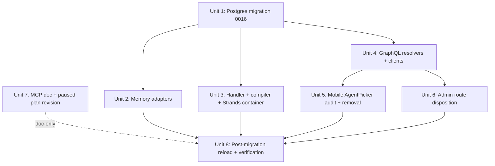

# refactor: User-Scoped Memory + Wiki Migration

## Overview

Move memory and wiki ownership from agent-scoped (`owner_id → agents.id`) to user-scoped (`owner_id → users.id`) across the entire pipeline. Delete the user-facing "agent" concept from mobile and admin. Reserve "subagent" for a future concept; do not preserve `agents` as a vestigial persona surface.

**Migration strategy: drop wiki + Hindsight + AgentCore data, preserve threads, reload wiki from journal-import for Eric and Amy post-migration.** None of this is production data. Users + agents tables stay; their schema is unchanged except for a new uniqueness invariant on `(tenant_id, human_pair_id)` for user-source agents.

**Deploy-skew mitigation:** the memory-retain Lambda accepts both `{agentId}` and `{userId}` payload shapes during the cutover window. If `agentId` is present and `userId` is absent, the handler resolves `userId` via `agents.human_pair_id`. This makes CI deploy order tolerant and neutralizes the fire-and-forget retain skew risk. A follow-up PR removes `agentId` acceptance.

## Problem Frame

Per origin document:

- Every user has exactly one agent today; the agent-as-owner abstraction is speculative flexibility that has not been redeemed.
- MCP exposure forces an awkward "agent picker at connect time" for a list of one.
- Mobile renders an `AgentPicker` that always shows a single entry.
- Cross-agent reasoning ("what did I learn last month") is structurally impossible under agent scope.
- Compiler + adapters (Hindsight bank IDs, AgentCore namespaces) key specialization assumptions off a dimension nobody varies.

## Requirements Trace

- **R1.** Memory + wiki ownership is user-scoped end-to-end: schema, adapters, compiler, GraphQL, MCP surface.
- **R2.** Auth check on wiki/memory resolvers is composite: derive `callerUserId` + `callerTenantId` via `resolveCaller(ctx)` (**not** `ctx.auth.principalId` directly — that's the Cognito sub, which diverges from `users.id` for Google-federated accounts), then require `callerUserId === args.userId` AND `callerTenantId === args.tenantId`.
- **R3.** User-facing "agent" concept is removed from mobile (`AgentPicker` + functional-routing picker audit) and admin (delete or defer the 12 `$agentId_*` routes per per-route disposition).
- **R4.** Strands runtime container `api_memory_client.py` flips retain payload from `{agentId}` to `{userId}`. Deploy order is neutralized by the dual-payload Lambda compat mode.
- **R5.** MCP requirements doc + paused plan revision land with this migration (agent-picker deletion, token claims flip, synthetic-thread derivation change, credential scrubber expansion, per-user opt-in flag). MCP plan (`docs/plans/2026-04-20-008-feat-memory-wiki-mcp-server-plan.md`) stays paused; unpause is a separate PR after this migration merges.
- **R6.** Wiki compile handling of external-origin retains is default-off, gated on a **per-user** flag `users.wiki_compile_external_enabled` (not per-tenant — per the `feedback_user_opt_in_over_admin_config` invariant: user opt-in, admin owns infra).
- **R7.** Migration sequence: validate invariant → drop FKs → TRUNCATE wiki tables → UPDATE threads (derive `user_id` from `agent_id` → `agents.human_pair_id`) → rename `threads.agent_id` column → add FKs to `users.id` → wipe Hindsight schema + delete AgentCore namespaces → redeploy code → run journal-import for Eric + Amy.
- **R8.** Test coverage: cross-user-within-tenant isolation fixture, cross-tenant-member isolation fixture (user A home=T1, member of T2, must 403 on `{tenantId: T2}`), credential-redaction on all retain string fields (content, tags, metadata, threadId), `/wiki?view=graph` + `/memory?view=graph` cold-load regression, post-migration journal-import rebuild smoke.
- **R9.** `ON CONFLICT` paths in the wiki/memory pipeline are audited for silent-write-drop risk when unique indexes are reshaped. Enumerated scope: 17 files (see Unit 3). Reference: `docs/solutions/logic-errors/compile-continuation-dedupe-bucket-2026-04-20.md`.
- **R10.** Schema enforces "one agent per user" via `UNIQUE (tenant_id, human_pair_id) WHERE source = 'user' AND human_pair_id IS NOT NULL`. The UX simplification (delete `AgentPicker`) leans on this invariant; the schema must codify it.

## Scope Boundaries

**In scope:**

- Schema migration (4 wiki tables with `owner_id` FK flip; `threads.agent_id` → `threads.user_id` rename; `agents` uniqueness constraint; `users.wiki_compile_external_enabled` column).
- Truncation of wiki tables; wipe of `hindsight.memory_units`; deletion of AgentCore namespaces.
- Memory adapters (Hindsight + AgentCore): user-derived bank/namespace naming; removal of all `ownerType: 'agent'` literals.
- Memory-retain handler + recall-service + compiler + journal-import (including `bootstrapJournalImport` mutation).
- GraphQL schema + resolvers (directory sweep of `packages/api/src/graphql/resolvers/wiki/` and `packages/api/src/graphql/resolvers/memory/`); `memoryGraph.query.ts` special-cased (it reads `agent.slug` to build a Hindsight bank_id SQL query).
- Strands container `api_memory_client.py` + `wiki_tools.py` (the latter has hand-written GraphQL with `$ownerId: ID!`).
- CLI hand-written GraphQL queries under `apps/cli/src/commands/wiki/` (regen alone does not fix hand-authored strings).
- Mobile `AgentPicker` removal + per-file audit of four local-picker screens (heartbeats, code-factory-repos, integrations, threads) for functional routing vs. memory scope.
- Admin agent-route disposition (per-route: DELETE or DEFER with explicit regression documentation).
- Post-migration reload: run journal-import for Eric and Amy to rebuild wiki + Hindsight memory under user scope.
- MCP requirements doc + paused plan revision (doc-only unit).

**Out of scope (explicit non-goals):**

- Subagents / multi-persona per user.
- Cross-user or cross-tenant memory federation.
- Preserving Hindsight / AgentCore / wiki data (user confirmed drop-and-reload is acceptable).
- Preserving threads' `agent_id` linkage (threads reparent in place via `human_pair_id` derivation).
- Cognito pre-token trigger for `userId` claim (use `resolveCaller(ctx)` fallback).
- Backward compatibility shims beyond the single-release dual-payload Lambda window.
- Reflect-parity across adapters.

### Deferred to Separate Tasks

- **MCP server implementation** — `docs/plans/2026-04-20-008-feat-memory-wiki-mcp-server-plan.md` paused until this migration merges. Unpause trigger: this PR merged + 1 week of no regression signal.
- **Admin scheduled-jobs, workspaces, skills, knowledge-bases routes** — these live under `_tenant/agents/$agentId_*` but are not memory/wiki surfaces. Explicit functional regression documented in Unit 6; replacement surfaces are follow-up work.
- **MCP user-deletion token revocation (security-lens SEC1)** — not folded into this plan; tracked as a precondition for MCP plan unpause.
- **Remove Lambda dual-payload compat mode** — separate PR after this migration stabilizes.
- **Mobile nav IA redesign** — this plan ships the copy table + empty-state spec + thread list sort order, not the full IA rework.
- **Cross-context scoping primitive** (tags/workspaces) — defer until MCP surfaces multi-client friction.
- **Cognito pre-token trigger** — follow-up that removes the DB round-trip in `resolveCaller`.
- **Learning doc** — written post-merge as `docs/solutions/best-practices/user-scope-migration-YYYY-MM-DD.md`; captured as part of Unit 8 but authored after integration tests pass.

## Context & Research

### Relevant Code and Patterns

- **Schema:** `packages/database-pg/src/schema/wiki.ts` (4 tables with `owner_id`: `wiki_pages`, `wiki_compile_jobs`, `wiki_compile_cursors`, `wiki_unresolved_mentions`; cascade-scoped: `wiki_page_sections`, `wiki_page_aliases`, `wiki_page_links`, `wiki_section_sources`). `packages/database-pg/src/schema/core.ts` (users: `tenant_id` nullable FK; `email` unique). `packages/database-pg/src/schema/agents.ts` (`human_pair_id` nullable FK to users). `packages/database-pg/src/schema/threads.ts` (`agent_id` nullable FK; child tables: `thread_comments`, `thread_attachments`, `messages`, `thread_dependencies`). **Note:** `packages/database-pg/src/schema/memory.ts` does **not** exist — memory records live in Hindsight's external schema `hindsight.memory_units`.
- **Drizzle migrations:** `packages/database-pg/drizzle/0000–0015_*.sql`. Hand-edits allowed (precedent: `0015_pg_trgm_alias_title_indexes.sql`). Next is `0016_user_scoped_memory_wiki.sql`.
- **Memory adapters:** `packages/api/src/lib/memory/adapters/hindsight-adapter.ts` — `resolveBankId` joins `agents.slug`; hardcoded `ownerType: 'agent'` literals at lines 262, 336–340, 376, 393 (must all be removed). `packages/api/src/lib/memory/adapters/agentcore-adapter.ts` — namespace prefix `assistant_${agentId}`. No adapter tests exist in the repo.
- **Memory handler:** `packages/api/src/handlers/memory-retain.ts` (currently rejects payloads missing `agentId`). Invocation: `packages/agentcore-strands/agent-container/api_memory_client.py` — **`InvocationType=Event`, fire-and-forget** (line 79). Errors are logged and swallowed per comment at lines 10–13. This is why dual-payload compat in the Lambda is the right skew mitigation rather than error propagation.
- **Compiler + journal-import:** `packages/api/src/lib/wiki/compiler.ts`, `packages/api/src/lib/wiki/journal-import.ts`, `packages/api/src/graphql/resolvers/wiki/bootstrapJournalImport.mutation.ts`.
- **GraphQL:** every file under `packages/api/src/graphql/resolvers/wiki/` and `packages/api/src/graphql/resolvers/memory/`. Auth helpers: `packages/api/src/graphql/resolvers/wiki/auth.ts` (`assertCanReadWikiScope` — currently checks agent-tenant membership), `packages/api/src/graphql/resolvers/core/resolve-auth-user.ts` (`resolveCaller`, `resolveCallerUserId`, `resolveCallerTenantId` — **already implemented**; `resolveCaller` collapses principalId + email fallback to `users.id`).
- **Critical special case:** `packages/api/src/graphql/resolvers/memory/memoryGraph.query.ts:36` reads `agent.slug` to build a Hindsight `bank_id` in its own SQL query. This is not a GraphQL arg rebind — it's a direct data coupling to the agents table. Must be refactored to user-derived bank naming.
- **Strands hand-written GraphQL:** `packages/agentcore-strands/agent-container/wiki_tools.py:39–56` has `query WikiSearch($tenantId: ID!, $ownerId: ID!, ...)` and `query WikiPage($tenantId: ID!, $ownerId: ID!, ...)`. Must be edited alongside schema rename.
- **CLI hand-written GraphQL:** `apps/cli/src/commands/wiki/compile.ts:79` (`ownerId: target.id`), plus other files under `apps/cli/src/commands/wiki/`. Hand-edited, not codegen-only.
- **Mobile AgentPicker:** `apps/mobile/components/chat/AgentPicker.tsx`. Direct imports: `ChatScreen.tsx`, `QuickChatCard.tsx`, `apps/mobile/app/(tabs)/index.tsx`. Local picker state in: `apps/mobile/app/threads/index.tsx`, `settings/integrations.tsx`, `heartbeats/new.tsx` (**mutation requires `agentId`** — routing, not memory scope), `settings/code-factory-repos.tsx` (**navigates to `/agents/${repo.agentId}/code-factory`** — a route this plan's Unit 6 deletes; must decide replacement).
- **Admin routes to dispose:** `apps/admin/src/routes/_authed/_tenant/agents/` — 12 files, 4,818 lines total. `$agentId_.scheduled-jobs.$scheduledJobId.tsx` (537 LOC CRUD), `$agentId_.workspace.tsx` (706 LOC), `$agentId_.workspaces.tsx` (607 LOC), `$agentId_.skills.tsx` (591 LOC), `invites.tsx` (665 LOC), etc. Per-route disposition required.
- **Admin wiki + memory entry points:** `apps/admin/src/routes/_authed/_tenant/wiki/index.tsx` and `memory/index.tsx`. Today support multi-agent views (`agentId={isAllAgents ? undefined : selectedAgentId}` at lines 372–373 of wiki/index.tsx). Flipping to user scope requires a decision: single-admin-only or multi-user admin inspection (Unit 6 picks single-admin-only for v0).
- **GraphQL codegen:** per-app `pnpm codegen` in `apps/admin`, `apps/mobile`, `apps/cli`. Generated files tracked in git. Hand-authored query files in admin + mobile.
- **MCP docs to revise:** `docs/brainstorms/2026-04-20-thinkwork-memory-wiki-mcp-requirements.md` and `docs/plans/2026-04-20-008-feat-memory-wiki-mcp-server-plan.md`. Both untracked today (created this session); Unit 7 edits assume they are committed to `main` before this migration PR opens.
- **CI workflow:** `.github/workflows/deploy.yml` lines 82–126 run `build-container` and `build-lambdas` in parallel; `terraform-apply` depends on both (line 131). There is no mechanism to force Lambda deploy before container deploy. This is why R4 + dual-payload compat is the right answer, not sequencing.

### Institutional Learnings

- `docs/solutions/logic-errors/compile-continuation-dedupe-bucket-2026-04-20.md` — `ON CONFLICT DO NOTHING` silently drops writes when unique indexes are reshaped. Audit scope (R9): 17 files total (`grep onConflict`: wiki/repository.ts, hindsight-cost.ts, cost-recording.ts, skills.ts, chat-agent-invoke.ts, eval-runner.ts, evaluations/index.ts, wakeup-processor.ts, bootstrapUser.mutation.ts, orchestration/upsertWorkflowConfig.mutation.ts, setAgentSkills.mutation.ts, wiki-link-backfill.test.ts; plus raw `ON CONFLICT` in compiler.ts, enqueue.ts, evaluations/index.ts, upsertWorkflowConfig.mutation.ts, repository.ts).
- `docs/solutions/logic-errors/admin-graph-dims-measure-ref-2026-04-20.md` — admin `/wiki?view=graph` + `/memory?view=graph` cold-load path is fragile around urql cache keys. GraphQL rename will invalidate cache; include cold-load smoke test in Unit 6.

### Carried MEMORY.md Rules

- `pnpm only` — no `npm` in the monorepo.
- `feedback_graphql_deploy_via_pr` — no direct `aws lambda update-function-code graphql-http`; merge to main, let CI deploy.
- `feedback_user_opt_in_over_admin_config` — integration/opt-in settings live on user, not tenant. R6 flag is per-user.
- `feedback_worktree_isolation` — use `.claude/worktrees/<name>` off `origin/main` for this work; the current checkout has multiple in-flight changes.
- `feedback_verify_wire_format_empirically` — curl the live retain invocation before and after Strands deploy; attach payload diff to PR body.
- `project_oauth_tenant_resolver` — Google-federated users have null `ctx.auth.tenantId`; `resolveCaller(ctx)` already handles this via email linkage to `users.id`.

## Key Technical Decisions

- **Postgres: in-place for threads, truncate-and-reload for wiki.** Threads are conversation history (dropping would lose TestFlight chat continuity for Eric and Amy). Wiki rebuilds cleanly from journal-import. This is a hybrid of the brainstorm's "drop everything" and a preservation approach — the split reflects cost-to-preserve: threads reparent cheaply via existing `agents.human_pair_id`, wiki reload is effectively free via the already-working journal-import pipeline.
- **External stores (Hindsight + AgentCore): drop + reload from journal.** User confirmed acceptable. Simplest possible external-store handling; journal-import reruns produce fresh user-scoped banks and namespaces. No copy-old-to-new migration, no deletion manifest, no bank-naming transition.
- **Deploy skew: dual-payload Lambda compat mode.** CI cannot enforce "Lambda before container" ordering (both ship via `terraform-apply`; `build-container` runs `aws lambda update-function-code` in parallel). The memory-retain Lambda accepts both `{agentId}` and `{userId}`; if `agentId` is present and `userId` is absent, the handler resolves `userId = (SELECT human_pair_id FROM agents WHERE id = :agentId)` with a deprecation-warning log. A follow-up PR removes `agentId` acceptance once observed traffic is 100% `userId`.
- **Auth check uses `resolveCaller(ctx)`, NOT `ctx.auth.principalId`.** `principalId` is the Cognito sub, which diverges from `users.id` for Google-federated users (the production auth path). `resolveCaller(ctx)` already collapses principalId + email fallback to `users.id`. The composite check is `callerUserId === args.userId AND callerTenantId === args.tenantId`.
- **GraphQL field rename: `ownerId` → `userId` outright.** All three in-repo clients regenerate in the same PR. Hand-written query strings in `wiki_tools.py` and `apps/cli/src/commands/wiki/*.ts` edited in parallel.
- **Postgres column naming: `wiki_*.owner_id` stays; `threads.agent_id` → `threads.user_id`.** Wiki's `owner_id` is semantically generic (it's "the owner", which happens to now be a user); only `threads.agent_id` names the wrong thing. Keeping wiki column name minimizes index/PK churn. Schema.ts types and Drizzle mappings are adjusted at the TypeScript layer.
- **Hindsight bank naming: `user_${userId}` UUID-based.** No `users.slug` addition. Loses human-readable bank names; acceptable for dev-scale operability given the adapter-layer abstraction.
- **Agents uniqueness: add `UNIQUE (tenant_id, human_pair_id) WHERE source = 'user' AND human_pair_id IS NOT NULL`.** The "one agent per user" invariant that the UX leans on is currently only a behavioral convention. Codify it in the schema so future drift doesn't silently break the mobile chat path.
- **R6 flag is per-user (`users.wiki_compile_external_enabled`), NOT per-tenant.** Per Eric's `feedback_user_opt_in_over_admin_config` memory rule: per-user opt-in for external data ingestion; admin owns infra only.
- **Null-guard enforcement via shared `requireUserScope(ctx, args)` helper.** Not per-resolver inline check. Every wiki/memory resolver must call this as its first statement; a lint rule or grep-based test verifies this across the 14+ resolver files.
- **Admin wiki/memory views: single-admin-only scope for v0.** Each admin sees only their own user's wiki/memory. Multi-user admin inspection (for support/debug) is a follow-up; current mobile is single-user-per-tenant so this is functionally equivalent to today.
- **Threads null-handling: fail migration if any thread's agent lacks `human_pair_id`.** Do not silently drop threads. The `UPDATE` in Unit 1 is followed by `SELECT COUNT(*) FROM threads WHERE user_id IS NULL` — non-zero halts migration.
- **Strands retain invocation: stays `InvocationType=Event` (fire-and-forget).** The compat-mode Lambda means skew window is benign; flipping to `RequestResponse` is a separate ergonomics improvement, not a skew fix. A CloudWatch alarm on `MISSING_USER_CONTEXT` error rate covers visibility.
- **MCP plan (008) stays paused.** Unpause trigger is this PR merged + 1 week of regression monitoring. User-deletion token revocation (SEC1) moves to the MCP plan's unpause preconditions — not piggybacked into Unit 7.
- **Strategic positioning: ThinkWork is a personal knowledge brain.** Single user-scoped assistant surface. This is a deliberate divergence from ChatGPT GPTs / Claude Projects / Cursor agents. Subagents (if ever) ship as a read-through specialist layer over the same user brain, not as persona-owned sub-brains; re-introducing user-visible personas would require admin UI, mobile nav changes, and a migration cost that is acknowledged but deferred.

## Open Questions

### Resolved During Planning

- Postgres truncation vs. in-place for wiki — **truncate + reload from journal** (user confirmed).
- External store handling — **drop + reload** (user confirmed).
- Auth composite check semantics — **`resolveCaller(ctx)`, not `principalId`**.
- Deploy skew mitigation — **dual-payload Lambda compat**.
- R6 flag granularity — **per-user**.
- Admin wiki/memory view scope — **single-admin-only**.
- Hindsight bank naming — **`user_${userId}` UUID-based**.
- GraphQL field naming — **rename outright**.
- Thread null-handling — **halt migration on any null**.
- Agents uniqueness constraint — **add in Unit 1**.
- User-to-tenant cardinality — **home tenant only via `users.tenant_id`**.

### Deferred to Implementation

- **ON CONFLICT per-path audit disposition** — Unit 3 enumerates 17 files but per-path decision (add `inserted` assertion, change conflict action, or leave as-is) is made at implementation time.
- **Mobile per-picker audit outcomes** — Unit 5 states the audit approach; the concrete per-file decision (auto-bind vs. delete vs. defer) is made when the implementer reads the mutation/route code.
- **Admin per-route disposition details** — Unit 6 sets the default disposition per route category; borderline cases (e.g., `$agentId.tsx` — pure detail view or residual settings?) are implementation calls.
- **Journal-import rebuild verification criteria** — Unit 8 runs the import and checks wiki_pages count > 0 and the Austin restaurant subset appears for Eric; exact count parity is not asserted because compile is non-deterministic.

## High-Level Technical Design

> *Directional guidance for review, not implementation specification.*

### Unit dependency graph



### Lambda compat mode (cutover window)

```
retain payload accepted:
  {tenantId, userId, threadId, messages}           → normal path
  {tenantId, agentId, threadId, messages}          → resolve userId via agents.human_pair_id; log deprecation warn
  {tenantId, agentId, userId, threadId, messages}  → normal path, ignore agentId
  missing both agentId + userId                    → MISSING_USER_CONTEXT error (logged + alarmed)
```

## Output Structure

New files created by this plan:

    packages/database-pg/drizzle/
      0016_user_scoped_memory_wiki.sql

    packages/api/src/lib/memory/adapters/__tests__/
      hindsight-adapter.user-scope.test.ts
      agentcore-adapter.user-scope.test.ts

    packages/api/src/graphql/resolvers/__tests__/
      user-scope-isolation.test.ts                          # cross-user-within-tenant + cross-tenant-member

    packages/api/src/graphql/resolvers/core/
      require-user-scope.ts                                 # shared auth-guard helper

    scripts/
      wipe-external-memory-stores.ts                        # drop Hindsight + AgentCore data (dev scale)
      reload-from-journal.ts                                # run journal-import for Eric + Amy post-migration

    docs/solutions/best-practices/
      user-scope-migration-YYYY-MM-DD.md                    # post-landing

## Implementation Units

- [ ] **Unit 1: Postgres migration 0016 (threads in-place, wiki truncate)**

**Goal:** Land Drizzle migration that flips wiki table FKs to `users`, reparents threads via `human_pair_id`, truncates wiki data, adds `users.wiki_compile_external_enabled`, adds uniqueness constraint on `agents`. Paired schema.ts edits.

**Requirements:** R1, R7, R10.

**Dependencies:** None (gate for all code units).

**Files:**
- Create: `packages/database-pg/drizzle/0016_user_scoped_memory_wiki.sql`
- Create: `packages/database-pg/drizzle/meta/0016_snapshot.json` (drizzle-kit generate)
- Modify: `packages/database-pg/src/schema/wiki.ts` (flip FK targets; unique-index tuple `(tenant, user, type, slug)`; `wiki_compile_cursors` PK recomposed)
- Modify: `packages/database-pg/src/schema/threads.ts` (rename `agent_id` → `user_id`; FK to `users.id`)
- Modify: `packages/database-pg/src/schema/agents.ts` (add partial unique index)
- Modify: `packages/database-pg/src/schema/core.ts` (add `users.wiki_compile_external_enabled boolean NOT NULL DEFAULT false`)

**Approach:**
- Hand-edit the drizzle-generated migration to encode this ordering:
  1. **Pre-flight validation:** `SELECT COUNT(*) FROM threads t JOIN agents a ON a.id = t.agent_id WHERE a.human_pair_id IS NULL`. If > 0, raise and halt — do not silently drop threads.
  2. Drop FK constraints on the 4 wiki tables referencing `agents.id`.
  3. Drop FK constraint on `threads.agent_id`.
  4. `ALTER TABLE threads ADD COLUMN user_id uuid`.
  5. `UPDATE threads SET user_id = (SELECT human_pair_id FROM agents WHERE id = threads.agent_id)`.
  6. `ALTER TABLE threads ALTER COLUMN user_id SET NOT NULL`.
  7. `ALTER TABLE threads DROP COLUMN agent_id`.
  8. `TRUNCATE wiki_pages, wiki_compile_jobs, wiki_compile_cursors, wiki_unresolved_mentions CASCADE` (cascades to `wiki_page_sections`, `wiki_page_aliases`, `wiki_page_links`, `wiki_section_sources`).
  9. Recreate `wiki_compile_cursors` PK as `(tenant_id, owner_id)` referencing `users.id`.
  10. Add FKs on all 4 wiki tables' `owner_id` to `users.id`.
  11. Add `threads.user_id` FK to `users.id`.
  12. Create partial unique index: `CREATE UNIQUE INDEX uq_agents_user_pair ON agents (tenant_id, human_pair_id) WHERE source = 'user' AND human_pair_id IS NOT NULL`.
  13. `ALTER TABLE users ADD COLUMN wiki_compile_external_enabled boolean NOT NULL DEFAULT false`.
- **Thread child tables** (`thread_comments`, `thread_attachments`, `messages`, `thread_dependencies`): these reference `threads.id` (not `agent_id`), so rename is transparent to them. Verified via schema inspection.
- Pre-migration point: `pg_dump` snapshot captured in the PR body for rollback.

**Execution note:** Run against a scratch DB first to confirm cascade behavior; record the `pg_dump` command + snapshot location in the PR body.

**Patterns to follow:**
- Hand-edited migration precedent: `packages/database-pg/drizzle/0015_pg_trgm_alias_title_indexes.sql`.

**Test scenarios:**
- **Happy path:** `pnpm --filter database-pg db:push` on scratch DB completes; `SELECT COUNT(*) FROM wiki_pages WHERE owner_id NOT IN (SELECT id FROM users)` returns 0.
- **Happy path:** `SELECT COUNT(*) FROM threads WHERE user_id IS NULL` returns 0 post-migration.
- **Happy path:** `uq_agents_user_pair` index rejects a second user-source agent for the same `(tenant_id, human_pair_id)`.
- **Edge case:** thread with `agent_id` pointing to an agent whose `human_pair_id IS NULL` → migration raises in step 1, rolls back.
- **Edge case:** `users.wiki_compile_external_enabled` default is `false` for all existing rows.
- **Integration:** `pnpm -r typecheck` passes after schema.ts propagates.

**Verification:** Migration applies cleanly; pre-migration `pg_dump` recorded in PR body.

---

- [ ] **Unit 2: Memory adapter refactor + external data wipe**

**Goal:** Flip Hindsight + AgentCore adapters to user-derived bank/namespace naming. Remove all `ownerType: 'agent'` literals. Wipe existing Hindsight rows and AgentCore namespaces (no copy migration; data is reloaded in Unit 8).

**Requirements:** R1, R7.

**Dependencies:** Unit 1.

**Files:**
- Modify: `packages/api/src/lib/memory/adapters/hindsight-adapter.ts` — replace `resolveBankId` agent-slug lookup with `bank_id = user_${userId}`; remove `ownerType: 'agent' as const` literals at lines 262, 336–340, 376, 393; update internal helpers (`mapUnit`, `mapRow`, `listRecordsUpdatedSince`).
- Modify: `packages/api/src/lib/memory/adapters/agentcore-adapter.ts` — namespace prefix becomes `user_${userId}`.
- Modify: `packages/api/src/lib/memory/types.ts` — drop `ownerType` discriminator (owner is always user).
- Create: `packages/api/src/lib/memory/adapters/__tests__/hindsight-adapter.user-scope.test.ts`
- Create: `packages/api/src/lib/memory/adapters/__tests__/agentcore-adapter.user-scope.test.ts`
- Create: `scripts/wipe-external-memory-stores.ts` — enumerates all `hindsight.memory_units` rows + all AgentCore namespaces, issues deletes. Dev scale (one digit users); partial failure halts the script.

**Approach:**
- Bank ID is computed directly from `userId` (UUID); no join on `agents`. Adapter becomes strictly stateless with respect to the agents table.
- `vi.mock` pattern for HTTP client (Hindsight) + SDK client (AgentCore), matching `packages/api/src/__tests__/memory-wiki-pages.test.ts`.
- Wipe script runs during the deploy sequence between migration apply and journal reload. Idempotent (re-run returns "nothing to delete").

**Test scenarios:**
- **Happy path (Hindsight):** `retainTurn({userId, threadId, messages})` posts to `user_${userId}` bank; recall returns scored results filtered by that bank.
- **Happy path (AgentCore):** retain persists under namespace `user_${userId}`; recall enumerates that namespace only.
- **Edge case:** adapter invoked without `userId` raises — no silent fallback.
- **Edge case:** bank/namespace resolution is idempotent (same user → same bank).
- **Error path (Hindsight):** 5xx on retain surfaces as typed error (no swallow).
- **Integration (wipe script):** dry-run lists N rows + M namespaces; full-run against scratch leaves zero of each.

**Verification:** Adapter tests pass; wipe script executed cleanly in scratch env.

---

- [ ] **Unit 3: Handler + compiler + journal-import + Strands container (dual-payload compat)**

**Goal:** Flip the memory pipeline to user scope while accepting `{agentId}` payloads from pre-deploy callers. Strands container ships the new shape. `ON CONFLICT` audit lands here.

**Requirements:** R1, R4, R6, R9.

**Dependencies:** Unit 1.

**Files:**
- Modify: `packages/api/src/handlers/memory-retain.ts` — accept both `{agentId}` and `{userId}`. If `agentId` present + `userId` absent: resolve via `agents.human_pair_id`, log deprecation warn. If neither: raise `MISSING_USER_CONTEXT` (typed error).
- Modify: `packages/api/src/lib/memory/recall-service.ts` — scope `(tenantId, userId)`.
- Modify: `packages/api/src/lib/wiki/compiler.ts` — `listRecordsUpdatedSince({ tenantId, userId })`; cursor lookup under user scope; respects new `users.wiki_compile_external_enabled` flag when processing external-origin retains.
- Modify: `packages/api/src/lib/wiki/journal-import.ts` — signature + `ownerType` literal; adapter.retain uses user scope.
- Modify: `packages/api/src/graphql/resolvers/wiki/bootstrapJournalImport.mutation.ts` — mutation signature flip.
- Modify: `packages/agentcore-strands/agent-container/api_memory_client.py` — build payload from `USER_ID` env (already stashed by `server.py`), not `_ASSISTANT_ID`. Keep `InvocationType=Event`.
- Modify: `packages/agentcore-strands/agent-container/server.py` — confirm `USER_ID` env is set in the Strands invocation context.
- Modify: all 17 files in the `ON CONFLICT` audit set. Each site decided per-case: add `inserted` assertion, change conflict action, or leave as-is with a comment explaining why.
- Add CloudWatch alarm (via Terraform, if alarms live there): `MISSING_USER_CONTEXT` error rate > 0 for > 5 minutes → alert.

**ON CONFLICT audit enumeration:**
- `packages/api/src/lib/wiki/compiler.ts`
- `packages/api/src/lib/wiki/repository.ts` (8 hits)
- `packages/api/src/lib/wiki/enqueue.ts`
- `packages/api/src/lib/hindsight-cost.ts`
- `packages/api/src/lib/cost-recording.ts`
- `packages/api/src/handlers/skills.ts`
- `packages/api/src/handlers/chat-agent-invoke.ts`
- `packages/api/src/handlers/eval-runner.ts`
- `packages/api/src/handlers/wakeup-processor.ts`
- `packages/api/src/graphql/resolvers/core/bootstrapUser.mutation.ts`
- `packages/api/src/graphql/resolvers/evaluations/index.ts`
- `packages/api/src/graphql/resolvers/orchestration/upsertWorkflowConfig.mutation.ts`
- `packages/api/src/graphql/resolvers/agents/setAgentSkills.mutation.ts`

**Approach:**
- Dual-payload compat is gated on a single feature-flag-free branch in the handler: `const userId = event.userId ?? (event.agentId && (await resolveUserByAgent(event.agentId)));`. Follow-up PR removes the agentId branch.
- Strands container stashes `USER_ID` in `server.py` by deriving from the incoming Cognito identity or MCP session. This is already done per research.
- Deprecation warn log format: `memory-retain received {agentId} payload from caller=${callerArn}; userId=${resolvedUserId}`. Alarm on > 0 after the follow-up PR lands.
- External-origin retains (source tag present in metadata) check `users.wiki_compile_external_enabled` before enqueueing compile.

**Execution note:** Characterization-first on `journal-import` — update `packages/api/src/__tests__/wiki-journal-import.test.ts` to the new contract first; then change production code.

**Test scenarios:**
- **Happy path:** `{userId, threadId, messages}` retain persists and returns `memoryId`.
- **Compat path:** `{agentId, threadId, messages}` retain resolves `userId` via human_pair_id, persists, logs deprecation warn. This MUST pass; the Strands container and any other pre-deploy caller relies on it.
- **Error path:** payload with neither → `MISSING_USER_CONTEXT`.
- **Error path:** `{agentId}` where `agents.human_pair_id IS NULL` → typed error, no silent fallback.
- **Edge case (R6):** retain with `source="external-mcp"` for user where `wiki_compile_external_enabled=false` → persists to memory but does NOT enqueue compile.
- **Edge case (R6):** same retain for user where flag=true → persists AND enqueues compile.
- **ON CONFLICT per-path:** for each of the 17 files, a test that proves the conflict behavior under the new unique-index shape (or an explicit "left as-is; reason: ...").
- **Integration:** journal-import with 10 records under one user writes all to `(tenantId, userId)`; cursor advances; downstream compile reads all 10.

**Verification:** Handler tests pass in compat mode AND user-only mode; CloudWatch alarm defined; curl diff (agentId-payload vs userId-payload) attached to PR per `feedback_verify_wire_format_empirically`.

---

- [ ] **Unit 4: GraphQL schema + resolvers + clients + shared auth helper**

**Goal:** Rename `ownerId` → `userId` across the GraphQL surface. Replace `assertCanReadWikiScope` with `requireUserScope` composite check using `resolveCaller(ctx)`. Include Strands + CLI hand-written GraphQL. Regenerate all three clients. Cross-user + cross-tenant-member isolation tests live here.

**Requirements:** R1, R2, R8.

**Dependencies:** Unit 1.

**Files:**
- Modify: `packages/database-pg/graphql/types/wiki.graphql` (rename `ownerId: ID!` → `userId: ID!` on all queries/mutations).
- Modify: `packages/database-pg/graphql/types/memory.graphql` (same).
- Modify: every resolver in `packages/api/src/graphql/resolvers/wiki/` (directory sweep).
- Modify: every resolver in `packages/api/src/graphql/resolvers/memory/` (directory sweep); **special case** `memoryGraph.query.ts:36` which reads `agent.slug` to build `bank_id` — rewrite to user-derived bank naming.
- Create: `packages/api/src/graphql/resolvers/core/require-user-scope.ts` — shared helper that derives `callerUserId` + `callerTenantId` via `resolveCaller(ctx)` and asserts `callerUserId === args.userId AND callerTenantId === args.tenantId`. Fails closed on null resolution.
- Modify: `packages/api/src/graphql/resolvers/wiki/auth.ts` — rewrite `assertCanReadWikiScope` as a wrapper over `requireUserScope`.
- Modify: `packages/agentcore-strands/agent-container/wiki_tools.py` (hand-edit `query WikiSearch($tenantId: ID!, $ownerId: ID!, ...)` → `$userId: ID!`; and `WikiPage` same).
- Modify: `apps/cli/src/commands/wiki/compile.ts` and any sibling files with hand-written GraphQL strings referencing `ownerId`.
- Modify: `apps/admin/src/lib/graphql-queries.ts` + `pnpm --filter @thinkwork/admin codegen`.
- Modify: `apps/mobile/lib/graphql-queries.ts` + `pnpm --filter @thinkwork/mobile codegen`.
- Regen: `apps/cli/src/gql/graphql.ts` + `pnpm --filter @thinkwork/cli codegen`.
- Create: `packages/api/src/graphql/resolvers/__tests__/user-scope-isolation.test.ts` — cross-user-within-tenant + cross-tenant-member fixtures.

**Approach:**
- The authoritative pattern: every wiki + memory resolver's first statement is `const { userId, tenantId } = await requireUserScope(ctx, args);`. The helper does both the `resolveCaller` call AND the composite assertion. This centralizes the null-guard and the principalId-vs-userId correction.
- `memoryGraph.query.ts` needs more than a helper call: its SQL reads `agent.slug` to construct a Hindsight bank_id. Rewrite the SQL to use `user_${userId}` bank naming, matching the adapter convention from Unit 2.
- Lint/test enforcement: a test file walks `packages/api/src/graphql/resolvers/{wiki,memory}/` and fails if any resolver body doesn't call `requireUserScope` as its first statement (or is explicitly allowlisted with a comment).
- Codegen: regen in each app separately. Generated files are tracked; commit all four changes together.

**Execution note:** Test-first on `requireUserScope` — write the isolation fixture BEFORE rewriting `assertCanReadWikiScope`. The P0 cross-user leak must be caught by the test before the fix ships.

**Test scenarios:**
- **Happy path:** user U in tenant T calling `wikiSearch({tenantId: T, userId: U})` returns results.
- **Error path (P0):** user U1 in tenant T calling `wikiSearch({tenantId: T, userId: U2})` → 403.
- **Error path (P0):** user in tenant T1 calling `wikiSearch({tenantId: T2, userId: ...})` → 403.
- **Error path (cross-tenant-member — adversarial P1):** user A (home=T1, member of T2 via `tenant_members`) calling `wikiSearch({tenantId: T2, userId: A})` → 403. `resolveCaller` returns home tenant T1; the composite check rejects.
- **Error path:** unauthenticated ctx (api-key with null principalId) → 403.
- **Edge case:** `ctx.auth.tenantId` null (Google-federated); `resolveCaller` succeeds via email linkage; resolver proceeds.
- **Edge case:** Google-federated user whose `ctx.auth.principalId` (Cognito sub) differs from `users.id` — `resolveCaller` returns the correct `users.id`; the composite check passes when `args.userId` matches the resolved id (NOT the Cognito sub).
- **Integration:** all three apps typecheck under new field names.
- **Lint/enforcement:** resolver files missing `requireUserScope` call fail the test.

**Verification:** Tests pass; `/wiki?view=graph` and `/memory?view=graph` regression smoke deferred to Unit 6 verification.

---

- [ ] **Unit 5: Mobile — AgentPicker audit, removal, and routing auto-bind**

**Goal:** Delete `AgentPicker` from three direct import sites. Audit four local-picker files and apply per-file disposition (auto-bind vs. delete vs. defer). Ship copy spec, empty-state spec, and thread list sort.

**Requirements:** R3.

**Dependencies:** Unit 4.

**Files:**
- Delete: `apps/mobile/components/chat/AgentPicker.tsx`.
- Modify: `apps/mobile/components/chat/ChatScreen.tsx` (remove import + render).
- Modify: `apps/mobile/components/home/QuickChatCard.tsx` (remove import + render).
- Modify: `apps/mobile/app/(tabs)/index.tsx` (remove import + render).
- Per-file disposition:
  - `apps/mobile/app/threads/index.tsx` — **DELETE local picker + state**; memory scope, safe.
  - `apps/mobile/app/settings/integrations.tsx` — **AUDIT first**: is integration config agent-scoped or tenant-scoped? If tenant-scoped, delete. If agent-scoped, auto-bind to user's sole agent.
  - `apps/mobile/app/heartbeats/new.tsx` — **AUTO-BIND**: mutation requires `agentId`. Lookup the user's sole agent (single-row query: `SELECT id FROM agents WHERE human_pair_id = :userId AND source = 'user' LIMIT 1`) and pass it automatically. Do not delete the feature.
  - `apps/mobile/app/settings/code-factory-repos.tsx` — **DEFER**: navigates to `/agents/${repo.agentId}/code-factory`, a route Unit 6 deletes. Either rewrite to a user-scoped route (if one exists) or temporarily disable the navigation with a "coming in a future update" message. Do not silently leave a dead link.
- Modify: memory + wiki mobile view files (discover via grep; likely `apps/mobile/app/memory/` and `apps/mobile/app/wiki/`) — flip to user scope.

**Copy spec table:**

| Surface | Current (or likely) | Replacement |
|---|---|---|
| Memory screen heading | "Agent memory" | "Your memory" |
| Wiki screen heading | "Agent wiki" | "Your wiki" |
| Chat placeholder | "Ask your agent…" | "Ask ThinkWork…" |
| Empty memory state | (undefined) | Headline "Your memory is empty" + sub "Start a conversation and your memory will build here" |
| Empty wiki state | (undefined) | Headline "Your wiki is empty" + sub "Wiki pages build from your memory as you have more conversations" |

**Thread list sort:** `threads/index.tsx` renders all threads for the authenticated user, sorted by `last_activity_at DESC`. No grouping. Matches pre-migration minus the agent filter.

**Execution note:** Use `.claude/worktrees/user-scope-mobile` off `origin/main`.

**Test scenarios:**
- **Happy path:** chat screen renders without picker; retain fires with userId from session.
- **Happy path:** memory screen renders user's memory (may be empty post-migration; reload runs in Unit 8).
- **Happy path:** heartbeats/new.tsx creates a heartbeat without user-visible picker; mutation receives the correct auto-resolved agentId.
- **Edge case:** fresh user with no data renders the empty-state spec copy, not a white screen.
- **Integration:** end-to-end iOS simulator smoke — launch → sign in → chat → memory → wiki.

**Verification:** `pnpm --filter @thinkwork/mobile typecheck`; no `AgentPicker` imports remain.

---

- [ ] **Unit 6: Admin — per-route disposition + wiki/memory user-scope flip**

**Goal:** Per-route decision on the 12 `_tenant/agents/$agentId_*` files. Flip `_tenant/wiki/` and `_tenant/memory/` to single-admin-only scope. Audit inbound references.

**Requirements:** R3.

**Dependencies:** Unit 4.

**Per-route disposition:**

| Route | Disposition | Rationale |
|---|---|---|
| `agents/index.tsx` | DELETE | Pure agent-list UI |
| `agents/new.tsx` | DELETE | Agent creation no longer a user-surface concept |
| `agents/invites.tsx` (665 LOC) | DEFER with regression note | Agent-invites flow is operational; no user-scope replacement yet |
| `agents/$agentId.tsx` | DELETE | Agent detail view |
| `agents/$agentId_.memory.tsx` | DELETE | Replaced by user-scoped `_tenant/memory/` |
| `agents/$agentId_.workspace.tsx` (706 LOC) | DEFER with regression note | Workspace provisioning is operational |
| `agents/$agentId_.workspaces.tsx` (607 LOC) | DEFER with regression note | Same |
| `agents/$agentId_.knowledge.tsx` (148 LOC) | DEFER with regression note | Knowledge-base management is operational |
| `agents/$agentId_.skills.tsx` (591 LOC) | DEFER with regression note | Skills configuration is operational |
| `agents/$agentId_.sub-agents.tsx` | DELETE | Subagents are a future concept; no current surface |
| `agents/$agentId_.scheduled-jobs.index.tsx` | DEFER with regression note | Scheduled-job CRUD lives here today |
| `agents/$agentId_.scheduled-jobs.$scheduledJobId.tsx` (537 LOC) | DEFER with regression note | Scheduled-job detail/edit |

**Regression documentation:** Each DEFERred route's functionality is unreachable from admin UI after this PR merges. The PR body must include a visible "Known regressions" section listing each surface and a note that follow-up work will restore it under user-scoped or tenant-scoped routes. This is a deliberate product decision (admin agent-management is a carrying cost the product no longer pays for); the regressions are acceptable on TestFlight.

**Files:**
- Delete (DELETE disposition): 5 files.
- Move to a `_tenant/agents/_disabled/` subdirectory or feature-flag-guard (DEFER disposition): 7 files. Move is preferable because TanStack Router auto-removes them from the route tree; simply leaving them in place would expose broken routes.
- Modify: `apps/admin/src/routes/_authed/_tenant/wiki/index.tsx` — drop the `agentId`/`agentIds`/`isAllAgents` chooser; the view shows only the authenticated admin's user data. Use `requireUserScope` via GraphQL.
- Modify: `apps/admin/src/routes/_authed/_tenant/memory/index.tsx` — same flip.
- Modify: `apps/admin/src/routes/__root.tsx` — coordinate with the in-flight modification in git status; if there's an "Agents" nav item, remove it.

**Inbound-reference audit:**
- `grep -r "/agents/" apps/admin/src/` — every match is triaged: remove the link, rewrite to user-scoped route, or (for DEFERred routes) leave with a "temporarily unavailable" treatment.
- `grep -r "agents/\\\$agentId" apps/admin/src/` — TanStack Router `Link to=` references.

**Graph cold-load regression:** as part of Unit 6 verification (moved from Unit 8 per scope-guardian), smoke-test `/wiki?view=graph` and `/memory?view=graph` on admin dev server with a cold urql cache; verify no blank-panel regression per `docs/solutions/logic-errors/admin-graph-dims-measure-ref-2026-04-20.md`.

**Execution note:** `.claude/worktrees/user-scope-admin` off `origin/main`; coordinate with `docs/plans/2026-04-20-009-refactor-remove-admin-connectors-plan.md`.

**Test scenarios:**
- **Happy path:** admin navigates to `/wiki` → sees only their own user's wiki (possibly empty pre-reload).
- **Happy path:** admin navigates to `/memory` → same.
- **Happy path (graph):** `/wiki?view=graph` and `/memory?view=graph` cold-load without blank panel.
- **Edge case:** links to deleted agent routes 404; links to DEFERred routes show "temporarily unavailable" treatment.
- **Integration:** admin dev server starts; no TanStack Router errors; no broken inbound links.

**Verification:** `pnpm --filter @thinkwork/admin typecheck`; `pnpm --filter @thinkwork/admin dev` renders `/wiki` + `/memory`; PR body "Known regressions" section lists the 7 DEFERred surfaces.

---

- [ ] **Unit 7: MCP requirements doc + paused plan revision (doc-only)**

**Goal:** Update MCP docs to drop the agent-picker concept and flip to user-scoped contract. Move the per-user opt-in flag. Narrow scope strictly to this revision (no SEC1 piggyback).

**Requirements:** R5, R6.

**Dependencies:** None — doc-only, parallelizable. Assumes `docs/brainstorms/2026-04-20-thinkwork-memory-wiki-mcp-requirements.md` and `docs/plans/2026-04-20-008-feat-memory-wiki-mcp-server-plan.md` are merged to `main` before this migration PR opens (they are untracked today; created this session).

**Files:**
- Modify: `docs/brainstorms/2026-04-20-thinkwork-memory-wiki-mcp-requirements.md`.
- Modify: `docs/plans/2026-04-20-008-feat-memory-wiki-mcp-server-plan.md`.

**Approach:**

MCP requirements doc edits:
- Delete "Agent picker at connect time" from the Access model section.
- Flip all `agentId` references in tool shapes (retain, memory_recall, wiki_search) to `userId`.
- Synthetic thread derivation: `uuidv5(namespace, userId:clientId)`.
- Credential redaction: all string fields in the retain payload (content, tags[], metadata, threadId), not only content.
- Wiki-compile handling: default-off, gated on `users.wiki_compile_external_enabled` (per-user, per Eric's memory rule — not `tenants.*`).
- External memories panel lives at the user level, not agent detail.

MCP plan edits:
- Top-of-plan banner: `status: paused — unblocks after user-scope migration (2026-04-20-010) merges and 1 week of regression monitoring`.
- Drop `agent_id` column from `inboundMcpConnections` schema unit.
- Flip all `ownerId: agentId` references in tool implementation units to `userId`.
- Update token-claim section: tokens encode `userId`; MCP auth uses `resolveCaller(ctx)`.

**Not in this revision:** user-deletion → MCP token revocation (SEC1). That is a precondition for the MCP plan unpause, tracked in the MCP plan's frontmatter, not folded into a migration doc revision.

**Test scenarios:**
- Test expectation: none — documentation change. Validate by grep: `grep -n agentId docs/brainstorms/2026-04-20-thinkwork-memory-wiki-mcp-requirements.md docs/plans/2026-04-20-008-feat-memory-wiki-mcp-server-plan.md` returns only annotations (e.g., "we previously used agentId; now deprecated"), not live references.

**Verification:** PR reviewer can read the MCP brainstorm + plan end-to-end without encountering the agent-picker concept.

---

- [ ] **Unit 8: Post-migration reload + verification + learning doc**

**Goal:** Run journal-import for Eric and Amy to rebuild wiki + Hindsight memory under user scope. Run end-to-end smoke. Write learning doc.

**Requirements:** R8.

**Dependencies:** Units 1–6.

**Files:**
- Create: `scripts/reload-from-journal.ts` — invokes `bootstrapJournalImport` (or the underlying pipeline) for each of Eric and Amy's user IDs, watching for compile completion.
- Create: `docs/solutions/best-practices/user-scope-migration-YYYY-MM-DD.md` — post-landing learning doc.

**Approach:**
- Deploy sequence:
  1. Merge the PR (CI deploys Lambda with dual-payload compat + Strands container with new shape).
  2. Run migration via `pnpm db:push` (applies 0016).
  3. Run `scripts/wipe-external-memory-stores.ts` (from Unit 2).
  4. Run `scripts/reload-from-journal.ts` for Eric, then for Amy.
  5. Spot-check wiki_pages count per user > 0; Austin-restaurants subset appears for Eric; Amy's equivalent canonical memories appear.
  6. Cross-user isolation fixture pass (already in Unit 4 but re-run as smoke against live post-migration data).
  7. `/wiki?view=graph` + `/memory?view=graph` cold-load (already in Unit 6 but re-run).
- Learning doc captures: Drizzle hybrid truncate+in-place migration pattern, dual-payload Lambda compat pattern for CI-parallelized deploys, ON CONFLICT audit methodology, `resolveCaller`-based composite auth check pattern.

**Test scenarios:**
- **Integration (reload):** journal-import for Eric returns success; `SELECT COUNT(*) FROM wiki_pages WHERE owner_id = :ericUserId` > 0; Hindsight `user_${ericUserId}` bank has > 0 rows.
- **Integration (reload):** same for Amy.
- **Integration (isolation smoke):** Eric's session cannot see Amy's wiki_pages or memory records.
- **Integration (graph smoke):** admin `/wiki?view=graph` + `/memory?view=graph` cold-load without regression.
- **Edge case:** journal-import failure for a user → script halts, preserves DB state, prints error; no silent partial reload.

**Verification:** Eric and Amy can log in, see their rebuilt wiki, send a chat turn, and recall a prior memory. Learning doc committed.

## System-Wide Impact

- **Interaction graph:** Postgres ↔ memory-retain Lambda ↔ Strands container ↔ Hindsight + AgentCore ↔ GraphQL API ↔ mobile/admin/cli clients. The dual-payload Lambda compat decouples deploy ordering across these edges.
- **Error propagation:** `MISSING_USER_CONTEXT` from the handler surfaces to GraphQL resolvers (RequestResponse path) and is logged + alarmed for the Strands fire-and-forget path. Adapter-layer errors bubble up with typed context.
- **State lifecycle risks:**
  - Deploy skew: resolved by dual-payload compat.
  - `ON CONFLICT` silent drops: resolved by the 17-file audit in Unit 3.
  - Thread orphaning: resolved by the pre-flight halt in Unit 1.
  - External data abandonment: resolved by Unit 2's explicit wipe script followed by Unit 8's journal reload.
- **API surface parity:** GraphQL `ownerId` → `userId` is a single-PR breaking change for all three in-repo clients plus two hand-written surfaces (`wiki_tools.py`, `apps/cli/src/commands/wiki/`).
- **Integration coverage:** cross-user-within-tenant + cross-tenant-member isolation tests live in Unit 4. Lint-style enforcement of `requireUserScope` across 14+ resolver files covers the null-guard risk.
- **Unchanged invariants (brief):** tenant isolation (all composite keys still include `tenant_id`); `resolveCaller` fallback pattern; internal system agents (`agents.source='system'`) unchanged.

## Risks & Dependencies

| Risk | Likelihood | Impact | Mitigation |
|------|-----------|--------|------------|
| Lambda/container deploy skew causes silent retain failures | Was High → Low | High | Dual-payload compat in memory-retain Lambda accepts both `{agentId}` and `{userId}`; deprecation warn + CloudWatch alarm on `MISSING_USER_CONTEXT` |
| `resolveCaller` auth check wrong for Google OAuth users | Was High → Mitigated | High | Composite check uses `resolveCaller(ctx)`, NOT `ctx.auth.principalId`; test covers Google-federated case |
| `ON CONFLICT DO NOTHING` silently drops writes under reshaped indexes | Med | High | 17-file enumerated audit in Unit 3; per-path decision (assert or change action) |
| Mobile heartbeats / code-factory picker removal regresses features | Med | Med | Per-file audit in Unit 5; heartbeats auto-binds to sole agent; code-factory-repos explicitly defers navigation rather than leaving dead link |
| Admin DEFERred routes cause functional loss | Med (accepted) | Low–Med | Explicit "Known regressions" section in PR body; 7 surfaces named; follow-up work committed |
| Journal reload produces different wiki than prior agent-scoped compile | Low | Low | Non-deterministic compile is acceptable; Unit 8 verifies count > 0 + Austin subset, not parity |
| MCP plan unpause delayed indefinitely → no forward-facing benefit from migration | Low | Med | Unpause trigger documented: this PR merged + 1 week regression monitoring; MCP plan owner explicitly named in that doc's revision |
| Cross-context bleed (work/personal retains mixed) appears post-MCP | Med (post-MCP) | Low–Med | Explicitly deferred to MCP unpause; per-client `source` tag already persisted on retains enables later filter-at-recall without schema change |
| Agents uniqueness constraint breaks existing rows | Low | Med | Migration's uniqueness index is partial (`WHERE source='user' AND human_pair_id IS NOT NULL`); verified against existing data in Unit 1 pre-flight |
| Cross-tenant membership enforcement unverified | Was Low → Tested | High | Unit 4 cross-tenant-member fixture test: user A in T1, member of T2, 403 on `{tenantId: T2}` |

## Documentation / Operational Notes

- PR body must include: pre-migration `pg_dump` command + snapshot reference, `ON CONFLICT` per-path audit table, Strands container before/after curl payload diff, "Known regressions" section listing the 7 DEFERred admin routes, journal-reload verification output for Eric + Amy.
- Post-landing, write `docs/solutions/best-practices/user-scope-migration-YYYY-MM-DD.md` capturing the dual-payload compat, hybrid truncate+in-place migration, and `requireUserScope` helper patterns — all first instances in this repo.
- `docs/brainstorms/2026-04-20-user-scoped-memory-wiki-requirements.md` status flips to `shipped` after merge with a link back to this plan + merged PR.
- MCP plan (008) stays paused; unpause is a separate PR with the named trigger.
- CloudWatch alarm on `MISSING_USER_CONTEXT` error rate > 0 for > 5 min → alert. After follow-up PR removes `agentId` acceptance, the alarm covers any regression.
- Follow-up PR (separate, not this one): remove dual-payload compat from memory-retain; tighten to `userId` only; delete deprecation warn log.

## Sources & References

- **Origin document:** [docs/brainstorms/2026-04-20-user-scoped-memory-wiki-requirements.md](../brainstorms/2026-04-20-user-scoped-memory-wiki-requirements.md)
- **Paused plan (revised by Unit 7):** [docs/plans/2026-04-20-008-feat-memory-wiki-mcp-server-plan.md](./2026-04-20-008-feat-memory-wiki-mcp-server-plan.md)
- **Related (coordinate merge):** [docs/plans/2026-04-20-009-refactor-remove-admin-connectors-plan.md](./2026-04-20-009-refactor-remove-admin-connectors-plan.md)
- **Compounding memory (not gated on this plan):** [docs/brainstorms/2026-04-19-compounding-memory-hierarchical-aggregation-requirements.md](../brainstorms/2026-04-19-compounding-memory-hierarchical-aggregation-requirements.md)
- **Required-read learning (Unit 3):** [docs/solutions/logic-errors/compile-continuation-dedupe-bucket-2026-04-20.md](../solutions/logic-errors/compile-continuation-dedupe-bucket-2026-04-20.md)
- **Required-read learning (Unit 6):** [docs/solutions/logic-errors/admin-graph-dims-measure-ref-2026-04-20.md](../solutions/logic-errors/admin-graph-dims-measure-ref-2026-04-20.md)
- **Key code references:** see Context & Research → Relevant Code and Patterns.
