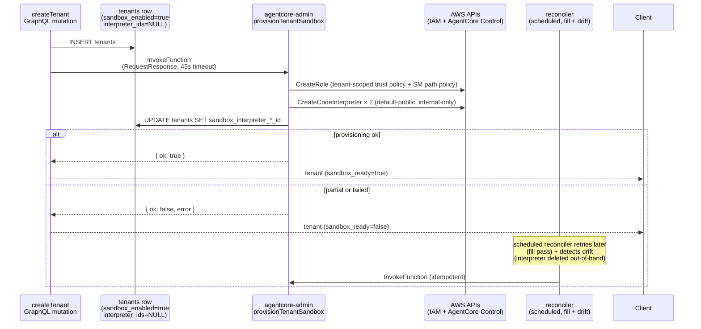

# feat: AgentCore Code Sandbox — per-tenant Code Interpreter as agent code-execution substrate

## Overview

Adopt AWS Bedrock AgentCore Code Interpreter as ThinkWork's agent code-execution sandbox to reach parity with Managed Agents / Deep Agents / OpenAI Agents / Claude Code. Provision two per-tenant interpreters (`default-public`, `internal-only`) with tenant-scoped IAM, inject per-user OAuth tokens via Secrets Manager paths (never values), register a single `execute_code` Strands tool, and enforce a cost-cap circuit breaker in the dispatcher. Template opt-in via `sandbox: { environment, required_connections }`. Tenant kill switch via `tenants.sandbox_enabled` boolean. Invariant: no token value via Python-stdio-mediated writes or known-shape CloudWatch patterns in any persisted log.

## Problem Frame

Every reference agent harness ships code execution default-on. ThinkWork's typed-skill substrate is great for stable paths but cannot run ad-hoc Python mid-turn, stitch CLI output across tools, or wrap new community CLIs without per-subcommand PR cycles. The sandbox is the permanent long-tail surface; typed skills remain primary for stable paths. See origin: `docs/brainstorms/2026-04-22-agentcore-code-sandbox-requirements.md`.

## Requirements Trace

- **R1–R4.** Sandbox environments as first-class resource (per-tenant Code Interpreter × 2 envs; tenant-scoped IAM) — Units 1, 4, 5, 6.
- **R3, R3a.** Template opt-in with `sandbox` field; `tenants.sandbox_enabled` kill switch — Units 1, 3, 9.
- **R5, R6, R7.** One session per agent turn, 5-min cap, structured error surface — Unit 7.
- **R8.** Stdout/stderr truncation thresholds with flag — Unit 8.
- **R9, R10, R11, R12, R13.** Per-user OAuth injection via Secrets Manager paths; value-based scrubber; no token value in logs (scoped) — Units 2, 4, 8.
- **R14, R15, R16.** Blessed base image + runtime pip (accepted residual T2) — Unit 4.
- **R17, R18, R19.** Sandbox invocation audit row + CloudWatch routing + dashboard — Units 11, 12.
- **R20, R21, R22.** Cost caps as circuit breaker (500 inv/day/tenant, 20/hr/agent) — Unit 10.
- **R23, R24, R25.** Reproducible base image + AgentCore supply chain as AWS responsibility — Unit 4.

## Scope Boundaries

- **Out of scope: admin-approval ceremony per assignment.** Developer opt-in only.
- **Out of scope: per-template domain allowlists.** Environment is the granularity.
- **Out of scope: additional environments beyond `default-public` and `internal-only`.** `vpc-gated` is backlog.
- **Out of scope: filesystem/session persistence across turns.** v1 wipes at turn end.
- **Out of scope: warm session pool.**
- **Out of scope: tenant-scoped service credentials.** Invoking-user OAuth only.
- **Out of scope: runtime typosquat detection on `pip install`.** Residual T2.
- **Out of scope: customer PHI/PII data processing.** Regulated tenants default `sandbox_enabled = false`.
- **Out of scope: sandbox-specific admin UI.** CloudWatch Insights in v1.
- **Out of scope: v2 hardening tracks** (in-process credential proxy, private PyPI mirror, per-user ABAC session tags). Named, not built.

### Deferred to Separate Tasks

- **Admin UI for sandbox log browsing / cap-hit visibility** — deferred to the broader observability rebuild workstream.
- **Hand-rolled SQL drift marker integration for any sandbox partial indices or CHECKs `db:generate` cannot emit** — follow-up PR with `-- creates: public.X` headers per `docs/solutions/workflow-issues/manually-applied-drizzle-migrations-drift-from-dev-2026-04-21.md`.
- **`gogcli` bundled-CLI skill** — sibling brainstorm `docs/brainstorms/2026-04-21-bundled-cli-skills-gogcli-google-workspace-requirements.md`.
- **Mobile self-serve UI for the `github` / `slack` connections** introduced in Unit 2.

## Context & Research

### Relevant Code and Patterns

- **Strands tool registration:** `packages/agentcore-strands/agent-container/server.py:434` — `_call_strands_agent` builds a flat `tools = []` list. Closure-built `@_strands_tool async def` idiom at lines 642 (`hindsight_recall`) and 778 (`hindsight_reflect`) is the shape for adding `execute_code`. Env-var threading (tenant_id/user_id/agent_id) lines 1574–1585.
- **AgentCore terraform precedent for missing provider support:** `terraform/modules/app/agentcore-memory/main.tf:108` uses `data.external.memory` + `scripts/create_or_find_memory.sh` (list-then-create idempotent) + `terraform_data` destroy provisioner. Same shape fits stage-level Code Interpreter artifacts; per-tenant provisioning is runtime (see Unit 5), not terraform.
- **Per-tenant SSM precedent (application-driven):** `packages/agentcore/agent-container/permissions.py:78` writes per-tenant SSM at `/thinkwork/{stack}/agentcore/tenants/{tenant_id}/permissions`, written by the `agentcore-admin` Lambda. Nearest precedent for per-tenant resource writes.
- **Tenant creation:** `packages/api/src/graphql/resolvers/core/createTenant.mutation.ts` is 19 lines today; pure DB insert. No async hooks.
- **Tenants table feature-flag precedent:** `packages/database-pg/src/schema/core.ts:35` — `wiki_compile_enabled: boolean().notNull().default(false)`. `sandbox_enabled` mirrors the type; default flipped to `true` per R3a.
- **OAuth token plumbing:** `packages/api/src/lib/oauth-token.ts:174` — `resolveOAuthToken(connectionId, tenantId, providerId)` refreshes + writes back to Secrets Manager at `thinkwork/${STAGE}/oauth/${connectionId}`. `buildSkillEnvOverrides` branches on `provider_name` at lines 345–374 (`google_productivity`, `microsoft_365`, `lastmile`). Add `github` + `slack` branches following the `lastmile` shape.
- **Connection-provider seed:** `scripts/seed-dev.sql` — currently seeds `google_productivity` and `microsoft_365`. `github` and `slack` rows land here.
- **Skill dispatcher pre-flight:** `packages/api/src/handlers/chat-agent-invoke.ts:222` — skill-list build loop; `packages/api/src/handlers/wakeup-processor.ts:42` — parallel path for scheduled jobs; both need the same pre-flight. Also audit newer dispatch paths (composition dispatch per commit c588f15, self-serve tools per commit 0c17fec).
- **Template → agent skill sync:** `packages/api/src/graphql/resolvers/templates/syncTemplateToAgent.mutation.ts:57` — where `template.sandbox` metadata flows onto `agent_skills`.
- **Atomic counter precedent (the only one):** `packages/database-pg/src/lib/thread-helpers.ts:48` — ``db.update(tenants).set({ issue_counter: sql`${tenants.issue_counter} + 1` })``. Single-statement atomic SQL increment.
- **CHECK-constraint enum precedent:** `packages/database-pg/src/schema/skill-runs.ts:149–151` — ``check("status_allowed", sql`... IN (...)`)``. Use for `compliance_tier`.
- **Retention convention:** `skill-runs.ts` uses `delete_at` column + a 180-day ceiling CHECK. `sandbox_invocations` follows the same shape.
- **Cost events precedent:** `packages/database-pg/src/schema/cost-events.ts:38` — `event_type` is plain `text`. Note: `costSummary.query.ts`, `costTimeSeries.query.ts`, `costByAgent.query.ts` classify any `event_type NOT IN ('llm', 'agentcore_compute', 'eval')` into the "tools" bucket — a new `sandbox_invocation` value silently lands there unless those queries are updated.
- **CloudWatch routing:** `terraform/modules/app/agentcore-runtime/main.tf:247` creates `/thinkwork/${var.stage}/agentcore`. AgentCore runtime writes to `/aws/bedrock-agentcore/runtimes/*` (different group). **Zero `aws_cloudwatch_log_subscription_filter` resources in the entire terraform tree** — backstop filter in Unit 12 is greenfield.
- **Secrets Manager path conventions:** `thinkwork/{stage}/oauth/{connectionId}`, `thinkwork/{stage}/tenant/{tenantId}/builtin/{toolSlug}`. New path: `thinkwork/{stage}/sandbox/{tenant_id}/{user_id}/oauth/{connection_type}`.

### Institutional Learnings

- **`docs/solutions/best-practices/oauth-client-credentials-in-secrets-manager-2026-04-21.md`** — OAuth secret template: `lifecycle.ignore_changes = [secret_string]`; typed provider union; module-scope cache. Shapes Unit 8.
- **`docs/solutions/workflow-issues/manually-applied-drizzle-migrations-drift-from-dev-2026-04-21.md`** — drift gate on hand-rolled SQL. Unit 1 prefers `db:generate` end-to-end; `-- creates: public.X` header for any unavoidable hand-rolling.
- **`docs/solutions/build-errors/dockerfile-explicit-copy-list-drops-new-tool-modules-2026-04-22.md`** — third occurrence of Dockerfile explicit-COPY dropping new `.py` modules. Unit 7 adds explicit COPY + startup assertion.
- **`docs/solutions/logic-errors/oauth-authorize-wrong-user-id-binding-2026-04-21.md`** — never `SELECT ... WHERE tenant_id=? LIMIT 1` for user resolution. Unit 8 user-scoped path derivation must use explicit `user_id`.
- **`docs/solutions/best-practices/service-endpoint-vs-widening-resolvecaller-auth-2026-04-21.md`** — if the container needs to call GraphQL with `THINKWORK_API_SECRET`, add a narrow REST endpoint. Applies to Unit 10 quota-check and Unit 11 audit-log endpoints.
- **Memory `feedback_avoid_fire_and_forget_lambda_invokes`** — tenant provisioning uses `RequestResponse`.
- **Memory `feedback_hindsight_async_tools`** — `execute_code` is `async def`, matches existing `@_strands_tool` shape.
- **Memory `feedback_graphql_deploy_via_pr`** — `packages/api` edits deploy via merge-to-main pipeline.
- **Memory `project_enterprise_onboarding_scale`** — 4 enterprises × 100+ agents × ~5 templates. Counter pattern must be correct at this scale.

### External References

External research intentionally skipped — codebase has strong local patterns for every extension point. AgentCore Code Interpreter API specifics (CreateCodeInterpreter, StartCodeInterpreterSession, sessionTimeoutSeconds, strands-agents-tools wrapper limitations) drawn from origin doc's dependency notes; verified empirically during Unit 4–7 implementation.

## Key Technical Decisions

- **R-Q1 resolved: Postgres counter table, atomic SQL increment.** New `sandbox_tenant_daily_counters` (keyed by `(tenant_id, utc_date)`) and `sandbox_agent_hourly_counters` (keyed by `(tenant_id, agent_id, utc_hour)`). Increment via single-statement UPSERT with a guard (`WHERE count < :cap`); zero rows returned signals cap breached. Rationale: DynamoDB has zero local precedent and adds operational surface for one use case; `cost-events.ts` has no atomic pattern; `thread-helpers.ts:48` proves the atomic SQL-increment shape. Expected write rate at `project_enterprise_onboarding_scale`: 4 enterprises × 500 inv/day = 2000 writes/day aggregate; burst peak at 20 inv/hr/agent × ~30 active sandbox agents/tenant × 4 tenants = ~2400 writes/hr = ~0.7 writes/sec aggregate. Each sandbox call performs two composite-PK UPSERTs wrapped in a transaction. Well within Postgres capacity for this workload; lock contention is the shape to watch, not throughput — addressed by the strict lock order in Unit 10.
- **R-Q2 resolved: `sandbox_invocations` column set.** Fields enumerated in Unit 1. Joinable to `skill_runs` by nullable `run_id` (sandbox can be invoked outside a composition). Retention follows `skill_runs`: `delete_at` default 30 days, 180-day ceiling CHECK.
- **R-Q3 resolved: on-demand Secrets Manager hydration per invocation.** Dispatcher writes fresh per-user OAuth tokens to `thinkwork/{stage}/sandbox/{tenant_id}/{user_id}/oauth/{connection_type}` right before `StartSession`; sandbox reads at runtime via its per-tenant IAM role. Pre-warm at connection-create would still require refresh-at-session-start, offering no latency win. Secret resource uses `lifecycle.ignore_changes = [secret_string]`.
- **R-Q4 resolved: synchronous provisioning via extension to `agentcore-admin` Lambda, invoked `RequestResponse` from `createTenant.mutation.ts` with a 45s timeout + reconciler fallback.** Rationale: `data.external` terraform precedent is stage-scoped, not tenant-scoped; fire-and-forget is prohibited by memory; sync boto3 in the GraphQL Lambda adds IAM surface to `graphql-http`. Existing `agentcore-admin` Lambda is the natural home. On partial failure: tenant row carries null interpreter IDs; reconciler retries. Dispatcher gates on interpreter-ready independently of `sandbox_enabled` (R-Q10).
- **R-Q4b resolved: tenant-wildcard IAM scoping** (`/thinkwork/{stage}/sandbox/{tenant_id}/*`). Tenant is the trust boundary; v1 T1 (in-tenant prompt-injection exfil of invoking user's own tokens) is accepted residual regardless of scoping shape. ABAC per-user session tags add an STS hop and complexity without blocking T1. **Named companion residual T1b (new): intra-tenant template-author exfil** — a malicious template author's code, when assigned to another user in the same tenant, can read that user's tokens from `.../{other_user_id}/oauth/*` because the IAM path is tenant-wildcard. Accepted alongside T1; v2 in-process credential proxy or per-user ABAC is the mitigation.
- **R-Q5 resolved: single `execute_code` tool, environment chosen from template config at dispatcher time.** R3 forbids agent-supplied environment override. Single tool surface = simpler prompt. The tool closure is constructed with the tenant's interpreter ID for the template's declared environment; the agent cannot switch.
- **R-Q6 resolved: explicit `StopSession` in `try/finally`** around the agent turn in `_call_strands_agent`. Log-and-continue on stop failure (AgentCore timeout-reap is the backstop). Session IDs never persist across turns — stored as a call-frame-local, not a module-global (structurally prevents cross-turn reuse).
- **R-Q7 resolved: two-layer scrubber — primary in base-image `sitecustomize.py`, backstop CloudWatch subscription filter.** Primary (Unit 4 + Unit 8) is value-based redaction using the session-scoped token set (cleartext + standard base64 + URL-safe base64 + URL-encoded + hex forms), **installed in the blessed base image's `sitecustomize.py`** so the `sys.stdout`/`sys.stderr` write-wrapper is active before the preamble itself executes. The preamble registers token values into the pre-installed redactor; it does not install the wrapper itself. **R13 invariant is honestly scoped to "no token value via Python-stdio-mediated writes or known-shape CloudWatch patterns"** — bytes that bypass Python stdio (direct `os.write(fd, ...)`, subprocesses inheriting fds, C extensions) are covered only by the Unit 12 pattern-based backstop and therefore represent a named residual coverage gap. Backstop (Unit 12) pattern-redacts `Authorization: Bearer`, JWT shapes, known OAuth provider prefixes. Both ship v1.
- **R-Q8 resolved: caps stay as specced (500/day/tenant, 50 min/day/tenant, 20/hr/agent) with an explicit revisit trigger.** At 30 active sandbox-using agents/tenant, 500/day ≈ 17 inv/agent/day — enough headroom for a 5-call flagship turn ~3x per agent per day. Revisit trigger: raise to 2000/day if any tenant hits the cap ≥3 times in a week, or after 30 days of production data. `SandboxCapExceeded` events are logged with structured fields to feed the decision.
- **R-Q9 resolved: `tenants.compliance_tier` enum column** (`standard | regulated | hipaa`) with **both app-layer invariant and DB-layer compound CHECK constraint**: `CHECK (NOT (sandbox_enabled = true AND compliance_tier != 'standard'))`. The DB check closes the "raw SQL via `db:push` or `psql` bypasses app guard" hole. Tier is settable only by a ThinkWork platform operator (identified by `THINKWORK_PLATFORM_OPERATOR_EMAILS` env allowlist until formal RBAC lands); every change writes an append-only audit row to `tenant_policy_events` and emits an SNS notification to a platform-security topic.
- **R-Q10 resolved: interpreter-ready gate is independent of `sandbox_enabled`.** Dispatcher registers `execute_code` only when `sandbox_enabled = true` AND `sandbox_interpreter_{env}_id IS NOT NULL`. During the provisioning window, the dispatcher registers a stub that returns `SandboxProvisioning(tenant)` with guidance. Decouples policy from provisioning state.
- **Preamble injection mechanism: preamble runs as its own `executeCode` call, separate from user code.** String concatenation was an injection surface (triple-quote tricks, indentation tampering). Preamble is executeCode call #1 on a fresh session; user code is call #2+. Scrubber wrapper is installed by `sitecustomize.py` in the base image, so preamble is responsible only for registering token values into the redactor's session-scoped set and exporting `os.environ` — via normal Python statements that cannot be broken by later user-code tricks.
- **Session-start latency target: <3s p95.** CreateSession (~1–2s) + preamble execute (~0.5–1s). No warm pool v1.
- **stdout/stderr capture path: parse AgentCore APPLICATION_LOGS `response_payload` structurally.**
- **Cost-cap UX:** Tool-level error surfaced to agent with human-readable guidance. Agent can summarize to user at its discretion.

## Open Questions

### Resolved During Planning

- **R-Q1** cost counter storage — Postgres atomic UPSERT.
- **R-Q2** `sandbox_invocations` column set — see Unit 1.
- **R-Q3** Secrets Manager hydration — on-demand per invocation.
- **R-Q4** tenant-provisioning — extend `agentcore-admin` Lambda + reconciler fallback.
- **R-Q4b** IAM path scoping — tenant-wildcard; T1b named residual.
- **R-Q5** Strands tool registration — single `execute_code` tool.
- **R-Q6** session termination — explicit `StopSession` in `try/finally`; call-frame-local cache.
- **R-Q7** log-scrubber locus — base-image `sitecustomize.py` primary + CloudWatch backstop; invariant scoped to Python stdio + known patterns.
- **R-Q8** cost-cap sizing — caps stay; revisit triggers defined.
- **R-Q9** regulated-tenant classification — `compliance_tier` enum + app invariant + DB CHECK + audit log + SNS.
- **R-Q10** tenant-provisioning race — interpreter-ready gate independent of `sandbox_enabled`.
- Preamble injection mechanism — separate executeCode call.
- stdout/stderr capture — structured parse from APPLICATION_LOGS.
- Cost-cap UX — tool-level error only.

### Deferred to Implementation

- **Exact AgentCore Python client shape** — Strands' `AgentCoreCodeInterpreter` wrapper does not expose `sessionTimeoutSeconds` or network mode. Unit 7 may subclass or drive `bedrock-agentcore` boto3 directly.
- **Reconciler cadence** for re-provisioning — first pass at `createTenant` time; scheduled reconciler retry cadence picked during Unit 6 implementation.
- **Blessed package versions** for `default-public` base image — pinned to current stable at image-bake time, SHA-256-verified.
- **Exact shape of AgentCore response_payload** — verified in Unit 7 against dev tenant.
- **Codegen regeneration fan-out** — `apps/admin`, `apps/mobile`, `apps/cli`, `packages/api` codegen re-runs after template `sandbox` field additions.

## Output Structure

```
packages/
  agentcore-strands/agent-container/
    sandbox_tool.py            # new — execute_code Strands tool + session lifecycle
    sandbox_preamble.py        # new — preamble builder (token reads + redactor registration)
    Dockerfile                 # modified — COPY sandbox_tool.py, sandbox_preamble.py
  api/src/
    lib/
      oauth-token.ts           # modified — add github, slack branches
      sandbox-provisioning.ts  # new — provisioning Lambda client (RequestResponse)
      sandbox-quota.ts         # new — atomic-increment guard helpers
      sandbox-secrets.ts       # new — per-invocation Secrets Manager writer
      sandbox-preflight.ts     # new — shared preflight helper (Unit 9)
    handlers/
      chat-agent-invoke.ts     # modified — sandbox pre-flight integration
      wakeup-processor.ts      # modified — parallel pre-flight integration
      sandbox-quota-check.ts   # new — narrow REST endpoint (Unit 10)
      sandbox-invocation-log.ts# new — narrow REST endpoint (Unit 11)
    graphql/resolvers/core/
      createTenant.mutation.ts # modified — invoke provisioning Lambda
      updateTenantPolicy.mutation.ts # modified or new — sandbox_enabled + compliance_tier gate + audit
    graphql/resolvers/costs/
      costSummary.query.ts     # modified — break out sandbox as a distinct bucket (Unit 10)
      costTimeSeries.query.ts  # modified — same
      costByAgent.query.ts     # modified — same
  lambda/agentcore-admin.ts  # modified — existing single-file Lambda gains new routes matching current pattern:
                             #   - POST /provision-tenant-sandbox (Unit 5)
                             #   - POST /deprovision-tenant-sandbox (Unit 5.5)
                             #   - POST /sandbox-orphan-gc (Unit 5.5)
                             #   - POST /reconcile-sandbox-provisioning (Unit 6)
                             # (existing convention: switch on path/method within one handler; sibling files like
                             #  github-workspace.ts, job-schedule-manager.ts follow the same flat-file shape.
                             #  If boto3 helpers grow too large, promote to packages/lambda/agentcore-admin/
                             #  as a separate refactor PR.)
  database-pg/
    src/schema/
      core.ts                  # modified — sandbox_enabled, compliance_tier, compound CHECK, sandbox_interpreter_{public,internal}_id
      sandbox-invocations.ts   # new — sandbox_invocations table
      sandbox-quota-counters.ts# new — sandbox_tenant_daily_counters + sandbox_agent_hourly_counters
      tenant-policy-events.ts  # new — append-only audit
    drizzle/
      NNNN_add_sandbox.sql     # new — generated migration
  skill-catalog/
    sandbox-pilot/             # new — dogfood reference template
      skill.yaml
      SKILL.md
      scripts/pilot.py
terraform/modules/app/
  agentcore-runtime/
    main.tf                    # modified — sandbox IAM grants, EventBridge for reconciler + GC
  agentcore-code-interpreter/
    main.tf                    # new — blessed base image + per-env config
    scripts/create_or_find_code_interpreter.sh  # new — idempotent
    Dockerfile.sandbox-base    # new — blessed Python 3.12 + pinned libs
    sitecustomize.py           # new — primary R13 scrubber
    test_sitecustomize.py      # new — pytest for scrubber
  sandbox-log-scrubber/
    main.tf                    # new — subscription filter + transformer Lambda (backstop)
    src/scrubber.ts            # new — pattern-based backstop redaction
docs/
  adrs/
    per-tenant-aws-resource-fanout.md  # new — Unit 0 ADR
  guides/
    sandbox-environments.md    # new — template-author + operator guide
```

## High-Level Technical Design

> *This illustrates the intended approach and is directional guidance for review, not implementation specification. The implementing agent should treat it as context, not code to reproduce.*

### End-to-end data flow (single sandbox tool call)

```mermaid
sequenceDiagram
    participant Agent as Strands Agent
    participant Tool as execute_code tool
    participant Quota as sandbox-quota<br/>(Postgres atomic UPSERT)
    participant Secrets as Secrets Manager<br/>thinkwork/{stage}/sandbox/{t}/{u}/oauth/{conn}
    participant ACI as AgentCore<br/>Code Interpreter<br/>(sitecustomize.py scrubber pre-installed)
    participant Log as sandbox_invocations<br/>row

    Agent->>Tool: execute_code(code)
    Tool->>Quota: atomic increment (tenant_day, agent_hour)
    alt cap breached
        Quota-->>Tool: 0 rows returned
        Tool-->>Agent: SandboxCapExceeded(dimension, resets_at)
    else deadlock (SQLSTATE 40P01)
        Quota-->>Tool: deadlock
        Tool-->>Agent: SandboxCapExceeded(dimension='unknown', resets_at=+60s)<br/>-- fails closed
    else ok
        Quota-->>Tool: incremented
        Tool->>Secrets: close-to-use recheck + PutSecretValue (fresh token)
        Tool->>ACI: StartSession (if no session this turn)
        ACI-->>Tool: session_id
        Tool->>ACI: executeCode(preamble)  <br/>-- call #1: register tokens into redactor + export env
        Tool->>ACI: executeCode(user_code) <br/>-- call #2+: runs with redactor active
        ACI-->>Tool: { stdout, stderr, exit_status, peak_memory }
        Tool->>Log: insert sandbox_invocations row (R17 fields)
        Tool-->>Agent: { stdout (256KB cap), stderr (32KB cap), truncated_flags }
    end
    Note over Tool,ACI: At turn end (finally block):<br/>StopSession; log-and-continue on failure
```

### Tenant provisioning flow



### Decision matrix: when the dispatcher registers `execute_code`

| `tenants.sandbox_enabled` | interpreter_{env}_id populated | `compliance_tier` | template declares sandbox | All `required_connections` valid? | Dispatcher action |
|---|---|---|---|---|---|
| true | yes | standard | yes | yes | Register `execute_code` bound to that interpreter |
| true | **no** | standard | yes | yes | Register stub returning `SandboxProvisioning(tenant)` |
| **false** | any | any | yes | any | Do not register tool; template runs without sandbox |
| any | any | **regulated/hipaa** | yes | any | `sandbox_enabled` cannot be `true` (app invariant + DB CHECK); treated as false |
| any | any | any | **no** | any | Do not register tool |
| true | yes | standard | yes | **no** | Do not register tool; surface tool-load warning with missing connection types |

## Implementation Units

- [ ] **Unit 0: ADR — per-tenant AWS resource fan-out pattern**

**Goal:** Capture architectural decisions for per-tenant AWS resource fan-out *before* Phase 2 code lands so future features (per-tenant wiki compile, per-tenant eval fleet, per-tenant MCP servers) can cite a shared reference.

**Requirements:** None directly — planning/documentation artifact that preserves reasoning.

**Dependencies:** None.

**Files:**
- Create: `docs/adrs/per-tenant-aws-resource-fanout.md` — captures: when per-tenant resources are justified; synchronous-in-mutation vs async-Lambda vs reconciler tradeoffs (plan picks RequestResponse + reconciler backstop); destroy-path symmetry obligation (see Unit 5.5); reconciler drift detection (see Unit 6); quota-ceiling monitoring (1000-per-account AgentCore quota); per-tenant IAM role naming conventions; why `data.external` terraform is stage-scoped and cannot host per-tenant provisioning.

**Approach:** One ADR file, under 500 words. Cites this plan as first instance.

**Patterns to follow:** No existing ADR directory; this establishes the convention. Adjust path if team prefers `docs/decisions/`.

**Test scenarios:**
- Test expectation: none — documentation-only unit.

**Verification:**
- ADR reviewed in the same PR that ships Phase 2 (or earlier standalone PR).
- Next per-tenant feature cites the ADR.

---

- [ ] **Unit 1: Database schema — tenants columns + sandbox tables**

**Goal:** Add tenant-level sandbox flags, per-call audit table, atomic quota counter tables, and policy-event audit log. One Drizzle migration.

**Requirements:** R1 (per-tenant interpreter IDs), R3a (sandbox_enabled), R9 (user-scoped token paths), R17 (invocation audit), R20/R22 (counters), R-Q2, R-Q9.

**Dependencies:** None (foundation).

**Files:**
- Modify: `packages/database-pg/src/schema/core.ts` — add `sandbox_enabled boolean notNull default true`, `compliance_tier text notNull default 'standard'` with CHECK in `('standard','regulated','hipaa')`, **compound CHECK `CHECK (NOT (sandbox_enabled = true AND compliance_tier != 'standard'))`** (enforces the regulated-tenant invariant at DB layer so raw SQL cannot bypass the app gate), `sandbox_interpreter_public_id text`, `sandbox_interpreter_internal_id text`. **Rollout-safe migration note:** the column default is `true` for forward semantics (new tenants created post-ship opt in by default), but the Phase 1 migration explicitly sets `sandbox_enabled = false` on every pre-existing tenant row in the same transaction (`UPDATE tenants SET sandbox_enabled = false` immediately after `ALTER TABLE ... ADD COLUMN`) so existing enterprise tenants don't auto-opt-in before Phase 3b enforcement (quota, audit, pre-flight) lands. Existing tenants are flipped by operator action during the staged rollout described in Operational Notes.
- Create: `packages/database-pg/src/schema/sandbox-invocations.ts` — `id uuid PK, tenant_id uuid NOT NULL, agent_id uuid, user_id uuid NOT NULL, template_id text, tool_call_id text, run_id uuid FK → skill_runs.id NULL, session_id text, environment_id text NOT NULL, invocation_source text, started_at, finished_at, duration_ms, exit_status, stdout_bytes, stderr_bytes, stdout_truncated, stderr_truncated, peak_memory_mb, outbound_hosts jsonb, executed_code_hash, failure_reason, created_at default now(), delete_at default now()+30d + 180-day ceiling CHECK`. No stdout/stderr content columns — metadata + hash only; content goes to CloudWatch per R17/R18.
- Create: `packages/database-pg/src/schema/sandbox-quota-counters.ts` — two tables:
  - `sandbox_tenant_daily_counters`: composite PK `(tenant_id, utc_date)`, `invocations_count int default 0`, `wall_clock_seconds int default 0`, `updated_at`.
  - `sandbox_agent_hourly_counters`: composite PK `(tenant_id, agent_id, utc_hour)`, `invocations_count int default 0`, `updated_at`.
- Create: `packages/database-pg/src/schema/tenant-policy-events.ts` — append-only audit: `id uuid PK, tenant_id uuid NOT NULL, actor_user_id uuid NOT NULL, event_type text (sandbox_enabled|compliance_tier), before_value text, after_value text, source text (graphql|reconciler|sql), created_at`. Insert-only by convention.
- Create: `packages/database-pg/drizzle/NNNN_add_sandbox.sql` — generated via `pnpm --filter @thinkwork/database-pg db:generate`.
- Test: `packages/database-pg/test/sandbox-schema.test.ts`.

**Approach:**
- Use `pnpm --filter @thinkwork/database-pg db:generate`; review migration before commit.
- `compliance_tier` enum enforced via CHECK constraint (mirrors `skill-runs.ts:149`).
- Counter tables keyed composite-PK for atomic UPSERT `INSERT ... ON CONFLICT ... DO UPDATE SET count = count + 1 WHERE count < :cap RETURNING *`.
- Avoid hand-rolled SQL unless `db:generate` cannot emit the constraint; if needed, add `-- creates: public.X` header.

**Patterns to follow:**
- `core.ts:35` (`wiki_compile_enabled`) — boolean-with-default precedent.
- `skill-runs.ts:149` — CHECK-constraint enum pattern.
- `skill-runs.ts` retention fields — `delete_at` + ceiling CHECK.

**Test scenarios:**
- Happy path: `db:push` to dev applies cleanly; all columns exist with correct defaults; new tables exist.
- Edge case: CHECK rejects `compliance_tier = 'bogus'`.
- Edge case: compound CHECK rejects raw SQL `UPDATE tenants SET sandbox_enabled = true WHERE compliance_tier = 'hipaa'`.
- Edge case: raw SQL `UPDATE tenants SET compliance_tier = 'regulated' WHERE sandbox_enabled = true` is rejected unless `sandbox_enabled` is set to `false` in the same statement.
- Edge case: `delete_at > started_at + 180 days` on `sandbox_invocations` is rejected.
- Edge case: concurrent UPSERT on same `(tenant_id, utc_date)` from two transactions produces deterministic increment.
- Integration: existing tenants seeded in dev get `sandbox_enabled = false` (via the migration's explicit `UPDATE` after `ADD COLUMN`), `compliance_tier = 'standard'`. New tenants created post-migration via `createTenant` get `sandbox_enabled = true` by default.

**Verification:**
- `pnpm --filter @thinkwork/database-pg db:generate` emits one migration file.
- `pnpm db:push -- --stage dev` applies cleanly.
- Test passes.

---

- [ ] **Unit 2: OAuth provider branches — `github` and `slack`**

**Goal:** Add `github` and `slack` connection types to OAuth infrastructure.

**Requirements:** R11, R12.

**Dependencies:** None (parallel to Unit 1).

**Files:**
- Modify: `packages/api/src/lib/oauth-token.ts` — add `github` and `slack` branches to `buildSkillEnvOverrides` around lines 345–374, following `lastmile` shape (`<PROVIDER>_ACCESS_TOKEN` + `<PROVIDER>_CONNECTION_ID`).
- Modify: `scripts/seed-dev.sql` — add `INSERT ... ON CONFLICT (name) DO UPDATE` for `github` and `slack` in `connect_providers` with OAuth config populated.
- Test: `packages/api/test/unit/oauth-token.test.ts`.

**Approach:**
- Flat branch structure; no helper extraction yet.
- GitHub scopes: `repo read:org user:email` default. Slack: `chat:write channels:read users:read`.
- Seed rows idempotent (`ON CONFLICT DO UPDATE`).

**Patterns to follow:** `oauth-token.ts:345–374`, `oauth-token.ts:174` (unchanged refresh path).

**Test scenarios:**
- Happy path: `buildSkillEnvOverrides({ provider: 'github' })` returns `{ GITHUB_ACCESS_TOKEN, GITHUB_CONNECTION_ID }`.
- Happy path: same for `slack` → `{ SLACK_ACCESS_TOKEN, SLACK_CONNECTION_ID }`.
- Error path: expired GitHub + failed refresh → `null` returned; `markConnectionExpired` called.
- Error path: unknown provider falls through to default unchanged.
- Integration: `SELECT * FROM connect_providers WHERE name IN ('github','slack')` returns two rows.

**Verification:** `pnpm --filter @thinkwork/api typecheck && test` passes.

---

- [ ] **Unit 3: Template `sandbox` field + validation**

**Goal:** Add `sandbox: { environment, required_connections }` to agent templates, validated at authorship and propagated to `agent_skills` on assignment.

**Requirements:** R3, R11.

**Dependencies:** Unit 1.

**Files:**
- Modify: `packages/api/src/graphql/resolvers/templates/syncTemplateToAgent.mutation.ts:57`.
- Modify: template config schema (Zod or TypeScript in `packages/api/src/lib/templates`).
- Modify: GraphQL types under `packages/database-pg/graphql/types/*.graphql` if template config is GraphQL-typed.
- Modify: template validator — reject unknown environment names or connection types.
- Test: `packages/api/test/unit/templates.test.ts`.

**Approach:**
- v1 allowed set hardcoded (2 envs × 3 connection types).
- `syncTemplateToAgent` must be idempotent on re-sync.
- If schema.graphql changes, run `pnpm schema:build` + codegen across `apps/cli`, `apps/admin`, `apps/mobile`, `packages/api`.

**Test scenarios:**
- Happy path: `sandbox: { environment: 'default-public', required_connections: ['github'] }` syncs onto agent_skills.
- Happy path: `sandbox: { environment: 'internal-only' }` (no required_connections) passes; defaults to empty list.
- Error path: `sandbox: { environment: 'bogus' }` rejected with specific error.
- Error path: `sandbox: { required_connections: ['notion'] }` rejected.
- Integration: template without `sandbox` field syncs unchanged.

**Verification:** Typecheck + test pass; `pnpm schema:build` no uncommitted diff.

---

- [ ] **Unit 4: Terraform — sandbox base image + `sitecustomize.py` scrubber**

**Goal:** Build blessed base image with the primary R13 scrubber installed via `sitecustomize.py`; expose stage-level terraform outputs.

**Requirements:** R1, R2, R13 (primary layer), R14, R16, R24.

**Dependencies:** None.

**Files:**
- Create: `terraform/modules/app/agentcore-code-interpreter/main.tf` — outputs env names + network modes, ECR repo for base image, IAM policy templates.
- Create: `terraform/modules/app/agentcore-code-interpreter/Dockerfile.sandbox-base` — Python 3.12 + pinned libs (pandas, numpy, requests, boto3, httpx, pyyaml, openpyxl, python-dateutil).
- Create: `terraform/modules/app/agentcore-code-interpreter/sitecustomize.py` — **primary R13 scrubber**. Installs `sys.stdout`/`sys.stderr` write-wrapper keyed on module-level `_session_tokens: set[str]` that Unit 8's preamble populates. Every write replaces any substring matching a registered token (or its standard base64 / URL-safe base64 / URL-encoded / hex forms) with `<redacted>` before bytes reach the underlying file descriptor. **Rolling buffer across writes:** the wrapper maintains a rolling suffix buffer sized to max-token-length × 2 bytes; matches are evaluated against `buffer + current_write`, so a token split across two `write()` calls is still redacted (bounded protection — adversarial fragmentation at arbitrary positions remains a named residual). Installed via `sitecustomize.py` rather than inside the preamble so the wrapper is active before any Python code — including the preamble and any framework traceback on cold start. Exposes `register_token(value: str)` and `register_tokens(values: Iterable[str])`.
- Create: `terraform/modules/app/agentcore-code-interpreter/test_sitecustomize.py` — pytest covering every encoding form + register/redact flow. Runs in base-image CI before push.
- Create: `terraform/modules/app/agentcore-code-interpreter/scripts/create_or_find_code_interpreter.sh` — idempotent wrapper for stage-level shared artifacts.
- Modify: `terraform/modules/app/agentcore-runtime/main.tf` — consume new outputs for IAM grants to provisioning Lambda.

**Approach:**
- Follow `agentcore-memory/main.tf` for `data.external` patterns. Per-tenant resources in Unit 5, not here.
- Base image SHA-verified; bump is a reviewable PR.
- `lifecycle.ignore_changes = [secret_string]` on any Secrets Manager resources here.

**Patterns to follow:** `agentcore-memory/main.tf:108`, `agentcore-runtime/main.tf`.

**Test scenarios:**
- Happy path: `terraform plan` shows clean additions.
- Happy path: re-running `terraform apply` is a no-op.
- Happy path: `sitecustomize.py` register_token + print → stdout contains `<redacted>`.
- Edge case: register_token registers cleartext + derived encodings; print of each form is redacted.
- Edge case: register_token called after the first print still redacts subsequent prints.
- Edge case: redactor wrapper does not crash on binary bytes or non-UTF8 writes.
- Edge case: Dockerfile base image build under CI produces reproducible SHA.
- Integration: base image boots a toy Python process; `sitecustomize.py` auto-loads; redactor-install verified via diagnostic marker.

**Verification:** `terraform plan` clean; base image builds+pushes; test suite passes.

---

- [ ] **Unit 5: Provisioning handler in `agentcore-admin` Lambda**

**Goal:** Extend `agentcore-admin` with `provisionTenantSandbox` creating two per-tenant Code Interpreters + one tenant-scoped IAM role, idempotent.

**Requirements:** R1, R4, R-Q4.

**Dependencies:** Unit 1, Unit 4.

**Files:**
- Create: `packages/lambda/agentcore-admin/src/handlers/provision-tenant-sandbox.ts` — accepts `{ tenant_id }`; idempotency check; CreateRole; CreateCodeInterpreter × 2; UPDATE tenants; return result.
- Create: `packages/lambda/agentcore-admin/src/lib/agentcore-code-interpreter.ts` — boto3/AWS SDK v3 wrappers.
- Modify: `terraform/modules/app/agentcore-runtime/main.tf` — agentcore-admin IAM grants:
  - `iam:CreateRole / AttachRolePolicy / DeleteRole / DetachRolePolicy` scoped to role-name prefix `thinkwork-{stage}-sandbox-tenant-*`.
  - `iam:PassRole` on the same prefix **with explicit `Condition: { StringEquals: { "iam:PassedToService": "bedrock-agentcore.amazonaws.com" } }`** — prevents the tenant-sandbox role from being passed to any service other than AgentCore Code Interpreter.
  - `bedrock-agentcore-control:CreateCodeInterpreter`, `:DeleteCodeInterpreter`, `:ListCodeInterpreters` (specific verbs, no wildcards), resource-scoped where API supports it.
- Test: `packages/lambda/agentcore-admin/test/provision-tenant-sandbox.test.ts`.

**Approach:**
- Role name pattern `thinkwork-{stage}-sandbox-tenant-{tenant_id_suffix}` truncated to IAM 64-char limit.
- List-then-create idempotency for reconciler re-runs.
- Timeout: 45s Lambda. Budget breakdown: CreateRole 1–2s + AttachRolePolicy 1s + CreateCodeInterpreter × 2 (expected 3–8s each based on comparable Bedrock control-plane APIs; unverified for this specific API) + DB update < 1s ≈ 10–20s expected; 45s is a 2× safety factor. **Verify CreateCodeInterpreter latency empirically during Unit 5 implementation**; if p95 exceeds 22s, raise timeout to 60s and consider parallelizing the two CreateCodeInterpreter calls. Typical run budget: 5–15s.
- Partial success: leave populated IDs; return `{ ok: false, partial: true }`.
- User resolution explicit — never `WHERE tenant_id = ? LIMIT 1`.

**Patterns to follow:** `permissions.py:78`, `agentcore-memory/scripts/create_or_find_memory.sh`.

**Test scenarios:**
- Happy path: first-time provisioning creates role + 2 interpreters + writes IDs.
- Happy path (idempotency): re-invoke is a no-op.
- Edge case: tenant_id with 32 chars produces role name under 64-char limit.
- Error path: CreateCodeInterpreter throws → partial result; which step failed is returned.
- Error path: IAM quota exceeded → clear error; no orphaned resources.
- Integration: reconciler retry completes partial success without recreating successful interpreter.

**Verification:** test passes; dev-stage manual invocation creates AWS resources.

---

- [ ] **Unit 5.5: Tenant sandbox de-provisioning + orphan GC**

**Goal:** Symmetric counterpart to Unit 5. De-provisioning handler + scheduled orphan GC to protect 1000-per-account interpreter quota.

**Requirements:** R1 (lifecycle).

**Dependencies:** Unit 5.

**Files:**
- Create: `packages/lambda/agentcore-admin/src/handlers/deprovision-tenant-sandbox.ts` — accepts `{ tenant_id }`; idempotent DeleteCodeInterpreter × 2 + DetachRolePolicy + DeleteRole; tolerant of partial absence.
- Create: `packages/lambda/agentcore-admin/src/handlers/sandbox-orphan-gc.ts` — scheduled: ListCodeInterpreters by name-pattern, cross-reference against `tenants`; deprovision orphans.
- Modify: tenant-delete path (if exists) — invoke `deprovisionTenantSandbox` via `RequestResponse`.
- Modify: `terraform/modules/app/agentcore-runtime/main.tf` — EventBridge rule for GC (daily).
- Test: `packages/lambda/agentcore-admin/test/deprovision-tenant-sandbox.test.ts`, `sandbox-orphan-gc.test.ts`.

**Approach:**
- Idempotency: ignore "resource not found" errors.
- GC cadence: daily sufficient at 1000 - 8 = 992 slack; escalate to hourly if CI churn > 50 orphans/day.
- **GC tolerance: tag-based cross-reference is mandatory, not alternative.** Unit 5 tags each Code Interpreter at create time with `{ Stage: <stage>, TenantId: <tenant_id> }`. The GC ListCodeInterpreters call filters to `Stage = <current stage>` and then cross-references `TenantId` against the `tenants` table. A 1-hour minimum-age check provides belt-and-suspenders protection against a race where the create-time tag has not yet propagated. Name-pattern matching alone is rejected — a stage-name substring collision (e.g., a `dev` GC run matching `dev2` resources) would cross-stage-delete production resources. If AgentCore CreateCodeInterpreter does not support tags on creation, the plan must be adjusted: either defer GC entirely until tags are supported, or store the interpreter IDs in the tenants row (Unit 1 already does this) and cross-reference from that direction (ListCodeInterpreters → match ID against `SELECT sandbox_interpreter_*_id FROM tenants`; delete IDs not found).

**Test scenarios:**
- Happy path: deprovision removes both interpreters + role; second call no-op.
- Happy path: GC cleans 2 orphans among 10 real tenants.
- Edge case: GC during tenant-create race → skips in-flight interpreter.
- Error path: `ResourceNotFound` → success (idempotent).
- Error path: role still attached → handler retries after DetachRolePolicy.
- Integration: 50 test tenants created/destroyed rapidly in CI; no orphans accumulate.

**Verification:** test passes; dev manual create+delete shows AWS resources cleaned.

---

- [ ] **Unit 6: Tenant-create wiring + regulated-tenant invariant + reconciler + drift detection**

**Goal:** Wire `createTenant` mutation to invoke provisioning; enforce regulated-tenant invariant; schedule reconciler with both fill and drift passes; audit log policy changes.

**Requirements:** R3a, R-Q4, R-Q9, R-Q10.

**Dependencies:** Unit 1, Unit 5.

**Files:**
- Create: `packages/api/src/lib/sandbox-provisioning.ts` — LambdaClient invoker (`RequestResponse`, 45s timeout).
- Modify: `packages/api/src/graphql/resolvers/core/createTenant.mutation.ts` — after DB insert, invoke provisioning Lambda; on failure log + continue; reconciler picks up.
- Create or modify: `packages/api/src/graphql/resolvers/core/updateTenantPolicy.mutation.ts` — enforces: `sandbox_enabled = true` rejected when `compliance_tier != 'standard'`; changing `compliance_tier` to non-standard coerces `sandbox_enabled = false`. Only platform operators (via `THINKWORK_PLATFORM_OPERATOR_EMAILS`) can change `compliance_tier`. Every change writes `tenant_policy_events` row and emits SNS notification to platform-security topic.
- Create: `packages/lambda/agentcore-admin/src/handlers/reconcile-sandbox-provisioning.ts` — EventBridge-scheduled, doing both fill and drift:
  - **Fill:** scan `tenants WHERE sandbox_enabled = true AND (sandbox_interpreter_public_id IS NULL OR sandbox_interpreter_internal_id IS NULL)`; invoke `provision-tenant-sandbox`.
  - **Drift:** `ListCodeInterpreters`; for tenants pointing at missing IDs, null the column so fill pass repopulates.
- Modify: `terraform/modules/app/agentcore-runtime/main.tf` — EventBridge rule (e.g., every 15 min) + SNS topic.
- Test: `packages/api/test/unit/createTenant.test.ts`, `updateTenantPolicy.test.ts`.

**Approach:**
- `RequestResponse` per memory `feedback_avoid_fire_and_forget_lambda_invokes`.
- Mutation returns tenant row regardless; client reads interpreter IDs for readiness.
- Reconciler follows `set -e` discipline per `bootstrap-silent-exit-1-set-e-tenant-loop-2026-04-21.md` — one tenant failure does not abort the loop.
- Platform-operator gate via env allowlist; formal RBAC is a follow-up.

**Patterns to follow:** `packages/api/src/lib/` existing LambdaClient usage; `createTenant.mutation.ts` resolver shape.

**Test scenarios:**
- Happy path: `createTenant` provisions interpreters within 10s; tenant row returns with both IDs.
- Happy path (invariant): `updateTenantPolicy({ compliance_tier: 'hipaa' })` coerces `sandbox_enabled` to false.
- Edge case: `createTenant` when provisioning times out → tenant row with null IDs, no client error; reconciler handles later.
- Error path: `updateTenantPolicy({ sandbox_enabled: true })` when tier is `regulated` → GraphQL error.
- Error path: non-operator attempts `compliance_tier` change → permission error; no audit row.
- Integration: reconciler fill run completes a partial tenant.
- Integration: reconciler drift detects an out-of-band deleted interpreter; nulls the column; next fill repopulates.
- Integration: reconciler with one failing tenant does not abort loop.
- Integration: `compliance_tier` change writes `tenant_policy_events` row + SNS publishes.

**Verification:** Mutation tests pass; manual dev-stage createTenant provisions; reconciler completes partial fixture.

---

- [ ] **Unit 7: Strands sandbox tool + session lifecycle**

**Goal:** Add `execute_code` tool to Strands container with per-turn session lifecycle, environment routing, structured error mapping.

**Requirements:** R5, R6, R7, R8, R-Q5, R-Q6.

**Dependencies:** Unit 1, Unit 6, Unit 8. (Unit 10's quota-check endpoint is called only when `SANDBOX_QUOTA_ENDPOINT` is set; Phase 3a smoke-tests without it, Phase 3b wires it in — so Unit 10 is a sequencing dependency resolved at phase level, not a unit-construction dependency.)

**Execution note:** Unit-test the session-lifecycle state machine (start/stop/timeout/error) in isolation before wiring the AgentCore boto3 path.

**Files:**
- Create: `packages/agentcore-strands/agent-container/sandbox_tool.py` — module-level factory building `execute_code` `@_strands_tool async def` wrapper. Reads `TENANT_ID`, `USER_ID`, `AGENT_ID`, `TEMPLATE_ID`, `RUN_ID`, `SANDBOX_INTERPRETER_ID`, `SANDBOX_ENVIRONMENT` from `os.environ` at closure construction time.
- Modify: `packages/agentcore-strands/agent-container/server.py:434` (`_call_strands_agent`) — import `sandbox_tool.build_execute_code_tool`; add returned closure to tools list when `SANDBOX_INTERPRETER_ID` is set.
- Modify: `packages/agentcore-strands/agent-container/Dockerfile` — explicit `COPY sandbox_tool.py ./` + `COPY sandbox_preamble.py ./` + startup assertion (`EXPECTED_SANDBOX_TOOLS`) that fails loud if `SANDBOX_INTERPRETER_ID` is set but the tool didn't register.
- Test: `packages/agentcore-strands/agent-container/test_sandbox_tool.py`.

**Approach:**
- Session lifecycle: one session per turn, reused across multiple `execute_code` calls within the turn. **Session ID stored as a call-frame-local in `_call_strands_agent`** (passed into the tool closure at construction time), not as a module-global. Per-turn scoping is an invariant of the plan; call-frame-local enforces it structurally regardless of how the AgentCore runtime schedules requests across processes or warm starts. A module-global would require trusting the runtime's request-isolation model instead of structurally preventing cross-turn carryover — and the invariant is more important than that trust assumption. `try/finally` calls `StopSession`; log-and-continue on failure. Startup test asserts no module-global session state.
- Environment routing: dispatcher passes `SANDBOX_INTERPRETER_ID`; tool closure uses that ID only. Single `execute_code(code: str)` tool surface.
- Output truncation: stdout 256 KB / stderr 32 KB; full streams flow to CloudWatch.
- Error mapping: timeouts → `SandboxTimeout`; OOM → `SandboxOOM`; other failures → `SandboxError`; missing interpreter → `SandboxProvisioning`; cap breach → `SandboxCapExceeded`.
- `async def` tool wrapper matching `hindsight_recall` idiom.
- `AgentCoreCodeInterpreter` Strands wrapper does not expose `sessionTimeoutSeconds`. Either subclass or drive `bedrock-agentcore` boto3 directly; pick at build time.

**Patterns to follow:** `server.py:642` (hindsight_recall), `skill_runner.py`.

**Test scenarios:**
- Happy path: `execute_code("print('hello')")` returns `{ stdout: 'hello\n', ... }`.
- Happy path: second call reuses session; `pip install` from first call's package imports in second.
- Edge case: stdout > 256 KB → truncated + flag.
- Edge case: 5-min timeout → `SandboxTimeout`.
- Edge case: OOM → `SandboxOOM`.
- Error path: AgentCore network error → `SandboxError` with diagnostics.
- Error path: SANDBOX_INTERPRETER_ID unset but tool called → `SandboxProvisioning`.
- Integration: `try/finally` calls `StopSession` on normal + exception paths.
- Integration: startup assertion fails loudly if `sandbox_tool.py` missing from image.
- Integration: after turn completes, inspection of module-level state shows no residual session-cache entries.

**Verification:** pytest passes; dev-stage manual `execute_code('1+1')` returns `2`; CloudWatch shows start/stop pairs.

---

- [ ] **Unit 8: Preamble builder + token registration with pre-installed redactor**

**Goal:** Generate the preamble the dispatcher injects as executeCode call #1: reads fresh OAuth tokens from Secrets Manager, registers them with the base-image `sitecustomize.py` redactor, exports to `os.environ`.

**Requirements:** R9, R10, R11, R12, R13 (primary value registration), R-Q3, R-Q7.

**Dependencies:** Unit 2, Unit 4 (sitecustomize.py installed in base image), Unit 5.

**Files:**
- Create: `packages/agentcore-strands/agent-container/sandbox_preamble.py` — pure function `build_preamble(required_connections, tenant_id, user_id, stage) -> str` returning Python source string (only path strings — no token values).
- Create: `packages/api/src/lib/sandbox-secrets.ts` — `writeSandboxSecrets({ tenant_id, user_id, required_connections })` refreshes each OAuth token via existing `resolveOAuthToken` and writes to `thinkwork/{stage}/sandbox/{tenant_id}/{user_id}/oauth/{connection_type}`.
- Modify: `packages/api/src/handlers/chat-agent-invoke.ts` — before container invocation, call `writeSandboxSecrets` + build preamble; pass preamble to container as invocation payload.

**Approach:**
- Preamble built server-side (TypeScript), passed to container via invocation payload.
- **Preamble executes as its own `executeCode` call, separate from user code.** Call order: (1) preamble, (2) user code #1, #2, .... String concatenation is forbidden — injection surface (triple-quote tricks, indentation tampering).
- **The stdout/stderr redactor wrapper is installed by the base image's `sitecustomize.py`** (Unit 4), not by the preamble. Preamble's job: (a) read Secrets Manager, (b) call `sitecustomize.register_tokens([token, base64(token), urlsafe_base64(token), url_encode(token), hex(token)])`, (c) export `os.environ`. Even if preamble raises before (b), redactor is already active.
- Preamble emits `# preamble-version: N` marker on line 1; `sitecustomize.py` reads expected version from env var set at image-bake time and raises if mismatched.
- Only access tokens written to SM (R12). Refresh tokens never leave the API Lambda. **SM secret lifecycle:** the dispatcher schedules a delete of the per-session secret value in the same `try/finally` block that calls `StopSession` in Unit 7 — on session end, the tenant-scoped sandbox OAuth path is emptied (either SM `DeleteSecret` with `ForceDeleteWithoutRecovery` or `UpdateSecret` with an empty placeholder). This bounds the exposure window to the session lifetime (minutes), not until the next invocation overwrites (which could be hours). Failure to delete is logged and reconciled on the next session write; it is not retried in-band.
- **`sandbox-secrets.ts` performs close-to-use recheck**: immediately before `PutSecretValue`, re-fetch `connections.status` and fail the invocation with `ConnectionRevoked(connection_type)` if expired. Closes TOCTOU window between pre-flight and SM write.
- Secrets Manager resource uses `lifecycle.ignore_changes = [secret_string]`.
- Scrubber coverage honestly scoped: Python-stdio-mediated writes. Bytes bypassing Python stdio covered only by Unit 12 backstop.
- User resolution: explicit `user_id`; never `WHERE tenant_id = ? LIMIT 1`.
- Dispatcher must never log the constructed preamble source. **Unit 8 owns this control** via (a) a code comment at the top of `sandbox-preamble.py` and `sandbox-secrets.ts` stating the forbidden pattern, (b) a PR-review checklist item in `CONTRIBUTING.md` ("no logger/print/console.log of sandbox preamble or token path strings"), and (c) a grep-based pre-commit check (run by the same hook that does `pnpm format:check`) flagging `log(preamble|tokenPath)` shapes in the `packages/api/src/lib/sandbox-*` scope.

**Patterns to follow:** `oauth-token.ts:174`, `server.py:1444` (`_inject_skill_env`).

**Test scenarios:**
- Happy path: preamble with `required_connections = ['github']` reads path, exports `GITHUB_ACCESS_TOKEN`; subsequent `print(os.environ['GITHUB_ACCESS_TOKEN'])` → `<redacted>`.
- Happy path: preamble with 3 connections exports all; all redacted from stdout.
- Edge case: token in base64 form → redacted.
- Edge case: token URL-encoded → redacted.
- Edge case: token in HTTP header via `requests` library → redacted.
- Error path: Secrets Manager `AccessDenied` → preamble crashes loud; traceback contains the failing path but no token value (SM never returned one).
- Integration: preamble call #1 + user code call #2 `print(token)` → AgentCore stdout shows `<redacted>`.
- Integration: user code trying to tamper with preamble boundaries (triple-quote, `sys.stdout = original`, `builtins.__dict__`) still redacts because the wrapper installs in sitecustomize before any user code runs.
- Integration: preamble-version marker mismatch fails preamble call loudly.
- Integration: connection-revocation TOCTOU — revoke between pre-flight and `PutSecretValue` → `ConnectionRevoked`; no stale token written.
- Integration: no token value appears in any log surface (Lambda logs, AgentCore APPLICATION_LOGS, S3 cold tier) across 10 test turns.

**Verification:** pytest + API tests pass; manual dev-stage `print(token)` → CloudWatch shows `<redacted>`.

---

- [ ] **Unit 9: Dispatcher pre-flight — sandbox_enabled + interpreter-ready + required_connections**

**Goal:** Gate sandbox tool registration in every dispatcher path on tenant policy, interpreter existence, and required-connection presence.

**Requirements:** R3a, R11, R-Q10.

**Dependencies:** Unit 1, Unit 3, Unit 6.

**Files:**
- Modify: `packages/api/src/handlers/chat-agent-invoke.ts:222–334`.
- Modify: `packages/api/src/handlers/wakeup-processor.ts:42,389`.
- Create: `packages/api/src/lib/sandbox-preflight.ts` — shared helper `checkSandboxPreflight({ tenant_id, user_id, agent_id, template_sandbox }) → { status, interpreter_id?, missing_connections?, reason? }`.
- Test: `packages/api/test/unit/sandbox-preflight.test.ts`.

**Approach:**
- Single helper per `docs/solutions/best-practices/inline-helpers-vs-shared-package-for-cross-surface-code-2026-04-21.md`.
- **Enumerate all call sites that invoke the Strands runtime** (grep `buildSkillEnvOverrides` + direct AgentCore Runtime invocations). Known: chat-agent-invoke, wakeup-processor. **Audit newer paths (composition dispatch per commit c588f15, self-serve tools per commit 0c17fec)**; add pre-flight at each. Add a repo-level architectural test that fails CI if a new Strands-runtime caller bypasses `sandbox-preflight`.
- Pre-flight order:
  1. `tenants.sandbox_enabled = false` → `disabled`; not registered; scheduled job surfaces `SandboxDisabled(tenant)`.
  2. Template's declared env — `sandbox_interpreter_{env}_id` populated? If not → `provisioning`; register stub returning `SandboxProvisioning(tenant)`.
  3. Each `required_connection` (connection_type identifier — origin R11 term; maps to `connect_providers.name` in the DB) present at pre-flight time? If the user has no connection of that type at all → `missing_connection`; tool not registered; warn via turn's system message. *Expired* connections with recoverable refresh still register the tool — expiry is rechecked close-to-use in Unit 8 (`sandbox-secrets.ts`) and surfaces as `ConnectionRevoked` at session start if refresh fails then. The two gates answer different questions: pre-flight = "does the user have this integration?" and close-to-use = "is the token still valid at the moment we need it?"
- **Invoking-user resolution per path:**
  - Interactive chat: `ctx.auth.userId` (with `resolveCallerTenantId(ctx)` fallback).
  - Scheduled wakeup: no `ctx.auth`; invoking user is **`agents.human_pair_id`** — the user the agent is paired with (the column actually exists in `packages/database-pg/src/schema/agents.ts`; `chat-agent-invoke.ts` already uses it for user-level lookups). Sandbox tokens come from that user's OAuth.
  - Any future path resolves invoking-user before calling `checkSandboxPreflight`.
- Helper signature: all four inputs required and pre-resolved by caller.

**Patterns to follow:** `chat-agent-invoke.ts:237–255`, `oauth-token.ts` (`markConnectionExpired`).

**Test scenarios:**
- Happy path: all checks pass; env vars set on container invocation.
- Edge case: `sandbox_enabled = false` → tool not registered; log indicates reason.
- Edge case: interpreter IDs null → stub tool returns `SandboxProvisioning`.
- Edge case: user has `google` but template requires `github` + `slack` → `missing_connection` with both types.
- Edge case: `expired` connection with refresh failure → missing.
- Error path: sandbox declared, interpreter null, sandbox_enabled true → stub, not silent skip.
- Integration: both chat-agent-invoke and wakeup-processor use the same helper and handle all outcomes identically.
- Integration: wakeup-processor resolves invoking user as `agents.owner_user_id`; reads owner's OAuth connections.
- Integration: architectural test — any handler invoking Strands runtime must import from `sandbox-preflight.ts`; a fixture handler bypassing pre-flight fails the test.

**Verification:** tests pass; dev manual scenarios produce expected tool-registration outcomes.

---

- [ ] **Unit 10: Cost-cap circuit breaker — atomic counter guard**

**Goal:** Enforce 500/day/tenant, 50 min/day/tenant, 20/hr/agent as real circuit breakers; return `SandboxCapExceeded` on breach.

**Requirements:** R20, R21, R22.

**Dependencies:** Unit 1, Unit 7.

**Execution note:** Characterize concurrent-write behavior with a property-style test (N parallel increments + cap) before wiring into the live tool path.

**Files:**
- Create: `packages/api/src/lib/sandbox-quota.ts` — `checkAndIncrement(...)` → `{ ok: true } | { ok: false, dimension, resets_at }`.
- Modify: `packages/agentcore-strands/agent-container/sandbox_tool.py` — before `executeCode`, POST to narrow dispatcher endpoint; on `ok: false`, return `SandboxCapExceeded`.
- Create: `packages/api/src/handlers/sandbox-quota-check.ts` — narrow REST endpoint using `THINKWORK_API_SECRET`; avoids widening `resolveCaller` per `docs/solutions/best-practices/service-endpoint-vs-widening-resolvecaller-auth-2026-04-21.md`.
- Test: `packages/api/test/unit/sandbox-quota.test.ts` + `packages/api/test/integration/sandbox-quota-race.test.ts`.

**Approach:**
- **Cap semantics pinned: `< cap`.** At cap = 500, 500th call → ok; 501st → rejected. Single source of truth.
- **Date/hour boundary discipline:** every UPSERT uses `CURRENT_DATE` and `date_trunc('hour', NOW())` computed **server-side inside the SQL statement**, never client-side. A client-computed date/hour passed as a bind parameter is rejected at code review — at the UTC-midnight boundary, two in-flight calls from clocks with slight skew can address two different date rows in parallel, each counting toward a different day's cap. Integration test at the boundary: mock clock to 23:59:59.500 UTC, fire 5 parallel calls, verify all 5 land in a single row (either date D or date D+1, not split).
- **Lock-order invariant: tenant-daily first, always.** Every path takes `sandbox_tenant_daily_counters` → `sandbox_agent_hourly_counters` in one transaction. Violating order risks deadlock at 400+ agents.
- Atomic increment pattern (directional):
  ```
  BEGIN;
  INSERT INTO sandbox_tenant_daily_counters (tenant_id, utc_date, invocations_count)
  VALUES (:t, CURRENT_DATE, 1)
  ON CONFLICT (tenant_id, utc_date) DO UPDATE
    SET invocations_count = sandbox_tenant_daily_counters.invocations_count + 1
    WHERE sandbox_tenant_daily_counters.invocations_count < :tenant_daily_cap
  RETURNING invocations_count;
  -- if zero rows: ROLLBACK, return { ok: false, dimension: 'tenant_daily' }
  INSERT INTO sandbox_agent_hourly_counters (tenant_id, agent_id, utc_hour, invocations_count)
  VALUES (:t, :a, date_trunc('hour', NOW()), 1)
  ON CONFLICT (tenant_id, agent_id, utc_hour) DO UPDATE
    SET invocations_count = sandbox_agent_hourly_counters.invocations_count + 1
    WHERE sandbox_agent_hourly_counters.invocations_count < :agent_hourly_cap
  RETURNING invocations_count;
  -- if zero rows: ROLLBACK (tenant-daily undone), return { ok: false, dimension: 'agent_hourly' }
  COMMIT;
  ```
- **Deadlock handling: fail closed.** On `SQLSTATE 40P01` or `40001`, return `{ ok: false, dimension: 'unknown', resets_at: NOW() + 60s }`. Container surfaces `SandboxCapExceeded`. Fails-closed is mandatory — fail-open would defeat circuit breaker.
- `resets_at`: daily → `CURRENT_DATE + INTERVAL '1 day'`; hourly → `date_trunc('hour', NOW()) + INTERVAL '1 hour'`; deadlock → 60s.
- Estimated wall-clock: 5-min default per invocation; adjust on completion.
- **Kill-switch semantics:** caps from SSM Parameter Store `/thinkwork/{stage}/sandbox/caps`. Setting `tenant_daily_cap = 0` rejects every call including the first — verified by test.
- Write to `cost-events` at invocation end with `event_type = 'sandbox_invocation'`. **Update `costSummary.query.ts`, `costTimeSeries.query.ts`, `costByAgent.query.ts`** to break out sandbox as a distinct bucket rather than silently absorbing into "tools".
- Log `SandboxCapExceeded` with structured fields to feed revisit trigger.

**Patterns to follow:** `thread-helpers.ts:48`, `cost-events.ts`.

**Test scenarios:**
- Happy path: first call increments both counters 0→1.
- Happy path: 499th call → ok.
- Edge case: 500th call → ok (`< 500` is false at count=499; update succeeds because precondition is `< cap`, giving us 500 ok; 501st rejected — verify exactly against pinned semantics).
- Edge case: 501st call → rejected with dimension tenant_daily.
- Edge case: new UTC day creates new counter row.
- Edge case: agent-hourly cap breaches before tenant-daily → `agent_hourly` dimension.
- Integration (concurrency): 100 parallel callers against 500-cap remaining 10 → exactly 10 succeed; no over-shoot.
- Integration (deadlock): two transactions contending on same tenant + different agents simulate deadlock; one aborted; container sees `dimension: 'unknown'` and fails closed.
- Integration: tenant-daily succeeds + agent-hourly fails in transaction → rollback.
- Integration: `cost-events` row written on invocation end.
- Integration: `costSummary` + `costTimeSeries` + `agentCostBreakdown` surface sandbox as distinct bucket.
- Edge case: `tenant_daily_cap = 0` → first call rejected; no row inserted with count=1.

**Verification:** tests pass; dev-stage with cap=2 + three sequential calls → third rejected.

---

- [ ] **Unit 11: Sandbox invocation audit row writer**

**Goal:** At each `execute_code` call end, write one row to `sandbox_invocations` with all R17 fields.

**Requirements:** R17, R18.

**Dependencies:** Unit 1, Unit 7.

**Files:**
- Create: `packages/api/src/handlers/sandbox-invocation-log.ts` — narrow REST endpoint the container POSTs to; same auth shape as Unit 10.
- Modify: `packages/agentcore-strands/agent-container/sandbox_tool.py` — after each call returns, POST audit fields; non-blocking.
- Test: `packages/api/test/unit/sandbox-invocation-log.test.ts`.

**Approach:**
- `executed_code_hash`: SHA-256 of user code (not preamble, not tokens). Stable for dedup.
- `outbound_hosts`: parsed from APPLICATION_LOGS; fallback to best-effort regex.
- `stdout_bytes` / `stderr_bytes`: raw pre-truncation sizes.
- Fire-and-log-on-failure (container → API); loss tolerance: container logs POST failure to CloudWatch as backstop.
- Retention: `delete_at` default 30 days, 180-day ceiling enforced in Unit 1 schema.

**Patterns to follow:** `chat-agent-invoke.ts` handler shape; `skill-runs.ts` retention.

**Test scenarios:**
- Happy path: successful call → row inserted with all R17 fields.
- Happy path: errored call (timeout) → `exit_status = 'timeout'`, `failure_reason` populated.
- Edge case: stdout > 256 KB → `stdout_bytes` = raw size; `stdout_truncated = true`.
- Edge case: empty streams → zeros recorded, not nulls.
- Error path: container POST fails → container logs; agent turn unaffected.
- Error path: audit endpoint receives invalid payload → 400; no row.
- Integration: three calls in one turn → three rows, one shared session_id.
- Integration: row with `run_id` joins correctly to `skill_runs`.

**Verification:** tests pass; dev manual invocation creates rows.

---

- [ ] **Unit 12: CloudWatch subscription filter — backstop redaction**

**Goal:** Pattern-based backstop redaction on AgentCore APPLICATION_LOGS before S3 cold tier.

**Requirements:** R13 (backstop layer), R18.

**Dependencies:** None (parallel to Units 7–11).

**Files:**
- Create: `terraform/modules/app/sandbox-log-scrubber/main.tf` — `aws_cloudwatch_log_subscription_filter` on AgentCore runtime group; targets new Lambda `sandbox-log-scrubber`.
- Create: `terraform/modules/app/sandbox-log-scrubber/src/scrubber.ts` — Lambda handler doing pattern-based redaction: `Authorization:\s*Bearer\s+\S+`, JWT-shaped 3-dotted base64, known OAuth prefixes (`gho_`, `xoxb-`/`xoxa-`/`xoxp-`, `ya29.`).
- Create: `terraform/modules/app/sandbox-log-scrubber/README.md` — frames this as **backstop only**.
- Test: `terraform/modules/app/sandbox-log-scrubber/src/scrubber.test.ts`.

**Approach:**
- Greenfield (no subscription-filter precedent in terraform tree).
- Pattern-based; Unit 4 `sitecustomize.py` is the value-based primary.
- Lambda concurrency auto-scales; stream-based no aggregation.
- Failure tolerance: if scrubber fails, records remain in source CloudWatch group (90-day retention). S3 delay, not data loss.

**Patterns to follow:** `agentcore-runtime/main.tf:247`; existing Lambda-behind-terraform patterns.

**Test scenarios:**
- Happy path: `Authorization: Bearer abc.def.ghi` → redacted.
- Happy path: `xoxb-123-...` → redacted.
- Happy path: non-sensitive line passes unchanged.
- Edge case: partial pattern (word `Bearer` alone) → no redaction.
- Edge case: record > 256 KB handled gracefully.
- Error path: Lambda crash → source log group retains original (no loss).
- Integration: dev-stage test payload → scrubbed S3 record has `<redacted>`.

**Verification:** tests pass; `terraform plan` clean; dev manual test redacts fake Authorization header.

---

- [ ] **Unit 13: Dogfood reference template + operator runbook**

**Goal:** Ship one reference template exercising the full sandbox path (flagship demo from success criteria). Write operator runbook.

**Requirements:** Success criteria.

**Dependencies:** Units 0–12.

**Files:**
- Create: `packages/skill-catalog/sandbox-pilot/skill.yaml` — declares `sandbox: { environment: 'default-public', required_connections: ['google', 'github', 'slack'] }`.
- Create: `packages/skill-catalog/sandbox-pilot/SKILL.md` — author guide.
- Create: `packages/skill-catalog/sandbox-pilot/scripts/pilot.py`.
- Create: `docs/guides/sandbox-environments.md` — operator runbook: (a) toggle `sandbox_enabled`, (b) change `compliance_tier`, (c) debug `SandboxProvisioning` (re-run reconciler, check IAM/AgentCore console), (d) debug `SandboxCapExceeded` (query `sandbox_invocations` + counter row), (e) investigate specific invocation (by `tool_call_id`), (f) named v2 hardening tracks (T1 in-process proxy, T1b per-user ABAC or proxy, T2 private PyPI mirror, T3 regulated-tenant env), (g) stdout-bypass residual coverage gap explanation.

**Approach:**
- Flagship demo exercises: OAuth (google + slack), sandbox `default-public` egress, S3 upload, stdout capture, audit row, quota counter.
- Runbook is the artifact for first-30-days triage.
- Document scrubber layers (primary Unit 4 + backstop Unit 12) and residual coverage gap for incident response.

**Patterns to follow:** `packages/skill-catalog/google-email/SKILL.md`, `docs/guides/`.

**Test scenarios:**
- Dogfood: dev tenant with 3 connections runs flagship demo end-to-end (< 60s); Slack receives S3 URL; `sandbox_invocations` shows row; no token in CloudWatch.
- Dogfood: flip `sandbox_enabled = false`; next turn skips tool; agent reports `SandboxDisabled`.
- Dogfood: set per-tenant cap to 1, fire two calls; second → `SandboxCapExceeded`; runbook's debug query returns expected counter state.

**Verification:** flagship demo completes; operator can follow runbook for each failure mode; 10-turn grep shows no token value in any log.

## System-Wide Impact

- **Interaction graph:**
  - `createTenant` gains a synchronous Lambda hop; `deleteTenant` path (if exists) gains deprovisioning; `updateTenantPolicy` gains a compliance-tier invariant with audit log + SNS; every dispatcher path (chat-agent-invoke, wakeup-processor, composition dispatch, self-serve tools) gains sandbox pre-flight.
  - Strands base image gains `sitecustomize.py` with stdout/stderr redactor; container Dockerfile gains explicit COPY lines + startup assertion.
  - New REST endpoints: `/api/sandbox-quota-check`, `/api/sandbox-invocation-log` (container↔API via `THINKWORK_API_SECRET`). Both added to OPTIONS-bypass list per `docs/solutions/integration-issues/lambda-options-preflight-must-bypass-auth-2026-04-21.md` if CORS applies.
  - New EventBridge scheduled rules: reconciler (fill + drift), orphan GC (daily).
  - Existing cost aggregation queries updated to break out sandbox spend rather than silently absorbing into "tools".
- **Error propagation:**
  - AgentCore failures → `SandboxTimeout`/`SandboxOOM`/`SandboxError` tool results; agent retries at discretion.
  - Provisioning failures during `createTenant` do NOT fail the mutation; reconciler handles; `SandboxProvisioning` surfaces when agent tries to use.
  - Quota breach → `SandboxCapExceeded` tool result.
  - Connection missing/expired at pre-flight → tool not registered; at close-to-use → `ConnectionRevoked` returned.
  - Quota-service deadlock → fails closed (`dimension: 'unknown'`, 60s retry). Fail-open would defeat circuit breaker.
- **State lifecycle risks:**
  - Session ID is a call-frame-local, not module-global — per-turn scoping structurally enforced by Python frame lifetime. Test asserts module-level emptiness after turn completes.
  - `try/finally` guarantees StopSession; mid-agent Lambda timeout leaves orphans — AgentCore timeout-reap is backstop.
  - Interpreter orphans (from deleted tenants) count against 1000-per-account quota; reaped by orphan GC (Unit 5.5) daily. GC cadence must stay ≥ daily.
  - Quota-counter increment atomic via transactional strict lock-order (tenant-daily first).
  - Provisioning race: dispatcher gates on interpreter-ready independently of `sandbox_enabled` — structural, not documented-only.
- **API surface parity:**
  - Every Strands-runtime caller must use `sandbox-preflight.ts` — architectural test enforces this so drift between call sites is caught at CI time.
  - GraphQL schema additions require `pnpm schema:build` + codegen regen across `apps/cli`, `apps/admin`, `apps/mobile`, `packages/api`.
- **Integration coverage:**
  - Concurrency test for quota counter (Unit 10) is mandatory — lost updates at 400+ agents would silently bypass the circuit breaker.
  - End-to-end dogfood turn (Unit 13) verifies the seam dispatcher pre-flight → container preamble → Strands tool → AgentCore → audit row → quota counter that unit tests alone cannot prove.
  - Preamble scrubbing correctness proven only by end-to-end CloudWatch capture + grep-for-tokens.
- **Unchanged invariants:**
  - Typed skills remain primary; sandbox is additive.
  - `oauth-token.ts:resolveOAuthToken` flow unchanged.
  - Hindsight wrappers in `server.py` untouched (memory `feedback_hindsight_async_tools`).
  - `ctx.auth.tenantId` null-for-Google-federated fallback pattern extended to sandbox pre-flight.
  - `cost-events` table keeps shape; sandbox adds rows; consumers updated.
  - No new dependency on DynamoDB; Postgres + Secrets Manager + AgentCore Control is the full AWS surface added.

## Risks & Dependencies

| Risk | Likelihood | Impact | Mitigation |
|------|------------|--------|------------|
| AgentCore Python client (Strands wrapper) lacks `sessionTimeoutSeconds` / env config — forces subclass or raw boto3 | High | Med | Verified in Unit 7 unit-test phase; fall back to boto3 directly if wrapper insufficient |
| Per-tenant provisioning blows past 45s timeout under AWS degradation | Med | High | 45s + retry; reconciler catches stragglers; tenant row decoupled from provisioning success |
| Quota counter lost-update under concurrency despite UPSERT guard | Low | High | Property-style concurrency test (100 parallel callers vs cap of 10) is a blocking Unit 10 criterion; strict lock order prevents deadlock shape |
| Preamble scrubber misses an encoding form (URL-safe base64 variant, etc.) → token in CloudWatch | Med | High | Enumerated in Unit 4/8 tests (cleartext + standard/URL-safe base64 + URL-encoded + hex); Unit 12 pattern backstop |
| AgentCore 1000-per-account quota pressure at 500-tenant scale (×2 env = 1000 interpreters exactly) | Low now / High at scale | High — cannot onboard | 4 × 2 = 8 of 1000 today; orphan GC (Unit 5.5) keeps quota clean. **Request AWS quota increase when tenant count crosses 100** (×2 env = 200 interpreters; still ~80% headroom, leaves time for the quota-increase ticket to land before pressure builds). If CI in the production AWS account churns test tenants aggressively, that also counts toward the 1000 ceiling — prefer a separate CI AWS account or CI-only stage to isolate the burn rate |
| Runtime `pip install` supply-chain attack (T2) steals tokens mid-session | Accepted residual | High per incident | Named T2; regulated tenants `sandbox_enabled=false`; v2 private PyPI mirror on backlog |
| Prompt-injection exfil of invoking user's OAuth tokens (T1) | Accepted residual | High per incident | Named T1; short-TTL tokens (1hr); v2 in-process credential proxy |
| **Intra-tenant template-author exfil of other users' tokens (T1b, new)** — tenant-wildcard IAM path allows a shared template's code to read other users' sandbox SM paths | Accepted residual | High — up to N-user blast per compromised template | Tenant is documented trust boundary; 1hr TTL bounds exposure; v2 per-user ABAC or credential proxy mitigates; runbook flags "shared-template author review" as compensating control |
| Stdout-bypass token leak — `os.write(fd, ...)`, subprocess inheriting fds, C extensions, multiprocessing children with fresh Python processes where `sitecustomize.py` reruns but the session token set is empty | Accepted residual (coverage gap) | High per incident | R13 invariant scoped to "no token via Python-stdio or known-shape CloudWatch patterns"; Unit 12 pattern backstop catches known OAuth prefixes; gap documented in Key Decisions + runbook |
| Scrubber split-write bypass — `sys.stdout.write(token[:16])` followed by `sys.stdout.write(token[16:])` where neither fragment matches any registered encoding individually, so both pass through unredacted | Accepted residual (coverage gap) | Med — requires intentional bypass by agent code | Unit 4 `sitecustomize.py` maintains a small rolling buffer (≤ max-token-length × 2 bytes) across writes to catch token values split across write boundaries; flushed on newline or buffer full. Not perfect against adversarial fragmentation at arbitrary positions; named as intentional exfil path, same class as T1 |
| Subprocess env-var exfil — `subprocess.run(['env'])` or `subprocess.run(['cat', '/proc/self/environ'])` dumps the token environment to stdout bytes captured by AgentCore's fd-level tail, bypassing Python stdio | Accepted residual (same class as T1) | High per incident | No v1 primary defense (subprocess stdout goes direct to fd 1); Unit 12 pattern backstop provides partial coverage for known OAuth prefixes; v2 in-process credential proxy (tokens never in `os.environ`) is the real mitigation |
| Connection-revocation TOCTOU between pre-flight and preamble SM read | Low × Med | Low — revoked token usable during ≤1hr TTL but audited | Close-to-use recheck in `sandbox-secrets.ts` before `PutSecretValue` surfaces `ConnectionRevoked`; bounded by TTL |
| Schema drift via hand-rolled SQL not in `meta/_journal.json` | Med | High | Unit 1 prefers `db:generate`; hand-rolled additions use `-- creates: public.X` header |
| Dockerfile COPY list misses `sandbox_tool.py` / `sandbox_preamble.py` (3rd-time failure class) | Med | High — sandbox silently absent | Unit 7 explicit COPY + startup assertion fails loud if module missing |
| Raw SQL operator bypass of `compliance_tier` invariant | Low | Med | DB compound CHECK constraint closes the hole at the schema layer (Unit 1) |
| Reconciler poison-pill — one tenant transient-fails every run | Low | Med | Reconciler logs with tenant_id; runbook has manual re-trigger |
| Caps too tight; legitimate workflows hit `SandboxCapExceeded` week 1 | Med | Med | Revisit trigger defined (3 hits/week OR 30 days); structured logging on every breach |
| Operator compliance_tier change without second approver or audit | Low (now) | High (if it happens) | Audit row + SNS notification on every change provide detection within minutes; four-eyes is v2 |

## Dependencies / Prerequisites

- AWS Bedrock AgentCore Code Interpreter GA in target region.
- IAM: graphql-http can `lambda:InvokeFunction` on agentcore-admin; agentcore-admin can `iam:CreateRole/AttachRolePolicy/PassRole` (scoped, with `iam:PassedToService` condition) and `bedrock-agentcore-control:*` specific verbs.
- ECR: stage-level sandbox base image repo provisioned in Unit 4.
- Secrets Manager: new path family `/thinkwork/<stage>/sandbox/<tenant_id>/<user_id>/oauth/<connection_type>` with per-tenant IAM scoping.
- GitHub OAuth App + Slack OAuth App registered and credentials configured.
- Dev-stage tenant with google + github + slack connections for Unit 13 dogfood.

## Phased Delivery

### Phase 0 — ADR (Unit 0)

Lands before or with Phase 2. Parallelizable with Phase 1.

### Phase 1 — Foundation (Units 1–3)

Schema (tenants columns + sandbox tables + tenant_policy_events audit + compound CHECK), OAuth branches, template config. Units 1 and 2 parallelizable; Unit 3 depends on Unit 1. Ship as one PR or three small ones.

### Phase 2 — Provisioning (Units 4–6, + Unit 5.5)

Base image with `sitecustomize.py` scrubber + provisioning Lambda with tight IAM + deprovisioning + tenant-create wiring + reconciler with drift + compliance-tier invariant with audit. Deliverable: new tenants have per-tenant Code Interpreters with a scrubber-equipped base image; policies enforced at app and DB layer; deletion symmetric.

### Phase 3a — Runtime tool dogfoodable (Units 7–8)

Strands sandbox tool + session lifecycle + preamble builder + value-based scrubber registration. Deliverable: a template opting into sandbox runs code end-to-end on a whitelisted dev tenant (bypassing enforcement for smoke test). Smoke-test pass is a gate before Phase 3b.

### Phase 3b — Enforcement (Units 9–11)

Dispatcher pre-flight + cost-cap circuit breaker + audit-row writer. Deliverable: sandbox usage gated by policy + quota + connection state; cap breaches return structured errors; every invocation produces an audit row; cost-events integration non-silent.

### Phase 4 — Observability + dogfood (Units 12–13)

CloudWatch subscription filter backstop + reference template + operator runbook. Deliverable: R13 coverage (primary + backstop) documented honestly; flagship demo works; production-ready ops docs land with feature.

Each phase depends on the previous. Within a phase, units can ship as separate PRs.

## Documentation Plan

- `docs/adrs/per-tenant-aws-resource-fanout.md` — lands with or before Phase 2 (Unit 0).
- `docs/guides/sandbox-environments.md` — operator + template-author guide (Unit 13).
- `packages/skill-catalog/sandbox-pilot/SKILL.md` — reference template authoring doc (Unit 13).
- `docs/solutions/best-practices/` — candidate learning doc at end of rollout for any tradeoffs the ADR didn't anticipate.

## Operational / Rollout Notes

- **Staged rollout:** Phase 1–2 to dev; verify provisioning on test tenant. Phase 3 with one tenant `sandbox_enabled = true`, rest false. Observe 7 days; flip default across remaining tenants.
- **Kill switch:** `sandbox_enabled = false` on all tenants instantly disables sandbox without a deploy. First-line incident response.
- **Cap revisit:** Query `sandbox_invocations` + counter tables after 7 days; raise caps if ≥3 hits/tenant/week legitimate.
- **Worktree convention:** Per memory `feedback_worktree_isolation`, each unit in `.claude/worktrees/sandbox-unit-<n>` off `origin/main`. Phase 1 units 1–2 parallelizable. Clean up after merge per memory `feedback_cleanup_worktrees_when_done`.
- **PR targeting:** All PRs target `main`. No stacked PRs.
- **GraphQL deploys:** Units 2, 3, 6, 9, 10, 11 involve `packages/api`; deploy via merge pipeline per memory `feedback_graphql_deploy_via_pr`.

## Sources & References

- **Origin document:** [docs/brainstorms/2026-04-22-agentcore-code-sandbox-requirements.md](../brainstorms/2026-04-22-agentcore-code-sandbox-requirements.md)
- **Sibling brainstorm:** [docs/brainstorms/2026-04-21-bundled-cli-skills-gogcli-google-workspace-requirements.md](../brainstorms/2026-04-21-bundled-cli-skills-gogcli-google-workspace-requirements.md)
- Related code: `packages/agentcore-strands/agent-container/server.py`; `packages/api/src/lib/oauth-token.ts`; `packages/api/src/handlers/chat-agent-invoke.ts`; `packages/api/src/handlers/wakeup-processor.ts`; `packages/api/src/graphql/resolvers/core/createTenant.mutation.ts`; `packages/api/src/graphql/resolvers/templates/syncTemplateToAgent.mutation.ts`; `packages/database-pg/src/schema/core.ts`; `packages/database-pg/src/schema/skill-runs.ts`; `packages/database-pg/src/schema/cost-events.ts`; `packages/database-pg/src/lib/thread-helpers.ts`; `terraform/modules/app/agentcore-memory/main.tf`; `terraform/modules/app/agentcore-runtime/main.tf`
- Related learnings: [oauth-client-credentials-in-secrets-manager](../solutions/best-practices/oauth-client-credentials-in-secrets-manager-2026-04-21.md); [manually-applied-drizzle-migrations-drift-from-dev](../solutions/workflow-issues/manually-applied-drizzle-migrations-drift-from-dev-2026-04-21.md); [dockerfile-explicit-copy-list-drops-new-tool-modules](../solutions/build-errors/dockerfile-explicit-copy-list-drops-new-tool-modules-2026-04-22.md); [oauth-authorize-wrong-user-id-binding](../solutions/logic-errors/oauth-authorize-wrong-user-id-binding-2026-04-21.md); [service-endpoint-vs-widening-resolvecaller-auth](../solutions/best-practices/service-endpoint-vs-widening-resolvecaller-auth-2026-04-21.md); [bootstrap-silent-exit-1-set-e-tenant-loop](../solutions/logic-errors/bootstrap-silent-exit-1-set-e-tenant-loop-2026-04-21.md); [inline-helpers-vs-shared-package-for-cross-surface-code](../solutions/best-practices/inline-helpers-vs-shared-package-for-cross-surface-code-2026-04-21.md); [lambda-options-preflight-must-bypass-auth](../solutions/integration-issues/lambda-options-preflight-must-bypass-auth-2026-04-21.md)
- Binding memory: `feedback_dont_overgate_baseline_agent_capability`; `feedback_user_opt_in_over_admin_config`; `feedback_aws_native_preference`; `feedback_hindsight_async_tools`; `feedback_graphql_deploy_via_pr`; `feedback_avoid_fire_and_forget_lambda_invokes`; `feedback_worktree_isolation`; `feedback_cleanup_worktrees_when_done`; `feedback_pr_target_main`; `project_enterprise_onboarding_scale`; `feedback_oauth_tenant_resolver`
