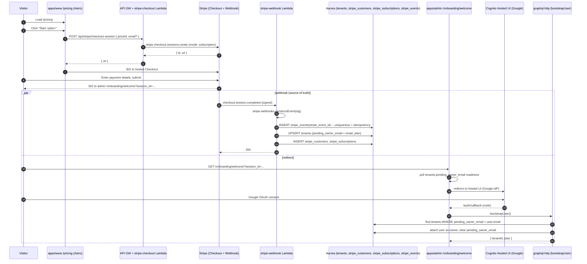

# feat: Stripe pricing page and post-checkout onboarding

## Overview

Ship the first real payment surface on ThinkWork: a branded pricing page on the marketing site (`apps/www`), a Stripe Checkout flow that any visitor can start without signing in first, and a post-checkout path that pre-provisions the tenant from a webhook and then drops the customer into the existing Cognito/Google-OAuth signup so `bootstrapUser` attaches them to the already-paid tenant instead of creating a new free one.

Stripe keys are already provisioned in the Stripe dashboard; this plan specifies where the operator (Eric) places them so Terraform + Lambda can consume them safely.

## Problem Frame

Today ThinkWork has no self-serve revenue path. `apps/www` has no `/pricing` page; `apps/mobile/app/onboarding/payment.tsx` is UI-only mockware; and `bootstrapUser` auto-creates a `plan: "free"` tenant on first Google sign-in. There is no way for a prospect at `thinkwork.ai` to choose a plan, pay, and arrive in the product as a paid tenant — and no Stripe wire anywhere in the codebase to build on. This plan adds that full vertical slice while staying inside the repo's established patterns (Secrets Manager for third-party keys, narrow REST Lambda for external webhooks, single Astro page on the www site, Drizzle + hand-rolled SQL for constraints).

## Requirements Trace

- **R1.** A `/pricing` page at `https://thinkwork.ai/pricing` that visually matches the existing www dark theme (tokens from `apps/www/tailwind.config.mjs`, shell from `apps/www/src/layouts/Base.astro`, typography lockups from `Hero.astro`/`SectionHeader.astro`) and is reachable from the site nav.
- **R2.** From the pricing page, an unauthenticated visitor can click a plan and be sent to Stripe Checkout (hosted) without first creating a Cognito account.
- **R3.** After successful payment, the user lands on the admin app and is taken through the existing Cognito/Google-OAuth sign-up flow. They must end up inside an **already-paid tenant** (not a new free one) with the correct `plan` recorded.
- **R4.** The Stripe webhook is the source of truth for "payment succeeded" (not the success redirect), with signature verification, replay/idempotency protection, and no side effects if either check fails.
- **R5.** Stripe keys (publishable, secret, webhook signing secret) live in AWS Secrets Manager under `thinkwork/${stage}/stripe/*`, never in `common_env` plaintext, never committed to `terraform.tfvars`. Operator places them via a documented one-shot CLI step.
- **R6.** The change is shippable via the existing `.github/workflows/deploy.yml` pipeline — no out-of-band Lambda updates (per memory `feedback_graphql_deploy_via_pr`).

## Scope Boundaries

- Hosted Stripe Checkout only. No embedded Elements, no custom card form.
- Subscription mode only (`mode: subscription`). One-time payments and metered billing are out of scope.
- New-tenant self-serve purchase only. Existing tenants upgrading/downgrading their plan, invoicing, proration, and the customer portal are out of scope.
- Payment success is the only webhook event that drives onboarding. Cancellation, past-due, and involuntary churn handling are deferred.
- No UI in admin for billing state yet (no "Billing" settings page, no receipts view). This plan only writes the subscription row; reading/displaying it is a separate ticket.
- Marketing-site `/pricing` only. The mobile app's mock `onboarding/payment.tsx` is left alone for now.

### Deferred to Separate Tasks

- **Customer Portal + subscription management UI in admin**: separate PR, after this lands.
- **Retiring `apps/mobile/app/onboarding/payment.tsx` mockware**: separate PR; keep the screen as-is until mobile signup is redesigned around billing.
- **Cognito pre-token trigger for `custom:tenant_id`**: separate PR (the known gap called out in memory `project_google_oauth_setup`). This plan relies on the existing `resolveCallerTenantId(ctx)` fallback.
- **Subscription lifecycle events** (invoice paid, subscription updated, subscription deleted, dunning): separate PR once basic purchase is live.
- **SSM migration for `terraform.tfvars` secrets**: unrelated; memory `project_tfvars_secrets_hygiene`.

## Context & Research

### Relevant Code and Patterns

- **Marketing-site theme + components**: `apps/www/src/layouts/Base.astro`, `apps/www/src/components/{Header,Footer,Hero,FinalCTA,SectionShell,SectionHeader}.astro`, `apps/www/src/lib/copy.ts`, `apps/www/tailwind.config.mjs`. Voice guardrails at the top of `copy.ts` must be respected ("noun-first, architectural, no verb-forward marketing language, no unearned compliance claims").
- **Marketing-site deploy**: `scripts/build-www.sh` + `.github/workflows/deploy.yml` job `build-www` (S3 sync + CloudFront invalidation). New `/pricing` route ships automatically.
- **Terraform module for the static site**: `terraform/modules/thinkwork/main.tf` (the `module "www_site"` block) + `terraform/modules/app/static-site/`.
- **Canonical third-party API key pattern**: `terraform/modules/app/lambda-api/oauth-secrets.tf` + `packages/api/src/lib/oauth-client-credentials.ts` (Secrets Manager JSON blob, module-scope cache, Lambda receives ARN env var, `lifecycle.ignore_changes = [secret_string]` so Console rotations stick). Solution doc: `docs/solutions/best-practices/oauth-client-credentials-in-secrets-manager-2026-04-21.md` — explicitly names Stripe as the next provider to mirror this template.
- **Webhook handler shape**: `packages/api/src/handlers/webhooks/_shared.ts` (HMAC verify → dedup → dispatch) + call sites `crm-opportunity.ts`, `task-event.ts`. **Reference only, not a drop-in** — Stripe's webhook is global (not `/{tenantId}`) and uses Stripe's own signature scheme, not a generic HMAC. Clone the shape, not the helper.
- **Narrow REST Lambda for service-authenticated callers**: pattern codified in `docs/solutions/best-practices/service-endpoint-vs-widening-resolvecaller-auth-2026-04-21.md`. The Stripe webhook is exactly this case — do **not** widen `resolveCaller` to accept "Stripe-authenticated" identities.
- **REST Lambda OPTIONS/CORS**: `packages/api/src/lib/response.ts` (`handleCors`, `json`). Solution doc: `docs/solutions/integration-issues/lambda-options-preflight-must-bypass-auth-2026-04-21.md`. The marketing-site POST to create a Checkout Session needs this; the webhook does not (server-to-server).
- **Handler registration**: `scripts/build-lambdas.sh` (add `build_handler "stripe-webhook" …` + `build_handler "stripe-checkout" …`). No `BUNDLED_AGENTCORE_ESBUILD_FLAGS` entry needed — the `stripe` package bundles cleanly with the default esbuild flags.
- **API Gateway routes + Lambda wiring**: `terraform/modules/app/lambda-api/handlers.tf` — one entry in the big `for_each = toset([...])` handler block (around L107) and one entry in `local.api_routes` (around L189) per new handler.
- **`common_env` secret ARN injection**: `terraform/modules/app/lambda-api/handlers.tf` L14 and L63 (see `GOOGLE_PRODUCTIVITY_OAUTH_SECRET_ARN` as the template).
- **Tenant auto-provisioning**: `packages/api/src/graphql/resolvers/core/bootstrapUser.mutation.ts` (idempotent, email-keyed, creates `tenants` + `tenant_settings` + `users` + `tenant_members`, attempts Cognito `AdminUpdateUserAttributesCommand` writeback for `custom:tenant_id`). This is the resolver that must learn about pre-provisioned paid tenants.
- **Tenant plan column**: `packages/database-pg/src/schema/core.ts` L46 — `plan: text("plan").notNull().default("pro")` (untyped text, no FK). This plan introduces meaningful values (`starter` | `team` | whatever is priced) but does not convert the column to an enum yet — that would couple the migration to pricing decisions out of scope here.
- **GraphQL SDL canonical source**: `packages/database-pg/graphql/types/*.graphql`. `pnpm schema:build` regenerates `terraform/schema.graphql` (subscription-only; billing is not realtime, so nothing changes there). Consumers that need codegen: `apps/cli`, `apps/admin`, `apps/mobile`, `packages/api`.
- **Drizzle migration flow**: `pnpm --filter @thinkwork/database-pg db:generate` → PR the generated `drizzle/NNNN_*.sql` → `pnpm db:push -- --stage dev` after deploy. Hand-rolled SQL files (partial unique index, CHECK constraints) live alongside but outside `meta/_journal.json` and must declare `-- creates: public.X` headers so `pnpm db:migrate-manual` can detect drift (solution doc: `docs/solutions/workflow-issues/manually-applied-drizzle-migrations-drift-from-dev-2026-04-21.md`).

### Institutional Learnings

- **Secrets Manager over env-var plaintext for third-party keys** — `docs/solutions/best-practices/oauth-client-credentials-in-secrets-manager-2026-04-21.md`. Stripe keys go here, fetched once per Lambda cold start with a module-scope cache, never echoed into logs.
- **External/service callers never widen `resolveCaller`** — `docs/solutions/best-practices/service-endpoint-vs-widening-resolvecaller-auth-2026-04-21.md`. Stripe webhook is its own gate (signature + idempotency); it runs the same internals as a trusted mutation but doesn't ride the auth stack.
- **OPTIONS preflight must bypass auth and every response must carry CORS headers** — `docs/solutions/integration-issues/lambda-options-preflight-must-bypass-auth-2026-04-21.md`. Applies to the checkout-session Lambda (browser → API), not the webhook.
- **Hand-rolled SQL files need `-- creates:` headers** — `docs/solutions/workflow-issues/manually-applied-drizzle-migrations-drift-from-dev-2026-04-21.md`. The partial unique index for idempotency will be a hand-rolled file.
- **Google-federated `ctx.auth.tenantId` is null; use `resolveCallerTenantId(ctx)`** — memory `feedback_oauth_tenant_resolver`. The post-checkout sign-in hits this path — the tenant row written by the webhook must carry the Stripe-collected email so the email-fallback in `resolveCallerTenantId` works.
- **Admin Cognito callback URL parity** — memory `project_admin_worktree_cognito_callbacks`. If the post-checkout landing page lives at a new admin route it does not need a new callback URL, but if the pricing flow ever opens admin on a new port/domain it does.
- **GraphQL Lambda ships via PR, not `aws lambda update-function-code`** — memory `feedback_graphql_deploy_via_pr`. Applies to the `bootstrapUser` change.
- **`tfvars` plaintext hygiene** — memory `project_tfvars_secrets_hygiene`. Stripe keys may transit tfvars short-term **only** because Terraform feeds them into Secrets Manager; never into `common_env`.

### External References

- Stripe Checkout Session (subscription mode) — `https://docs.stripe.com/api/checkout/sessions/create`
- Stripe webhook signature verification — `https://docs.stripe.com/webhooks/signatures`
- Stripe idempotency — `https://docs.stripe.com/api/idempotent_requests`
- Local skills available for deeper guidance when implementing: `/stripe-best-practices`, `/stripe-projects`.

## Key Technical Decisions

- **Hosted Stripe Checkout, not Elements.** Smallest surface area, no PCI SAQ-A-EP concerns, no custom form work, maximal speed to live. The pricing page is a redirect-to-Stripe form, not a payment UI.
- **Pricing page on `apps/www` (Astro), not `apps/admin`.** Matches the repo's two-surface split (marketing vs product), avoids dragging admin's React 19 + Tailwind 4 + shadcn into the pre-auth funnel, keeps the page static + long-cached.
- **Checkout Session is created server-side via a thin REST Lambda.** The browser on `apps/www` cannot hold the Stripe secret key. `POST /api/stripe/checkout-session` creates the session with `mode: subscription`, `client_reference_id` and `metadata.plan`, and returns `{ url }` that the page redirects to. Requires CORS allow for `https://thinkwork.ai` (and `http://localhost:4321` for Astro dev) on the API Gateway.
- **Webhook at `/api/stripe/webhook`, not under `/webhooks/{tenantId}`.** Stripe delivers to a single global endpoint and can't be told to embed `{tenantId}` in the URL. The `_shared.ts` pattern is cloned in spirit (verify → dedupe → dispatch) but not invoked.
- **Signature verification via the official `stripe` SDK** (`stripe.webhooks.constructEvent`). Do not hand-roll HMAC; the SDK enforces tolerance windows and timing-safe compare.
- **Idempotency via a DB constraint, not application logic.** A `stripe_events(stripe_event_id)` UNIQUE table (or partial unique index on a `webhook_events` table) makes replay a primary-key conflict — application code sees a single retry path, not a race.
- **Tenant pre-provisioned from the webhook, not from the redirect.** `checkout.session.completed` → write `tenants` row (placeholder name from `customer_details.email`, `plan` from the matched price), write `stripe_customers` + `stripe_subscriptions` rows, set `pending_owner_email`. The success redirect's only job is to UX the sign-in.
- **`bootstrapUser` learns "claim a pre-provisioned tenant by email."** New branch: before creating a new `tenants` row, look up `tenants.pending_owner_email = <signed-in email>`; if found, attach the user as owner and clear `pending_owner_email`. Preserves idempotency of existing flows.
- **Plans are config, not schema.** A single file `packages/api/src/lib/stripe-plans.ts` maps `stripe_price_id` → internal `plan` string. Both the checkout Lambda and the webhook handler consume it. Prices are per-stage (dev/prod); values come from tfvars + Secrets Manager the same way keys do.
- **Stage isolation.** Stripe test-mode keys in dev, live-mode keys in prod, distinct webhook signing secrets per stage, distinct price IDs per stage. All handled by stage-scoped Secrets Manager paths.
- **No new GraphQL API surface in this plan.** Reading `currentSubscription` / billing state is deferred. Keeps the diff small and the payment path isolated from existing GraphQL shape.

## Open Questions

### Resolved During Planning

- **Where do Stripe keys go?** → Three-field JSON blob in AWS Secrets Manager at `thinkwork/${stage}/stripe/api-credentials`: `{ secret_key, publishable_key, webhook_signing_secret }`. Operator places via `aws secretsmanager put-secret-value` once Terraform has created the empty secret shell (Unit 1).
- **Checkout vs PaymentIntents?** → Checkout (hosted). See decision above.
- **Per-tenant webhook URL?** → No — Stripe is global. Tenant comes from `metadata.tenant_id_placeholder` and ultimately `customer_details.email`.
- **Where does the success redirect land?** → `https://admin.thinkwork.ai/onboarding/welcome?session_id={CHECKOUT_SESSION_ID}`. That route polls for provisioning state then kicks Cognito Hosted UI with Google as IdP.
- **Do we need a new Cognito app client / callback URL?** → No — the welcome route lives inside the existing admin app and uses the existing callback.
- **Does this need a brainstorm doc first?** → No — requirements are narrow and well-framed by the user prompt. Proceeding directly to plan per LFG pipeline.

### Deferred to Implementation

- **Exact plan tiers and prices.** Pricing content ($/mo, feature list per tier) will be filled in by the operator after the page scaffold is up. The plan config and page component are parameterized so only `stripe-plans.ts` + the copy file need editing.
- **Copy voice for the pricing page.** Follow the `apps/www/src/lib/copy.ts` voice-guide header verbatim; exact wording is a content task for implementation.
- **Whether to store `stripe_customer_id` on `tenants` or in a separate `stripe_customers` table.** Defaulting to a separate table for clean 1:1 plus easy expansion, but this may collapse once we see the next few billing needs. Decision deferred to the schema PR.
- **Graceful "webhook hasn't arrived yet" UX on the welcome page.** The happy path has the webhook landing in <1s, but we need a polling/loading state with a clear fallback ("check your email") if it stalls. Exact timing/retry budget is an implementation-time detail.
- **Error-path UX on the pricing page** (Checkout Session creation fails, Stripe unreachable). Will be wired at implementation time using whatever the Astro page's existing error conventions are.

## High-Level Technical Design

> *This illustrates the intended approach and is directional guidance for review, not implementation specification. The implementing agent should treat it as context, not code to reproduce.*

## Implementation Units

- [ ] **Unit 1: Stripe secret + Terraform wiring**

**Goal:** Create the Secrets Manager shell for Stripe credentials, wire its ARN into Lambda env, and document the one-shot CLI step the operator runs to populate the secret value. No real keys in Terraform state.

**Requirements:** R5.

**Dependencies:** None.

**Files:**
- Create: `terraform/modules/app/lambda-api/stripe-secrets.tf`
- Modify: `terraform/modules/app/lambda-api/handlers.tf` (add `STRIPE_CREDENTIALS_SECRET_ARN` to `common_env`)
- Modify: `terraform/modules/app/lambda-api/variables.tf` (no real var needed — the secret value is set out-of-band; this file only declares ARN-related outputs if any)
- Modify: `terraform/modules/app/lambda-api/iam.tf` or equivalent (ensure the shared Lambda role's `secretsmanager:GetSecretValue` covers `thinkwork/*` — usually already does)
- Modify: `docs/onboarding` or `CONTRIBUTING.md` (short snippet: "Populate Stripe secrets: `aws secretsmanager put-secret-value --secret-id thinkwork/<stage>/stripe/api-credentials --secret-string @local-only-stripe.json`")

**Approach:**
- Mirror `oauth-secrets.tf` exactly. One `aws_secretsmanager_secret "stripe_api_credentials"` at `thinkwork/${var.stage}/stripe/api-credentials` with `lifecycle.ignore_changes = [secret_string]`.
- Add `STRIPE_CREDENTIALS_SECRET_ARN = aws_secretsmanager_secret.stripe_api_credentials.arn` to the `common_env` block in `handlers.tf`.
- Confirm (no diff expected) the existing Lambda execution role's `secretsmanager:GetSecretValue` statement's resource includes `arn:aws:secretsmanager:*:*:secret:thinkwork/*`.
- Do **not** add `stripe_secret_key` / `stripe_webhook_signing_secret` to `terraform.tfvars` or as tfvars variables. Operator sets the JSON once per stage via `aws secretsmanager put-secret-value` after `terraform apply` creates the empty secret.

**Patterns to follow:**
- `terraform/modules/app/lambda-api/oauth-secrets.tf` (resource shape + ignore_changes).
- `docs/solutions/best-practices/oauth-client-credentials-in-secrets-manager-2026-04-21.md` (template).

**Test scenarios:**
- Integration: `terraform plan` in `terraform/examples/greenfield` with `-target=module.lambda_api.aws_secretsmanager_secret.stripe_api_credentials` shows a clean create; re-running after manually rotating `secret_string` via the CLI shows no diff.
- Integration: `aws lambda get-function-configuration --function-name thinkwork-<stage>-stripe-webhook --query 'Environment.Variables.STRIPE_CREDENTIALS_SECRET_ARN'` returns the expected ARN after deploy.

**Verification:**
- Empty Stripe secret exists in Secrets Manager at the stage-scoped path; Lambdas can read it; the secret's value is never visible in `terraform.tfstate`.

---

- [ ] **Unit 2: Stripe credentials loader + SDK wrapper**

**Goal:** A small module that loads Stripe credentials from Secrets Manager once per Lambda cold start and returns a memoized `Stripe` client. Identical shape to the OAuth credentials loader.

**Requirements:** R5.

**Dependencies:** Unit 1.

**Files:**
- Create: `packages/api/src/lib/stripe-credentials.ts`
- Create: `packages/api/src/lib/stripe-client.ts`
- Create: `packages/api/src/lib/stripe-plans.ts` (price-id → internal plan string map; stage-aware via env)
- Modify: `packages/api/package.json` (add `stripe` npm dep, pinned)

**Approach:**
- `stripe-credentials.ts` exports `getStripeCredentials(): Promise<{ secret_key, publishable_key, webhook_signing_secret }>`, caching the resolved JSON at module scope. Fetch via `@aws-sdk/client-secrets-manager` reading `process.env.STRIPE_CREDENTIALS_SECRET_ARN`.
- `stripe-client.ts` exports `getStripeClient(): Promise<Stripe>`, wrapping `new Stripe(secretKey, { apiVersion: <pinned> })`, also memoized.
- `stripe-plans.ts` exports `PLANS: Record<string, { internalPlan: string; priceId: string; displayName: string }>` and helpers `priceIdToInternalPlan(priceId)` / `internalPlanToPriceId(plan)`. Price IDs come from `process.env.STRIPE_PRICE_IDS_JSON` (a small JSON env var, not a secret) so they can vary per stage without a secret rotation. Display names / marketing copy live in the www copy file, not here.

**Patterns to follow:**
- `packages/api/src/lib/oauth-client-credentials.ts` (module-scope cache + typed union + error shape).

**Test scenarios:**
- Happy path: `getStripeCredentials()` returns the three fields from a mocked Secrets Manager `GetSecretValueCommand`.
- Happy path: calling `getStripeCredentials()` twice in one Lambda invocation hits Secrets Manager once (cache).
- Error path: missing `STRIPE_CREDENTIALS_SECRET_ARN` env var throws a clear "not configured" error before attempting an API call.
- Error path: Secrets Manager throws `ResourceNotFoundException` → surface a wrapped error with the secret ARN in the message but NOT the key value.
- Happy path: `priceIdToInternalPlan("price_abc")` returns the configured plan; unknown price returns `undefined` (not a throw — callers decide how to handle).

**Verification:**
- Vitest suite passes; no Stripe secret_key appears in captured log output even when error paths run.

**Files:**
- Test: `packages/api/src/lib/stripe-credentials.test.ts`
- Test: `packages/api/src/lib/stripe-plans.test.ts`

---

- [ ] **Unit 3: DB schema for Stripe state + idempotency**

**Goal:** Introduce the three tables that persist Stripe linkage and enforce webhook idempotency, plus the `pending_owner_email` column on `tenants` that carries the pre-provisioned-tenant signal.

**Requirements:** R3, R4.

**Dependencies:** None (can land ahead of the Lambdas).

**Files:**
- Modify: `packages/database-pg/src/schema/core.ts` (add `pendingOwnerEmail: text("pending_owner_email")` to `tenants` — nullable)
- Create: `packages/database-pg/src/schema/billing.ts` (`stripe_customers`, `stripe_subscriptions`, `stripe_events`)
- Modify: `packages/database-pg/src/schema/index.ts` (re-export billing schema)
- Create: `packages/database-pg/drizzle/NNNN_add_billing_tables.sql` (drizzle-generated)
- Create: `packages/database-pg/drizzle/hand_rolled_billing_indexes.sql` (hand-rolled: partial unique `tenants.pending_owner_email WHERE pending_owner_email IS NOT NULL`, CHECK constraint on `stripe_subscriptions.status`, with `-- creates:` headers)

**Approach:**
- `stripe_customers`: `tenant_id uuid PK FK tenants.id`, `stripe_customer_id text UNIQUE NOT NULL`, `email text NOT NULL`, `created_at timestamptz`.
- `stripe_subscriptions`: `id uuid PK`, `tenant_id uuid FK`, `stripe_subscription_id text UNIQUE NOT NULL`, `stripe_price_id text NOT NULL`, `status text NOT NULL`, `current_period_end timestamptz`, `cancel_at_period_end boolean DEFAULT false`, `created_at`, `updated_at`. Exactly one row per tenant for now (enforced via partial unique index in the hand-rolled file: `UNIQUE (tenant_id) WHERE status IN ('active','trialing','past_due')`).
- `stripe_events`: `stripe_event_id text PRIMARY KEY`, `event_type text NOT NULL`, `processed_at timestamptz DEFAULT now()`. INSERT-on-receive; PK conflict = "already processed, ack and skip."
- `tenants.pending_owner_email`: nullable; when non-null, indicates the tenant was provisioned by the webhook and is awaiting its first user claim via `bootstrapUser`.
- Hand-rolled file header declares:
  - `-- creates: public.tenants_pending_owner_email_uidx`
  - `-- creates: public.stripe_subscriptions_active_uidx`
  - `-- creates-check: public.stripe_subscriptions.status`

**Patterns to follow:**
- `packages/database-pg/src/schema/core.ts` for drizzle table shape conventions.
- `packages/database-pg/drizzle/*.sql` files with existing `-- creates:` headers (solution doc `manually-applied-drizzle-migrations-drift-from-dev-2026-04-21`).

**Test scenarios:**
- Integration: after `pnpm db:push` then `psql -f hand_rolled_billing_indexes.sql`, `pnpm db:migrate-manual --stage dev` reports 0 missing objects.
- Integration: inserting two rows into `stripe_events` with the same `stripe_event_id` raises `duplicate key value violates unique constraint`.
- Integration: inserting a second active `stripe_subscriptions` row for the same `tenant_id` where status is `active` raises a uniqueness error; inserting a `canceled` row alongside an `active` one succeeds.
- Integration: `UPDATE tenants SET pending_owner_email = 'a@x.com' WHERE id = <t1>` then `UPDATE tenants SET pending_owner_email = 'a@x.com' WHERE id = <t2>` raises a uniqueness error (partial unique index holds).
- Happy path: drizzle codegen round-trips — `pnpm --filter @thinkwork/database-pg db:generate` produces no diff after `NNNN_add_billing_tables.sql` is merged.

**Verification:**
- `pnpm --filter @thinkwork/database-pg build` passes; `pnpm db:push -- --stage dev` applies; `pnpm db:migrate-manual` reports clean; CI deploy gate passes.

**Files:**
- Test: `packages/database-pg/test/billing-schema.test.ts` (if the package has a test harness — otherwise covered by the integration test in `packages/api`)

---

- [ ] **Unit 4: `stripe-create-checkout-session` Lambda (public, CORS, unauthenticated)**

**Goal:** A narrow REST Lambda that the www pricing page POSTs to, returning a Stripe Checkout Session URL. No auth required, CORS allows the www origin + localhost dev port.

**Requirements:** R2, R6.

**Dependencies:** Unit 2.

**Files:**
- Create: `packages/api/src/handlers/stripe-checkout.ts`
- Create: `packages/api/src/handlers/stripe-checkout.test.ts`
- Modify: `scripts/build-lambdas.sh` (add `build_handler "stripe-checkout" "$REPO_ROOT/packages/api/src/handlers/stripe-checkout.ts"`; default esbuild flags, no AgentCore-SDK carveout)
- Modify: `terraform/modules/app/lambda-api/handlers.tf` (add `"stripe-checkout"` to the handler `toSet([…])` and `"POST /api/stripe/checkout-session" = "stripe-checkout"` to `local.api_routes`)
- Modify: `terraform/modules/app/lambda-api/main.tf` (ensure `cors_configuration.allowed_origins` on `aws_apigatewayv2_api.main` includes `https://thinkwork.ai` + `http://localhost:4321`)

**Approach:**
- Handler shape: `exports.handler = async (event) => { if (event.requestContext.http.method === 'OPTIONS') return handleCors(event); ... }` — use `packages/api/src/lib/response.ts`.
- Body: `{ priceId: string, email?: string, successUrl?: string, cancelUrl?: string }`. Validate `priceId` against `PLANS` from `stripe-plans.ts`; reject unknown priceIds with `400`.
- Create Checkout Session: `mode: "subscription"`, `line_items: [{ price: priceId, quantity: 1 }]`, `success_url: ${successUrl ?? "https://admin.thinkwork.ai/onboarding/welcome"}?session_id={CHECKOUT_SESSION_ID}`, `cancel_url: ${cancelUrl ?? "https://thinkwork.ai/pricing"}`, `customer_email: body.email`, `client_reference_id: <uuid v4 generated here>`, `metadata: { plan: priceIdToInternalPlan(priceId), source: "www-pricing" }`, `subscription_data.metadata = { plan: priceIdToInternalPlan(priceId) }`, `allow_promotion_codes: true`.
- Return `{ url: session.url }` with `Access-Control-Allow-Origin` header on both success and error paths (`response.ts` helpers handle this).
- Log the Stripe session ID (not the URL, not PII) on creation; emit a CloudWatch metric on error.

**Patterns to follow:**
- `packages/api/src/handlers/oauth-*.ts` for REST Lambda shape.
- `packages/api/src/lib/response.ts` for CORS + JSON helpers.
- Solution docs: `service-endpoint-vs-widening-resolvecaller-auth-2026-04-21.md`, `lambda-options-preflight-must-bypass-auth-2026-04-21.md`.

**Test scenarios:**
- Happy path: POST with `{ priceId: "price_test_starter" }` returns `200 { url: "https://checkout.stripe.com/..." }` and calls `stripe.checkout.sessions.create` with `mode: "subscription"` and the expected `metadata.plan`.
- Happy path: OPTIONS request returns `204` with CORS headers and does not call Stripe.
- Error path: missing `priceId` in body returns `400` with CORS headers present.
- Error path: unknown `priceId` (not in `PLANS`) returns `400` with CORS headers present; Stripe is not called.
- Error path: Stripe SDK throws `StripeInvalidRequestError` → response is `502` with CORS headers, no secret leak in body.
- Integration: `curl -X OPTIONS` from `https://thinkwork.ai` origin against the deployed route returns `204` + `Access-Control-Allow-Origin: https://thinkwork.ai`. (The solution doc explicitly flags that `curl -X POST` does NOT prove browser behavior.)

**Verification:**
- POST from a local `apps/www` dev server successfully redirects a visitor to `checkout.stripe.com` in dev mode; CloudWatch logs show the Stripe session id; the secret key does not appear in any log line.

---

- [ ] **Unit 5: `stripe-webhook` Lambda (signature verification + idempotent tenant pre-provisioning)**

**Goal:** Receive Stripe webhook deliveries, verify signature, dedupe by `stripe_event_id`, and on `checkout.session.completed` pre-provision a `tenants` row (plus `stripe_customers` + `stripe_subscriptions`) with `pending_owner_email` set.

**Requirements:** R3, R4, R6.

**Dependencies:** Units 2, 3.

**Files:**
- Create: `packages/api/src/handlers/stripe-webhook.ts`
- Create: `packages/api/src/handlers/stripe-webhook.test.ts`
- Create: `packages/api/src/lib/stripe-provision-tenant.ts` (pure function — input: Stripe session + subscription; output: DB mutations wrapped in a transaction)
- Create: `packages/api/src/lib/stripe-provision-tenant.test.ts`
- Modify: `scripts/build-lambdas.sh` (add `build_handler "stripe-webhook" ...`)
- Modify: `terraform/modules/app/lambda-api/handlers.tf` (add `"stripe-webhook"` + `"POST /api/stripe/webhook" = "stripe-webhook"`)

**Approach:**
- Read raw body (API Gateway v2 payloads: base64-decode if `isBase64Encoded`). Pass raw bytes + `stripe-signature` header + webhook signing secret (from `getStripeCredentials()`) to `stripe.webhooks.constructEvent` — that call is the gate. Any signature failure → `400`, no DB writes, no Stripe ack.
- After signature passes: `INSERT INTO stripe_events (stripe_event_id, event_type) VALUES ($1, $2)`. On unique-violation: log "replay", return `200` (ack), exit. This is the idempotency gate, per the "DB constraint, not app logic" decision.
- Event dispatch: switch on `event.type`. Only `checkout.session.completed` has behavior in this plan; every other event type is logged and acked (future units will add handlers).
- On `checkout.session.completed`:
  - Re-fetch the Session with `expand: ["customer", "subscription"]` to get authoritative payment/subscription state.
  - In a single DB transaction: INSERT `tenants` (name from `customer_details.name ?? "${email.split("@")[0]}'s Workspace"`, `slug` via existing `generateSlug()` helper, `plan` via `priceIdToInternalPlan(subscription.items.data[0].price.id)`, `pending_owner_email` = `customer_details.email`, `issue_prefix: "TW"`), INSERT `tenant_settings` (default shape from `bootstrapUser.mutation.ts`), INSERT `stripe_customers` (tenant_id, stripe_customer_id, email), INSERT `stripe_subscriptions` (tenant_id, stripe_subscription_id, stripe_price_id, status, current_period_end).
  - Do **not** create a `users` row, do **not** create a `tenant_members` row — those land when the first human signs in via Google OAuth and `bootstrapUser` claims the tenant.
- Return `200 { received: true }` on success. No CORS headers needed (server-to-server).
- **Security posture note**: the request body is unauthenticated until signature passes. Do not log the raw body on the failure path.

**Patterns to follow:**
- `packages/api/src/handlers/webhooks/_shared.ts` for shape (verify → dedupe → dispatch), but **do not** `import` it — clone the pattern since it assumes a generic HMAC and a per-tenant signing secret.
- `packages/api/src/graphql/resolvers/core/bootstrapUser.mutation.ts` for the tenant/tenant-settings insert shape (mirror it exactly minus the user/tenant_members rows).
- Solution docs: `service-endpoint-vs-widening-resolvecaller-auth-2026-04-21.md`, `every-admin-mutation-requires-requiretenantadmin-2026-04-22.md` (the "verify before side effect" ordering is the operative learning — replay must never spam emails).

**Test scenarios:**
- Happy path: valid `checkout.session.completed` with known price ID → tenant + stripe_customer + stripe_subscription rows exist; `pending_owner_email` is set to the Stripe-collected email; response is `200`.
- Happy path: same event delivered twice → second call returns `200` with no duplicate rows (unique violation on `stripe_events` short-circuits).
- Edge case: `checkout.session.completed` with a `priceId` not in `PLANS` → tenant row is written with a fallback `plan: "unknown"` and a loud warn log; a follow-up alert is emitted (real handling is manual). Do not 4xx — Stripe would retry forever.
- Error path: invalid signature header → `400`; no DB writes; no Stripe events row.
- Error path: missing `stripe-signature` header → `400`; no DB writes.
- Error path: webhook signing secret not in Secrets Manager → `500` (not `400`), so Stripe retries; Secrets-Manager error is logged with the ARN but not the key.
- Edge case: `event.type` not `checkout.session.completed` (e.g., `invoice.paid`) → `200` with `received: true`, event logged in `stripe_events`, no tenant mutation.
- Integration: pointed a Stripe CLI `stripe listen --forward-to` at a deployed dev stage, triggered `checkout.session.completed` → DB rows appear; triggered the same event ID twice → only one row set.

**Verification:**
- `curl` with a valid Stripe CLI-signed payload creates the expected rows; replay is a no-op; invalid signatures never touch the DB.

---

- [ ] **Unit 6: `bootstrapUser` claims pre-provisioned paid tenant**

**Goal:** Extend `bootstrapUser` so that when a first-time signer-in's email matches a `tenants.pending_owner_email`, they are attached as the owner of that (paid) tenant instead of getting a fresh `plan: "free"` one.

**Requirements:** R3.

**Dependencies:** Unit 3.

**Files:**
- Modify: `packages/api/src/graphql/resolvers/core/bootstrapUser.mutation.ts`
- Modify: `packages/api/src/graphql/resolvers/core/bootstrapUser.mutation.test.ts` (or create if absent)

**Approach:**
- Preserve the existing idempotent "user already exists → return existing tenant" branch exactly.
- Before the "create new tenant" branch: `SELECT ... FROM tenants WHERE pending_owner_email = $email LIMIT 1`. If a row returns:
  - INSERT `users` (tenant_id = found.id, email, name from Cognito claims), INSERT `tenant_members` (role `owner`), `UPDATE tenants SET pending_owner_email = NULL WHERE id = found.id`, attempt the same `AdminUpdateUserAttributesCommand` Cognito writeback the existing path does.
  - All inside a single transaction; Cognito writeback stays best-effort (same try/catch as today).
- If no pending tenant matches: fall through to today's unchanged "create new tenant" branch.
- Match on lowercased email to avoid case mismatches (Stripe and Cognito both lowercase, but defend anyway).
- Add explicit `WHERE` match (no `ORDER BY created_at LIMIT 1` fallback here — the email column has a partial unique index, so 0 or 1 rows by construction). Solution doc `oauth-authorize-wrong-user-id-binding-2026-04-21.md` is the reference for "match exactly, don't LIMIT 1 without ordering."

**Execution note:** Start with a failing integration test for the "paid tenant exists, new user signs in" case before modifying the resolver.

**Patterns to follow:**
- Existing `bootstrapUser.mutation.ts` shape (same transaction boundaries, same Cognito best-effort writeback).
- Solution doc `every-admin-mutation-requires-requiretenantadmin-2026-04-22.md` for the "external side effect only after gate" ordering.

**Test scenarios:**
- Happy path: new Google-federated user whose email matches `tenants.pending_owner_email` → `bootstrapUser` returns the pre-provisioned tenant with its paid `plan`, `users` + `tenant_members` rows are created, `pending_owner_email` is cleared.
- Happy path: new Google-federated user whose email does NOT match any `pending_owner_email` → existing behavior preserved (new `plan: "free"` tenant created).
- Idempotency: `bootstrapUser` called twice for the same claimed user → second call returns the same tenant, no duplicate `users` / `tenant_members` rows.
- Edge case: email case mismatch (`Alice@X.com` in Cognito vs `alice@x.com` in `tenants.pending_owner_email`) → still matches and claims.
- Edge case: `pending_owner_email` set but a `users` row already exists for that email under a different tenant (legacy free user) → bootstrapUser returns the existing user+tenant; the paid tenant remains unclaimed with a warn log (manual operator resolution). Do NOT silently move the user.
- Integration: wrap the whole flow in a DB transaction; force the Cognito writeback to throw → assert DB state (tenant + user + tenant_members) was still committed and `pending_owner_email` is cleared (mirrors today's best-effort behavior).

**Verification:**
- Vitest suite passes; an end-to-end dev test (pretend webhook → real Google sign-in) lands the user in a paid tenant with the right `plan`.

---

- [ ] **Unit 7: Marketing-site pricing page (`apps/www/src/pages/pricing.astro`)**

**Goal:** A production-quality pricing page on the Astro site — themed consistently with the rest of `apps/www`, reachable from the site nav, with buttons that POST to the `stripe-checkout-session` Lambda and redirect to Stripe.

**Requirements:** R1, R2.

**Dependencies:** Unit 4 (API route must exist before the page can be end-to-end tested, but the page can be scaffolded in parallel).

**Files:**
- Create: `apps/www/src/pages/pricing.astro`
- Create: `apps/www/src/components/PricingGrid.astro` (plan-card layout; reuses `SectionShell` + `SectionHeader`)
- Create: `apps/www/src/components/PricingCard.astro` (single plan card)
- Modify: `apps/www/src/lib/copy.ts` (add `pricing` section: eyebrow, headline, lede, and a `plans: [{ id, priceId, name, price, cadence, tagline, features[], cta }]` array; add a `Pricing` entry to the `nav` array)
- Modify: `apps/www/src/components/Header.astro` (no code change if Header iterates over `copy.nav`, which it already does)

**Approach:**
- Page structure:
  - `Base.astro` layout → `Header` → `SectionShell tone="default" glow="top"` with `SectionHeader` eyebrow/headline/lede → `PricingGrid` (3 cards for now, wide on desktop, stacked on mobile) → `FinalCTA` → `Footer`.
- Styling primitives: `bg-white/[0.03]`, `border border-white/10`, `text-slate-100`, brand-ramp accents (`text-brand`, `ring-brand/50`), `rounded-3xl`, `backdrop-blur-xl` — mirror `Hero.astro` and `FinalCTA.astro` exactly. No new tokens, no new fonts.
- Each card has a CTA button that `POST`s to `${PUBLIC_API_BASE}/api/stripe/checkout-session` with the plan's `priceId`, receives `{ url }`, and `window.location.assign(url)` redirects to Stripe. Inline `<script>` tag with the smallest possible vanilla JS — no React island.
- `PUBLIC_API_BASE` flows in via `import.meta.env.PUBLIC_API_BASE` (already used across www; confirm this exact name during implementation, mirroring the admin env pattern).
- Voice: strictly follow the header block in `apps/www/src/lib/copy.ts` ("Noun-first, architectural. Avoid verb-forward marketing language. No specific verticals. No unearned compliance claims. No unverifiable stats."). Content decisions (prices, features list) are operator-provided; the component/data-shape is what this unit delivers.
- Error UX: if the POST fails, swap the button into a disabled state with a small "Couldn't start checkout — retry" message. Don't surface the raw error.

**Patterns to follow:**
- `apps/www/src/components/Hero.astro`, `FinalCTA.astro`, `SectionShell.astro`, `SectionHeader.astro` — section/typography lockups.
- `apps/www/src/lib/copy.ts` header rules for voice + the existing `nav`/`external` shape.

**Test scenarios:**
- Happy path: `pnpm --filter @thinkwork/www dev` renders `/pricing`; Lighthouse accessibility ≥ 95; SEO canonical + OG meta inherited from `Base.astro`.
- Happy path: clicking a plan CTA in dev (with `apps/www` pointed at a deployed dev API) successfully redirects to `checkout.stripe.com`.
- Visual: page is visually consistent with `/` (same palette, same section rhythm, same eyebrow/headline/lede lockup).
- Edge case: narrow viewport (375px) — cards stack, CTAs still tappable, no horizontal scroll.
- Error path: API POST returns `5xx` → button disables, error copy appears, visitor can retry without reloading.
- Integration: `pnpm --filter @thinkwork/www build` succeeds; the generated `dist/pricing/index.html` loads in isolation.

**Verification:**
- Page lives at `/pricing` in the deployed www stack; nav link works; a test-mode end-to-end purchase redirects through Stripe and back to `admin/onboarding/welcome?session_id=...` (Unit 8 handles what happens there).

---

- [ ] **Unit 8: Post-checkout welcome page in admin**

**Goal:** The `success_url` destination inside `apps/admin`. Handles `?session_id=<id>`, shows a brief provisioning state while the webhook catches up if needed, then kicks the visitor into the existing Google-OAuth Cognito sign-in flow so `bootstrapUser` (from Unit 6) can claim their paid tenant.

**Requirements:** R3.

**Dependencies:** Unit 6.

**Files:**
- Create: `apps/admin/src/routes/onboarding/welcome.tsx` (TanStack Router route; public, not wrapped in `_authed`)
- Modify: `apps/admin/src/routeTree.gen.ts` (if generated — or let codegen do it)
- Create: `apps/admin/src/routes/onboarding/welcome.test.tsx` (if admin has a test harness — otherwise cover logic in a unit test for a helper)

**Approach:**
- Route is unauthenticated (no `beforeLoad` auth guard). Reads `session_id` from the URL.
- On mount, display a "Finalizing your ThinkWork account…" card (matches admin's existing shadcn Card + skeleton shell).
- Poll a lightweight public REST endpoint (or simply wait ≤3 s then proceed — see below) that reports whether the tenant is provisioned for this session. For the first cut, do **not** build a new status endpoint — instead, just delay ~2 seconds then kick the Google OAuth flow; on the other side, `bootstrapUser` does the claim. If the webhook hasn't landed yet by the time `bootstrapUser` runs, the user gets a free tenant — this is the known failure mode we watch for and will close with a status endpoint in a follow-up if it actually hits. (This keeps the plan's surface minimal; the trade-off is documented as an Open Question and in memory after implementation.)
- After the delay, call `getGoogleSignInUrl()` from `apps/admin/src/lib/auth.ts` and `window.location.assign(url)`. Use `state` to carry `checkout_session_id` back through the OAuth round-trip for telemetry only (not for tenant linkage — email is the linkage key).
- If `session_id` is missing or malformed, render a "Return to pricing" message linking back to `https://thinkwork.ai/pricing`.

**Patterns to follow:**
- `apps/admin/src/routes/sign-in.tsx` for the Google-OAuth kickoff shape.
- `apps/admin/src/lib/auth.ts` `getGoogleSignInUrl()` entry point.

**Test scenarios:**
- Happy path: rendering `/onboarding/welcome?session_id=cs_test_123` shows the loading card and, after the delay, triggers a redirect to the Cognito Hosted UI with `identity_provider=Google`.
- Edge case: `session_id` missing → shows the fallback "return to pricing" state; does not redirect.
- Edge case: user is already authenticated (came back to this URL after signing in) → skip the Cognito redirect and go straight to the app root; `bootstrapUser` handles idempotency.
- Integration: end-to-end — `apps/www` pricing CTA → Stripe test checkout → `admin/onboarding/welcome` → Google sign-in → user lands in a paid tenant. Manual smoke in dev.

**Verification:**
- The full vertical slice works end-to-end in dev with Stripe test mode; the signed-in user's tenant shows the expected `plan`.

## System-Wide Impact

- **Interaction graph:**
  - New: `apps/www/pricing` → `POST /api/stripe/checkout-session` → Stripe Checkout → `stripe-webhook` Lambda → Aurora.
  - New: `admin/onboarding/welcome` → Cognito Hosted UI → `admin/auth/callback` → `bootstrapUser` (modified) → Aurora.
  - Modified: `bootstrapUser` now has a pre-existing-paid-tenant branch in addition to its today behavior.
- **Error propagation:**
  - Stripe API failures on checkout-session creation return `5xx` to the browser; pricing page shows inline error.
  - Webhook signature failures return `400` and never touch DB. Stripe will retry a few times then give up — human-intervention case; alarm on `4xx` rate from the webhook endpoint.
  - Webhook infrastructure failures (DB unreachable, Secrets Manager unreachable) return `5xx` so Stripe retries with its standard backoff.
  - `bootstrapUser` Cognito writeback failure stays best-effort (current behavior preserved).
- **State lifecycle risks:**
  - **Claim race**: Stripe webhook must land before the user finishes Google OAuth. Typically <500ms; Unit 8's 2s delay covers normal case. Known residual risk documented above.
  - **Duplicate claim**: if two humans with the same Cognito email exist (shouldn't — pre-signup trigger dedups), only one can claim. The partial unique index on `pending_owner_email` + the existing `users.email` uniqueness keep DB consistent; the second attempt falls to an existing-tenant branch.
  - **Webhook replay**: handled by `stripe_events` unique constraint. No double-provisioning even under aggressive Stripe retries.
  - **Orphan pre-provisioned tenant**: if the payer never signs in, the `tenants` row sits with `pending_owner_email` set indefinitely. Acceptable for now; a sweeper is out of scope.
- **API surface parity:**
  - No existing API surfaces change shape. `bootstrapUser`'s return type is identical.
  - No mobile app changes in this plan; `apps/mobile/app/onboarding/payment.tsx` remains mockware.
- **Integration coverage:**
  - End-to-end dev smoke (Stripe CLI → real dev stack → Google sign-in → paid tenant) is required before merge; unit tests alone cannot catch webhook-signature/CORS/env-var regressions.
- **Unchanged invariants:**
  - `bootstrapUser`'s idempotency (same email always → same user+tenant).
  - Today's "free tenant on first sign-in" behavior for users who didn't come through Stripe.
  - Cognito pre-signup de-dup (`packages/api/src/handlers/cognito-pre-signup.ts`) unchanged.
  - AppSync subscription schema unchanged (nothing billing-related is realtime).
  - `terraform/examples/greenfield/terraform.tfvars` does NOT receive new plaintext secret vars.

## Risks & Dependencies

| Risk | Mitigation |
|------|------------|
| Webhook arrives after user finishes Google OAuth → user gets a free tenant | Unit 8's 2s pre-redirect delay covers typical case; follow-up ticket adds a lightweight "is my tenant ready?" status endpoint if this surfaces in dogfooding. |
| Stripe signing secret leaks in logs | `stripe-credentials.ts` never stringifies the full object; error paths log the secret ARN only. Lambda CloudWatch retention is what it is; review on first deploy. |
| `cors_allowed_origins` too permissive and a third-party site can call create-checkout-session | Allowlist is `thinkwork.ai` + localhost dev port only. Unit 4 explicitly enumerates the list. |
| Webhook handler crashes mid-transaction and leaves partial rows | Single DB transaction per `checkout.session.completed`; `stripe_events` INSERT is inside the transaction so retries hit the same gate. |
| Price ID in an event doesn't map to any known plan | Fallback `plan: "unknown"` with a loud log; no 4xx (Stripe would retry); operator resolves manually. Future work: alert on any `unknown`-plan tenant. |
| Stripe version upgrades break signature verification or session shape | Pin `stripe` package version; pin `apiVersion` on the client; follow repo memory to bundle cleanly. |
| Operator forgets to populate the Secrets Manager secret after `terraform apply` | Unit 1 modifies onboarding docs with the exact CLI snippet; Lambdas will hard-fail on cold start with a clear "Stripe credentials not configured" error (Unit 2). |
| www CORS origin changes (custom domain rename, staging preview URL) break checkout | Origin list is a tfvar; change is one-line. Surface in runbook. |

## Documentation / Operational Notes

- **Operator runbook (add to `docs/` or `CONTRIBUTING.md`)**: one command to populate Stripe secrets after first deploy of each stage (see Unit 1).
- **Alerts**: add CloudWatch alarm on `stripe-webhook` 4xx rate (signature failures) and on `stripe-checkout` 5xx rate. Alarm targets existing on-call channel.
- **Dashboards**: optional — if there's an existing CloudWatch dashboard for Lambda health, add the two new functions.
- **Solution doc to write post-merge**: `docs/solutions/best-practices/stripe-webhook-idempotency-and-signature-2026-MM-DD.md` capturing signature verification + DB-constraint-based idempotency (the reviewer searched `docs/solutions/` and found zero prior Stripe entries — this is net-new institutional knowledge worth capturing).

## Sources & References

- Origin: user prompt ("set up stripe for ThinkWork" via `/compound-engineering:lfg`, 2026-04-22)
- Related existing patterns:
  - `terraform/modules/app/lambda-api/oauth-secrets.tf`, `packages/api/src/lib/oauth-client-credentials.ts`
  - `packages/api/src/handlers/webhooks/_shared.ts` (pattern reference)
  - `packages/api/src/graphql/resolvers/core/bootstrapUser.mutation.ts`
  - `apps/www/src/components/Hero.astro`, `FinalCTA.astro`, `SectionShell.astro`, `SectionHeader.astro`
- Related solution docs (load-bearing):
  - `docs/solutions/best-practices/oauth-client-credentials-in-secrets-manager-2026-04-21.md`
  - `docs/solutions/best-practices/service-endpoint-vs-widening-resolvecaller-auth-2026-04-21.md`
  - `docs/solutions/best-practices/every-admin-mutation-requires-requiretenantadmin-2026-04-22.md`
  - `docs/solutions/integration-issues/lambda-options-preflight-must-bypass-auth-2026-04-21.md`
  - `docs/solutions/workflow-issues/manually-applied-drizzle-migrations-drift-from-dev-2026-04-21.md`
  - `docs/solutions/logic-errors/oauth-authorize-wrong-user-id-binding-2026-04-21.md`
- Related memories: `project_tfvars_secrets_hygiene`, `feedback_oauth_tenant_resolver`, `project_google_oauth_setup`, `feedback_graphql_deploy_via_pr`, `project_admin_worktree_cognito_callbacks`, `feedback_mobile_oauth_ephemeral_session`
- External docs: Stripe Checkout Sessions (subscription mode), Stripe webhook signatures, Stripe idempotency
- Skills available in-harness: `/stripe-best-practices`, `/stripe-projects`, `/upgrade-stripe`
