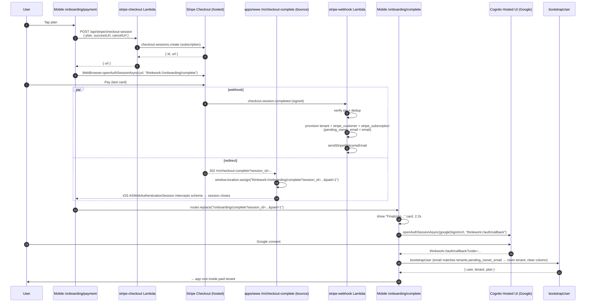

# feat: Stripe mobile checkout + shared plans config

## Overview

Bring the Stripe pricing → Checkout → welcome-email → Google-OAuth → `bootstrapUser`-claims-tenant flow we just shipped on the web ([2026-04-22-008 plan](2026-04-22-008-feat-stripe-pricing-and-post-checkout-onboarding-plan.md)) into the ThinkWork mobile app (Expo + React Native), so the channel we expect to own most signups has feature parity with the web and ships the same plan catalog.

Pulls the plan metadata (id / name / tagline / summary / features / cta / highlighted) out of `apps/www/src/lib/copy.ts` into a small TypeScript-only workspace package so both surfaces render the exact same plans from a single source. Keeps Stripe price-ID configuration on the server (env-var-driven, per-stage) and keeps the backend Lambdas unchanged except for one optional request-body field.

## Problem Frame

Web is live. Mobile is the channel we expect most signups to come from, and today `apps/mobile/app/onboarding/payment.tsx` is unrelated mockware (`Pro / Business / Enterprise` IDs, routes straight to `/sign-up?plan=`, no Stripe wire). The mobile plans also drift from the web set (`starter / team / enterprise`). Meanwhile Stripe Checkout is HTTPS-only for `success_url`, and the mobile app has never done a universal link — every prior deep-link return trip uses `WebBrowser.openAuthSessionAsync(url, "thinkwork://…")` matching on the custom scheme inside the iOS `ASWebAuthenticationSession`. We need to keep that pattern intact.

The institutional learning around workspace packages ([inline-helpers-vs-shared-package](../solutions/best-practices/inline-helpers-vs-shared-package-for-cross-surface-code-2026-04-21.md)) says to prefer two-copy inline + snapshot tests until there are three consumers. I'm deliberately overriding that here — the user requested extraction, the catalog will almost certainly grow (per-feature toggles, localized copy, a/b variants, admin-facing receipts), and Stripe's price-id rejection is a *product-side* drift alarm with a bad customer-facing failure mode ("Unknown plan" at checkout) rather than a clean developer-time one.

## Requirements Trace

- **R1.** Mobile pricing screen uses the exact same three plans as `apps/www/pricing` — same IDs, names, taglines, summaries, features, CTAs, highlighted choice. No mobile-specific plan variants.
- **R2.** Plan metadata lives in one shared workspace package, consumed by both `apps/www` and `apps/mobile`. Web's visual design is unchanged.
- **R3.** Tapping a plan on mobile opens Stripe Checkout in the in-app browser via `WebBrowser.openAuthSessionAsync`, completes payment, and returns to the app via a `thinkwork://` deep link.
- **R4.** After the return trip, the user is taken through the existing Cognito Google-OAuth sign-in flow (`auth-context.tsx:handleSignInWithGoogle`) and `bootstrapUser` claims the paid tenant by `pending_owner_email` (already implemented for the web flow).
- **R5.** The welcome email (already sent by the webhook) works for mobile payers exactly as it does for web payers — no per-surface email fork.
- **R6.** Shippable through the existing EAS + deploy pipeline. Lands on TestFlight first; App Store submission is a follow-up decision gated on Apple-review posture (see Risks).

## Scope Boundaries

- Stripe Checkout (hosted) only. No Stripe Elements, no `@stripe/stripe-react-native` SDK, no native Apple Pay integration.
- iOS via TestFlight. Android / Play Store delivery out of scope — ThinkWork is iOS-only today (`feedback_mobile_testflight_setup`).
- No subscription-management UI (upgrade / cancel / change plan) in either surface.
- No reversal of the web flow — web visitors keep landing on `admin.thinkwork.ai/onboarding/welcome`.
- No new Cognito flow — reuse `openAuthSessionAsync(getGoogleSignInUrl(redirectUri), redirectUri)` with `redirectUri = "thinkwork://auth/callback"` (the literal-string pattern at `apps/mobile/lib/auth-context.tsx:320-367`; do **not** swap to `Linking.createURL`).

### Deferred to Separate Tasks

- **App Store submission decision (3.1.1 IAP vs. 3.1.3(b) multiplatform exemption vs. External Link Entitlement):** separate product/legal call. Ships TestFlight-only until resolved. See "Risks & Dependencies."
- **Universal links via `associatedDomains`:** this plan uses a visible HTTPS bounce page + `thinkwork://` scheme hand-off instead. Upgrading to universal links is a future polish (requires Apple team provisioning + `apple-app-site-association` served from thinkwork.ai).
- **Retiring the `apps/mobile/app/sign-up.tsx` password flow:** orthogonal. Eric signs in via Google; the password flow stays as fallback until a separate cleanup.
- **Live-mode Stripe migration:** test-mode only until a separate go-live PR.
- **Admin "Billing" surface** to manage subscriptions: later.

## Context & Research

### Relevant Code and Patterns

- **Workspace package template:** `packages/workspace-defaults/` (TS-only, `"main": "./src/index.ts"`, no runtime deps, `tsc --build`). Cleanest shape to mirror for a shared data package that both Astro (Vite) and Expo (Metro) can consume without a bundler-specific conditional export.
- **Mobile Google-OAuth pattern (DO copy):** `apps/mobile/lib/auth-context.tsx` L320-367 — `handleSignInWithGoogle()`. Literal string `redirectUri = "thinkwork://auth/callback"`, no `preferEphemeralSession`, no `Linking.createURL`. The load-bearing comment at L333-351 explains why. Apply the same shape for Stripe — `redirectUri = "thinkwork://onboarding/complete"`.
- **Alt mobile deep-link patterns:** `components/credentials/IntegrationsSection.tsx` (Google Workspace / Microsoft 365 connect — `"thinkwork://settings/credentials"`), `app/settings/mcp-server-detail.tsx:106` (`"thinkwork://mcp-oauth-complete"`). Consistent — all use plain `openAuthSessionAsync` with a literal scheme. Don't copy `agents/[id]/skills.tsx:190` (the `Linking.createURL` path) — the Google-OAuth comment flags it as fragile.
- **Mobile styling pattern:** `apps/mobile/lib/theme.ts` exports `COLORS.light / COLORS.dark`; screens pick via `useColorScheme().colorScheme === "dark"`. NativeWind `className="…"` for layout, `COLORS[mode]` passed to `lucide-react-native` icons. See `apps/mobile/app/onboarding/payment.tsx` L16-23 and `apps/mobile/app/onboarding/complete.tsx` L9-19.
- **Mobile UI primitives:** `apps/mobile/components/ui/{card,button,text,input}.tsx` (shadcn-equivalents re-implemented for RN). Use these; don't roll custom pressables.
- **Backend request shape:** `packages/api/src/handlers/stripe-checkout.ts` already accepts optional `successUrl` / `cancelUrl` from the request body (L59-68). **No backend change needed for mobile to pass its own URLs** — the existing contract suffices.
- **Web plan metadata (the data we're extracting):** `apps/www/src/lib/copy.ts` L373-441. Consumers: `PricingGrid.astro` → `PricingCard.astro`. Web's `pricing.astro` inline script POSTs `{plan}` to `/api/stripe/checkout-session`.
- **Backend plan→price-id map (already deployed):** `packages/api/src/lib/stripe-plans.ts` + `STRIPE_PRICE_IDS_JSON` env var wired in `.github/workflows/deploy.yml`. No change here — the shared package doesn't touch price IDs.
- **`apps/mobile/app/_layout.tsx`** — Expo Router Stack explicitly lists every screen as `<Stack.Screen name="…" />`. New screens must be registered there. `publicRoutes` allowlist at L149 controls which screens skip the auth gate. The replaced `onboarding/payment` stays registered + public; the new post-checkout landing at `onboarding/complete` is already registered.

### Institutional Learnings

- **`feedback_mobile_oauth_ephemeral_session`** — NEVER pass `preferEphemeralSession: true` to `openAuthSessionAsync`. Plain `openAuthSessionAsync(url, redirectUri)` for both sign-in and MCP connect. Applies identically to the Stripe Checkout session.
- **`feedback_oauth_tenant_resolver`** — `ctx.auth.tenantId` is null for Google-federated users until the Cognito pre-token trigger lands. Downstream claim-tenant calls must use `resolveCallerTenantId(ctx)` (email fallback) — already in place on the server, no new server code needed.
- **`feedback_avoid_fire_and_forget_lambda_invokes`** — User-initiated Lambda invokes (checkout-session creation) must use `RequestResponse` + surface errors. The existing web handler already returns the URL synchronously; mobile reuses that verbatim.
- **`inline-helpers-vs-shared-package-for-cross-surface-code-2026-04-21.md`** — The default guidance is "inline 3x before extract." Explicitly overriding here because (a) user asked, (b) catalog will grow, (c) Stripe price-id rejection is a customer-facing failure, not a developer-time one. Plan carries a risk note so a future reader understands the trade-off.
- **`service-endpoint-vs-widening-resolvecaller-auth-2026-04-21.md`** — Stripe webhook stays a dedicated REST endpoint, signature-verified. Mobile changes nothing here; the flow converges at the same webhook.
- **`every-admin-mutation-requires-requiretenantadmin-2026-04-22.md`** — Post-claim mutations (subscription update, cancel) will need row-derived `tenantId` + `requireTenantAdmin`. Out of scope for this plan, but flagged for the follow-up subscription-management work.
- **`lambda-options-preflight-must-bypass-auth-2026-04-21.md`** — Not applicable: the mobile in-app browser doesn't emit a browser CORS preflight for Stripe's own page. But any *new* mobile-origin Lambda we add later needs this.

### External References

- Expo Web Browser: [`docs.expo.dev/versions/latest/sdk/webbrowser/`](https://docs.expo.dev/versions/latest/sdk/webbrowser/) — `openAuthSessionAsync(url, redirectUri, options)` semantics on iOS (`ASWebAuthenticationSession`).
- Stripe Checkout `success_url` / `cancel_url` — HTTPS-only, supports `{CHECKOUT_SESSION_ID}` templating.
- Apple App Store Review Guideline 3.1.1 (IAP for digital goods) + 3.1.3(b) (multiplatform services exemption) + Epic-settlement External Link Entitlement — the three posture options we may need to pick among for App Store submission.

## Key Technical Decisions

- **New workspace package `@thinkwork/pricing-config`.** TS-only, zero runtime deps, mirrors `packages/workspace-defaults`. Exports the plan catalog as `readonly` data, a `Plan` type, and small helpers (`getPlanById`, `getHighlightedPlan`). Overrides the "inline 3x" default; see Risks.
- **Mobile scheme return-trip, not universal link.** `success_url = https://thinkwork.ai/m/checkout-complete?session_id={CHECKOUT_SESSION_ID}` → the (new, public) Astro bounce page detects the session id and fires `thinkwork://onboarding/complete?session_id=<id>` via `window.location.assign`. The iOS `ASWebAuthenticationSession` inside `openAuthSessionAsync` intercepts the scheme and closes the sheet. Matches the four existing `openAuthSessionAsync` call sites; no Apple provisioning.
- **Bounce page lives on the marketing site, not admin.** `apps/www/src/pages/m/checkout-complete.astro` keeps admin (a Cognito-gated SPA) out of the redirect path; mobile payers never see an admin sign-in screen. Also the page needs zero auth state, which fits www's static-SSG shape.
- **`cancel_url = thinkwork://onboarding/payment`.** Stripe's cancel-URL validation is laxer than `success_url` (since it's pre-payment), and passing a custom scheme is fine — iOS ASWebAuthenticationSession intercepts and closes the sheet cleanly. If Stripe validates the URL and rejects, fall back to `https://thinkwork.ai/m/checkout-cancelled` with the same bounce-page pattern (mirror of the success bounce).
- **No backend Lambda changes.** `stripe-checkout.ts` already accepts optional `successUrl` / `cancelUrl` in the request body; mobile will pass its own. `stripe-webhook.ts` + the welcome email already work for any paying customer; the session metadata already carries `plan` so the email personalization just works.
- **Mobile sends absolute URLs; web continues to rely on env defaults.** Keeps the Lambda's env defaults (`STRIPE_CHECKOUT_SUCCESS_URL`, `STRIPE_CHECKOUT_CANCEL_URL`) as the web path, and mobile opts in explicitly. No feature flags, no branching logic on the server.
- **Mobile API base URL comes from `EXPO_PUBLIC_API_URL`.** Adds an `extra.apiUrl` env to `app.json` / `eas.json` profiles (mirror of how `EXPO_PUBLIC_GRAPHQL_URL` is threaded today). Defaults to `https://api.thinkwork.ai`; staging/dev can override.
- **Retire the mockware cleanly.** Rewrite `apps/mobile/app/onboarding/payment.tsx` in place — Expo Router registration + `publicRoutes` allowlist in `_layout.tsx` already reference this file, and preserving the path keeps the signup funnel wiring intact.
- **Don't extend `onboarding/complete.tsx` with the session-id auto-redirect yet.** The existing screen already handles a "plan" query param and polls agent status; I'd rather **not** put Stripe-specific logic in the post-checkout screen itself. Instead: the Astro bounce page fires `thinkwork://onboarding/complete?session_id=<id>&paid=1`; the RN screen sees `paid=1`, renders a brief "Finalizing your account…" card with a 2.2s delay, then kicks Google OAuth via `auth-context.handleSignInWithGoogle` — exactly what the web welcome page does.
- **Apple review posture: TestFlight-only for the first merge.** `payment.tsx` replacement ships. A follow-up PR will either (a) guard behind a remote-config flag for App Store builds, (b) reframe the screen as "Your ThinkWork plan" with no purchase CTA on iOS, or (c) file the 3.1.3(b) exemption. Pick the posture in a separate product conversation.

## Open Questions

### Resolved During Planning

- **Shared package vs. inline-with-tests?** → Shared package. User asked; catalog will grow; drift cost is user-facing. Override documented with a risk note.
- **Universal link vs. `thinkwork://` hand-off?** → `thinkwork://` via bounce page. Matches four existing patterns exactly; no Apple provisioning.
- **Who owns the bounce page — admin or www?** → www. Static + unauthenticated fits; admin's Cognito gate is hostile to a mobile payer.
- **Does the backend need a mobile-specific code path?** → No. `successUrl` is already a request-body parameter.
- **Does the mobile welcome experience need its own Cognito callback URL?** → No. Reuses `thinkwork://auth/callback` already registered in Cognito.

### Deferred to Implementation

- **Exact copy for the bounce page** — title, subtitle, fallback-link text when the `thinkwork://` scheme doesn't resolve (user on a desktop browser or an Android device without the app installed). Voice should match the rest of www/copy.ts.
- **Precise NativeWind class for pricing-card highlighted state** — mobile `theme.ts` doesn't expose a "brand/gradient" token the way web's Tailwind config does. Implementation-time choice: a filled-brand pill at the top of the card, or a bordered ring + brand-tinted background, whichever reads cleaner in dark mode.
- **Should the bounce page also send an App-Store-redirect fallback?** — if a payer with no app installed hits it, what do they see? First cut: a "download the app" link. Exact wording and whether to auto-redirect to the TestFlight/App Store URL is a content decision that can land after the flow is green.
- **Do we need a separate `EXPO_PUBLIC_STRIPE_ENABLED` flag to kill the pricing screen CTA in App Store review builds?** — depends on Apple posture decision. If we go with TestFlight-only for the first ship, don't need the flag yet.
- **Test-mode vs. live-mode for TestFlight dogfood** — stay on test-mode. Live-mode migration is a separate gate.

## Output Structure

```
packages/pricing-config/
  package.json                 # TS-only, mirrors workspace-defaults
  tsconfig.json                # extends ../../tsconfig.base.json
  src/
    index.ts                   # public surface: plans[], types, helpers
    plans.ts                   # the three plan objects
    types.ts                   # Plan interface
  test/
    plans.test.ts              # snapshot + helper coverage
```

```
apps/www/
  src/
    pages/
      m/
        checkout-complete.astro   # NEW — bounce page, fires thinkwork:// scheme
    lib/
      copy.ts                     # MODIFIED — pricing.plans now imports from shared
    components/
      PricingGrid.astro           # MODIFIED — iterate shared plans[], keep current PricingCard
```

```
apps/mobile/
  app/
    onboarding/
      payment.tsx              # REWRITTEN — real pricing screen, shared plans
      complete.tsx             # MODIFIED — ?paid=1 branch kicks Google OAuth
  lib/
    stripe-checkout.ts         # NEW — openAuthSessionAsync wrapper
  app.json                     # MODIFIED — extra.apiUrl
  eas.json                     # MODIFIED — per-profile EXPO_PUBLIC_API_URL
  package.json                 # MODIFIED — adds @thinkwork/pricing-config
```

## High-Level Technical Design

> *This illustrates the intended approach and is directional guidance for review, not implementation specification. The implementing agent should treat it as context, not code to reproduce.*



## Implementation Units

- [ ] **Unit 1: `@thinkwork/pricing-config` workspace package**

**Goal:** Single source of plan metadata for web and mobile. Pure data + types + tiny helpers. Zero runtime deps.

**Requirements:** R2.

**Dependencies:** None.

**Files:**
- Create: `packages/pricing-config/package.json`
- Create: `packages/pricing-config/tsconfig.json`
- Create: `packages/pricing-config/src/index.ts`
- Create: `packages/pricing-config/src/plans.ts`
- Create: `packages/pricing-config/src/types.ts`
- Create: `packages/pricing-config/test/plans.test.ts`

**Approach:**
- Mirror `packages/workspace-defaults/package.json` shape exactly: `"main": "./src/index.ts"`, `"exports": { ".": "./src/index.ts" }`, `"type": "module"`, scripts `build` (`tsc --build`), `typecheck`, `test` (vitest). No runtime deps.
- `tsconfig.json` extends `../../tsconfig.base.json`, `outDir: "./dist"`, `rootDir: "."` — same as `workspace-defaults`.
- `types.ts`: `Plan` interface with fields matching today's `copy.ts.pricing.plans` exactly: `id` (string literal union `'starter' | 'team' | 'enterprise'`), `name`, `tagline`, `summary`, `features` (`readonly string[]`), `cta`, `highlighted` (boolean). Add `PlanId` as the literal-union subtype.
- `plans.ts`: a single `readonly plans: readonly Plan[]` copy-paste-migrated from `apps/www/src/lib/copy.ts` with NO changes to strings, order, or highlighted flags.
- `index.ts`: re-export `plans`, `Plan`, `PlanId`, plus pure helpers `getPlanById(id: PlanId)`, `getHighlightedPlan()`, `getPlanIds()`. No Stripe SDK, no price IDs, no fetch.
- No `"react-native"` / `"browser"` conditional exports — pure data works in any bundler.

**Patterns to follow:**
- `packages/workspace-defaults/package.json`, `tsconfig.json`, `src/index.ts`.
- `apps/www/src/lib/copy.ts` L373-441 for the plan data payload.

**Test scenarios:**
- Happy path: `getPlanById("starter")` returns the expected plan object with exactly 5 feature strings.
- Happy path: `getHighlightedPlan()` returns the `team` plan and `team.highlighted === true`.
- Happy path: `getPlanIds()` returns `["starter","team","enterprise"]` in stable order.
- Edge case: `getPlanById("nonexistent" as PlanId)` returns `undefined` (with a TS `@ts-expect-error` in the test to exercise the runtime safety).
- Happy path: `plans` is deep-frozen or at minimum typed as `readonly` — assertion test that mutating it at runtime throws or the compiler rejects (compile-time assert via `// @ts-expect-error`).

**Verification:**
- `pnpm --filter @thinkwork/pricing-config test` passes.
- `pnpm --filter @thinkwork/pricing-config typecheck` passes.

---

- [ ] **Unit 2: Migrate `apps/www` to consume shared plans**

**Goal:** Web pricing page renders from `@thinkwork/pricing-config` with zero visual diff.

**Requirements:** R2.

**Dependencies:** Unit 1.

**Files:**
- Modify: `apps/www/package.json` (add `"@thinkwork/pricing-config": "workspace:*"`)
- Modify: `apps/www/src/lib/copy.ts` (replace hardcoded `plans` array with `import { plans } from "@thinkwork/pricing-config"`; keep `eyebrow`, `headline`, `headlineAccent`, `lede`, `smallPrint`, `finePrint`, `meta` locally since those are marketing-page-only)
- Modify: `apps/www/src/components/PricingGrid.astro` (import plans either via `pricing.plans` passthrough or directly — keep the indirection through `copy.pricing.plans` so templating stays consistent)

**Approach:**
- Reshape `copy.ts.pricing.plans` to be a re-export of the shared array: `import { plans } from "@thinkwork/pricing-config"; export const pricing = { ..., plans, ... }` — keeps existing downstream call sites working.
- `PricingCard.astro` props stay unchanged — it already takes the plan fields as primitives.
- No visual changes. No behavior changes. Pure refactor.
- Confirm via visual QA: run `pnpm --filter @thinkwork/www dev`, eyeball `/pricing` against the live deployed page, pixel-equal.

**Execution note:** Characterization-first. Before the refactor, save a snapshot of the rendered HTML at `/pricing` (either via `curl https://thinkwork.ai/pricing` or the Astro build output) and diff after to prove no visual regression.

**Patterns to follow:**
- Workspace dep declaration idiom from `apps/mobile/package.json` (`"@thinkwork/react-native-sdk": "workspace:*"`).

**Test scenarios:**
- Happy path: `pnpm --filter @thinkwork/www build` succeeds and the output `dist/pricing/index.html` contains the same rendered plan names and features as the current deployment.
- Integration: HTML diff of `dist/pricing/index.html` before vs. after — should be byte-identical except for the file-hash-suffixed script names (which drift every build anyway).

**Verification:**
- `pnpm --filter @thinkwork/www build` passes.
- Deployed `https://thinkwork.ai/pricing` still renders all three plans identically.

---

- [ ] **Unit 3: `apps/www/m/checkout-complete` bounce page**

**Goal:** Public HTTPS page at `https://thinkwork.ai/m/checkout-complete` that reads `?session_id=…` and fires `thinkwork://onboarding/complete?session_id=…&paid=1` so iOS `ASWebAuthenticationSession` can intercept and close. Also serves as a fallback UI if the scheme doesn't resolve (desktop browser, app not installed).

**Requirements:** R3, R6.

**Dependencies:** None (parallel with 1, 2).

**Files:**
- Create: `apps/www/src/pages/m/checkout-complete.astro`

**Approach:**
- Astro page wrapped in `Base.astro` for consistent shell. Theme-matches the rest of www (dark background, brand glow).
- Inline `<script>` reads `new URLSearchParams(window.location.search).get("session_id")`. If present, fires `window.location.assign("thinkwork://onboarding/complete?session_id=" + encodeURIComponent(sessionId) + "&paid=1")` immediately on `DOMContentLoaded`.
- Also render a visible UI: "Return to the ThinkWork app" headline, a "Tap here to reopen" link (same href), and small-print fallback: "If nothing happens, you can sign in at admin.thinkwork.ai/onboarding/welcome?session_id=…".
- If `session_id` is absent: show a "Something went wrong" card linking back to `/pricing`. No auto-redirect.
- SEO: `<meta name="robots" content="noindex">` — this is a mobile return page, no discovery value.
- No JS frameworks beyond inline vanilla. Matches `pricing.astro` pattern.

**Patterns to follow:**
- `apps/www/src/pages/pricing.astro` (layout + `<script is:inline define:vars={…}>`).
- `apps/admin/src/routes/onboarding/welcome.tsx` (fallback UX when session_id missing).

**Test scenarios:**
- Happy path: `GET /m/checkout-complete?session_id=cs_test_abc` returns HTML containing a `thinkwork://onboarding/complete?session_id=cs_test_abc&paid=1` link and an inline script that assigns `window.location` to that URL.
- Edge case: `GET /m/checkout-complete` (no query param) returns HTML without any `thinkwork://` link and a fallback "Return to pricing" CTA.
- Edge case: `GET /m/checkout-complete?session_id=%3Cscript%3Ealert(1)` — the rendered HTML escapes the value; no XSS.
- Integration: after merge + deploy, `curl https://thinkwork.ai/m/checkout-complete?session_id=test` returns 200 and the HTML contains the expected scheme URL.

**Verification:**
- Astro build succeeds. Page renders locally at `/m/checkout-complete?session_id=test`. After Stripe success, iOS ASWebAuthenticationSession closes on the scheme intercept and hands control back to `openAuthSessionAsync`'s promise.

---

- [ ] **Unit 4: Mobile Stripe checkout helper**

**Goal:** A single TypeScript helper that mobile screens call to kick off Stripe Checkout. Encapsulates the fetch, the `openAuthSessionAsync` call, the redirect-URI handling, and the success-parsing.

**Requirements:** R3.

**Dependencies:** Unit 1 (for the `Plan` type, though only `PlanId` is needed here).

**Files:**
- Create: `apps/mobile/lib/stripe-checkout.ts`
- Create: `apps/mobile/lib/stripe-checkout.test.ts`

**Approach:**
- Export `async function startStripeCheckout(planId: PlanId): Promise<StripeCheckoutResult>`.
- `StripeCheckoutResult` is a discriminated union: `{ status: "completed", sessionId: string } | { status: "cancel" } | { status: "dismiss" } | { status: "error", message: string }`.
- Internal flow:
  1. POST `${API_URL}/api/stripe/checkout-session` with `{ plan: planId, successUrl: "https://thinkwork.ai/m/checkout-complete?session_id={CHECKOUT_SESSION_ID}", cancelUrl: "https://thinkwork.ai/pricing" }`. Use the Stripe-documented `{CHECKOUT_SESSION_ID}` template — Stripe substitutes it; we don't have to.
  2. Receive `{ url }`. If server returned an error, return `{ status: "error", message }`.
  3. Call `WebBrowser.openAuthSessionAsync(url, "thinkwork://onboarding/complete")` — **no** `preferEphemeralSession`, **literal** return-scheme string (mirror `auth-context.handleSignInWithGoogle`).
  4. The `ASWebAuthenticationSession` closes when the user hits either (a) the bounce page which fires `thinkwork://onboarding/complete?session_id=…`, (b) explicit cancel, or (c) dismiss. Inspect the returned `result`:
     - `result.type === "success"` → parse `session_id` from `result.url` query; return `{ status: "completed", sessionId }`.
     - `result.type === "cancel" | "dismiss" | "locked"` → return the matching status.
  5. `API_URL` comes from `Constants.expoConfig?.extra?.apiUrl` (fallback `https://api.thinkwork.ai`).
- Pure functional, no React. Can be unit-tested in Node via a fetch mock + `WebBrowser` mock.

**Execution note:** Test-first. Write the fetch-mock + `WebBrowser`-mock harness before the implementation — the happy path and the four `result.type` branches are the core contract.

**Patterns to follow:**
- `apps/mobile/lib/auth-context.tsx` L320-367 (`handleSignInWithGoogle`) — literal return scheme, no ephemeral flag, structure of inspecting `result.type`.
- `apps/mobile/components/credentials/IntegrationsSection.tsx` — alternate `openAuthSessionAsync` call site.

**Test scenarios:**
- Happy path: checkout-session POST returns `{ url: "https://checkout.stripe.com/cs_test_xyz" }`; `openAuthSessionAsync` resolves with `{ type: "success", url: "thinkwork://onboarding/complete?session_id=cs_test_xyz&paid=1" }` → helper returns `{ status: "completed", sessionId: "cs_test_xyz" }`.
- Edge case: `result.type === "cancel"` → returns `{ status: "cancel" }` without throwing.
- Edge case: `result.type === "dismiss"` → returns `{ status: "dismiss" }`.
- Error path: checkout-session POST returns 400 `{ error: "Unknown plan" }` → helper returns `{ status: "error", message: /Unknown plan/ }`, does not call `openAuthSessionAsync`.
- Error path: checkout-session POST throws (network error) → helper returns `{ status: "error", message: /network|fetch/ }`.
- Error path: Stripe returns a success redirect with no `session_id` query → returns `{ status: "error", message: /missing session/ }` and logs for diagnostics.

**Verification:**
- All six test scenarios pass. No `preferEphemeralSession` anywhere in the file. Grep confirms no `Linking.createURL` usage.

---

- [ ] **Unit 5: Rewrite `apps/mobile/app/onboarding/payment.tsx` as real pricing screen**

**Goal:** Replace the mockware with a native pricing screen that renders the three shared plans, uses the mobile theme, and calls the Unit-4 helper when a plan is selected.

**Requirements:** R1, R3.

**Dependencies:** Units 1, 4.

**Files:**
- Modify (rewrite): `apps/mobile/app/onboarding/payment.tsx`
- Modify: `apps/mobile/package.json` (add `"@thinkwork/pricing-config": "workspace:*"`)

**Approach:**
- Import `plans`, `getHighlightedPlan` from `@thinkwork/pricing-config`.
- Top-level scroll view (`<SafeAreaView>` → `<ScrollView>`) with header ("Pick your plan"), subhead (copy from `apps/www/src/lib/copy.ts.pricing.lede` — **could be pulled into the shared package in a follow-up if we want to share the lede too**), three cards, small-print footer.
- Each card: name, tagline, summary, checkmarked features list, primary button with the plan's `cta` label. Highlighted card (`team`) gets a brand-tinted border + "Recommended" pill.
- Card tap → optimistic UI: disable button, show inline spinner, call `startStripeCheckout(plan.id)` from Unit 4.
- On result:
  - `completed` → `router.replace("/onboarding/complete?session_id=" + sessionId + "&paid=1")`.
  - `cancel` / `dismiss` → re-enable button, no message (user explicitly backed out).
  - `error` → show inline toast/error message under the card, re-enable button. Don't throw.
- Uses `COLORS[colorScheme]`, `useColorScheme`, `@/components/ui/{Card,Button,Text}` — mirrors existing `payment.tsx` mockware styling pattern so the screen feels native.
- Keep the Expo Router `_layout.tsx` `<Stack.Screen name="onboarding/payment" />` registration unchanged; keep it in `publicRoutes` allowlist.

**Patterns to follow:**
- Current `apps/mobile/app/onboarding/payment.tsx` for card layout, NativeWind styling, and `COLORS` usage (the layout is decent; the *logic* is what's being replaced).
- `apps/mobile/app/onboarding/complete.tsx` for public-screen shell + SafeAreaView idiom.

**Test scenarios:**
- Happy path (integration via RN Testing Library): render the screen → three plan cards appear with IDs `starter`, `team`, `enterprise` → tapping "Choose Team" calls `startStripeCheckout("team")`.
- Edge case: on a completed checkout result, the screen navigates to `/onboarding/complete?session_id=...&paid=1`.
- Edge case: on a cancel result, the button re-enables and no error banner is shown.
- Edge case: on an error result, the banner appears with the returned message text (not the raw exception).
- Visual: highlighted plan (`team`) has the "Recommended" pill and distinct border; other two don't.

**Verification:**
- Expo dev server + iOS simulator: screen renders, buttons tappable, Stripe Checkout opens in the in-app browser, cancel/complete round-trip works.

---

- [ ] **Unit 6: Wire `apps/mobile/app/onboarding/complete.tsx` for the post-checkout → Google OAuth handoff**

**Goal:** When `onboarding/complete` is loaded with `?paid=1&session_id=…`, show a brief "finalizing" card, then kick Google OAuth; `bootstrapUser` claims the paid tenant on the other side.

**Requirements:** R4, R5.

**Dependencies:** Units 3, 5 (the screen receives the deep-link from the bounce page).

**Files:**
- Modify: `apps/mobile/app/onboarding/complete.tsx`

**Approach:**
- Read query params via `useLocalSearchParams<{ session_id?: string; paid?: string }>()`.
- If `paid === "1"` and `session_id` is present:
  1. Render a branded "Finalizing your ThinkWork account…" card (mirror `apps/admin/src/routes/onboarding/welcome.tsx`).
  2. Start a 2.2s timer (same rationale as the web welcome page — webhook typically lands within <500ms, 2.2s covers the long tail).
  3. On timer fire (or immediately if `isAuthenticated === true`), call `handleSignInWithGoogle()` from `useAuth()` context to open Cognito Hosted UI with Google.
  4. On return from Google OAuth, the context resolves, the RN app hydrates the session, and `bootstrapUser` runs on the first GraphQL call — claims the paid tenant because `tenants.pending_owner_email === signedInUserEmail`.
  5. `router.replace("/")` (app root) after auth resolves.
- If `paid` flag is missing: existing behavior preserved (the screen is already used by email-signup flow).
- Use a `snapRef.current` ref to hold `session_id` across possible unmount/remount (per `docs/solutions/best-practices/react-native-force-sim-camera-persistence-2026-04-20.md` — RN Router unmount + remount loses render-time closures).

**Patterns to follow:**
- `apps/admin/src/routes/onboarding/welcome.tsx` — identical state-machine shape.
- `apps/mobile/lib/auth-context.tsx handleSignInWithGoogle` — literal return-scheme string, no ephemeral flag.

**Test scenarios:**
- Happy path: mount with `?paid=1&session_id=cs_test_xyz` → after 2.2s, `handleSignInWithGoogle` is called with the correct session_id stashed in context/state.
- Edge case: mount with `?paid=1` but no `session_id` → skip auto-redirect, show fallback state with "contact support" text.
- Edge case: mount with no `paid` flag → preserve current email-signup behavior (render the existing copy, no new behavior).
- Edge case: already-authenticated user somehow lands here with `?paid=1&session_id=…` → skip OAuth, route straight to app root; `bootstrapUser` runs on next GraphQL call.
- Integration: after OAuth returns success, the app is inside a tenant whose `plan` matches the purchased one. (Not testable in pure RN unit tests — verified in end-to-end dogfood.)

**Verification:**
- iOS simulator end-to-end: purchase via the pricing screen → Stripe Checkout → bounce page → Google OAuth → app root with paid tenant.

---

- [ ] **Unit 7: EAS + Expo config for `EXPO_PUBLIC_API_URL`**

**Goal:** The mobile bundle needs to know which API base to POST at. Add it to the Expo config and EAS profiles so each build flavor (dev, preview, production) targets the right stack.

**Requirements:** R6.

**Dependencies:** None (parallel with 4, 5).

**Files:**
- Modify: `apps/mobile/app.json` (add `extra.apiUrl` fallback)
- Modify: `apps/mobile/eas.json` (per-profile `env.EXPO_PUBLIC_API_URL`)
- Modify: `apps/mobile/lib/stripe-checkout.ts` (Unit 4's `API_URL` resolution)

**Approach:**
- `app.json`: add `expo.extra.apiUrl = "https://api.thinkwork.ai"` as the build-default. Expo automatically surfaces `Constants.expoConfig.extra.apiUrl` at runtime.
- `eas.json`: add `env.EXPO_PUBLIC_API_URL` to each profile — production + preview point to `https://api.thinkwork.ai`, development points to whatever the dev stack resolves to (currently the same). This gives us per-profile override without a code change.
- Unit 4's helper resolves `Constants.expoConfig?.extra?.apiUrl` first, falls back to `process.env.EXPO_PUBLIC_API_URL`, fallback-fallback `"https://api.thinkwork.ai"`.

**Patterns to follow:**
- Existing `EXPO_PUBLIC_GRAPHQL_URL` wiring in `eas.json` (mirror the shape).

**Test scenarios:**
- Happy path: `pnpm --filter @thinkwork/mobile start` boots with the default `apiUrl`; `Constants.expoConfig.extra.apiUrl === "https://api.thinkwork.ai"`.
- Edge case: missing `extra.apiUrl` (defensive) → helper falls back to env + hardcoded default without crashing.

**Test expectation: none — pure config wiring. Covered by Unit 4's fetch-mock test + the e2e dogfood.**

**Verification:**
- `Constants.expoConfig.extra.apiUrl` resolves to the expected URL in the simulator. A TestFlight build hits the production API.

---

- [ ] **Unit 8: Dogfood end-to-end + sanity-check the retired mockware**

**Goal:** Exercise the full mobile pricing → Stripe → welcome-email → Google OAuth → paid tenant loop on a real TestFlight build. Catch Apple review surprises before they're a blocker.

**Requirements:** All (integration).

**Dependencies:** Units 1–7 merged.

**Files:** None — this is a verification / runbook unit.

**Approach:**
- Build a preview EAS build pointed at test-mode Stripe + dev API.
- On-device run-through:
  1. Open the mobile app. (If there's a sign-in gate blocking `onboarding/payment`, route there directly since `publicRoutes` allowlist covers it.)
  2. Tap each of the three plans in turn. Confirm Stripe Checkout opens in an in-app browser, not the native Safari.
  3. Pay with a test card (`4242 4242 4242 4242`, any future expiry, any CVC).
  4. Confirm the bounce page appears briefly (or silently redirects) and the in-app browser closes.
  5. Confirm the welcome card renders on `onboarding/complete`, waits, then kicks Google OAuth.
  6. Sign in with Google.
  7. Confirm the app lands in a paid tenant (check `me` returns the correct plan in a debug overlay or via the server logs).
- Confirm the welcome email arrived (same SES from `hello@agents.thinkwork.ai`).
- Confirm `stripe_events` row exists; confirm `tenants.pending_owner_email` is `null` after OAuth claim.
- Document the posture outcome for Apple review — "shipped to TestFlight, App Store submission gated on 3.1.3(b) review."

**Patterns to follow:**
- Web dogfood runbook from the 2026-04-22-008 plan's "Test plan" section — mirror it for mobile.

**Test scenarios:**
- Happy path: end-to-end completes for each of the three plans, user ends up in a paid tenant with the correct `plan` value.
- Cancel path: cancel inside Stripe Checkout returns to `/pricing` (mobile screen) via the cancel_url, user stays on pricing.
- Replay path: trigger the webhook twice via `stripe events resend …` — only one tenant row created, no double email.

**Verification:**
- Screenshots + session IDs for each plan attached to the PR body.
- TestFlight build number recorded in the merge commit footer.

## System-Wide Impact

- **Interaction graph:**
  - `apps/mobile/app/onboarding/payment.tsx` → `apps/mobile/lib/stripe-checkout.ts` → `stripe-checkout` Lambda → Stripe → `thinkwork.ai/m/checkout-complete` → `thinkwork://onboarding/complete` → `apps/mobile/app/onboarding/complete.tsx` → Cognito Hosted UI → `bootstrapUser` → Aurora.
  - Webhook path (Stripe → `stripe-webhook` Lambda → Aurora + SES) is **unchanged**. Mobile payers hit the same webhook as web payers; the `source` metadata field distinguishes them (`"www-pricing"` vs. `"mobile-pricing"` — implementation-time decision).
- **Error propagation:**
  - Lambda errors surface in the mobile fetch response → `startStripeCheckout` returns `{ status: "error" }` → screen shows inline banner.
  - Stripe Checkout errors are displayed by Stripe's own page, no app involvement.
  - Bounce-page JS errors fall back to visible link; no silent failure.
  - Google OAuth cancel on the post-checkout screen: user stays on the welcome card with a "Try again" button. Their tenant is already paid — the operator can manually re-send the welcome email if they're lost.
- **State lifecycle risks:**
  - **Unmount flicker**: if `onboarding/complete.tsx` unmounts during the 2.2s timer (user backgrounds the app), the timer should clear its handler and stash the session_id in a `snapRef` per RN patterns; remount reads the ref and resumes. Without this, the OAuth kick is lost.
  - **Dismissed in-app browser**: covered by Unit 4 returning `{ status: "dismiss" }`; the screen does not navigate and the user can re-tap the plan.
  - **Double-charge via repeated taps**: guarded by the per-card button-disable during the fetch+browser round-trip. If a user somehow opens two simultaneous sessions via network glitching, Stripe treats them as independent (two `cs_test_…` IDs); the webhook dedup on `stripe_events.stripe_event_id` still holds, but you'd get two `pending_owner_email` tenants. Low-likelihood, not mitigated in this plan.
- **API surface parity:**
  - Backend `POST /api/stripe/checkout-session` already accepts the `successUrl` / `cancelUrl` params; no new endpoint, no new Lambda.
  - Welcome email unchanged; `sendStripeWelcomeEmail` has no per-surface branch.
- **Integration coverage:**
  - Unit tests (Unit 4) prove the client-side contract in isolation.
  - Dogfood run (Unit 8) proves the end-to-end chain nothing mocks.
- **Unchanged invariants:**
  - Web `/pricing` page's visual design and behavior.
  - `stripe-checkout` and `stripe-webhook` Lambdas' response shape, error semantics, and idempotency.
  - `bootstrapUser` resolver behavior — web and mobile both feed it the same "user signed in via Google; claim the pending_owner_email tenant if one exists" flow.
  - `STRIPE_PRICE_IDS_JSON` as the single per-stage price map. Shared package stays display-only.

## Risks & Dependencies

| Risk | Mitigation |
|------|------------|
| **Apple App Store review** rejects the in-app Stripe purchase under 3.1.1 | Ship TestFlight-only for the first merge. Three posture options (iOS feature flag, "manage your subscription" framing, 3.1.3(b) exemption) are a separate product decision. Unit 8 records the posture. |
| **Shared package consumed by Metro + Vite** is novel territory for the repo (no prior examples) | Mirror `packages/workspace-defaults` exactly, which is TS-only + no runtime deps. Keep the package display-only — no Node-only deps, no native deps. `react-native` conditional exports not needed since it's pure data. |
| **Drift between shared-package plan IDs and `STRIPE_PRICE_IDS_JSON`** (someone adds a "pro" plan to the catalog without adding a price ID) | Server-side check already rejects unknown plan IDs with a 400. Add a CI-time assertion (optional) that every `PlanId` literal has a matching entry in `STRIPE_PRICE_IDS_JSON` for staging + prod. Defer that assertion to a follow-up. |
| **`thinkwork://` scheme unreachable on the bounce page** (app not installed, desktop browser) | Bounce page renders a visible "Return to app" link + a small-print "sign in at admin.thinkwork.ai/onboarding/welcome?session_id=…" fallback. User is never fully stranded — the tenant is already paid, the welcome email links to the admin flow too. |
| **iOS `ASWebAuthenticationSession` sheet closes on the `thinkwork://` intercept, but the promise hasn't resolved cleanly** | Match the existing `auth-context.handleSignInWithGoogle` pattern exactly — it's been production-validated against this exact `ASWebAuthenticationSession` surface. If we hit weirdness, cross-reference the load-bearing comment at `auth-context.tsx:333-351`. |
| **`openAuthSessionAsync` + cached sign-in state** (ephemeral flag off) conflicts with privacy posture | Memory `feedback_mobile_oauth_ephemeral_session` says NEVER pass `preferEphemeralSession: true`. Follow it. Rationale: iOS prefill + prior sign-in recall is the whole point for UX continuity. |
| **Double-booking of `onboarding/complete` screen** (used both by email signup and by post-checkout) — feature drift / coupling | Unit 6 branches on `?paid=1` explicitly. Email-signup path is unchanged. If complexity grows, split into two screens in a follow-up. |
| **Webhook arrives after mobile Google OAuth completes** — `bootstrapUser` sees no pending tenant | Same failure mode the web flow has; same 2.2s pre-OAuth delay here mitigates the typical case. A dedicated provisioning-status polling endpoint is a cross-surface follow-up. |
| **Stripe rejects `cancel_url = "thinkwork://…"` as non-HTTPS** | Fallback: host a `/m/checkout-cancelled.astro` bounce page mirroring the success bounce. Decide at implementation time based on empirical Stripe response. |
| **`EXPO_PUBLIC_API_URL` env drift between EAS profiles and runtime** | Unit 7's helper prefers `Constants.expoConfig.extra.apiUrl` (baked in at build), falls back to env, then hardcoded `api.thinkwork.ai`. Accidental omission still ships a working build. |

## Documentation / Operational Notes

- **Operator runbook update:** add a section "Mobile Stripe dogfood" to the existing Stripe operator doc (or add a new `docs/solutions/best-practices/stripe-mobile-checkout-testflight-runbook.md` post-merge) covering the test-card flow, how to resend a stuck webhook, how to verify the paid-tenant claim.
- **Solution doc post-merge:** write up (a) the workspace-package-shared-by-Vite-and-Metro pattern, (b) the `openAuthSessionAsync` → HTTPS bounce page → `thinkwork://` scheme hand-off pattern. Both are net-new institutional knowledge.
- **TestFlight dogfood notes:** attach screenshots + session IDs + a note on the Apple-review posture decision to the PR body.
- **Alerts:** no new CloudWatch alarms needed — the existing `stripe-webhook` 4xx alarm covers mobile traffic too (same endpoint).

## Sources & References

- Origin: user request ("extend the Stripe flow to the ThinkWork mobile app", 2026-04-22, via `/compound-engineering:lfg`).
- Prior plan (web): [docs/plans/2026-04-22-008-feat-stripe-pricing-and-post-checkout-onboarding-plan.md](./2026-04-22-008-feat-stripe-pricing-and-post-checkout-onboarding-plan.md).
- Load-bearing patterns:
  - `apps/mobile/lib/auth-context.tsx` L320-367 (mobile Google-OAuth via `openAuthSessionAsync`)
  - `apps/mobile/components/credentials/IntegrationsSection.tsx` (alt `openAuthSessionAsync` pattern)
  - `packages/workspace-defaults/` (TS-only workspace package template)
  - `apps/www/src/pages/pricing.astro` + `components/PricingCard.astro` + `components/PricingGrid.astro` + `src/lib/copy.ts` L373-441
  - `packages/api/src/handlers/stripe-checkout.ts` (accepts `successUrl` / `cancelUrl`)
  - `packages/api/src/handlers/stripe-webhook.ts` + `lib/stripe-welcome-email.ts`
  - `apps/admin/src/routes/onboarding/welcome.tsx` (state-machine shape for post-checkout welcome)
- Load-bearing institutional learnings:
  - `docs/solutions/best-practices/inline-helpers-vs-shared-package-for-cross-surface-code-2026-04-21.md` (default is inline; override documented)
  - `docs/solutions/best-practices/every-admin-mutation-requires-requiretenantadmin-2026-04-22.md` (post-claim subscription ops, deferred)
  - `docs/solutions/integration-issues/lambda-options-preflight-must-bypass-auth-2026-04-21.md` (any future mobile-origin Lambda)
  - `docs/solutions/best-practices/service-endpoint-vs-widening-resolvecaller-auth-2026-04-21.md` (webhook stays dedicated)
  - `docs/solutions/logic-errors/oauth-authorize-wrong-user-id-binding-2026-04-21.md` (row-derived user matching on claim)
  - `docs/solutions/best-practices/oauth-client-credentials-in-secrets-manager-2026-04-21.md` (Stripe secret already correctly placed)
  - `docs/solutions/best-practices/react-native-force-sim-camera-persistence-2026-04-20.md` (unmount/remount state via `snapRef`)
- Memories applied: `feedback_mobile_oauth_ephemeral_session`, `feedback_oauth_tenant_resolver`, `feedback_avoid_fire_and_forget_lambda_invokes`, `project_mobile_testflight_setup`, `project_admin_worktree_cognito_callbacks` (Cognito callback URL parity — `thinkwork://auth/callback` already registered).
- External references: Expo `WebBrowser` docs, Stripe `success_url` templating, Apple App Store Review Guideline 3.1.1 + 3.1.3(b).
