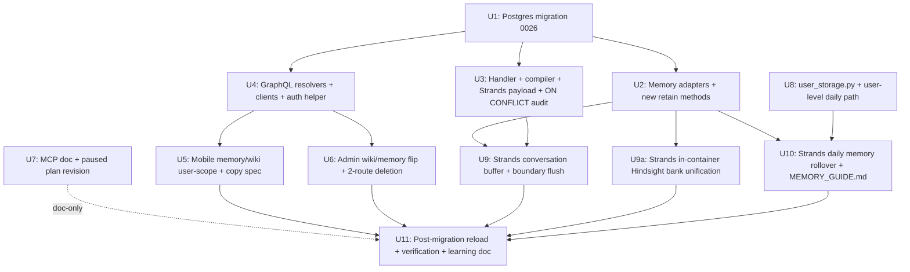

> **PAUSED 2026-04-27.** The runtime ingest pieces of this plan (Hindsight conversation ingest, daily workspace memory channel, S3 user-scoped tier for daily memory, wipe-and-reload migration — i.e., U8, U10, U11) are absorbed into `docs/plans/2026-04-27-002-feat-hindsight-ingest-and-runtime-cleanup-plan.md`. The **broader user-scope schema cascade** (U1 Postgres migration, U2 memory adapters, U3 handler/compiler, U4 GraphQL, U5 mobile, U6 admin, U7 MCP, U9 boundary-flush — dropped, U9a in-container bank unification) is not absorbed and remains paused here. **Re-evaluation trigger:** revisit when `agents.human_pair_id` fallback (`packages/api/src/lib/memory/adapters/hindsight-adapter.ts:437`) becomes the next refactor target, OR when `wiki_*` tables need a multi-agent overhaul, OR by 2026-Q3, whichever comes first. Do not start units from this plan as written without first reconciling against the 4/27-002 plan and any subsequent schema-cascade plan.

# refactor: User-Scoped Memory + Wiki Migration + Hindsight Conversation Ingest + Daily Workspace Memory

## Overview

Three related migrations shipped as one coordinated effort because plan 010 is unstarted and the new ingest-reshape work would otherwise have to edit the same files twice:

1. **Memory + wiki ownership flip agent → user** across Hindsight and AgentCore. User-level memory aggregates knowledge across all of a user's agents. This unlocks the product decision in #2 below without fragmenting the user's knowledge base.
2. **Multi-agent per user, first-class.** The product explicitly supports multiple agents per user, each with its own template, tools, skills, and capabilities. Plan 010's "one agent per user" invariant is **rejected** — **tool-capability** segmentation (e.g., keeping admin MCP tools attached to an admin-flavored agent so they're not invokable from an operations agent) is a real safety lever. **Information segmentation is explicitly NOT in this model**: memory and wiki are user-level, so anything retained via any of the user's agents is recallable by all of them. Workspace stays per-agent so each template's tool-state remains isolated, but memory is the shared substrate. Users and assistants should treat retained memory as visible to every agent the user owns.
3. **Hindsight conversation-level ingest.** Replace per-message, per-turn, document-id-less items with one item per conversation (`document_id=threadId`, `update_mode=replace`) flushed on boundary (idle 15 min OR 20 turns since last flush). Per-turn Strands → Lambda invoke is removed.
4. **Daily memory as a second Hindsight ingest source.** Whichever of the user's agents is currently chatting with the user curates a per-day note at a user-level S3 path `tenants/{T}/users/{U}/daily/YYYY-MM-DD.md` via a new `daily_memory_append` tool; on the first turn of a new UTC date (by *any* of the user's agents), the runtime ingests the prior day's file to Hindsight as one item (`document_id=workspace_daily:<userId>:<YYYY-MM-DD>`, `update_mode=replace`).

This plan supersedes `docs/plans/2026-04-20-010-refactor-user-scoped-memory-wiki-plan.md`. Plan 010's status flips to `superseded` in the same PR that merges this plan's Unit 1. This plan deliberately *diverges* from plan 010 on the multi-agent decision — plan 010 retired the user-facing agent concept; this plan preserves it as an explicit capability-segmentation lever.

---

## Problem Frame

**Two defects in Hindsight ingest** (verified against `packages/api/src/lib/memory/adapters/hindsight-adapter.ts:178-209`): `retainTurn()` splits each turn into per-message items with `context="thread_turn"` and no `document_id`. Hindsight's docs explicitly recommend a full conversation as a single item; our shape loses cross-turn extraction context and duplicates on every re-ingest. Also, we have no curated-by-the-agent ingest source — only raw transcript.

**Agent-as-owner-of-memory is the wrong abstraction.** Plan 010's origin brainstorm argued that "every user has exactly one agent, so agent-as-owner is speculative flexibility." Re-examining the premise: agent-as-owner is wrong regardless of cardinality — capabilities differ across a user's tasks (operations vs. admin vs. code work), but knowledge should aggregate across those tasks. A single user-level memory bank lets one user legitimately run multiple task-specialized agents while their learnings, decisions, and recall continue to compound. Cross-agent reasoning ("what did I learn last month" across any of my agents) becomes possible; adapters stop keying specialization off the wrong dimension; MCP exposure becomes a principled per-agent picker rather than a single-selection wart.

**Folding the three concerns reduces migration churn.** Plan 010's Units 2 and 3 edit exactly the files the ingest reshape needs to edit (`hindsight-adapter.ts`, `api_memory_client.py`, `memory-retain.ts`). Shipping them separately rewrites these files twice. Shipping them together costs one migration, one PR stack, one journal-reload.

---

## Requirements Trace

**Scope flip (carried from plan 010, see origin: `docs/brainstorms/2026-04-20-user-scoped-memory-wiki-requirements.md`)**

- R1. Memory + wiki ownership is user-scoped end-to-end: schema, adapters, compiler, GraphQL, MCP surface.
- R2. Auth check on wiki/memory resolvers is composite: derive `callerUserId` + `callerTenantId` via `resolveCaller(ctx)` (**not** `ctx.auth.principalId` directly — that's the Cognito sub, which diverges from `users.id` for Google-federated accounts), then require `callerUserId === args.userId` AND `callerTenantId === args.tenantId`.
- R3. User-facing agent concept is **retained** as a selector between the user's multiple agents. Mobile `AgentPicker` stays; admin agent-management routes stay. Only per-agent memory/wiki views are retired (those flip to user-level) and subagent-related surfaces (a future concept) are deleted. The user chooses which agent to chat with; memory aggregates across all of them.
- R4. Strands runtime container `api_memory_client.py` flips retain payload from `{agentId}` to `{userId}`. Deploy order is neutralized by the dual-payload Lambda compat mode.
- R5. MCP requirements doc + paused plan revision land with this migration (agent-picker deletion, token claims flip, synthetic-thread derivation change, credential scrubber expansion, per-user opt-in flag). MCP plan (`docs/plans/2026-04-20-008-feat-memory-wiki-mcp-server-plan.md`) stays paused; unpause is a separate PR after this migration merges.
- R6. Wiki compile handling of external-origin retains is default-off, gated on a **per-user** flag `users.wiki_compile_external_enabled` (not per-tenant — per `feedback_user_opt_in_over_admin_config`: user opt-in, admin owns infra).
- R7. Migration sequence: validate invariant → drop FKs → TRUNCATE wiki tables → UPDATE threads (derive `user_id` from `agent_id` → `agents.human_pair_id`) → rename `threads.agent_id` column → add FKs to `users.id` → wipe Hindsight schema + delete AgentCore namespaces → redeploy code → run journal-import for Eric + Amy.
- R8. Test coverage: cross-user-within-tenant isolation fixture, cross-tenant-member isolation fixture, credential-redaction on all retain string fields, `/wiki?view=graph` + `/memory?view=graph` cold-load regression, post-migration journal-import rebuild smoke.
- R9. `ON CONFLICT` paths in the wiki/memory pipeline are audited for silent-write-drop risk. Enumerated scope: 17 files. Reference: `docs/solutions/logic-errors/compile-continuation-dedupe-bucket-2026-04-20.md`.
- R10. **REMOVED in plan revision 2026-04-24.** Original plan 010 enforced "one agent per user" via a partial unique index on `agents (tenant_id, human_pair_id) WHERE source='user' AND human_pair_id IS NOT NULL`. This plan rejects that invariant: users have multiple agents for capability segmentation. No uniqueness constraint is added. The `agents` table retains its current shape.

**Hindsight conversation ingest (new, see origin: `docs/brainstorms/2026-04-24-hindsight-retain-reshape-and-daily-memory-requirements.md`)**

- R11. Thread content is retained to Hindsight as **one item per conversation**, not per message. Adapter's per-message-splitting at `hindsight-adapter.ts:178-209` is removed.
- R12. Each thread retain uses `document_id = threadId`, `update_mode = "replace"`, `context = "thinkwork_thread"`. Content format: `"<role> (<ISO-8601 timestamp>): <text>"` one per line, whole transcript concatenated. Empty / whitespace-only messages dropped.
- R13. Retain trigger is **boundary-based, not per-turn**: flush when idle ≥ 15 min OR turns-since-last-flush ≥ 20, whichever first. Thresholds are env config (`THINKWORK_RETAIN_IDLE_SECONDS`, `THINKWORK_RETAIN_TURN_COUNT`), defaults defensible for v1.
- R14. The per-turn `retain_turn_pair()` call site in `server.py` is removed. The memory-retain Lambda stays (it proxies the new conversation-retain and daily-retain payload shapes).
- R15. Flush is stateless at the adapter layer: the Strands-side scheduler only tracks dirty-flag + idle timer + turn count per `threadId`. On boundary, it fetches the full transcript from `threads.messages` (Postgres, authoritative) and posts to Hindsight. Process restart loses the scheduler but not the transcript; next flush reconstitutes correctly.

**Daily workspace memory source (new)**

- R16. **Workspace S3 prefix stays agent-scoped** (`tenants/{tenantId}/agents/{agentId}/workspace/`). No migration. Per-agent workspace preserves the capability-segmentation benefit of multi-agent: each template's tool state (skills scratch, per-agent lessons, per-agent contacts) remains isolated. The existing `workspace_memory_write/read/list` tool contract is unchanged.
- R17. Daily memory is a **new user-level storage tier**, separate from the agent workspace. Files live at `tenants/{tenantId}/users/{userId}/daily/YYYY-MM-DD.md` (markdown, UTC date). A new `daily_memory_append(note)` tool writes there via a new `user_storage.py` helper in `agent-container/`. The user's active agent (whichever one the user is chatting with) adds to today's file; the file is user-level so content from any of the user's agents aggregates into the same daily note. `packages/system-workspace/MEMORY_GUIDE.md` gets a new "Daily working memory" section instructing the assistant when and what to write via `daily_memory_append`, and explicitly NOT to journal every turn. No runtime auto-distill.
- R18. A pre-turn rollover hook in the Strands runtime (inserted between `apply_invocation_env(...)` return and the `_ensure_workspace_ready(...)` call — exact line anchors resolved at implementation time) checks a user-level marker at `tenants/{T}/users/{U}/daily/latest.txt` against today's UTC date. On date change, if the prior day's file has non-empty content, it posts one Hindsight item: `document_id=workspace_daily:<userId>:<YYYY-MM-DD>`, `update_mode=replace`, `context=thinkwork_workspace_daily`, `metadata={userId, tenantId, date}`. Then advances the marker.
- R19. Rollover is idempotent: re-running for the same (userId, date) replaces the same document; empty files are a no-op; crash mid-rollover (marker not yet advanced) repeats the ingest safely.
- R20. V1 rollover uses UTC midnight. `users.timezone` does not exist today; per-user timezone is a separate follow-up.

**Origin actors:** A1 Strands runtime, A2 Thinkwork agent, A3 memory-retain Lambda, A4 Hindsight, A5 human user.
**Origin flows:** F1 thread-conversation retain (boundary flush), F2 daily workspace memory rollover.
**Origin acceptance examples:** AE1 (covers R11, R12), AE2 (covers R13, R14), AE3 (covers R18, R19), AE4 (covers R17).

---

## Scope Boundaries

**In scope:**

- Schema migration: adds `threads.user_id` column (backfilled from `agents.human_pair_id`), adds `users.wiki_compile_external_enabled` column, **flips wiki table FKs to `users.id`**, truncates wiki data. `threads.agent_id` stays (dual-keyed — memory uses `user_id`, runtime routing uses `agent_id`). No agents uniqueness constraint.
- Wipe of external data (Hindsight + AgentCore); memory adapters flipped to user-derived bank/namespace naming; handler + compiler + journal-import user-scoped; GraphQL resolvers for memory/wiki flip to `userId` (non-memory/wiki resolvers that use `agentId` — chat, heartbeats, orchestration — stay as-is).
- Mobile: AgentPicker stays. Memory and wiki screens flip to user-scoped (no agent filter); copy emphasizes knowledge aggregates across the user's agents.
- Admin: per-agent memory view and subagents route delete; other agent-management routes stay (templates, skills, workspaces, scheduled jobs, knowledge bases, invites all remain as active surfaces).
- MCP doc revision: keeps the agent picker (it's a feature in a multi-agent world); memory/wiki tool shapes flip to `userId`; chat/runtime tool shapes keep `agentId`.
- New user-level storage tier at `tenants/{tenantId}/users/{userId}/daily/` for daily memory; new `user_storage.py` helper in `agent-container/`.
- Strands conversation buffer scheduler (dirty-flag, idle timer, turn count) and boundary-flush logic; new `retainConversation` and `retainDailyMemory` adapter methods.
- `packages/system-workspace/MEMORY_GUIDE.md` new "Daily working memory" section.
- Dockerfile COPY list updates for any new Python modules added to `agent-container/` (hit in U9 and U10).
- CloudWatch alarms: `MISSING_USER_CONTEXT`, `HINDSIGHT_CONVERSATION_RETAIN_FAIL`.
- Deprecation of `retainTurn()` in the adapter layer; follow-up PR deletes after the per-turn path is confirmed dead in CloudWatch.

**Out of scope (explicit non-goals):**

- Subagents (implicit-routing specialist layer over a single brain). Multi-agent *is* in scope; subagents are a distinct future concept and stay out.
- Cross-user or cross-tenant memory federation.
- Preserving Hindsight / AgentCore / wiki data across the migration (drop-and-reload acceptable; user confirmed).
- Dropping `threads.agent_id` column (it stays — threads are dual-keyed: `user_id` for memory/wiki scope, `agent_id` for runtime routing).
- Workspace S3 prefix migration (workspace stays per-agent; no migration needed).
- Agents uniqueness constraint (multi-agent supported; no "one per user" rule).
- AgentPicker UX polish beyond keeping it functional (separate effort; this plan makes it not worse).
- Cognito pre-token trigger for `userId` claim (use `resolveCaller(ctx)` fallback).
- Reflect-parity across adapters.
- Per-user timezone for rollover (R20 defers this).
- Runtime auto-distill for daily memory (assistant discretion only).
- Scheduled EventBridge cron for rollover.
- Per-thread-per-day conversation documents (one Hindsight document per thread for its lifetime).
- Hierarchical daily→weekly→monthly promotion (separate brainstorm `docs/brainstorms/2026-04-19-compounding-memory-hierarchical-aggregation-requirements.md`).
- Refactoring `remember()` / `hindsight_retain` explicit-fact ingests (already correctly shaped as single items; bank naming flips via U2+U9a).
- **PII / credential redaction on ingest paths.** Conversation transcripts (via boundary flush) and daily memory content (via rollover) are POSTed to the external Hindsight endpoint (`hindsight.vectorize.io`) in plaintext. No in-product scrubber pass runs before the POST. Hindsight is an explicit trust boundary Thinkwork relies on; this plan does not introduce new data-exposure surface beyond the ingest-shape change (Hindsight was already receiving retained content pre-migration). Customers evaluating Thinkwork for regulated workloads must review Hindsight's data-handling agreement. The information-sharing warning in MEMORY_GUIDE.md (see U10) instructs assistants to decline retaining secrets/credentials, but this is an LLM-discipline mechanism, not a systematic guard. A credential-pattern scrubber is deferred to a follow-up PR if customer data-governance reviews surface it; false-security risk (cannot catch novel secrets or semantically-sensitive data like health info) makes adding one pre-emptively a weak signal.

### Deferred to Follow-Up Work

- **MCP server implementation** — `docs/plans/2026-04-20-008-feat-memory-wiki-mcp-server-plan.md` paused until this plan merges. Unpause trigger: PR merged + 1 week of no regression signal.
- **Admin scheduled-jobs, workspaces, skills, knowledge-bases routes** — live under `_tenant/agents/$agentId_*`; not memory/wiki/ingest surfaces. Documented in U6 as DEFERred with per-route regression notes.
- **Remove adapter `retainTurn()` method + remove memory-retain Lambda dual-payload compat + remove `@deprecated` markers** — single follow-up PR after CloudWatch shows zero agentId-shape traffic and zero per-turn-retain calls.
- **User timezone column + per-user rollover TZ** — separate PR when the UX of UTC rollover becomes a complaint.
- **Mobile nav IA redesign** — this plan ships copy table + empty-state spec + thread list sort; not the full IA rework.
- **Cross-context scoping primitive** (tags/workspaces) — defer until MCP surfaces multi-client friction.
- **Daily-memory compounding aggregator** — the leaf source shipped here may later feed the hierarchical aggregation brainstorm (2026-04-19). Aggregator design is out of scope.
- **Learning doc** — written post-merge as `docs/solutions/best-practices/user-scope-migration-and-hindsight-ingest-reshape-YYYY-MM-DD.md`.

---

## Context & Research

### Relevant Code and Patterns

- **Schema:** `packages/database-pg/src/schema/wiki.ts` (4 tables with `owner_id`), `packages/database-pg/src/schema/core.ts` (`users`), `packages/database-pg/src/schema/agents.ts` (`human_pair_id`), `packages/database-pg/src/schema/threads.ts` (`agent_id`). Memory records live in Hindsight's external schema `hindsight.memory_units` — there is no local `memory.ts`.
- **Drizzle migrations:** `packages/database-pg/drizzle/0000–0025_*.sql` on main. Hand-edits allowed (precedent: `0015_pg_trgm_alias_title_indexes.sql`). This plan ships `0026_user_scoped_memory_wiki.sql` — implementer re-verifies the next free number at apply time. Per learnings (`manually-applied-drizzle-migrations-drift-from-dev-2026-04-21`), declare `-- creates: public.X` markers in the header.
- **Memory adapters:** `packages/api/src/lib/memory/adapters/hindsight-adapter.ts` — `resolveBankId` joins `agents.slug`; `ownerType: 'agent'` literals at lines 261, 338, 376, 393; `retainTurn` at 178-209 splits messages into per-message items. `packages/api/src/lib/memory/adapters/agentcore-adapter.ts` — namespace prefix `assistant_${agentId}`. No adapter tests exist yet.
- **Memory handler:** `packages/api/src/handlers/memory-retain.ts` (currently rejects payloads missing `agentId`). Invocation: `packages/agentcore-strands/agent-container/api_memory_client.py` — **`InvocationType=Event`, fire-and-forget** (line 79).
- **Strands retain trigger:** in `packages/agentcore-strands/agent-container/server.py`, the per-turn `api_memory_client.retain_turn_pair(thread_id, user_message, assistant_response, tenant_id)` call fires after every turn. This is the call site removed in U9. (Implementer locates via grep — line numbers drift.)
- **Strands pre-turn identity setup:** `apply_invocation_env(...)` in `server.py` applies invocation env (`USER_ID`, `TENANT_ID`, `AGENT_ID`, `CURRENT_THREAD_ID`, `CURRENT_USER_ID`). Workspace preload happens immediately after via `_ensure_workspace_ready(...)`. The rollover hook (U10) slots between the two — implementer grep-locates both function calls. Exact line numbers drift between plan-authoring and implementation.
- **Workspace S3 prefix:** `packages/skill-catalog/workspace-memory/scripts/memory.py:22` builds `tenants/{TENANT_ID}/agents/{AGENT_ID}/workspace/` from env. U8 flips the `agents/{AGENT_ID}` segment to `users/{USER_ID}`.
- **Compiler + journal-import:** `packages/api/src/lib/wiki/compiler.ts`, `journal-import.ts`, `bootstrapJournalImport.mutation.ts`.
- **GraphQL:** every file under `packages/api/src/graphql/resolvers/{wiki,memory}/`. Auth helpers: `wiki/auth.ts`, `core/resolve-auth-user.ts` (`resolveCaller` already implemented).
- **Critical special case:** `packages/api/src/graphql/resolvers/memory/memoryGraph.query.ts:36` reads `agent.slug` to build a Hindsight `bank_id` in its own SQL — rewrite to user-derived bank naming.
- **Hand-written GraphQL:** `packages/agentcore-strands/agent-container/wiki_tools.py:39-56`, `apps/cli/src/commands/wiki/compile.ts:79` (plus siblings). Not codegen-only.
- **Mobile picker chain:** `apps/mobile/components/chat/AgentPicker.tsx` + direct importers + local picker screens (threads, settings/integrations, heartbeats/new, settings/code-factory-repos).
- **Admin agent routes:** `apps/admin/src/routes/_authed/_tenant/agents/` — 12 files, 4,818 LOC. Per-route disposition.
- **CI workflow:** `.github/workflows/deploy.yml` lines 82-126 run `build-container` and `build-lambdas` in parallel; `terraform-apply` depends on both (line 131). No mechanism to force Lambda-before-container ordering — dual-payload compat is the right answer.

### Institutional Learnings

- `docs/solutions/logic-errors/compile-continuation-dedupe-bucket-2026-04-20.md` — `ON CONFLICT DO NOTHING` silently drops writes under reshaped unique indexes. Audit scope (R9): 17 files; applied in U3. **Also applies to new migration constraints** from this plan: any `onConflict` call site touching the new unique indices or user-scoped PKs must log `inserted=false` and derive boundaries (thread buckets, daily buckets) from the key itself — never wall-clock.
- `docs/solutions/logic-errors/admin-graph-dims-measure-ref-2026-04-20.md` — admin `/wiki?view=graph` + `/memory?view=graph` cold-load is fragile around urql cache keys. GraphQL rename will invalidate cache; cold-load smoke test lives in U6.
- `docs/solutions/logic-errors/oauth-authorize-wrong-user-id-binding-2026-04-21.md` — any `SELECT ... WHERE tenant_id = ? LIMIT 1` in a multi-user tenant binds to an arbitrary user. Every new user-scoped memory read/write needs an explicit `user_id` predicate + tenant pin. **Also: add row-count diagnostic logs** (`[hindsight] recall=N user=<prefix> thread=<prefix>`) at each memory boundary so wrong-user binding surfaces in CloudWatch without a repro session. Picked up by U11's verification.
- `docs/solutions/workflow-issues/manually-applied-drizzle-migrations-drift-from-dev-2026-04-21.md` — hand-rolled `.sql` needs `-- creates: public.X` markers or the `db:migrate-manual` deploy gate blocks. Applies to migration 0026 in U1.
- `docs/solutions/best-practices/service-endpoint-vs-widening-resolvecaller-auth-2026-04-21.md` — service-to-service memory writes stay on the narrow `memory-retain` Lambda, not on a widened `resolveCaller`. This plan preserves that boundary: the new conversation-retain and daily-retain payload shapes are proxied through the existing Lambda, which has service-identity auth via Lambda invoke permissions.
- `docs/solutions/best-practices/every-admin-mutation-requires-requiretenantadmin-2026-04-22.md` — new memory-facing GraphQL mutations (if any) need `requireTenantAdmin` + explicit tenant pin. This plan's U4 introduces `requireUserScope` which satisfies the pattern for non-admin callers; admin-only mutations (wipe, reload) use `requireTenantAdmin` on top.
- `docs/solutions/build-errors/dockerfile-explicit-copy-list-drops-new-tool-modules-2026-04-22.md` — new `.py` modules in `agent-container/` must be added to the Dockerfile COPY list in the same PR, or imports fail at runtime under `try/except` silently. Applies to U9 (`conversation_buffer.py` + boundary scheduler) and U10 (`daily_memory_rollover.py`).
- `docs/solutions/best-practices/probe-every-pipeline-stage-before-tuning-2026-04-20.md` — if extraction quality regresses after the reshape, probe every stage (raw turns → boundary-flushed document → Hindsight `ingest` call → `recall` result) before re-tuning thresholds. Informs U11's pre/post audit.
- **External:** Hindsight retain API (https://hindsight.vectorize.io/developer/api/retain): "A full conversation should be retained as a single item"; `document_id` enables idempotency; `update_mode=replace` is the correct mode for conversation re-extraction; `context` is explicitly "one of the highest-leverage things you can do."

### Carried MEMORY.md Rules

- `pnpm only` — no `npm` in the monorepo.
- `feedback_graphql_deploy_via_pr` — no direct `aws lambda update-function-code graphql-http`; merge to main, let CI deploy.
- `feedback_user_opt_in_over_admin_config` — integration/opt-in settings live on user, not tenant. R6 flag is per-user.
- `feedback_worktree_isolation` — use `.claude/worktrees/<name>` off `origin/main`.
- `feedback_verify_wire_format_empirically` — curl the live retain + recall endpoints before and after Strands deploy; attach payload diff to PR body. Extra-important here because the reshape changes the wire format.
- `feedback_oauth_tenant_resolver` — Google-federated users have null `ctx.auth.tenantId`; `resolveCaller(ctx)` already handles this.
- `feedback_hindsight_async_tools` — `recall`/`reflect` wrappers stay `async def` with `arecall`/`areflect`, fresh client, `aclose`, retry. This plan doesn't touch them.
- `project_agentcore_deploy_race_env` — warm containers can boot pre-env-injection during terraform-apply. Force warm flush after U9/U10 ship; rely on the 15-min reconciler for stragglers.

---

## Key Technical Decisions

**From plan 010 (adopted verbatim):**

- **Postgres: in-place for threads, truncate-and-reload for wiki.** Threads reparent cheaply via `agents.human_pair_id`; wiki reload is effectively free via the already-working journal-import pipeline.
- **External stores (Hindsight + AgentCore): drop + reload from journal.** Simplest possible external-store handling.
- **Deploy skew: dual-payload Lambda compat mode.** CI cannot enforce Lambda-before-container ordering. Handler accepts both `{agentId}` and `{userId}` during the cutover.
- **Auth check uses `resolveCaller(ctx)`, NOT `ctx.auth.principalId`.** `principalId` is the Cognito sub, which diverges from `users.id` for Google-federated users.
- **GraphQL field rename: `ownerId` → `userId` outright.** All clients regenerate in the same PR.
- **Postgres column naming: `wiki_*.owner_id` stays; `threads.user_id` is ADDED; `threads.agent_id` STAYS (threads are dual-keyed).**
- **Hindsight bank naming: `user_${userId}` UUID-based.** No `users.slug` addition.
- **Agents uniqueness: NONE.** Multi-agent per user is the product intent. No partial unique index is added on the `agents` table.
- **R6 flag is per-user (`users.wiki_compile_external_enabled`), NOT per-tenant.**
- **Null-guard enforcement via shared `requireUserScope(ctx, args)` helper**, first statement in every wiki/memory resolver; enforced by a grep-based test.
- **Admin wiki/memory views: single-admin-only scope for v0.**
- **Threads null-handling: fail migration if any thread's agent lacks `human_pair_id`.** (Applies to backfilling `threads.user_id`; `threads.agent_id` is untouched.)
- **Strategic positioning: Thinkwork is a personal knowledge brain served by multiple task-specialized assistants.** The user picks which assistant to chat with (code, admin, operations, etc.); all assistants share a single user-level memory bank so knowledge compounds regardless of which one was active. Explicit multi-agent over implicit subagent routing.

**New for this plan:**

- **Conversation-level Hindsight ingest with `update_mode=replace`.** Per Hindsight's explicit recommendation and the extraction-quality argument (replace re-extracts full transcript each time; append only sees deltas). Cost is acceptable given 15-min idle / 20-turn boundaries throttle write volume.
- **Stateless-at-flush scheduler.** The per-thread dirty-flag/idle-timer/turn-counter in the Strands process is a trigger mechanism only. Transcript comes from `threads.messages` (Postgres) at flush time. Process restart loses scheduler state (= no pending flush until next turn) but never loses data.
- **`document_id` namespaces with stable string prefixes.** Thread: `<threadId>`. Daily memory: `workspace_daily:<userId>:<YYYY-MM-DD>`. Future sources (external MCP, explicit remembers) get their own prefix.
- **`context` sub-prefix `thinkwork_*`.** `thinkwork_thread`, `thinkwork_workspace_daily`. Hindsight-side analytics can distinguish Thinkwork-originated retains from anything ingested from elsewhere.
- **Workspace S3 prefix stays per-agent.** `tenants/{T}/agents/{A}/workspace/` is unchanged. This preserves capability-segmentation: each template's tool scratch/skills state stays isolated. Daily memory gets its own user-level storage tier (see next decision) since daily memory is meant to aggregate across all of the user's agents.
- **User-level storage tier at `tenants/{T}/users/{U}/daily/` — new.** Distinct from workspace. Accessed via a new `user_storage.py` helper in `agent-container/` and a new `daily_memory_append(note)` tool. This is the only user-level S3 path introduced by this plan.
- **Assistant-curated daily memory, no runtime auto-distill.** The user's active agent writes via `daily_memory_append`; MEMORY_GUIDE.md handles the discipline. Zero new runtime LLM cost. If assistants are sloppy in practice (measured via the invocation-rate metric in Open Questions), a reflect pass can be added later — not pre-emptively.
- **Multi-agent per user is explicit product intent, with a specific and bounded definition of "segmentation."** **Tool capabilities** segment per template (admin MCP on an admin-flavored agent; operations tools on an ops agent; code work on a code-flavored agent) — the ops agent cannot invoke admin MCP tools; blast radius of a compromised or misaligned template is bounded. **Information does NOT segment**: memory and wiki are user-level, so a secret or note retained via the admin agent is recallable by the ops agent. Users and assistants must understand this — anything committed to user memory is shared across the user's entire agent set. The honest framing is "capability segmentation, not information segmentation." Secrets and credentials should live in ephemeral tool configs (env vars, 1Password MCP), NOT in `remember()` or `daily_memory_append()` calls. Explicit top-level agent selection is preferred over implicit subagent routing — simpler, more debuggable, honest about which security boundaries exist (tool-capability) and which don't (information access).
- **Activity-triggered rollover, not EventBridge cron.** Rollover only matters when the user is active. First turn of a new UTC date is a deterministic trigger that needs no new scheduled infra.
- **UTC rollover for v1.** `users.timezone` does not exist (verified against `packages/database-pg/src/schema/core.ts`). Per-user TZ is a deferred follow-up.
- **Flush thresholds are env config.** `THINKWORK_RETAIN_IDLE_SECONDS` (default 900), `THINKWORK_RETAIN_TURN_COUNT` (default 20). Tunable without a deploy of new container code once the env is wired.
- **`retainTurn()` adapter method is deprecated, not deleted.** Leaves the method in place marked `@deprecated` for one release window while we observe CloudWatch for zero traffic, then a follow-up PR deletes it. Same pattern as the dual-payload Lambda compat.

---

## Open Questions

### Resolved During Planning

- Plan-010-is-unstarted vs. in-flight — **unstarted** (verified: no commits, no migration file, no require-user-scope helper, `ownerType: 'agent'` literals still present). Supersede with this consolidated plan is the cheapest option.
- Workspace S3 prefix scoping — **stays agent-scoped** (capability segmentation benefit preserved). Daily memory gets its own user-level S3 tier (U8).
- One-agent-per-user invariant (R10 originally) — **rejected**. Multi-agent is explicit product intent. No uniqueness constraint on `agents`; threads are dual-keyed; mobile AgentPicker stays.
- User timezone availability — **does not exist; v1 rolls over at UTC midnight** (verified: `packages/database-pg/src/schema/core.ts` users table has no `timezone` column).
- Rollover hook seam — **between `apply_invocation_env(...)` return and `_ensure_workspace_ready(...)` call** in `server.py` (symbolic anchors; line numbers drift).
- Per-turn retain trigger location — **the `retain_turn_pair(...)` call site in `server.py`** (grep to locate; line numbers drift).
- Cold-flush rehydrate behavior — **no rehydrate needed; flush reads from Postgres `threads.messages` directly**. The scheduler is a trigger, not a transcript cache. Simpler correct option.
- Flush threshold defaults — **15 min idle, 20 turns**. Env-configurable.
- How the three concerns compose relative to plan 010 — **supersede plan 010**.
- Postgres truncation vs in-place — **truncate + reload for wiki; in-place for threads** (from plan 010).
- External store handling — **drop + reload** (from plan 010).
- Deploy skew mitigation — **dual-payload Lambda compat** (from plan 010).
- Admin wiki/memory view scope — **single-admin-only** (from plan 010).
- GraphQL field naming — **`ownerId` → `userId` outright** (from plan 010).
- Agents uniqueness constraint — **NOT ADDED**. Multi-agent supported.

### Deferred to Implementation

- **ON CONFLICT per-path audit disposition** — U3 enumerates 17 files; per-path decision (add `inserted` assertion, change conflict action, or leave as-is) is made at implementation time.
- **Mobile per-picker audit outcomes** — U5 states the audit approach; concrete per-file disposition is made when the implementer reads the mutation/route code.
- **Admin per-route disposition details** — U6 sets the default per route category; borderline cases (e.g., `$agentId.tsx`) are implementation calls.
- **Exact MEMORY_GUIDE.md copy for "Daily working memory" section** — drafted in U10; final phrasing at implementation time informed by a pass over other sections for voice consistency.
- **IAM policy for user-level S3 path** — U8 verifies `tenants/*/users/*/daily/*` is authorized for Strands container's S3 role at implementation time (may already be wildcard-covered).
- **Exact Hindsight wire-format probe** — U3 captures a curl pre/post payload diff per `feedback_verify_wire_format_empirically`; probe command drafted at implementation time against `${HINDSIGHT_ENDPOINT}`.
- **Journal-import rebuild verification criteria** — U11 runs the import and checks wiki_pages count > 0 and the Austin restaurant subset appears for Eric; exact count parity is not asserted because compile is non-deterministic.

#### Surfaced by document review (P1-tier, appended 2026-04-24)

- **[Affects R11, R13][Technical] Within-thread recall regression.** With boundary flush (idle 15 min OR 20 turns), the current turn cannot recall prior turns from Hindsight until a flush. The plan's intent is that within-thread recall uses the model's own context window (already loaded); Hindsight serves cross-thread and historical recall only. Implementation should make this premise explicit in MEMORY_GUIDE.md or equivalent assistant guidance so assistants don't try to recall content that's still in the buffer.
- **[Affects R20][Needs research] UTC rollover vs. West-Coast users.** Eric and Amy are US users; UTC midnight lands mid-afternoon PST and cuts daily notes in the middle of a workday. `users.timezone` does not exist today. Options for implementation: (a) ship UTC and accept the deferral note, or (b) add `users.timezone` as a one-column schema addition in the same migration + fold TZ-aware rollover into U10. Decision at implementation-kickoff time based on bandwidth.
- **[Affects R12, R18][Security/Technical] PII redaction for Hindsight retain content.** Conversation transcripts and daily memory content are POSTed to the external Hindsight endpoint in plaintext. The plan mentions credential redaction for MCP retains but does not call out redaction for the two new ingest sources (conversation, daily). Implementation must either (a) accept the data-sharing boundary explicitly and document it, or (b) add a credential-pattern scrubber pass before the Hindsight POST. Decision named in U2 or U3 implementation kickoff.
- **[Affects R7][Technical] Drizzle migration step 4 lock duration at scale.** `UPDATE threads SET user_id = a.human_pair_id FROM agents a WHERE a.id = threads.agent_id` is set-based but still takes a row lock per thread. Implementation should benchmark against a representative thread-count dataset before scheduling the production apply; if lock time is excessive, consider batching or online schema-migration tools.
- **[Affects R2][Technical] `requireUserScope` lint enforcement fragility.** The grep-based "first statement is a call to `requireUserScope`" test is fragile to formatting (prettier, multiline, `const check = requireUserScope; await check(...)`) and doesn't verify downstream queries actually scope by `userId`. Stronger alternative: a `userScoped(resolver)` higher-order helper that wraps every resolver at registration, making it structurally impossible to skip the check. Implementer picks between grep-lint (cheaper, fragile) or HOC (slightly more refactoring, stronger guarantee) at U4 implementation time.
- **[Affects R18][Technical] Daily rollover hook fires on every turn.** Every turn does an S3 GetObject on the `daily/latest.txt` marker. Implementation should cache `last_checked_date` in-process — read S3 only once per container lifetime (or on date-change), skip the S3 read on subsequent same-day turns.
- **[Affects R9][Technical] ON CONFLICT audit scope trim.** 5 of the 13 enumerated files touch tables outside migration 0026's index reshape (`eval-runner.ts`, `skills.ts`, `cost-recording.ts`, `hindsight-cost.ts`, `chat-agent-invoke.ts`). Implementation should either reduce U3's audit to the 8 wiki/memory-relevant files, or split the other 5 to a standalone hygiene PR. Also: fresh grep surfaces ~10 additional `onConflict*` call sites NOT on U3's current list (`startSkillRun.mutation.ts`, `syncTemplateToAgent.mutation.ts`, `stripe-*`, `idempotency.ts`, `sandbox-quota.ts`, `deterministic-linker.ts`, `link-backfill.ts`, `webhooks/_shared.ts`) — audit whether any touch tables the migration reshapes (mostly they don't; stripe-* and sandbox-quota are orthogonal). Reconcile the canonical count in R9, Scope, and Risks to a single source-of-truth number at implementation time.
- **[Affects R18][Technical] Multi-day gap in daily rollover.** If a user writes daily notes on day N then doesn't return until day N+3, v1 only ingests the immediately-prior date (marker advances to today, skipping N+1 and N+2). If day N's file was not rolled over because the user was never active on N+1, it's stranded. Implementation should enumerate `daily/*.md` between marker date and today (exclusive) and ingest each non-empty file, not just yesterday's. Or document the stranded-day behavior as acceptable and add a CloudWatch metric `daily_rollover_gap_detected` so we know when it happens.
- **[Affects R17, R18][Technical/Product] No metric for `daily_memory_append` invocation rate.** The premise "assistants curate daily memory" is measurable only if we track invocations per user per day. Implementation should add a CloudWatch metric `daily_memory_append_invocation_rate_per_user`; if it trends near zero after a week of usage, the premise has failed and a reflect-pass fallback becomes justified. Without the metric, "we'll add a reflect pass if sloppy" is untestable.
- **[Affects R11, R12][Technical] `Thread.messages` GraphQL pagination.** Current access is cursor-paginated. U9's transcript load assumes single-call fetch. Implementation either (a) adds a top-level `threadTranscript(tenantId, userId, threadId): [TranscriptLine!]!` with a row cap (e.g., 1000) and `requireUserScope` guard, or (b) loops the cursor (adds N network round-trips per boundary flush). Option (a) recommended; decision in U4 implementation.
- **[Affects R12][Technical] Transcript format for non-text messages.** Messages table is permissive (`role` is text, `content` can be null, `tool_calls` and `tool_results` are separate JSONB columns). U2's format spec assumes `role ∈ {user, assistant}` with text content; tool-call rows will either be dropped or have empty content. Implementation decision: synthesize summary lines for tool invocations (`tool (ts): called <tool_name>`), or document the dropped-tool-call behavior.
- **[Affects R16][Product] AgentPicker UX polish.** This plan keeps AgentPicker functional but doesn't invest in polish (e.g., showing which agent is active when viewing memory/wiki, switch-agent affordance, agent-name-in-thread-header). Multi-agent was previously speculative; now it's first-class, so the picker's UX becomes load-bearing. Tracked as a separate follow-up UX effort; this plan's acceptance criterion is "picker works like it does today, memory/wiki views work user-scoped."

#### Surfaced by Round 2 document review (P1-tier, appended 2026-04-24)

- **[Affects R12][Technical] `retainTurn` deprecation window duration.** Plan says "one release window" and "zero traffic in CloudWatch" as gates; neither is time-bound. Decision: 1 week post-landing with zero legacy traffic, documented in Documentation / Operational Notes.
- **[Affects R6][Technical] R6 flag enforcement responsibility split.** U3 mentions both the handler (dispatcher check before compile enqueue) and compiler (`listRecordsUpdatedSince` respects flag). Clarify which path is authoritative; current plan implies both, risking logic gap.
- **[Affects R18][Technical] "Immediately-prior-day-only" rollover semantics.** R18 wording is ambiguous. Implementation enumerates only yesterday's file; gaps of ≥2 days strand intermediate files. Either explicitly lock "immediately-prior-day-only" (acceptable for v1; user was inactive anyway) or enumerate `daily/*.md` between marker and today.
- **[Affects R1, R2][Technical] `threadTranscript` pagination decision.** U4 now creates a single-call query with 1000-row cap. Revisit if threads exceed 1000 messages in practice; implementation can upgrade to cursor or raise cap.
- **[Affects R16][Technical] U8 dependency on U1.** U8 (`user_storage.py` helper + IAM) has no hard dependency on the Postgres migration. Dependency listing can drop U1; U8 is parallelizable with U2–U7.
- **[Affects R1, R11][Security] Multi-agent Hindsight bank compromise surface.** If any of a user's agents is compromised (e.g., malicious MCP tool), it can read/write all other agents' memories in the shared bank. Decision: accept as intended ("personal knowledge brain" model) and document explicitly, OR add `metadata.sourceAgentId` provenance tag for future scope filtering.
- **[Affects R2][Security] Thread-load auth composite check.** `threadTranscript` resolver must assert both `thread.user_id === resolvedCallerUserId AND thread.tenant_id === resolvedCallerTenantId` — documented in U4 Files, implementer must not shortcut to one predicate.
- **[Affects R4][Security] Lambda compat-path tenant pin.** Memory-retain Lambda's `{agentId}` legacy resolution path takes caller-supplied `tenantId` without verifying `agents.tenant_id === payload.tenantId`. Add verification step in U3 handler; reject mismatch with `MISSING_USER_CONTEXT`.
- **[Affects R17][Technical] `daily_memory_append` S3 concurrency.** `user_storage.append` is `PutObject`-based; concurrent calls from multiple agents lose data (last-writer-wins overwrites entire blob). Implementation should use `IfMatch` ETag precondition with retry-on-mismatch (CAS append), OR write each append as a discrete small object and concatenate at read/rollover time.
- **[Affects R18][Technical] Multi-replica rollover race.** In multi-container deployments (AgentCore may spawn replicas per template), two replicas for the same user on a new UTC day could concurrently trigger rollover. `document_id + update_mode=replace` makes the Hindsight write idempotent, but the two writes may race with different content if one replica's `daily_memory_append` hasn't propagated yet. Consider a DynamoDB conditional-write guard on `(userId, date)` before ingest; only the winning replica ingests.
- **[Affects R13, R14][Technical] U9 `InvocationType` for Lambda invokes.** Resolved to `RequestResponse` in this plan. If latency becomes an issue on turn-count flush, revisit for idle-sweep only.
- **[Affects R17][Technical] Tool-selection confusion across 10 memory tools.** With `remember`, `recall`, `forget`, `hindsight_retain`, `hindsight_recall`, `hindsight_reflect`, `workspace_memory_{read,write,list}`, and new `daily_memory_append`, weaker models may pick the wrong tool. Add an evaluator test (prompts × models → expected tool) to U11 verification; if failure rate is high, rewrite tool descriptions with disambiguating examples per the existing vendor-docstring rewrite pattern.
- **[Affects R17][Technical] `daily_memory_append_invocation_rate` metric.** Promote from observation to U10 deliverable: emit CloudWatch metric per invocation; trigger the "add reflect-pass fallback" follow-up if invocation rate < 1/user/day after 2 weeks of GA.
- **[Affects R6][Product/Technical] `users.wiki_compile_external_enabled` toggle surface.** Column added by U1 but no mutation or UI surface sets it. Either add `setUserWikiCompileExternalEnabled(userId, enabled)` mutation to U4 + toggle in U5 mobile settings, or move to Deferred to Follow-Up Work with named trigger.
- **[Affects R3, R16][Design] Per-record agent attribution in admin memory table.** Admin `memory/index.tsx` currently shows `agentName` DataTable column. U6 drops the agent filter but doesn't spec what happens to the column. Decision: keep as provenance column ("which of my agents learned this") or remove entirely for user-scoped simplicity.
- **[Affects R3][Design] AgentPicker zero-agents state.** Current mobile memory/index.tsx hangs on loading spinner when `activeAgent?.id` is null. Post-migration, memory screen no longer gates on agent — needs new resolution for the zero-agent case (empty state? redirect to create-agent flow?).
- **[Affects R17][Design] `workspace_memory_write` tool description not drafted.** MEMORY_GUIDE.md draws the user-level vs per-agent distinction in prose, but tool catalog descriptions are separate — the LLM sees them at tool-selection time without the guide. Draft the `workspace_memory_write` description alongside `daily_memory_append` to make the contrast explicit at the tool-call layer.
- **[Affects R3][Design] CaptureFooter copy spec.** Component is in both keep-intact and modify-for-arg-flip lists. Copy for the in-chat memory/wiki button label is undefined — does "Memory" become "Your memory (shared)" when invoked from within an agent's chat context?
- **[Affects product][Product] 10-minute-new-user mental-model paragraph.** Write one paragraph describing how a new user should understand "personal knowledge brain served by multiple assistants" — specifically how they decide which agent to talk to, what's shared vs not. Tests whether the positioning is coherent or under-specified.
- **[Affects R11][Product] Cross-agent recall noise monitoring.** User-level memory aggregation means recall across tasks; if agents genuinely serve different workflows, recall may surface irrelevant memories. Monitor recall quality post-migration; if noise becomes a complaint, consider agent-tagged memories with per-agent recall filtering (stay in one user bank; queries can scope).
- **[Affects R16][Product] AgentPicker UX polish — elevate from deferred.** Plan marks polish as P1 follow-up. Given the picker becomes load-bearing in multi-agent, either (a) fold minimum-viable polish (template-label-on-card, active-agent-badge on memory/wiki views) into U5, or (b) name an owner + target date for the follow-up PR before this plan merges.
- **[Affects positioning][Product] Multi-distinct-agents vs one-agent-with-modes framing.** The plan commits to multi-distinct-agents without explicit comparison to "one assistant with swappable capability modes." Add a Key Technical Decisions sub-section examining both framings; if modes wins, significant rework; if multi-distinct wins, the argument strengthens by having engaged the alternative.

---

## High-Level Technical Design

> *This illustrates the intended approach and is directional guidance for review, not implementation specification. The implementing agent should treat it as context, not code to reproduce.*

### Unit dependency graph



### Retain wire format (after reshape)

```
POST ${HINDSIGHT_ENDPOINT}/v1/default/banks/user_${userId}/memories
{
  items: [{
    content:
      "user (2026-04-24T10:12:03Z): ...\n" +
      "assistant (2026-04-24T10:12:18Z): ...\n" +
      "user (2026-04-24T10:13:04Z): ..." ,
    document_id: "<threadId>",
    update_mode: "replace",
    context: "thinkwork_thread",
    metadata: { tenantId, userId, threadId, turnCount, source: "thinkwork" }
  }]
}
```

```
POST ${HINDSIGHT_ENDPOINT}/v1/default/banks/user_${userId}/memories
{
  items: [{
    content: "<markdown contents of memory/daily/2026-04-23.md>",
    document_id: "workspace_daily:<userId>:2026-04-23",
    update_mode: "replace",
    context: "thinkwork_workspace_daily",
    metadata: { tenantId, userId, date: "2026-04-23", source: "thinkwork" }
  }]
}
```

### Boundary scheduler state (per Strands process)

```
scheduler: dict[threadId, { dirty: bool, last_turn_ts: datetime, turns_since_flush: int, flush_in_progress: bool }]

on turn(threadId):
  scheduler[threadId].last_turn_ts = now()
  scheduler[threadId].dirty = true
  scheduler[threadId].turns_since_flush += 1
  check_flush(threadId)

check_flush(threadId):
  if scheduler[threadId].flush_in_progress: return  # avoid double-flush
  idle = now() - scheduler[threadId].last_turn_ts
  if idle >= IDLE_SECONDS or scheduler[threadId].turns_since_flush >= TURN_COUNT:
    scheduler[threadId].flush_in_progress = true
    try:
      transcript = load_transcript_from_postgres(threadId)  # source of truth
      invoke_memory_retain(userId, threadId, transcript)    # Lambda proxy
      scheduler[threadId].turns_since_flush = 0
      scheduler[threadId].dirty = false
    finally:
      scheduler[threadId].flush_in_progress = false

# also runs on an idle sweep tick (every 60s) for threads that went quiet
```

### Rollover hook

```
# in server.py between apply_invocation_env(...) return and _ensure_workspace_ready(...) call
# uses the user-level user_storage helper from U8, NOT the per-agent workspace_memory tools
today_utc = now_utc().date()
marker_path = "daily/latest.txt"  # user-level path, no "memory/" prefix
last_date = user_storage.read(marker_path) or None

if last_date and last_date < today_utc.isoformat():
  prior = user_storage.read(f"daily/{last_date}.md")
  if prior and prior.strip():
    invoke_memory_retain_daily(userId, last_date, prior, tenantId)
  user_storage.write(marker_path, today_utc.isoformat())
elif not last_date:
  user_storage.write(marker_path, today_utc.isoformat())
```

### Lambda compat mode (cutover window)

```
retain payload accepted:
  {tenantId, userId, threadId, transcript}           → conversation retain path (new)
  {tenantId, userId, date, content, kind: "daily"}   → daily retain path (new)
  {tenantId, userId, threadId, messages}             → legacy turn-pair path (messages → transcript shim)
  {tenantId, agentId, threadId, messages}            → resolve userId via agents.human_pair_id; legacy path
  missing both agentId + userId                      → MISSING_USER_CONTEXT (logged + alarmed)
  missing threadId AND missing date                  → MISSING_DOCUMENT_ID (logged + alarmed, new)
```

---

## Output Structure

New files created by this plan:

    packages/database-pg/drizzle/
      0026_user_scoped_memory_wiki.sql

    packages/api/src/lib/memory/adapters/__tests__/
      hindsight-adapter.user-scope.test.ts
      hindsight-adapter.retain-conversation.test.ts            # new
      hindsight-adapter.retain-daily.test.ts                   # new
      agentcore-adapter.user-scope.test.ts

    packages/api/src/graphql/resolvers/__tests__/
      user-scope-isolation.test.ts

    packages/api/src/graphql/resolvers/core/
      require-user-scope.ts

    packages/agentcore-strands/agent-container/
      conversation_buffer.py                                   # new — scheduler + flush
      daily_memory_rollover.py                                 # new — rollover hook + daily_memory_append tool
      user_storage.py                                          # new — user-level S3 I/O helper
      test_conversation_buffer.py                              # new
      test_daily_memory_rollover.py                            # new
      test_user_storage.py                                     # new

    scripts/
      wipe-external-memory-stores.ts
      reload-from-journal.ts

    docs/solutions/best-practices/
      user-scope-migration-and-hindsight-ingest-reshape-YYYY-MM-DD.md   # post-landing

---

## Implementation Units

- [ ] U1. **Postgres migration 0026 (wiki FKs flip, threads dual-keyed, wiki truncate, no agents uniqueness)**

**Goal:** Land Drizzle migration that flips wiki table FKs to `users`, adds `threads.user_id` (backfilled from `agents.human_pair_id`) while keeping `threads.agent_id` in place, truncates wiki data, adds `users.wiki_compile_external_enabled`. No uniqueness constraint on `agents`. Hand-edited SQL with `-- creates:` markers.

**Requirements:** R1, R7. (R10 is REMOVED — multi-agent is supported; no uniqueness index.)

**Dependencies:** None (gate for all code units).

**Files:**
- Create: `packages/database-pg/drizzle/0026_user_scoped_memory_wiki.sql` (next free migration number — implementer verifies at apply time)
- Modify: `packages/database-pg/src/schema/wiki.ts` (flip FK targets; unique-index tuple `(tenant, user, type, slug)`; `wiki_compile_cursors` PK recomposed)
- Modify: `packages/database-pg/src/schema/threads.ts` (ADD `user_id uuid NOT NULL` FK to `users.id`; KEEP `agent_id` as-is)
- Modify: `packages/database-pg/src/schema/core.ts` (`users.wiki_compile_external_enabled boolean NOT NULL DEFAULT false`)

**Approach:**
Hand-edited migration wrapped in `BEGIN; ... COMMIT;` encodes this ordering:
1. Pre-flight validation: `SELECT COUNT(*) FROM threads t JOIN agents a ON a.id = t.agent_id WHERE a.human_pair_id IS NULL AND a.source = 'user'`; > 0 raises and halts. (The `source = 'user'` filter excludes system agents — eval runners etc. — which legitimately have null `human_pair_id`.)
2. Drop FK constraints on the 4 wiki tables referencing `agents.id`.
3. `ALTER TABLE threads ADD COLUMN user_id uuid` (nullable — see step 5 for why).
4. `UPDATE threads SET user_id = a.human_pair_id FROM agents a WHERE a.id = threads.agent_id AND a.source = 'user'` (set-based UPDATE; only user-owned-agent threads get backfilled).
5. **System-agent threads stay `user_id = NULL`.** Add a CHECK constraint: `CHECK (user_id IS NOT NULL OR EXISTS (SELECT 1 FROM agents WHERE agents.id = threads.agent_id AND agents.source = 'system'))` — enforces that `user_id` can only be null for threads whose agent is `source='system'`. Memory/wiki resolvers scoped by `user_id` naturally skip these (no user scope to match). Alternative if CHECK is impractical: leave `user_id` nullable without a CHECK and rely on resolver-layer filtering; decide at implementation.
6. Add `threads.user_id` FK → `users.id` (nullable). (`threads.agent_id` column and FK remain intact.)
7. `TRUNCATE wiki_pages, wiki_compile_jobs, wiki_compile_cursors, wiki_unresolved_mentions CASCADE`.
8. Recreate `wiki_compile_cursors` PK as `(tenant_id, owner_id)` → `users.id`.
9. Add FKs on all 4 wiki tables' `owner_id` → `users.id`.
10. `ALTER TABLE users ADD COLUMN wiki_compile_external_enabled boolean NOT NULL DEFAULT false`.

Header carries `-- creates:` markers for every new object the reporter must verify: `users.wiki_compile_external_enabled`, `threads.user_id`, plus FK names. Per `docs/solutions/workflow-issues/manually-applied-drizzle-migrations-drift-from-dev-2026-04-21.md`. Because this is hand-rolled with precise ordering, apply via `psql -f`, not `pnpm db:push` (consistent with the 0015-style precedent). The deploy sequence in U11 invokes the psql path explicitly.

**Execution note:** Run against a scratch DB first to confirm cascade behavior; record the `pg_dump` command + snapshot location in the PR body.

**Patterns to follow:** `packages/database-pg/drizzle/0015_pg_trgm_alias_title_indexes.sql`.

**Test scenarios:**
- Happy path: `psql "$DATABASE_URL" -f 0026_user_scoped_memory_wiki.sql` on scratch DB completes; `SELECT COUNT(*) FROM wiki_pages WHERE owner_id NOT IN (SELECT id FROM users)` returns 0.
- Happy path: `SELECT COUNT(*) FROM threads WHERE user_id IS NULL` returns 0 post-migration.
- Happy path: `threads.agent_id` column still present; existing queries like `SELECT agent_id FROM threads WHERE id=?` still return the expected value.
- Happy path: a user legitimately has multiple rows in `agents` with the same `human_pair_id` (multi-agent) — no uniqueness error raised.
- Edge case: thread with `agent_id` pointing to a `source='user'` agent whose `human_pair_id IS NULL` → migration raises in step 1, rolls back.
- Edge case: thread with `agent_id` pointing to a `source='system'` agent (eval runner, etc.) → migration does NOT raise; thread's `user_id` stays NULL and is permitted by the CHECK constraint (step 5).
- Edge case: `users.wiki_compile_external_enabled` defaults to `false` for all existing rows.
- Integration: `pnpm -r typecheck` passes after schema.ts propagates.
- Integration (db:migrate-manual gate): the new `-- creates:` markers are verified present by `pnpm db:migrate-manual` against the scratch DB.

**Verification:** Migration applies cleanly; pre-migration `pg_dump` recorded in PR body; `pnpm db:migrate-manual` passes.

---

- [ ] U2. **Memory adapters: user scope + new `retainConversation` and `retainDailyMemory` methods + external wipe**

**Goal:** Flip Hindsight + AgentCore adapters to user-derived bank/namespace naming. Add new `retainConversation` and `retainDailyMemory` methods on the Hindsight adapter that implement the new wire format. Deprecate `retainTurn`. Wipe existing Hindsight rows and AgentCore namespaces.

**Requirements:** R1, R7, R11, R12, R19.

**Dependencies:** U1.

**Files:**
- Modify: `packages/api/src/lib/memory/adapters/hindsight-adapter.ts`
  - Replace `resolveBankId` agent-slug lookup with `bank_id = user_${userId}`.
  - Remove `ownerType: 'agent' as const` literals at lines 261, 338, 376, 393.
  - Add `retainConversation(req: RetainConversationRequest): Promise<void>` that POSTs ONE item with `document_id=threadId`, `update_mode="replace"`, `context="thinkwork_thread"`, content formatted per R12.
  - Add `retainDailyMemory(req: RetainDailyMemoryRequest): Promise<void>` that POSTs ONE item with `document_id="workspace_daily:${userId}:${date}"`, `update_mode="replace"`, `context="thinkwork_workspace_daily"`.
  - Mark `retainTurn` `@deprecated` with JSDoc explaining the replacement; keep implementation intact so the legacy Lambda compat path still works during cutover.
- Modify: `packages/api/src/lib/memory/adapters/agentcore-adapter.ts` — namespace prefix `user_${userId}`.
- Modify: `packages/api/src/lib/memory/types.ts` — drop `ownerType` discriminator; add `RetainConversationRequest` and `RetainDailyMemoryRequest` types.
- Create: `packages/api/src/lib/memory/adapters/__tests__/hindsight-adapter.user-scope.test.ts`
- Create: `packages/api/src/lib/memory/adapters/__tests__/hindsight-adapter.retain-conversation.test.ts`
- Create: `packages/api/src/lib/memory/adapters/__tests__/hindsight-adapter.retain-daily.test.ts`
- Create: `packages/api/src/lib/memory/adapters/__tests__/agentcore-adapter.user-scope.test.ts`
- Create: `scripts/wipe-external-memory-stores.ts` — enumerates `hindsight.memory_units` rows + AgentCore namespaces, issues deletes. Dev scale; partial failure halts.

**Approach:**
- Bank ID computed directly from `userId` (UUID); no join on `agents`.
- `retainConversation` serializes the transcript with ISO-8601 timestamps. Caller is responsible for passing the already-ordered message list.
- `retainDailyMemory` accepts the raw markdown content and a `YYYY-MM-DD` date string; the adapter builds the `document_id`.
- Both new methods emit a row-count log on success (`[hindsight-adapter] retainConversation ok bank=<prefix> thread=<prefix> turns=<n> bytes=<n>`) per the `oauth-authorize-wrong-user-id-binding` learning — surfaces wrong-user binding quickly.
- `vi.mock` HTTP client pattern matching existing `memory-wiki-pages.test.ts`.
- Wipe script runs during the deploy sequence between migration apply and journal reload.

**Patterns to follow:** existing `retain()` method shape in `hindsight-adapter.ts:140-176` for error handling and URL composition; `vi.mock` HTTP pattern in existing tests.

**Test scenarios:**
- Happy path (conversation): `retainConversation({userId, threadId, messages})` posts ONE item to `user_${userId}` bank; request body has `document_id=threadId`, `update_mode="replace"`, `context="thinkwork_thread"`.
- Happy path (conversation format): messages `[{role:"user", ts, text:"a"}, {role:"assistant", ts, text:"b"}]` produce `content = "user (ts): a\nassistant (ts): b"`.
- Edge case (conversation): empty messages array → adapter returns without calling Hindsight; no-op.
- Edge case (conversation): whitespace-only message in the middle → dropped from the serialized content.
- Happy path (daily): `retainDailyMemory({userId, date:"2026-04-23", content:"..."})` posts ONE item with `document_id="workspace_daily:<userId>:2026-04-23"`, `context="thinkwork_workspace_daily"`, `metadata.date="2026-04-23"`.
- Edge case (daily): empty content → adapter returns without calling Hindsight.
- Edge case (bank naming): adapter invoked without `userId` raises typed error — no silent fallback.
- Error path (conversation): Hindsight 5xx → typed error surfaces (caller handles).
- Error path (daily): Hindsight 5xx → typed error surfaces.
- Covers AE1. conversation item shape + replace semantics.
- Integration (wipe script): dry-run lists N rows + M namespaces; full-run against scratch leaves zero of each.

**Verification:** Adapter tests pass; wipe script executed cleanly in scratch env; `retainConversation` / `retainDailyMemory` round-trip verified against dev Hindsight endpoint (curl probe diff attached to PR per `feedback_verify_wire_format_empirically`).

---

- [ ] U3. **Handler + compiler + journal-import + Strands payload client (dual-payload compat + new shapes + ON CONFLICT audit)**

**Goal:** Flip the memory-retain Lambda and Strands Python client to user scope AND to the new payload shapes (conversation retain + daily retain). Accept legacy `{agentId}` and turn-pair `{messages}` payloads during cutover. Run the 17-file ON CONFLICT audit.

**Requirements:** R1, R4, R6, R9, R12, R14, R15.

**Dependencies:** U1.

**Files:**
- Modify: `packages/api/src/handlers/memory-retain.ts` — accept the four payload variants in the compat-mode matrix above. Dispatch to `adapter.retainConversation` / `adapter.retainDailyMemory` / legacy `adapter.retainTurn`. Log deprecation warn for legacy paths.
- Modify: `packages/api/src/lib/memory/recall-service.ts` — scope `(tenantId, userId)`.
- Modify: `packages/api/src/lib/wiki/compiler.ts` — `listRecordsUpdatedSince({ tenantId, userId })`; cursor lookup under user scope; respects `users.wiki_compile_external_enabled`.
- Modify: `packages/api/src/lib/wiki/journal-import.ts` — signature + `ownerType` literal; adapter.retain uses user scope.
- Modify: `packages/api/src/graphql/resolvers/wiki/bootstrapJournalImport.mutation.ts` — signature flip.
- Modify: `packages/agentcore-strands/agent-container/api_memory_client.py` — add `retain_conversation(thread_id, transcript, tenant_id, user_id)` and `retain_daily(date, content, tenant_id, user_id)` helpers alongside the existing `retain_turn_pair` (kept for legacy path). Build payload from `USER_ID` env.
- Modify: `packages/agentcore-strands/agent-container/server.py` — confirm `USER_ID` env is set during `apply_invocation_env(...)` before any retain call reads it (verified present today).
- Modify: all 17 files in the ON CONFLICT audit set (see below). Per-case decision.
- Add CloudWatch alarms (via Terraform if alarms live there): `MISSING_USER_CONTEXT` error rate > 0 for > 5 min; `MISSING_DOCUMENT_ID` error rate > 0 for > 5 min; `HINDSIGHT_CONVERSATION_RETAIN_FAIL` error rate > 1% for > 5 min.

**ON CONFLICT audit enumeration:**
- `packages/api/src/lib/wiki/compiler.ts`
- `packages/api/src/lib/wiki/repository.ts` (8 hits)
- `packages/api/src/lib/wiki/enqueue.ts`
- `packages/api/src/lib/hindsight-cost.ts`
- `packages/api/src/lib/cost-recording.ts`
- `packages/api/src/handlers/skills.ts`
- `packages/api/src/handlers/chat-agent-invoke.ts`
- `packages/api/src/handlers/eval-runner.ts`
- `packages/api/src/handlers/wakeup-processor.ts`
- `packages/api/src/graphql/resolvers/core/bootstrapUser.mutation.ts`
- `packages/api/src/graphql/resolvers/evaluations/index.ts`
- `packages/api/src/graphql/resolvers/orchestration/upsertWorkflowConfig.mutation.ts`
- `packages/api/src/graphql/resolvers/agents/setAgentSkills.mutation.ts`

**Approach:**
- Handler's type resolution tree is a single `switch` on discriminators: `(userId || agentId)` × `(threadId && messages && !kind)` | `(threadId && transcript)` | `(date && content && kind=="daily")`. Fall-through raises typed error.
- Deprecation warn log: `memory-retain received {agentId} payload from caller=${callerArn}; userId=${resolvedUserId}`. Alarm on > 0 after the dual-payload compat follow-up.
- Deprecation warn log (legacy turn-pair): `memory-retain received {messages} payload from caller=${callerArn}; converted to transcript`. Enables us to delete that path once traffic is zero.
- Every `onConflictDoNothing` callsite in the audit gets either a warn-log on `inserted=false` OR an explicit comment explaining why silent skip is intentional, per `docs/solutions/logic-errors/compile-continuation-dedupe-bucket-2026-04-20.md`.
- External-origin retains (source tag present in metadata) check `users.wiki_compile_external_enabled` before enqueueing compile.

**Execution note:** Characterization-first on `journal-import` — update `packages/api/src/__tests__/wiki-journal-import.test.ts` to the new contract first; then change production code. Curl probe (pre/post payload diff) attached to PR.

**Test scenarios:**
- Happy path: `{tenantId, userId, threadId, transcript}` retain dispatches to `retainConversation`, persists, returns 200.
- Happy path: `{tenantId, userId, date, content, kind:"daily"}` retain dispatches to `retainDailyMemory`, persists, returns 200.
- Compat path: `{tenantId, userId, threadId, messages}` converts messages → transcript and dispatches to `retainConversation`. Logs deprecation warn.
- Compat path: `{tenantId, agentId, threadId, messages}` resolves userId via human_pair_id, converts messages → transcript, dispatches, logs deprecation warn.
- Error path: neither `userId` nor `agentId` → `MISSING_USER_CONTEXT`.
- Error path: `{userId}` but no `threadId` AND no `date` → `MISSING_DOCUMENT_ID`.
- Error path: `{agentId}` where `agents.human_pair_id IS NULL` → typed error.
- Edge case (R6): retain with `source="external-mcp"` for user where `wiki_compile_external_enabled=false` → persists memory, does NOT enqueue compile.
- Edge case (R6): same retain for user where flag=true → persists AND enqueues compile.
- ON CONFLICT per-path: for each of the 17 files, a test that proves conflict behavior under the new unique-index shape (or an explicit "left as-is; reason: ..." comment with a covering test).
- Integration: journal-import with 10 records under one user writes all to `(tenantId, userId)`; cursor advances; downstream compile reads all 10.
- Covers AE2. flush trigger → single retain → correct payload shape.

**Verification:** Handler tests pass for all four payload paths; CloudWatch alarms defined; curl probe diff (agentId payload vs userId payload vs conversation payload vs daily payload) attached to PR per `feedback_verify_wire_format_empirically`.

---

- [ ] U4. **GraphQL schema + resolvers + clients + shared `requireUserScope` helper + isolation fixtures**

**Goal:** Rename `ownerId` → `userId` across the GraphQL surface. Replace `assertCanReadWikiScope` with `requireUserScope` composite check. Include Strands + CLI hand-written GraphQL. Regenerate all three clients. Cross-user + cross-tenant-member isolation tests.

**Requirements:** R1, R2, R8.

**Dependencies:** U1.

**Files:**
- Modify: `packages/database-pg/graphql/types/wiki.graphql` (rename `ownerId: ID!` → `userId: ID!`).
- Modify: `packages/database-pg/graphql/types/memory.graphql` (same).
- Modify: every resolver in `packages/api/src/graphql/resolvers/wiki/` (directory sweep).
- Modify: every resolver in `packages/api/src/graphql/resolvers/memory/` (directory sweep); **special case** `memoryGraph.query.ts` which reads `agent.slug` to build `bank_id` — rewrite to user-derived bank naming.
- Modify: `packages/api/src/graphql/resolvers/memory/deleteMemoryRecord.mutation.ts` — change args to `(tenantId: ID!, userId: ID!, memoryRecordId: ID!)`. Call `requireUserScope(ctx, args)` as first statement. Adapter verifies the `memoryRecordId` belongs to the resolved user's bank before operating; mismatch returns 403. Add negative test: user U1 cannot delete U2's record.
- Modify: `packages/api/src/graphql/resolvers/memory/updateMemoryRecord.mutation.ts` — same arg reshape + `requireUserScope` + ownership check.
- Modify: 5 mobile-specific memory resolvers (`mobileMemoryCaptures.query.ts`, `mobileMemorySearch.query.ts`, `mobileWikiSearch.query.ts`, `captureMobileMemory.mutation.ts`, `deleteMobileMemoryCapture.mutation.ts`) — flip `agentId` arg → `userId`. Mobile callers (`CaptureFooter.tsx`, `WikiList.tsx`) updated in U5.
- Create: `packages/api/src/graphql/resolvers/threads/threadTranscript.query.ts` — new top-level GraphQL query `threadTranscript(tenantId: ID!, userId: ID!, threadId: ID!): [TranscriptLine!]!` returning `[{role, timestamp, content}]` ordered ascending by `created_at`. Single-call (not cursor-paginated); row-capped at 1000. First statement is `requireUserScope(ctx, args)` + an explicit `thread.user_id === userId AND thread.tenant_id === tenantId` check (both predicates, not just one). Used by U9's boundary flush.
- Create: `packages/api/src/graphql/resolvers/core/require-user-scope.ts` — derives `callerUserId` + `callerTenantId` via `resolveCaller(ctx)` and asserts composite. Fails closed on null resolution.
- Modify: `packages/api/src/graphql/resolvers/wiki/auth.ts` — rewrite `assertCanReadWikiScope` as wrapper over `requireUserScope`.
- Modify: `packages/agentcore-strands/agent-container/wiki_tools.py` (hand-edit `$ownerId` → `$userId`).
- Modify: `apps/cli/src/commands/wiki/compile.ts` and any sibling hand-written queries.
- Regen: `apps/admin`, `apps/mobile`, `apps/cli` codegen outputs.
- Create: `packages/api/src/graphql/resolvers/__tests__/user-scope-isolation.test.ts`.

**Approach:**
- Every wiki + memory resolver's first statement: `const { userId, tenantId } = await requireUserScope(ctx, args);`.
- `memoryGraph.query.ts` SQL is rewritten to use `user_${userId}` bank naming, matching U2's adapter convention.
- Lint/test enforcement: a test file walks `packages/api/src/graphql/resolvers/{wiki,memory}/` and fails if any resolver body doesn't call `requireUserScope` as its first statement (or is explicitly allowlisted with a comment).
- Codegen regen in each app separately; all four changes committed together.

**Execution note:** Test-first on `requireUserScope` — write the isolation fixture BEFORE rewriting `assertCanReadWikiScope`. The P0 cross-user leak must be caught by the test before the fix ships.

**Patterns to follow:** existing `resolveCaller` usage in `packages/api/src/graphql/resolvers/core/resolve-auth-user.ts`.

**Test scenarios:**
- Happy path: user U in tenant T calling `wikiSearch({tenantId: T, userId: U})` returns results.
- Error path (P0): user U1 in tenant T calling `wikiSearch({tenantId: T, userId: U2})` → 403.
- Error path (P0): user in tenant T1 calling `wikiSearch({tenantId: T2, userId: ...})` → 403.
- Error path (cross-tenant-member, adversarial P1): user A (home=T1, member of T2 via `tenant_members`) calling `wikiSearch({tenantId: T2, userId: A})` → 403. `resolveCaller` returns home tenant T1; composite check rejects.
- Error path: unauthenticated ctx (api-key with null principalId) → 403.
- Edge case: `ctx.auth.tenantId` null (Google-federated); `resolveCaller` succeeds via email linkage; resolver proceeds.
- Edge case: Google-federated user whose `ctx.auth.principalId` (Cognito sub) differs from `users.id` — `resolveCaller` returns correct `users.id`; composite check passes when `args.userId` matches resolved id.
- Integration: all three apps typecheck under new field names.
- Lint/enforcement: resolver files missing `requireUserScope` call fail the test.

**Verification:** Tests pass; `/wiki?view=graph` and `/memory?view=graph` regression smoke deferred to U6.

---

- [ ] U5. **Mobile — memory/wiki flip to user-scope, keep AgentPicker, copy spec for user-level framing**

**Goal:** Flip memory + wiki screens to user-scoped queries (drop agent-id filters; memory aggregates across all of the user's agents). Keep `AgentPicker` intact — it remains the way users select which agent to chat with. Ship copy spec that frames memory/wiki as user-level while chat remains agent-scoped.

**Requirements:** R1, R3.

**Dependencies:** U4.

**Files:**
- Modify: `apps/mobile/app/memory/*` — flip queries to user-scoped; drop `assistantId`/`agentId` URL params and query args; refresh `/memory/list` URL shape (implementer decides final params at impl time, documented in U5 Open Questions below).
- Modify: `apps/mobile/app/wiki/*` — same flip.
- Modify: `apps/mobile/components/chat/CaptureFooter.tsx`, `apps/mobile/components/wiki/WikiList.tsx` (and any other mobile callers of memory/wiki resolvers) — flip `agentId` arg → `userId` per U4 mobile-resolver renames.
- **Keep intact:** `apps/mobile/components/chat/AgentPicker.tsx`, `apps/mobile/components/chat/ChatScreen.tsx`, `apps/mobile/components/home/QuickChatCard.tsx`, `apps/mobile/app/(tabs)/index.tsx`, `apps/mobile/app/threads/index.tsx` (thread filter picker), `apps/mobile/app/heartbeats/new.tsx`, `apps/mobile/app/settings/integrations.tsx`, `apps/mobile/app/settings/code-factory-repos.tsx` — these are agent-domain surfaces; no picker removal.
- Audit inbound references for any lingering `$agentId_.memory` deep links and flip to user-scoped `/memory` paths.

**Copy spec:**

| Surface | Current | Replacement | Rationale |
|---|---|---|---|
| Memory screen heading | "Agent memory" | "Your memory" | Memory aggregates across all of the user's agents — user-level framing |
| Wiki screen heading | "Agent wiki" | "Your wiki" | Same |
| Memory/wiki sub-heading (when viewing from chat-in-an-agent context) | (undefined) | "Shared across all your agents" | Makes aggregation explicit at point of use |
| Chat placeholder | (existing per-agent placeholder) | Unchanged | Chat remains agent-scoped; keep the existing per-agent voice |
| Empty memory state | (undefined) | "Your memory is empty" / "Start a conversation with any of your agents and your memory will build here" | User-level empty state |
| Empty wiki state | (undefined) | "Your wiki is empty" / "Wiki pages build from your memory as you have more conversations — across any of your agents" | Same |

**Execution note:** Use `.claude/worktrees/user-scope-mobile` off `origin/main`.

**Test scenarios:**
- Happy path: chat screen with AgentPicker renders; user picks Agent A, sends a turn, memory retains to user-scope bank.
- Happy path: user picks Agent B, sends a turn, memory still retains to the SAME user bank; recall from either agent returns entries from both.
- Happy path: `/memory` screen shows a user's memory aggregated across all agents (no filter pill).
- Happy path: `/wiki` screen same.
- Happy path: `heartbeats/new.tsx` and `settings/*` work as before — no picker removal affected anything.
- Edge case: fresh user with no retained memory renders empty-state copy; after chat with any agent, non-empty.
- Edge case (multi-agent aggregation proof): memory captured while chatting with Agent A is visible when viewing `/memory` from Agent B's chat context.
- Integration: end-to-end iOS simulator smoke — launch → sign in → pick agent → chat → memory → wiki → switch agent → memory still shows prior entries.

**Open questions deferred to implementation:**
- New `/memory/list` URL param shape (drop `assistantId`; whether `userId` becomes an explicit param or is implicit from session).

**Verification:** `pnpm --filter @thinkwork/mobile typecheck`; memory/wiki queries no longer send `agentId`; AgentPicker still functional; multi-agent aggregation visible in the simulator smoke.

---

- [ ] U6. **Admin — wiki/memory user-scope flip + narrow route deletions + graph cold-load regression**

**Goal:** Flip `_tenant/wiki/` and `_tenant/memory/` admin views to user-scoped (single-admin-only, no multi-agent chooser). Delete only the per-agent memory view and the subagents route. All other agent-management routes STAY — multi-agent means admin still needs agent config surfaces. Graph cold-load regression coverage.

**Requirements:** R1, R3.

**Dependencies:** U4.

**Per-route disposition:**

| Route | Disposition | Rationale |
|---|---|---|
| `agents/index.tsx` | KEEP | Agent list — users/admins browse their multiple agents |
| `agents/new.tsx` | KEEP | Create a new agent from a template — still a primary surface |
| `agents/invites.tsx` | KEEP | Agent-invites flow operational |
| `agents/$agentId.tsx` | KEEP | Agent detail view — each template has its own config |
| `agents/$agentId_.memory.tsx` | **DELETE** | Replaced by user-scoped `/memory` — memory is no longer per-agent |
| `agents/$agentId_.workspace.tsx` | KEEP | Workspace is per-agent (multi-agent capability segmentation) |
| `agents/$agentId_.workspaces.tsx` | KEEP | Same |
| `agents/$agentId_.knowledge.tsx` | KEEP | Knowledge bases are per-agent config |
| `agents/$agentId_.skills.tsx` | KEEP | Skills are per-agent config |
| `agents/$agentId_.sub-agents.tsx` | **DELETE** | Subagents explicitly out of scope |
| `agents/$agentId_.scheduled-jobs.index.tsx` | KEEP | Scheduled jobs target agent runtimes |
| `agents/$agentId_.scheduled-jobs.$scheduledJobId.tsx` | KEEP | Same |

**Files:**
- Delete: `agents/$agentId_.memory.tsx`, `agents/$agentId_.sub-agents.tsx`.
- Modify: `apps/admin/src/routes/_authed/_tenant/wiki/index.tsx`, `memory/index.tsx` — drop `agentId`/`agentIds`/`isAllAgents` chooser; single-admin-only user scope.
- Modify: `apps/admin/src/routes/__root.tsx` — no Agents-nav removal (the nav item stays, since users still have multiple agents).
- Modify: any inbound references that deep-link to the deleted `$agentId_.memory` route — redirect to user-scoped `/memory`.

**Inbound-reference audit:**
- `grep -r "\\$agentId_.memory" apps/admin/src/` — flip to `/memory`.
- `grep -r "\\$agentId_.sub-agents" apps/admin/src/` — remove links.

**Graph cold-load regression:** smoke-test `/wiki?view=graph` and `/memory?view=graph` on admin dev server with a cold urql cache; per `docs/solutions/logic-errors/admin-graph-dims-measure-ref-2026-04-20.md`.

**Execution note:** `.claude/worktrees/user-scope-admin` off `origin/main`. Coordinate port with `feedback_admin_worktree_cognito_callbacks` — add the vite port to Cognito `ThinkworkAdmin` CallbackURLs before starting the worktree's dev server.

**Test scenarios:**
- Happy path: admin navigates to `/wiki` → sees only their own user's wiki (user-level, aggregated across their agents).
- Happy path: admin navigates to `/memory` → same.
- Happy path: admin navigates to `/agents/$agentId` → per-agent detail view still works for skills/workspaces/scheduled-jobs/knowledge.
- Happy path (graph): `/wiki?view=graph` and `/memory?view=graph` cold-load without blank panel.
- Edge case: links to deleted `$agentId_.memory` and `$agentId_.sub-agents` routes 404 or redirect to `/memory`.
- Integration: admin dev server starts; no TanStack Router errors; no broken inbound links.

**Verification:** `pnpm --filter @thinkwork/admin typecheck`; dev server renders `/wiki` + `/memory` at user scope; per-agent config surfaces still render for a given `$agentId`.

---

- [ ] U7. **MCP requirements doc + paused plan revision (doc-only)**

**Goal:** Update MCP docs to reflect the multi-agent reframe: **keep** the agent picker (it's a principled capability selector now, not a wart), flip memory/wiki tool shapes from `agentId` → `userId`, flip rate-limit key from `(userId, agentId)` to `(userId)` or `(userId, clientId)`, update the `inboundMcpConnections` uniqueness index to accommodate multi-agent, flip `externalMemories` resolver arg, update `recall-service` call signature, move per-user opt-in flag. Narrow scope strictly to this revision (no SEC1 piggyback).

**Requirements:** R5, R6.

**Dependencies:** None — doc-only, parallelizable.

**Files:**
- Modify: `docs/brainstorms/2026-04-20-thinkwork-memory-wiki-mcp-requirements.md`.
- Modify: `docs/plans/2026-04-20-008-feat-memory-wiki-mcp-server-plan.md`.
- Modify: `docs/plans/2026-04-20-010-refactor-user-scoped-memory-wiki-plan.md` — set `status: superseded`; add frontmatter pointer `superseded_by: docs/plans/2026-04-24-001-refactor-user-scope-memory-and-hindsight-ingest-plan.md`. No content edits; the superseded plan remains as history.

**MCP requirements doc edits:**
- **Keep** "Agent picker at connect time" — in a multi-agent-per-user world, this is a principled capability selector (which agent's runtime handles this MCP connection), not a wart-for-a-list-of-one.
- For memory/wiki tool shapes (`memory_recall`, `wiki_search`, `retain`, `externalMemories` resolver), flip `agentId` → `userId`; memory is user-scoped.
- For chat/runtime tool shapes that invoke an agent, keep `agentId` as the selector.
- Synthetic thread derivation: `uuidv5(namespace, agentId:clientId)` (agent-keyed since threads route to agent runtimes; memory still aggregates at user level via the bank).
- **Rate-limit key flip**: from `(userId, agentId)` to `(userId)` or `(userId, clientId)` — the per-user cap is the product-level throttle; agent-level throttling was speculative.
- **`inboundMcpConnections` uniqueness**: v0's "one connection per user" (unique on `user_id`) must be re-evaluated for multi-agent. Either keep per-user with explicit acknowledgment, or allow `(user_id, agent_id)` to support agent-scoped connections.
- **`recall-service.recall({ tenantId, agentId, query })` call signature**: flip to `{ tenantId, userId, query }` (memory is user-scoped).
- Credential redaction: all string fields in the retain payload (content, tags[], metadata, threadId).
- Wiki-compile handling: default-off, gated on `users.wiki_compile_external_enabled`.
- External memories panel at user level, not agent detail.

**MCP plan edits:**
- Top-of-plan banner: `status: paused — unblocks after user-scope migration (2026-04-24-001) merges and 1 week of regression monitoring`.
- Drop `agent_id` column from `inboundMcpConnections` schema unit.
- Flip `ownerId: agentId` → `userId` in tool implementation units.
- Token-claim section: tokens encode `userId`; MCP auth uses `resolveCaller(ctx)`.

**Test scenarios:**
- Test expectation: none — documentation change. Validate by grep: `grep -n agentId <doc paths>` returns only annotations, not live references.

**Verification:** Reviewer can read MCP brainstorm + plan end-to-end and find the agent-picker described as a principled capability selector (not a deprecated concept); memory/wiki tool shapes use `userId`; rate-limit key uses `userId` (not agent-keyed); `recall-service.recall` signature reflects user scope; plan 010 frontmatter reflects `status: superseded`.

---

- [ ] U8. **User-level S3 storage tier for daily memory (workspace stays agent-scoped)**

**Goal:** Introduce a new user-level S3 path `tenants/{tenantId}/users/{userId}/daily/` for daily memory files, with a new `user_storage.py` helper in `agent-container/` that reads/writes there. The existing per-agent workspace path (`tenants/{tenantId}/agents/{agentId}/workspace/`) is unchanged — no migration, no file moves, no IAM policy changes for existing workspace data. Only the new user-level daily tier is new.

**Requirements:** R16, R17.

**Dependencies:** U1.

**Files:**
- Create: `packages/agentcore-strands/agent-container/user_storage.py` — reads env at call time (not import) to build `tenants/{TENANT_ID}/users/{USER_ID}/` prefix; exposes `read(path) -> str | None`, `write(path, content)`, `append(path, content)` as native Python strings (not JSON envelopes). Used by `daily_memory_rollover.py` in U10 and by the `daily_memory_append` tool.
- Modify: `packages/agentcore-strands/agent-container/Dockerfile` — add `COPY user_storage.py ./` to the COPY list per `dockerfile-explicit-copy-list-drops-new-tool-modules-2026-04-22`.
- Modify: IAM policy for the Strands container's S3 role — ensure `s3:GetObject`, `s3:PutObject`, `s3:ListBucket` are authorized for the new `tenants/*/users/*/daily/*` path shape (they may already be authorized wildcard — verify against `terraform/modules/thinkwork/` at implementation time).
- **Unchanged:** `packages/skill-catalog/workspace-memory/scripts/memory.py` stays as-is. The per-agent workspace tool contract (`workspace_memory_read/write/list`) is unaffected by this plan.

**Approach:**
- `user_storage.py` is parallel to the skill-catalog `memory.py` in shape, but user-keyed instead of agent-keyed. Reads `TENANT_ID` + `USER_ID` envs on every call (avoids the import-time-capture bug in the existing skill `memory.py`).
- No migration script. Existing workspace data under `tenants/{T}/agents/{A}/workspace/` stays. The new user-level daily path has no prior data; the first write creates the prefix.
- This preserves per-agent capability segmentation: admin agent's `memory/lessons.md` stays in its own workspace; ops agent's stays in its own; neither sees the other's workspace notes. User-level daily memory is a separate tier for cross-agent daily aggregation.

**Patterns to follow:** the skill-catalog `memory.py:_prefix()` function for the S3 prefix-building pattern; `wipe-external-memory-stores.ts` (U2) for deploy-sequenced ops scripts (if any are needed later).

**Test scenarios:**
- Happy path: `user_storage.write("daily/2026-04-24.md", "hello")` lands at `s3://bucket/tenants/{T}/users/{U}/daily/2026-04-24.md`.
- Happy path: `user_storage.read("daily/2026-04-24.md")` returns `"hello"` as a plain string (not JSON-wrapped).
- Happy path: `user_storage.append("daily/2026-04-24.md", "- first bullet")` then `append(..., "- second bullet")` — subsequent reads show both bullets in append order.
- Edge case: reading a non-existent path returns `None`, not raises.
- Edge case: env `USER_ID` or `TENANT_ID` empty at call time → raises typed error (not silent fallback).
- Edge case: path starts with `/` or contains `..` — rejected as invalid (basic path-traversal guard).
- Integration: Strands container smoke — launch, write via `user_storage.write`, read via `user_storage.read` — end-to-end path resolves.
- Integration: existing `workspace_memory_write("memory/contacts.md", ...)` still lands at agent-scoped path (no regression).

**Verification:** `pytest packages/agentcore-strands/agent-container/test_user_storage.py`; manual S3 inspection confirms the user-level path is populated; agent-workspace path is untouched.

---

- [ ] U9. **Strands conversation buffer scheduler + boundary flush (removes per-turn retain trigger)**

**Goal:** Replace per-turn `retain_turn_pair()` firing in `server.py` with a per-thread dirty-flag/idle-timer/turn-counter scheduler. On boundary, read the authoritative transcript from Postgres via a GraphQL `threadMessages` query (added by U4), merge with the current-turn pair held in scheduler state (fix for the stale-Postgres race), and post to Hindsight via `retain_conversation` on the memory-retain Lambda.

**Requirements:** R11, R12, R13, R14, R15.

**Dependencies:** U2, U3, U4 (for the `threadTranscript` GraphQL resolver it invokes).

**Files:**
- Create: `packages/agentcore-strands/agent-container/conversation_buffer.py` — scheduler state, `record_turn(threadId, userId, tenantId, agentId, user_msg, assistant_response, ts)`, `check_flush(threadId)`, `flush_all_idle()` (called on a threading-tick), `load_transcript(threadId, userId, tenantId)` helper that invokes the `threadTranscript` GraphQL resolver.
- Create: `packages/agentcore-strands/agent-container/test_conversation_buffer.py`.
- Modify: `packages/agentcore-strands/agent-container/server.py`:
  - Remove the `api_memory_client.retain_turn_pair(...)` call at lines 2041-2048.
  - Add `conversation_buffer.record_turn(threadId)` in its place.
  - Start a 60-second async tick at process boot that invokes `conversation_buffer.flush_all_idle()`.
- Modify: `packages/agentcore-strands/agent-container/api_memory_client.py` — the `retain_conversation` helper added in U3 is called here.
- Modify: `packages/agentcore-strands/agent-container/Dockerfile` — add `COPY conversation_buffer.py ./` to the COPY list per `dockerfile-explicit-copy-list-drops-new-tool-modules-2026-04-22`.
- Modify: Terraform env config to inject `THINKWORK_RETAIN_IDLE_SECONDS=900` and `THINKWORK_RETAIN_TURN_COUNT=20` into the Strands container.

**Approach:**
- **Scheduler state**: an in-process `dict[threadId, SchedulerEntry]` guarded by a `threading.Lock`. `SchedulerEntry` = `{userId, tenantId, agentId, dirty, last_turn_ts, turns_since_flush, flush_in_progress, pending_current_turn}`. The identity tuple (`userId`, `tenantId`, `agentId`) is captured at `record_turn` time and used by the idle-sweep thread to address the correct Hindsight bank — `os.environ["USER_ID"]` at idle-sweep time holds the LAST invocation's user, so relying on env would mis-route cross-user in a warm container.
- **Stale-Postgres-read fix + duplication fix (correctness)**: `chat-agent-invoke.ts` inserts the assistant message into Postgres AFTER Strands returns. Two flush paths need distinct handling to avoid both stale reads AND duplicated last turn:
  - **Turn-count-triggered flush** (synchronous with the request, assistant not yet in Postgres): `transcript = threadTranscript(prior N-1 turns from Postgres) + pending_current_turn (the Nth turn held in-memory)`. After successful flush, clear `pending_current_turn`.
  - **Idle-sweep-triggered flush** (60+ seconds later, all prior turns already in Postgres): `transcript = threadTranscript(all N turns from Postgres)`. Idle sweep explicitly **ignores** `pending_current_turn` to prevent duplicating the last turn (which is now both in Postgres and in pending).
  - **Clearing pending when no flush fires**: if `record_turn(N)` sets `pending_current_turn = N` but thresholds are NOT crossed, `pending_current_turn` must be cleared at the end of `record_turn` (after the check) because (a) by the time the next turn or idle-sweep sees it, Postgres will have caught up and (b) keeping stale pending risks duplication. The pair lives in memory only for the duration of the threshold check.
- **Transcript load**: the boundary flush invokes the Thinkwork GraphQL API's `threadTranscript(tenantId, userId, threadId)` query (added in U4). `api_memory_client.py` currently contains only a boto3 `lambda.invoke` client — this unit adds a GraphQL invoker that uses the **`x-api-key` + `x-principal-id` + `x-tenant-id` header pattern** already used by `wiki_tools.py` (NOT the skill-completion HMAC pattern from `run_skill_dispatch.py`, which is domain-specific to skill runs and not reusable here). Headers: `x-api-key: $THINKWORK_API_SECRET`, `x-principal-id: $USER_ID`, `x-tenant-id: $TENANT_ID`. The server-side auth validator at `packages/api/src/lib/cognito-auth.ts` accepts this tuple and synthesizes an AuthResult for `requireUserScope`.
- **Threading (not asyncio)**: `server.py` is a synchronous `HTTPServer` with `BaseHTTPRequestHandler`. There is no long-lived event loop for `asyncio.create_task` to attach to. Idle sweep runs on a `threading.Thread(daemon=True)` started from `main()` before `serve_forever()`; the sweep iterates scheduler entries every 60 seconds and fires flushes where `now - last_turn_ts >= IDLE_SECONDS`. The scheduler dict's `threading.Lock` is taken for all reads/writes to serialize access between request handler threads and the sweep thread.
- **Invocation mode**: **turn-count-triggered flush uses `InvocationType="RequestResponse"`** so the scheduler learns real success/failure of the Hindsight retain and the `> 3 retries` alarm can actually fire. The ~1–2s latency cost is acceptable at a 20-turn boundary (amortized). **Idle-sweep-triggered flush** runs on the sweep thread off the request path, so it can also use `RequestResponse` without user-visible latency. The existing `retain_turn_pair` path (Event, fire-and-forget) is removed from the per-turn hot path and stays only for legacy-caller compat.
- Each turn: acquire scheduler lock, populate identity fields if new entry, set `pending_current_turn`, increment `turns_since_flush`, refresh `last_turn_ts`, then check thresholds. If threshold crossed → mark `flush_in_progress`, release lock, call `threadTranscript`, build transcript (prior + pending), `RequestResponse` invoke, on success re-acquire lock to reset `turns_since_flush` and clear `pending_current_turn` and `flush_in_progress`. If threshold NOT crossed → release lock, clear `pending_current_turn` (see above).
- `flush_in_progress` guard prevents double-flush if tick and turn-count both cross simultaneously.
- Structured log at each flush: `[retain] flush thread=<prefix> user=<prefix> turns=<n> bytes=<n> reason={idle|turn_count}`; per the `oauth-authorize-wrong-user-id-binding` learning.
- Error handling: `RequestResponse` returns success or typed error. Failure → do NOT reset `turns_since_flush` or clear `pending_current_turn` (this only applies to the turn-count path since idle-sweep doesn't use pending); retry on next tick or next turn. CloudWatch alarm fires if the same thread retries > 3 times.

**Execution note:** Test-first on `conversation_buffer.py`. The scheduler is the load-bearing piece, and the stale-Postgres fix is subtle; drive test design from the AE2 acceptance example and a dedicated "turn-count flush at turn 20 includes turn 20's assistant even though Postgres has 19 assistant rows" scenario before writing production code.

**Patterns to follow:** standard Python `threading.Thread(daemon=True)` + `threading.Lock` pattern for the sweep; existing fire-and-forget Lambda invoke pattern in `api_memory_client.py`; HMAC-signer pattern in `run_skill_dispatch.py` for the new GraphQL invoker.

**Test scenarios:**
- Happy path: turn at t=0, t=5, t=10 (threshold 15 min idle) → no flush yet; tick at t=20 → flush fires once; subsequent tick sees `dirty=false` and does nothing.
- Happy path: 20 turns in 8 min → flush fires on turn 20; `turns_since_flush` resets to 0.
- Edge case: turn 20 AND idle sweep cross simultaneously → only one flush (the `flush_in_progress` guard wins).
- Edge case: process restart → scheduler empty; next turn creates entry; no flush fires until boundary is crossed from that new origin. Previous pending flushes are lost but next flush posts the full transcript from Postgres (no data loss).
- Edge case: Lambda invoke fails → `turns_since_flush` NOT reset; retry on next tick. After 3 failures, metric fires.
- Edge case: message list entirely whitespace-only → `retain_conversation` returns no-op (per U2 adapter behavior); scheduler state resets anyway to avoid infinite retries.
- Integration (end-to-end): a 6-turn conversation, 20 min idle, results in exactly ONE Hindsight item at `document_id=threadId` with `content` containing all 12 role-timestamped lines. Subsequent 2 turns + 20 min idle → `replace` with 16 lines, same `document_id`.
- Covers AE1. Covers AE2. Covers R15 (cold-flush).

**Verification:** `pytest packages/agentcore-strands/agent-container/test_conversation_buffer.py`; end-to-end retain round-trip verified via CloudWatch-observed `[retain] flush` logs + `hindsight.memory_units` row count per thread = 1.

---

- [ ] U9a. **Strands in-container Hindsight bank unification**

**Goal:** The vendor-provided `hindsight_retain` tool in the Strands container currently derives its bank from `_INSTANCE_ID` / `_ASSISTANT_ID`. After U2 flips the adapter bank to `user_${userId}`, the vendor tool would still write to an assistant-scoped bank while the backend reads from a user-scoped one — a split-brain where `remember()` disappears into a bank nobody reads. This unit fixes the bank wiring in the container so all in-container Hindsight tools address the same user-scoped bank.

**Requirements:** R1.

**Dependencies:** U1, U2.

**Files:**
- Modify: `packages/agentcore-strands/agent-container/server.py` — change the expression that computes `hs_bank` (currently `os.environ.get("_INSTANCE_ID", "") or os.environ.get("_ASSISTANT_ID", "")`) to read `USER_ID` instead. Update the call site of `create_hindsight_tools(client=hs_client, bank_id=hs_bank, ...)` accordingly.
- Modify: `packages/agentcore-strands/agent-container/server.py` — the wiki_tools `owner_id` wiring currently passes an assistant-scoped id; flip to the user-scoped id. Grep for `hs_assistant` / `hs_bank` usages, update to `hs_user` / user-scoped bank.

**Approach:**
- `USER_ID` env is already set during invocation-env application in the Strands pre-turn hook. Use it directly.
- Test: `remember("x")` called in-container and `recall("x")` called in-container hit the same Hindsight bank (verified by bank_id == `user_${userId}` on both sides).

**Patterns to follow:** the adapter's `resolveBankId` user-scoped pattern in U2.

**Test scenarios:**
- Happy path: `remember("test fact")` in the running container lands in the `user_${userId}` bank.
- Happy path: `recall("test fact")` immediately returns the remembered item from the same bank.
- Error path: `USER_ID` env missing or empty → tool raises typed error (no silent fallback to assistant-id).
- Integration: multi-agent smoke — both agents A and B (same user) `remember()` different facts; both agents' `recall()` returns both facts (proves same bank).

**Verification:** pytest covers the bank-id resolution; live smoke test confirms multi-agent aggregation via remember/recall round-trip.

---

- [ ] U10. **Strands daily memory rollover hook + MEMORY_GUIDE.md "Daily working memory" section**

**Goal:** Implement the daily rollover pre-turn hook in `server.py` (inserted immediately after `apply_invocation_env(...)` returns and before `_ensure_workspace_ready(...)` is called — symbolic anchors; line numbers drift between plan-authoring and implementation, so the implementer grep-locates these function calls). Teach the assistant about daily memory via an updated `MEMORY_GUIDE.md`.

**Requirements:** R17, R18, R19, R20.

**Dependencies:** U2, U8.

**Files:**
- Create: `packages/agentcore-strands/agent-container/daily_memory_rollover.py` — `check_and_rollover(tenantId, userId)` function; reads marker, compares dates, calls `api_memory_client.retain_daily(...)` on change. Also exposes `daily_memory_append(note)` as a Strands tool + `_today_utc_iso()` helper used by both the rollover and the tool.
- Create: `packages/agentcore-strands/agent-container/test_daily_memory_rollover.py`.
- Modify: `packages/agentcore-strands/agent-container/server.py` — insert `daily_memory_rollover.check_and_rollover(tenant_id, user_id)` immediately after `apply_invocation_env(...)` returns and before `_ensure_workspace_ready(...)` is called (symbolic anchors — implementer grep-locates). Swallow non-fatal errors with a log; never block the turn on rollover failure. Register `daily_memory_append` in the assistant's tool registry.
- Modify: `packages/agentcore-strands/agent-container/Dockerfile` — add `COPY daily_memory_rollover.py ./`.
- Modify: `packages/system-workspace/MEMORY_GUIDE.md` — add "Daily working memory" section.

**MEMORY_GUIDE.md copy (final phrasing at implementation time, draft here):**

```markdown
## Daily working memory

You have a short, running note for today that spans all of this user's agents (not
just you) — a shared daily memo at the user level. Your platform automatically rolls
it over and archives it into the user's long-term memory at the start of each new UTC
day. To add to it, call `daily_memory_append(note)` — a one-line tool call. The tool
handles the filename and timezone for you.

Call `daily_memory_append` when:

- You learn something non-obvious about today's work
- You finish or abandon a task worth remembering
- You make a decision worth carrying forward
- You spot a recurring pattern

Skip routine chatter — AgentCore already journals every turn, and Hindsight already
ingests the full conversation on a boundary. This file is for the signal the user
would want to read back in a week, not the full stream.

You never need to construct the file path, format a timestamp, or call `remember()`
for content you've already added with `daily_memory_append`.

**Note on scope:** `daily_memory_append` writes to USER-level storage shared across
all of the user's agents. For per-agent notes scoped to your own template (skill
lessons, per-agent contacts), use `workspace_memory_write` instead — that stays in
your agent's workspace only. Pick the right tool for the scope.

**Information-sharing warning:** Anything you write to USER-level memory (via
`remember`, `daily_memory_append`, or any conversation retained at boundary flush)
is visible to ALL of this user's other agents via `recall`. Thinkwork segments
tool capabilities between agents (this agent can't invoke another's admin MCP),
but it does NOT segment information. Do not commit secrets, credentials, passwords,
API keys, or other confidential values to user memory — they are readable by any
of the user's agents. If the user asks you to "remember my admin password," decline
and recommend storing it in an ephemeral config (env var, 1Password) instead.
```

**Approach:**
- `_today_utc_iso()` helper returns today's UTC date as `YYYY-MM-DD`. Both `check_and_rollover` and `daily_memory_append` call this helper — single source of truth for "today" avoids drift.
- **All daily-memory file I/O goes through the user-level `user_storage.py` helper created in U8, NOT through the per-agent `workspace_memory_*` tools.** This keeps daily memory at the user level so any of the user's agents contributes to the same daily file.
- `daily_memory_append(note)` appends `- (HH:MM:SSZ) {note}` to `daily/{_today_utc_iso()}.md` via `user_storage.append(...)`. The final S3 path resolves to `tenants/{T}/users/{U}/daily/YYYY-MM-DD.md`. Returns the logical path written (for assistant-side confirmation). Idempotency is not required at the tool level (assistants may legitimately add the same bullet twice); the tool is write-only append.
- `check_and_rollover(tenantId, userId)` uses `user_storage.read`/`user_storage.write`. Reads `daily/latest.txt`; compares to `_today_utc_iso()`; on change, reads the prior day's `daily/{date}.md` and, if non-empty, invokes `api_memory_client.retain_daily(date, content, tenant_id, user_id)`; then writes today's date to the marker.
- Error handling: any exception in `check_and_rollover` is logged and swallowed. The rollover is best-effort; failing it does not block the user's turn. Failure is observable via a structured log (`[daily-rollover] failed user=<prefix> date=<date> err=<msg>`) and a CloudWatch metric. `daily_memory_append` errors propagate to the assistant (tool-call failure semantics) so the assistant can retry or fall back.
- First-use: if the marker file does not exist, initialize with today's date and skip ingest.
- Crash recovery: because the marker is advanced AFTER the ingest, a crash between ingest and marker-write re-ingests the same day on next start. The Hindsight `document_id` plus `update_mode=replace` makes this idempotent.
- Tool registration: `daily_memory_append` is registered alongside (but distinct from) the per-agent workspace memory tools. Its description explicitly contrasts it: "user-level daily note, shared across all your agents" vs. per-agent workspace memory which is template-specific. MEMORY_GUIDE.md draws the same distinction for the assistant.

**Execution note:** Test-first on `daily_memory_rollover.py`. The idempotency invariants (marker advancement, replace semantics) are easy to get wrong; drive test design from AE3.

**Patterns to follow:** the user-level `user_storage.py` helper from U8; existing pre-turn hook pattern in `server.py` (`apply_invocation_env(...)` call).

**Test scenarios:**
- Happy path (rollover): marker = 2026-04-23; today = 2026-04-24; `memory/daily/2026-04-23.md` has content → one `retain_daily` call with `date=2026-04-23`, content matches; marker advances to 2026-04-24.
- Happy path (empty file): marker = 2026-04-23; today = 2026-04-24; prior file empty/whitespace → NO `retain_daily` call; marker still advances.
- Happy path (append tool): `daily_memory_append("finished user-scope migration")` at 14:30 UTC on 2026-04-24 appends `- (14:30:00Z) finished user-scope migration` to `memory/daily/2026-04-24.md`; returns that path.
- Happy path (UTC filename invariant): with system time 23:45 PST on 2026-04-23 (07:45 UTC 2026-04-24), `daily_memory_append("x")` writes to `memory/daily/2026-04-24.md` — NOT 2026-04-23.md. Same timestamp, `check_and_rollover` also computes today as 2026-04-24, so rollover and append stay aligned.
- Edge case (no marker): first-ever run; marker file absent → marker initialized to today; no ingest.
- Edge case (same day): marker = today → no-op.
- Edge case (crash before marker write): `retain_daily` succeeds but marker write fails → next startup sees same stale marker; repeats ingest (idempotent via `document_id` + `update_mode=replace`); marker eventually advances.
- Edge case (retain fails): Lambda invoke fails → log, swallow, do NOT advance marker. Next pre-turn retries.
- Edge case (stale marker ≥2 days): marker = 2026-04-20; today = 2026-04-24 → v1 only ingests the immediately-prior date (2026-04-23). Missed days (04-21, 04-22) are NOT retroactively ingested; user is inactive those days so no file exists anyway. Log a one-line info message noting the gap.
- Edge case (append to new day before first-turn rollover in fresh container): `daily_memory_append` fires on first turn BEFORE `check_and_rollover` (both run in the pre-turn hook; sequence matters). The plan locks ordering: rollover runs first, THEN the turn executes (during which the agent may call the append tool). Test asserts the observed S3 call order.
- Integration: a 3-day active-then-idle pattern results in 3 `workspace_daily:<userId>:<date>` documents in Hindsight (assuming content on each day).
- Covers AE3. Covers AE4 (AE4 is enforced by the guide text + tool's UTC invariant; test the guide's presence via grep AND the tool's UTC behavior via the "23:45 PST" test above).

**Verification:** `pytest packages/agentcore-strands/agent-container/test_daily_memory_rollover.py`; end-to-end verified by: write a file dated yesterday (simulated) in scratch, start container, observe one retain + marker advance.

---

- [ ] U11. **Post-migration reload + end-to-end verification + learning doc**

**Goal:** Run journal-import for Eric and Amy to rebuild wiki + Hindsight memory under user scope. Run end-to-end smoke covering conversation ingest, daily rollover, and isolation. Write learning doc capturing the consolidated patterns.

**Requirements:** R8, R11, R12, R18.

**Dependencies:** U1, U2, U3, U4, U5, U6, U8, U9, U10.

**Files:**
- Create: `scripts/reload-from-journal.ts` — invokes `bootstrapJournalImport` for each of Eric and Amy's user IDs.
- Create: `docs/solutions/best-practices/user-scope-migration-and-hindsight-ingest-reshape-YYYY-MM-DD.md` — post-landing learning doc.

**Approach:**

Deploy sequence:
1. Merge PR (CI deploys Lambda with dual-payload compat + Strands container with new shape).
2. Apply migration via `psql "$DATABASE_URL" -f packages/database-pg/drizzle/0026_user_scoped_memory_wiki.sql` (hand-rolled; not `pnpm db:push`).
3. Run `scripts/wipe-external-memory-stores.ts` (from U2).
4. Run `scripts/reload-from-journal.ts` for Eric, then for Amy.
5. Spot-check: wiki_pages count per user > 0; Austin-restaurants subset appears for Eric; Amy's equivalents appear; Hindsight `user_${userId}` bank has > 0 rows for each.
6. Cross-user isolation fixture pass (re-run against live data).
7. `/wiki?view=graph` + `/memory?view=graph` cold-load smoke.
8. Conversation ingest smoke: send a 5-turn thread as Eric using Agent A, wait idle 15 min (or force flush via env override), verify exactly one `hindsight.memory_units` row for that thread.
9. Multi-agent aggregation smoke: send a turn from Agent A, then send another from Agent B as the same user, verify `recall()` from either agent returns entries from both (both posts hit the same `user_${userId}` bank).
10. Daily memory smoke: `daily_memory_append("test note")` from an active session; verify file at `s3://bucket/tenants/{T}/users/{U}/daily/2026-04-24.md`; force a UTC date change test (backdate marker), verify the rollover posts one `workspace_daily:<userId>:2026-04-24` row to Hindsight.

Learning doc captures:
- Drizzle hybrid truncate+in-place migration pattern.
- Dual-payload Lambda compat pattern for CI-parallelized deploys.
- ON CONFLICT audit methodology.
- `resolveCaller`-based composite auth-check pattern.
- Conversation-level Hindsight retain with `document_id` + `replace` (first in-repo instance).
- Stateless-at-flush scheduler pattern (dirty-flag + transcript source of truth elsewhere).
- Rollover-triggered ingest (activity-driven, no cron).

**Test scenarios:**
- Integration (reload): journal-import for Eric returns success; `SELECT COUNT(*) FROM wiki_pages WHERE owner_id = :ericUserId` > 0; Hindsight `user_${ericUserId}` bank has > 0 rows.
- Integration (reload): same for Amy.
- Integration (isolation): Eric's session cannot see Amy's wiki_pages or memory records.
- Integration (graph): admin `/wiki?view=graph` + `/memory?view=graph` cold-load without regression.
- Integration (conversation ingest): 5-turn thread → exactly one Hindsight item at `document_id=threadId`; `SELECT COUNT(*) FROM hindsight.memory_units WHERE metadata->>'thread_id' = :threadId` = 1.
- Integration (daily rollover): simulated date change → one `workspace_daily:*` document in Hindsight; marker advances.
- Edge case: journal-import failure for a user → script halts, preserves DB state, prints error; no silent partial reload.
- Edge case: conversation ingest with a legacy `{messages}` payload fired during cutover window from an unmigrated caller → still works via compat shim.

**Verification:** Eric and Amy can log in, see their rebuilt wiki, send a chat turn, observe the boundary flush in CloudWatch, and recall a memory. Learning doc committed.

---

## System-Wide Impact

- **Interaction graph:** Postgres ↔ memory-retain Lambda ↔ Strands container (conversation_buffer + daily_memory_rollover + api_memory_client) ↔ Hindsight + AgentCore ↔ GraphQL API ↔ mobile/admin/cli clients ↔ S3 workspace.
- **Error propagation:** `MISSING_USER_CONTEXT`, `MISSING_DOCUMENT_ID`, `HINDSIGHT_CONVERSATION_RETAIN_FAIL` all surface to CloudWatch; conversation-ingest and daily-rollover failures are non-fatal (Strands swallows + logs + retries on next tick/turn) but CloudWatch alarm when rate exceeds threshold.
- **State lifecycle risks:**
  - Deploy skew: dual-payload compat.
  - ON CONFLICT silent drops: file-by-file audit + `inserted=false` warn logs (scope trimmed to wiki/memory-relevant files only).
  - Thread orphaning: pre-flight halt in U1.
  - External data abandonment: U2 wipe + U11 reload.
  - Workspace S3 data: UNCHANGED — no migration performed. Per-agent workspace stays intact.
  - Lost pending flushes on Strands restart: acceptable — next flush reads authoritative transcript from Postgres.
  - Duplicate daily ingest across Strands replicas in multi-container deploys: bounded — `document_id=workspace_daily:<userId>:<date>` plus `update_mode=replace` means the last writer wins without corruption. Rollover is usually fast enough that concurrent rollover is rare; if it becomes a problem, add a distributed lock.
  - Multi-agent aggregation edge: if two of a user's agents are active concurrently and both call `daily_memory_append`, both appends land in the same user-level file. `user_storage.append` is an S3 write (not a lock-taking append primitive); true simultaneous writes could race. Accepted for v1 — concurrent-agent activity is rare in practice; worst-case is one bullet gets overwritten, not corruption.
- **API surface parity:** GraphQL `ownerId` → `userId` is a single-PR breaking change for all three in-repo clients plus two hand-written surfaces (`wiki_tools.py`, `apps/cli/src/commands/wiki/`).
- **Integration coverage:** cross-user-within-tenant + cross-tenant-member isolation (U4); lint-style enforcement of `requireUserScope` across 14+ resolver files; conversation-level + daily-rollover end-to-end in U11.
- **Unchanged invariants:** tenant isolation (composite keys still include `tenant_id`); `resolveCaller` fallback; internal system agents (`agents.source='system'`); `remember()` and `hindsight_retain` explicit-fact ingests (already single-item shaped); AgentCore managed memory (separate backend, stays per-turn).

---

## Risks & Dependencies

| Risk | Likelihood | Impact | Mitigation |
|------|-----------|--------|------------|
| Lambda/container deploy skew causes silent retain failures | Low | High | Dual-payload compat in memory-retain Lambda accepts `{agentId}`, `{userId}`, turn-pair, and conversation/daily shapes; CloudWatch alarm on `MISSING_USER_CONTEXT` |
| `resolveCaller` auth check wrong for Google OAuth users | Mitigated | High | Composite check uses `resolveCaller(ctx)`, NOT `ctx.auth.principalId`; test covers Google-federated case |
| `ON CONFLICT DO NOTHING` silently drops writes under reshaped indexes | Med | High | 17-file enumerated audit in U3; per-path decision |
| Conversation retain extraction quality regresses vs. per-turn (edge case) | Low | Med | Probe-every-stage audit per `probe-every-pipeline-stage-before-tuning-2026-04-20`; env-tunable thresholds can be widened if extraction needs more context per flush |
| Strands process restart loses pending flushes | Low | Low | Postgres is source of truth; next flush reconstitutes full transcript. Accepted trade-off for scheduler simplicity |
| Concurrent rollover across multi-container Strands replicas | Low (no replicas today) | Low | `document_id` + `update_mode=replace` makes repeated ingest idempotent; distributed lock if multi-replica arrives |
| Workspace S3 prefix migration drops files | N/A | N/A | Removed — workspace stays per-agent; no migration performed |
| New user-level `daily/` path IAM not authorized | Low | Med | U8 verifies IAM policy covers `tenants/*/users/*/daily/*` against the Strands container's S3 role before deploy |
| Multi-agent UX debt (AgentPicker gets no polish in this PR) | Med | Low | Scope-acceptance — this plan keeps AgentPicker functional but doesn't invest in polish. Separate UX effort tracked as follow-up. |
| UTC rollover boundary confuses West-Coast users (11pm–11:59pm activity creates "yesterday" file for what feels like today) | Med (cosmetic) | Low | Documented in U10 MEMORY_GUIDE.md copy; deferred to per-user TZ follow-up |
| Flush-threshold defaults too aggressive (write cost) or too lazy (stale recall) | Med | Low | Env-configurable without redeploy; v1 defaults = 15 min idle / 20 turns. Tune via CloudWatch data after one week |
| Dockerfile COPY list omits new modules → import fails silently | Low (awareness) | High | Checklist item in PR body; `docs/solutions/build-errors/dockerfile-explicit-copy-list-drops-new-tool-modules-2026-04-22` cited in U9 and U10 |
| Mobile heartbeats / code-factory picker removal regresses features | N/A | N/A | Removed — AgentPicker stays; these surfaces remain agent-scoped |
| Admin DEFERred routes cause functional loss | N/A | N/A | Removed — most agent-management routes stay; only per-agent memory view and subagents route deleted |
| Journal reload produces different wiki than prior agent-scoped compile | Low | Low | Non-deterministic compile acceptable; U11 verifies count > 0 + Austin subset, not parity |
| MCP plan unpause delayed indefinitely | Low | Med | Unpause trigger documented: PR merged + 1 week regression monitoring; MCP plan owner explicitly named |
| Agents uniqueness constraint breaks existing rows | N/A | N/A | Removed — multi-agent supported; no uniqueness constraint added |
| Cross-tenant membership enforcement unverified | Tested | High | U4 cross-tenant-member fixture: user A home=T1, member of T2, 403 on `{tenantId: T2}` |

---

## Phased Delivery

### Phase 1 — Scope flip foundation (blocking)
- **U1** (migration 0026)
- **U2** (adapters + new retain methods + wipe)
- **U3** (handler + Strands payload + ON CONFLICT audit)

Ships together. These three must merge in one PR or in a tight sequence because the migration, adapters, and handler are tightly coupled. Post-merge: run migration + wipe + (U8) S3 prefix migration.

### Phase 2 — Surface propagation (parallelizable)
- **U4** (GraphQL + clients + isolation) — blocks U5 and U6
- **U5** (mobile) — can overlap U6 and U7
- **U6** (admin)
- **U7** (MCP doc + supersede-pointer on plan 010)

### Phase 3 — User-level storage + ingest reshape (follows Phase 1)
- **U8** (`user_storage.py` helper + user-level `daily/` path)
- **U9** (conversation buffer + boundary flush)
- **U10** (daily memory rollover + `daily_memory_append` tool + MEMORY_GUIDE.md)

U9 depends on U3 (Strands container code + new payload shape). U10 depends on U8 (user-level storage helper) and U2 (retain_daily method). U8 itself depends only on U1 (schema) and can run in parallel with U4–U7.

### Phase 4 — Verification + reload
- **U11** (reload + end-to-end + learning doc)

Runs after Phases 1-3 are deployed.

---

## Documentation / Operational Notes

- PR body (Phase 1 merge) must include:
  - Pre-migration `pg_dump` command + snapshot reference.
  - ON CONFLICT per-path audit table.
  - Strands container before/after curl payload diff (agentId payload → conversation payload).
  - "Known regressions" section listing DEFERred admin routes.
  - CloudWatch alarm inventory (MISSING_USER_CONTEXT, MISSING_DOCUMENT_ID, HINDSIGHT_CONVERSATION_RETAIN_FAIL).
- Post-landing, write `docs/solutions/best-practices/user-scope-migration-and-hindsight-ingest-reshape-YYYY-MM-DD.md` (U11).
- `docs/brainstorms/2026-04-20-user-scoped-memory-wiki-requirements.md` status flips to `shipped` via link in this plan + merged PR.
- `docs/brainstorms/2026-04-24-hindsight-retain-reshape-and-daily-memory-requirements.md` same.
- `docs/plans/2026-04-20-010-refactor-user-scoped-memory-wiki-plan.md` frontmatter flips to `status: superseded` with `superseded_by` pointer. No content edits.
- MCP plan (008) stays paused; unpause is a separate PR with named trigger.
- CloudWatch alarms stay on during follow-up observation window; remove after follow-up PR deletes dual-payload + `retainTurn()`.
- Follow-up PR (separate, not this one): remove dual-payload compat from memory-retain; remove `retainTurn()` adapter method; delete deprecation warn logs; retire MISSING_USER_CONTEXT alarm.

---

## Sources & References

- **Origin document (this plan):** [docs/brainstorms/2026-04-24-hindsight-retain-reshape-and-daily-memory-requirements.md](../brainstorms/2026-04-24-hindsight-retain-reshape-and-daily-memory-requirements.md)
- **Superseded plan (scope-flip source material):** [docs/plans/2026-04-20-010-refactor-user-scoped-memory-wiki-plan.md](2026-04-20-010-refactor-user-scoped-memory-wiki-plan.md) — its origin brainstorm `docs/brainstorms/2026-04-20-user-scoped-memory-wiki-requirements.md` remains the scope-flip product-intent anchor.
- **Paused plan (revised by U7):** [docs/plans/2026-04-20-008-feat-memory-wiki-mcp-server-plan.md](2026-04-20-008-feat-memory-wiki-mcp-server-plan.md)
- **Related (coordinate merge):** [docs/plans/2026-04-20-009-refactor-remove-admin-connectors-plan.md](2026-04-20-009-refactor-remove-admin-connectors-plan.md)
- **Compounding memory (not gated on this plan; daily memory may later feed its aggregator):** [docs/brainstorms/2026-04-19-compounding-memory-hierarchical-aggregation-requirements.md](../brainstorms/2026-04-19-compounding-memory-hierarchical-aggregation-requirements.md)
- **Required-read learning (U3):** [docs/solutions/logic-errors/compile-continuation-dedupe-bucket-2026-04-20.md](../solutions/logic-errors/compile-continuation-dedupe-bucket-2026-04-20.md)
- **Required-read learning (U6):** [docs/solutions/logic-errors/admin-graph-dims-measure-ref-2026-04-20.md](../solutions/logic-errors/admin-graph-dims-measure-ref-2026-04-20.md)
- **Required-read learning (U1):** [docs/solutions/workflow-issues/manually-applied-drizzle-migrations-drift-from-dev-2026-04-21.md](../solutions/workflow-issues/manually-applied-drizzle-migrations-drift-from-dev-2026-04-21.md)
- **Required-read learning (U3, U11):** [docs/solutions/logic-errors/oauth-authorize-wrong-user-id-binding-2026-04-21.md](../solutions/logic-errors/oauth-authorize-wrong-user-id-binding-2026-04-21.md)
- **Required-read learning (U3):** [docs/solutions/best-practices/service-endpoint-vs-widening-resolvecaller-auth-2026-04-21.md](../solutions/best-practices/service-endpoint-vs-widening-resolvecaller-auth-2026-04-21.md)
- **Required-read learning (U9, U10):** [docs/solutions/build-errors/dockerfile-explicit-copy-list-drops-new-tool-modules-2026-04-22.md](../solutions/build-errors/dockerfile-explicit-copy-list-drops-new-tool-modules-2026-04-22.md)
- **Required-read learning (U11):** [docs/solutions/best-practices/probe-every-pipeline-stage-before-tuning-2026-04-20.md](../solutions/best-practices/probe-every-pipeline-stage-before-tuning-2026-04-20.md)
- **External:** Hindsight retain API — https://hindsight.vectorize.io/developer/api/retain
- **Key code references:** see Context & Research → Relevant Code and Patterns.
