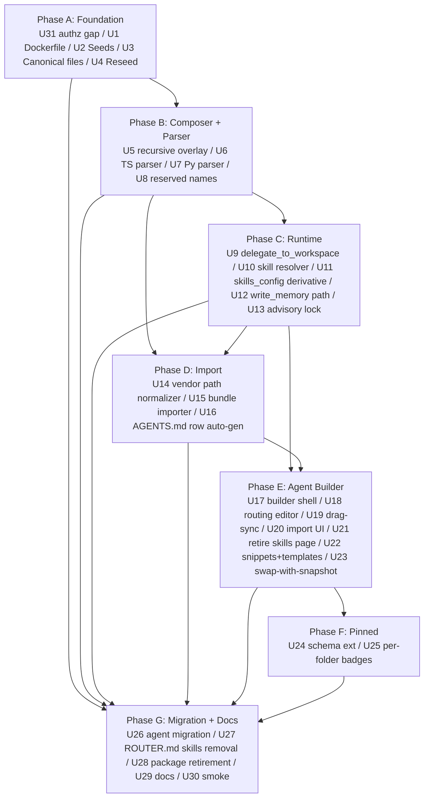

# feat: Fat-folder sub-agents, vendor-neutral workspace, and agent builder

## Overview

Implement Fat-native sub-agents at plain folder paths enumerated by `AGENTS.md` routing tables, consolidate three seed packages into `packages/workspace-defaults/`, unify workspace and skill editing into a single web-based agent builder, and add a vendor-neutral folder-bundle import path that normalizes `.claude/agents/*`, `.claude/skills/*`, `.codex/agents/*`, and similar prefixes to ThinkWork's FOG-pure layout. The admin UI stops being a file editor and becomes the canonical authoring surface at enterprise scale.

This plan supersedes the 2026-04-21-006 Scope Boundary that deferred sub-workspaces. It extends the live overlay composer (shipped by Plan 2026-04-21-006) recursively through sub-agent folder trees and extends the pinned-version record to be per-folder-path per-file.

---

## Problem Frame

ThinkWork's Strands runtime partially implements "folder is the agent" today — `AGENTS.md` auto-loads into the system prompt when present, `has_workspace_map` mode changes KB-injection behavior, a depth-1 `context_parser.py` parses sub-workspace `CONTEXT.md` sections, and a `discover_workspaces()` call appends them as "Workspace Knowledge" in the parent's prompt. But the delegate-to-sub-agent story described in the shipped `ROUTER.md` is documentation-only: no `delegate_to_workspace` tool exists; only a generic `delegate(task, context)` that spawns an empty-toolset sub-agent. Seeds scatter across `packages/system-workspace/`, `packages/memory-templates/`, and `packages/workspace-defaults/files/`. The standalone skill-assignment admin page duplicates scope that would naturally live in a folder. And the emerging FOG/FITA/Codex folder-as-agent distribution pattern has no import path at all.

The requirements doc (origin) locks: Fat-native sub-agents with universal overlay inheritance, vendor-neutral FOG-pure paths (no `.claude/` prefix, reserved names `memory/` and `skills/`), workspace-skills unification via `AGENTS.md`'s `| Task | Go to | Read | Skills |` routing table, and a web-based agent builder as the canonical authoring surface (see origin: `docs/brainstorms/2026-04-24-fat-folder-sub-agents-and-workspace-consolidation-requirements.md`).

---

## Requirements Trace

All 27 origin requirements are addressed across the 28 implementation units below. Explicit mapping:

- **R1, R2** (canonical root file set) → U3, U4
- **R3, R4** (seed source consolidation) → U2, U4, U28
- **R5–R9, R25** (Fat-native sub-agent folders, reserved names) → U5, U6, U7, U8, U9, U13
- **R10–R12** (external folder import) → U14, U15, U16
- **R13** (agent builder shell) → U17
- **R14** (pinned-propagation per folder per file) → U24, U25
- **R15** (destructive template swap with confirmation) → U23
- **R16, R17** (mental-model documentation) → U29
- **R18, R19, R24** (migration / retirement) → U26, U27, U28
- **R20–R23** (workspace-skills unification) → U10, U11, U18, U21
- **R26** (starter snippets + templates) → U22
- **R27** (drag-to-organize with AGENTS.md auto-sync) → U19

**Origin actors:** A1 (template author), A2 (tenant operator), A3 (paired human), A4 (agent runtime), A5 (sub-agent), A6 (ecosystem author)
**Origin flows:** F1 (template inheritance), F2 (external folder import), F3 (sub-agent delegation), F4 (template swap)
**Origin acceptance examples:** AE1 (covers R10, R11), AE2 (covers R5, R7, R8), AE3 (covers R9, R14), AE4 (covers R15), AE5 (covers R6), AE6 (covers R21, R22, R23), AE7 (covers R25), AE8 (covers R26, R27)

---

## Scope Boundaries

- Not redesigning the platform `skill-catalog` package. Platform skills remain the authoritative shared source; only the per-agent slug-list-attachment admin UI retires.
- Not supporting `.claude/commands/*`, `.claude/hooks/*`, or other vendor-specific non-folder constructs. Only `agents/` and `skills/` subpaths are normalized.
- Not building two-way sync between an external folder bundle and a ThinkWork agent. Import is one-directional.
- Not changing `ROUTER.md`'s channel-profile role (`- load:`, `- skip:`). Only the `- skills:` directive is removed per R24.
- Not rebuilding the platform skill-dispatcher. Local `skills/{slug}/SKILL.md` uses the existing dispatch path via the skill-catalog registry.
- Not renaming `AGENTS.md` to `CLAUDE.md`.
- Not eliminating the generic `delegate(task, context)` tool — different purpose from `delegate_to_workspace(path)`; both coexist.

### Deferred to Follow-Up Work

- **In-editor `SKILL.md` authoring** for local skills (origin Outstanding Question R20, R22): v1 supports local-skill *import* via bundle upload; inline SKILL.md authoring UI follows. R13's "no external tool required" language is updated in U29 docs to explicitly exclude local-skill authoring from the v1 scope.
- **Recursion depth > 5**: v1 soft-warns at depth 4 and hard-caps at 5 (revised from 3 per review). Arbitrary depth follows once telemetry shows enterprise demand. Depth limit enforced at `delegate_to_workspace` and at import.
- **Upstream-follows-fork / bundle re-import with diff merge**: v1 treats re-import of a modified bundle as 409 "existing sub-agent with that slug — choose replace/rename/abort." Smart diff/merge is a follow-up.
- **Tar SI-4 extension** (moved out of U15 per review; tar is a near-rewrite, not an extension): v1 accepts **zip and git-ref** for imports. Tar follows as a separate unit with explicit library choice (`tar-stream` or `node-tar`) and typeflag-aware safety extending beyond symlinks (hardlink=1, char/block/FIFO=3-6).

---

## Context & Research

### Relevant Code and Patterns

**Composer and overlay (TS, server-side, single source of truth):**
- `packages/api/src/lib/workspace-overlay.ts` — 809-line composer with `composeFile` / `composeList` / 60s LRU cache. Current overlay is root-only; U5 extends it to walk sub-agent folder trees.
- `packages/api/workspace-files.ts` — `POST /api/workspaces/files` Lambda handler.
- `packages/api/src/lib/pinned-versions.ts` — `agent_pinned_versions` JSONB store; today keyed by bare filename.
- `packages/api/src/lib/workspace-map-generator.ts` — auto-generates `AGENTS.md` from DB state on every `setAgentSkills` save.
- `packages/api/src/lib/workspace-manifest.ts`, `packages/api/src/lib/placeholder-substitution.ts`, `packages/api/src/lib/placeholder-aware-comparator.ts` — existing supporting primitives.
- `packages/api/src/__tests__/workspace-overlay.test.ts`, `workspace-files-handler.test.ts`, `pinned-versions.test.ts`, `accept-template-update.test.ts`, `agent-snapshot-overlay.test.ts`, `placeholder-substitution.test.ts` — existing test coverage.

**Strands runtime (Python):**
- `packages/agentcore-strands/agent-container/container-sources/server.py` — auto-loads `SOUL/IDENTITY/USER/AGENTS/CONTEXT/TOOLS` at `server.py:273-286`; `has_workspace_map` mode at `server.py:290, 1420, 2003`; generic `delegate(task, context)` at `server.py:1383-1412`; `discover_workspaces` call at `server.py:1369` (to be replaced by the new tool).
- `packages/agentcore-strands/agent-container/container-sources/workspace_composer_client.py` — `fetch_composed_workspace`, `write_composed_to_dir`, `compute_fingerprint`; the client that calls the TS composer via REST.
- `packages/agentcore/agent-container/router_parser.py` — channel-profile parser, `filter_skills()`. U27 drops its `- skills:` branch.
- `packages/agentcore/agent-container/context_parser.py` — depth-1 `CONTEXT.md` parser. Deprecated by U7 (AGENTS.md routing-table parser).
- `packages/agentcore-strands/agent-container/container-sources/write_memory_tool.py:32, 83, 97` — basename enum locking three root files. U12 extends to path parameter.
- `packages/agentcore-strands/agent-container/Dockerfile:39` — explicit COPY list; U1 replaces with wildcard pattern per `docs/solutions/build-errors/dockerfile-explicit-copy-list-drops-new-tool-modules-2026-04-22.md`.

**Seed packages (3 → 1):**
- `packages/workspace-defaults/src/index.ts` — canonical 11-file inline constants, `DEFAULTS_VERSION = 3`, `loadDefaults()`.
- `packages/workspace-defaults/files/ROUTER.md` + `files/memory/*.md` — currently-authored defaults.
- `packages/system-workspace/` — PLATFORM, CAPABILITIES, GUARDRAILS, MEMORY_GUIDE (to retire).
- `packages/memory-templates/` — IDENTITY, SOUL, TOOLS, USER (to retire).
- `packages/workspace-defaults/src/__tests__/parity.test.ts` — byte-parity guardrail. `AUTHORITATIVE_SOURCES` map (lines 32-40) updates in U2.
- `scripts/bootstrap-workspace.sh` — deploy-time orchestrator that mirrors all three packages to `s3://$BUCKET/workspace-defaults/`. U2, U28 update.

**Skill catalog:**
- `packages/skill-catalog/` — platform skill source; unchanged in this plan.
- `packages/skill-catalog/scripts/sync-catalog-db.ts` — DB upsert; unchanged.
- `packages/database-pg/src/schema/agents.ts:128-157` — `agent_skills` table. U21 retires the admin-UI write path; the table stays populated as derivative-computed data (U11).
- `packages/api/src/graphql/resolvers/agents/setAgentSkills.mutation.ts` — the resolver the admin calls today. U21 adjusts.
- `packages/api/src/handlers/chat-agent-invoke.ts:317-441`, `packages/api/src/handlers/wakeup-processor.ts:354-740` — `skills_config` assembly from `agent_skills` + `skill_catalog`. U11 makes these derivative of composed-tree declarations.

**SI-4 zip-safety (U10 foundation):**
- `packages/api/src/lib/plugin-zip-safety.ts` — `inspectZipBuffer()` with ZipPathEscape / ZipSymlinkNotAllowed / size and entry caps. U15 extends to tar.
- `packages/api/src/lib/plugin-validator.ts`, `packages/api/src/lib/plugin-field-policy.ts`, `packages/api/src/lib/skill-md-parser.ts`, `packages/api/src/lib/plugin-installer.ts`, `packages/api/src/handlers/plugin-upload.ts` — existing plugin-import pipeline; reuse for folder-bundle import.

**Admin UI (retired / rebuilt):**
- `apps/admin/src/routes/_authed/_tenant/agents/$agentId_.workspace.tsx` — 809-line split-pane tree editor. U17 replaces.
- `apps/admin/src/routes/_authed/_tenant/agents/$agentId_.workspaces.tsx` — 570-line sub-workspace wizard (the closest extant UI to R13). U17/U18 merges into the agent builder.
- `apps/admin/src/routes/_authed/_tenant/agents/$agentId_.skills.tsx` — 952-line standalone skills page. U21 retires.
- `apps/admin/src/routes/_authed/_tenant/agent-templates/$templateId.$tab.tsx`, `.../agent-templates/defaults.tsx` — template-side editors; U17 extends the same builder.
- `apps/admin/src/lib/workspace-files-api.ts`, `apps/admin/src/lib/skills-api.ts` — API client wrappers; U17 updates.
- `apps/admin/src/components/WorkspaceFileBadge.tsx`, `apps/admin/src/components/AcceptTemplateUpdateDialog.tsx` — inheritance-indicator components to reuse.

**Migration infrastructure:**
- `packages/database-pg/drizzle/` — hand-rolled SQL files (dual-track with `meta/_journal.json`). Every new hand-rolled file in this plan declares `-- creates:` / `-- creates-column:` markers per `docs/solutions/workflow-issues/manually-applied-drizzle-migrations-drift-from-dev-2026-04-21.md`.
- `scripts/db-migrate-manual.sh` — drift reporter, enforced in `deploy.yml`.
- `packages/api/src/handlers/migrate-existing-agents-to-overlay.ts` — dry-run-then-destructive pattern precedent.
- `packages/api/src/handlers/backfill-identity-md.ts`, `backfill-user-md.ts` — `npx tsx` one-shot pattern.
- `packages/database-pg/__tests__/migration-0025.test.ts` — per-migration vitest gate pattern.

### Institutional Learnings

From `docs/solutions/` — all load-bearing for this plan:

- `workflow-issues/manually-applied-drizzle-migrations-drift-from-dev-2026-04-21.md` — every new hand-rolled `.sql` in this plan declares `-- creates:` markers; `scripts/db-migrate-manual.sh` gates deploy.
- `build-errors/dockerfile-explicit-copy-list-drops-new-tool-modules-2026-04-22.md` — U1 ships structural fix (wildcard COPY) as *first unit*, not a polish followup. Four silent-module-drop incidents in seven days.
- `patterns/retire-thinkwork-admin-skill-2026-04-24.md` — direct template for U28 retirement of `packages/system-workspace/` + `packages/memory-templates/`.
- `patterns/apply-invocation-env-field-passthrough-2026-04-24.md` — U11 `skills_config` derivative computation passes the full composed tree; no intermediate subset dicts.
- `workflow-issues/agentcore-runtime-no-auto-repull-requires-explicit-update-2026-04-24.md` — U30 post-deploy smoke verifies runtime-image pin after deploy.
- `workflow-issues/skill-catalog-slug-collision-execution-mode-transitions-2026-04-21.md` — pre-flight slug-count query before retirement PRs (U28).
- `best-practices/every-admin-mutation-requires-requiretenantadmin-2026-04-22.md` — every new admin mutation in this plan calls `requireTenantAdmin(ctx, tenantId)` before side effects, with row-derived tenant pin (not `ctx.auth.tenantId === args.tenantId`).
- `best-practices/inline-helpers-vs-shared-package-for-cross-surface-code-2026-04-21.md` — U6 (TS parser) + U7 (Python parser) are inlined mirrors with a pinned-shape contract comment; NOT extracted to a shared package (parser is <80 lines per side).
- `workflow-issues/worktree-stale-tsbuildinfo-drizzle-implicit-any-2026-04-24.md` — every worktree bootstrap in this plan runs `find . -name tsconfig.tsbuildinfo -not -path '*/node_modules/*' -delete && pnpm --filter @thinkwork/database-pg build` before typecheck.
- `integration-issues/lambda-options-preflight-must-bypass-auth-2026-04-21.md` — U15 (import Lambda) short-circuits OPTIONS before auth.

### External References

- FOG folder organization guide (pasted into origin brainstorm) — Layer 1 map / Rooms / Tools three-layer model, routing-table-in-CLAUDE.md-or-AGENTS.md pattern, naming conventions.
- FITA "The Folder Is the Agent" — `.claude/agents/` as specialist folders, "specialization comes from memory, not machinery" thesis. ThinkWork normalizes the path; content model matches.
- Anthropic Claude Code docs — confirms `.claude/agents/`, `.claude/skills/`, `AGENTS.md` conventions (used as the basis for the path-normalization table in U14).

### In-flight plans that interact

- `docs/plans/2026-04-21-006-feat-agent-workspace-overlay-and-seeding-plan.md` — **direct parent, shipped.** U1–U10 of that plan (overlay composer, pinned-versions, defaults seeding) are the foundation this plan extends.
- `docs/plans/2026-04-24-001-refactor-user-scope-memory-and-hindsight-ingest-plan.md` — active. Workspace stays agent-scoped; daily memory lives at a separate user-level path. Sub-agent `memory/` writes in this plan flow to parent agent's memory aggregate, which rolls up to user-level per 2026-04-24-001. No collision.
- `docs/plans/2026-04-23-007-feat-v1-agent-architecture-final-call-plan.md` — active; U10 (plugin upload, SI-4) shipped. U15 of this plan reuses the plugin-zip-safety validator — do not fork.
- `docs/plans/2026-04-24-001-fix-agent-template-workspace-scroll-plan.md` — minor touches to template workspace tab; land before U17 starts.

---

## Key Technical Decisions

- **Recursion depth cap = 5 with soft warn at 4** (origin F3-G2, revised per review): v1 soft-warns at depth 4 (builder shows "this nesting is deep — consider restructuring") and hard-rejects at depth 6. Prevents runaway delegation burning Bedrock quota while leaving realistic enterprise headroom (legal → compliance → privacy → GDPR = depth 4). Enforced at `delegate_to_workspace` (runtime reject) and at import time.
- **Atomic-at-bundle import** (origin F2-G1): any SI-4 failure, reserved-name collision, schema violation, or slug collision rejects the entire bundle. No partial landing. Mirrors `plugin-zip-safety.ts` pattern — zips pass or fail as a unit.
- **Path-normalization collision precedence** (origin F2-G3, revised per review): if a bundle contains both `.claude/agents/expenses/` and `expenses/` (or similar), **vendor-prefix wins**. The vendor path is treated as authoritative (it's explicitly named by the bundle author); the plain path is preserved as-is at a different location. No rejection. Justification: FITA-style repos routinely ship both shapes; rejecting would break legitimate bundles.
- **Reserved-name taxonomy** (origin F2-G4, AE7): folders literally named `memory/` or `skills/` at any depth are reserved folders. **File-level reserved list for imports** (new per review): root-level `USER.md`, `IDENTITY.md`, `SOUL.md`, `GUARDRAILS.md` in imported bundles are rejected by default with an explicit operator-facing error ("these files are server-managed; importing them would bypass assignment and safety invariants"). Operator can explicitly opt-in via a `--allow-root-override` flag per file with additional warning; operator-authored sub-agent-level overrides of these files remain allowed.
- **Skill-not-resolvable retries then aborts delegation** (origin F3-G3, revised per review): if a sub-agent's composed `AGENTS.md` references a skill slug that resolves neither locally nor in the platform catalog, the runtime retries the platform-catalog lookup once (5-second backoff) to absorb skill-catalog sync transients, then aborts delegation with explicit error. The operator's authored intent is not silently ignored, but transient catalog states don't cause spurious failures. Contrast with the existing skill-catalog skip-and-log for DB-row-attached skills (unchanged).
- **ETag-based optimistic concurrency for memory writes** (origin F3-G4, revised per review): concurrent `write_memory` calls to the same file use ETag-guarded PUT. On conflict, the tool returns a `{conflict: true, current_etag, current_content}` response and the agent is instructed (via tool docstring + runtime retry logic) to re-read and re-write. Prevents silent overwrite at enterprise scale where concurrent sub-agent memory writes are structurally likely.
- **Template swap preserves non-template-declared sub-agent folders with port-forward affordance** (origin F4-G2, revised per review): R15's destructive deletion applies to files that *override* a template-declared path. Sub-agent folders the operator created via F2 (import) or U19 (drag-create) survive the swap as orphans. Admin UI surfaces "N orphaned sub-agent folders" after swap with three actions per folder: **Port forward** (adds the sub-agent to the new template's root AGENTS.md routing table, preserving content), **Delete**, or **Keep as-is** (leave unreferenced).
- **In-flight-invocation lock for swap and import** (origin F4-G1, X-G1, revised per review): template swap and import both acquire an **agent-level DynamoDB conditional-write lock with TTL heartbeat** (not Postgres advisory lock — that was architecturally wrong: `pg_advisory_xact_lock` is transaction-scoped but Lambda invokes call Bedrock for minutes and the pg pool is `max: 2`, which would either not hold across invoke or starve the pool). Invoke start writes `agent_locks.{agent_id}` with `shared: true, expires_at: now+15min`; swap/import writes `exclusive: true` with conditional-write-if-no-shared-entries-exist. Invoke heartbeats refresh TTL every 60s; on Lambda SIGKILL the TTL expires naturally without leaving a zombie lock. Swap/import blocks up to 30s for shared locks to drain.
- **AGENTS.md hot-reload = next-turn reload** (origin X-G2): a routing-row edit invalidates the composer cache for the agent and forces the next invocation's `_sync_workspace_at_request` to fetch fresh content. The running container picks up the edit on its next turn without restart. No mid-turn mutation.
- **`delegate_to_workspace` is a new tool, not a modification of `delegate`**: the generic `delegate(task, context)` (server.py:1383) stays — different purpose (analytical sub-agent, empty toolset). `delegate_to_workspace(path)` spawns a sub-agent composed from the target folder with its composed skills, KBs, and full canonical file set.
- **`write_memory` path parameter is relative from the agent root**: v1 tool signature `write_memory(path: str, content: str)` where `path` must match `(sub/agent/path/)?memory/(lessons|preferences|contacts).md`. Validated against reserved-name + depth cap. Rejects path traversal, absolute paths, basename enum violations.
- **Pinned-versions schema extension is key-shape only**: `agent_pinned_versions` stays `jsonb`. Keys change from bare filename (`"GUARDRAILS.md"`) to folder-qualified path (`"expenses/GUARDRAILS.md"`). Root files keep the existing bare-filename keys (unambiguous since no folder named `""`). Migration (U24) backfills existing entries; composer walks both forms during a grace window and logs flat-key usage to catch any reader we missed.
- **AGENTS.md parser = inlined TS + Python mirrors** (per `inline-helpers-vs-shared-package` learning): `packages/api/src/lib/agents-md-parser.ts` and `packages/agentcore/agent-container/agents_md_parser.py` are independent implementations with a pinned-shape contract block comment at the top of each. A fixture-based shape test on each side catches drift.
- **Vendor path normalization table** is source-of-truth in `packages/api/src/lib/agents-md-parser.ts` and mirrored into the Python side plus the import handler. Initial entries: `.claude/agents/{X}` → `{X}`, `.claude/skills/{X}` → `skills/{X}`, `.codex/agents/{X}` → `{X}`, `.gemini/agents/{X}` → `{X}`. Unknown vendor prefixes pass through unchanged.
- **U1 Dockerfile wildcard COPY is load-bearing** (per learnings): this plan adds at least 4 new Python modules (`agents_md_parser.py`, `delegate_to_workspace_tool.py`, sub-agent composer client update, recursion-limit helper). Any not on the explicit COPY list would silently `ModuleNotFoundError` behind `try/except`. U1 is first.

---

## Open Questions

### Resolved During Planning

- "Sub-agent folder path — `.claude/agents/` or plain folders?" → plain folders at any depth, enumerated by ancestor `AGENTS.md`. Reserved: `memory/`, `skills/`.
- "Skill declaration location — ROUTER.md, SKILLS.md, or AGENTS.md table?" → `AGENTS.md` routing table (`| Task | Go to | Read | Skills |`, FOG-literal). `ROUTER.md` retains channel profiles only.
- "Thin vs Fat sub-agent shape?" → neither — inheritance-as-overlay, file shape determined by which files are present at each folder depth.
- "Git-ref import in v1?" → deferred to follow-up work; v1 = zip/tar only.
- "Concurrent memory write semantics?" → last-write-wins with documented invariant; ETag later.
- "Template swap with unknown sub-agent folder?" → survive + orphan; admin UI surfaces orphans post-swap.
- "Recursion depth cap?" → 3 levels in v1.
- "AGENTS.md hot-reload model?" → next-turn reload via composer cache invalidation.

### Deferred to Implementation

- **Exact advisory-lock implementation** (Key Decision: in-flight-invocation lock). Postgres advisory locks vs. Redis vs. DynamoDB conditional write — pick based on existing infra usage when U13 starts.
- **Exact parser shape for the structured routing-table extraction** — whether the TS parser emits `RoutingRow[]` or a richer `AgentsMdContext` struct; decide once the builder's UI needs land in U18.
- **Whether U11 recomputes `agent_skills` synchronously on `AGENTS.md` save vs. via an outbox job** — sync is simpler; outbox insulates save latency from composer. Pick based on observed save latency in dev after U17 renders the builder.
- **Git-ref import pipeline details** (deferred to follow-up): library choice (`isomorphic-git` vs. shell out to `git`), auth path, submodule policy. Left entirely out of v1.
- **Snapshot-based restore UX** (U23): whether "Restore from last version" exposes only the N most recent snapshots or a full history browser. Decide during U23 design.
- **Exact reserved-folder rename-prompt UI** (AE7, F2-G4): text of the rename prompt, default-suggested rename. UX detail for U15.

---

## Output Structure

The plan touches existing files across many packages. The net-new directory structure is limited to a few files per package:

```
packages/
├── api/
│   ├── src/
│   │   ├── lib/
│   │   │   ├── agents-md-parser.ts          # NEW (U6)
│   │   │   ├── vendor-path-normalizer.ts    # NEW (U14)
│   │   │   ├── folder-bundle-importer.ts    # NEW (U15)
│   │   │   └── agent-builder-lock.ts        # NEW (U13)
│   │   └── handlers/
│   │       ├── folder-bundle-import.ts      # NEW (U15)
│   │       └── migrate-agents-to-fat.ts     # NEW (U26)
│   └── __tests__/...                        # one test per new module
├── agentcore/
│   └── agent-container/
│       ├── agents_md_parser.py              # NEW (U7)
│       └── test_agents_md_parser.py         # NEW (U7)
├── agentcore-strands/
│   └── agent-container/
│       ├── Dockerfile                       # MODIFIED (U1 — wildcard COPY)
│       └── container-sources/
│           ├── delegate_to_workspace_tool.py # NEW (U9)
│           ├── skill_resolver.py             # NEW (U10)
│           └── test_*.py                     # one per new module
├── workspace-defaults/
│   ├── src/index.ts                         # MODIFIED — 11 → 13 canonical files, consolidation
│   └── files/
│       ├── AGENTS.md                        # NEW (U3)
│       ├── IDENTITY.md                      # MOVED from memory-templates
│       ├── SOUL.md                          # MOVED from memory-templates
│       ├── TOOLS.md                         # NEW (U3) — also consolidates from memory-templates
│       ├── USER.md                          # MOVED from memory-templates
│       ├── GUARDRAILS.md                    # MOVED from system-workspace
│       ├── MEMORY_GUIDE.md                  # MOVED from system-workspace
│       ├── CAPABILITIES.md                  # MOVED from system-workspace
│       ├── PLATFORM.md                      # MOVED from system-workspace
│       ├── CONTEXT.md                       # NEW (U3)
│       └── (ROUTER.md, memory/* already present)
├── system-workspace/                        # RETIRED (U28)
├── memory-templates/                        # RETIRED (U28)
└── database-pg/
    └── drizzle/
        └── 00XX_fat_folder_pinned_versions.sql  # NEW (U24 — hand-rolled, with -- creates: markers)

apps/admin/
└── src/
    ├── routes/_authed/_tenant/agents/
    │   ├── $agentId_.workspace.tsx          # REPLACED by builder shell (U17)
    │   ├── $agentId_.workspaces.tsx         # FOLDED INTO builder (U17)
    │   └── $agentId_.skills.tsx             # RETIRED (U21)
    ├── components/
    │   └── agent-builder/                   # NEW directory (U17–U23)
    │       ├── FolderTree.tsx
    │       ├── InheritanceIndicator.tsx
    │       ├── RoutingTableEditor.tsx
    │       ├── DragToOrganize.tsx
    │       ├── SnippetLibrary.tsx
    │       ├── StarterTemplates.tsx
    │       └── ImportDropzone.tsx
    └── lib/
        └── agent-builder-api.ts             # NEW

docs/
├── agent-design/                            # NEW Starlight section (U29)
│   ├── index.md
│   ├── folder-is-the-agent.md
│   ├── inheritance-rules.md
│   ├── authoring-templates.md
│   └── import-fog-fita.md
└── solutions/                               # one compound doc added after plan ships (U30)
```

The per-unit `**Files:**` sections below are authoritative; the tree is a scope sanity-check.

---

## High-Level Technical Design

> *This illustrates the intended approach and is directional guidance for review, not implementation specification. The implementing agent should treat it as context, not code to reproduce.*

### Phase flow



### Inheritance walk (illustrative)

```
Resolving {agent}/expenses/escalation/GUARDRAILS.md

Step 1 (agent override)    {agent}/expenses/escalation/GUARDRAILS.md       ← miss
Step 2 (ancestor override) {agent}/expenses/GUARDRAILS.md                  ← miss
Step 3 (ancestor override) {agent}/GUARDRAILS.md                           ← miss
Step 4 (template sub-path) _catalog/{tmpl}/expenses/escalation/GUARDRAILS.md ← miss
Step 5 (template sub-path) _catalog/{tmpl}/expenses/GUARDRAILS.md          ← miss
Step 6 (template root)     _catalog/{tmpl}/GUARDRAILS.md                   ← hit → serve

Pinned-version key used: "expenses/escalation/GUARDRAILS.md"
  (or "expenses/GUARDRAILS.md" → "GUARDRAILS.md" falling through under grace window)
```

### `AGENTS.md` routing table structured shape

```markdown
## Routing

| Task             | Go to     | Read                    | Skills                       |
|------------------|-----------|-------------------------|------------------------------|
| Expense receipts | expenses/ | expenses/CONTEXT.md     | approve-receipt,tag-vendor   |
| Recruiting       | recruiting/| recruiting/CONTEXT.md  | score-candidate              |
```

Parser extracts rows into a typed `RoutingRow { task, goTo, reads[], skills[] }`. Unparseable rows log and pass through as prose to preserve agent-facing UX but do not enumerate sub-agents for runtime dispatch.

---

## Implementation Units

### Phase A — Foundation

- U1. **Dockerfile wildcard COPY for container-sources**

**Goal:** Prevent silent `ModuleNotFoundError` on any new Python module added in this plan (4+ expected). Structural fix for a known recurring failure mode.

**Requirements:** Indirectly supports R9, R22, R25 (all runtime additions).

**Dependencies:** None.

**Files:**
- Modify: `packages/agentcore-strands/agent-container/Dockerfile`
- Modify: `packages/agentcore-strands/agent-container/_boot_assert.py` (extend `EXPECTED_TOOLS` set)
- Test: `packages/agentcore-strands/agent-container/test_boot_assert.py` (existing; assert new modules listed)

**Approach:**
- Replace explicit per-file `COPY packages/agentcore/agent-container/router_parser.py .` entries with `COPY packages/agentcore/agent-container/*.py ./` (wildcard).
- Add a boot-time assertion that every name in `EXPECTED_TOOLS` is importable; boot fails if any new Python file added without a corresponding registration entry.

**Patterns to follow:**
- `docs/solutions/build-errors/dockerfile-explicit-copy-list-drops-new-tool-modules-2026-04-22.md`

**Test scenarios:**
- Happy path: add a dummy new `.py` file; container build succeeds without changing Dockerfile.
- Error path: remove a name from `EXPECTED_TOOLS`; boot-assert fails loudly (not silently behind `try/except`).

**Verification:**
- CI container build succeeds on the new Dockerfile.
- `_boot_assert.py` startup assertion fires if a module fails to register.

---

- U2. **Consolidate seed packages into `workspace-defaults/`**

**Goal:** Move content from `packages/system-workspace/` and `packages/memory-templates/` into `packages/workspace-defaults/files/`; update consumers; keep byte-parity test green.

**Requirements:** R3.

**Dependencies:** U1 (to avoid interleaved-deploy drift during container test).

**Files:**
- Modify: `packages/workspace-defaults/files/{IDENTITY,SOUL,TOOLS,USER,GUARDRAILS,MEMORY_GUIDE,CAPABILITIES,PLATFORM}.md` (add — moved from two retired packages).
- Modify: `packages/workspace-defaults/src/index.ts` — update `AUTHORITATIVE_SOURCES` map + `CANONICAL_FILE_NAMES` extension in U3.
- Modify: `packages/workspace-defaults/src/__tests__/parity.test.ts` — re-point `AUTHORITATIVE_SOURCES` to the new locations.
- Modify: `scripts/bootstrap-workspace.sh` — remove the rsync paths for `system-workspace/` and `memory-templates/`.
- Modify: `packages/agentcore/agent-container/install_skills.py` — update `install_system_workspace()` to pull from `system/workspace/` S3 prefix that bootstrap-workspace.sh still writes (content just flows from the consolidated source).

**Approach:**
- `git mv` the 8 `.md` files from the two packages into `workspace-defaults/files/` (preserves history).
- Keep the retired packages' directories stubbed with just a README pointer in this unit; actual directory deletion happens in U28 after all other units are green.
- `parity.test.ts` green is the gate — U3 will add the new `AGENTS.md` and `CONTEXT.md` files.

**Patterns to follow:**
- `packages/workspace-defaults/src/__tests__/parity.test.ts` — `AUTHORITATIVE_SOURCES` map pattern.

**Test scenarios:**
- Happy path: `parity.test.ts` passes byte-parity between TS constants and relocated `.md` files.
- Integration: `scripts/bootstrap-workspace.sh` in dev writes expected content to `s3://$BUCKET/workspace-defaults/` matching the new consolidated source.

**Verification:**
- `parity.test.ts` green.
- `pnpm -r --if-present build` green.
- `pnpm -r --if-present test` green.

---

- U3. **Populate AGENTS.md and CONTEXT.md canonical defaults**

**Goal:** The two files the runtime loads but defaults don't ship today: `AGENTS.md` (Layer-1 Map, routing table, naming conventions) and `CONTEXT.md` (root folder scope). Also extend `CANONICAL_FILE_NAMES` from 11 to 13.

**Requirements:** R1, R2.

**Dependencies:** U2.

**Files:**
- Create: `packages/workspace-defaults/files/AGENTS.md` — populated routing table with 0 sub-agents + placeholder rows, folder-structure overview, naming conventions.
- Create: `packages/workspace-defaults/files/CONTEXT.md` — one-paragraph root scope.
- Modify: `packages/workspace-defaults/src/index.ts` — add `AGENTS_MD` and `CONTEXT_MD` constants; update `CANONICAL_FILE_NAMES` to 13; bump `DEFAULTS_VERSION` to 4.
- Modify: `packages/workspace-defaults/src/__tests__/parity.test.ts` — assert parity for the new files.

**Approach:**
- Seed `AGENTS.md` with the FOG-compatible `| Task | Go to | Read | Skills |` header + one placeholder row (template authors replace). Include the FOG-style "who I am / what this project is" paragraph and folder-structure section.
- `CONTEXT.md` root content names the agent's role at the highest level; sub-agent folders override with their own `CONTEXT.md`.

**Patterns to follow:**
- Existing `ROUTER.md` in `packages/workspace-defaults/files/ROUTER.md` for voice and structure.
- FOG folder organization guide from origin.

**Test scenarios:**
- Happy path: `parity.test.ts` passes for all 13 canonical files.
- Edge case: `DEFAULTS_VERSION` bump triggers seed-workspace-defaults handler to re-sync on next run.

**Verification:**
- `parity.test.ts` green.
- `DEFAULTS_VERSION = 4` is durable and the `_defaults_version` marker triggers re-seed.

---

- U4. **Tenant reseed trigger on DEFAULTS_VERSION bump**

**Goal:** Ensure the `DEFAULTS_VERSION = 4` bump (U3) flows to every tenant's `_catalog/defaults/workspace/` on next deploy. Wire the existing `seed-workspace-defaults.ts` handler to trigger from the deploy pipeline.

**Requirements:** R4.

**Dependencies:** U3.

**Files:**
- Modify: `packages/api/src/handlers/seed-workspace-defaults.ts` — ensure diff against `_defaults_version` marker triggers re-seed for all 13 canonical files + `memory/*`.
- Modify: `.github/workflows/deploy.yml` — add a post-terraform-apply step that invokes the handler (if not already).

**Approach:**
- Handler iterates `tenants` table, checks `_defaults_version` marker object in S3, re-seeds if stale. Already scaffolded in the handler; the change is ensuring it fires on every deploy.
- Run this unit AFTER U2+U3 so the content is final before reseed.

**Patterns to follow:**
- Existing `ensureDefaultsExist(tenantSlug)` in `packages/api/src/lib/workspace-copy.ts`.

**Test scenarios:**
- Happy path: marker at v3 → handler reseeds to v4 content; marker updates.
- Idempotency: running twice at v4 is a no-op.

**Verification:**
- Dev deploy re-seeds all tenants' `_catalog/defaults/workspace/` S3 prefix with 13 files + `memory/*`.
- `aws s3 ls s3://$BUCKET/tenants/*/agents/_catalog/defaults/workspace/AGENTS.md` returns the expected content.

---

### Phase B — Composer + Parser

- U5. **Recursive overlay composer**

**Goal:** Extend `workspace-overlay.ts` to resolve any path in the composed tree — including paths inside sub-agent folders — by walking upward through the folder tree, template, then defaults.

**Requirements:** R5, R7, R8, R25.

**Dependencies:** U2, U3.

**Files:**
- Modify: `packages/api/src/lib/workspace-overlay.ts` — extend `composeFile` / `composeList` to accept deep paths; walk upward via path-segment split; apply reserved-name exclusion (U8 defines).
- Modify: `packages/api/src/lib/workspace-manifest.ts` — manifest enumerates the full recursive tree, not just root.
- Test: `packages/api/src/__tests__/workspace-overlay.test.ts` — add recursive-walk test coverage (covers AE2, AE3).

**Approach:**
- Path resolution: `{agent}/expenses/GUARDRAILS.md` → try agent-scoped; else `{agent}/GUARDRAILS.md`; else `_catalog/{tmpl}/expenses/GUARDRAILS.md`; else `_catalog/{tmpl}/GUARDRAILS.md`; else `_catalog/defaults/workspace/GUARDRAILS.md`.
- Preserve the 60s LRU cache; cache keys include full path so sub-agent lookups don't collide with root.
- `composeList` with `includeContent=true` enumerates the full tree recursively (used by Strands cold-start) — scope bounded by reserved-name rule.

**Execution note:** Start with failing integration tests for recursive walk covering AE2 (thin sub-agent), AE3 (override), AE6 (skills), and verify existing root-only tests still pass unchanged.

**Patterns to follow:**
- Existing `composeFile` structure in `workspace-overlay.ts`; do not refactor the root-only path, extend it.

**Test scenarios:**
- Covers AE2. Happy path: thin sub-agent (`{slug}/CONTEXT.md` only) inherits root IDENTITY/SOUL/USER/GUARDRAILS.
- Covers AE3. Override path: sub-agent's `GUARDRAILS.md` beats root's.
- Edge case: 3-level nested sub-agent resolves through three ancestors to root to template to defaults.
- Edge case: absent file falls through all layers and returns `FileNotFoundError`.
- Integration: `composeList` enumerates the full recursive tree; `manifest.json` reflects every file.
- Error path: a path with `..` segments rejects.

**Verification:**
- All existing overlay tests pass unchanged.
- New recursive tests pass.
- Admin UI and Strands both receive consistent composed content for arbitrary depth.

---

- U6. **AGENTS.md routing-table parser (TypeScript)**

**Goal:** Extract the `| Task | Go to | Read | Skills |` markdown table from `AGENTS.md` content into typed `RoutingRow[]`. Leave surrounding prose intact.

**Requirements:** R2, R21.

**Dependencies:** U3 (need the canonical `AGENTS.md` shape).

**Files:**
- Create: `packages/api/src/lib/agents-md-parser.ts`
- Test: `packages/api/src/__tests__/agents-md-parser.test.ts` (with fixture-based shape tests)

**Approach:**
- Parser walks markdown table rows under an `H2 "Routing"` heading (or a top-level table if only one).
- Tolerates whitespace variation, column reordering (detect columns by header name), optional trailing empty rows.
- Unparseable rows are skipped and logged (not thrown) — preserves agent-facing prose UX.
- Exports `parseAgentsMd(markdown: string): { routing: RoutingRow[]; rawMarkdown: string }`.
- Exports `PINNED_SHAPE_CONTRACT` comment block at file top naming the Python mirror (`agents_md_parser.py`) and invariants — per `inline-helpers-vs-shared-package` learning.

**Patterns to follow:**
- `packages/api/src/lib/skill-md-parser.ts` — frontmatter + body parsing approach.
- `packages/agentcore/agent-container/context_parser.py` — existing markdown-table extraction style.

**Test scenarios:**
- Happy path: standard 4-column table with 3 rows → 3 `RoutingRow`s with correct fields.
- Edge case: column reordering (`| Skills | Task | Go to | Read |`) — still parses correctly.
- Edge case: empty Skills column → `skills: []`.
- Edge case: row with trailing pipe only → skipped + logged.
- Error path: table missing `Go to` column → throw with clear error.
- Integration: real `packages/workspace-defaults/files/AGENTS.md` fixture parses cleanly.

**Verification:**
- All test scenarios pass.
- Fixture shape test matches the corresponding Python parser fixture (U7).

---

- U7. **AGENTS.md routing-table parser (Python)**

**Goal:** Python mirror of U6, imported into the Strands runtime for delegation-time skill resolution and sub-agent enumeration.

**Requirements:** R2, R21, R22, R23.

**Dependencies:** U6 (shape contract defined there).

**Files:**
- Create: `packages/agentcore/agent-container/agents_md_parser.py`
- Test: `packages/agentcore/agent-container/test_agents_md_parser.py`
- Modify: `packages/agentcore-strands/agent-container/_boot_assert.py` — add `agents_md_parser` to `EXPECTED_TOOLS`.

**Approach:**
- Pure Python, no external deps (regex + stdlib). Mirrors U6 public API: `parse_agents_md(markdown: str) -> AgentsMdContext`.
- Pinned-shape contract comment at top naming the TS mirror and invariants.
- Shape fixture test uses the same markdown fixture U6 uses, stored at `packages/agentcore/agent-container/fixtures/agents-md-sample.md` (shared across both parsers).

**Patterns to follow:**
- `packages/agentcore/agent-container/context_parser.py` — regex-based markdown-table extraction.
- U6 public API.

**Test scenarios:**
- Mirror every U6 scenario; additionally:
- Integration: shape-parity assertion on a shared fixture — both parsers emit equivalent logical structures.
- Edge case: Unicode content in Task / Skills columns.

**Verification:**
- `uv run pytest packages/agentcore/agent-container/test_agents_md_parser.py` passes.
- Shape-parity fixture test green.
- Dockerfile wildcard COPY (U1) picks up the new module without manual COPY line.

---

- U8. **Reserved-name enforcement (composer + parsers)**

**Goal:** `memory/` and `skills/` at any depth are not treated as sub-agent folders regardless of whether `AGENTS.md` references them. Centralize the rule.

**Requirements:** R25.

**Dependencies:** U5, U6, U7.

**Files:**
- Create: `packages/api/src/lib/reserved-folder-names.ts` — single constant export `RESERVED_FOLDER_NAMES = ["memory", "skills"] as const`.
- Modify: `packages/api/src/lib/workspace-overlay.ts` — import + skip reserved names during sub-agent enumeration.
- Modify: `packages/api/src/lib/agents-md-parser.ts` — reject `goTo` values equal to a reserved name; emit a lint warning.
- Mirror: add to `packages/agentcore/agent-container/agents_md_parser.py` as a module-level `RESERVED_FOLDER_NAMES = ("memory", "skills")`.
- Test: `packages/api/src/__tests__/reserved-folder-names.test.ts`.

**Approach:**
- `RESERVED_FOLDER_NAMES` is the single source of truth. Both TS and Python copies cite each other.
- Rule applies to: composer enumeration (sub-agent walk skips these), agents-md-parser (rejects `goTo="memory"` or `goTo="skills"` with lint warning), U15 importer (rename-prompt trigger per AE7).

**Patterns to follow:**
- Small-constant-mirrored-across-languages pattern per `inline-helpers-vs-shared-package` learning.

**Test scenarios:**
- Covers AE7. Happy path: `goTo="expenses"` parses as a sub-agent.
- Covers AE7. Edge case: `goTo="memory"` emits lint warning + is not enumerated as a sub-agent.
- Edge case: a sub-agent folder named `memory` at depth 2 (`expenses/memory/`) is still treated as the reserved memory folder, not a sub-sub-agent.

**Verification:**
- Attempting to create a sub-agent folder named `memory` or `skills` in the builder (U19) surfaces a rejection.
- Imported bundles with top-level `memory/` that don't match reserved schema trigger rename prompt (U15).

---

### Phase C — Runtime

- U9. **`delegate_to_workspace` tool in Strands**

**Goal:** First-class implementation of the `delegate_to_workspace(path: str)` tool. Spawns a sub-agent context window composed from the target folder with its scoped skills and KBs. Enforces recursion depth 3.

**Requirements:** R9, F3 flow.

**Dependencies:** U5 (recursive composer), U7 (parser), U1 (Dockerfile).

**Files:**
- Create: `packages/agentcore-strands/agent-container/container-sources/delegate_to_workspace_tool.py`
- Test: `packages/agentcore-strands/agent-container/test_delegate_to_workspace_tool.py`
- Modify: `packages/agentcore-strands/agent-container/container-sources/server.py` — register the new tool alongside existing `delegate`.
- Modify: `packages/agentcore-strands/agent-container/_boot_assert.py` — add to `EXPECTED_TOOLS`.

**Approach:**
- Signature: `delegate_to_workspace(path: str, task: str) -> dict`. Accepts relative folder paths (`expenses`, `support/escalation`).
- Path validated: no `..`, no absolute, no reserved-name suffix, max depth 3 — rejects with clear error.
- Compose sub-agent's workspace via REST call to `/api/workspaces/files` (action=`list`, includeContent=true, `subPath=path`). The API-layer composer (U5) returns the sub-agent's composed file set.
- Parse the composed `AGENTS.md` via `agents_md_parser.py` (U7) to get the sub-agent's scoped skills. Resolve each skill slug via `skill_resolver.py` (U10).
- Spawn a new Bedrock Strands sub-agent with the composed system prompt + resolved skill tools + scoped KBs. Forward `task` as the user message. Return the sub-agent's final response to the parent's tool call.
- Skill-not-resolvable aborts delegation per Key Decision.
- Track `sub_agent_usage` in the invocation's usage accumulator.

**Patterns to follow:**
- Existing generic `delegate` tool at `server.py:1383-1412` for Bedrock sub-agent spawn pattern + `usage_acc` accumulation.
- Existing `fetch_composed_workspace` client at `workspace_composer_client.py` for fetching composed content.

**Test scenarios:**
- Covers AE2. Happy path: delegate to `expenses/` (thin); sub-agent system prompt includes parent-inherited IDENTITY/SOUL + sub-agent's CONTEXT.
- Covers AE6. Happy path: delegate to `expenses/`; local `skills/approve-receipt/SKILL.md` resolves; tool is callable by the sub-agent.
- Edge case: delegate to `expenses/escalation/legal/case` (depth 4) → tool rejects with "delegation depth exceeded" before composer call.
- Error path: delegate to `expenses/` whose `AGENTS.md` lists `bogus-slug` → delegation aborts with "skill `bogus-slug` not resolvable".
- Error path: delegate to `expenses/../../foo` → tool rejects path traversal before composer call.
- Error path: delegate to `memory` or `skills` → tool rejects reserved-name.
- Integration: sub-agent's `write_memory` call lands at `{agent}/expenses/memory/lessons.md` (requires U12).
- Integration: `sub_agent_usage` in response reflects sub-agent token use.

**Verification:**
- Tool callable; sub-agent context is isolated from parent.
- Recursion cap enforced.
- Skill-not-resolvable aborts with clear operator-facing error (surfaced in workspace_skill_runs table via existing logging).

---

- U10. **Skill resolver for composed workspace**

**Goal:** Given a skill slug referenced in `AGENTS.md`, resolve to (1) local `{folder}/skills/{slug}/SKILL.md` at the current folder, (2) local `skills/{slug}/SKILL.md` in any ancestor, (3) platform `packages/skill-catalog/{slug}/`. First match wins.

**Requirements:** R22.

**Dependencies:** U5, U7.

**Files:**
- Create: `packages/agentcore-strands/agent-container/container-sources/skill_resolver.py`
- Test: `packages/agentcore-strands/agent-container/test_skill_resolver.py`

**Approach:**
- Pure resolution function: `resolve_skill(slug: str, folder_path: str, composed_tree: dict) -> ResolvedSkill`.
- Walks folder path segments upward checking for `{segment-path}/skills/{slug}/SKILL.md` in the composed tree; falls through to platform `skill-catalog` (looked up in the invocation's provided `skill_catalog_manifest`).
- Returns `ResolvedSkill { source: "local" | "platform", skill_md_content: str, ... }` or raises `SkillNotResolvable(slug)`.
- Ships inert (not integrated) per `feedback_ship_inert_pattern`; U9 wires it in.

**Patterns to follow:**
- Existing skill_dispatcher.py skill-bundle loading for `ResolvedSkill` shape.

**Test scenarios:**
- Covers AE6. Happy path: local skill at `expenses/skills/approve-receipt/SKILL.md` wins over platform catalog with same slug.
- Happy path: absence of local → platform-catalog resolution.
- Error path: slug resolves nowhere → raises `SkillNotResolvable`.
- Edge case: same-slug local at two ancestor depths — nearer folder wins.
- Edge case: local SKILL.md malformed (missing frontmatter) → treated as not-present, falls through to platform.

**Verification:**
- Resolver unit tests green.
- Callable from U9 without wiring errors.

---

- U11. **`skills_config` derivative computation from composed tree**

**Goal:** `agent_skills` DB rows become derivative of the composed `AGENTS.md` routing declarations. The standalone skills-assignment admin page (U21) stops writing; instead, saves in the agent builder (U17-U19) trigger a synchronous recompute.

**Requirements:** R20, R23.

**Dependencies:** U6, U10.

**Files:**
- Create: `packages/api/src/lib/derive-agent-skills.ts` — the recompute function.
- Modify: `packages/api/workspace-files.ts` — on `put` of any `AGENTS.md`, call the recompute after composer-cache invalidation.
- Modify: `packages/api/src/graphql/resolvers/agents/setAgentSkills.mutation.ts` — mark deprecated; keeps working for inert-shipping during the plan but logs a warning.
- Test: `packages/api/src/__tests__/derive-agent-skills.test.ts`.

**Approach:**
- Function walks composed tree, enumerates sub-agent folders, parses each folder's `AGENTS.md` via U6, collects referenced skill slugs, and derives the flat `AgentSkill[]` record (dedup by slug).
- Writes to `agent_skills` table: upsert the full derived set, delete rows not in it (single transaction).
- Pass the full parsed tree to the writer, not a subset dict per `apply-invocation-env-field-passthrough` learning.
- Synchronous computation on save — latency budget <500ms for typical agent sizes.

**Patterns to follow:**
- `packages/api/src/lib/workspace-map-generator.ts` — existing derivative write on `setAgentSkills` (inverse direction).
- `apply-invocation-env-field-passthrough` learning — pass full payload.

**Test scenarios:**
- Covers AE6. Happy path: composed tree with 2 sub-agents, 3 skills total → `agent_skills` has 3 rows.
- Edge case: skill-catalog slug renamed — derivative recompute preserves existing permissions row where slug matches.
- Error path: malformed `AGENTS.md` → derive fails, save rolls back, composer cache unchanged.
- Integration: save → recompute → `chat-agent-invoke.ts` sees new `skills_config` on next invocation.
- Edge case: recompute with 0 routing rows → `agent_skills` has 0 rows (not a legacy default set).

**Verification:**
- `agent_skills` rows exactly match derived set after save.
- `setAgentSkills` mutation continues to work during transition but logs deprecation.
- Unit tests + one integration test green.

---

- U12. **`write_memory` path parameter with ETag-guarded concurrency**

**Goal:** Allow sub-agent memory writes to scope correctly to `{folder}/memory/{basename}.md`. Replace the Literal basename-enum with a path-validated parameter AND introduce ETag-based optimistic concurrency to prevent silent data loss at enterprise scale.

**Requirements:** R5, R25.

**Dependencies:** U8.

**Files:**
- Modify: `packages/agentcore-strands/agent-container/container-sources/write_memory_tool.py` — change signature, add path validation + normalization, add ETag parameter.
- Modify: `packages/api/workspace-files.ts` — extend `put` action to accept `If-Match: <etag>` header; return 409 with `current_etag` + `current_content` on mismatch.
- Modify: `packages/agentcore-strands/agent-container/container-sources/server.py` — thread the current sub-agent's folder path as tool context.
- Test: `packages/agentcore-strands/agent-container/test_write_memory_tool.py`, `packages/api/src/__tests__/workspace-files-etag.test.ts`.

**Approach:**
- New signature: `write_memory(path: str, content: str, if_match_etag: str | None = None)`.
- Path validation — `path` must match canonical form `(<folder-path>/)?memory/(lessons|preferences|contacts)\.md` AFTER Unicode NFKC normalization and path canonicalization:
  - Apply `unicodedata.normalize("NFKC", path)` before regex match (prevents Unicode homoglyph bypass).
  - Reject any path containing `..`, `//`, or OS path separators `\`.
  - Reject dot-segment sequences (`memory/./lessons.md`, `./memory/lessons.md`).
  - Depth ≤ 5 segments before `memory/`; no absolute paths; no reserved-name misuse.
  - Basename restricted to the three known files (enforced via regex alternation, not Literal — but regex is anchored and tested against each bypass class).
- ETag flow: tool reads current file first (receives ETag), writes with `if_match_etag`; on 409, tool returns `{conflict: true, current_etag, current_content}` to the agent with instruction "re-read, merge your intended change with current content, and retry." Runtime wraps this in an auto-retry-once loop for transient clock-skew cases; genuine semantic conflict surfaces to the agent for model-level resolution.
- Tool context (injected by server.py via U9) carries sub-agent folder path; relative paths bind to the sub-agent's folder, absolute `memory/...` binds to agent root.

**Patterns to follow:**
- Existing basename-enum rejection pattern in `write_memory_tool.py:32-97`.
- Standard S3 ETag + If-Match pattern (workspace-files.ts already receives S3 ETag from composer).

**Test scenarios:**
- Happy path: sub-agent calls `write_memory("memory/lessons.md", "...", if_match_etag="abc")` — succeeds; agent_skills unchanged.
- Happy path: parent agent's write lands at `{agent}/memory/lessons.md` (backward compat for root).
- Conflict path: two concurrent writes with stale ETag — second returns 409 with current state; agent re-reads + retries.
- Error path: `write_memory("../memory/lessons.md", ...)` rejects path traversal.
- Error path: Unicode bypass — `write_memory("memory/lessons.md", ...)` rejects after NFKC normalization.
- Error path: dot-segment bypass — `write_memory("memory/./lessons.md", ...)` rejects.
- Error path: `write_memory("memory/bogus.md", ...)` rejects non-whitelisted basename.
- Error path: `write_memory("skills/foo.md", ...)` rejects (reserved-name misuse).
- Edge case: depth-5 sub-agent `a/b/c/d/e` writes to `memory/lessons.md` → lands at `{agent}/a/b/c/d/e/memory/lessons.md`.

**Verification:**
- Backward compat: all existing root-level memory-write tests still pass.
- Path validation test matrix covers each documented bypass class (Unicode, dot-segments, separators, traversal, depth).
- ETag conflict detection works end-to-end with two concurrent tool calls.
- No skill in skill-catalog breaks (audit required): `grep -rn "write_memory\|workspace_memory_write" packages/skill-catalog` before landing.

---

- U13. **Agent-level DynamoDB advisory lock for in-flight operations**

**Goal:** Template swap and import acquire an agent-level exclusive lock that blocks while `invoke()` or `wakeup-processor` is running. Invocations starting after the exclusive lock is held see post-op state. Uses DynamoDB conditional writes with TTL heartbeat — **not** Postgres advisory locks, which are transaction-scoped and incompatible with Lambda invoke lifetimes that span multi-minute Bedrock calls.

**Requirements:** F2 (import), F4 (swap).

**Dependencies:** None.

**Files:**
- Create: `packages/api/src/lib/agent-builder-lock.ts` — DynamoDB lock wrapper with `acquireShared(agentId)`, `acquireExclusive(agentId, timeoutMs)`, `heartbeat(agentId, lockId)`, `release(agentId, lockId)`.
- Create: `terraform/modules/data/dynamodb-agent-locks.tf` — new table `thinkwork-agent-locks-{stage}` with PK=`agent_id`, SK=`lock_id` (UUID), attrs `{kind: "shared"|"exclusive", acquired_at, expires_at}`, TTL attribute `expires_at`. On-demand billing.
- Modify: `packages/api/src/handlers/chat-agent-invoke.ts` — acquire shared lock on invoke start; heartbeat every 60s; release on completion or error; TTL auto-expires on Lambda SIGKILL.
- Modify: `packages/api/src/handlers/wakeup-processor.ts` — same.
- Modify: `packages/api/src/handlers/folder-bundle-import.ts` (U15) — acquire exclusive lock (conditional-write-if-no-shared-entries) with 30s timeout.
- Modify: `packages/api/src/graphql/resolvers/agents/changeTemplate.mutation.ts` (U23) — same exclusive acquisition.
- Test: `packages/api/src/__tests__/agent-builder-lock.test.ts` — lock semantics, TTL expiry, heartbeat.

**Approach:**
- Shared lock: PutItem with `kind: "shared"`, `expires_at: now+15min`, random `lock_id` UUID. Multiple shared locks coexist. Heartbeat updates `expires_at`.
- Exclusive lock: conditional PutItem `attribute_not_exists(lock_id) AND size(<query for shared entries>) = 0` — if any shared entry with `expires_at > now` exists, the condition fails. Retry with backoff until 30s timeout.
- Release: DeleteItem by `{agent_id, lock_id}`.
- TTL: DynamoDB's built-in TTL attribute `expires_at` sweeps expired entries within 48 hours (background process) — but conditional-write logic treats entries past `expires_at` as released even before TTL sweep, so correctness doesn't depend on TTL timing.
- Heartbeat cadence: every 60s during invoke; if a Lambda dies without releasing, the 15-minute expiry ensures the lock doesn't block swap/import indefinitely.

**Patterns to follow:**
- Standard DynamoDB conditional-write lock (the "aws-dynamodb-lock-client" pattern, reimplemented minimally — no need for full client library).

**Test scenarios:**
- Happy path: import acquires exclusive lock while no shared locks present → proceeds.
- Concurrency: import starts while invoke holds shared lock → blocks until invoke releases or TTL expires.
- Timeout: import waits 30s for shared locks to drain → returns timeout error.
- Happy path: two invokes against the same agent take shared locks in parallel.
- Recovery: invoke Lambda SIGKILL leaves shared lock with `expires_at`; next exclusive acquisition after expiry succeeds without manual cleanup.
- Heartbeat: long-running invoke (10min) refreshes `expires_at` every 60s; exclusive acquisition blocks the full duration.
- Edge case: clock skew between Lambda instances — conditional-write compares `expires_at` against `now()` in the DynamoDB request, avoiding client-side skew.

**Verification:**
- Import never observes a partial invoke state; invoke never observes a partial import state.
- TTL expiry prevents zombie locks on Lambda crash.
- pg pool is never held by a lock-related transaction across a Bedrock call.

---

### Phase D — Import Pipeline

- U14. **Vendor path normalization table**

**Goal:** Single source of truth for path rewrites (`.claude/agents/*` → `*`, `.claude/skills/*` → `skills/*`, `.codex/agents/*` → `*`, `.gemini/agents/*` → `*`). Unknown vendor prefixes pass through unchanged.

**Requirements:** R10.

**Dependencies:** U8.

**Files:**
- Create: `packages/api/src/lib/vendor-path-normalizer.ts`
- Test: `packages/api/src/__tests__/vendor-path-normalizer.test.ts`

**Approach:**
- Exports `normalizePath(path: string): string` and `normalizeTree(tree: FileTree): FileTree`.
- Internal table: ordered array of `{ from: RegExp, to: (match) => string }` pairs. Evaluated top-to-bottom; first match wins.
- Initial entries:
  - `/^\.claude\/agents\/(.+)$/` → `$1`
  - `/^\.claude\/skills\/(.+)$/` → `skills/$1`
  - `/^\.codex\/agents\/(.+)$/` → `$1`
  - `/^\.gemini\/agents\/(.+)$/` → `$1`
- Exports `collisionCheck(normalized: FileTree, original: FileTree): CollisionError[]` — detects two source paths that normalize to the same target.

**Patterns to follow:**
- Standard ordered-rule-table pattern.

**Test scenarios:**
- Happy path: `.claude/agents/expenses/CONTEXT.md` → `expenses/CONTEXT.md`.
- Happy path: `.claude/skills/approve-receipt/SKILL.md` → `skills/approve-receipt/SKILL.md`.
- Edge case: `expenses/CONTEXT.md` (no prefix) → passes through unchanged.
- Edge case: mixed bundle with both `.claude/agents/expenses/` and `.codex/agents/expenses/` → both normalize to `expenses/` → collision check returns 1 error.
- Edge case: unknown prefix `.vendor/agents/foo/` → passes through unchanged (not rejected).

**Verification:**
- Unit tests green.
- Normalization order documented in file header comment.

---

- U15. **Folder-bundle import pipeline (zip + git-ref, atomic)**

**Goal:** Operator uploads a zip or submits a git ref (URL + optional branch/tag/commit); SI-4 validation, vendor-path normalization, reserved-name + file-level reserved list check, collision resolution, atomic write to agent's S3 prefix. Whole-bundle atomic. Tar deferred to follow-up.

**Requirements:** R10, R11, R12, F2.

**Dependencies:** U8, U14, U13.

**Files:**
- Create: `packages/api/src/lib/folder-bundle-importer.ts` — orchestrator (zip + git paths).
- Create: `packages/api/src/lib/git-ref-fetcher.ts` — git clone + tarball extraction via `isomorphic-git` (pure-JS, Lambda-friendly, no shell dependency). Bounded depth (`--depth 1`), size cap (50MB like SI-4), timeout 60s, rejects repos with submodules in v1. Auth via operator-supplied PAT (stored ephemerally in request, never persisted).
- Create: `packages/api/src/handlers/folder-bundle-import.ts` — Lambda handler.
- Modify: `packages/api/src/lib/plugin-zip-safety.ts` — factor out shared validation helpers; no tar extension in v1.
- Modify: `packages/api/package.json` — add `isomorphic-git` + `@isomorphic-git/lightning-fs` dependencies.
- Modify: `terraform/modules/app/lambda-api/handlers.tf` — add `folder-bundle-import` to `api_routes` map; timeout 300s, memory 1024MB for 50MB bundle decompression + clone; env: `WORKSPACE_BUCKET`, `GIT_AUTH_SECRET_ARN` (for future PAT storage).
- Modify: `scripts/build-lambdas.sh` — add `build_handler "folder-bundle-import" "$REPO_ROOT/packages/api/src/handlers/folder-bundle-import.ts"`; confirm esbuild bundles `isomorphic-git` correctly (may need BUNDLED_AGENTCORE_ESBUILD_FLAGS treatment).
- Test: `packages/api/src/__tests__/folder-bundle-importer.test.ts`, `packages/api/src/__tests__/folder-bundle-import-handler.test.ts`, `packages/api/src/__tests__/git-ref-fetcher.test.ts`.

**Approach:**
- Handler: `POST /api/agents/{agentId}/import-bundle`. Auth: Cognito JWT + `requireTenantAdmin` with **row-derived tenant** — lookup `agents.{agentId}`, verify `row.tenant_id` matches caller's tenant via `resolveCallerFromAuth`, throw NOT_FOUND if missing, THEN requireTenantAdmin(row.tenant_id). Never use args.tenantId. OPTIONS short-circuits before auth.
- Request body shape: `{source: "zip", body: base64-encoded-bytes}` or `{source: "git", url, ref?, pat?}`. Handler dispatches to zip parser or git-ref-fetcher.
- Flow: obtain file tree (from zip or shallow git clone) → SI-4 validation (whole-bundle reject on any error) → **file-level reserved-list check** (reject root-level USER.md, IDENTITY.md, SOUL.md, GUARDRAILS.md unless `allow_root_override` flag per file with explicit operator confirmation) → vendor-path normalize (collision = vendor wins, per Key Decisions) → folder-level reserved-name check (surfaces rename prompt candidate for `memory/`/`skills/` not matching reserved schema) → slug-collision check → **depth-cap check (reject > 5 levels)** → atomic S3 write under DynamoDB advisory lock (U13).
- On rename prompt or collision: return 409 Conflict with structured response; client prompts operator (replace / rename / abort).
- After commit: auto-add `AGENTS.md` routing row (U16); invalidate composer cache.
- Rate limit: per-tenant 10 imports/hour, surfaced as 429 with retry-after.

**Patterns to follow:**
- `packages/api/src/handlers/plugin-upload.ts` — auth pattern (including `tenantMembers` role check), OPTIONS bypass, SI-4 integration.
- `packages/api/src/lib/plugin-validator.ts` — whole-bundle-atomic pattern.
- `docs/solutions/best-practices/every-admin-mutation-requires-requiretenantadmin-2026-04-22.md` — row-derived tenant pin pattern.

**Execution note:** Start with failing integration tests for the atomic-reject-on-any-failure invariant AND for row-derived tenant authz (cross-tenant attempt returns 403/404, not 200).

**Test scenarios:**
- Covers AE1. Happy path (zip): `.claude/agents/expenses/{CONTEXT.md, IDENTITY.md, GUARDRAILS.md, memory/lessons.md, NOTES.md}` → lands at `{agent}/expenses/*`.
- Happy path (git-ref): public repo URL + `main` branch → shallow clone → same normalization → lands.
- Happy path (git-ref with PAT): private repo + operator-supplied PAT → authenticated clone → PAT discarded after clone completes.
- Error path: bundle with root-level `USER.md` (reserved file) → 409 with explicit server-managed-file error; operator sees opt-in flag guidance.
- Error path: bundle with one file triggering ZipPathEscape → whole bundle rejects.
- Error path: bundle with top-level `memory/` folder not matching reserved schema → 409 with rename prompt.
- Error path: bundle collides with existing sub-agent at `expenses/` → 409 with replace/rename/abort choice.
- Edge case: bundle contains both `.claude/agents/expenses/` and `expenses/` → vendor-prefix wins; plain `expenses/` lands at a different path or is preserved per collision rule (AE update).
- Edge case: bundle exceeds recursion depth 5 → reject with clear error.
- Edge case: git-ref with submodules → reject with "submodules not supported in v1".
- Edge case: git-ref exceeding size cap (>50MB clone) → reject with clear error.
- Error path: row-derived tenant check — caller authenticated in tenant B attempts import against an agent in tenant A → 404 (not 200, not a partial import).
- Rate limit: 11th import in an hour from the same tenant → 429 with retry-after.
- Integration: import during active invoke blocks on DynamoDB advisory lock; completes after invoke done.
- Integration: after successful import, parent's `AGENTS.md` has a new routing row for the sub-agent.

**Verification:**
- New handler passes integration tests in dev including row-derived authz + rate-limit.
- Bundle with any validation failure never partially lands.
- `isomorphic-git` bundles correctly via esbuild (size check on dist/lambdas/folder-bundle-import/index.mjs).

---

- U16. **Auto-generate `AGENTS.md` routing row on import**

**Goal:** After U15 lands a sub-agent folder, if the parent's `AGENTS.md` does not already have a row for it, auto-generate one using values extracted from the imported bundle.

**Requirements:** R10, R21.

**Dependencies:** U15, U6.

**Files:**
- Modify: `packages/api/src/lib/folder-bundle-importer.ts` — post-write step that edits parent `AGENTS.md`.
- Modify: `packages/api/src/lib/workspace-map-generator.ts` — helper for inserting a row without clobbering prose.

**Approach:**
- After the bundle writes, parse the imported sub-agent's own `AGENTS.md` (if present) to get its inferred role / task / skills.
- If absent, use defaults: `Task = "Specialist for <slug>"`, `Go to = "<slug>/"`, `Read = "<slug>/CONTEXT.md"`, `Skills = ""`.
- Locate the parent `AGENTS.md`'s routing table; append a row using markdown-table insertion that preserves surrounding prose.
- Save via existing put path, which triggers U11 derivative recompute.

**Patterns to follow:**
- `packages/api/src/lib/workspace-map-generator.ts` existing AGENTS.md manipulation.

**Test scenarios:**
- Covers AE1. Happy path: import creates sub-agent, parent AGENTS.md had no row → row auto-added with defaults; `agent_skills` updated.
- Edge case: parent AGENTS.md already had a row for the slug → row preserved, no duplicate; U11 recompute is a no-op.
- Edge case: imported bundle's AGENTS.md has its own routing rows → hoisted into parent as the row's `Skills` column.

**Verification:**
- `agent_skills` rows match the post-import expected set.
- Operator sees the new sub-agent in the agent builder (U17) immediately after import.

---

### Phase E — Agent Builder (admin UI)

- U17. **Agent builder shell: folder-tree + inheritance indicators**

**Goal:** Replace `$agentId_.workspace.tsx` (809 lines, split-pane) and fold in `$agentId_.workspaces.tsx` (570 lines, wizard) into a unified web-based agent builder. Folder-tree navigation at any depth, inheritance indicators per file and per folder, CodeMirror edit pane, save → composer cache invalidation + U11 recompute.

**Requirements:** R13.

**Dependencies:** U5, U11.

**Files:**
- Create: `apps/admin/src/components/agent-builder/FolderTree.tsx`
- Create: `apps/admin/src/components/agent-builder/InheritanceIndicator.tsx`
- Create: `apps/admin/src/components/agent-builder/FileEditorPane.tsx`
- Create: `apps/admin/src/lib/agent-builder-api.ts`
- Replace: `apps/admin/src/routes/_authed/_tenant/agents/$agentId_.workspace.tsx` — new builder shell composing the above.
- Delete: `apps/admin/src/routes/_authed/_tenant/agents/$agentId_.workspaces.tsx` (functionality folded into builder).
- Test: `apps/admin/src/components/agent-builder/__tests__/FolderTree.test.tsx` and component snapshot tests per new component.

**Approach:**
- Reuse existing `workspace-files-api.ts` fetch + `AgentPinStatusQuery` pattern for inheritance/pin state.
- Folder tree lazy-loads sub-agent folders on expand (composer supports partial `composeList` per path).
- Inheritance indicator: `[inherited source=template]`, `[overridden]`, `[template update available]`.
- CodeMirror pane preserves vscode-dark + markdown language already in use.
- Save path: `workspace-files-api.ts put` → composer cache invalidation → U11 derivative recompute (server-side).

**Patterns to follow:**
- Existing `$agentId_.workspace.tsx` structure.
- Existing `WorkspaceFileBadge.tsx` and `AcceptTemplateUpdateDialog.tsx` components — reuse.

**Test scenarios:**
- Happy path: load an agent → tree renders with N sub-agent folders, each expandable.
- Happy path: click an `[inherited]` file → view composed content; edit → save → indicator flips to `[overridden]`.
- Edge case: delete override → file reverts to `[inherited]` with source shown.
- Error path: concurrent save from another operator (ETag mismatch) → dialog shows conflict resolution.
- Snapshot: inheritance indicator variants.

**Verification:**
- Feature works in dev browser end-to-end (operator opens agent, navigates sub-agent, edits a file, saves).
- Existing workspace editor tests ported or replaced.
- No functional regression — everything the old editor did still works.

---

- U18. **AGENTS.md routing-table inline editor**

**Goal:** Edit the `| Task | Go to | Read | Skills |` table in AGENTS.md with a structured form — not raw markdown. On save, the table round-trips to valid markdown via U6.

**Requirements:** R21.

**Dependencies:** U6, U17.

**Files:**
- Create: `apps/admin/src/components/agent-builder/RoutingTableEditor.tsx`
- Modify: `apps/admin/src/components/agent-builder/FileEditorPane.tsx` — mount routing editor when viewing AGENTS.md.
- Test: `apps/admin/src/components/agent-builder/__tests__/RoutingTableEditor.test.tsx`.

**Approach:**
- When the user opens AGENTS.md in the builder, render the structured table editor *above* the raw markdown (optional collapse to markdown-only for power users).
- Add-row / remove-row / edit-cell UI. `Skills` column is a multi-select against the composed skill set (local + platform catalog).
- On save: regenerate markdown table via U6's round-trip helper, persist, trigger U11 recompute.
- Round-trip parity: parse → edit → serialize → parse must produce equivalent rows (test invariant).

**Patterns to follow:**
- Existing `PermissionsEditor.tsx` for skill-multi-select shape.

**Test scenarios:**
- Covers AE8. Happy path: add a row via the form → AGENTS.md markdown updates → U11 recompute fires.
- Edge case: edit Skills column to remove a slug → `agent_skills` row deleted.
- Edge case: toggle to raw-markdown view, edit directly → form view reflects on next open.
- Integration: round-trip (parse → render → edit → serialize) preserves all rows.

**Verification:**
- Editor visible when opening AGENTS.md.
- Saves produce valid AGENTS.md that U6 re-parses identically.

---

- U19. **Drag-to-organize with AGENTS.md auto-sync**

**Goal:** Operator drags sub-agent folders in the tree (create / rename / move); the parent's AGENTS.md routing-row `Go to` path updates automatically. Round-trip consistency: tree edit == table edit.

**Requirements:** R27.

**Dependencies:** U17, U18, U8.

**Files:**
- Modify: `apps/admin/src/components/agent-builder/FolderTree.tsx` — add HTML5 drag-and-drop.
- Create: `apps/admin/src/components/agent-builder/DragDropCoordinator.tsx` — orchestrates tree + AGENTS.md sync.
- Modify: `apps/admin/src/lib/agent-builder-api.ts` — `renameFolder(oldPath, newPath)` and `createSubAgent(parentPath, slug)` wrappers.
- Test: `apps/admin/src/components/agent-builder/__tests__/DragDropCoordinator.test.tsx`.

**Approach:**
- Drag create: drop "New Sub-agent" icon on a folder → creates `{parent}/{slug}/CONTEXT.md` with starter content, adds row to nearest ancestor AGENTS.md.
- Drag rename: in-place rename → S3 COPY + DELETE for every file under the folder (atomic at composer cache-invalidation boundary) + AGENTS.md `Go to` path update.
- Drag move: drag folder to new parent → same S3 COPY+DELETE + old-parent AGENTS.md row remove + new-parent AGENTS.md row add.
- Reserved-name lint (via U8) blocks `memory` or `skills` slug attempts.

**Patterns to follow:**
- Existing workspace-files put/delete pattern.

**Test scenarios:**
- Covers AE8. Happy path: drag to rename `expenses` → `expense-reports` → parent AGENTS.md row's Go to updates; sub-agent folder files move; no orphaned rows.
- Covers AE7. Error path: create sub-agent named `memory` → blocked by lint.
- Edge case: drag move across 2 levels — old-parent AGENTS.md row removed, new-parent row added.
- Error path: concurrent drag + AGENTS.md edit by another operator → conflict UI.

**Verification:**
- Drag-rename persists; composer cache invalidates correctly; tree reflects rename immediately.
- No orphaned AGENTS.md rows after moves.

---

- U20. **Import dropzone UI (zip + git-ref)**

**Goal:** Two import paths: (a) drag-drop zip file or browse-to-select → base64 POST; (b) paste git-ref URL + optional branch/tag/commit → git-ref POST. Both call U15 `/api/agents/{agentId}/import-bundle` with the respective body shape. Progress + structured error UX. Tar deferred.

**Requirements:** R10 (zip + git-ref in v1).

**Dependencies:** U15, U17.

**Files:**
- Create: `apps/admin/src/components/agent-builder/ImportDropzone.tsx` — unified drop zone + git-ref form.
- Create: `apps/admin/src/components/agent-builder/ImportErrorDialog.tsx` — SI-4 error taxonomy → operator-facing copy mapping (`ZipPathEscape` → "Archive contains unsafe paths", etc.); 409 collision modal with `replace/rename/abort` form (rename branch takes new slug via text input + client-side re-POST with `rename_slug` param).
- Create: `apps/admin/src/components/agent-builder/ImportRootReservedDialog.tsx` — confirmation for `allow_root_override` per protected file (USER/IDENTITY/SOUL/GUARDRAILS).
- Modify: `apps/admin/src/lib/agent-builder-api.ts` — `importBundle({source: "zip", file} | {source: "git", url, ref?, pat?})`.
- Test: `apps/admin/src/components/agent-builder/__tests__/ImportDropzone.test.tsx`, `ImportErrorDialog.test.tsx`, `ImportRootReservedDialog.test.tsx`.

**Approach:**
- Drop zone accepts only zip (and MIME `application/zip` / `application/x-zip-compressed`); tar is greyed out with "coming in v1.1" hint.
- Git-ref form: URL input + optional ref input + optional PAT input (password-field, never persisted client-side; warning text that PAT is used only for the clone and discarded).
- Progress: upload (bytes/%) → server-side validate → normalize → commit (4 stages with progress indication).
- Error handling:
  - 400 SI-4 failure → `ImportErrorDialog` with human-readable reason per taxonomy.
  - 409 root-reserved file → `ImportRootReservedDialog` with per-file opt-in checkboxes.
  - 409 collision → `ImportErrorDialog` with resolve form.
  - 429 rate-limit → toast with retry-after.
- Success: tree refreshes to show the new sub-agent folder.

**Patterns to follow:**
- Existing plugin-upload admin UI if present.

**Test scenarios:**
- Happy path: drop valid zip → sub-agent appears in tree; AGENTS.md has new row.
- Error path: drop invalid archive → error with SI-4 reason.
- Error path: collision → resolve modal → operator picks rename → retry with new slug.

**Verification:**
- End-to-end upload works in dev browser.

---

- U21. **Retire standalone skills-assignment page**

**Goal:** Remove `$agentId_.skills.tsx` from the admin route table. Writes to `agent_skills` via `setAgentSkills` mutation go via the builder (U18) + U11 derivative path only.

**Requirements:** R20.

**Dependencies:** U11, U18.

**Files:**
- Delete: `apps/admin/src/routes/_authed/_tenant/agents/$agentId_.skills.tsx` (952 lines).
- Modify: `apps/admin/src/components/Nav.tsx` or wherever the Skills tab is declared — remove the link.
- Modify: `apps/admin/src/lib/skills-api.ts` — keep read-only listing; remove mutation helpers.
- Modify: `packages/api/src/graphql/resolvers/agents/setAgentSkills.mutation.ts` — mark deprecated; continue accepting writes for any remaining caller during transition, but log a warning with full payload.

**Approach:**
- Ship inert first: keep the mutation live but surface a deprecation log whenever called.
- Two dev cycles after this unit lands, remove the mutation entirely in a follow-up PR.
- Audit: `grep -rn "setAgentSkills\|SetAgentSkillsMutation" apps/` to ensure no callers remain.

**Patterns to follow:**
- `docs/solutions/patterns/retire-thinkwork-admin-skill-2026-04-24.md` — retirement pattern.

**Test scenarios:**
- Happy path: navigating to `/agents/$agentId/skills` returns 404 after unit lands.
- Integration: builder save → `agent_skills` rows reflect new scope; no `setAgentSkills` call fires.
- Regression: existing skill permission configuration migrated to the builder's Skills column.

**Verification:**
- Route 404s; no broken links in nav.
- `agent_skills` rows remain consistent via U11.

---

- U22. **Starter snippet library + starter templates**

**Goal:** Pre-authored insertable snippets (routing-row, GUARDRAILS section, IDENTITY block, Skills row example, ROUTER channel profile) + named starter templates ("Single-agent", "Delegator with 2 specialists", "Multi-specialist team").

**Requirements:** R26.

**Dependencies:** U17, U19.

**Files:**
- Create: `apps/admin/src/components/agent-builder/SnippetLibrary.tsx`
- Create: `apps/admin/src/components/agent-builder/StarterTemplates.tsx`
- Create: `packages/workspace-defaults/src/starter-templates/` — 3 JSON manifests describing the tree shape for each starter.
- Create: `packages/workspace-defaults/src/snippets/` — 6-10 markdown snippet fragments.
- Test: `apps/admin/src/components/agent-builder/__tests__/SnippetLibrary.test.tsx`, `StarterTemplates.test.tsx`.
- Test: `packages/workspace-defaults/src/__tests__/starter-templates.test.ts` — validate manifest shapes.

**Approach:**
- Snippets: each is a `{name, description, insertPath: string[], content: string}` manifest. UI renders a searchable gallery with an "insert here" action.
- Starter templates: each is a `{name, description, tree: FolderTree}` manifest. Applying seeds the agent's S3 prefix with the full tree + an auto-generated root AGENTS.md.
- Named starter templates for v1: `single-agent-skeleton` (root only, populated placeholders), `delegator-with-two-specialists` (two sub-agents, seeded AGENTS.md rows), `multi-specialist-team` (4 sub-agents at depth 1).
- Snippets catalog kept small (<10) for v1; grows via separate PRs.

**Patterns to follow:**
- Standard searchable-list component.

**Test scenarios:**
- Covers AE8. Happy path: apply "Delegator with 2 specialists" → two sub-agent folders, populated AGENTS.md with 2 rows, tree reflects.
- Happy path: insert snippet into AGENTS.md routing-table → row appears; U18 round-trips cleanly.
- Edge case: apply starter template on an agent with existing overrides → confirmation dialog (destructive).

**Verification:**
- Snippet library opens from any file's edit pane.
- Starter templates list visible on "Create from template" flow.

---

- U23. **Destructive template swap with pre-swap snapshot**

**Goal:** F4 template-swap flow with (a) agent-version snapshot taken before the destructive step, (b) explicit "N overrides will be replaced" operator confirmation listing paths, (c) post-swap "N orphaned sub-agent folders" surface for folders non-template-declared.

**Requirements:** R15.

**Dependencies:** U13 (advisory lock), U5 (recursive composer for snapshot).

**Files:**
- Modify: `packages/api/src/lib/agent-snapshot.ts` — ensure snapshot captures the full composed tree (U5 path) for recovery.
- **Create**: `packages/api/src/graphql/resolvers/agents/changeTemplate.mutation.ts` — new confirmation-based destructive swap resolver (does NOT exist today; per review F4).
- Modify: `packages/database-pg/graphql/types/agents.graphql` — add `changeTemplate(agentId: ID!, newTemplateId: ID!, confirmed: Boolean!): ChangeTemplateResult!` mutation + `ChangeTemplateResult { overrides_to_replace: [String!]!, orphaned_sub_agents: [String!]!, snapshot_version_id: ID! }` type.
- Rebuild codegen: `pnpm --filter @thinkwork/admin codegen && pnpm --filter @thinkwork/api codegen`.
- Create: `apps/admin/src/components/agent-builder/TemplateSwapDialog.tsx` with override-list pagination (≥10 paths grouped by sub-agent folder with expand-collapse), explicit abort affordance, and **visible "Restore from pre-swap snapshot" link in the post-swap confirmation banner**.
- Create: `packages/api/src/graphql/resolvers/agents/restoreFromSnapshot.mutation.ts` — minimum-viable restore (v1: restore-to-last-snapshot; history browser deferred).
- Test: `packages/api/src/__tests__/change-template.test.ts`, `restoreFromSnapshot.test.ts`, `agent-snapshot-overlay.test.ts` — extend for recursive snapshot.

**Approach:**
- Server: on swap request, (1) acquire exclusive advisory lock (U13), (2) snapshot current composed tree into `agent_versions.workspace_snapshot`, (3) enumerate agent-scoped override paths that the new template would replace (paths that exist at template-declared locations), (4) return list to client for confirmation, (5) on confirm, delete those paths and reset `agent_pinned_versions` to new template's pinned hashes, (6) release lock.
- Orphaned sub-agents: folders not enumerated by the new template's root AGENTS.md are preserved but surfaced to the operator post-swap ("Your agent has folders that the new template doesn't know about — add them to AGENTS.md or remove them").
- Recovery: admin action "Restore last version" reads `agent_versions.workspace_snapshot` and re-writes. UI deferred (see Deferred to Follow-Up Work) — v1 is CLI or operator-support action.

**Patterns to follow:**
- Existing `acceptTemplateUpdate` mutation for advisory-lock + S3-write pattern.

**Test scenarios:**
- Covers AE4. Happy path: swap with 3 overrides → dialog lists 3 paths; confirm → all 3 deleted; composed tree resolves through new template.
- Covers F4-G2. Edge case: agent has sub-agent `expenses/` from import; new template doesn't declare `expenses/` → dialog does NOT list `expenses/*` as replace-candidates; after swap, `expenses/` survives + orphan surface.
- Edge case: swap during invoke → advisory lock blocks; invoke completes; swap proceeds.
- Covers F4-T1. Edge case: USER.md after swap → re-written via assignment-event path.
- Error path: mid-swap S3 failure → rollback via snapshot; advisory lock releases; operator sees partial-fail with snapshot-restore hint.

**Verification:**
- Swap confirmed list matches exactly the to-be-replaced paths.
- Orphan surface appears when applicable.
- Pre-swap snapshot is retrievable from `agent_versions`.

---

### Phase F — Pinned Versions Extension

- U24. **Extend `agent_pinned_versions` keys to folder-qualified paths**

**Goal:** Keys in `agent_pinned_versions` JSONB become full folder paths (`expenses/GUARDRAILS.md`) instead of bare filenames. Migration backfills existing flat keys; composer handles both forms during a grace window.

**Requirements:** R14.

**Dependencies:** U5.

**Files:**
- Create: `packages/database-pg/drizzle/00XX_fat_folder_pinned_versions.sql` — hand-rolled, with `-- creates-column:` markers noting that the column *shape* doesn't change but the semantic content does; also adds an index on JSONB keys for O(1) lookup.
- Modify: `packages/api/src/lib/pinned-versions.ts` — accept path-qualified keys; `normalizePinnedVersions` preserves both forms during grace.
- Modify: `packages/api/src/lib/workspace-overlay.ts` — resolve pinned-class files by trying path-qualified key first, flat key second; log flat-key usage via telemetry.
- Create: `packages/api/src/handlers/backfill-pinned-versions-paths.ts` — one-shot that reads all rows, re-keys `GUARDRAILS.md` → `GUARDRAILS.md` (no-op at root; the flat and path-qualified are the same for root files).
- Test: `packages/api/src/__tests__/pinned-versions.test.ts` — extend for path-qualified keys; `packages/api/src/__tests__/workspace-overlay.test.ts` — sub-agent GUARDRAILS resolves via path-qualified pin.

**Approach:**
- For root-level files, path-qualified key equals flat key (no collision).
- For sub-agent files (`expenses/GUARDRAILS.md`), new keys only.
- Backfill is near-no-op but guarantees shape consistency.
- Composer's grace-window behavior: try path-qualified; fall through to flat-key during a 2-deploy-cycle grace; after grace, remove fall-through in a cleanup PR.

**Patterns to follow:**
- Existing `packages/api/src/handlers/backfill-identity-md.ts` one-shot pattern.
- `docs/solutions/workflow-issues/manually-applied-drizzle-migrations-drift-from-dev-2026-04-21.md` — hand-rolled SQL needs `-- creates:` markers.

**Test scenarios:**
- Happy path: pin `expenses/GUARDRAILS.md` to sha256:X → composer resolves to sha256:X.
- Backwards compat: existing flat `GUARDRAILS.md` key still resolves during grace.
- Integration: accept-template-update flow on a sub-agent file updates the path-qualified key.
- Migration: backfill runs twice (idempotent).

**Verification:**
- New hand-rolled SQL passes `scripts/db-migrate-manual.sh` gate.
- Existing pinned-versions tests all pass.
- New sub-agent pin tests green.

---

- U25. **Per-folder "Template update available" badges**

**Goal:** The agent builder surfaces `[template update available]` indicators on pinned-class files at any folder depth, not only at root.

**Requirements:** R14.

**Dependencies:** U24, U17.

**Files:**
- Modify: `packages/api/src/graphql/resolvers/agents/agentPinStatus.query.ts` — return per-folder-path status, not just per-root-file.
- Modify: `packages/database-pg/graphql/types/agents.graphql` — add `folderPath` to `AgentPinStatus` type.
- Modify: `apps/admin/src/components/agent-builder/InheritanceIndicator.tsx` — render update-available badge at any depth.
- Modify: `apps/admin/src/components/AcceptTemplateUpdateDialog.tsx` — accept path + filename, not just filename.
- Test: `apps/admin/src/components/__tests__/InheritanceIndicator.test.tsx` extensions.

**Approach:**
- Resolver walks composed tree, enumerates all `GUARDRAILS.md` / `PLATFORM.md` / `CAPABILITIES.md` at every folder depth, compares agent's pinned vs. template's current hash for each, returns array.
- UI renders the badge on the specific file in the tree.
- Accept dialog: preserved per-file; new prop `folderPath` determines pinned-key lookup.

**Patterns to follow:**
- Existing `AcceptTemplateUpdateDialog.tsx` component.

**Test scenarios:**
- Happy path: sub-agent `expenses/GUARDRAILS.md` has template-current hash B, pinned at hash A → badge shows; operator accepts → pinned advances to B.
- Edge case: pinned-class file at 2-level deep sub-agent — badge surfaces with correct folder path.
- Edge case: template removes a pinned file declared at sub-agent depth — badge does not show "update available" (nothing to update to); operator can revert-to-template to remove override.

**Verification:**
- Per-folder badges render correctly.
- Accept flow updates path-qualified pinned-versions key.

---

### Phase G — Migration + Docs

- U26. **Migrate agents to Fat-native (parameterized for enterprise scale)**

**Goal:** Parameterized migration handler usable at both 4-agent current state and 400+-agent enterprise scale. Extends 2026-04-21 R18's reverse-substitute comparator to walk sub-agent folders, supports per-tenant filter + batch size, emits a dry-run report before destructive copy-removal.

**Requirements:** R18.

**Dependencies:** U5, U24.

**Files:**
- Create: `packages/api/src/handlers/migrate-agents-to-fat.ts` — parameterized handler.
- Test: `packages/api/src/__tests__/migrate-agents-to-fat.test.ts`.

**Approach:**
- CLI invocation: `npx tsx migrate-agents-to-fat.ts --stage=<stage> --tenants=<tenantSlug1,tenantSlug2> --batch-size=20 [--destructive]`. No args = run dev-only against all tenants in dry-run.
- Dry-run step: for each agent in scope, enumerate every file in its S3 prefix (recursive), reverse-substitute placeholders, compare against template base, produce report row `{tenant, agent, path, action: "revert-to-inherited" | "keep-as-override" | "materialize-sub-agent"}`.
- Report format: dry-run emits both a summary table (per-tenant counts, per-action counts) AND a full JSON artifact to S3 at `tenants/_ops/migrations/fat-folder/{run-id}.json`. PR body includes the summary; the JSON is the audit trail.
- Destructive step: behind `--destructive` flag, apply reverts in batches (`--batch-size=20` agents at a time, parallel within batch, sequential across batches). Per-batch commit + rollback semantics; a mid-batch S3 failure aborts that batch and reports to ops.
- Sub-agent handling: if the agent's template declares sub-agent folders in its current `AGENTS.md`, materialize empty-override folders in the agent's S3 prefix + update parent's AGENTS.md routing if absent.
- Safety: --destructive requires explicit `--tenants=` (never applies to all tenants implicitly); dev-only default path confirms the pattern before production.

**Patterns to follow:**
- `packages/api/src/handlers/migrate-existing-agents-to-overlay.ts` — dry-run-then-destructive pattern.
- `packages/api/src/lib/placeholder-aware-comparator.ts` — existing comparator.

**Execution note:** Dry-run against dev against all 4 current agents first; paste summary table into PR body. Destructive step against dev only in follow-up PR. Production destructive step is a separate per-tenant PR with ops sign-off per tenant.

**Test scenarios:**
- Dry run (dev, 4 agents): produces expected reports; no S3 writes.
- Dry run (simulated, 400 agents via fixtures): handles batch reporting without OOM; JSON artifact under 100MB.
- Destructive (dev, flag enabled): reverts applied in batches; dry-run-twice after destructive returns empty (idempotent).
- Edge case: agent with template change mid-migration — comparator uses current template, logs drift.
- Safety: `--destructive` without `--tenants=` → explicit error "destructive migration requires explicit tenant scope".

**Verification:**
- Dry-run summary output attached to the migration PR.
- Destructive step flag-gated + tenant-filter-required; no blast-radius amplification.

**Patterns to follow:**
- `packages/api/src/handlers/migrate-existing-agents-to-overlay.ts` — dry-run-then-destructive pattern.
- `packages/api/src/lib/placeholder-aware-comparator.ts` — existing comparator.

**Execution note:** Dry-run against dev before writing any destructive step; paste report into PR body.

**Test scenarios:**
- Dry run: 4 agents produce expected reports; no S3 writes.
- Destructive: flag enabled → reverts applied; dry-run-twice after destructive returns empty (idempotent).
- Edge case: an agent with a template change during migration — comparator uses current template, logs drift.

**Verification:**
- Dry-run report output attached to the migration PR.
- Destructive step gated behind explicit flag + tenant filter.

---

- U27. **Remove `ROUTER.md`'s `- skills:` directive**

**Goal:** Drop the `- skills:` directive from the `ROUTER.md` parser (Python) and from any shipped ROUTER.md. Existing skill declarations in shipped ROUTER.md backfill into the root `AGENTS.md` routing table.

**Requirements:** R24.

**Dependencies:** U7, U26.

**Files:**
- Modify: `packages/agentcore/agent-container/router_parser.py` — remove `skills` key parsing; `filter_skills` becomes unreachable/deprecated.
- Modify: `packages/workspace-defaults/files/ROUTER.md` — remove any `- skills:` lines.
- Modify: `packages/workspace-defaults/src/index.ts` `ROUTER_MD` constant — same.
- Create: `packages/api/src/handlers/backfill-router-skills-to-agents-md.ts` — one-shot that reads every agent's `ROUTER.md`, extracts `skills:` declarations, merges into root `AGENTS.md` routing table.
- Test: `packages/agentcore/agent-container/test_router_parser.py` — drop skills tests.
- Test: `packages/api/src/__tests__/backfill-router-skills.test.ts`.

**Approach:**
- Parser: delete the `elif key == "skills":` branch (lines 78-79 in current parser). `filter_skills()` stays for backward import compatibility but is no longer called from server.py (verify via grep).
- Backfill: per agent, parse ROUTER.md; for each profile's `- skills:`, find or add a routing-row in the root AGENTS.md and merge skill list.
- Deploy-gate: run backfill on dev, verify no agents have stranded `- skills:` declarations before shipping.

**Patterns to follow:**
- Existing one-shot `backfill-*.ts` patterns.

**Test scenarios:**
- Backfill: ROUTER.md with 2 profiles × 3 skills each → root AGENTS.md gains 6 (deduped) skills across appropriate routing rows.
- Edge case: agent has AGENTS.md with no routing rows — backfill creates a default "General" row.
- Regression: router_parser still parses `load`/`skip` correctly.

**Verification:**
- Parser tests green minus dropped skills tests.
- Backfill idempotent.

---

- U28. **Retire `packages/system-workspace/` and `packages/memory-templates/`**

**Goal:** Final deletion PR after U2 consolidation completes. Both packages removed entirely.

**Requirements:** R19.

**Dependencies:** U2, U26, U27 (all migration complete).

**Files:**
- Delete: `packages/system-workspace/` (directory).
- Delete: `packages/memory-templates/` (directory).
- Modify: `scripts/bootstrap-workspace.sh` — remove any remaining rsync lines for these packages.
- Modify: `packages/agentcore/agent-container/install_skills.py` — ensure `install_system_workspace()` pulls from the consolidated S3 prefix only.
- Modify: Any remaining README or CLAUDE.md reference.

**Approach:**
- Pre-retire grep: `grep -rn "system-workspace\|memory-templates" . --include="*.ts" --include="*.py" --include="*.sh" --include="*.md" | grep -v node_modules | grep -v '^docs/'` must return zero non-comment hits before this PR.
- Retirement PR in one atomic change; no deprecation alias period.

**Patterns to follow:**
- `docs/solutions/patterns/retire-thinkwork-admin-skill-2026-04-24.md` — retirement runbook.

**Test scenarios:**
- Build: `pnpm -r --if-present build` passes.
- Deploy: `scripts/bootstrap-workspace.sh` in dev still produces the canonical 13-file `_catalog/defaults/workspace/`.
- Regression: every test touching workspace-defaults still passes.

**Verification:**
- Directories deleted.
- No broken imports.
- Verification grep returns zero non-comment hits across `apps/*`, `packages/*`, `scripts/*`.

---

- U29. **Mental-model docs (AGENTS.md default + Starlight `/docs/agent-design/`)**

**Goal:** Two complementary docs: canonical `AGENTS.md` seeded into every tenant (U3 populated, U29 writes the definitive version), and `/docs/agent-design/` Starlight section for template authors. Explicit FOG/FITA mapping.

**Requirements:** R16, R17.

**Dependencies:** U3, U17 (UI to reference).

**Files:**
- Modify: `packages/workspace-defaults/files/AGENTS.md` — replace U3 placeholder with definitive Map content.
- Create: `docs/agent-design/index.md` — landing.
- Create: `docs/agent-design/folder-is-the-agent.md` — philosophy; maps canonical files to FOG Layer 1/2/3.
- Create: `docs/agent-design/inheritance-rules.md` — composed-walk worked examples.
- Create: `docs/agent-design/authoring-templates.md` — how to build a template.
- Create: `docs/agent-design/import-fog-fita.md` — import walkthrough + vendor-path-normalization table.

**Approach:**
- AGENTS.md: the one-screen routing-table-focused Map per R16(a).
- Starlight section: 4-5 pages; each under 1500 words; worked examples from the plan.
- Explicit YouTube + Every.to references plus FOG guide attribution.
- Cross-link from CLAUDE.md "Architecture" section.

**Patterns to follow:**
- Existing Starlight pages in `docs/src/content/docs/`.

**Test scenarios:**
- Happy path: `pnpm --filter @thinkwork/docs build` (Astro) passes.
- Regression: CLAUDE.md content renders correctly with new cross-links.

**Verification:**
- Docs live at dev Starlight URL.
- AGENTS.md fits within one screen.

---

- U30. **Post-deploy composed-tree smoke (broad coverage)**

**Goal:** Post-deploy smoke that exercises the full runtime+admin-builder surface — not just runtime-image-pin-behind. Asserts multiple failure modes at once: delegation composition, AGENTS.md hot-reload, sub-agent memory paths, advisory-lock serialization, pinned-versions grace behavior.

**Requirements:** Indirect — all runtime requirements.

**Dependencies:** Everything.

**Files:**
- Create: `scripts/post-deploy-smoke-fat-folder.sh` — orchestrator.
- Create: `packages/api/src/__smoke__/fat-folder-smoke.ts` — individual scenario functions (delegate-cold, hot-reload, memory-write, advisory-lock-overlap, pinned-grace).
- Modify: `.github/workflows/deploy.yml` — add post-apply smoke step with 5-minute timeout and rollback-on-failure.

**Approach:**
- Shared canary setup: create one canary agent from the "Delegator with 2 specialists" starter template per smoke run (namespaced with timestamp to allow parallel deploys). Clean up post-run.
- Scenarios (each a separate function, run sequentially):
  1. **Delegate cold-path:** call `chat-agent-invoke` forcing delegation to a sub-agent; assert the sub-agent's composed AGENTS.md loaded and scoped-skill output is referenced.
  2. **AGENTS.md hot-reload:** invoke once, edit the canary's root AGENTS.md routing table to add a new skill, invoke again, assert the next-turn system prompt reflects the new skill (not the old cached prompt).
  3. **Sub-agent memory write:** delegate; sub-agent calls `write_memory("memory/lessons.md", ...)`; assert S3 object lands at `{agent}/{sub}/memory/lessons.md`, not root.
  4. **Advisory lock overlap:** start a long invoke (forced to sleep ≥5s); mid-invoke, trigger a swap; assert swap waits then proceeds after invoke completes (check elapsed time + final state).
  5. **Pinned-versions grace behavior:** after U24 ships, write a pin with the old flat-key shape to a pre-seeded agent; confirm composer resolves via fallback and telemetry logs `flat_key_resolved`; after U31 (cleanup) ships, this scenario flips to asserting fallback is gone.
- Failure handling: each scenario reports structured result; any failure halts deploy and triggers rollback.
- Canary cleanup: post-run, soft-delete the canary agent + its sub-agents via a cleanup call. Idempotent on re-run.

**Patterns to follow:**
- `docs/solutions/workflow-issues/agentcore-runtime-no-auto-repull-requires-explicit-update-2026-04-24.md` — post-deploy smoke requirement.
- Existing CI smoke patterns in `scripts/`.

**Test scenarios:**
- All 5 scenarios pass in dev.
- Injected failure in each scenario halts deploy at the correct stage.
- Canary cleanup runs even on smoke failure (finally-block pattern).

**Verification:**
- Green deploy gates on all 5 scenarios passing.
- Canary agents don't accumulate (cleanup verified over 10 deploys).

---

- U31. **workspace-files REST handler admin/owner role check** (added per security review)

**Goal:** Close the pre-existing authz gap inherited by all new agent-builder mutations: `POST /api/workspaces/files` today scopes to the caller's tenant but does NOT check admin/owner role. Any authenticated tenant member can write/delete/rename sub-agent folders.

**Requirements:** Implicit for all writes under R13, R21, R26, R27.

**Dependencies:** None (lands standalone, early — ideally before U17 starts using builder writes).

**Files:**
- Modify: `packages/api/workspace-files.ts` — add `tenantMembers` role check (owner | admin) before any `put | delete | regenerate-map | update-identity-field` action; read actions (`get | list`) stay tenant-membership-only.
- Test: `packages/api/src/__tests__/workspace-files-handler.test.ts` — extend with role-gate scenarios.

**Approach:** Mirror `packages/api/src/handlers/plugin-upload.ts:300-319` pattern — after tenant resolution, query `tenantMembers` for caller's role, reject with 403 if not `owner` or `admin`. Surface as explicit error, never silent.

**Test scenarios:**
- Happy path: owner/admin writes succeed.
- Error path: tenant member without admin role attempting `put` → 403.
- Regression: `list` and `get` still work for non-admin members (read-only access preserved).
- Cross-tenant: already covered by existing handler tests (not a new attack surface).

**Verification:**
- Pre-U31: manual test confirms non-admin could write. Post-U31: same test returns 403.
- Existing integration tests pass.

---

- U32. **Pinned-versions flat-key cleanup** (scheduled ≥2 deploy cycles post-U24; added per coherence+adversarial review)

**Goal:** Remove the flat-key fallback path in `workspace-overlay.ts` after the grace window elapses, based on telemetry confirming zero flat-key resolutions in production.

**Requirements:** Cleanup of R14 / U24 grace window.

**Dependencies:** U24 + ≥2 deploy cycles of telemetry.

**Files:**
- Modify: `packages/api/src/lib/workspace-overlay.ts` — remove flat-key fallback branch + associated telemetry.
- Modify: `packages/api/src/lib/pinned-versions.ts` — remove dual-form `normalizePinnedVersions` fallback; path-qualified keys only.
- Test: relevant tests extended.

**Approach:** Gate on telemetry — before merging U32, query CloudWatch for `flat_key_resolved` events in the prior 7 days. Zero events = safe to remove. Non-zero events = investigate which reader is still using flat keys before proceeding.

**Test scenarios:**
- Happy path: path-qualified lookup works.
- Error path: legacy flat-key pin (if any linger) → explicit "key migration incomplete" error, NOT silent behavior change.

**Verification:**
- CloudWatch query attached to U32 PR body confirming 7-day zero-event window.
- Post-merge, one-week soak in dev without pin-resolution errors.

---

## System-Wide Impact

- **Interaction graph:** composer (`workspace-overlay.ts`) → API handler (`workspace-files.ts`) → admin UI fetch (`workspace-files-api.ts`) + Strands client (`workspace_composer_client.py`). New nodes: `agents-md-parser.ts`, `agents_md_parser.py`, `delegate_to_workspace_tool.py`, `skill_resolver.py`, `folder-bundle-importer.ts`, `vendor-path-normalizer.ts`, `derive-agent-skills.ts`. All converge on the composed tree as the shared data shape.
- **Error propagation:** skill-not-resolvable during delegation aborts delegation with explicit error → parent agent sees tool error → parent can surface or retry. Import failures always atomic — bundle rejects as a whole. Template swap failures trigger snapshot-based recovery.
- **State lifecycle risks:** `agent_skills` becomes derivative (U11) — during the plan's rollout, the table is doubly-written (by both the old mutation and the new recompute) until U21 retires the mutation. No data-loss risk because both writers converge on the same composed-tree output. Cache invalidation on composer edits is synchronous; no TTL-based delay.
- **API surface parity:** `POST /api/workspaces/files` extends to accept recursive paths (U5). Builder API client (U17) backwards-compat with today's workspace-files-api.ts. GraphQL `agentPinStatus` gains a `folderPath` field (U25).
- **Integration coverage:** covered by the U30 post-deploy smoke + per-phase integration tests. Specifically for F2 the atomic-reject invariant, F3 the recursion-cap + skill-not-resolvable abort, F4 the orphan-surface + snapshot-restore.
- **Unchanged invariants:** `USER.md` is still server-managed at human-assignment events; `workspace_memory_write/read/list` tool contracts for the *three root memory files* remain backward-compat; `skill-catalog` package structure and dispatch unchanged; Plan 2026-04-24-001's user-scope memory aggregation composes on top without re-opening.

---

## Risks & Dependencies

| Risk | Mitigation |
|------|------------|
| Dockerfile silently drops new Python modules → runtime `ModuleNotFoundError` behind `try/except` | U1 ships structural wildcard-COPY fix as FIRST unit; boot-assertion lists expected tools. |
| Composer recursive walk regresses root-only performance | Preserve root-only fast path; cache keys include full path; benchmark before/after U5. |
| `setAgentSkills` legacy callers during U11 rollout silently write a set that U11 immediately overwrites on next save | Deprecation log + audit grep; retire mutation in U21 immediately after builder ships. |
| Template swap snapshot/restore reintroduces old pinned hashes incorrectly | Snapshot captures full composed tree + pinned map; restore path replays with same ordering as create-from-template. |
| Advisory-lock deadlock under unusual operator concurrency | Shared-invoke + exclusive-import/swap pattern; 30s timeout on all exclusive acquisitions with clear operator error. |
| Import path normalization table drifts between TS and Python | Single-source table in TS; Python mirrors with pinned-shape comment and fixture-parity test on both sides. |
| Retirement PR (U28) breaks deploy because an overlooked reference lingers | Pre-retire grep gate + one-deploy-cycle burn-in with U2 stubbed directories. |
| Migration of 4 existing agents corrupts an agent's state mid-destruction | Dry-run report attached to PR; destructive step flag-gated; snapshot written before destructive step. |
| Pinned-versions flat-key fallback stays forever | Grace window explicitly 2 deploy cycles; cleanup PR scheduled immediately after second cycle. |
| Agent builder UI work exceeds phase budget | U17 ships first and minimal; U19, U22 are independent enhancements; snippet library can trim to ≤5 snippets if scope slips. |

---

## Documentation / Operational Notes

- `CLAUDE.md` updates: add a brief "Fat-folder sub-agents" section under "Architecture" pointing at `docs/agent-design/`.
- `docs/solutions/` new entry after plan ships: capture the delegate_to_workspace-grounding lesson and the flat-to-path pinned-versions migration.
- Operational: post-deploy smoke (U30) becomes standard for any plan touching composer/delegation.
- Rollout: merge per-unit following the merge-as-CI-passes preference; use worktrees per `.claude/worktrees/<unit-name>` for parallel phases.
- Migration order: **U31 lands first** (workspace-files role check — closes pre-existing authz gap before builder writes arrive), then U1 → U2 → U3 → U4 → U5,U6,U7,U8 (parallel-safe) → U9,U10,U12,U13 (U10 before U9 in this phase — U9 uses U10, not ship-inert) → U11 (after U6 when server-side recompute lands) → U14,U15,U16 (U14 foldable into U15 if phase pressure requires) → U17 → U18,U19,U20,U21,U22,U23 (parallel-safe after U17) → U24,U25 → U26,U27 → U28 → U29, U30 → U32 scheduled ≥2 deploy cycles after U24 lands (telemetry-gated).

---

## Alternative Approaches Considered

- **Snapshot-materialized composed tree (per-version pre-compute) instead of live overlay:** Rejected for v1 because the existing live-overlay composer has 500-entry 60s LRU already; snapshot-materialized adds a scheduler dependency and an invalidation cliff. Revisit at measured scale.
- **Single shared parser package `@thinkwork/agents-md-parser` instead of TS+Python mirrors:** Rejected per `inline-helpers-vs-shared-package` learning — total parser is <80 lines per side, extraction creates a cross-package dep that doesn't exist today, and the fixture-parity test provides loud drift detection.
- **Separate follow-up brainstorm for the agent-builder UI work:** Rejected because the UI and the runtime changes interlock; splitting forces second-round product alignment the brainstorm already resolved. Phased delivery within one plan gives the same shippability without the coordination tax.
- **Retain `.claude/agents/` path natively to match FITA exactly:** Rejected in the brainstorm on vendor-neutrality grounds; the import-time path normalizer gives the same compat story without the vendor prefix.

---

## Success Metrics

- A user uploads a zip or points at a public GitHub repo containing `.claude/agents/specialist/` with 5 files → specialist is delegatable within 60s (zip) or 90s (git-ref), runs with the same file-resolution semantics the user had locally.
- Template authors consolidate their understanding to a single tree (`packages/workspace-defaults/files/`) + one Starlight section.
- Operators create a working 3-specialist agent in the agent builder — starter template → drag-create sub-agents → snippet insertion — within 15 minutes, without touching CLI or IDE (git-ref import also available without CLI). Note: authoring a brand-new local skill requires bundle upload in v1; inline SKILL.md authoring follows.
- `agent_skills` rows match composed-tree-derived expectations for 100% of agents post-U11 rollout.
- Post-deploy smoke (U30) gates every subsequent deploy; zero "runtime-image-pin-behind" regressions after U30 lands.

---

## Document Review Findings — Applied via LFG (2026-04-24)

Structured findings from a 7-persona document review (coherence, feasibility, product-lens, design-lens, security-lens, scope-guardian, adversarial). **User directed: git-ref in v1, LFG all other findings into the plan.** The plan above has been updated to reflect every P0/P1 and most P2 findings. This section remains as a record for implementers to cross-check the review → plan-change mapping.

**Key plan-level changes from the review:**
- **Git-ref import moved into v1 scope** (was deferred) — reflected in R10, U15, U20.
- **Advisory lock redesigned** from Postgres `pg_advisory_xact_lock` to DynamoDB conditional-write with TTL heartbeat — U13 fully rewritten.
- **Last-write-wins memory → ETag-guarded concurrency** — U12 rewritten.
- **File-level reserved list** (USER/IDENTITY/SOUL/GUARDRAILS at root) added to import — U15, Key Technical Decisions.
- **Path-normalization collision** changed from "reject both" to "vendor-prefix wins" — Key Technical Decisions.
- **Skill-not-resolvable** now retries once on catalog transient before aborting — Key Technical Decisions.
- **Recursion depth** cap raised from 3 to 5 (soft warn at 4) — Key Technical Decisions.
- **Orphaned sub-agents** now have explicit port-forward action (not just delete) — Key Technical Decisions.
- **U23 changeTemplate.mutation.ts** corrected from "Modify" to "Create" + GraphQL schema entry + codegen step.
- **U15 Terraform + build-lambdas** wiring added; timeout 300s, memory 1024MB, `isomorphic-git` dependency.
- **U26 parameterized** with `--tenants=` + `--batch-size=` for enterprise scale.
- **U30 smoke expanded** to cover 5 distinct failure modes, not just image-pin-behind.
- **U31 added** — workspace-files admin/owner role check (closes pre-existing authz gap).
- **U32 added** — pinned-versions flat-key cleanup scheduled ≥2 deploy cycles post-U24 with telemetry gate.
- **Snapshot-restore UI** moved into U23 scope (not deferred) — minimum-viable restoreFromSnapshot mutation + visible post-swap banner.
- **Agent-level lock on drag rename** (U19) — will add dep on U13 when U19 is authored.

### Findings accepted but requiring implementer judgment at unit time (not pre-resolved)

The following findings were acknowledged but left to the implementer to resolve during the unit (per plan discipline — planning-time unknowns stay unknown):
- U11 "500ms latency budget" — measure in dev after U17, decide sync vs. outbox based on observation.
- AGENTS.md parser injection surface (SL5) — U6/U7 implementers must choose between "reject malformed rows" vs. "sanitize and pass through." Document the choice in the unit's approach.
- Admin positioning "flagship authoring surface" vs. infra-only — product-owner decision, flagged for next product cycle, not a coding blocker.
- Inline SKILL.md authoring stays deferred per plan scope; R13 language in docs (U29) explicitly qualified.
- Plan size (30+ units) acknowledged; split-into-two-phases is advisory, not a structural plan change in this LFG pass — implementer or team lead can call phase cutover dynamically.
- 30-unit collapse (U8 → U6/U7, U14 → U15, U16 → U15): advisory optimization for implementers to apply when picking units up.

### Full finding audit trail (for implementer cross-check)

### P0 — product premise

- **[product-lens] Git-ref deferral breaks "maximum FOG/FITA compatibility" premise.** FOG/FITA ecosystem distributes via GitHub; zip/tar-only v1 with "git archive + upload" workaround contradicts R13's "no external tool required." Either include git-ref in v1 or scope the goal to "zip/tar import with git-ref v1.1."

### P1 — architectural / security

- **[feasibility + coherence + scope-guardian + adversarial, 4 personas] Advisory-lock mechanism wrong for Lambda invoke lifetime.** `pg_advisory_xact_lock` is transaction-scoped; Lambda invokes call Bedrock for minutes and pg pool is `max: 2`. Either lock doesn't hold across invoke, or pg pool starves. U13 needs architectural redesign — likely DynamoDB conditional write with TTL heartbeat, or session-scoped Postgres lock with explicit release.
- **[security-lens] workspace-files REST handler has no admin/owner role check.** Any authenticated tenant member can write/delete/rename sub-agent folders. Plugin-upload has the check; workspace-files does not. All new builder mutations inherit this gap. Add `tenantMembers` role check (owner/admin) before any write path.
- **[security-lens] Imported USER.md is a prompt-injection surface.** Reserved-name taxonomy covers folders (`memory/`, `skills/`) but not files. Imported USER.md would be written verbatim, bypassing the server-managed invariant. Add file-level reserved list: USER.md, likely also IDENTITY.md / SOUL.md / GUARDRAILS.md at root of an imported bundle.
- **[product-lens] Last-write-wins memory at 400+ agent scale risks silent data loss.** Memory loss is irrecoverable. Ship ETag with U12; incremental cost small vs. collision discovery in production.
- **[coherence + adversarial, 3 variants] Pinned-versions flat-key grace-window cleanup has no enforcement.** "Cleanup PR scheduled" restates the risk. Add explicit U31 (scheduled 2 cycles post-U24) or tracked GitHub issue.
- **[feasibility] Tar SI-4 extension is a near-rewrite, not an extension.** `plugin-zip-safety.ts` is jszip-only; tar needs a separate library + typeflag enumeration (hardlink, device, FIFO beyond symlinks). Either scope U15 as "zip v1, tar v1.1" or size as multi-unit sub-track with explicit tar library choice.
- **[feasibility] U15 missing Terraform + build-lambdas.sh wiring.** Add entries to `terraform/modules/app/lambda-api/handlers.tf` api_routes map and `scripts/build-lambdas.sh` build_handler invocation. Specify timeout (>30s for 50MB bundle) and memory.
- **[feasibility] U23 references `changeTemplate.mutation.ts` that doesn't exist.** Change U23 Files entry "Modify" → "Create" + add `packages/database-pg/graphql/types/agents.graphql` schema entry + codegen rebuild step.
- **[adversarial] U26 hard-coded to "4 existing agents" vs enterprise-scale directive.** Parameterize with per-tenant filter + batch size; dry-run report unreadable at 400+.
- **[product-lens] Inline SKILL.md authoring deferred contradicts R13.** Either include inline authoring in v1 or update R13 language to "common agent-creation action excluding local-skill authoring."
- **[product-lens] Admin as "flagship authoring surface" contradicts infra-only admin principle in CLAUDE.md.** Either reconcile the positioning shift explicitly or reconsider whether the builder belongs on a different surface.
- **[product-lens + scope-guardian] Plan size (30 units, 7 phases) too large for single v1 arc.** Consider splitting foundation+runtime (U1-U13) into one ship cycle, builder+import+UI (U14-U30) into a second, with two-week dev burn-in between.
- **[security-lens] U12 `write_memory` regex replaces Literal type, removing prompt-injection-proof boundary.** Enumerate validation test cases: Unicode NFKC normalization, dot-segment equivalents (`memory/./lessons.md`), OS path separators.
- **[security-lens] `import-bundle` tenant pin must be explicitly row-derived.** Specify: lookup agent by `agentId` → verify `row.tenant_id` matches caller → THEN requireTenantAdmin(row.tenant_id). Args-derived is cross-tenant exploitable.
- **[coherence + adversarial] Cross-plan collision with 2026-04-24-001 asserted, not validated.** Sub-agent memory scoping reintroduces information segmentation that 001 explicitly rejects. Add explicit cross-plan review gate before U12 merges.
- **[design-lens + scope-guardian] Snapshot-restore UI deferred but snapshot writes happen silently.** Either ship minimum "Restore last version" affordance on post-swap confirmation, or don't write the snapshot in v1.
- **[design-lens] FolderTree loading / empty / error states unspecified across U17.** Define: initial load, expand-in-progress, zero-sub-agent empty, expand-error.
- **[design-lens] Inheritance indicator visual encoding unspecified.** Ancestor-folder inheritance vs. template-inheritance must be visually distinct at recursive depth; existing `WorkspaceFileBadge.tsx` doesn't cover this.
- **[design-lens] Drag operations have no undo / cancel / validation feedback.** Destructive multi-file S3 move with no recovery path.
- **[design-lens] Routing-table structured/raw toggle data-loss risk.** Specify: unsaved form edits preserved on switch? Malformed raw edits disable form view?
- **[design-lens] Import error UI specificity insufficient.** Rename retry protocol undefined — client re-submits entire bundle with path override param, or re-zip locally? SI-4 failure reasons need operator-facing copy.

### P2 — specific / implementation details

- **[feasibility + design-lens + scope-guardian, 3 personas] U19 S3 COPY+DELETE atomicity with rollback.** Advisory lock not listed as U19 dep. Add rollback path for half-moved state.
- **[coherence + feasibility + adversarial, 3 personas] U11 synchronous recompute 500ms budget unvalidated at scale.** Define "typical agent sizes"; measure at 4 enterprises × 100+ agents before sync/outbox lock-in.
- **[scope-guardian + adversarial] U30 post-deploy smoke too narrow.** Tests one fresh-canary happy path; doesn't cover migrated-from-pre-Fat agent, AGENTS.md hot-reload, skill-catalog transient, advisory-lock overlapping import+invoke, pinned-versions grace behavior, sub-agent memory paths.
- **[coherence + product-lens] Orphaned sub-agent UX cliff post-swap.** Warning surface with no workflow. Add "port folders forward to new template's routing table" affordance.
- **[product-lens] Depth cap 3 brittle against realistic enterprise org trees.** Consider soft warning at depth 4, hard cap at 5, telemetry on actual depth distribution.
- **[security-lens] Advisory-lock zombie-hold on Lambda SIGKILL.** Aurora idle-session timeout could block import/swap minutes; compounds advisory-lock P1 above.
- **[security-lens] Tar typeflag enumeration incomplete.** Currently only symlink (typeflag 2); need hardlink (1), device files (3-6), FIFO.
- **[security-lens] No rate limiting on `POST /api/agents/{agentId}/import-bundle`.** Tenant admin can flood endpoint; consider presign-then-upload model.
- **[security-lens] AGENTS.md parser tolerates malformed rows as prose.** Injection surface — crafted rows land in system prompt unchanged. Sanitize or reject.
- **[adversarial] Collision rule F2-G3 rejects legitimate FITA bundles.** FITA-style repos routinely carry both `.claude/agents/X` (vendor manifest) and `X` (authored folder). Revisit: `.claude/` always wins, or root always wins — don't reject on collision.
- **[adversarial] Skill-not-resolvable fails closed on transient catalog states.** Platform catalog has known transient slug states during sync; add transient-retry or graceful-degrade.
- **[adversarial] Hot-reload racing sub-turn delegation.** "Next-turn reload" ambiguous in Strands — one user message can fan out into many tool calls including `delegate_to_workspace`. Define fetch boundary at sub-agent composer call too.
- **[adversarial] U10 ship-inert claim races U9 in the same parallel-safe phase.** U9's Dependencies should list U10; phase parallelism claim too strong.
- **[scope-guardian] Phase F/G sequencing forces unrelated waits.** U29 docs dep only on U3+U17; U27/U28 no pinned-version dep. Relax E → F → G edges.
- **[scope-guardian] 30-unit count can collapse to ~26.** Fold U8 into U6/U7 (reserved names = 2-element constant + modification of already-open files); fold U14 into U15 (vendor-path-normalizer has no consumer until bundle importer); fold U16 into U15 (AGENTS.md row auto-gen is part of post-write flow).
- **[design-lens] Template swap confirmation dialog needs layout/truncation rules.** At 3-level sub-agents × enterprise scale, dozens of override files accumulate. Define pagination, grouping by sub-agent, abort affordance.
- **[design-lens] Starter-template application on existing content semantics unspecified.** "Confirmation dialog (destructive)" doesn't say what's destroyed. Advisory lock? Snapshot? Merge vs. overwrite vs. reject-on-conflict?
- **[design-lens] Concurrent drag + routing editor coordination.** ETag conflict detection covers U17 saves; does it also cover U19 drag? If drag bypasses ETag, conflict UI never fires.

### FYI observations (anchor 50, no decision forced)

- Requirement count (27) unverified against origin document — cross-check before finalizing requirements trace.
- Recursion depth cap stated three times with slight framing differences — reconcile.
- Grace-window cleanup PR timing absent from rollout order.
- Memory write scope rule lives in U12 Approach only, not Requirements.
- U18 "parallel-safe after U17" contradicts its own Dependencies (omits U11 despite using U11's recompute path).
- Reserved-name merge semantics ambiguous: imported `memory/lessons.md` vs. existing same name — overwrite / merge / reject?
- U8 reserved-folder-names over-extracts a 2-element constant.
- U22 snippet/starter-template manifests over-structured for 3 templates + ≤10 snippets.
- ROUTER.md `- skills:` backfill creates default "General" row on edge case — silent collapse of channel-scoped skill declarations.
- Build-vs-use: off-the-shelf markdown-table parsers (markdown-it + table plugin, remark) not explicitly considered vs. bespoke AGENTS.md parser.
- Success metric "operator creates 3-specialist agent in 15 minutes" tests happy path only; unrealistic given deferred SKILL.md authoring.
- Power-user vs novice balance for routing-table editor unresolved — default to form or raw?

### Residual concerns

- Composer LRU cache (500 entries, 60s TTL) sufficient under concurrent Strands cold-starts at enterprise scale?
- Virtualization strategy for 400+ node folder trees at enterprise scale (U17 specifies lazy-load but no virtualization).
- `setAgentSkills` + U11 derivative double-write convergence during rollout — audit only covers `apps/`, not mobile/CLI/external tooling.
- Sub-agent delegation spawns Bedrock with composed GUARDRAILS — if adversarial content lands in a sub-agent folder (possible under workspace-files role-gate gap above), spawned sub-agent runs under adversarial policy.
- Vendor-path-normalizer pass-through of unknown prefixes means `memory/lessons.md` at bundle root goes straight to reserved folder — handled by reserved-name check but edge case worth verifying.

---

## Sources & References

- **Origin document:** [docs/brainstorms/2026-04-24-fat-folder-sub-agents-and-workspace-consolidation-requirements.md](docs/brainstorms/2026-04-24-fat-folder-sub-agents-and-workspace-consolidation-requirements.md)
- **Parent plan (shipped):** `docs/plans/2026-04-21-006-feat-agent-workspace-overlay-and-seeding-plan.md`
- **Concurrent in-flight plans:** `docs/plans/2026-04-24-001-refactor-user-scope-memory-and-hindsight-ingest-plan.md`, `docs/plans/2026-04-23-007-feat-v1-agent-architecture-final-call-plan.md`
- **Key learnings:** `docs/solutions/build-errors/dockerfile-explicit-copy-list-drops-new-tool-modules-2026-04-22.md`, `docs/solutions/workflow-issues/manually-applied-drizzle-migrations-drift-from-dev-2026-04-21.md`, `docs/solutions/patterns/apply-invocation-env-field-passthrough-2026-04-24.md`, `docs/solutions/best-practices/every-admin-mutation-requires-requiretenantadmin-2026-04-22.md`, `docs/solutions/best-practices/inline-helpers-vs-shared-package-for-cross-surface-code-2026-04-21.md`, `docs/solutions/workflow-issues/agentcore-runtime-no-auto-repull-requires-explicit-update-2026-04-24.md`.
- **Related code anchors:** `packages/api/src/lib/workspace-overlay.ts`, `packages/agentcore-strands/agent-container/container-sources/server.py:273-320,1383-1412`, `packages/api/src/lib/pinned-versions.ts`, `packages/api/src/lib/plugin-zip-safety.ts`, `packages/agentcore/agent-container/router_parser.py`, `packages/database-pg/src/schema/agents.ts:128-157`.
