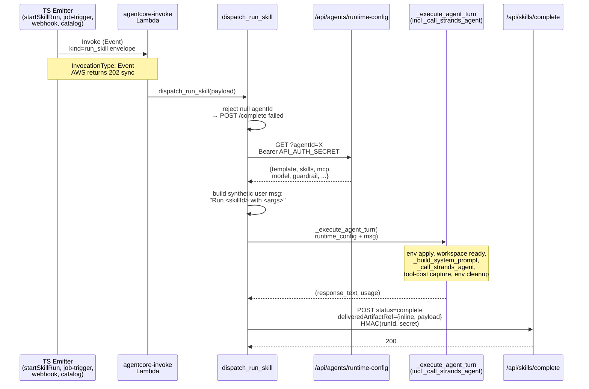

# feat: Out-of-band kind=run_skill dispatcher

## Overview

Replace the post-§U6 rejector in `packages/agentcore-strands/agent-container/container-sources/run_skill_dispatch.py::dispatch_run_skill` with a real dispatcher that spins up a headless Strands Agent per `kind=run_skill` envelope, lets the agent loop execute the skill via the same runtime the chat loop already uses, and POSTs the final assistant text back to `/api/skills/complete`. Unblocks scheduled jobs, admin "Run now", and chat-intent-dispatched skill runs — the three out-of-band invocation paths currently stranded in `failed: unsupported-runtime`. Webhook-sourced runs with a null `agentId` stay deferred to a follow-up.

---

## Problem Frame

Plan §007 §U6 (merged 2026-04-24 in #542) deleted `composition_runner.py` + the execution-type branching inside `dispatch_run_skill` and replaced them with a structured rejector that writes every `kind=run_skill` row as `status=failed, reason="kind=run_skill is unsupported in this runtime: U6 removed the composition runner and a replacement out-of-band dispatcher has not landed yet."` The chat loop is unaffected — the model invokes skills inline via Strands' `AgentSkills` plugin + the registered `@tool` functions (e.g. `render_package`, `web_search`). Every other skill invocation path is offline:

- **Chat-intent dispatcher** — `skill-dispatcher/scripts/dispatch.py::start_skill_run` tool, fires when the model calls the dispatcher inside a chat turn.
- **Scheduled jobs** — `packages/lambda/job-trigger.ts` fires `kind=run_skill` envelopes on cron.
- **Admin catalog "Run now"** — `packages/api/src/handlers/skills.ts::startSkillRunService` (`POST /api/skills/start`).
- **Webhook-triggered runs** — `packages/api/src/handlers/webhooks/_shared.ts::createWebhookHandler` calls `invokeSkillRun` for each resolver hit (CRM opportunity, task event).

This is a launch blocker — we onboard 4 enterprises × 100+ agents imminently (`project_enterprise_onboarding_scale`) and three of the four paths above are the normal way a skill runs outside an interactive chat turn. See the originating session's handoff summary and `project_u6_composition_runner_deletion_handoff` for context on why the rejector shipped instead of a replacement.

---

## Requirements Trace

- R1. A `kind=run_skill` envelope with a non-null `agentId` and a registered skillId produces a `skill_runs` row that transitions to `status=complete` with an inline `deliveredArtifactRef` carrying the agent's final Markdown output.
- R2. The dispatcher reuses the chat loop's agent-construction path — AgentSkills plugin, registered `@tool` skills, MCP clients, memory wrappers, tenant kill-switches, template-blocked-tools, guardrail. No second code path that could drift.
- R3. Runtime-config resolution has exactly one source of truth: a helper `resolveAgentRuntimeConfig(tenantId, agentId)` used by both `chat-agent-invoke.ts` (chat path) and the new `GET /api/agents/runtime-config` endpoint (dispatcher path).
- R4. Every `/api/skills/complete` callback carries the per-run HMAC signature from the envelope (already enforced by `completeSkillRunService`).
- R5. Enqueue errors (Lambda not reachable, IAM, bad envelope) surface synchronously to the TS caller. Execution errors (agent loop crashed, skill not in allowlist, model timeout) surface via the `/api/skills/complete` callback writing `status=failed` with a specific reason.
- R6. Null `agentId` is not yet supported; the dispatcher writes a clean `failed` row with `reason: "run_skill requires an agentId — webhook-sourced runs deferred to a follow-up"` and returns. Scheduled + catalog + chat-intent paths always carry `agentId`; only webhook emitters can land null. Webhook fallback ships in a separate PR.
- R7. `_call_strands_agent` is NOT refactored. Its hidden module-level dependencies (WORKSPACE_DIR, `_nova_act_api_key`, `_tool_costs`, `hindsight_usage_capture`, eval span attrs) continue to work. The dispatcher reaches those via the same prologue the chat path uses, factored into `_execute_agent_turn`.
- R8. All four TS emitters flip from `InvocationType: "RequestResponse"` to `"Event"` on the run_skill invoke. The 28s socket timeout on the caller was incompatible with the 900s AgentCore runtime ceiling; the HMAC-signed callback is the authoritative completion signal for this path. Enqueue errors still surface via 4xx/5xx on the invoke call (AWS returns 202 for a successful `Event` enqueue). This does not violate `feedback_avoid_fire_and_forget_lambda_invokes` — that rule governs paths where no callback exists; we have a durable callback.
- R9. Dockerfile explicit-COPY list (`packages/agentcore-strands/agent-container/Dockerfile`) and `_boot_assert.py::EXPECTED_CONTAINER_SOURCES` both list any new `.py` module. Per `docs/solutions/build-errors/dockerfile-explicit-copy-list-drops-new-tool-modules-2026-04-22.md`, missing either one ships a non-functional runtime with green CI.
- R10. Smoke scripts (`scripts/smoke/{chat,catalog,scheduled}-smoke.sh` + `CHECKS.md` + `README.md`) move their passing condition off "row transitions to failed with unsupported-runtime" back to "row reaches complete, or fails with a specific connector reason". The post-U6 placeholder language introduced in #542 gets replaced.

---

## Scope Boundaries

- Refactoring `_call_strands_agent` (~1400-line function inside `server.py`) — out of scope; too risky for this PR.
- Streaming the skill-run output — synchronous-only v1. Deliverable lands in a single `/api/skills/complete` POST.
- Skill-run cancellation mid-dispatch — `cancelSkillRun` mutation flips the row to `cancelled`, but the running container does NOT observe that mid-turn. Cooperative checks inside `_call_strands_agent` are a separate unit.
- Sub-skill dispatch through a `Skill()` meta-tool wrapper — already rejected in #548; skills reference registered tool names directly (`render_package`, `hindsight_recall`, etc.). No new wrapper.

### Deferred to Follow-Up Work

- **Webhook runs with null `agentId`** — resolvers in `packages/api/src/handlers/webhooks/_shared.ts` can hint null. This PR fails them fast with a named reason; a follow-up PR adds tenant-admin agent fallback routing. Tracked in this plan's §Open Questions.
- **Cancellation cooperation inside the agent loop** — mid-run cancellation requires a periodic `GET /api/skills/run-status` poll plus a `stop_reason` in `_call_strands_agent`'s iteration step. Both out of this PR's scope.

---

## Context & Research

### Relevant Code and Patterns

- **Current rejector**: `packages/agentcore-strands/agent-container/container-sources/run_skill_dispatch.py::dispatch_run_skill` (#542). Leaves the urllib retry helper + HMAC callback intact; these stay.
- **Chat-loop agent build**: `packages/agentcore-strands/agent-container/container-sources/server.py::_call_strands_agent` (~line 443, ~1400 LOC). Hidden dependencies enumerated in §Problem Frame.
- **Chat-loop prologue** (lines ~1879–2053 in `server.py`): env-var apply, workspace bootstrap (`_ensure_workspace_ready`), skill + MCP + guardrail config unpack, `_build_system_prompt`, eval-span attach, `_tool_costs.clear()`, the `_call_strands_agent` call, usage + quota logging, env cleanup. This is the block we extract into `_execute_agent_turn`.
- **Runtime-config shape** (chat path): `packages/api/src/handlers/chat-agent-invoke.ts` lines ~140–662 build the `invokePayload` with 20+ snake_case fields (tenant_id, workspace_tenant_id, assistant_id, thread_id, message, messages_history, skills, knowledge_bases, guardrail_config, mcp_configs, workflow_skill, sandbox_*). Extract the resolution block into `packages/api/src/lib/resolve-agent-runtime-config.ts`; `chat-agent-invoke.ts` and the new endpoint both call it.
- **Service-auth REST precedent**: `packages/api/src/handlers/sandbox-quota-check.ts` (91 lines, single endpoint, reuses `extractBearerToken` + `validateApiSecret` from `packages/api/src/lib/auth.ts`). Matching `packages/api/src/handlers/sandbox-quota-check.test.ts` for the handler unit test.
- **Existing TS emit sites**: `packages/api/src/graphql/utils.ts::invokeSkillRun`, `packages/api/src/handlers/skills.ts::invokeAgentcoreRunSkill`, `packages/api/src/handlers/webhooks/_shared.ts::createWebhookHandler`, `packages/lambda/job-trigger.ts`. All currently pin `InvocationType: "RequestResponse"` with 28s socketTimeout.
- **Invocation env helper**: `packages/agentcore-strands/agent-container/container-sources/invocation_env.py::apply_invocation_env` + `cleanup_invocation_env`. Already wired into the `kind=run_skill` branch in server.py (~line 1812). Reuse unchanged.
- **urllib retry helper**: `packages/agentcore-strands/agent-container/container-sources/run_skill_dispatch.py::_urlopen_with_retry`. Generalize to accept GET-shaped `Request` (just don't set `data=`); keep retry semantics (5xx + URLError + socket.timeout retry, 4xx terminal).
- **Container POST client precedent**: `packages/agentcore-strands/agent-container/container-sources/workspace_composer_client.py` (small surface, right shape to copy for a GET client).
- **Boot assert**: `packages/agentcore-strands/agent-container/container-sources/_boot_assert.py::EXPECTED_CONTAINER_SOURCES` — add any new `.py` file.
- **Dockerfile COPY list**: `packages/agentcore-strands/agent-container/Dockerfile` explicit `COPY container-sources/X.py ...` lines — add any new `.py` file.
- **Test harness**: `packages/agentcore-strands/agent-container/test_server_run_skill.py` uses `unittest.IsolatedAsyncioTestCase` with `MagicMock` + `patch.object` + `patch.dict(sys.modules, {...})`. `conftest.py` auto-inserts the path. New tests follow the same style.

### Institutional Learnings

- `docs/solutions/best-practices/service-endpoint-vs-widening-resolvecaller-auth-2026-04-21.md` — handler-level `API_AUTH_SECRET` auth, explicit agentId check, don't widen `resolveCaller`. Governs the new endpoint.
- `docs/solutions/patterns/apply-invocation-env-field-passthrough-2026-04-24.md` — when passing payload to `apply_invocation_env`, pass forward intact rather than reconstructing a subset-dict. Add a round-trip test for declared keys.
- `docs/solutions/workflow-issues/agentcore-runtime-no-auto-repull-requires-explicit-update-2026-04-24.md` — ECR push alone is invisible; `UpdateAgentRuntime` is required. `deploy.yml` already handles this via PR #489. The dispatcher PR does not bypass that path.
- `docs/solutions/workflow-issues/deploy-silent-arch-mismatch-took-a-week-to-surface-2026-04-24.md` — CI green + Lambda picking up new SHA does NOT mean AgentCore Runtime is serving it. Post-deploy log-grep a build-time marker to confirm.
- `docs/solutions/build-errors/dockerfile-explicit-copy-list-drops-new-tool-modules-2026-04-22.md` — Dockerfile COPY drift ships non-functional runtime with green CI. Verify `api_runtime_config.py` lands in both COPY list + `_boot_assert`.
- `docs/solutions/best-practices/inline-helpers-vs-shared-package-for-cross-surface-code-2026-04-21.md` — skill_runs has three writers sharing the `canonicalizeForHash` / `hashResolvedInputs` contract. Dispatcher is a reader + writer (POST /complete); preserve the dedup invariant end-to-end.
- `docs/solutions/best-practices/defer-integration-tests-until-shared-harness-exists-2026-04-21.md` — the skill-runs integration harness already exists under `packages/api/test/integration/skill-runs/`; any integration tests for the dispatcher go through it.

### External References

None — strongly patterned internal work.

---

## Key Technical Decisions

- **Reuse `_call_strands_agent` via an extracted `_execute_agent_turn` helper** (vs. refactoring `_call_strands_agent` itself, vs. duplicating the prologue). _Rationale_: one code path for "spin up an agent and run one turn," no long-term drift, bounded blast radius (server.py refactor is ~170 lines, not 1400).
- **Runtime config fetched inside the container via `GET /api/agents/runtime-config`** (vs. pre-resolving in every emitter). _Rationale_: four emit sites stay lean, single source of truth for the resolution logic, runtime config updates propagate on the next fetch, no envelope bloat.
- **`resolveAgentRuntimeConfig` helper shared by chat-agent-invoke + new endpoint** (vs. parallel implementations). _Rationale_: without this, the two paths drift the first time a field is added. The extraction is a pure refactor.
- **`InvocationType: "Event"` on `kind=run_skill` Lambda invokes** (vs. RequestResponse). _Rationale_: the 28s socket timeout on RequestResponse is incompatible with the 900s agent loop budget, and the HMAC-signed `/api/skills/complete` callback is a durable completion signal. Enqueue errors still surface via 4xx on the AWS invoke call. This does not cross the `feedback_avoid_fire_and_forget_lambda_invokes` line — that rule governs paths without callbacks.
- **Null `agentId` fails fast with a named reason** (vs. tenant-admin fallback agent). _Rationale_: the scheduled / catalog / chat-intent paths always carry `agentId`; only webhook resolvers emit null, and the fallback routing for null-agent is a substantive product decision that belongs in its own PR. A clean failed row + named reason is better than an implicit routing choice.
- **Synthetic user message, not SKILL.md injection**. _Rationale_: the chat path relies on AgentSkills plugin for skill disclosure; the synthetic turn uses the same plugin. The model reads `sales-prep`'s SKILL.md via `skills` tool when it needs to; we just tell it to run the skill with given args.

---

## Open Questions

### Resolved During Planning

- **How does the dispatcher get the agent's runtime config?** New `GET /api/agents/runtime-config?agentId=X` endpoint, service-auth via `API_AUTH_SECRET`. The TS handler reuses `resolveAgentRuntimeConfig` shared with `chat-agent-invoke.ts`.
- **Does the dispatcher need to differentiate script vs context skills?** No. The synthetic user message is the same for both — "Run the `<skillId>` skill with these inputs: `<json>`". The model reads the skill's SKILL.md via AgentSkills and decides what tools to call (including calling `render_package` directly for a script skill, or inlining the work for a context skill).
- **How do null-agentId webhook envelopes get handled?** Fail fast with a named reason. Tenant-admin fallback routing is deferred to a follow-up.
- **Is the `RequestResponse` → `Event` flip safe?** Yes. Enqueue errors surface via AWS invoke response; execution completion comes via HMAC-signed `/api/skills/complete` callback. The `/complete` handler is idempotent (the `uq_skill_runs_dedup_active` partial index + CHECK-constrained status transitions).
- **What happens if `_call_strands_agent` raises?** Caught at the dispatcher layer; POST `/api/skills/complete` with `status=failed, reason: "agent loop crashed: <exc message>"`. The env cleanup + `_tool_costs.clear()` happens in a `finally`.

### Deferred to Implementation

- **Empty final response from the agent loop** — what do we write to `deliveredArtifactRef`? First-cut: `status=failed, reason="agent produced no final text"`. May need tuning once we see real runs.
- **Run deadline enforcement inside the dispatcher** — 900s AgentCore ceiling is the outer bound. First-cut: let AgentCore kill the run if it overflows; the skill-runs reconciler is the 15-min backstop. A wall-clock deadline inside dispatch_run_skill is possible (e.g. 600s) but deferred until we see real timings.
- **Tool-usage telemetry pass-through** — the chat prologue logs `tool_invocations` + `hindsight_usage` via `_audit_response` / `_log_invocation`. Dispatch runs should emit the same telemetry. First-cut: reuse `_execute_agent_turn` which emits those writes; confirm they fire for the run_skill caller too.

---

## High-Level Technical Design

> *This illustrates the intended approach and is directional guidance for review, not implementation specification. The implementing agent should treat it as context, not code to reproduce.*

---

## Implementation Units

- [ ] U1. **Extract `resolveAgentRuntimeConfig` helper + new `GET /api/agents/runtime-config` endpoint**

**Goal:** Produce a service-auth REST endpoint that the Python dispatcher can call to fetch the same runtime config `chat-agent-invoke.ts` builds internally, backed by a shared helper so the two paths cannot drift.

**Requirements:** R2, R3

**Dependencies:** None

**Files:**
- Create: `packages/api/src/lib/resolve-agent-runtime-config.ts`
- Create: `packages/api/src/lib/__tests__/resolve-agent-runtime-config.test.ts`
- Create: `packages/api/src/handlers/agents-runtime-config.ts`
- Create: `packages/api/src/handlers/agents-runtime-config.test.ts`
- Modify: `packages/api/src/handlers/chat-agent-invoke.ts` (replace the inline resolution block with a call to the new helper)
- Modify: `terraform/modules/app/api-gateway/routes.tf` or equivalent route wiring + Lambda handler mapping (confirm exact file during implementation)

**Approach:**
- The helper takes `(tenantId: string, agentId: string, opts?: { includeMessage: false })` and returns the per-turn-agnostic shape of `invokePayload` — same field names + casing chat-agent-invoke.ts emits today, minus the per-turn fields (`message`, `messages_history`, `user_id`, `thread_id`, `trigger_channel`, and sandbox overrides tied to the calling user). The caller fills the per-turn fields itself.
- `chat-agent-invoke.ts` keeps its per-turn handling inline but delegates the ~520 lines of DB resolution work to the new helper. Zero behavior change in chat; confirm via existing `packages/api/src/__tests__/chat-agent-invoke.test.ts` (or add shape-parity test).
- The new endpoint is method: GET, path: `/api/agents/runtime-config`, query: `agentId` (UUID, validated with existing `UUID_RE` constant). Auth: `extractBearerToken` + `validateApiSecret` from `packages/api/src/lib/auth.ts`. Response body is the helper's raw return value; 404 when agent not found; 400 on invalid `agentId`; 401 on missing/bad bearer.

**Patterns to follow:**
- `packages/api/src/handlers/sandbox-quota-check.ts` (service-auth handler shape + UUID validation).
- `packages/api/src/handlers/sandbox-quota-check.test.ts` (handler unit test template).
- `docs/solutions/best-practices/service-endpoint-vs-widening-resolvecaller-auth-2026-04-21.md`.

**Test scenarios:**
- **Happy path (helper)**: `resolveAgentRuntimeConfig(tenantId, agentId)` returns the expected shape for an agent with skills + MCP servers + a guardrail + a KB. Assert every top-level field chat-agent-invoke.ts consumes.
- **Happy path (endpoint)**: valid bearer + UUID → 200 with the helper's payload.
- **Edge case — agent not found**: non-existent agentId → 404 with a minimal error body; no 500.
- **Edge case — tenant mismatch**: agent exists but resolving tenant fails (e.g. soft-deleted tenant) → 404, not 500. The service-auth path cannot leak cross-tenant existence.
- **Error path — missing bearer**: no Authorization header → 401.
- **Error path — wrong bearer**: bearer != `API_AUTH_SECRET` → 401.
- **Error path — missing query**: no `agentId` param → 400.
- **Error path — invalid UUID**: `agentId=not-a-uuid` → 400.
- **Integration — chat-agent-invoke parity**: hitting chat-agent-invoke with a synthetic event and running the new endpoint for the same agent produces overlapping field values (diff on per-turn fields only). Covers R3.

**Verification:**
- The endpoint returns the expected JSON for a fixture agent.
- Existing chat-agent-invoke behavior is unchanged (same integration tests pass without edit or with trivial field-equivalence updates).

---

- [ ] U2. **Extract `_execute_agent_turn` helper in `server.py`**

**Goal:** Factor the ~170-line chat-loop prologue (env apply, workspace ready, skills + MCP + guardrail unpack, system prompt build, `_call_strands_agent` call, usage + quota logging, env cleanup) into a reusable helper so `dispatch_run_skill` can hit the same path.

**Requirements:** R2, R7

**Dependencies:** None (pure refactor; no TS/Python contract change)

**Files:**
- Modify: `packages/agentcore-strands/agent-container/container-sources/server.py` — introduce `async def _execute_agent_turn(payload: dict) -> dict` that wraps the existing prologue + `_call_strands_agent` call. The `do_POST` default-kind branch calls it; the `kind=run_skill` branch will call it in U4.
- Modify: `packages/agentcore-strands/agent-container/test_server_run_skill.py` — existing tests pin the rejector contract; they stay green in U2 (the `run_skill` branch is unchanged until U4). Add one refactor-parity test against `_execute_agent_turn` directly with a fixture payload.

**Approach:**
- The helper input is a dict shaped like today's chat-invoke payload (same 20+ snake_case keys). The helper output is the same usage dict the existing path returns plus the raw `response_text` string. Preserve ordering of operations:
  1. `apply_invocation_env(payload)` (reuse; log the returned key list).
  2. `_ensure_workspace_ready(...)` with the workspace tenant + assistant + api_url + api_secret.
  3. Compute `skills_config`, `mcp_configs`, `guardrail_config`, `kb_config` from the payload (lift the existing block verbatim).
  4. `_build_system_prompt(skills_config, kb_config, ...)`.
  5. `_tool_costs.clear()` + eval-span attach.
  6. `_call_strands_agent(system_prompt, messages, model, skills_config, guardrail_config, mcp_configs)`.
  7. `_audit_response` + `_log_invocation` + telemetry drain (`hindsight_usage_capture`).
  8. `cleanup_invocation_env(keys)` in `finally`.
- Don't change semantics; the existing chat path's tests continue to cover U2 via identical observable behavior.

**Execution note:** Refactor-first — no new behavior. The existing chat-loop integration coverage is the safety net; add a tight parity test that exercises `_execute_agent_turn` directly to lock the helper interface in place before U4 depends on it.

**Patterns to follow:**
- The existing `server.py` do_POST default-kind branch (lines 1879–2053) — the lifted logic verbatim, just moved.
- `docs/solutions/patterns/apply-invocation-env-field-passthrough-2026-04-24.md` — pass `payload` forward intact to `apply_invocation_env`, don't reconstruct a subset.

**Test scenarios:**
- **Happy path**: `_execute_agent_turn` with a fixture chat-invoke payload returns the expected `(response_text, usage_dict)` shape, with `_tool_costs` cleared, env keys applied + cleaned up.
- **Edge case — empty messages_history**: helper handles a fresh thread (first turn) without erroring.
- **Error path — `_call_strands_agent` raises**: helper propagates the exception after cleaning up env keys. `cleanup_invocation_env` still fires.
- **Edge case — env round-trip**: round-trip test asserting every key declared by `apply_invocation_env` is present in `os.environ` during the call and popped afterwards (guards the subset-dict regression from the institutional learning).
- **Integration — chat path unchanged**: existing `do_POST` default-kind integration tests continue to pass without modification.

**Verification:**
- `pytest packages/agentcore-strands/agent-container/test_server*.py` green.
- Existing chat turn behaves identically (observable response shape, tool-cost capture, eval-span attach) — verify via the existing eval coverage.

---

- [ ] U3. **Python `api_runtime_config` client + rewire `dispatch_run_skill`**

**Goal:** Fetch the runtime config from U1's endpoint, build a synthetic user message from the `kind=run_skill` envelope, call U2's helper, POST `/api/skills/complete`. Replace the U6 rejector entirely.

**Requirements:** R1, R2, R4, R5, R6, R9

**Dependencies:** U1, U2

**Files:**
- Create: `packages/agentcore-strands/agent-container/container-sources/api_runtime_config.py`
- Create: `packages/agentcore-strands/agent-container/test_api_runtime_config.py`
- Modify: `packages/agentcore-strands/agent-container/container-sources/run_skill_dispatch.py`
- Modify: `packages/agentcore-strands/agent-container/test_server_run_skill.py` (rewrite around new contract)
- Modify: `packages/agentcore-strands/agent-container/container-sources/_boot_assert.py` (add `api_runtime_config` to `EXPECTED_CONTAINER_SOURCES`)
- Modify: `packages/agentcore-strands/agent-container/Dockerfile` (add explicit `COPY container-sources/api_runtime_config.py ...`)

**Approach:**
- **`api_runtime_config.fetch(agent_id: str) -> dict`** — synchronous urllib GET with Bearer `API_AUTH_SECRET`. Reuse the retry vocabulary from `_urlopen_with_retry` (extract to a shared internal helper or generalize it). Returns the JSON body; raises on 4xx terminal; retries 5xx + transient transport. 404 raises `AgentNotFoundError`. Reads `THINKWORK_API_URL` + `API_AUTH_SECRET` at call time (not import — honors `project_agentcore_deploy_race_env`).
- **`dispatch_run_skill` rewrite**:
  1. Validate envelope (`runId`, `tenantId`, `skillId` present, as today).
  2. If `agentId` is null, POST `/complete` with `status=failed, reason="run_skill requires an agentId — webhook-sourced runs deferred to a follow-up"` and return. Honor R6.
  3. `fetch(agent_id)` → runtime_config.
  4. Build a payload dict shaped like the chat-invoke payload (same snake_case keys U2 consumes). Per-turn fields:
     - `user_id` ← `payload["invokerUserId"]` or `payload["scope"]["invokerUserId"]`.
     - `thread_id` ← none (synthetic turn; pass empty string; `apply_invocation_env` skips empty).
     - `message` ← `f"Run the `{skill_id}` skill with these inputs:\n\n{json.dumps(resolved_inputs, indent=2)}"`.
     - `messages_history` ← empty list.
     - `trigger_channel` ← `"run_skill"` (new marker; chat-invoke uses the thread's channel, we use this).
  5. `await _execute_agent_turn(payload)` → `(response_text, usage)`.
  6. Classify result:
     - Non-empty `response_text`: POST `/complete` with `status=complete, deliveredArtifactRef={"type": "inline", "payload": response_text}`.
     - Empty `response_text`: POST `status=failed, reason="agent produced no final text"`.
  7. `try/except` around `_execute_agent_turn` → POST `status=failed, reason=f"agent loop crashed: {exc}"`.
- **Env-key wiring stays in `server.py`'s `kind=run_skill` branch** — `apply_invocation_env` + `cleanup_invocation_env` are already there (reused from U6). `dispatch_run_skill` stays env-agnostic.
- **HMAC callback** — unchanged; `post_skill_run_complete` already signs the callback with the envelope's `completionHmacSecret`.
- **Dockerfile + `_boot_assert`** — add the new module name to both. Per `docs/solutions/build-errors/dockerfile-explicit-copy-list-drops-new-tool-modules-2026-04-22.md`, missing either one ships non-functional.

**Patterns to follow:**
- `packages/agentcore-strands/agent-container/container-sources/workspace_composer_client.py` (small-surface urllib POST precedent — mirror shape for GET).
- `packages/agentcore-strands/agent-container/container-sources/run_skill_dispatch.py::_urlopen_with_retry` (retry semantics).
- `packages/agentcore-strands/agent-container/test_server_run_skill.py` existing test harness (`unittest.IsolatedAsyncioTestCase` + `patch.dict(sys.modules, ...)` + `patch.object(module, "fn", side_effect=...)`).

**Test scenarios:**
- **Happy path — context skill reaches complete**: envelope with `skillId=sales-prep` + fake runtime config + `_execute_agent_turn` mocked to return `("## Risks\n- ...", {})`. Assert `/complete` POSTed with `status=complete, deliveredArtifactRef={"type": "inline", "payload": "<md>"}`.
- **Happy path — script skill reaches complete**: envelope with a `execution: script` skillId. Same flow; no differentiation in the dispatcher (the model decides whether to call `render_package` inline).
- **Edge case — null agentId**: envelope with `agentId=null`. Assert `/complete` POSTed with `status=failed, reason` containing "agentId" and "deferred". `_execute_agent_turn` NOT called. `api_runtime_config.fetch` NOT called.
- **Edge case — empty final text**: `_execute_agent_turn` returns `("", {})`. Assert `/complete` POSTed with `status=failed, reason="agent produced no final text"`.
- **Error path — config fetch 404**: runtime-config endpoint returns 404 (agent deleted between enqueue and dispatch). Assert `/complete` POSTed with `status=failed, reason` containing "agent not found".
- **Error path — config fetch 401**: dispatcher's bearer rejected. Assert `/complete` POSTed with `status=failed, reason` containing "config fetch failed: 401". No infinite retry.
- **Error path — `_execute_agent_turn` raises**: simulate an exception. Assert `/complete` POSTed with `status=failed, reason="agent loop crashed: <exc>"`. `cleanup_invocation_env` was still called upstream in server.py's branch.
- **Error path — `/api/skills/complete` 401**: completion POST rejected. The existing `_urlopen_with_retry` treats 4xx as terminal; assert we log loudly but do not raise. The 15-min reconciler is the backstop.
- **Integration — env-key round-trip**: the invocation env keys declared by `apply_invocation_env` are all present in `os.environ` during the `_execute_agent_turn` call and popped afterwards. Guards the subset-dict learning from `docs/solutions/patterns/apply-invocation-env-field-passthrough-2026-04-24.md`.
- **Integration — `api_runtime_config` 5xx retry**: the runtime-config endpoint returns 503 twice then 200; `fetch` retries and returns the payload. 4xx does not retry.

**Verification:**
- `pytest packages/agentcore-strands/agent-container/test_api_runtime_config.py` + `test_server_run_skill.py` green.
- The `kind=run_skill` envelope passed through the container (via a smoke script) transitions the row to `complete` or `failed-with-specific-reason`, not `failed: unsupported-runtime`.

---

- [ ] U4. **Flip TS emitters to `InvocationType: "Event"`**

**Goal:** Let the dispatcher use the full 900s AgentCore Lambda budget. All four emit sites switch to AWS SDK `InvocationType: "Event"` so the TS caller gets a synchronous enqueue ack without waiting for the skill run to complete.

**Requirements:** R5, R8

**Dependencies:** U3 (so the new dispatcher is live first; flipping before means envelopes fail fast more quickly, which is safe)

**Files:**
- Modify: `packages/api/src/graphql/utils.ts::invokeSkillRun` — flip `InvocationType: "RequestResponse"` → `"Event"`. Drop the 28s socketTimeout config (no longer load-bearing).
- Modify: `packages/api/src/handlers/skills.ts::invokeAgentcoreRunSkill` — same flip.
- Modify: `packages/api/src/handlers/webhooks/_shared.ts::createWebhookHandler` — same flip.
- Modify: `packages/lambda/job-trigger.ts` — same flip on the agentcore-invoke call site.
- Modify: the matching unit tests in `packages/api/src/__tests__/` + `packages/api/test/integration/skill-runs/`. Assert `InvocationType === "Event"` on mocked `InvokeCommand` calls.

**Approach:**
- Each emit site has an `InvokeCommand` call whose `InvocationType` flips. Keep the bearer + payload shape unchanged.
- The enqueue-error surfacing invariant from R5 + `feedback_avoid_fire_and_forget_lambda_invokes` still holds: AWS returns 202 for successful Event enqueue and 4xx/5xx otherwise; the TS caller observes enqueue errors synchronously. Execution errors surface via the `/api/skills/complete` HMAC callback writing the row status.
- Add a short comment at each call site linking to this plan's §Key Technical Decisions so the next reader understands why this path is Event-typed while the chat path stays RequestResponse.

**Patterns to follow:**
- Existing `InvokeCommand` usage in each file. Only the `InvocationType` field changes.

**Test scenarios:**
- **Happy path — Event invocation returns 202**: mock `LambdaClient.send(InvokeCommand)` to return `{StatusCode: 202}`; the emitter treats as success and returns to the caller. No wait for Lambda completion.
- **Error path — Event enqueue 4xx**: mock `InvokeCommand` returning 403 (IAM). Emitter surfaces the error synchronously (HTTP 502 or equivalent) so the caller sees a failed enqueue.
- **Error path — Event enqueue 5xx transient**: mock a 500; the emitter's existing retry behavior covers it. Assert no silent drop.
- **Integration — skill_runs row lifecycle**: `/api/skills/start` returns immediately after Event enqueue; the row stays `running` until the container POSTs `/complete`. Existing integration test (`packages/api/test/integration/skill-runs/catalog.test.ts` etc.) gets a harness update to assert the new timing.

**Verification:**
- `pnpm --filter @thinkwork/api test` + `pnpm --filter @thinkwork/lambda test` green.
- A dev-stage smoke: a scheduled run no longer times out at 28s; it lands on `complete` or `failed` within the AgentCore budget.

---

- [ ] U5. **Smoke scripts + CHECKS.md update for the new passing contract**

**Goal:** Move the smoke scripts' passing condition off "row reaches failed with U6 unsupported-runtime" back to "row reaches complete, or fails with a specific connector reason." Prose in `CHECKS.md` + `README.md` reflects the post-dispatcher reality.

**Requirements:** R10

**Dependencies:** U3 (the dispatcher needs to be live for smokes to pass; U4 matters for the smoke's outer timing but doesn't change the assertion shape)

**Files:**
- Modify: `scripts/smoke/chat-smoke.sh` — replace the "U6 unsupported-runtime" acceptance language.
- Modify: `scripts/smoke/catalog-smoke.sh` — same.
- Modify: `scripts/smoke/scheduled-smoke.sh` — same.
- Modify: `scripts/smoke/CHECKS.md` + `scripts/smoke/README.md` — refresh prose to match the new contract. The webhook-smoke + webhook-secret-put scripts don't need changes (webhook path still defers on null agentId for this PR).

**Approach:**
- The shared `wait_for_terminal_status` helper in `scripts/smoke/_env.sh` doesn't need changes — it already treats both `complete` and `failed` as terminal. Individual smoke scripts check `$SMOKE_RESULT_STATUS` and/or `$SMOKE_RESULT_REASON`; update the language around what constitutes PASS (e.g. "`complete` is ideal; `failed` with a named connector reason still proves the dispatch path works").
- `CHECKS.md` paragraph "Post plan §U6 every `kind=run_skill` envelope currently terminates as `failed` ..." gets rewritten to: "The dispatcher executes the skill via the chat-loop agent runtime; a run reaches `complete` when the agent produces a final deliverable, or `failed` with a specific reason when a required connector is missing or the agent loop errors."

**Test scenarios:**
- **Test expectation: none — documentation + script prose updates only. No behavioral code paths touched.**

**Verification:**
- Smoke scripts exit 0 on a dev-stage invocation that reaches `complete`.
- `CHECKS.md` accurately describes the new contract; no stale U6-era language remains.

---

## System-Wide Impact

- **Interaction graph:** The `kind=run_skill` branch in `server.py::do_POST` now calls `dispatch_run_skill` → `api_runtime_config.fetch` → `_execute_agent_turn` → `_call_strands_agent`. The chat-loop branch uses the same `_execute_agent_turn` via U2's refactor. All four TS emit sites (`graphql/utils.ts`, `handlers/skills.ts`, `webhooks/_shared.ts`, `lambda/job-trigger.ts`) flip `InvocationType`. One downstream observer: the `/api/skills/complete` HMAC-signed POST that writes terminal status — unchanged.
- **Error propagation:** Enqueue errors (4xx/5xx from AWS Invoke) surface to the TS caller. Dispatch errors (config 404, null agentId, `_execute_agent_turn` raise, empty response) land in `skill_runs.failure_reason` via `/complete`. `/complete` 4xx is terminal (reconciler backstop); 5xx retries per `_urlopen_with_retry`.
- **State lifecycle risks:** `skill_runs` rows still flow `running → {complete|failed|cancelled|...}` under the same `uq_skill_runs_dedup_active` partial index. The `completion_hmac_secret` burns on terminal (existing `/complete` behavior). No new write path.
- **API surface parity:** New `GET /api/agents/runtime-config` mirrors the internal shape `chat-agent-invoke.ts` emits; the extract keeps them aligned.
- **Integration coverage:** The run_skill path's end-to-end shape is newly testable via the existing skill-runs integration harness (`packages/api/test/integration/skill-runs/`). U1's endpoint + U3's Python dispatcher + U4's Event flip change the harness's lifecycle expectations.
- **Unchanged invariants:** `_call_strands_agent` behavior, the chat loop's tool registration set (AgentSkills plugin, `register_skill_tools`, Hindsight wrappers, MCP clients), and all four emitters' row-insert logic are unchanged. Only the Invoke call shape changes.

---

## Risks & Dependencies

| Risk | Mitigation |
|------|------------|
| `_execute_agent_turn` refactor (U2) breaks the chat loop silently because observable behavior drifts inside the prologue. | Keep U2 a pure lift-and-shift; cover with a parity test that asserts env keys + tool-cost shape + response-text extraction round-trip. Existing chat coverage catches drift. |
| `InvocationType: "Event"` flip surfaces no execution errors to the TS caller. | HMAC-signed `/api/skills/complete` callback is the authoritative execution-error signal. Reconciler sweeps stuck-running rows. The existing UI already polls run status. |
| Dockerfile COPY list or `_boot_assert` misses `api_runtime_config.py`. | Per the institutional learning, the runtime boots non-functional with green CI. Include both files in U3 and add a grep-level assertion in the PR description: new `.py` file appears in both manifests. |
| Agent loop exceeds 900s (post-Event flip). | AgentCore Lambda kills the run; skill-runs reconciler writes `failed` within 15 min. Deferred work: explicit wall-clock deadline inside the dispatcher. |
| Null `agentId` webhook runs accumulate as `failed` rows and surprise operators. | The reason string is explicit ("run_skill requires an agentId — webhook-sourced runs deferred to a follow-up"); admin UI can filter on the reason. Follow-up PR owns the fallback. |
| Stale warm container boots before env-injection (per `project_agentcore_deploy_race_env`). | `api_runtime_config.fetch` reads env at call time, not import. The existing 15-min reconciler + AgentCore warm flush are the backstops. |
| Post-deploy AgentCore runtime serves a stale image (per `docs/solutions/workflow-issues/deploy-silent-arch-mismatch-took-a-week-to-surface-2026-04-24.md`). | Log-grep a build-time version marker on the first post-deploy `kind=run_skill` invocation to confirm the new dispatcher is live. |

---

## Documentation / Operational Notes

- After merge: smoke-run a scheduled or catalog invocation on dev; confirm the row reaches `complete` with an inline `deliveredArtifactRef`. The existing smoke scripts in `scripts/smoke/` are the entry point.
- After merge: tail `thinkwork-dev-agentcore` CloudWatch logs for the `dispatch_run_skill` log prefix on the first real invocation; confirm the runtime is serving the new code (per `project_agentcore_deploy_race_env`). The 15-min reconciler is the backstop if warm containers haven't picked up the new env.
- Memory updates worth considering post-merge: append a note to `project_v1_agent_architecture_progress` describing that `kind=run_skill` is now live; update `project_u6_composition_runner_deletion_handoff` to `superseded` since the U6 rejector has been replaced; capture the Event-invoke decision as a new `feedback_invocation_type_event_for_callback_paths` if the pattern recurs.

---

## Sources & References

- **Originating session**: the out-of-band dispatcher conversation preceding this plan; see `project_u6_composition_runner_deletion_handoff` + this session's #542, #544, #547, #548 merges.
- **Plan §007 §U6**: `docs/plans/2026-04-23-007-feat-v1-agent-architecture-final-call-plan.md` — the unit that deleted `composition_runner` and introduced the rejector.
- Related code: `packages/agentcore-strands/agent-container/container-sources/server.py::_call_strands_agent`, `packages/api/src/handlers/chat-agent-invoke.ts` resolution block, `packages/agentcore-strands/agent-container/container-sources/run_skill_dispatch.py` (post-U6 rejector).
- Related PRs: #542 (U6 rejector), #547 (pure-skill-spec cleanup), #548 (SKILL.md tool-name fix).
- Institutional learnings cited above under Context & Research.
