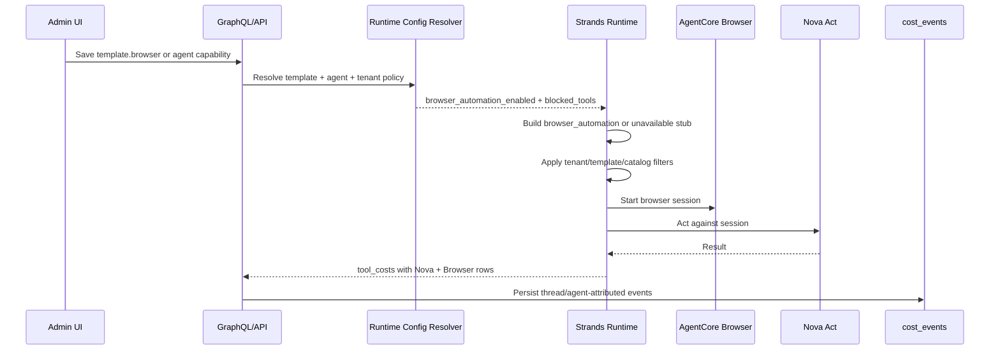

# feat: Register AgentCore Browser Automation as a built-in tool

## Overview

Register the existing AgentCore Browser + Nova Act path as a first-class built-in tool named **Browser Automation**. The work makes the browser tool visible in the capability catalog and admin Built-in Tools surface, gates registration through template and per-agent configuration, verifies an agent can spawn a browser session end to end, and records browser-related costs with honest provider separation.

The plan intentionally preserves the current high-level automation shape. v1 does not expose raw browser session primitives.

---

## Problem Frame

ThinkWork already has `_browse_website` in `packages/agentcore-strands/agent-container/container-sources/server.py`. It starts an AgentCore Browser session with `bedrock_agentcore.tools.browser_client.browser_session`, then drives it with Nova Act. That path is hidden from the product model: it is not in `capability_catalog`, not on the admin Built-in Tools page, and its costs are currently appended as a blended `nova_act` tool cost. With capability-catalog enforcement, a catalog-missing browser tool can be silently dropped.

The origin document defines v1 as Browser Automation: an opt-in, policy-visible tool that performs browser tasks, not a raw browser SDK surface (see origin: `docs/brainstorms/2026-04-25-agentcore-browser-automation-requirements.md`).

---

## Requirements Trace

- R1. Browser Automation is registered in `capability_catalog` so catalog enforcement keeps it.
- R2. Browser Automation appears in Capabilities → Built-in Tools with AgentCore/Nova Act positioning.
- R3. Effective enablement respects tenant policy, template opt-in, per-agent configuration, template blocks, and runtime catalog enforcement.
- R4. The capability is named and shaped as high-level browser automation, not raw browser primitives.
- R5. The runtime only exposes the tool when required credentials/dependencies are present, or exposes a clear unavailable state.
- R6. The tool starts AgentCore Browser and uses Nova Act to complete the task.
- R7. Tool results are bounded and agent-readable on success and failure.
- R8. End-to-end verification proves a browser session is spawned.
- R9. Cost attribution distinguishes Nova Act automation cost from AgentCore Browser substrate cost.
- R10. Tool costs are persisted through the existing thread → agent `cost_events` path.
- R11. Cost metadata carries URL/task/duration/provider/debug context.
- R12. Pricing uses current AWS semantics: Nova Act by elapsed agent-hour, AgentCore Browser by active CPU/memory, with a labeled estimate fallback if exact per-call usage is not available synchronously.

**Origin actors:** A1 tenant admin, A2 template or agent author, A3 agent runtime, A4 operator.
**Origin flows:** F1 Browser capability discovery and opt-in, F2 Agent spawns a browser session, F3 Browser costs are attributed.
**Origin acceptance examples:** AE1 catalog enforcement, AE2 admin visibility, AE3 browser session e2e, AE4 cost attribution, AE5 missing Nova Act configuration.

---

## Scope Boundaries

- Raw browser-control primitives are not part of v1. No `browser_session` or `browser_control` tool is exposed.
- Logged-in website credential automation is not part of v1 unless it already works through existing user/tool context.
- CAPTCHA avoidance, proxy configuration, session replay UI, and custom browser extensions remain out of scope.
- A dedicated Browser observability UI is out of scope; v1 uses manifests, logs, and cost analytics.
- Browser-specific quota/budget circuit breakers are deferred unless implementation discovers the existing budget checks cannot safely cover tool costs.

### Deferred to Follow-Up Work

- Exact AgentCore Browser CPU/memory reconciliation beyond invocation-time estimate: add a later CloudWatch/trace reconciliation job if AgentCore does not expose enough per-session usage during the tool call.
- Raw Browser SDK/control tool: revisit only if Browser Automation use cases require lower-level browser steps without Nova Act.

---

## Context & Research

### Relevant Code and Patterns

- `packages/agentcore-strands/agent-container/container-sources/server.py` already defines `_browse_website`, loads a Nova Act key, imports `browser_session`, appends `_tool_costs`, and drains those costs into invocation responses.
- `packages/agentcore-strands/agent-container/container-sources/server.py` also contains the Code Sandbox registration pattern: dispatcher-provided env gates tool construction, the tool is appended before `filter_builtin_tools`, catalog enforcement, manifest logging, and `Agent(tools=...)`.
- `packages/agentcore-strands/agent-container/container-sources/builtin_tool_filter.py` and `test_builtin_tool_filtering.py` provide the tenant/template narrowing behavior to extend with the browser slug.
- `packages/agentcore-strands/agent-container/container-sources/capability_catalog.py` and `test_capability_catalog.py` enforce SI-7 catalog filtering.
- `packages/database-pg/drizzle/0027_capability_catalog_and_manifests.sql` seeds built-in tools but does not seed the browser tool.
- `apps/admin/src/routes/_authed/_tenant/capabilities/builtin-tools.tsx` has a local Built-in Tools catalog with Code Sandbox and Web Search only.
- `apps/admin/src/routes/_authed/_tenant/agent-templates/$templateId.$tab.tsx` already has a Code Sandbox template opt-in card that can be mirrored for Browser Automation.
- `packages/api/src/lib/templates/sandbox-config.ts` is the resolver-boundary validation pattern for JSONB template capability config.
- `packages/api/src/lib/resolve-agent-runtime-config.ts` is the shared runtime-config resolver for template fields, per-agent state, tenant built-in tools, and blocked tools.
- `packages/api/src/handlers/chat-agent-invoke.ts` and `packages/api/src/handlers/wakeup-processor.ts` already persist `invokeResult.tool_costs` into `cost_events` with thread and agent attribution.
- `packages/api/src/graphql/resolvers/costs/costSummary.query.ts`, `costTimeSeries.query.ts`, and `costByAgent.query.ts` aggregate existing cost events; tool-specific detail is currently coarse.

### Institutional Learnings

- `docs/solutions/best-practices/bedrock-agentcore-sdk-version-drift-prefer-raw-boto3-2026-04-24.md` warns that AgentCore helper wrappers can drift. For Browser, keep wrapper usage isolated and add focused import/shape tests; if drift appears, prefer raw boto3 where Browser APIs permit.
- `docs/solutions/patterns/apply-invocation-env-field-passthrough-2026-04-24.md` shows that per-invocation fields can be silently dropped when `server.py` constructs subset payloads. Browser enablement fields should flow through one shared runtime config path and be covered by tests.
- `docs/solutions/workflow-issues/agentcore-runtime-no-auto-repull-requires-explicit-update-2026-04-24.md` means end-to-end Browser verification must confirm the AgentCore runtime is actually serving the new image, not just that the repository code changed.
- `docs/solutions/build-errors/dockerfile-explicit-copy-list-drops-new-tool-modules-2026-04-22.md` is already mitigated by wildcard `COPY`, but any new runtime module should still be included in `_boot_assert.py`.

### External References

- AWS AgentCore pricing: AgentCore Browser is active CPU/memory priced, with `$0.0895 per vCPU-hour` and `$0.00945 per GB-hour`; billing is per-second active resource consumption with memory minimums and possible storage/network charges. Source: [Amazon Bedrock AgentCore Pricing](https://aws.amazon.com/bedrock/agentcore/pricing/).
- AWS AgentCore tool observability: built-in tool span data includes `StartBrowserSession` attributes such as operation name, resource ARN, request id, tool session id, latency, and error type. Source: [AgentCore generated built-in tools observability data](https://docs.aws.amazon.com/bedrock-agentcore/latest/devguide/observability-tool-metrics.html).
- AWS Nova pricing: Nova Act workflows are `$4.75 per agent hour`; agent hours are elapsed time while the agent is working. Source: [Amazon Nova pricing](https://aws.amazon.com/nova/pricing).

---

## Key Technical Decisions

- Use `browser_automation` as the durable built-in slug and Strands tool name. The current `_browse_website` function name is private-looking and should not become the catalog contract. If compatibility with existing prompts matters during implementation, keep a display alias in prompt text, not in `capability_catalog`.
- Model template opt-in with a first-class `AgentTemplate.browser` JSONB field, mirroring `AgentTemplate.sandbox`. Shape: `{ enabled: true }` for v1. This avoids abusing `blocked_tools` as an allowlist and leaves room for future browser mode metadata without adding raw primitives now.
- Use existing `agent_capabilities` for per-agent override. An enabled `browser_automation` capability enables Browser Automation for that agent even if its template is not opted in; a disabled row disables it for that agent even if the template opts in. Tenant-level disabled built-ins and template `blocked_tools` remain stronger narrowing signals.
- Keep Browser Automation stage-configured for v1. The Nova Act key remains resolved from env/SSM as today; tenants do not provide a Browser API key in Built-in Tools.
- Split tool-cost events into at least two rows when Browser runs: `nova_act_browser_automation` for Nova Act elapsed agent-hour cost, and `agentcore_browser` for Browser substrate cost or labeled estimate.
- Prefer exact Browser usage metrics when available during the invocation; otherwise use an explicit estimate event with `metadata.estimate = true` and enough identifiers to reconcile from AgentCore/CloudWatch later.

---

## Open Questions

### Resolved During Planning

- Final built-in slug: use `browser_automation`.
- Missing Nova Act configuration behavior: expose a clear unavailable state. Runtime should register a stub only when the effective policy says Browser should be available but configuration is missing; otherwise omit the tool normally.
- End-to-end test target: use a deterministic public page under ThinkWork control if available, otherwise a stable AWS docs page or local static page reachable from the deployed runtime. The assertion must prove session start from AgentCore logs/spans, not just model text.

### Deferred to Implementation

- Exact AgentCore Browser per-session CPU/memory extraction: inspect the current Browser session response, AgentCore spans, and CloudWatch metric dimensions during implementation. Use the estimate fallback if exact usage is not synchronously available.
- Exact GraphQL/codegen fan-out: implementation should update every consumer with a codegen script after GraphQL schema changes.
- Whether the current `bedrock_agentcore.tools.browser_client.browser_session` wrapper is still stable: add a focused import/shape test and switch to raw AWS API only if the wrapper has drifted.

---

## High-Level Technical Design

> _This illustrates the intended approach and is directional guidance for review, not implementation specification. The implementing agent should treat it as context, not code to reproduce._

---

## Implementation Units

- U1. **Add Browser Automation config contracts**

**Goal:** Add the data/API contract for template-level Browser Automation opt-in and per-agent effective capability resolution.

**Requirements:** R3, R4, R5; F1; AE2, AE5.

**Dependencies:** None.

**Files:**

- Modify: `packages/database-pg/src/schema/agent-templates.ts`
- Modify: `packages/database-pg/graphql/types/agent-templates.graphql`
- Create: `packages/database-pg/drizzle/NNNN_add_browser_automation_template_config.sql`
- Create: `packages/api/src/lib/templates/browser-config.ts`
- Modify: `packages/api/src/graphql/resolvers/templates/createAgentTemplate.mutation.ts`
- Modify: `packages/api/src/graphql/resolvers/templates/updateAgentTemplate.mutation.ts`
- Modify: `packages/api/src/lib/resolve-agent-runtime-config.ts`
- Modify: `packages/api/src/lib/__tests__/resolve-agent-runtime-config.test.ts`
- Test: `packages/api/src/lib/templates/browser-config.test.ts`
- Test: `packages/api/src/__tests__/graphql-contract.test.ts`
- Generate: `apps/admin/src/gql/graphql.ts`
- Generate: `apps/admin/src/gql/gql.ts`
- Generate: `apps/mobile/lib/gql/graphql.ts`
- Generate: `apps/cli/src/gql/graphql.ts`
- Generate: generated API GraphQL types under `packages/api` if the package codegen emits checked-in output

**Approach:**

- Add nullable `agent_templates.browser` JSONB, shaped and validated at the resolver boundary like `sandbox`.
- Validator accepts `null | undefined` as no opt-in, accepts `{ enabled: true }`, rejects malformed fields, and strips nothing silently on writes.
- Extend runtime config resolution to compute effective browser intent from template `browser` plus `agent_capabilities.capability = "browser_automation"`.
- Resolution precedence: tenant `disabled_builtin_tools` and template `blocked_tools` narrow last; explicit disabled agent capability beats template opt-in; explicit enabled agent capability can opt in a single agent.
- Pass a simple payload field such as `browser_automation_enabled` to the Strands runtime rather than teaching the runtime to infer from unrelated config.

**Patterns to follow:**

- `packages/api/src/lib/templates/sandbox-config.ts`
- `packages/api/src/lib/resolve-agent-runtime-config.ts`
- `packages/api/src/graphql/resolvers/agents/setAgentCapabilities.mutation.ts`

**Test scenarios:**

- Happy path: `{ enabled: true }` on a template resolves `browser_automation_enabled = true`.
- Happy path: an enabled agent capability turns Browser on even when template `browser` is null.
- Edge case: a disabled agent capability turns Browser off even when template `browser.enabled` is true.
- Error path: malformed `browser` JSON returns a resolver validation error.
- Integration: runtime config includes `blockedTools` unchanged so downstream built-in filtering can still narrow `browser_automation`.
- Contract: GraphQL schema exposes `AgentTemplate.browser`, create/update inputs accept it, and generated admin/mobile/cli types compile.

**Verification:**

- API tests prove template and agent-level enablement resolve deterministically.
- Generated GraphQL types include `browser` without breaking existing template queries.

---

- U2. **Extract and harden the Browser Automation runtime tool**

**Goal:** Move the current hidden `_browse_website` behavior into a focused browser tool module with stable slug, bounded results, unavailable-state behavior, and tests.

**Requirements:** R4, R5, R6, R7; F2; AE3, AE5.

**Dependencies:** U1.

**Files:**

- Create: `packages/agentcore-strands/agent-container/container-sources/browser_automation_tool.py`
- Modify: `packages/agentcore-strands/agent-container/container-sources/server.py`
- Modify: `packages/agentcore-strands/agent-container/container-sources/_boot_assert.py`
- Test: `packages/agentcore-strands/agent-container/test_browser_automation_tool.py`
- Test: `packages/agentcore-strands/agent-container/test_boot_assert.py`

**Approach:**

- Extract `_load_nova_act_key`, browser session/Nova Act execution, result bounding, and cost-event construction out of `server.py`.
- Export a `build_browser_automation_tool` factory that accepts injected dependencies for tests: tool decorator, Browser session factory, Nova Act class/client, key resolver, clock, and cost sink.
- Name the Strands tool `browser_automation`; describe it as web UI task automation, not search.
- Register a stub tool only when `browser_automation_enabled` is true but configuration/dependencies are missing. The stub returns a structured unavailable result and records no Browser substrate cost.
- Preserve result discipline: success returns the useful string result; failure returns a concise error with type/message metadata and logs details server-side.
- Keep wrapper usage isolated. Add a shape/import test for `browser_session`; if implementation proves drift, switch that module to the stable lower-level AWS API available for Browser.

**Execution note:** Add characterization coverage around current success/error/cost behavior before moving logic out of `server.py`.

**Patterns to follow:**

- `packages/agentcore-strands/agent-container/container-sources/sandbox_tool.py`
- `packages/agentcore-strands/agent-container/test_sandbox_tool.py`
- `docs/solutions/best-practices/bedrock-agentcore-sdk-version-drift-prefer-raw-boto3-2026-04-24.md`

**Test scenarios:**

- Happy path: with a fake browser session and fake Nova Act response, `browser_automation(url, task)` returns the response and appends cost rows.
- Error path: missing Nova Act key with effective enablement returns `BrowserUnavailable` and does not attempt to start a browser session.
- Error path: browser session creation failure returns a concise browser automation error and appends any appropriate elapsed Nova estimate only if work started.
- Edge case: empty/`None` Nova Act response returns a bounded "could not extract" result rather than an empty string.
- Integration: tool callable exposes slug `browser_automation` so built-in filters and capability manifests can see it.
- Packaging: `_boot_assert.py` expects `browser_automation_tool.py`.

**Verification:**

- Runtime unit tests can exercise Browser Automation without importing real AWS/Nova services.
- `server.py` no longer owns Browser tool business logic directly.

---

- U3. **Wire runtime registration, catalog enforcement, and manifests**

**Goal:** Register Browser Automation in the same runtime phase as other built-ins, and make catalog enforcement keep or drop it predictably.

**Requirements:** R1, R3, R5; F2; AE1, AE5.

**Dependencies:** U1, U2.

**Files:**

- Modify: `packages/agentcore-strands/agent-container/container-sources/server.py`
- Modify: `packages/agentcore-strands/agent-container/container-sources/builtin_tool_filter.py`
- Modify: `packages/agentcore-strands/agent-container/container-sources/capability_manifest.py`
- Modify: `packages/agentcore-strands/agent-container/test_builtin_tool_filtering.py`
- Modify: `packages/agentcore-strands/agent-container/test_capability_catalog.py`
- Modify: `packages/agentcore-strands/agent-container/test_capability_manifest.py`
- Modify: `packages/database-pg/drizzle/0027_capability_catalog_and_manifests.sql`
- Modify: `packages/api/src/__tests__/capability-catalog-list.test.ts`

**Approach:**

- Pass `browser_automation_enabled` from the invocation payload through to the registration branch; avoid the subset-payload footgun by keeping all new env/payload keys covered by tests.
- Register `browser_automation` before built-in filtering and catalog filtering, so tenant disabled built-ins, template blocked tools, and SI-7 enforcement all apply.
- Seed `capability_catalog` with `browser_automation` as type `tool`, source `builtin`, with implementation metadata pointing at the new runtime module.
- Include Browser Automation in resolved capability manifests only when it survives effective filtering.
- Add filter tests that `disabled_builtin_tools=["browser_automation"]` and `template_blocked_tools=["browser_automation"]` remove the tool.

**Patterns to follow:**

- Existing Code Sandbox registration block in `server.py`
- `packages/database-pg/drizzle/0027_capability_catalog_and_manifests.sql`
- `packages/agentcore-strands/agent-container/container-sources/capability_catalog.py`

**Test scenarios:**

- Covers AE1. With `RCM_ENFORCE=true` and catalog containing `browser_automation`, the runtime keeps the tool.
- Error path: with catalog missing `browser_automation`, SI-7 drops it and logs the dropped slug.
- Happy path: resolved manifest tools include `browser_automation` when enabled and not blocked.
- Edge case: tenant disabled built-in wins over template or agent enablement and removes `browser_automation`.
- Edge case: template blocked tool removes `browser_automation` for one template while leaving other built-ins intact.

**Verification:**

- Catalog list tests expect the browser slug.
- Runtime filter/manifest tests prove Browser follows the existing built-in narrowing model.

---

- U4. **Add admin Built-in Tools and template/agent UI controls**

**Goal:** Make Browser Automation visible to tenant admins and configurable by template or agent author.

**Requirements:** R2, R3, R4, R5; F1; AE2, AE5.

**Dependencies:** U1.

**Files:**

- Modify: `apps/admin/src/routes/_authed/_tenant/capabilities/builtin-tools.tsx`
- Modify: `apps/admin/src/routes/_authed/_tenant/agent-templates/$templateId.$tab.tsx`
- Modify: `apps/admin/src/components/agents/AgentConfigSection.tsx`
- Modify: `apps/admin/src/lib/graphql-queries.ts`
- Modify: generated admin GraphQL files under `apps/admin/src/gql/`
- Test expectation: no admin component unit test harness exists in `apps/admin`; cover the contract in U1 tests and verify UI behavior through the deployed/browser smoke in U6.

**Approach:**

- Add Browser Automation to the Built-in Tools catalog as an AgentCore-backed, platform-configured capability. It should show availability/configuration state, not ask tenant admins for a provider API key.
- In the template Configuration tab, add a compact Browser Automation card mirroring the Code Sandbox card's opt-in pattern.
- In agent configuration, expose a per-agent override using existing `agent_capabilities` and `setAgentCapabilities`; disabled override should be visibly distinct from template inheritance.
- UI copy must not confuse Browser Automation with Web Search. Browser Automation interacts with web pages; Web Search researches pages/search results.
- Surface missing Nova Act configuration as an unavailable/provisioning state when the API can report it. If no readiness endpoint exists yet, keep the first pass honest by showing platform-configured status rather than a false green.

**Patterns to follow:**

- Code Sandbox card in `apps/admin/src/routes/_authed/_tenant/agent-templates/$templateId.$tab.tsx`
- Built-in Tools policy-gated row in `apps/admin/src/routes/_authed/_tenant/capabilities/builtin-tools.tsx`
- Agent capability mutation usage in `apps/admin/src/gql/graphql.ts` / `SetAgentCapabilitiesDocument`

**Test scenarios:**

- Covers AE2. Built-in Tools renders Browser Automation with AgentCore/Nova Act provider text and no API-key field.
- Happy path: saving template Browser Automation opt-in sends `browser: { enabled: true }` and rehydrates as enabled.
- Happy path: per-agent enable/disable writes `browser_automation` to `agent_capabilities` and refreshes the agent detail state.
- Edge case: template enabled plus agent disabled renders effective disabled for the agent.
- Error path: API validation error for malformed browser config surfaces as a toast/message without corrupting the form.

**Verification:**

- Admin can configure Browser at template and agent level without touching raw JSON.
- Browser Automation is discoverable from Capabilities → Built-in Tools.

---

- U5. **Split Browser and Nova Act cost attribution**

**Goal:** Replace the current blended `nova_act` tool cost with provider-separated cost events that preserve thread and agent attribution.

**Requirements:** R9, R10, R11, R12; F3; AE4.

**Dependencies:** U2.

**Files:**

- Modify: `packages/agentcore-strands/agent-container/container-sources/browser_automation_tool.py`
- Modify: `packages/api/src/handlers/chat-agent-invoke.ts`
- Modify: `packages/api/src/handlers/wakeup-processor.ts`
- Modify: `packages/api/src/graphql/resolvers/costs/costSummary.query.ts`
- Modify: `packages/api/src/graphql/resolvers/costs/costTimeSeries.query.ts`
- Modify: `packages/api/src/graphql/resolvers/costs/costByAgent.query.ts`
- Modify: `apps/admin/src/stores/cost-store.ts`
- Modify: `apps/admin/src/routes/_authed/_tenant/-analytics/CostView.tsx`
- Test: `packages/agentcore-strands/agent-container/test_browser_automation_tool.py`
- Test: `packages/api/src/__tests__/cost-recording.test.ts`
- Test: add focused cost resolver coverage under `packages/api/src/__tests__/` if existing tests do not cover tool/provider buckets.

**Approach:**

- Emit one Nova Act event using elapsed working time and the current `$4.75/hour` rate.
- Emit one AgentCore Browser event using exact CPU/memory usage when available; otherwise estimate from elapsed duration with `metadata.estimate = true`, `metadata.pricing_basis`, and identifiers needed for later reconciliation.
- Use distinct event types and providers, for example `event_type = "nova_act_browser_automation"`, `provider = "nova_act"` and `event_type = "agentcore_browser"`, `provider = "agentcore_browser"`.
- Preserve existing handler behavior that persists arbitrary `tool_costs`, but harden request IDs so two rows from the same tool call do not conflict on `uq_cost_events_request_type`.
- Keep these costs in the broader tool bucket for existing summary parity, while adding enough provider/type detail for operators to distinguish them.

**Patterns to follow:**

- Existing `_tool_costs` drain in `server.py`
- Existing cost persistence in `chat-agent-invoke.ts` and `wakeup-processor.ts`
- Cost summary categorization in `costSummary.query.ts` and `costTimeSeries.query.ts`

**Test scenarios:**

- Covers AE4. A successful browser call produces separate Nova Act and AgentCore Browser cost rows with the same thread/agent context.
- Happy path: Nova Act amount equals elapsed seconds / 3600 \* 4.75 within rounding tolerance.
- Edge case: exact Browser usage missing produces a non-zero or zero clearly labeled estimate with `metadata.estimate = true`, not a fake exact number.
- Error path: Nova Act/browser failure after work starts still records elapsed cost metadata.
- Integration: `chat-agent-invoke` and `wakeup-processor` can persist multiple tool-cost rows from one invocation without unique-index collisions.
- Analytics: cost summary still includes Browser/Nova Act in tools spend, while detail/metadata lets operators distinguish providers.

**Verification:**

- Cost events can be queried by thread, agent, provider, and event type.
- No Browser Automation cost is attributed only as generic `nova_act` without substrate detail.

---

- U6. **Add deterministic runtime and end-to-end verification**

**Goal:** Prove Browser Automation still works on a deployed stack and that the running AgentCore runtime image contains the new tool.

**Requirements:** R6, R8, R10; F2, F3; AE3, AE4.

**Dependencies:** U1, U2, U3, U5.

**Files:**

- Create or modify: `packages/skill-catalog/browser-automation-pilot/SKILL.md`
- Create or modify: `packages/skill-catalog/browser-automation-pilot/skill.yaml`
- Create: `docs/guides/browser-automation.md`
- Modify: `docs/guides/sandbox-environments.md` only if shared AgentCore built-in tool triage belongs there; otherwise keep Browser in its own guide.
- Test: add a targeted integration script or documented verification fixture under `scripts/` only if the repo already has a comparable deployed-stack verification pattern.

**Approach:**

- Use a deterministic browser task: prefer a ThinkWork-controlled public static page with a known marker; if unavailable, use a stable AWS docs page and assert a known title/phrase.
- Verification must check both agent-visible output and infrastructure evidence: runtime log/build marker, Browser session start span/log, resolved manifest containing `browser_automation`, and persisted cost events.
- Keep the test agent/template minimal: Browser Automation enabled, no extra skills needed beyond default agent behavior.
- Document the triage recipe for the three likely failures: tool missing from manifest, browser session fails to start, costs missing or blended.

**Patterns to follow:**

- `docs/guides/sandbox-environments.md`
- AgentCore runtime build marker and no-auto-repull learning
- Existing skill catalog pilot pattern in `packages/skill-catalog/sandbox-pilot/`

**Test scenarios:**

- Covers AE3. Browser-enabled template/agent extracts the known marker from the deterministic page.
- Covers AE4. The same run creates Browser/Nova Act cost rows for the thread/agent.
- Error path: running the same prompt with Browser disabled produces a tool-unavailable or no-tool behavior that is understandable and does not spawn a browser session.
- Operational: logs show the deployed runtime build marker for the current commit before e2e evidence is accepted.

**Verification:**

- Operator can reproduce the e2e proof and collect evidence without reading implementation code.
- Browser Automation failure triage has a documented first-pass path.

---

- U7. **Update docs and operational surfaces**

**Goal:** Make Browser Automation understandable to template authors and operators after ship.

**Requirements:** R2, R4, R5, R8, R12; A1, A2, A4.

**Dependencies:** U4, U5, U6.

**Files:**

- Modify: `docs/src/content/docs/applications/admin/builtin-tools.mdx`
- Modify: `docs/src/content/docs/concepts/connectors/mcp-tools.mdx` only if Browser Automation needs contrast with MCP tools.
- Create: `docs/src/content/docs/concepts/agents/browser-automation.mdx` if docs IA has room for a dedicated concept page.
- Modify: `docs/guides/browser-automation.md`

**Approach:**

- Explain Browser Automation as a managed web UI automation capability distinct from Web Search and Code Sandbox.
- Document enablement levels: tenant built-in visibility/configuration, template opt-in, per-agent override, tenant/template blocking.
- Document cost semantics with current AWS pricing references and the estimate/reconciliation caveat.
- Include an operational checklist: confirm Nova Act key/config, confirm catalog row, confirm manifest, confirm Browser session span, confirm cost events.

**Patterns to follow:**

- `docs/src/content/docs/applications/admin/builtin-tools.mdx`
- `docs/src/content/docs/concepts/agents/code-sandbox.mdx`
- `docs/guides/sandbox-environments.md`

**Test scenarios:**

- Test expectation: none -- documentation-only unit. Verification is review against implemented behavior and links.

**Verification:**

- Docs describe the implemented enablement model and do not promise raw browser primitives, proxy configuration, session replay UI, or logged-in credential automation.

---

## System-Wide Impact

- **Interaction graph:** Template mutations and agent capability mutations affect runtime config; runtime config affects Strands tool registration; registration flows through built-in filtering, catalog enforcement, manifest logging, invocation response `tool_costs`, and cost-event persistence.
- **Error propagation:** Missing config should be visible as Browser unavailable/provisioning when effective policy asks for Browser; runtime dependency/import failures should log loudly and return bounded tool errors instead of silently omitting the tool.
- **State lifecycle risks:** `_tool_costs` is process-global today and drained per invocation. Browser cost code must avoid leaking stale cost rows across turns; keep clear-on-success and clear-on-exception behavior intact.
- **API surface parity:** GraphQL schema changes require codegen in `apps/admin`, `apps/mobile`, `apps/cli`, and `packages/api`.
- **Integration coverage:** Unit tests prove filters and cost math; deployed-stack verification proves actual AgentCore Browser session creation, runtime image freshness, and cost persistence.
- **Unchanged invariants:** Web Search remains provider/API-key configured; Code Sandbox remains Code Interpreter-backed and template-sandbox-configured; Browser Automation does not replace either.

---

## Risks & Dependencies

| Risk                                                                                         | Mitigation                                                                                                                          |
| -------------------------------------------------------------------------------------------- | ----------------------------------------------------------------------------------------------------------------------------------- |
| AgentCore Browser wrapper drift mirrors the Code Interpreter wrapper problem                 | Isolate wrapper usage in `browser_automation_tool.py`, add import/shape tests, and switch to raw AWS API if the wrapper has drifted |
| Browser appears enabled in UI but Nova Act key is missing in runtime                         | Add explicit unavailable/provisioning state and runtime stub only when policy asks for Browser                                      |
| Catalog enforcement drops the tool in production                                             | Seed `capability_catalog`, update tests, and verify manifests under `RCM_ENFORCE=true`                                              |
| Cost rows collide on `uq_cost_events_request_type` when one browser call emits multiple rows | Ensure each tool-cost row has a distinct request id or event type/request id combination                                            |
| Exact Browser active CPU/memory cost is unavailable synchronously                            | Emit labeled estimate with reconciliation metadata; document the limitation and follow-up reconciliation path                       |
| Deployed AgentCore runtime serves stale image                                                | Verification must check runtime build marker/logs per the no-auto-repull learning                                                   |

---

## Documentation / Operational Notes

- Update admin docs and operator guide before marking the feature complete.
- Include current AWS pricing links in docs, but label pricing as current as of 2026-04-25 and avoid hard-coding stale `$0.001/min` Browser assumptions.
- E2E proof should be captured after the deploy pipeline updates the AgentCore runtime, not just after CI pushes the container image.
- Consider adding a CloudWatch query snippet in `docs/guides/browser-automation.md` for `StartBrowserSession`, `browser_automation`, and cost-event verification.

---

## Sources & References

- **Origin document:** `docs/brainstorms/2026-04-25-agentcore-browser-automation-requirements.md`
- Existing runtime Browser code: `packages/agentcore-strands/agent-container/container-sources/server.py`
- Built-in filter/catalog runtime: `packages/agentcore-strands/agent-container/container-sources/builtin_tool_filter.py`, `packages/agentcore-strands/agent-container/container-sources/capability_catalog.py`
- Capability catalog seed: `packages/database-pg/drizzle/0027_capability_catalog_and_manifests.sql`
- Runtime config resolver: `packages/api/src/lib/resolve-agent-runtime-config.ts`
- Admin Built-in Tools page: `apps/admin/src/routes/_authed/_tenant/capabilities/builtin-tools.tsx`
- Template Configuration tab: `apps/admin/src/routes/_authed/_tenant/agent-templates/$templateId.$tab.tsx`
- Cost persistence: `packages/api/src/handlers/chat-agent-invoke.ts`, `packages/api/src/handlers/wakeup-processor.ts`
- AWS pricing: [Amazon Bedrock AgentCore Pricing](https://aws.amazon.com/bedrock/agentcore/pricing/), [Amazon Nova pricing](https://aws.amazon.com/nova/pricing)
- AWS observability: [AgentCore generated built-in tools observability data](https://docs.aws.amazon.com/bedrock-agentcore/latest/devguide/observability-tool-metrics.html)
