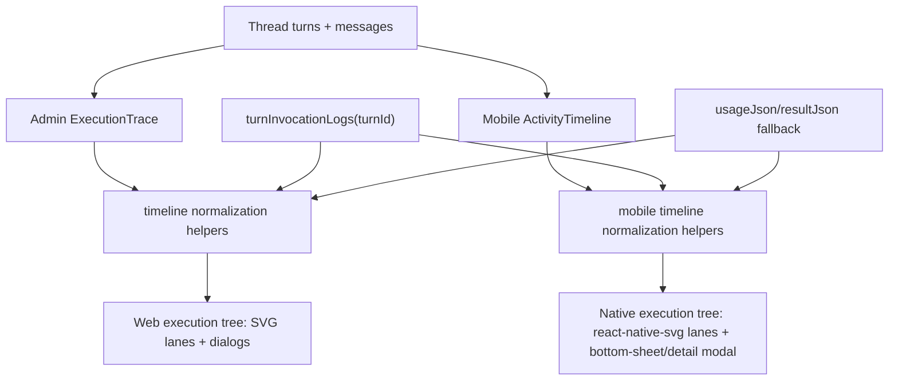

# Thread Activity Naming and Mobile Advanced Parity

## Overview

Refine the thread detail activity timeline so agent-run rows are labeled as agent work rather than "Chat Message", and bring mobile advanced mode closer to the admin web experience: execution tree, branch/sub-agent lanes, model/tool/response rows, token/cost/duration detail, and drill-in content for tool calls and responses. The goal is parity in information architecture, not pixel-perfect reuse; admin is DOM/SVG/Tailwind, while mobile is React Native with `react-native-svg` and compact touch targets.

---

## Problem Frame

The current admin thread detail view exposes two adjacent concepts in the activity timeline:

- User/agent conversation messages, labeled by actor such as `User` and `Marco`.
- Agent execution turns, currently labeled from the turn trigger/source, often rendering as `chat message`.

That "chat message" label is implementation vocabulary. It does not describe what the row represents: the agent is doing work in response to a message. The expanded admin turn already shows the more useful mental model: an execution sequence ending in `Response`, with tools, LLM invocations, branch/sub-agent structure, tokens, duration, and cost.

Mobile advanced mode shows the agent-work row, but only as a compact details card with aggregate input/output/cost/duration. It does not expose the thinking/execution tree, branch lanes, per-tool details, or response preview that admin gives operators. This leaves mobile operators with less diagnostic power when reviewing the same thread.

The existing cleanup requirements explicitly said not to redesign the activity timeline (see origin: `docs/brainstorms/2026-04-24-thread-detail-cleanup-requirements.md`). This plan is a follow-on refinement scoped only to activity naming and mobile advanced-mode parity.

---

## Requirements Trace

- R1. Admin and mobile must stop displaying `chat message` / `Chat Message` as the visible label for agent-run rows. The row title should communicate agent work, preferably using the agent name where available and a secondary label/source where helpful.
- R2. The final answer inside an expanded execution remains labeled `Response`; that is the output artifact of the agent work.
- R3. Mobile advanced mode must render a turn execution timeline comparable to admin's `ExecutionTimeline`: model invocation rows, tool-call rows, response row, branch/sub-agent grouping, tokens, duration, cost, and drill-in detail.
- R4. Mobile must fetch the same observability data admin uses for execution detail (`turnInvocationLogs`) while preserving the existing `usageJson` fallback when CloudWatch logs are unavailable.
- R5. The implementation must respect the two mobile thread detail surfaces: the primary chat route `apps/mobile/app/thread/[threadId]/index.tsx` and the legacy/detail route `apps/mobile/app/threads/[id]/index.tsx`.
- R6. Query/codegen changes must stay consistent across mobile and admin consumers.
- R7. Advanced mode must remain the gate for mobile turn internals; non-admin/basic mobile users continue to see only conversation-level activity.

**Origin actors:** A1 (Enterprise operator, admin SPA), A2 (Agent runtime), A3 (Downstream implementer)

---

## Scope Boundaries

- Not changing the backend shape of `thread_turns`, messages, or model invocation logs.
- Not changing how agent work is executed, billed, or persisted.
- Not exposing hidden chain-of-thought. The "thinking tree" here means observable execution structure: branches/sub-agent lanes, model calls, tool calls, tool results/previews, and final response.
- Not redesigning the full admin thread detail page, right rail, attachments, artifacts, or traces sections.
- Not consolidating the two mobile thread detail routes.
- Not requiring exact visual parity between web and mobile. Mobile should use a native layout suited to small screens and touch.
- Not adding a mobile test framework. Verification uses typecheck/codegen plus simulator/TestFlight smoke unless a suitable test harness already exists when implementation starts.

---

## Context & Research

### Relevant Code and Patterns

- `apps/admin/src/components/threads/ExecutionTrace.tsx` is the reference implementation. It merges turns and messages, renders `TurnRow`, fetches `TurnInvocationLogsQuery`, builds timeline events, computes branch lanes, and falls back to `usageJson.tool_invocations` when logs are unavailable.
- `apps/admin/src/lib/graphql-queries.ts` already defines `TurnInvocationLogsQuery` with `requestId`, `modelId`, token counts, previews, `toolUses`, `hasToolResult`, and `branch`.
- `packages/database-pg/graphql/types/observability.graphql` exposes `ModelInvocation` and `turnInvocationLogs(tenantId:, turnId:)`.
- `packages/api/src/graphql/resolvers/observability/turnInvocationLogs.query.ts` resolves logs from CloudWatch and heuristically labels `branch` as `parent` or `sub-agent:<name>`.
- `apps/mobile/components/threads/ActivityTimeline.tsx` is the mobile timeline. It merges messages and turns, gates turn rows behind `isAdmin`, and currently shows only aggregate detail in `TurnContent`.
- `apps/mobile/lib/graphql-queries.ts` defines `ThreadTurnsForThreadQuery`, `ThreadTurnEventsQuery`, and generated mobile types already include `ModelInvocation`, but mobile does not define or use `TurnInvocationLogsQuery`.
- `apps/mobile/package.json` has `codegen` but no `typecheck` or `test` script. Mobile verification should use `pnpm --filter @thinkwork/mobile codegen` and the repo's normal TypeScript/check path if available at execution time.
- `apps/admin/package.json` has `codegen` and `build`, but no local test script.

### Institutional Learnings

- `docs/solutions/best-practices/mobile-sub-screen-headers-use-detail-layout-2026-04-23.md` — mobile detail work should follow existing detail-layout conventions rather than inventing a new navigation frame.
- `docs/plans/2026-04-24-012-refactor-mobile-thread-field-cleanup-plan.md` — mobile has duplicate thread detail routes and recent lifecycle cleanup intentionally touched both without consolidating them.
- `docs/plans/2026-04-24-002-refactor-thread-detail-pre-launch-cleanup-plan.md` — thread detail is an audit surface for agent runs, not task-tracker UI; naming should reflect that posture.

### External References

None required. The relevant pattern is already implemented in admin and exposed by the existing GraphQL schema.

---

## Key Technical Decisions

- **Call the turn row "Agent work" only when the agent name is unavailable.** Preferred visible label is the assigned agent's display name, e.g. `Marco`, with a secondary source label such as `Manual chat`, `Schedule`, or `Webhook` normalized below the title if useful. Raw source strings like `chat_message` / `chat message` should never be user-facing labels. This matches the user's direction that the row should be the agent's name, while leaving a fallback for system-created turns without agent context.
- **Keep `Response` as the final execution event label.** The row represents the agent doing work; the leaf event represents the agent's final natural-language answer.
- **Extract timeline normalization before extracting UI.** Admin's `buildTimeline`, `buildTimelineFromUsage`, branch helpers, token formatting assumptions, and preview parsing are conceptually shared. Move the pure data-shaping logic into a reusable module under `apps/admin` and mirror/copy the same pure helper into mobile only if cross-package sharing is awkward. Do not create a new workspace package for this small parity slice.
- **Mobile renders native parity, not DOM parity.** Use React Native rows and `react-native-svg` branch lines. Favor a vertical compact tree with branch-colored lanes over trying to port the exact web SVG measurements.
- **Mobile fetches `turnInvocationLogs` lazily on expansion.** Avoid querying CloudWatch for every turn in a long thread on initial render. Expanded turn rows fetch logs for that turn; fallback immediately renders from `usageJson` while logs load.
- **Preserve `usageJson` fallback as first-class.** CloudWatch log availability is best-effort. Mobile should still show tool rows and the `Response` row from `usageJson`/`resultJson` when invocation logs are empty.
- **Keep advanced-mode gating at `ActivityTimeline`.** The existing `isAdmin` prop already filters turn rows. The richer execution tree belongs inside that path, so basic users are unaffected.

---

## Open Questions

### Resolved During Planning

- **Does mobile already have generated `ModelInvocation` types?** Yes, generated types include `ModelInvocation`, but no mobile query document fetches it yet.
- **Can mobile draw branch lanes?** Yes, `react-native-svg` is already a dependency.
- **Does admin already have a fallback when CloudWatch logs are missing?** Yes, `buildTimelineFromUsage` derives model/tool/response rows from turn usage and result data.
- **Does the row label source come from `triggerName` / `invocationSource` today?** Yes, admin and mobile both use those fields, which is why chat-origin turns become "chat message".
- **Are tests available for the mobile component?** No local mobile test script or React Native testing dependency was found. Plan verification should not assume a new test stack.

### Deferred to Implementation

- **Exact mobile branch-line dimensions.** Implementation should tune row height and lane spacing against a simulator screenshot.
- **Whether to share helper code by path alias or duplicate pure helpers.** Prefer local duplication if sharing would create bundler or cross-app coupling.
- **Exact secondary label copy.** `Manual chat`, `Chat request`, or another source-normalized label can be refined in review; the primary fix is removing `Chat Message` / `chat message` from user-facing titles and subtitles.

---

## High-Level Technical Design

> *This illustrates the intended approach and is directional guidance for review, not implementation specification. The implementing agent should treat it as context, not code to reproduce.*

---

## Implementation Units

- U1. **Rename agent-work rows across admin and mobile**

**Goal:** Replace visible `chat message` / `Chat Message` row titles with agent-centered terminology while preserving source metadata as secondary information.

**Requirements:** R1, R2, R5, R7.

**Dependencies:** None.

**Files:**
- Modify: `apps/admin/src/components/threads/ExecutionTrace.tsx`
- Modify: `apps/mobile/components/threads/ActivityTimeline.tsx`
- Test expectation: none -- existing apps do not have component test harnesses for these timeline components.

**Approach:**
- In admin `TurnRow`, title the collapsed row with the agent name when available, falling back to `Agent work`.
- Pass agent identity into turn rows from `ExecutionTrace` using `turn.agentId` and `agentMap`.
- Move the current `turn.triggerName || turn.invocationSource` value into a secondary/source label, normalized to human copy, instead of using it as the main title. For example, `chat_message` / `chat message` should render as `Manual chat` or equivalent product copy.
- In mobile `TurnContent`, use `agentName` as the primary title when available, falling back to `Agent work`.
- Preserve the final execution leaf label `Response` inside the expanded timeline.
- Ensure no visible title-cased `Chat Message` row remains in mobile, and no lower-case `chat message` row title remains in admin.

**Patterns to follow:**
- Admin `MessageRow` already labels assistant messages with the agent's name using `agentMap`.
- Mobile `AgentMessageContent` already accepts `agentName`; reuse that same display identity for turns.

**Test scenarios:**
- Happy path: a chat-origin turn with `triggerName = "chat message"` renders row title `Marco` (or configured agent name), with source shown separately if displayed.
- Edge case: a turn without `agentId` or a missing agent map entry renders `Agent work`.
- Regression: the expanded execution timeline still contains a final `Response` row when `resultJson.response` exists.

**Verification:**
- Screenshots of admin and mobile no longer show `chat message` / `Chat Message` as the primary row title or subtitle.
- Grep confirms no literal `Chat Message` display string survives in the thread activity UI, and source mapping prevents raw `chat message` from rendering.

---

- U2. **Introduce mobile turn invocation query and timeline normalization**

**Goal:** Let mobile fetch the same per-turn model invocation data admin uses, while retaining the current usage/result fallback path.

**Requirements:** R3, R4, R6, R7.

**Dependencies:** U1.

**Files:**
- Modify: `apps/mobile/lib/graphql-queries.ts`
- Modify: `apps/mobile/lib/gql/gql.ts`
- Modify: `apps/mobile/lib/gql/graphql.ts`
- Modify: `apps/mobile/components/threads/ActivityTimeline.tsx`
- Test expectation: none -- generated GraphQL types and app typecheck/build are the verification surface.

**Approach:**
- Add mobile `TurnInvocationLogsQuery` matching admin's query shape in `apps/admin/src/lib/graphql-queries.ts`.
- Regenerate mobile GraphQL codegen.
- Move mobile parsing toward the admin event model: `llm`, `tool_call`, and `response` events with `branch`, token counts, cost, previews, and detail text.
- Implement or copy pure helpers equivalent to admin's `buildTimeline`, `buildTimelineFromUsage`, `reparentSubAgentEvents`, `buildBranches`, and branch-name helpers.
- Keep fallback construction from `usageJson.tool_invocations`, `usageJson.tools_called`, and `resultJson.response` / `responseText` so mobile still renders useful details when `turnInvocationLogs` returns `[]`.

**Patterns to follow:**
- `apps/admin/src/components/threads/ExecutionTrace.tsx` timeline builder and fallback logic.
- `packages/api/src/graphql/resolvers/observability/turnInvocationLogs.query.ts` for available `ModelInvocation` fields and branch semantics.

**Test scenarios:**
- Happy path: expanded mobile turn receives multiple `turnInvocationLogs` rows and produces model, tool, and response events in chronological order.
- Edge case: `turnInvocationLogs` returns empty; mobile still builds model/tool/response rows from `usageJson` and `resultJson`.
- Edge case: malformed `usageJson` or `resultJson` does not crash the timeline; it renders the basic aggregate detail or nothing for malformed pieces.
- Integration: mobile query document codegen includes `TurnInvocationLogsDocument` and typed result fields.

**Verification:**
- Mobile codegen output includes the new query and no unrelated schema drift beyond generated document updates.
- Expanded advanced turn rows can render with both log-backed and fallback data.

---

- U3. **Render native execution tree in mobile advanced mode**

**Goal:** Replace the current mobile aggregate-only details card with a compact native execution tree that mirrors admin's information density.

**Requirements:** R3, R4, R7.

**Dependencies:** U2.

**Files:**
- Modify: `apps/mobile/components/threads/ActivityTimeline.tsx`
- Create: `apps/mobile/components/threads/TurnExecutionTimeline.tsx` (optional but preferred if `ActivityTimeline.tsx` would otherwise grow too large)
- Test expectation: none -- visual/simulator verification is required.

**Approach:**
- On turn expansion, render a `TurnExecutionTimeline` that:
  - Shows an execution header like `Execution (N steps) · X in + Y out · $cost`.
  - Draws main and branch/sub-agent lanes using `react-native-svg`.
  - Renders model rows with token/cost summary.
  - Renders tool rows with `tool` / `sub-agent` badges and branch-specific token/cost rollups when available.
  - Renders a final `Response` row with a short preview.
  - Opens a native detail view for row input/output/response content.
- Use touch-friendly row heights and avoid tiny hover-only affordances. A bottom sheet, modal, or existing detail sheet is acceptable for drill-in content.
- Preserve existing error block display for failed turns.
- Keep the previous aggregate details available either as the execution header or as a small summary above the tree; do not duplicate a bulky "Details" card if the tree already carries the information.

**Patterns to follow:**
- Admin `ExecutionTimeline` row semantics and branch colors.
- Mobile `GenUIContent` / `AgentMessageContent` collapsible patterns for touch interaction.
- Existing mobile theme colors from `apps/mobile/lib/theme.ts`.

**Test scenarios:**
- Happy path: a successful turn with one tool call shows model, tool, and `Response` rows.
- Happy path: a sub-agent/tool branch shows colored branch lane, sub-agent badge, and branch token/cost summary.
- Edge case: a queued/running turn keeps the existing running state and does not show stale completed execution details.
- Edge case: long tool input/output opens in a scrollable detail view and does not overflow the timeline row.
- Error path: failed turn keeps its error panel and still shows whatever execution rows are available.
- Regression: non-admin/basic mode still filters out turn rows entirely.

**Verification:**
- Simulator screenshots for advanced mobile thread detail show the branch/tree UI and row detail drill-in.
- No text overlaps or clipped row labels on an iPhone-sized viewport.

---

- U4. **Parity verification and cleanup**

**Goal:** Prove the naming and advanced-mode parity are consistent across admin and mobile, with generated GraphQL artifacts in sync.

**Requirements:** R1, R2, R3, R4, R6, R7.

**Dependencies:** U1, U2, U3.

**Files:**
- Modify: `apps/mobile/lib/gql/gql.ts`
- Modify: `apps/mobile/lib/gql/graphql.ts`
- Modify: `apps/admin/src/gql/gql.ts` (only if admin query text changes during implementation)
- Modify: `apps/admin/src/gql/graphql.ts` (only if admin query text changes during implementation)
- Test expectation: none -- verification is codegen/type/build plus visual smoke.

**Approach:**
- Regenerate mobile codegen after final query edits.
- Regenerate admin codegen only if admin query documents were touched.
- Run the narrowest available static checks for the touched apps.
- Smoke admin thread detail and mobile advanced mode against a thread with:
  - a simple user message and response,
  - at least one MCP/tool call,
  - at least one sub-agent branch when available.
- Capture before/after screenshots or demo notes for the PR description.

**Patterns to follow:**
- Existing thread-detail cleanup plans' codegen discipline: run codegen for each consumer whose query document changed.
- Frontend design guardrail: verify real viewport screenshots, especially mobile text wrapping and row density.

**Test scenarios:**
- Integration: admin and mobile show the same conceptual turn structure for the same thread, allowing platform-specific visual differences.
- Regression: assistant message rows still render as agent-name conversation responses, separate from agent-work turn rows.
- Regression: the mobile composer, refresh behavior, and message auto-scroll still work after timeline changes.
- Regression: codegen diffs are limited to the new query and any intentional query text changes.

**Verification:**
- `chat message` is not a primary activity title in admin or mobile.
- Mobile advanced mode includes execution tree rows and drill-in detail.
- Codegen artifacts are committed where query documents changed.

---

## System-Wide Impact

- **Interaction graph:** No backend write paths change. Mobile adds a read query to `turnInvocationLogs`, which queries CloudWatch through the existing API resolver.
- **Error propagation:** CloudWatch/log query failures already resolve to `[]`; mobile must treat empty logs as fallback, not as user-visible failure.
- **State lifecycle risks:** Lazy per-turn log fetching prevents long threads from issuing many CloudWatch-backed queries on initial load.
- **API surface parity:** Mobile joins admin as a `turnInvocationLogs` consumer; schema already supports both.
- **Integration coverage:** Visual smoke is important because this is mostly presentation plus generated query wiring.
- **Unchanged invariants:** Advanced turn internals stay admin/advanced-only; user/assistant chat messages remain separate from turn execution rows.

---

## Risks & Dependencies

| Risk | Mitigation |
|------|------------|
| Mobile timeline becomes too dense for a phone screen. | Use collapsible rows, short previews, branch lanes with compact spacing, and detail modal for long content. Verify on an iPhone-sized simulator. |
| CloudWatch-backed `turnInvocationLogs` is slow or empty. | Fetch lazily on expansion and keep `usageJson` fallback as the default visible path. |
| Copying admin helper logic creates drift. | Keep helpers pure and small; document admin as the reference pattern in comments only where useful. Avoid a shared package unless implementation proves the duplication is worse than coupling. |
| Branch heuristics are imperfect. | Preserve admin semantics exactly for parity; this plan does not change backend branch detection. |
| Existing mobile route duplication causes inconsistent UX. | Touch the primary route and verify the legacy/detail route still uses consistent agent-work terminology where it renders activity or summary. |
| No component test harness exists. | Require codegen/static checks and visual smoke; do not add a test framework just for this slice. |

---

## Documentation / Operational Notes

- No public docs need updating.
- PR description should include screenshots for admin and mobile advanced mode showing the renamed row title and mobile execution tree.
- Because this adds CloudWatch-backed reads from mobile, watch API logs after deploy for `turnInvocationLogs` errors or unexpectedly high latency.

---

## Sources & References

- **Origin document:** `docs/brainstorms/2026-04-24-thread-detail-cleanup-requirements.md`
- Related plan: `docs/plans/2026-04-24-002-refactor-thread-detail-pre-launch-cleanup-plan.md`
- Related plan: `docs/plans/2026-04-24-012-refactor-mobile-thread-field-cleanup-plan.md`
- Admin reference: `apps/admin/src/components/threads/ExecutionTrace.tsx`
- Mobile target: `apps/mobile/components/threads/ActivityTimeline.tsx`
- Mobile primary thread route: `apps/mobile/app/thread/[threadId]/index.tsx`
- Mobile legacy/detail route: `apps/mobile/app/threads/[id]/index.tsx`
- Observability schema: `packages/database-pg/graphql/types/observability.graphql`
- Observability resolver: `packages/api/src/graphql/resolvers/observability/turnInvocationLogs.query.ts`
