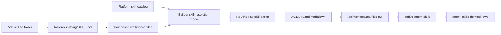

# feat: Agent builder skill authoring

## Overview

Complete the folder-native skill authoring model that the Phase E builder shell exposed but did not finish: replace free-form `Skills` text cells with a catalog-backed picker, show whether each skill resolves locally or from the platform catalog, add a folder-scoped local `SKILL.md` authoring path, and bring agent-template workspace editing onto the same builder model without pretending the existing template `skills` JSON is gone.

This is a follow-on to `docs/plans/2026-04-25-006-feat-phase-e-agent-builder-shell-plan.md`. That slice made `AGENTS.md` the visible authoring surface. This plan makes skill assignment understandable enough for operators to use without knowing implementation details.

---

## Problem Frame

Plan 008 inverted the data flow: `AGENTS.md` routing rows are now the canonical skill membership surface, and `packages/api/src/lib/derive-agent-skills.ts` derives `agent_skills` from composed workspace files. The current builder UI still exposes skill authoring as a raw comma-separated text field inside `RoutingTableEditor`, while agent templates still show an older `Skills` tab backed by `agent_templates.skills` JSON.

That creates a confusing product state:

- Operators do not know which slugs are valid.
- There is no obvious "add skill to this folder" action.
- Local skills under `folder/skills/<slug>/SKILL.md` are supported by the runtime resolver, but not authorable from the builder.
- Template skills look like a second source of truth even though `AGENTS.md` is becoming the canonical routing surface.

The goal is to make the builder tell the truth: platform skills and local skills are selected from the routing row, folder-local skills can be created in-place, and template skill configuration is either clearly transitional or folded into the same mental model where safe.

---

## Requirements Trace

- **R1.** Replace the raw comma-separated `Skills` editor with a picker that lists platform catalog skills and existing local folder skills, while preserving manual slug entry for future/imported skills.
- **R2.** Show per-skill resolution status in the routing editor: local to the target folder or ancestor, platform catalog, unresolved, or malformed.
- **R3.** Add "add skill to this folder" from the builder tree or routing editor. It creates `folder/skills/<slug>/SKILL.md`, opens the new file, and can attach the slug to the relevant routing row.
- **R4.** Keep `AGENTS.md` as the source of truth for agent skill membership. No new direct write path to `agent_skills`.
- **R5.** Bring template workspace editing onto the same builder component model so template authors see the same folder tree, routing editor, and skill picker as agent authors.
- **R6.** Reconcile the template `Skills` tab with the new model. It must no longer appear to be the canonical place to add runtime skills to folders.

**Origin actors:** A1 (template author), A2 (tenant operator), A4 (agent runtime), A6 (ecosystem author).
**Origin flows:** F1 (template inheritance), F2 (external folder import), F3 (sub-agent delegation).
**Origin acceptance examples:** AE6 (workspace-skills unification), AE8 (starter snippets and organize flow).

---

## Scope Boundaries

- Do not remove `agent_skills` storage. It remains the derived fast lookup used by runtime and authz.
- Do not bypass `/api/workspaces/files`. Local `SKILL.md` creation writes through the same workspace file API as other builder edits.
- Do not implement a new backend skill runtime. The runtime already resolves local skills through `packages/agentcore-strands/agent-container/container-sources/skill_resolver.py`.
- Do not add permission/rate-limit/model override metadata to `AGENTS.md` in this slice. Existing template skill permission metadata remains transitional until a separate plan maps those fields onto the folder-native model.
- Do not make template bundle import part of this plan. Current Phase E import UI targets agents via `/api/agents/{agentId}/import-bundle`; template import needs a separate backend contract.

### Deferred to Follow-Up Work

- AGENTS.md row metadata for permissions, operation allowlists, model overrides, rate limits, and enabled/disabled state.
- Fully deleting the template `Skills` tab after the metadata migration above exists.
- Drag-to-organize route-row sync from Plan 008 U19.
- Destructive template swap from Plan 008 U23.

---

## Context & Research

### Relevant Code and Patterns

- `apps/admin/src/components/agent-builder/RoutingTableEditor.tsx` currently renders `Skills` as a raw comma-separated `Input`.
- `apps/admin/src/components/agent-builder/routing-table.ts` parses/serializes routing rows and validates only `Go to` paths today.
- `apps/admin/src/components/agent-builder/AgentBuilderShell.tsx` owns the file list, file content, save/delete, import accordion, and tree interactions for agents.
- `apps/admin/src/lib/agent-builder-api.ts` wraps workspace file operations and import-bundle calls for the builder.
- `apps/admin/src/lib/skills-api.ts` exposes `listCatalog()` and `getCatalogSkill()` for platform catalog metadata.
- `apps/admin/src/routes/_authed/_tenant/agent-templates/$templateId.$tab.tsx` still owns template configuration, workspace editing, template `Skills`, and MCP tabs in one route.
- `packages/api/src/lib/derive-agent-skills.ts` derives `agent_skills` from composed root and folder `AGENTS.md` files. It explicitly owns set membership only.
- `packages/agentcore-strands/agent-container/container-sources/skill_resolver.py` resolves local skills before platform catalog skills, walking ancestor folders.

### Institutional Learnings

- `docs/solutions/patterns/retire-thinkwork-admin-skill-2026-04-24.md` shows the repo's preferred retirement posture: keep safety checks and migration paths while removing misleading user-facing surfaces.
- `docs/solutions/best-practices/every-admin-mutation-requires-requiretenantadmin-2026-04-22.md` applies to any new backend mutation. This plan avoids new backend writes where possible and stays on the already-hardened workspace-files path.
- `docs/plans/2026-04-25-005-feat-u11-derive-agent-skills-plan.md` is the canonical explanation of the file-to-DB direction inversion.

### External References

None. This is an internal model-alignment feature using existing React, workspace file, and runtime resolver patterns.

---

## Key Technical Decisions

- **Keep `AGENTS.md` as the only skill membership writer.** The picker edits the `Skills` column and then saves markdown; derive-agent-skills does the DB reconciliation.
- **Resolve status in the client from the same inputs the runtime uses, but keep it advisory.** The UI can infer local skill files from the composed file list and platform skills from `listCatalog()`. Runtime remains authoritative.
- **Represent local skills as normal workspace files.** Creating a local skill writes `folder/skills/<slug>/SKILL.md` through `agentBuilderApi.putFile`, then opens that file in the editor.
- **Make template parity component-driven, not route-copy-driven.** Extract builder target support so agent and template workspace routes use the same tree/editor/routing components.
- **Do not pretend template `skills` JSON is gone.** For now, relabel or reposition it as "Skill defaults/permissions" and explain it controls default permission metadata, not folder routing membership.

---

## Open Questions

### Resolved During Planning

- **Q: Can the skill picker update runtime membership without a new mutation?** Yes. It updates `AGENTS.md`; the existing workspace-files `put` path triggers derive-agent-skills for agents.
- **Q: Can local `SKILL.md` authoring use existing backend APIs?** Yes. It is just a workspace file write under a reserved allowed path shape: `folder/skills/<slug>/SKILL.md`.
- **Q: Should the template `Skills` tab disappear immediately?** No. It still carries permission/default metadata used by template sync. It should be renamed/reframed until metadata has a folder-native home.

### Deferred to Implementation

- The exact local `SKILL.md` editor form shape. A frontmatter/body split is likely, but implementation should first inspect existing `SKILL.md` examples and parser expectations.
- Whether unresolved platform slugs should block save or warn only. Plan default: warn only, because imported bundles and future tenant/local skills may legitimately reference slugs not in today's platform catalog.

---

## High-Level Technical Design

> *This illustrates the intended approach and is directional guidance for review, not implementation specification. The implementing agent should treat it as context, not code to reproduce.*

---

## Implementation Units

- U1. **Skill resolution model for the builder**

**Goal:** Add a client-side model that classifies a skill slug in context of a target folder.

**Requirements:** R1, R2.

**Dependencies:** None.

**Files:**
- Create: `apps/admin/src/components/agent-builder/skill-resolution.ts`
- Test: `apps/admin/src/components/agent-builder/__tests__/skill-resolution.test.ts`
- Modify: `apps/admin/src/lib/agent-builder-api.ts`

**Approach:**
- Accept inputs: routing row folder path, current workspace file paths, platform catalog skills.
- Classify each slug as `local`, `platform`, `unresolved`, or `malformed`.
- Local lookup mirrors runtime precedence enough for UI: exact folder skill, ancestor folder skill, root skill, then platform.
- Keep the resolver pure and tested; React components consume only its output.

**Patterns to follow:**
- `packages/agentcore-strands/agent-container/container-sources/skill_resolver.py`
- `apps/admin/src/components/agent-builder/routing-table.ts`

**Test scenarios:**
- Happy path: `sales/skills/crm/SKILL.md` resolves `crm` as local for `sales/`.
- Happy path: platform catalog slug resolves as platform when no local skill exists.
- Edge case: child folder inherits an ancestor local skill.
- Error path: slug with slash or whitespace is malformed.
- Edge case: unknown slug is unresolved but preserved.

**Verification:**
- Pure resolver tests cover local/platform/ancestor/unresolved/malformed states.

---

- U2. **Catalog-backed routing skill picker**

**Goal:** Replace the raw `Skills` cell input with a chip/picker editor that uses the resolution model.

**Requirements:** R1, R2, R4.

**Dependencies:** U1.

**Files:**
- Create: `apps/admin/src/components/agent-builder/SkillPicker.tsx`
- Modify: `apps/admin/src/components/agent-builder/RoutingTableEditor.tsx`
- Modify: `apps/admin/src/components/agent-builder/FileEditorPane.tsx`
- Test: `apps/admin/src/components/agent-builder/__tests__/SkillPicker.test.tsx`
- Test: `apps/admin/src/components/agent-builder/__tests__/routing-table.test.ts`

**Approach:**
- Load platform catalog once in `AgentBuilderShell` or `FileEditorPane` and pass catalog summaries down.
- Render selected skills as chips with resolution badges.
- Let users search/select catalog skills, remove chips, and add a manual slug.
- Keep unresolved slugs visible and round-trippable.
- Save still writes the serialized `AGENTS.md` markdown; no direct `agent_skills` mutation.

**Patterns to follow:**
- `apps/admin/src/routes/_authed/_tenant/agent-templates/$templateId.$tab.tsx` for catalog loading.
- Existing shadcn controls under `apps/admin/src/components/ui/`.

**Test scenarios:**
- Happy path: selecting a catalog skill adds it to the row and serializes into `AGENTS.md`.
- Happy path: removing a chip removes the slug from markdown.
- Edge case: unresolved slug remains visible after parse/serialize round trip.
- Error path: malformed manual slug shows warning and does not serialize until fixed.

**Verification:**
- `AGENTS.md` editor no longer exposes a comma-separated text field for skills.
- Existing routing-table parse/serialize tests still pass.

---

- U3. **Folder-scoped local skill creation**

**Goal:** Add an "add skill to this folder" action that creates a local `SKILL.md` and optionally attaches it to routing.

**Requirements:** R3, R4.

**Dependencies:** U1, U2.

**Files:**
- Create: `apps/admin/src/components/agent-builder/LocalSkillDialog.tsx`
- Modify: `apps/admin/src/components/agent-builder/FolderTree.tsx`
- Modify: `apps/admin/src/components/agent-builder/AgentBuilderShell.tsx`
- Test: `apps/admin/src/components/agent-builder/__tests__/local-skill-authoring.test.tsx`

**Approach:**
- Add a small folder-row action for "Add skill".
- Prompt for slug, name, and description.
- Write `folder/skills/<slug>/SKILL.md` using workspace-files `put`.
- Open the new file after creation.
- If the folder has a matching routing row, offer to add the slug to that row. If multiple rows target the folder, ask the operator which row to update.

**Patterns to follow:**
- Existing `handleCreateFile` and folder-template seeding in `AgentBuilderShell`.
- Runtime local skill expectations in `skill_resolver.py`.

**Test scenarios:**
- Happy path: creating `crm` in `sales/` writes `sales/skills/crm/SKILL.md`.
- Happy path: local skill appears as local in the picker after file refresh.
- Edge case: duplicate local skill slug is blocked with a clear message.
- Error path: reserved or malformed slug is rejected client-side.
- Integration: attaching to a row updates `AGENTS.md` and preserves surrounding prose.

**Verification:**
- Operators can create and reference a local skill without leaving the builder.

---

- U4. **Local SKILL.md editor affordance**

**Goal:** Make local skill files editable without requiring users to hand-author frontmatter from scratch.

**Requirements:** R3.

**Dependencies:** U3.

**Files:**
- Create: `apps/admin/src/components/agent-builder/SkillMdEditor.tsx`
- Modify: `apps/admin/src/components/agent-builder/FileEditorPane.tsx`
- Test: `apps/admin/src/components/agent-builder/__tests__/SkillMdEditor.test.tsx`

**Approach:**
- Detect paths matching `(^|/)skills/<slug>/SKILL.md`.
- Show a structured header form for `name` and `description`, plus a markdown instructions body.
- Preserve unknown frontmatter keys and body content when saving.
- Fall back to raw markdown when the file is malformed, with a warning.

**Patterns to follow:**
- Existing `RoutingTableEditor` embedded-above-markdown pattern.
- Platform/local `SKILL.md` frontmatter examples under `packages/skill-catalog/`.

**Test scenarios:**
- Happy path: editing name/description rewrites frontmatter and preserves body.
- Edge case: unknown frontmatter keys survive a save.
- Error path: malformed frontmatter shows raw editor fallback and does not corrupt content.

**Verification:**
- Opening a local `SKILL.md` gives a structured editing affordance but still saves a valid markdown file.

---

- U5. **Template builder parity**

**Goal:** Move template workspace editing onto the same builder component model used by agents.

**Requirements:** R5.

**Dependencies:** U1, U2.

**Files:**
- Modify: `apps/admin/src/components/agent-builder/AgentBuilderShell.tsx`
- Modify: `apps/admin/src/routes/_authed/_tenant/agent-templates/$templateId.$tab.tsx`
- Modify: `apps/admin/src/lib/agent-builder-api.ts`
- Test: `apps/admin/src/components/agent-builder/__tests__/AgentBuilderShell.target.test.tsx`

**Approach:**
- Generalize the shell props from agent-only to a `target` union: agent or template.
- Keep agent-only features guarded: import-bundle remains hidden for templates until a template import endpoint exists.
- Use the same file tree, routing editor, skill picker, local skill authoring, and delete behavior for template workspace files.
- Preserve template route tabs while replacing the workspace tab implementation.

**Patterns to follow:**
- `apps/admin/src/lib/workspace-files-api.ts` already supports `{ templateId }`.
- Current Phase E agent builder shell component boundaries.

**Test scenarios:**
- Happy path: template workspace renders through builder shell with template target.
- Happy path: saving template `AGENTS.md` writes through workspace-files with `templateId`.
- Edge case: import-bundle button is absent for template targets.
- Regression: agent builder still renders agent name and agent-only import controls.

**Verification:**
- Agent and template workspace screens share one builder implementation.

---

- U6. **Template skill semantics cleanup**

**Goal:** Stop the template `Skills` tab from reading as the canonical skill assignment surface.

**Requirements:** R5, R6.

**Dependencies:** U5.

**Files:**
- Modify: `apps/admin/src/routes/_authed/_tenant/agent-templates/$templateId.$tab.tsx`
- Modify: `apps/admin/src/routes/_authed/_tenant/agent-templates/-components/AgentSyncCard.tsx`
- Modify: `apps/admin/src/routes/_authed/_tenant/agent-templates/-components/TemplateSyncDialog.tsx`
- Test: `apps/admin/src/routes/_authed/_tenant/agent-templates/__tests__/template-skills-semantics.test.tsx`

**Approach:**
- Rename or reframe the tab as "Skill Defaults" or "Skill Permissions" rather than "Skills".
- Add concise in-product copy that says routing membership is authored in Workspace `AGENTS.md`; this tab controls default permission/config metadata during template sync.
- Where possible, show derived skills from template `AGENTS.md` as read-only context next to the metadata controls.
- Do not delete template `skills` JSON until row metadata has a replacement.

**Patterns to follow:**
- `docs/solutions/patterns/retire-thinkwork-admin-skill-2026-04-24.md` for transition clarity.
- Existing `TemplateSyncDialog` language for inherited settings.

**Test scenarios:**
- Happy path: tab label no longer says generic "Skills".
- Happy path: copy points operators to Workspace routing for membership.
- Regression: existing permission editor still works for template metadata.
- Regression: template sync diff still shows skill metadata changes accurately.

**Verification:**
- Template authoring no longer presents two equally canonical skill membership surfaces.

---

## System-Wide Impact

- **Interaction graph:** Builder routing editor -> `AGENTS.md` workspace file -> derive-agent-skills -> `agent_skills`; local skill creation -> workspace file -> runtime local resolver.
- **Error propagation:** UI validation is advisory for unresolved slugs, blocking for malformed slugs and invalid paths. Runtime remains authoritative for resolution failures.
- **State lifecycle risks:** Creating `SKILL.md` and attaching it to `AGENTS.md` are two writes. The UI must surface partial completion if the first succeeds and the second fails.
- **API surface parity:** Human UI parity improves; admin MCP parity remains a residual follow-up already captured in `docs/residual-review-findings/phase-e-agent-builder-shell.md`.
- **Unchanged invariants:** `agent_skills` is derived for membership; template permission/config metadata remains transitional and is not silently discarded.

---

## Risks & Dependencies

| Risk | Mitigation |
| --- | --- |
| Picker blocks valid imported/future skills because catalog does not know them yet | Treat unresolved as warning-only, not save-blocking, unless slug syntax is malformed |
| Local skill creation creates file but fails to attach routing row | Surface partial success and leave the newly created `SKILL.md` open |
| Template `Skills` tab remains confusing | Rename/reframe it in U6 and show routing membership in workspace as the canonical path |
| Client resolution drifts from runtime resolver | Keep resolver advisory, test ancestor/local precedence, and link tests to runtime resolver behavior |
| Template parity accidentally exposes agent-only import | Target-gate import-bundle and test template target absence |

---

## Documentation / Operational Notes

- Update any admin docs that tell operators to use the old agent/template Skills tab for membership.
- PR description should explicitly explain the transitional template skill metadata model so reviewers do not mistake U6 for full retirement.

---

## Sources & References

- **Origin document:** `docs/plans/2026-04-24-008-feat-fat-folder-sub-agents-and-agent-builder-plan.md`
- Related plan: `docs/plans/2026-04-25-006-feat-phase-e-agent-builder-shell-plan.md`
- Related plan: `docs/plans/2026-04-25-005-feat-u11-derive-agent-skills-plan.md`
- Related runtime: `packages/agentcore-strands/agent-container/container-sources/skill_resolver.py`
- Related admin UI: `apps/admin/src/components/agent-builder/RoutingTableEditor.tsx`
