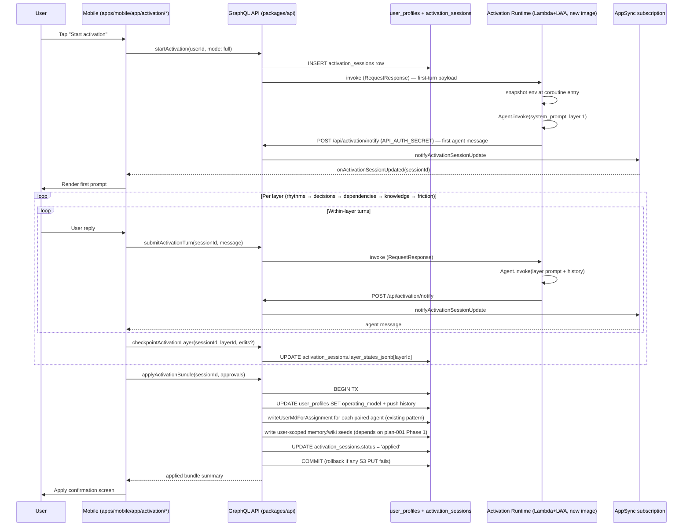

# feat: Agent Activation Operating Model V1

## Overview

Ship a purpose-built focused Strands/Bedrock **Activation Agent** that runs a 30-45 min mobile interview and produces a staged bundle of three confirmed outputs: profile/USER.md updates, workspace context updates, and user-scoped memory/wiki seed entries. V1 deliberately excludes EventBridge automation candidates (deferred to V1.1) and specialist agent/folder recommendations (deferred to V1.2). The runtime is a **new lightweight Lambda+LWA image** at `packages/agentcore-activation/`, not a fork of the existing heavy `thinkwork-${stage}-agentcore` container. The mobile UX is a **purpose-built screen sequence** under `apps/mobile/app/activation/`, not a chat-thread reuse.

The durable artifact is the user's **Operating Model Profile**, persisted as `operating_model jsonb` + `operating_model_history jsonb[]` columns on the existing `user_profiles` table. Five fixed layers — operating rhythms, recurring decisions, dependencies, institutional knowledge, friction — each with its own checkpoint. Refresh-per-layer (R17) is in scope.

This plan **cannot ship** until plan `2026-04-24-001-refactor-user-scope-memory-and-hindsight-ingest` lands its **Phase 1 (U1+U2+U3)** + **U8 (`user_storage.py` helper)**. That gate is non-negotiable — without user-scoped memory/wiki, seed entries land in the wrong scope and create the cross-user read surface the doc-review's SEC2 finding flagged.

---

## Problem Frame

ThinkWork's agent primitives are powerful, but a new end user still has to teach the system how they operate before their agent can be meaningfully useful. A blank `USER.md`, generic workspace context, and unexpressed delegation rules make every first-run agent feel generic.

The opportunity, per the origin brainstorm, is to make the first meaningful ThinkWork experience an **interviewer agent** that elicits the user's tacit operating knowledge in a structured, latency-optimized flow — confirms each layer with the user — and turns the result into durable, multi-agent-reachable user context. Built from Nate Jones' OB1 Work Operating Model Activation recipe spine, adapted to ThinkWork primitives.

**Decisions locked in before this plan:**
- **Sequencing (PL1):** depends on plan `2026-04-24-001` Phase 1 + U8 landing first
- **Surface (PL2 revised):** mobile-first with **purpose-built onboarding screens**, not chat-thread reuse
- **Posture (PL3):** end-user-led; admin-can-bulk-invite is V1.1 follow-up, out of scope here
- **Scope (PL4):** V1 = 3 of 5 surfaces (profile + workspace + memory seeds); automations V1.1; specialists V1.2
- **Storage (SG8a):** extend `user_profiles` with `operating_model jsonb` + `operating_model_history jsonb[]`, no new top-level table for the durable model itself (a sibling `activation_sessions` table tracks in-flight interview state)
- **Runtime (SG8b revised):** **new purpose-built Strands runtime image** at `packages/agentcore-activation/` — second Lambda+LWA alongside the heavy strands runtime. The user explicitly rejected reusing the existing harness on latency/UX grounds; R1's original prohibition on the managed-agent harness is reaffirmed.

---

## Requirements Trace

- R1. Reusable Activation Agent — purpose-built focused Strands/Bedrock runtime, NOT the heavy general-purpose harness *(see origin: R1, locked SG8b)*
- R2. Five-layer fixed first-run order: rhythms, decisions, dependencies, institutional knowledge, friction *(origin R2)*
- R3. Start from recent concrete examples *(origin R3)*
- R4. Per-layer checkpoint with explicit user confirmation or correction *(origin R4)*
- R5. Memory/wiki hints stay tentative until confirmed *(origin R5)*
- R6. Primary durable output is a user-level Operating Model Profile *(origin R6)*
- R7-reduced. Operating-model entries preserve: layer, title, summary, cadence, status, last_validated, source_confidence + a `metadata jsonb` for everything else *(origin R7 reduced per doc-review SG1)*
- R8. Distinguish confirmed facts vs synthesized patterns approved by the user *(origin R8)*
- R9-reduced. Each activation and refresh persists a checkpoint with layer + timestamp + confirmed entries; latest queryable per layer; full history navigation deferred until a UI requires it *(origin R9 reduced per doc-review SG4)*
- R10-V1. Activation bundle has 3 categories: profile/user-context updates, current-agent workspace/context updates, memory/wiki seed entries *(origin R10 cut to V1 scope per PL4; automation candidates → V1.1, specialist folder recommendations → V1.2)*
- R11. Safe confirmed facts auto-save (resolution of doc-review C2: AE3's "already saved" wins; R11's permissive phrasing tightens to "must auto-save when classified as safe")
- R12. Behavior-changing workspace edits require review before applying
- R13/R14. **Out of V1 scope** — deferred to V1.1 / V1.2 follow-up plans
- R15-V1. Dismissed recommendations capture **status only** (no reason field for V1, per doc-review C3+SG3 contradiction resolution)
- R16. V1 supports full 5-layer activation
- R17. V1 supports focused refreshes per layer
- R18. **Out of V1 scope** — deferred per doc-review SG2+ADV5; no behavior-signal source exists yet
- R19. Mobile onboarding is the primary V1 surface
- R20. Chat may deep-link to activation via `thinkwork://activation/<sessionId>` URL scheme; mobile owns the interview/review experience
- R21-V1. End-user led; admin has zero role in V1; V1.1 may add admin-can-bulk-invite (out of V1 scope)
- R22. End users may apply personal outputs themselves (the only path in V1)

**New requirements added by doc-review acceptance:**
- R23. **Sparse-signal exit:** per-layer minimum-confidence floor; "I don't have rhythms yet" produces an empty layer rather than synthesized content; bundle generation is gated on minimum-layer signal threshold *(per ADV1)*
- R24. **Friction-layer privacy invariant:** friction-layer entries write to user-private memory only; never to wiki or any cross-user retrieval surface; provenance tagged with layer-of-origin and sensitivity flag *(per ADV2)*
- R25. **Cross-layer fact-conflict policy:** layers are persisted at full-interview-end (not auto-saved at each checkpoint), eliminating the conflict surface from doc-review DL7 *(simpler resolution: choose at-end-save over conflict-detection)*
- R26. **Activation Agent tool allowlist:** narrow surface of 5 tools — `propose_layer_summary`, `mark_layer_complete`, `propose_bundle_entry`, `read_prior_layer`, `dismiss_recommendation`; NO Hindsight at request time, NO file_read, NO MCP, NO sandbox, NO sub-agents, NO skill catalog *(per SEC4)*
- R27. **Admin-access categorical exclusion:** raw interview content is categorically excluded from admin reads in V1 (replaces the "by default" hedge per SEC5)

**Origin actors:**
A1 (End user), A2 (Activation Agent — purpose-built Strands runtime), A3 (Mobile app), A4 (Personal agent/workspace consumer), A5 (User-scoped memory/wiki — post-2026-04-24-001), A6 (Automation system — V1.1, out of V1 scope)

**Origin flows:**
F1 (First-run full activation), F2-V1 (Staged activation apply, 3-category bundle), F3 (Focused refresh)

**Origin acceptance examples (V1-mapped):**
AE1 (covers R1, R2, R3, R4), AE2 (covers R5, R8), AE3-V1 (covers R10-V1, R11, R12 — automation/specialist gates dropped from V1 surface), AE5 (covers R16, R17). AE4 deferred with R13 to V1.1.

---

## Scope Boundaries

- V1 does not produce EventBridge automation candidates or trigger automation creation
- V1 does not produce or apply specialist agent/folder recommendations
- V1 has no admin-led provisioning surface (no "send activation to your team" button)
- V1 does not support tenant-wide role templates
- V1 does not expose raw interview content to tenant admins (categorical, not "by default")
- V1 does not auto-detect staleness or recommend refreshes proactively (R18 deferred)
- V1 does not collect a structured "reason" on dismissed recommendations (status-only)
- V1 does not save layer state mid-interview to durable storage; partial state lives in `activation_sessions` until full-interview-end (eliminates cross-layer conflict surface)
- V1 does not reuse the chat-thread component for the interview (purpose-built screen sequence)
- V1 does not reuse the heavy `thinkwork-${stage}-agentcore` runtime (new lightweight image)
- V1 does not import or export OB1-compatible bundles

### Deferred to Follow-Up Work

- **V1.1 — EventBridge automation candidates:** future plan after the user has lived with V1 long enough to validate the operating-model schema, AND after the underlying scheduled-job UX matures via another feature. Scope work: `scheduled_jobs` schema gap (add `user_id` FK), per-fire cost disclosure UX, ban "approve all" affordance for automation category, friction-fatigue calibration. Tracked in origin brainstorm dependents (ADV4, F2+SEC3, DL4+ADV3-automation-portion).
- **V1.2 — Specialist agent/folder recommendations:** future plan once plan-008 fat-folder Phase G ships. Scope work: specialist stub format, cap at 2 recommendations per activation, auto-archive zero-use stubs after N days, allow deferring creation past final bundle. Tracked in dependents (ADV7, SG7).
- **V1.x — Admin-led bulk invitation:** separate plan if/when enterprise rollout demand is empirically confirmed. Out of V1 by explicit decision (PL3).
- **V1.x — Confidence calibration loop (R18):** requires a behavior-signal source (skill_runs telemetry, wakeup outcomes, wiki-access patterns) that doesn't exist today. Tracked as a deferred capability when those signals exist.

---

## Context & Research

### Relevant Code and Patterns

**Existing runtime (do NOT reuse):**
- `packages/agentcore-strands/agent-container/container-sources/server.py` — 2,430-line heavy harness; loads skills, MCP, sub-agents, composer fetch, capability manifest. Drop all of this in the new image.
- `packages/agentcore-strands/agent-container/Dockerfile` — anti-pattern reference: explicit COPY list, playwright/chromium, ~1GB image. Do **not** mirror.

**Deployment precedent (DO mirror):**
- `terraform/modules/app/agentcore-runtime/main.tf` — Lambda+LWA + ECR + IAM + DLQ shape. Sibling module structure. Image URI from new ECR repo. Source-SHA gate per `docs/solutions/runtime-errors/stale-agentcore-runtime-image-entrypoint-not-found-2026-04-25.md`.
- `.github/workflows/deploy.yml` — `build-container` job. New `build-container-activation` job uses `ubuntu-24.04-arm` runner, arm64-only build, immutable SHA tag, separate cache scope, `UpdateAgentRuntime` step + SSM param write.
- `packages/agentcore/scripts/build-and-push.sh` — manual build precedent; new `packages/agentcore-activation/scripts/build-and-push.sh` follows same shape but arm64-only.

**Database / GraphQL (DO mirror):**
- `packages/database-pg/src/schema/core.ts:159-220` — `userProfiles` table; new columns added here.
- `packages/database-pg/drizzle/0018_cool_firebird.sql` — hand-rolled migration precedent (header + `-- creates-column:` markers + pre-flight invariants).
- `packages/database-pg/drizzle/meta/_journal.json` — journal stops at idx 20 (0020); new migrations 0034 / 0035 are hand-rolled per `docs/solutions/workflow-issues/manually-applied-drizzle-migrations-drift-from-dev-2026-04-21.md`.
- `packages/api/src/graphql/resolvers/core/updateUserProfile.mutation.ts:36-92` — auth pattern (Cognito self-or-admin OR apikey + x-agent-id with paired-agent check).
- `packages/api/src/graphql/resolvers/core/updateUserProfile.mutation.ts:136-190` — `affectsUserMd` boolean + transactional fan-out + `writeUserMdForAssignment` precedent.
- `packages/api/src/lib/user-md-writer.ts:291-340` — USER.md write path. Full-rewrite, not block-merge.
- `packages/api/src/lib/placeholder-substitution.ts` — placeholder system to extend with `{{OPERATING_MODEL_*}}`.
- `packages/database-pg/graphql/types/subscriptions.graphql` — AppSync subscription pattern; mirror for `notifyActivationSessionUpdate` + `onActivationSessionUpdated`.

**Service-to-service writeback (DO mirror):**
- `packages/api/src/handlers/skills.ts` + `packages/api/src/lib/response.ts:handleCors()` — REST handler precedent with `API_AUTH_SECRET`. Per `docs/solutions/best-practices/service-endpoint-vs-widening-resolvecaller-auth-2026-04-21.md`, do not widen `resolveCaller` for the activation runtime — use the dedicated REST path.

**Mobile (DO mirror):**
- `apps/mobile/app/_layout.tsx:255-280` — Stack.Screen registration; activation screens append here.
- `apps/mobile/app/onboarding/complete.tsx` — linear-onboarding precedent.
- `apps/mobile/components/layout/detail-layout.tsx` — header chrome for review screens (sub-screen consistency per `docs/solutions/best-practices/mobile-sub-screen-headers-use-detail-layout-2026-04-23.md`).
- `apps/mobile/components/chat/QuickActionFormSheet.tsx` — `BottomSheetModal` form precedent (for dismiss flow).

**Mobile (do NOT reuse for the in-interview turn UX):**
- `apps/mobile/components/chat/ChatScreen.tsx` — chat-thread component; explicitly rejected per the user's "purpose-built UX" requirement.

### Institutional Learnings

- **Inert→live seam swap pattern** — `docs/solutions/architecture-patterns/inert-to-live-seam-swap-pattern-2026-04-25.md`. Ship the new runtime + Lambda contract with `interview_fn = _interview_inert` in PR-1; PR-2 swaps in the live Bedrock body. Body-swap safety integration test asserts the live default actually exercises Bedrock.
- **AgentCore runtime no auto-repull** — `docs/solutions/workflow-issues/agentcore-runtime-no-auto-repull-requires-explicit-update-2026-04-24.md`. New SSM param `/thinkwork/${stage}/agentcore/runtime-id-activation`, explicit `UpdateAgentRuntime` step in `deploy.yml`, source-SHA freshness gate.
- **Multi-arch image Lambda vs AgentCore split tags** — `docs/solutions/build-errors/multi-arch-image-lambda-vs-agentcore-split-tags-2026-04-24.md`. arm64-only build (this image is AgentCore-only); use `ubuntu-24.04-arm` runner; never multi-arch.
- **Stale runtime image entrypoint not found** — `docs/solutions/runtime-errors/stale-agentcore-runtime-image-entrypoint-not-found-2026-04-25.md`. Extend `scripts/post-deploy.sh --min-source-sha` to cover the new activation runtime.
- **Dockerfile explicit-COPY drops new modules** — `docs/solutions/build-errors/dockerfile-explicit-copy-list-drops-new-tool-modules-2026-04-22.md`. Use `container-sources/*.py` + wildcard COPY + `.dockerignore`. Add `EXPECTED_TOOLS` startup assertion that fails the container loud if any tool fails to register.
- **Hand-rolled Drizzle migrations** — `docs/solutions/workflow-issues/manually-applied-drizzle-migrations-drift-from-dev-2026-04-21.md`. `0034_user_profile_operating_model.sql` + `0035_activation_sessions.sql` need: header `Apply manually:` + `to_regclass` invariants + `-- creates:` markers + applied to dev BEFORE merging + `pnpm db:migrate-manual` clean.
- **Survey before parent-plan destructive work** — `docs/solutions/workflow-issues/survey-before-applying-parent-plan-destructive-work-2026-04-24.md`. At kickoff: re-grep `user_profiles` consumers + confirm plan-001 Phase 1 has actually shipped + confirm `delegate_to_workspace` is live in production.
- **User-owned mutations need user-pin, not tenant-admin** — `docs/solutions/best-practices/every-admin-mutation-requires-requiretenantadmin-2026-04-22.md`. Use `resolveCaller` self-or-admin; never `requireTenantAdmin` for activation writes.
- **Service endpoint vs widening resolveCaller** — `docs/solutions/best-practices/service-endpoint-vs-widening-resolvecaller-auth-2026-04-21.md`. The activation runtime's writeback path uses `POST /api/activation/...` with `API_AUTH_SECRET`, not a widened GraphQL caller.
- **Snapshot env at agent-coroutine entry** — `docs/solutions/workflow-issues/agentcore-completion-callback-env-shadowing-2026-04-25.md`. Capture `THINKWORK_API_URL` + `API_AUTH_SECRET` at coroutine entry; never re-read `os.environ` after the agent turn.
- **apply_invocation_env passthrough** — `docs/solutions/patterns/apply-invocation-env-field-passthrough-2026-04-24.md`. Pass full payload through, not subset dicts.
- **Lambda OPTIONS preflight + CORS** — `docs/solutions/integration-issues/lambda-options-preflight-must-bypass-auth-2026-04-21.md`. Use `handleCors()` from `packages/api/src/lib/response.ts`.
- **Workspace-defaults parity test** — `docs/solutions/workflow-issues/workspace-defaults-md-byte-parity-needs-ts-test-2026-04-25.md`. After USER.md template edits, run `pnpm --filter @thinkwork/workspace-defaults test`.
- **USER.md is server-managed full-rewrite** — auto-memory `feedback_workspace_user_md_server_managed`. Per-agent notes belong in `memory/*`; user-level identity belongs in USER.md.
- **Don't fire-and-forget Lambda** — auto-memory `feedback_avoid_fire_and_forget_lambda_invokes`. All user-driven activation Lambda invocations use `RequestResponse` and surface errors.
- **Hindsight tool wrappers stay async** — auto-memory `feedback_hindsight_async_tools`. If memory hint surfacing later moves through Hindsight directly, keep async patterns intact.

### External References

External research skipped at Phase 1.2 — local patterns are strong (Lambda+LWA + Strands runtime + AppSync + Drizzle have multiple direct examples in this exact codebase).

### Related plans / brainstorms

- **Hard prerequisite:** `docs/plans/2026-04-24-001-refactor-user-scope-memory-and-hindsight-ingest-plan.md` — Phase 1 (U1+U2+U3) + U8 must merge before V1 ships seed entries
- **Adjacent in motion:** `docs/plans/2026-04-24-008-feat-fat-folder-sub-agents-and-agent-builder-plan.md` — Phase G in flight; Phase A+B+C complete and `delegate_to_workspace` live (#589). Specialist-folder V1.2 follow-up plan depends on Phase G complete.
- **Sibling:** `docs/brainstorms/2026-04-26-user-knowledge-reachability-and-knowledge-pack-requirements.md` — knowledge-pack delivery surface that consumes activation outputs at agent boot
- **Adjacent commitment:** `docs/brainstorms/2026-04-25-s3-event-driven-agent-orchestration-requirements.md` — V1 doesn't use S3-event orchestration, but activation outputs may seed `wake_workspace` events in V1.x

---

## Key Technical Decisions

- **Two new DB tables-or-columns:** `user_profiles.operating_model jsonb` + `user_profiles.operating_model_history jsonb[]` (durable model + history) AND a new `activation_sessions` table (in-flight interview state). Rationale: the durable model is user-scoped + multi-agent-reachable, fits naturally on `user_profiles`. Sessions need their own row-per-interview lifecycle, status transitions, and queryability for resume — that's a separate concern.
- **Save layers at full-interview-end (R25), not at each checkpoint.** Eliminates the cross-layer fact-conflict surface from doc-review DL7 without inventing a conflict-detection step. Mid-interview state stays on `activation_sessions.layer_states_jsonb`; on full-interview completion + apply approval, those states are folded into `user_profiles.operating_model` in a single transaction.
- **Friction-layer entries write to user-private memory only, never wiki (R24).** Encoded in `propose_bundle_entry` tool: layer-of-origin + sensitivity flag stored on every seed entry; the tool refuses wiki target when layer == "friction".
- **Dismiss = status only, no reason field for V1 (R15-V1).** Resolves the doc-review C3+SG3 contradiction. Reason field added later only if a downstream consumer (V1.x refresh-suppression logic) demonstrates need.
- **R18 (staleness-triggered refresh) cut from V1 entirely.** No behavior-signal source exists; would land as calendar-age heuristic disguised as behavior detection.
- **R7 reduced to 7 attributes + metadata jsonb** instead of the original 11. Inputs/stakeholders/constraints land in `metadata` until a concrete consumer requires them as typed fields.
- **New runtime is a second Lambda+LWA — deliberate departure from the existing chat path.** Correction: the existing chat path goes API → `chat-agent-invoke` Lambda → `BedrockAgentCoreClient.InvokeAgentRuntimeCommand` against a real Bedrock AgentCore Runtime resource (per `packages/api/agentcore-invoke.ts:141-156` and `deploy.yml:227-267` "Update AgentCore Runtime"). The activation runtime deliberately departs from that pattern: simpler IAM (no AgentCore-Runtime control-plane permissions), no `create-agent-runtime` step in greenfield deploys, cold-start tunable via Lambda provisioned concurrency, and the same Lambda Web Adapter HTTP shape (`/ping` + `/invocations`) as the existing strands container so callers reuse the existing invocation contract. The tradeoff is that the activation runtime cannot use AgentCore Runtime features (Memory, Code Interpreter) — none of which it needs given R26's narrow tool allowlist.
- **Container image target: 250-400MB (vs ~1GB for the strands runtime).** Drop playwright/chromium/MCP/skills/sub-agents/composer/Hindsight/sandbox/file_read entirely. Single `Agent(model=..., system_prompt=..., tools=[5 tools])` construction.
- **Bedrock model: Sonnet 4.6** to start. Matches the chat path's verified working model (per the user-knowledge brainstorm: Haiku 4.5 and Kimi K2.5 don't pick recall correctly). Capture a learning if a smaller model proves adequate for the narrower tool surface.
- **Mobile flow uses `expo-router` file-based routing** under `apps/mobile/app/activation/`, not `BottomSheetModal` sequences. Better for state persistence across app exits + supports deep linking via `thinkwork://activation/<sessionId>`.
- **In-interview turn UX is full-bleed** (deliberate exception to `DetailLayout` per learning #12); bundle review screens use `DetailLayout` for sub-screen header consistency.
- **Tentative-vs-confirmed-vs-synthesized visual treatment is baked into a shared component** (per DL2): tentative = amber chip + Confirm button, confirmed = solid checkmark, synthesized = dashed border + "Pattern" badge. Used at every surface (interview turn, checkpoint summary, bundle review).
- **Auth boundary:** GraphQL mutations use `resolveCaller` self-or-admin pattern (a tenant admin can debug, but cannot edit another user's operating model). Activation runtime → API writeback uses `POST /api/activation/...` with `API_AUTH_SECRET` + `(invokerUserId, tenantId)` cross-check inside handler.
- **R20 chat deep-link** is implemented as a `thinkwork://activation/<sessionId>` URL scheme. Markdown links in agent responses resolve via `expo-linking` to the activation route.

---

## Open Questions

### Resolved During Planning

- *Where does the Operating Model Profile live?* Extends `user_profiles` (no new table for the durable model itself). Sessions live in their own `activation_sessions` table.
- *What runtime path does the Activation Agent use?* New Lambda+LWA at `packages/agentcore-activation/`, sibling to `agentcore-runtime`. Locked by user signal during Phase 0.
- *How are friction-layer entries kept private?* `propose_bundle_entry` tool refuses wiki target when layer == "friction"; entries write to user-scoped memory only with sensitivity flag.
- *How is the cross-layer fact-conflict policy resolved?* Save **layer states at per-layer checkpoint** (R25-revised — see Phase A U2 for the activation_sessions.layer_states schema); fold layer states into `user_profiles.operating_model` only at `applyActivationBundle` (full-interview-end). Within-layer turns persist into a new `activation_session_turns` table (one row per user/agent message pair) so a Lambda failure mid-layer doesn't lose the in-flight conversation. The cross-layer conflict surface from doc-review DL7 is eliminated by deferring `operating_model` write until apply.
- *Does R15 keep the reason field?* No — status-only dismissal in V1 (resolves the doc-review C3+SG3 contradiction).
- *What's the bundle-apply transaction shape?* DB writes (operating_model + history append + activation_sessions.status) in a single Postgres transaction with idempotency-key precondition (`session.status === 'ready_for_review'` AND `session.last_apply_id !== args.applyId`). USER.md fan-out PUTs and memory/wiki seed writes happen **outside** the DB transaction via a saga-style outbox: the resolver writes pending fan-out items into `activation_apply_outbox` rows inside the DB transaction, then a `process_activation_apply` worker drains the outbox idempotently (each item has its own retry/compensation). This honestly models the S3/Hindsight non-transactional surface that doc-review F8+ADV5 flagged. See Phase F U20 for the outbox shape.
- *How does the TS resolver write user-scoped memory/wiki seeds without calling plan-001's Python helper?* Re-implement the user-scoped write paths in TypeScript at `packages/api/src/lib/user-storage.ts`. Plan-001 owns the Python side for Strands-runtime memory writes; this plan owns the TS side for resolver writes. Both write to the same S3/Hindsight contract (path conventions + bank_id namespace shared across the two implementations). This avoids cross-runtime Lambda-invoke complexity and keeps bundle-apply within a single resolver process. Coordinate with plan-001 authors so the contract is single-sourced.

### Deferred to Implementation

- *Exact Bedrock model parameters (temperature, top_p, max_tokens) for the interview agent* — tune empirically against real interview transcripts during Phase D; capture as a learning.
- *Container image final size* — measured during U7 build; if the size target (250-400MB) is missed, revisit dependency list before pushing PR.
- *Per-layer minimum-confidence floor for sparse-signal exit* — tune against test transcripts during Phase D; ship a sensible default (e.g., 1+ confirmed entries per layer to count as non-empty) and adjust.
- *Exact subscription event payload shape for `notifyActivationSessionUpdate`* — finalized when GraphQL types land in U3.
- *Whether refresh re-runs the bundle-apply gate or auto-saves layer updates* — finalize during U22 once the layer-history versioning is exercised; default plan: refresh requires the same final-bundle approval pattern as full activation.
- *Latency / cold-start baseline of the existing strands runtime under narrow-config* — measure as a planning input before kicking off Phase C. If the existing harness measures p99 cold-start <3s with skills + composer + Hindsight disabled, revisit the fork decision: the `Drop the prohibition` doc-review finding (SG5) becomes load-bearing again. PL2 ROOT decision in the brainstorm doc-review is currently held on UX-quality grounds without a number; this open question converts that into a measurement that either confirms the fork or unlocks a cheaper path. Owner: assign before Phase C kickoff.
- *V1.0a vs V1.0b staging* — should V1.0a ship profile + USER.md fan-out (Phases A through F U19) without the memory/wiki seed write path (U20), allowing real-user validation of the interview UX while plan-001 Phase 1 + U8 finishes; with V1.0b adding U20 once plan-001 lands? Default if undecided: ship as one V1 gated on plan-001 Phase 1, per the original plan structure. Decide before kicking off Phase F.

---

## Output Structure

```
packages/
└── agentcore-activation/
    ├── agent-container/
    │   ├── Dockerfile                    # arm64-only, ~250-400MB target
    │   ├── requirements.txt              # strands, bedrock, boto3 (NO playwright/MCP/hindsight)
    │   ├── .dockerignore
    │   └── container-sources/
    │       ├── server.py                 # /ping + /invocations + EXPECTED_TOOLS assertion
    │       ├── interview_runtime.py      # interview_fn seam (inert in PR-1, live in PR-D)
    │       ├── tools/
    │       │   ├── propose_layer_summary.py
    │       │   ├── mark_layer_complete.py
    │       │   ├── propose_bundle_entry.py
    │       │   ├── read_prior_layer.py
    │       │   └── dismiss_recommendation.py
    │       ├── prompts/
    │       │   ├── system_prompt.py
    │       │   └── layer_prompts.py
    │       ├── env_snapshot.py           # capture-at-entry helper
    │       └── activation_api_client.py  # writeback to POST /api/activation/...
    └── scripts/
        └── build-and-push.sh

apps/mobile/app/activation/
├── index.tsx                # intro + "Start activation" CTA
├── intro.tsx                # value prop + start
├── interview/
│   ├── _layout.tsx          # full-bleed wrapper, no DetailLayout
│   ├── [layerId].tsx        # rhythms/decisions/dependencies/knowledge/friction
│   └── progress.tsx         # current-layer indicator component
├── review/
│   ├── _layout.tsx          # DetailLayout wrapper
│   ├── index.tsx            # bundle review entry + 3 categories
│   └── [category].tsx       # per-category item review
├── apply.tsx                # post-apply confirmation
└── refresh.tsx              # focused-refresh layer picker (R17)

apps/mobile/components/activation/
├── InterviewTurn.tsx                # purpose-built (NOT chat-thread reuse)
├── CheckpointSummary.tsx
├── EpistemicStateBadge.tsx          # tentative/confirmed/synthesized treatment
└── BundleItemCard.tsx

packages/api/src/graphql/resolvers/activation/
├── startActivation.mutation.ts
├── submitActivationTurn.mutation.ts
├── checkpointActivationLayer.mutation.ts
├── applyActivationBundle.mutation.ts
├── dismissActivationRecommendation.mutation.ts
├── notifyActivationSessionUpdate.mutation.ts   # internal, called by Lambda
└── activationSession.query.ts

packages/api/src/handlers/
└── activation.ts            # POST /api/activation/* (REST writeback for runtime)

packages/database-pg/
├── src/schema/
│   ├── core.ts              # MODIFIED — adds operating_model + operating_model_history
│   └── activation.ts        # NEW — activation_sessions table
├── graphql/types/
│   ├── core.graphql         # MODIFIED — UserProfile + UpdateUserProfileInput
│   └── activation.graphql   # NEW — ActivationSession types + mutations + subscription
└── drizzle/
    ├── 0034_user_profile_operating_model.sql   # hand-rolled
    └── 0035_activation_sessions.sql            # hand-rolled

terraform/modules/app/agentcore-activation/    # NEW — sibling to agentcore-runtime
├── main.tf
├── variables.tf
└── outputs.tf
```

The structure is a scope declaration. The implementer may adjust if implementation reveals a better layout.

---

## High-Level Technical Design

> *This illustrates the intended approach and is directional guidance for review, not implementation specification. The implementing agent should treat it as context, not code to reproduce.*

### Sequence: First-run full activation (F1)



### Inert→Live seam (per learning #1)

```python
# PR-1: agentcore-activation ships with this seam
def _interview_inert(envelope: dict) -> dict:
    # Returns canned envelope so smoke tests, mobile flow, and bundle apply
    # all wire up against the typed interface before the live Bedrock body lands.
    return {
        "session_id": envelope["session_id"],
        "layer_id": envelope["layer_id"],
        "agent_message": "[inert seam — Phase D will wire this up]",
        "layer_state": {"entries": [], "complete": False},
    }

interview_fn = _interview_inert  # PR-D swaps this to the live Strands Agent.invoke()
```

The body-swap safety integration test (per learning #1) asserts the live default actually exercises Bedrock and produces a real `agent_message`, not a stub. Without it, an accidental seam revert wouldn't fail tests.

### Operating Model JSON shape (R7-reduced)

```jsonc
// user_profiles.operating_model
{
  "version": 1,
  "layers": {
    "rhythms": {
      "entries": [
        {
          "title": "Monday morning planning",
          "summary": "Review goals + week ahead at 8-9am Mondays",
          "cadence": "weekly",
          "status": "confirmed",  // confirmed | synthesized | tentative
          "source_confidence": 100,
          "last_validated": "2026-04-26T14:32:01Z",
          "metadata": {
            "trigger": "calendar block 'Planning'",
            "inputs": ["last week's goals", "calendar"],
            "stakeholders": [],
            "constraints": []
          }
        }
      ],
      "checkpointed_at": "2026-04-26T14:35:12Z"
    },
    "decisions": { /* … */ },
    "dependencies": { /* … */ },
    "knowledge": { /* … */ },
    "friction": { /* … */ }
  }
}

// user_profiles.operating_model_history (jsonb[])
// Append on every applyActivationBundle. Each entry is a full snapshot of operating_model at that point.
```

### Bundle apply transaction (existing fan-out pattern, extended)

```python
# Pseudo-code in TS resolver applyActivationBundle.mutation.ts
async function applyActivationBundle(args, ctx) {
  await assert_caller_is_user_or_admin(ctx, args.userId);
  const session = await load_activation_session(args.sessionId);

  return withTransaction(async (tx) => {
    // 1. Profile + history append
    const before = await read_user_profile(tx, args.userId);
    const after = compose_operating_model_from_session(session);
    await update_user_profile(tx, args.userId, {
      operating_model: after,
      operating_model_history: [...(before.operating_model_history || []), before.operating_model],
    });

    // 2. USER.md fan-out (existing pattern — extend affectsUserMd to include operating_model)
    const pairedAgents = await find_paired_agents(tx, args.userId);
    for (const agent of pairedAgents) {
      await writeUserMdForAssignment(tx, agent.id, args.userId);  // S3 PUT inside tx
    }

    // 3. Memory/wiki seeds (depends on plan-001 Phase 1)
    await write_user_scoped_memory_seeds(tx, args.userId, session, /* friction layer → memory only */);

    // 4. Mark session applied
    await mark_session_applied(tx, args.sessionId);

    return { sessionId: args.sessionId, applied: true };
  });
}
```

---

## Implementation Units

### Phase A — Storage & Schema

- U1. **Add `operating_model` columns to `user_profiles`**

**Goal:** Add `operating_model jsonb` and `operating_model_history jsonb[]` columns with a hand-rolled migration. Update Drizzle schema and GraphQL types so codegen produces the new fields across consumers.

**Requirements:** R6, R7-reduced, R9-reduced

**Dependencies:** None

**Files:**
- Modify: `packages/database-pg/src/schema/core.ts` (add columns to `userProfiles`)
- Create: `packages/database-pg/drizzle/0034_user_profile_operating_model.sql` (hand-rolled, with `Apply manually:` header + `to_regclass` pre-flight + `-- creates-column:` markers)
- Modify: `packages/database-pg/graphql/types/core.graphql` (extend `UserProfile` type and `UpdateUserProfileInput`)
- Test: `packages/database-pg/__tests__/schema.test.ts` (column presence + jsonb type round-trip)

**Approach:**
- Migration is hand-rolled — current journal stops at 0020; subsequent migrations follow the precedent in `0018_cool_firebird.sql`. Apply to dev BEFORE merging; paste `\d+ user_profiles` into the PR body; verify `pnpm db:migrate-manual` reports clean.
- Run `pnpm schema:build` + `pnpm --filter @thinkwork/<consumer> codegen` for `apps/cli`, `apps/admin`, `apps/mobile`, `packages/api`.

**Patterns to follow:**
- `packages/database-pg/drizzle/0018_cool_firebird.sql` — hand-rolled migration shape
- `packages/database-pg/src/schema/core.ts:159-220` — existing `userProfiles` column patterns

**Test scenarios:**
- Happy path: A user_profiles row with `operating_model` set to a valid layer-keyed jsonb structure round-trips through Drizzle select.
- Edge case: A row with `operating_model = null` selects without throwing.
- Edge case: `operating_model_history = []` (empty array) round-trips correctly.
- Integration: `pnpm db:migrate-manual` reports no drift after the migration is applied.

**Verification:**
- `pnpm schema:build` succeeds and the generated `terraform/schema.graphql` includes the new fields.
- Codegen across the four consumers produces typed access to `operatingModel` and `operatingModelHistory`.
- Dev DB has the columns present per `\d+ user_profiles`.

---

- U2. **Create `activation_sessions` table for in-flight interview state**

**Goal:** A dedicated table for per-interview-session state: session id, user id, tenant id, mode (full | refresh), focus_layer (refresh-only), layer_states jsonb (per-layer scratch), status (in_progress | ready_for_review | applied | abandoned), timestamps.

**Requirements:** R4, R16, R17, R25 (save-at-end, not per-checkpoint)

**Dependencies:** U1 (only for codegen ordering)

**Files:**
- Create: `packages/database-pg/src/schema/activation.ts`
- Create: `packages/database-pg/drizzle/0035_activation_sessions.sql` (hand-rolled with markers)
- Modify: `packages/database-pg/src/schema/index.ts` (export new schema)
- Test: `packages/database-pg/__tests__/activation-schema.test.ts`

**Approach:**
- Schema columns on `activation_sessions`: `id uuid pk`, `user_id uuid fk users.id`, `tenant_id uuid fk tenants.id`, `mode text check (mode in ('full', 'refresh'))`, `focus_layer text null` (refresh only), `layer_states jsonb default '{}'`, `status text check (status in ('in_progress','ready_for_review','applied','abandoned'))`, `last_apply_id uuid null` (idempotency key from `applyActivationBundle`), `created_at`, `updated_at`, `last_active_at`, `completed_at null`.
- Layer-state shape (within `layer_states[layerId]`): `{ entries: [...], status: 'in_progress' | 'confirmed' | 'confirmed_empty', checkpointed_at?: timestamptz }`. `confirmed_empty` is set by U14's sparse-signal exit and is distinct from session-level `status`.
- Schema columns on **new** `activation_session_turns` table (added per the C7+ADV3 save-policy fix): `id uuid pk`, `session_id uuid fk activation_sessions.id on delete cascade`, `layer_id text`, `turn_index int` (monotonic per session), `role text check (role in ('user','agent'))`, `content text`, `created_at`. Index on `(session_id, turn_index)`. This table persists every user/agent message pair as it lands so a Lambda failure mid-layer doesn't lose in-flight conversation state. Within-layer turns write here; layer-checkpoint folds the turns' extracted entries into `activation_sessions.layer_states[layerId]` on `mark_layer_complete`.
- Indexes: `activation_sessions(user_id, status)` for resume queries; partial unique index `(user_id) WHERE status = 'in_progress'`; `activation_session_turns(session_id, turn_index)` for ordered replay.
- Hand-rolled migration follows U1's precedent; markers `-- creates: public.activation_sessions`, `-- creates: public.activation_session_turns`, `-- creates-index: public.activation_sessions_user_status_idx`.

**Patterns to follow:**
- `packages/database-pg/src/schema/core.ts` patterns
- `packages/database-pg/drizzle/0018_cool_firebird.sql` migration shape

**Test scenarios:**
- Happy path: Insert session in `in_progress`, transition to `ready_for_review`, then `applied` — all transitions persist; `last_apply_id` stays null until apply lands.
- Happy path: `activation_session_turns` rows insert in monotonic `turn_index` order; selection by `(session_id, turn_index)` returns ordered replay.
- Edge case: `layer_states = '{}'` (empty) is queryable.
- Edge case: `mode = 'refresh'` requires `focus_layer` non-null (CHECK constraint).
- Edge case: A user can have only one `in_progress` session at a time (unique partial index on `(user_id) WHERE status = 'in_progress'`).
- Edge case: A layer-state object's `status` may be `confirmed_empty`; the column-shape test asserts the inner status enum is honored separately from session-level status.
- Integration: Cascade delete from users.id removes all related sessions AND their `activation_session_turns` rows.

**Verification:**
- Schema test confirms all columns + constraints + index exist.
- Drizzle select-by-user returns the latest in-progress session for resume.

---

- U3. **Define GraphQL types and AppSync subscription pair for activation domain**

**Goal:** Add `activation.graphql` with `ActivationSession`, `ActivationLayerState`, `BundleItem`, mutations (`startActivation`, `submitActivationTurn`, `checkpointActivationLayer`, `applyActivationBundle`, `dismissActivationRecommendation`), AppSync subscription pair (`notifyActivationSessionUpdate` mutation + `onActivationSessionUpdated` subscription).

**Requirements:** R4, R5, R8, R10-V1, R11, R15-V1, R16, R17, R19, R20, R26

**Dependencies:** U1, U2

**Files:**
- Create: `packages/database-pg/graphql/types/activation.graphql`
- Modify: `packages/api/src/graphql/resolvers/index.ts` (export new resolver directory)
- Test: `packages/api/test/graphql-schema/activation-schema.test.ts` (types validate, generated AppSync schema includes subscription)

**Approach:**
- Mirror `packages/database-pg/graphql/types/subscriptions.graphql` for the AppSync pattern: a notify-mutation called only by Lambda resolvers, plus a `Subscription` field with `@aws_subscribe(mutations: ["notifyActivationSessionUpdate"])`.
- Mutation inputs: `StartActivationInput`, `SubmitActivationTurnInput`, `CheckpointActivationLayerInput`, `ApplyActivationBundleInput { sessionId, approvals: [BundleItemApprovalInput!]! }`, `DismissRecommendationInput`.
- Output: `ActivationSession { id, mode, focusLayer, status, currentLayer, layerStates, lastAgentMessage, ... }`.

**Patterns to follow:**
- `packages/database-pg/graphql/types/subscriptions.graphql` — `@aws_subscribe` pattern
- `packages/database-pg/graphql/types/core.graphql` — type definitions style

**Test scenarios:**
- Happy path: Generated `terraform/schema.graphql` (post `pnpm schema:build`) includes `onActivationSessionUpdated` as a subscription field.
- Happy path: `pnpm typecheck` succeeds across all four consumers post-codegen.
- Edge case: Mutations require non-null `userId`, `sessionId` where appropriate.
- Edge case: `BundleItemApprovalInput.action` enum restricted to `apply | defer | dismiss`.

**Verification:**
- Schema-build produces a valid AppSync schema.
- Codegen across consumers produces typed hooks (e.g., `useStartActivationMutation`, `useActivationSessionUpdatedSubscription`).

---

### Phase B — Service Skeleton

- U4. **GraphQL resolvers for activation mutations + queries (auth + transactional fan-out)**

**Goal:** Implement the five activation mutations with the correct auth boundary (user-self or apikey+x-agent-id, never `requireTenantAdmin`). `applyActivationBundle` uses the existing transactional fan-out pattern from `updateUserProfile.mutation.ts:149-190`.

**Requirements:** R4, R10-V1, R11, R12, R15-V1, R21-V1, R22

**Dependencies:** U1, U2, U3

**Files:**
- Create: `packages/api/src/graphql/resolvers/activation/startActivation.mutation.ts`
- Create: `packages/api/src/graphql/resolvers/activation/submitActivationTurn.mutation.ts`
- Create: `packages/api/src/graphql/resolvers/activation/checkpointActivationLayer.mutation.ts`
- Create: `packages/api/src/graphql/resolvers/activation/applyActivationBundle.mutation.ts`
- Create: `packages/api/src/graphql/resolvers/activation/dismissActivationRecommendation.mutation.ts`
- Create: `packages/api/src/graphql/resolvers/activation/notifyActivationSessionUpdate.mutation.ts` (internal, called by REST handler in U5)
- Create: `packages/api/src/graphql/resolvers/activation/activationSession.query.ts`
- Modify: `packages/api/src/graphql/resolvers/index.ts` (register new module)
- Test: `packages/api/src/graphql/resolvers/activation/__tests__/*.test.ts`

**Approach:**
- Auth: every mutation calls `resolveCallerTenantId(ctx)` + asserts caller is `userId === args.userId` OR caller has admin role on the user's tenant. Apikey path is gated additionally by paired-agent check (the runtime calls `notifyActivationSessionUpdate` via REST in U5, not GraphQL — so apikey GraphQL paths exist but are narrowly used).
- `startActivation`: validates the user has no `in_progress` session; INSERT row; invoke activation Lambda with first-turn payload via `RequestResponse`.
- `submitActivationTurn`: validate session belongs to caller; invoke Lambda; return.
- `checkpointActivationLayer`: validates user, updates `layer_states.{layerId}` on the session row; transition status if all layers checkpointed.
- `applyActivationBundle`: in a single transaction: (1) compose final operating_model from session, (2) update `user_profiles.operating_model` + push history, (3) call `writeUserMdForAssignment` for each paired agent (existing pattern), (4) write user-scoped memory/wiki seeds (depends on plan-001 Phase 1 — see U20), (5) mark session `applied`. Friction-layer entries route to memory only.
- `dismissActivationRecommendation`: status-only (no reason field).

**Execution note:** Test-first for the auth boundary cases — write the security tests (cross-user attempt, missing-userId attempt, admin-of-different-tenant attempt) before the handler.

**Patterns to follow:**
- `packages/api/src/graphql/resolvers/core/updateUserProfile.mutation.ts:36-92` — auth pattern
- `packages/api/src/graphql/resolvers/core/updateUserProfile.mutation.ts:136-190` — transactional S3 fan-out

**Test scenarios:**
- Covers AE1. Happy path: Authenticated user calls `startActivation`, gets a session id; the activation Lambda is invoked once with the first-turn payload.
- Happy path: `submitActivationTurn` invokes Lambda with cumulative session history.
- Covers AE3-V1. Happy path: `applyActivationBundle` updates `user_profiles.operating_model`, fans out USER.md PUTs for all paired agents, writes memory/wiki seeds, marks session `applied`. All in one transaction.
- Edge case: `applyActivationBundle` with all approvals = `defer` produces zero writes but marks session `applied` (V1 behavior — defer has no V1 consumer).
- Edge case: Concurrent `startActivation` from the same user — second call returns the existing in_progress session, doesn't create a duplicate.
- Error path: A failed S3 PUT inside the bundle-apply transaction rolls back the DB transaction.
- Error path: User A tries to `applyActivationBundle` with a session id owned by User B — auth rejection with logged event.
- Error path: User A tries to `dismissActivationRecommendation` for User B's session — auth rejection.
- Integration: A friction-layer entry approval routes to user-scoped memory only; never touches wiki resolvers.
- Integration: `affectsUserMd` extension catches the `operatingModel` change and triggers fan-out; an approval that doesn't change `operating_model` does NOT trigger fan-out.

**Verification:**
- All resolver tests pass; `pnpm --filter @thinkwork/api test` clean.
- Auth boundary tests confirm cross-user reads/writes are rejected.

---

- U5. **REST handler `POST /api/activation/*` for runtime writeback (inert seam)**

**Goal:** A dedicated REST surface the activation runtime calls (with `API_AUTH_SECRET`) to push agent messages and layer-state updates back to the API. Inert in this PR — receives payload, validates auth + cross-checks `(invokerUserId, tenantId)`, calls `notifyActivationSessionUpdate` GraphQL mutation, returns 204. Live agent message pushed via subscription.

**Requirements:** R4, R5, R26 (narrow tool surface implies narrow REST surface)

**Dependencies:** U4

**Files:**
- Create: `packages/api/src/handlers/activation.ts` (with `handleCors()` + `json()` from `packages/api/src/lib/response.ts`)
- Modify: `terraform/modules/app/lambda-api/handlers.tf` (register new Lambda handler)
- Modify: `scripts/build-lambdas.sh` (add `activation` to handlers list)
- Test: `packages/api/test/integration/activation-handler.test.ts`

**Approach:**
- Routes: `POST /api/activation/notify` (agent message push), `POST /api/activation/checkpoint` (layer-state push), `POST /api/activation/complete` (interview-end signal).
- Auth: `API_AUTH_SECRET` header check + cross-validate `tenantId` matches the session's tenant in DB.
- All routes use `RequestResponse` invoke contract — never fire-and-forget per `feedback_avoid_fire_and_forget_lambda_invokes`.
- Inert seam: routes accept payloads but the runtime Lambda doesn't yet call them in PR-1; live wiring happens in U13.

**Patterns to follow:**
- `packages/api/src/handlers/skills.ts` — apikey + tenant cross-check precedent
- `packages/api/src/lib/response.ts:handleCors()` — CORS pattern (per learning #13)

**Test scenarios:**
- Happy path: Valid `API_AUTH_SECRET` + matching `tenantId` → handler calls `notifyActivationSessionUpdate` → returns 204.
- Edge case: OPTIONS preflight returns 204 with proper CORS headers (per learning #13 regression test).
- Error path: Wrong `API_AUTH_SECRET` → 401 with CORS headers (per learning #13).
- Error path: `tenantId` doesn't match session's tenant → 403.
- Error path: Unknown `sessionId` → 404.
- Integration: A successful `/api/activation/notify` call results in a subscription event observable from a GraphQL test client.

**Verification:**
- `pnpm --filter @thinkwork/api test` includes integration tests for all three routes.
- CORS regression tests pass per the learning.

---

- U6. **AppSync subscription pipeline (notify mutation invoked by U5; subscription consumed by mobile)**

**Goal:** Wire the AppSync subscription end-to-end so mobile can subscribe to `onActivationSessionUpdated(sessionId)` and receive real-time updates from the runtime via `notifyActivationSessionUpdate`.

**Requirements:** R19, R20

**Dependencies:** U3, U5

**Files:**
- Modify: `terraform/schema.graphql` (regenerated via `pnpm schema:build`; verify includes subscription)
- Modify: `terraform/modules/app/appsync/main.tf` (verify subscription resolvers wired — likely no-op if already supports notify-pattern)
- Test: `packages/api/test/integration/activation-subscription.test.ts`

**Approach:**
- `notifyActivationSessionUpdate` is the pattern from `notifyThreadTurnUpdate` — Lambda resolver calls the mutation directly via the AppSync mutation client; AppSync fans out to subscribers filtered by `sessionId`.
- Subscription auth: Cognito JWT — only the session's owning user can subscribe.

**Patterns to follow:**
- Existing `notifyThreadTurnUpdate` + `onThreadTurnUpdated` pattern in `subscriptions.graphql`
- `apps/mobile/components/chat/ChatScreen.tsx` for subscription consumer pattern

**Test scenarios:**
- Happy path: Mobile subscribes to `onActivationSessionUpdated(sessionId)`; a `POST /api/activation/notify` from the runtime delivers an event to the subscriber.
- Edge case: Two simultaneous subscribers (same user, two devices) both receive the event.
- Error path: User B tries to subscribe to User A's sessionId — AppSync rejects with auth error.

**Verification:**
- Generated AppSync schema (`terraform/schema.graphql`) is valid.
- End-to-end subscription test from a programmatic client passes.

---

### Phase C — Activation Runtime Image (Inert)

- U7. **New `packages/agentcore-activation/` package: container scaffold + server.py + EXPECTED_TOOLS assertion**

**Goal:** A new lightweight Strands runtime image. Dockerfile arm64-only with wildcard COPY. Server.py is `BaseHTTPRequestHandler` with `/ping` + `/invocations`. Boot-time `EXPECTED_TOOLS` assertion fails the container if any tool fails to register. Env-snapshot-at-entry helper. Inert `interview_fn = _interview_inert`.

**Requirements:** R1, R26

**Dependencies:** None

**Files:**
- Create: `packages/agentcore-activation/agent-container/Dockerfile`
- Create: `packages/agentcore-activation/agent-container/requirements.txt` (strands-agents, bedrock-agentcore minimal, boto3 — NO playwright, NO MCP, NO hindsight, NO opentelemetry distro)
- Create: `packages/agentcore-activation/agent-container/.dockerignore`
- Create: `packages/agentcore-activation/agent-container/container-sources/server.py`
- Create: `packages/agentcore-activation/agent-container/container-sources/interview_runtime.py` (with `_interview_inert` seam)
- Create: `packages/agentcore-activation/agent-container/container-sources/env_snapshot.py`
- Create: `packages/agentcore-activation/agent-container/container-sources/activation_api_client.py` (writeback to U5 routes)
- Create: `packages/agentcore-activation/scripts/build-and-push.sh` (arm64-only, immutable SHA tag)
- Test: `packages/agentcore-activation/test_server.py` + `test_env_snapshot.py`

**Approach:**
- Dockerfile uses `container-sources/*.py` wildcard COPY + `.dockerignore` to prevent the explicit-COPY anti-pattern (learning #5).
- Image base: `public.ecr.aws/lambda/python:3.12-arm64` (or matching Lambda runtime). Lambda Web Adapter (`/aws-lambda-rie`) layered in.
- `server.py` boots a `BaseHTTPRequestHandler` exposing `/ping` (200 OK) and `/invocations` (POST routes invocation envelope to `interview_fn`).
- `EXPECTED_TOOLS = {"propose_layer_summary", "mark_layer_complete", "propose_bundle_entry", "read_prior_layer", "dismiss_recommendation"}` — assert at boot that every name resolves to a registered Strands tool callable. Fail-fast if any is missing (learning #5).
- `interview_fn` is the seam — set to `_interview_inert` here; Phase D swaps to live Bedrock body.
- `env_snapshot.py` exports `snapshot_at_entry()` — captures `THINKWORK_API_URL`, `API_AUTH_SECRET`, `TENANT_ID`, returns dict; consumers must thread this dict through, never re-read `os.environ` after the agent turn (learning #10).
- `activation_api_client.py` wraps the three POST routes from U5 with the snapshotted env.

**Execution note:** Image-size tracking — measure final image post-build; target 250-400MB. If above 500MB, audit the dependency list before pushing.

**Patterns to follow:**
- `packages/agentcore/auth-agent/` for the lightweight stdlib HTTP handler shape (NOT the Strands runtime — auth-agent isn't Strands)
- `packages/agentcore-strands/agent-container/Dockerfile` for the structural shape, but explicitly drop everything heavy

**Test scenarios:**
- Happy path: Booting the container with all 5 tools registered passes `EXPECTED_TOOLS` assertion.
- Happy path: `/ping` returns 200 OK in <50ms.
- Happy path: `/invocations` with a valid envelope routes to `_interview_inert` and returns the canned envelope.
- Error path: Missing one tool from registration → boot fails loud with a clear error message.
- Error path: `snapshot_at_entry()` called twice in the same coroutine returns identical values; mutating `os.environ` between calls doesn't affect the snapshot.
- Edge case: Image build on `ubuntu-24.04-arm` runner produces an arm64-only image (no manifest list per learning #3).

**Verification:**
- `bash packages/agentcore-activation/scripts/build-and-push.sh --stage <dev>` builds + pushes successfully.
- Container starts locally via `docker run ... -p 8080:8080` and `/ping` responds.
- Image size within target range.

---

- U8. **Terraform module `terraform/modules/app/agentcore-activation/` (sibling to agentcore-runtime)**

**Goal:** Provision the new ECR repo, Lambda function with Lambda Web Adapter, narrow IAM role (allow read user_profiles, write activation_sessions, invoke memory-retain, invoke `POST /api/activation/*` via API Gateway, BUT NOT sandbox/code-interpreter/Bedrock-broad), DLQ, event invoke config (`maximum_retry_attempts = 0`), CloudWatch log group, SSM param `/thinkwork/${stage}/agentcore/runtime-id-activation` for the deploy gate.

**Requirements:** R1

**Dependencies:** U7

**Files:**
- Create: `terraform/modules/app/agentcore-activation/main.tf`
- Create: `terraform/modules/app/agentcore-activation/variables.tf`
- Create: `terraform/modules/app/agentcore-activation/outputs.tf`
- Modify: `terraform/modules/thinkwork/main.tf` (instantiate the new module)
- Modify: `terraform/modules/app/main.tf` (forward outputs)

**Approach:**
- Mirror `terraform/modules/app/agentcore-runtime/main.tf` exactly — same Lambda+LWA + ECR + DLQ + event-invoke shape. Differences: separate ECR repo (`thinkwork-${stage}-activation`), separate Lambda (`thinkwork-${stage}-activation`), narrower IAM (no Code Interpreter, no broad Bedrock), separate SSM param for source-SHA gate.
- IAM role only allows: `bedrock:InvokeModel` for the specific Sonnet 4.6 ARN, `lambda:InvokeFunction` for the API Gateway endpoint (or VPC SG if using PrivateLink), `s3:PutObject` only on the user-scoped paths, no Code Interpreter.
- `image_tag_mutability = "MUTABLE"` matching the existing pattern; lifecycle policy keeps last 10 images.
- New SSM param written by `deploy.yml` post-build, read by the source-SHA gate.

**Patterns to follow:**
- `terraform/modules/app/agentcore-runtime/main.tf` — exact structural mirror

**Test scenarios:**
- Happy path: `terraform plan` against a clean greenfield emits the new module's resources without errors.
- Happy path: `terraform apply` provisions all resources including a stub Lambda (with the inert image from U7).
- Edge case: The IAM role lacks broad Bedrock permissions; an attempt to invoke a non-allowlisted Bedrock model from the runtime fails (verified in integration test post-Phase D).
- Test expectation: Terraform-only — `pnpm db:migrate-manual` is unaffected by this unit; CI passes.

**Verification:**
- `thinkwork plan -s dev` emits the new module changes; `thinkwork deploy -s dev` succeeds end-to-end.
- New ECR repo + Lambda + DLQ + log group all exist post-deploy.

---

- U9. **`build-container-activation` job in deploy.yml + source-SHA freshness gate**

**Goal:** GitHub Actions job that builds the new image arm64-only, pushes with immutable SHA tag, calls `UpdateAgentRuntime` (or in this Lambda+LWA case, updates the Lambda image_uri), writes the SSM param, and is gated by source-SHA freshness check.

**Requirements:** R1, deployment correctness

**Dependencies:** U7, U8

**Files:**
- Modify: `.github/workflows/deploy.yml` (add `build-container-activation` job)
- Modify: `scripts/post-deploy.sh` (extend `--min-source-sha` to cover activation runtime per learning #4)

**Approach:**
- Job runs on `ubuntu-24.04-arm` for native arm64 build (faster per learning #3).
- Build with `platforms: linux/arm64` only; cache scope `arm64-activation` (separate from strands cache).
- Push to new ECR repo with `${sha}-arm64` tag.
- After push: update the Lambda's `image_uri` (via `aws lambda update-function-code` OR via `terraform apply` — match the existing strands runtime pattern).
- Write SSM param `/thinkwork/${stage}/agentcore/runtime-id-activation` = `${ECR}:${sha}-arm64`.
- Source-SHA freshness gate: `scripts/post-deploy.sh --min-source-sha=$(git rev-parse HEAD)` verifies the live Lambda image's SHA is an ancestor of the deploy SHA. Fail loud if not.

**Patterns to follow:**
- Existing `build-container` job in `.github/workflows/deploy.yml`
- `scripts/post-deploy.sh` source-SHA verification per learning #4

**Test scenarios:**
- Happy path: A push to main triggers `build-container-activation`; image lands in new ECR; Lambda image_uri updates; SSM param set.
- Error path: Out-of-date deploy (SHA not an ancestor) fails the source-SHA gate, fails the deploy.
- Edge case: Greenfield apply (SSM not yet written) gracefully writes for the first time.

**Verification:**
- Successful CI run on a small PR that touches `packages/agentcore-activation/` confirms the job fires and source-SHA gate passes.

---

- U10. **`_interview_inert` seam wired with typed envelope; smoke test through end-to-end**

**Goal:** The seam is wired all the way from mobile → GraphQL → Lambda invocation → activation runtime → REST writeback → subscription → mobile. The body is inert (canned response) but the contract is exercised.

**Requirements:** R4 (the typed envelope shape)

**Dependencies:** U4, U5, U6, U7, U8, U9

**Files:**
- Modify: `packages/agentcore-activation/agent-container/container-sources/interview_runtime.py` (typed envelope spec)
- Modify: `packages/api/src/graphql/resolvers/activation/startActivation.mutation.ts` (Lambda invoke)
- Test: `packages/agentcore-activation/test_inert_seam.py` + `packages/api/test/integration/activation-end-to-end-inert.test.ts`

**Approach:**
- Envelope shape: `{session_id, user_id, tenant_id, mode, layer_id, current_layer_state, last_user_message, env: {api_url, auth_secret_ref}}`. Pass full payload (per learning #11 — no subset dicts).
- Inert response: `{session_id, layer_id, agent_message: "[inert seam]", layer_state: {entries: [], complete: false}}`.
- After receiving inert response, the runtime calls `POST /api/activation/notify` with the inert message → API → AppSync → mobile receives subscription event.

**Test scenarios:**
- Covers AE1. Happy path: Mobile starts activation → first inert message visible in subscription within 2s.
- Edge case: Subset-dict regression — passing a partial envelope dict into `interview_fn` fails fast with a typed-error rather than silent miss.
- Integration: End-to-end smoke test (mobile harness → GraphQL → Lambda → runtime → REST → subscription) emits the canned message.

**Verification:**
- The smoke test passes against a deployed dev stack.
- Cold-start latency for the activation Lambda is <2s p50 (target — measure post-deploy).

---

### Phase D — Live Interview Body

- U11. **System prompt + per-layer prompts (purpose-built, sparse-signal-aware)**

**Goal:** Author the system prompt and the five layer prompts that drive the interview. Sparse-signal handling is baked in: each layer's prompt explicitly tells the agent how to handle "I don't know" answers and emit empty-but-confirmed checkpoints rather than synthesized noise.

**Requirements:** R2, R3, R4, R5, R8, R23 (sparse-signal exit), R24 (friction-layer privacy)

**Dependencies:** U10

**Files:**
- Create: `packages/agentcore-activation/agent-container/container-sources/prompts/system_prompt.py`
- Create: `packages/agentcore-activation/agent-container/container-sources/prompts/layer_prompts.py`
- Test: `packages/agentcore-activation/test_prompts.py` (assertions on shape, layer order, sparse-signal explicitness)

**Approach:**
- System prompt sets the interviewer persona: focused, asks for concrete recent examples (R3), confirms each layer (R4), distinguishes confirmed-fact vs synthesized-pattern vs tentative-hint (R5, R8), respects sparse-signal exit (R23).
- Layer prompts encode the fixed order (R2): rhythms → decisions → dependencies → knowledge → friction.
- Friction-layer prompt explicitly states: "Entries from this layer are stored in user-private memory only and are never shared with any agent other than your own."

**Patterns to follow:**
- Existing system prompt patterns in `packages/agentcore-strands/agent-container/container-sources/server.py:_build_system_prompt`
- Nate Jones' OB1 recipe spine (origin reference, not a code pattern)

**Test scenarios:**
- Happy path: System prompt mentions all 5 layers in fixed order.
- Happy path: Sparse-signal exit instructions are present in every layer prompt.
- Happy path: Friction-layer prompt explicitly mentions privacy invariant.
- Edge case: System prompt + layer prompt token count is below Bedrock context limits.
- Test expectation: prompt-shape tests only; behavioral tests come in U13.

**Verification:**
- Prompt tests pass.
- Manual review of the system prompt by a human reviewer confirms tone is appropriate for first-experience UX.

---

- U12. **Five narrow tools registered on the activation Strands Agent**

**Goal:** Implement the 5 tools the agent can call: `propose_layer_summary`, `mark_layer_complete`, `propose_bundle_entry` (with friction-layer privacy invariant), `read_prior_layer`, `dismiss_recommendation`. Each tool POSTs back to the API via the snapshotted env.

**Requirements:** R4, R5, R8, R15-V1, R24, R26

**Dependencies:** U10, U11

**Files:**
- Create: `packages/agentcore-activation/agent-container/container-sources/tools/propose_layer_summary.py`
- Create: `packages/agentcore-activation/agent-container/container-sources/tools/mark_layer_complete.py`
- Create: `packages/agentcore-activation/agent-container/container-sources/tools/propose_bundle_entry.py`
- Create: `packages/agentcore-activation/agent-container/container-sources/tools/read_prior_layer.py`
- Create: `packages/agentcore-activation/agent-container/container-sources/tools/dismiss_recommendation.py`
- Test: `packages/agentcore-activation/test_tools.py`

**Approach:**
- Each tool is a Strands `@tool`-decorated function. Schemas are tight (specific arg names, types, descriptions).
- `propose_bundle_entry(layer, target, content)` — `target` is `profile | workspace | memory | wiki`. Tool refuses (returns explicit error) when `layer == 'friction' and target == 'wiki'`. This is the privacy invariant baked in at the tool layer (not just the prompt).
- `propose_layer_summary(layer, entries)` — saves the layer's checkpoint to `activation_sessions.layer_states[layer]` via REST.
- `mark_layer_complete(layer)` — transitions the layer's status; if all 5 layers complete, transitions session to `ready_for_review`.
- `read_prior_layer(layer)` — returns the prior session's data when `mode == "refresh"` (for R17).
- `dismiss_recommendation(item_id)` — V1 status-only.

**Execution note:** Test-first for the friction-layer privacy invariant — write the test that asserts `propose_bundle_entry(layer="friction", target="wiki", ...)` is rejected before the tool body lands.

**Patterns to follow:**
- Strands `@tool` patterns in `packages/agentcore-strands/agent-container/container-sources/skill_tools.py`

**Test scenarios:**
- Happy path: Each tool, called with valid args, makes the expected REST POST and returns success.
- Covers R24. Error path: `propose_bundle_entry(layer="friction", target="wiki", ...)` is rejected at the tool layer with a clear error message; no REST call is made.
- Happy path: `propose_bundle_entry(layer="rhythms", target="memory", ...)` succeeds.
- Edge case: Tool called without a snapshotted env raises immediately (no os.environ fallback).
- Edge case: REST call fails — tool surfaces the error rather than swallowing.
- Integration: All 5 tools register successfully against `EXPECTED_TOOLS` assertion in U7.

**Verification:**
- `pytest packages/agentcore-activation/` passes including the privacy-invariant test.

---

- U13. **Live Bedrock body swap; body-swap safety integration test**

**Goal:** Replace `_interview_inert` with `_interview_live(envelope)` that invokes the live Bedrock Strands `Agent`. Add the body-swap safety test from learning #1.

**Requirements:** R1, R2, R3, R4, R5, R8

**Dependencies:** U11, U12

**Files:**
- Modify: `packages/agentcore-activation/agent-container/container-sources/interview_runtime.py` (`interview_fn = _interview_live`)
- Create: `packages/agentcore-activation/agent-container/container-sources/interview_live.py` (the live body)
- Test: `packages/agentcore-activation/test_body_swap_safety.py` (per learning #1)

**Approach:**
- `_interview_live` constructs `Agent(model=bedrock_model, system_prompt=SYSTEM_PROMPT, tools=[5 tools])` once per envelope (cold start) or reuses a cached agent for warm invocations within the same Lambda.
- Bedrock model ARN: `bedrock_runtime_arn` for Sonnet 4.6 (matches chat path; verified in user-knowledge brainstorm).
- Streaming: enable streaming so partial agent messages can flow to the subscription as they generate.
- Body-swap safety test: asserts the live default actually exercises Bedrock (via boto3 stubber observation) and produces a non-stub message.

**Execution note:** Body-swap safety test first — it's the regression net. Write it against the inert seam (it should fail), then make it pass with the live body.

**Patterns to follow:**
- `packages/agentcore-strands/agent-container/container-sources/server.py:1366-1410` — Bedrock model construction precedent
- `docs/solutions/architecture-patterns/inert-to-live-seam-swap-pattern-2026-04-25.md` — body-swap safety test pattern

**Test scenarios:**
- Covers AE1. Happy path: A real interview turn (Bedrock-backed) produces a coherent agent message that mentions the user's earlier statement.
- Body-swap safety: The integration test fails when `interview_fn = _interview_inert`, passes when `interview_fn = _interview_live`.
- Happy path: Streaming partial response flows to the subscription as token-deltas (target experience).
- Error path: Bedrock throttling or 5xx surfaces a typed error to the API; the runtime doesn't crash.
- Error path: `snapshot_at_entry()` called early; a re-read of `os.environ` after the agent turn is asserted to NOT be present in the codepath (regression test for learning #10).

**Verification:**
- E2E test through dev stack: a mobile client starts a session, the first agent message is real and coherent (not the inert canned message).
- Body-swap safety test runs in CI on every PR.

---

- U14. **Sparse-signal exit logic + per-layer minimum-confidence floor**

**Goal:** When a layer's checkpoint contains zero entries OR all entries are below the minimum-confidence floor, mark the layer explicitly empty (status: `confirmed_empty`) rather than synthesizing content. Bundle generation is gated on minimum-layer signal threshold.

**Requirements:** R23

**Dependencies:** U13

**Files:**
- Modify: `packages/agentcore-activation/agent-container/container-sources/tools/mark_layer_complete.py` (sparse-signal check)
- Modify: `packages/api/src/graphql/resolvers/activation/applyActivationBundle.mutation.ts` (skip empty layers)
- Test: `packages/agentcore-activation/test_sparse_signal.py`

**Approach:**
- `mark_layer_complete(layer)`: if `layer_states[layer].entries == []` OR all entries have `source_confidence < 50`, set status to `confirmed_empty`.
- Apply: empty layers are skipped during operating_model composition (no entries written for that layer).
- Bundle generation gate: if 4+ layers are `confirmed_empty`, `applyActivationBundle` returns a typed error suggesting the user defer until they have more concrete examples.

**Test scenarios:**
- Covers R23. Happy path: A user who answers "I don't have rhythms" produces a `confirmed_empty` rhythms layer; downstream bundle apply skips it.
- Edge case: All 5 layers `confirmed_empty` → `applyActivationBundle` rejects with a clear error.
- Edge case: 1 layer with 1 confirmed entry, 4 empty → apply succeeds; only 1 layer's content lands.
- Edge case: Confidence floor boundary — entries at exactly 50 confidence count as non-empty.

**Verification:**
- Sparse-signal test passes; manual interview with intentional "I don't know" answers produces an empty-but-valid bundle.

---

### Phase E — Mobile Activation Flow

- U15. **`apps/mobile/app/activation/` directory + screen registration**

**Goal:** Create the file-based routes for the activation flow under `apps/mobile/app/activation/`. Register all screens in `apps/mobile/app/_layout.tsx`. Wire the deep link `thinkwork://activation/<sessionId>`.

**Requirements:** R19, R20

**Dependencies:** U6 (subscription) for codegen of subscription hook

**Files:**
- Create: `apps/mobile/app/activation/index.tsx` (intro + Start)
- Create: `apps/mobile/app/activation/intro.tsx`
- Create: `apps/mobile/app/activation/interview/_layout.tsx` (full-bleed wrapper)
- Create: `apps/mobile/app/activation/interview/[layerId].tsx`
- Create: `apps/mobile/app/activation/interview/progress.tsx`
- Create: `apps/mobile/app/activation/review/_layout.tsx` (DetailLayout wrapper)
- Create: `apps/mobile/app/activation/review/index.tsx`
- Create: `apps/mobile/app/activation/review/[category].tsx`
- Create: `apps/mobile/app/activation/apply.tsx`
- Modify: `apps/mobile/app/_layout.tsx` (Stack.Screen registrations)
- Test: `apps/mobile/app/__tests__/activation-routing.test.tsx`

**Approach:**
- Top-level routes use `expo-router` file-based conventions (`(tabs)` stays peer; `activation` is its own stack).
- Deep link config in `app.json` adds `thinkwork://activation/...` handlers.
- `intro.tsx` displays a value prop, the 30-45 min time estimate, and "Start activation" CTA. On tap, calls `useStartActivationMutation`, navigates to `interview/[layerId]?layerId=rhythms&sessionId=...`.

**Patterns to follow:**
- `apps/mobile/app/_layout.tsx:255-280` — Stack.Screen registration
- `apps/mobile/app/onboarding/complete.tsx` — linear-flow precedent

**Test scenarios:**
- Happy path: Tapping "Start activation" calls the mutation and routes to the rhythms interview screen.
- Happy path: Deep link `thinkwork://activation/<sessionId>` opens the correct in-progress layer.
- Edge case: Deep link to a session belonging to a different user — surface auth error and route to a friendly screen.
- Edge case: Deep link to an `applied` session — route to the apply confirmation screen, not the interview.

**Verification:**
- Routing tests pass.
- Manual smoke test on TestFlight build: full route progression intro → rhythms → review → apply.

---

- U16. **`InterviewTurn.tsx` purpose-built component (NOT chat-thread reuse)**

**Goal:** A component that renders the interview turn UX. Full-bleed layout. Tentative-vs-confirmed-vs-synthesized epistemic-state badge baked in. Streaming-aware (consumes subscription events).

**Requirements:** R5, R8, R19

**Dependencies:** U15

**Files:**
- Create: `apps/mobile/components/activation/InterviewTurn.tsx`
- Create: `apps/mobile/components/activation/EpistemicStateBadge.tsx`
- Create: `apps/mobile/components/activation/CheckpointSummary.tsx`
- Test: `apps/mobile/components/activation/__tests__/InterviewTurn.test.tsx`

**Approach:**

**Component contracts** (each is a typed prop signature that downstream tests assert against):

- `InterviewTurn` renders: agent message (streaming), input field, send button, progress indicator (`Layer N of 5: <name>` with linear progress bar). No agent picker, no quick actions sheet, no mention candidates (deliberate departure from `ChatScreen`).
  - Props: `{ sessionId, layerId, lastAgentMessage, isStreaming, isLayerComplete, layerEntries, onSendMessage, onConfirmEntry, onContinueToNextLayer }`.
  - Streaming + input lock: while `isStreaming`, the input field renders disabled with a subtle "Agent is responding..." placeholder; the send button shows a spinner; the user cannot send another message until the stream ends.
  - Send-while-streaming: if the user taps the input or send button while `isStreaming` is true, no-op (no queue, no race).
  - Stream drop recovery: if a stream times out (>30s without new tokens), the UI renders an inline "Connection lost — retry?" banner above the input, with a retry button that re-fires `onSendMessage` with the last submitted user message.

- `EpistemicStateBadge` renders one of three states. Props: `{ state: 'tentative' | 'confirmed' | 'synthesized', onConfirm?: () => void }`.
  - `tentative` = amber chip + Confirm button. Tapping Confirm calls `onConfirm()` (which fires `submitActivationTurn` with a `confirm_entry: <entryId>` action; the resolver flips the entry's `status` from `tentative` to `confirmed` in `layer_states`). Optimistic UI: the badge flips to `confirmed` immediately on tap; on server error, the badge reverts to `tentative` with a transient error toast.
  - `confirmed` = solid green checkmark, no interactive elements.
  - `synthesized` = dashed border + "Pattern" badge + a Confirm button. Tapping Confirm fires the same `confirm_entry` action; the entry's `status` flips to `confirmed`. **Without explicit Confirm, synthesized entries are written to `operating_model` with `status: 'synthesized'` (NOT auto-promoted to confirmed).** This honors R8's distinguish-confirmed-vs-synthesized invariant.

- `CheckpointSummary` shows the layer's extracted entries (cards) with affordances: tap to expand-in-place for inline edit, trailing-swipe to remove with a confirmation chip, "Add an entry I missed" button at the bottom.
  - Props: `{ layerId, entries, onEditEntry, onRemoveEntry, onAddEntry, onContinueToNextLayer }`.
  - Inline edit: tapping a card expands it in-place with editable `title`, `summary`, `cadence` fields and `Save` / `Cancel` actions; the rest of the list scrolls below the expanded card.
  - Trailing swipe to remove: reveals a red `Remove` action; tapping it shows a confirmation chip ("Remove this entry?") with `Confirm` / `Cancel`. Long-press alternative for users who can't swipe (a11y).
  - Each card includes accessibility labels (`accessibilityLabel="Confirmed: Monday morning planning"`, `accessibilityRole="button"`, `accessibilityHint="Double tap to edit"`).

**Checkpoint transition UX (DL1 fix):**

This is the highest-frequency junction in the entire flow (5x per activation). Specified explicitly:

1. **Trigger:** When the activation runtime calls the `mark_layer_complete` tool, the resolver updates `activation_sessions.layer_states[layerId].status = 'complete'` and emits `notifyActivationSessionUpdate({ event: 'layer_complete', layerId })`.
2. **Mobile-side reception:** The subscription consumer in `interview/[layerId].tsx` receives the event and re-fetches the layer state. `InterviewTurn`'s `isLayerComplete` prop flips to `true`.
3. **Visual transition:** The input field disables (with placeholder "Layer complete — review your entries below"). `CheckpointSummary` slides into view immediately below the last agent message — same scroll container, NOT a separate screen and NOT a modal sheet. Smooth scroll-to-summary animation (300ms) so the user's eye follows.
4. **User actions in checkpoint:** Tap a card to edit; swipe to remove; tap "Add an entry I missed" to append; or tap the **`Continue to <next layer>`** CTA at the bottom.
5. **Progress to next layer:** Tapping `Continue` calls `checkpointActivationLayer(sessionId, layerId, edits)` → server validates + persists `layer_states[layerId]` → returns + the mobile router navigates to `interview/[nextLayerId]`. If the user is on the LAST layer (friction), the CTA reads `Continue to review` and routes to `review/index.tsx`.
6. **No going back to previous layers in V1.** Once a layer is checkpointed, it's locked until apply (or until refresh, post-V1). If the user wants to correct a prior layer, they'll do that in the bundle review or via focused refresh after V1 ships. R25-revised invariant.

**Patterns to follow:**
- NativeWind styling conventions in `apps/mobile/components/`
- `apps/mobile/components/layout/detail-layout.tsx` — sub-screen layout (used in review screens, NOT in interview turn)
- React Native accessibility props (`accessibilityLabel`, `accessibilityRole`, `accessibilityHint`, `accessibilityState`) on every interactive element. Touch targets minimum 44pt × 44pt.

**Test scenarios:**
- Covers AE2. Happy path: A tentative entry renders with amber chip + Confirm button. Tapping Confirm optimistically flips to confirmed; the mutation lands; final state is confirmed.
- Happy path: A synthesized entry renders with dashed border + "Pattern" badge AND a Confirm button. Tapping Confirm flips status to confirmed; without Confirm, the entry persists with `status: 'synthesized'` in `operating_model`.
- Happy path: Streaming agent message renders incrementally as token deltas arrive; input field is disabled during stream; send button shows spinner.
- Happy path (DL1): When the runtime fires `mark_layer_complete`, the subscription event flips `isLayerComplete` true; `CheckpointSummary` slides into view below the last agent message; input field disables; `Continue to <next layer>` CTA is visible.
- Happy path (DL1): Tapping `Continue` calls `checkpointActivationLayer` and routes to the next layer's screen.
- Happy path: Streaming partial-response renders one token at a time; if user attempts to type during stream, input is disabled (no race).
- Error path (DL1): Stream times out >30s without new tokens → "Connection lost — retry?" banner appears; retry re-fires the last user message.
- Error path: Confirming a tentative entry fails server-side → optimistic flip reverts to tentative + transient error toast.
- Edge case: Empty checkpoint (sparse-signal exit fired) renders an "I don't have rhythms yet" chip in CheckpointSummary; `Continue` CTA is still active and routes to next layer.
- Edge case: Long entry list (10+) is scrollable within `CheckpointSummary`; the surrounding `interview/[layerId]` screen scrolls naturally.
- Edge case: User is on the friction layer (last layer); `Continue` reads `Continue to review` and routes to `review/index.tsx`.
- Edge case: Subscription disconnects mid-layer → "Reconnecting..." banner appears at top of screen; on reconnect, the agent's last message (delivered during the gap) appears in the UI without dup.
- Integration: Tapping a card in CheckpointSummary expands it in-place with edit controls; saving fires `submitActivationTurn` with an `edit_entry` action; UI updates.
- Integration: Trailing swipe on a card reveals Remove action; confirmation chip appears; tapping Confirm removes the card.
- Accessibility: All interactive elements have `accessibilityLabel` + `accessibilityRole`; trailing-swipe Remove has a long-press alternative; touch targets are >=44pt.

**Verification:**
- Component tests pass; manual visual review on TestFlight.
- Accessibility audit (manual + axe-style automated test if available) confirms a11y attributes are present.

---

- U17. **Bundle review screens (3 categories, DetailLayout-wrapped, status-only dismiss)**

**Goal:** The post-interview review surface. 3 categories (V1: profile, workspace, memory/wiki seeds). Per-item states (pending → applying → applied / apply-failed with retry). Dismiss is status-only (no reason field).

**Requirements:** R10-V1, R12, R15-V1, R19

**Dependencies:** U15, U16

**Files:**
- Modify: `apps/mobile/app/activation/review/index.tsx`
- Modify: `apps/mobile/app/activation/review/[category].tsx`
- Create: `apps/mobile/components/activation/BundleItemCard.tsx`
- Test: `apps/mobile/app/__tests__/activation-review.test.tsx`

**Approach:**
- Review entry: section per category, expandable. Within a category, items are cards with Approve / Defer / Dismiss buttons. No "Approve all" affordance (deliberate per ADV3).
- `BundleItemCard` shows item title + summary + epistemic-state badge + per-item state.
- On Apply: card transitions to applying (spinner) → applied (checkmark) or apply-failed (retry CTA).
- Dismiss: V1 status-only — no reason field, just a confirmation tap.

**Patterns to follow:**
- `apps/mobile/components/layout/detail-layout.tsx` for review-screen header chrome (sub-screen consistency)
- `apps/mobile/components/inbox/InlineApprovalCard.tsx` — approve/defer pattern (extend with explicit per-item states, NOT silent transitions per learning #12 flag)

**Test scenarios:**
- Covers AE3-V1. Happy path: User reviews 3-category bundle, approves all profile items, defers workspace items, dismisses no items → applyActivationBundle is called with the right approval set.
- Happy path: A workspace edit fails (S3 PUT error) → card shows apply-failed + retry button; transaction-rollback means the row's not corrupted.
- Edge case: Zero items in a category → category header shows "No suggestions for this category".
- Edge case: Dismiss without reason field → confirmation tap, no text input prompt.
- Edge case: Approval count is preserved on background → re-foreground (state persists through expo-router screen lifecycle).

**Verification:**
- Review-screen tests pass.
- Manual TestFlight: full review flow — approve some, defer some, dismiss some — produces correct DB state.

---

- U18. **Subscription wire-up + resume / partial-completion contract**

**Goal:** Wire mobile to `useActivationSessionUpdatedSubscription`. Implement resume: if a user has an `in_progress` session, opening the activation flow routes them to the correct layer rather than starting fresh.

**Requirements:** R19, R20, R25 (save-at-end policy)

**Dependencies:** U15, U16, U17

**Files:**
- Modify: `apps/mobile/app/activation/index.tsx` (resume detection)
- Modify: `apps/mobile/app/activation/interview/[layerId].tsx` (subscribe to session updates)
- Test: `apps/mobile/app/__tests__/activation-resume.test.tsx`

**Approach:**
- On `activation/index` mount: query `activationSession(userId, status: in_progress)`. If found, deep-link to the correct layer screen with the session id. If not, show the intro.
- Subscription consumer: `useActivationSessionUpdatedSubscription({ variables: { sessionId } })` — drives the streaming agent message and layer-state updates.
- Save policy (R25): mid-interview state is held in `activation_sessions.layer_states` (server-side); local app state is hydrated from subscription. No client-side draft — resume always reads from server.

**Patterns to follow:**
- `apps/mobile/components/chat/ChatScreen.tsx` — subscription consumer pattern (without the chat-thread UI itself)

**Test scenarios:**
- Happy path: User exits at layer 3, returns next day, opens activation → resumed at layer 3 with prior state intact.
- Edge case: User has `applied` session — opens activation → routes to apply confirmation, doesn't restart.
- Edge case: User has `abandoned` session (status set after timeout) — opens activation → starts fresh.
- Integration: Subscription event mid-turn updates the UI without polling.

**Verification:**
- Resume test passes.
- Manual TestFlight: exit + relaunch + resume works smoothly.

---

### Phase F — Bundle Apply (USER.md + Memory/Wiki Seeds)

- U19. **Extend USER.md placeholder system + workspace-defaults template**

**Goal:** Extend `placeholder-substitution.ts` with `{{OPERATING_MODEL_*}}` placeholders (one per layer). Extend `user-md-writer.ts:resolveAssignment` to read from `user_profiles.operating_model->>'<layer>'`. Update default USER.md template + run workspace-defaults parity test.

**Requirements:** R10-V1, R11, R22

**Dependencies:** U1

**Files:**
- Modify: `packages/api/src/lib/placeholder-substitution.ts` (`PlaceholderValues` type + substitution logic)
- Modify: `packages/api/src/lib/user-md-writer.ts` (`resolveAssignment` reads operating_model layers)
- Modify: `packages/workspace-defaults/files/USER.md` (template includes `{{OPERATING_MODEL_*}}` placeholders)
- Modify: `packages/workspace-defaults/src/index.ts` (inlined string in sync — per learning #14 parity test)
- Test: `packages/api/__tests__/user-md-writer-operating-model.test.ts` + `pnpm --filter @thinkwork/workspace-defaults test`

**Approach:**

The existing `sanitizeValue()` in `placeholder-substitution.ts` caps values at 500 chars (`DEFAULT_MAX_LENGTH = 500`) and backslash-escapes the entire markdown-structural set (`MARKDOWN_STRUCTURAL_CHARS = /[\\\\\`*_{}\\[\\]()#+\\-!|>~]/g`). The OPERATING_MODEL_* placeholders carry multi-line bullet lists with cadence + summary across N entries — they would silently truncate after a few entries and render as `\\- Monday morning planning...` instead of bullets. Direct value-passing through the existing pipeline does not work for this content shape.

**Bypass the sanitizer for these placeholders by composing a single rendered scalar.** Steps:

1. Extend `placeholder-substitution.ts` with a typed second pathway `substituteStructured(values: PlaceholderValues, structured: StructuredPlaceholders, template: string)` where `structured` is a known-allowlist of placeholder names that bypass `sanitizeValue` and accept pre-formatted markdown up to a higher cap (`STRUCTURED_MAX_LENGTH = 8192`). Allowlist for V1: exactly the four `OPERATING_MODEL_*` placeholders.
2. The structured placeholder values are still escaped against three placeholder-injection vectors: `{{` and `}}` literals, U+200B-U+200F invisible characters, and ASCII NUL. Markdown structural characters (`*`, `-`, `[`, `]`, `(`, `)`, `#`, `+`, `!`, `|`, `>`, `~`, backticks, underscores) pass through unchanged because the rendered content IS markdown by design.
3. `user-md-writer.ts:resolveAssignment` composes each layer's placeholder value server-side from `user_profiles.operating_model.layers.{layer}.entries` — markdown bullet list with one bullet per confirmed entry: `- **{title}** ({cadence}): {summary}`. Synthesized entries get `*(pattern)*` suffix; tentative entries are excluded from USER.md (only confirmed and synthesized appear).
4. New placeholders: `{{OPERATING_MODEL_RHYTHMS}}`, `{{OPERATING_MODEL_DECISIONS}}`, `{{OPERATING_MODEL_DEPENDENCIES}}`, `{{OPERATING_MODEL_KNOWLEDGE}}` — friction layer is NOT placed in USER.md per R24 privacy invariant (friction goes to memory only).
5. Default USER.md template gets a new section "How I work" with the 4 placeholders, plus a fallback line per placeholder when empty: `_Activation hasn't been completed yet — your agent will use generic context until you tell it about your week._`
6. Backfill on rollout: a one-time migration script PUTs the new template to all existing paired agents' USER.md S3 paths. Without this, existing users see stale templates until their next operating_model write.
7. After template change: `pnpm --filter @thinkwork/workspace-defaults test` for byte-parity between the inlined string in `src/index.ts` and `files/USER.md` (learning #14).

**Patterns to follow:**
- `packages/api/src/lib/placeholder-substitution.ts` existing placeholder patterns (HUMAN_NAME, HUMAN_TIMEZONE, etc.)
- `packages/workspace-defaults/files/USER.md` existing template structure

**Test scenarios:**
- Covers R24. Happy path: USER.md template includes 4 layer placeholders (NOT friction) — unit test asserts friction is absent.
- Happy path: A user with 5 confirmed rhythm entries renders them as a 5-bullet markdown list with `**title**`, cadence in parens, and summary; bullets are NOT backslash-escaped.
- Happy path: A user with a synthesized entry renders the entry with a trailing `*(pattern)*` marker; tentative entries are absent.
- Edge case: A user with empty operating_model renders the fallback line for each layer placeholder, not an empty section or broken placeholder.
- Edge case: An entry's summary contains `[link](url)` markdown — passes through unchanged via the structured-placeholder path.
- Edge case: Total rendered placeholder content exceeds 8192 chars — `substituteStructured` truncates with an explicit `…(N entries truncated)` marker rather than silently dropping content.
- Error path: An attempt to use `substituteStructured` for a placeholder NOT in the structured-allowlist throws — guards against accidental scope creep on the bypass path.
- Error path: Placeholder content contains a literal `{{` sequence — escaped before substitution to prevent placeholder-injection.
- Integration: Workspace-defaults parity test passes (the inlined string and the file are byte-identical).
- Integration: Backfill script run on a stage with N existing paired agents PUTs the new template to all of them; idempotent on re-run.

**Verification:**
- Parity test passes.
- A USER.md PUT for a paired agent renders with the expected operating-model content (visually-readable bullet list, not backslash-escaped garbage).
- All structured-placeholder edge cases pass.

---

- U20. **Bundle-apply transaction extends `affectsUserMd`; memory/wiki seeds via user-scope (HARD GATE)**

**Goal:** `applyActivationBundle.mutation.ts` (from U4) is wired all the way through: idempotent DB transaction (operating_model + history + activation_sessions.status), with USER.md fan-out and memory/wiki seed writes routed via a saga-style outbox that runs **outside** the DB transaction. `affectsUserMd` extended to include `operatingModel`. Memory/wiki seed writes go through a new TypeScript user-scoped helper at `packages/api/src/lib/user-storage.ts` — NOT the Python `user_storage.py` from plan-001 (different runtime; this resolver is TS).

**Requirements:** R10-V1, R11, R12, R22, R24, R27

**Dependencies:** U4, U19, **plan `2026-04-24-001` Phase 1 (U1+U2+U3) MERGED** (provides the user-scoped wiki schema + memory bank conventions this TS helper writes against)

**Files:**
- Create: `packages/api/src/lib/user-storage.ts` — TS implementation of user-scoped memory/wiki write contract; mirrors plan-001's Python `user_storage.py` write paths so both runtimes write the same shape. Coordinate with plan-001 authors so the contract is single-sourced (a shared markdown contract doc under `docs/solutions/architecture-patterns/` is the recommended sync point).
- Create: `packages/database-pg/drizzle/0036_activation_apply_outbox.sql` — hand-rolled migration adding `activation_apply_outbox` table (id uuid pk, session_id uuid fk, item_type text check, payload jsonb, status text check, attempts int, last_error text, created_at, updated_at, completed_at). Implementer re-verifies the next free migration index at apply time.
- Modify: `packages/database-pg/src/schema/activation.ts` (add outbox table from U2 family)
- Modify: `packages/api/src/graphql/resolvers/activation/applyActivationBundle.mutation.ts` (idempotency + outbox writer)
- Create: `packages/api/src/handlers/activation-apply-worker.ts` — Lambda handler that drains the outbox; called via EventBridge or SQS trigger; idempotent per item.
- Modify: `terraform/modules/app/lambda-api/handlers.tf` — register the new worker Lambda
- Modify: `scripts/build-lambdas.sh` — add `activation-apply-worker` to handlers list
- Modify: `packages/api/src/graphql/resolvers/core/updateUserProfile.mutation.ts:136` (extend `affectsUserMd` boolean to include operatingModel changes)
- Test: `packages/api/test/integration/activation-apply-bundle-end-to-end.test.ts`
- Test: `packages/api/test/integration/activation-apply-outbox.test.ts`

**Approach:**

The bundle-apply transaction does (in a single Postgres transaction):
1. Idempotency precondition: `SELECT session FOR UPDATE`. Reject if `session.status !== 'ready_for_review'`. If `session.last_apply_id === args.applyId`, return the cached result (idempotent retry).
2. Compose final `operating_model` from `session.layer_states`. Apply R24 invariant: friction-layer entries are tagged with `target: 'memory'` regardless of approval — the resolver re-validates this even though the tool layer (U12) already checked. Defense-in-depth means the same R24 check runs at both layers (tool + resolver).
3. UPDATE user_profiles SET `operating_model = ?`, `operating_model_history = ARRAY_APPEND(operating_model_history, prior_operating_model)` — single SQL statement, atomic.
4. Insert outbox rows for each fan-out item: one row per paired-agent USER.md PUT, one row per memory seed, one row per wiki seed (only non-friction layers seed wiki). Outbox rows are `status: 'pending'`.
5. UPDATE activation_sessions SET `status = 'applied'`, `last_apply_id = args.applyId`, `completed_at = now()`.
6. COMMIT.

After commit: an EventBridge-triggered or SQS-triggered worker (`activation-apply-worker.ts`) drains the outbox idempotently:
- For each pending row, attempt the side effect (S3 PUT for USER.md, S3 PUT or Hindsight write for memory/wiki seeds).
- On success: mark row `completed`.
- On retryable failure: increment attempts, schedule retry up to N attempts.
- On terminal failure: mark `failed`, surface to the user via `notifyActivationSessionUpdate` with a `partial_apply_failed` event (mobile shows "X workspace edits failed — retry?" CTA).

This honestly models the S3/Hindsight non-transactional surface that doc-review F8+ADV5 flagged. The DB stays consistent even if the side effects partially fail; the user sees clear feedback rather than a corrupted apply that "succeeded" with stale agent USER.mds.

R27 admin-access categorical exclusion: `applyActivationBundle` resolver and the apply-worker explicitly do NOT log raw entry content to admin-visible CloudWatch log groups. Outbox `payload` is also stored encrypted-at-rest via Aurora's column-level encryption (RDS-default, KMS-key-managed).

**Patterns to follow:**
- `packages/api/src/graphql/resolvers/core/updateUserProfile.mutation.ts:36-92` — auth pattern (Cognito self-or-admin)
- `packages/api/src/handlers/skills.ts` + `packages/api/src/lib/cognito-auth.ts` — apikey + tenant cross-check pattern (for the worker if it needs to call back into the API)
- Plan `2026-04-24-001` U8 — Python `user_storage.py` is the contract that `packages/api/src/lib/user-storage.ts` mirrors (NOT calls). Path conventions + bank_id namespace are the shared interface; both implementations write to the same S3 prefixes and Hindsight banks.

**Test scenarios:**
- Covers AE3-V1. Happy path: User approves all 3 categories → operating_model + history committed, outbox rows inserted, worker drains successfully, USER.mds fan out to all paired agents, memory/wiki seeds land. End state: session `applied`, no outbox rows pending.
- Covers R24 (defense-in-depth). Happy path: Resolver re-validates `entry.layer === 'friction' && approval.target === 'wiki'` and rejects with a clear error. Tool-layer check (U12) is the first line; resolver-layer check (here) is the second.
- Covers R24 (positive). Happy path: Friction-layer entries land in user-private memory only; the outbox never inserts a wiki-write row for friction-layer entries. Wiki query for friction terms returns nothing.
- Idempotency: User taps Apply, network blips, retries with the same applyId — second call returns cached result without double-appending history. operating_model_history grows by exactly 1 entry across both calls.
- Idempotency: A different applyId on a session already `applied` → resolver rejects with "session already applied" error.
- Error path: DB transaction fails (e.g., constraint violation) → no outbox rows inserted, no side effects fire. User retry can succeed.
- Error path: DB succeeds, worker drains 4 of 6 outbox rows successfully, 2 fail terminally → mobile receives `partial_apply_failed` event listing the 2 failed items with retry CTA. operating_model is committed; the failed USER.md PUTs are visible in outbox table for operational follow-up.
- Error path: Plan-001 Phase 1 not merged → `packages/api/src/lib/user-storage.ts` write paths reference a `wiki_pages.user_id` column that doesn't exist; the test for this writes a sentinel mock and asserts the resolver fails fast with a clear "user-scope refactor not yet shipped" error before inserting outbox rows.
- Integration: After apply + worker drain, USER.md content includes operating-model rendered correctly; subsequent agent invocations see it in their system prompt.
- Integration: Cross-tenant security — User A in tenant T1 cannot apply User B's session in tenant T2; resolver auth rejects with logged event.
- Worker concurrency: Two concurrent worker invocations on the same outbox row → row-level lock prevents double-write; second invocation sees `status: 'completed'` and skips.

**Verification:**
- End-to-end integration test passes against a dev stack with plan-001 Phase 1 deployed.
- Manual TestFlight: complete an interview, apply, verify USER.md and memory entries are present.
- Outbox-failure path manually exercised: simulate an S3 PUT failure for one paired agent, observe the partial_apply_failed event reaches mobile with correct retry semantics.

---

### Phase G — Focused Refresh (R17)

- U21. **Mobile entry point for focused refresh + layer picker**

**Goal:** A separate mobile screen `apps/mobile/app/activation/refresh.tsx` that lists the user's existing layers (with last-validated timestamps) and lets them pick one to refresh. Reuses `InterviewTurn.tsx` with `mode: "refresh"` + `focusLayer` state.

**Requirements:** R17

**Dependencies:** U15, U16, U17, U18

**Files:**
- Create: `apps/mobile/app/activation/refresh.tsx`
- Modify: `apps/mobile/components/activation/InterviewTurn.tsx` (accept `mode` prop; show "refreshing rhythms" header in refresh mode)
- Test: `apps/mobile/app/__tests__/activation-refresh.test.tsx`

**Approach:**
- Refresh entry: card list of 5 layers, each showing last-validated timestamp (from `operating_model.layers.{layer}.checkpointed_at` reading `operating_model_history` for the latest pre-refresh state).
- Tap a layer → `useStartActivationMutation` with `mode: "refresh"` + `focusLayer: <layerId>`.
- Single-layer interview reuses `InterviewTurn`; checkpoints save to `activation_sessions.layer_states[focusLayer]`.
- On apply: only the focused layer is updated in `user_profiles.operating_model`; full prior model is appended to `operating_model_history` first.

**Test scenarios:**
- Covers AE5. Happy path: User who completed full activation 3 months ago picks "refresh dependencies" → the agent surfaces prior dependency entries as tentative context.
- Edge case: User with no prior activation tries to enter refresh → routed to full-activation entry instead.
- Edge case: An in-progress refresh session resumes correctly via the same `activation_sessions` table.

**Verification:**
- Refresh test passes; manual TestFlight: complete a full activation, then refresh one layer, verify only that layer changed.

---

- U22. **Backend `startActivation(mode: "refresh", focusLayer)` loads prior layer as tentative context**

**Goal:** The activation runtime, in refresh mode, surfaces prior layer entries as tentative hints (R5) at the start of the interview rather than asking from scratch.

**Requirements:** R5, R17

**Dependencies:** U13, U21

**Files:**
- Modify: `packages/agentcore-activation/agent-container/container-sources/interview_runtime.py` (`mode == "refresh"` branch loads prior layer)
- Modify: `packages/agentcore-activation/agent-container/container-sources/tools/read_prior_layer.py` (used by the agent in refresh mode)
- Test: `packages/agentcore-activation/test_refresh_flow.py`

**Approach:**
- On refresh-mode invocation, the runtime fetches the user's `operating_model.layers.{focusLayer}` from the API.
- The agent's first turn surfaces those entries as tentative hints with a "Confirm or correct each" frame.
- User confirms → entries become confirmed in the new checkpoint; user corrects → updated entries; user says "completely different now" → entries dropped, layer re-elicited from scratch.

**Test scenarios:**
- Covers AE5. Happy path: Refresh mode for "dependencies" surfaces prior dependency entries as tentative chips; user confirms → layer saved with same content, new checkpoint timestamp.
- Edge case: All prior entries marked obsolete by user → layer re-elicited from scratch.
- Integration: Refresh apply only updates the focus layer; other layers in `operating_model` are unchanged; `operating_model_history` has the full pre-refresh snapshot appended.

**Verification:**
- Refresh-flow test passes.

---

### Phase H — Verification & Hardening

- U23. **End-to-end verification, post-deploy checks, and documentation**

**Goal:** End-to-end happy-path test, sparse-signal test, friction-privacy test, refresh test, source-SHA gate test all pass on a dev stack. Document the inert→live seam pattern (or extend the existing learning) with the activation case study. Confirm prerequisite plans are honored.

**Requirements:** R1, R23, R24, R26 (verification of all V1 invariants)

**Dependencies:** U1 through U22

**Files:**
- Create: `packages/agentcore-activation/test_e2e_smoke.py` (end-to-end against dev stack)
- Modify: `docs/solutions/architecture-patterns/inert-to-live-seam-swap-pattern-2026-04-25.md` (case study addition)
- Create: `docs/solutions/best-practices/activation-runtime-narrow-tool-surface-2026-04-26.md` (capture the EXPECTED_TOOLS + tool-layer-privacy-invariant pattern)
- Test: end-to-end smoke runs on dev as part of post-deploy gate

**Approach:**
- Manual checklist + automated tests:
  - [ ] End-to-end happy path (full activation completes; bundle applies)
  - [ ] Sparse-signal exit (4 layers empty + 1 confirmed → apply succeeds with 1-layer content)
  - [ ] Friction privacy (friction entries in memory, none in wiki)
  - [ ] Focused refresh (single-layer update; history appended)
  - [ ] Source-SHA gate fires on out-of-date deploy
  - [ ] Container size in target range
  - [ ] Cold-start latency target (p50 <2s)
- Capture two learnings: (1) extension of the inert→live seam pattern with body-swap safety test for the activation case; (2) the narrow-tool-surface + privacy-invariant-at-tool-layer pattern as a reusable shape.

**Test scenarios:**
- All scenarios above; smoke runs as part of CI on every PR touching this plan's code.

**Verification:**
- All checklist items confirmed; learnings drafted; status flag in plan frontmatter flipped to `complete` after final landing PR.

---

## System-Wide Impact

- **Interaction graph:** New activation Lambda invokes via `RequestResponse` from GraphQL resolvers; activation Lambda calls back to `POST /api/activation/*`; API resolvers fan out USER.md PUTs and memory/wiki seed writes to S3 and DB. Subscription path: `notifyActivationSessionUpdate` → AppSync → mobile client.
- **Error propagation:** All user-driven Lambda invokes are `RequestResponse` and surface errors. Bundle-apply transaction rolls back on any S3 PUT failure (existing pattern). Sparse-signal exit produces typed empty-layer responses, not synthesized noise. Friction-layer privacy violations fail at the tool layer (defense-in-depth: also at the bundle-apply layer).
- **State lifecycle risks:** `activation_sessions` row lifecycle is in_progress → ready_for_review → applied. Abandoned sessions (no activity for >7 days) are not cleaned up in V1 (cleanup is a future operational concern). `operating_model_history` grows append-only with each activation/refresh — no V1 retention policy; revisit if storage grows unexpectedly.
- **API surface parity:** New GraphQL types codegen across `apps/cli`, `apps/admin`, `apps/mobile`, `packages/api`. New REST routes only on the `packages/api` lambda-api surface. No admin SPA routes added (R21 forecloses).
- **Integration coverage:** Body-swap safety test (learning #1) catches accidental seam reverts. Sparse-signal test catches regressions in the empty-layer path. Friction-privacy test catches regressions at the tool layer. Source-SHA gate catches stale-image deploys.
- **Unchanged invariants:**
  - The existing `thinkwork-${stage}-agentcore` runtime (heavy harness) is unchanged. Activation has its own image; the chat path keeps using the existing container.
  - `requireTenantAdmin` paths are not added to (and are not weakened by) this plan. Activation writes are user-self / user-admin only.
  - The chat-thread UI (`ChatScreen.tsx`) is unchanged. Activation is a sibling surface, not a fork.
  - The existing `updateUserProfile` mutation behavior is unchanged for non-operating_model fields. The `affectsUserMd` boolean extension only adds a clause; existing triggers stay intact.

---

## Risks & Dependencies

| Risk | Mitigation |
|------|------------|
| Plan-001 Phase 1 doesn't ship in time → activation can't write user-scoped seeds | Hard gate: U20 (bundle-apply) blocks on plan-001 Phase 1 + U8 merging. If plan-001 slips, this plan slips. Surface the dependency on Slack and in PR descriptions. |
| New runtime image has cold-start latency that ruins first-experience UX | Target 250-400MB image; measure cold start in U10 smoke test; optimize dependencies if >2s p50. Fallback: keep a warm provisioned concurrency on the activation Lambda. |
| Bedrock model choice (Sonnet 4.6) is latency-bound for the interview | Empirical tuning during U13; capture as a learning if a smaller model proves adequate. Streaming responses (U13) mask perceived latency. |
| Friction-layer privacy invariant accidentally bypassed at the resolver layer | Defense in depth: tool layer (U12) AND resolver layer (U20) both enforce. Test at both layers. |
| Source-SHA gate doesn't catch all stale-image cases | Extend `--min-source-sha` per learning #4; rely on existing 15-min reconciler as a backup; document the 15-min staleness window in operational notes. |
| Mobile resume after multi-day exit fails to restore state | Server-side `activation_sessions.layer_states` is source of truth; subscription rehydrates. Test: U18 multi-day resume. Edge case: abandoned sessions auto-mark after 7 days. |
| `operating_model_history` grows unbounded | V1 has no retention policy. Monitor storage; revisit at first sign of growth. Future plan: prune oldest history entries beyond N. |
| User completes activation with sparse signal → ends up with empty operating_model that's worse than no activation | Sparse-signal exit surfaces this explicitly (R23); apply rejects all-5-empty bundles. UX during interview encourages "I don't have rhythms yet" responses without shame. |
| Chat deep-link `thinkwork://activation/<sessionId>` collides with future routing | Reserve the `activation/` URL prefix in `app.json` deep link config; document the reserved namespace. |
| New runtime IAM is too narrow → can't perform legitimate writes | Test on dev stack with the narrow IAM before merging Phase B+C. The narrow allowlist is documented in U8. |
| New runtime IAM is too broad → security review will flag | Audit IAM in U8 against the principle of least privilege; specifically: no Code Interpreter, no broad Bedrock invoke, S3 only on user-scoped paths. |

---

## Documentation / Operational Notes

- **Pre-deploy survey (per learning #7):** before kickoff, re-grep `user_profiles` consumers to confirm what shape exists post-plan-001; confirm plan-008 `delegate_to_workspace` is live (#589 already shipped); confirm sibling brainstorm `2026-04-26-user-knowledge-reachability-and-knowledge-pack-requirements.md` doesn't introduce conflicts.
- **Migration applied to dev BEFORE merging** (per learning #6): `0034_user_profile_operating_model.sql` and `0035_activation_sessions.sql` both run via `psql "$DATABASE_URL" -f <file>` on dev; paste `\d+ user_profiles` and `\d+ activation_sessions` into the PR body; confirm `pnpm db:migrate-manual` reports clean.
- **TestFlight smoke run** before flipping `status: complete` — manual full-activation walkthrough; sparse-signal walkthrough ("I don't know" answers); refresh walkthrough.
- **Post-deploy verification:** confirm new ECR repo populated; new Lambda image_uri matches the SHA; SSM param set; source-SHA gate passes on a no-op deploy.
- **Operational alerts (V1):** existing CloudWatch alarms apply. No new alarms in V1; revisit when first user load lands.
- **Cost telemetry:** the activation Lambda's invocation count + Bedrock token count should be visible in existing dashboards. No new cost-tracking surface in V1; revisit if Bedrock spend spikes.
- **Rollout:** dev → staging → prod via existing pipeline. No feature flag (the route doesn't exist for users until the mobile UI ships, providing implicit gating). Mobile flag-driven gating only if needed for partial rollout; default off.

---

## Sources & References

- **Origin document:** [docs/brainstorms/2026-04-26-agent-activation-operating-model-requirements.md](docs/brainstorms/2026-04-26-agent-activation-operating-model-requirements.md)
- **Hard prerequisite:** [docs/plans/2026-04-24-001-refactor-user-scope-memory-and-hindsight-ingest-plan.md](docs/plans/2026-04-24-001-refactor-user-scope-memory-and-hindsight-ingest-plan.md) — Phase 1 (U1+U2+U3) + U8 must merge first
- **Adjacent in motion:** [docs/plans/2026-04-24-008-feat-fat-folder-sub-agents-and-agent-builder-plan.md](docs/plans/2026-04-24-008-feat-fat-folder-sub-agents-and-agent-builder-plan.md) — Phase G in flight; V1.2 specialist follow-up depends on Phase G complete
- **Sibling brainstorm:** [docs/brainstorms/2026-04-26-user-knowledge-reachability-and-knowledge-pack-requirements.md](docs/brainstorms/2026-04-26-user-knowledge-reachability-and-knowledge-pack-requirements.md)
- **Inspiration:** Nate Jones' OB1 Work Operating Model Activation recipe — github.com/NateBJones-Projects/OB1/tree/main/recipes/work-operating-model-activation
- Related code:
  - `terraform/modules/app/agentcore-runtime/main.tf` (deployment precedent)
  - `packages/api/src/graphql/resolvers/core/updateUserProfile.mutation.ts` (auth + transactional fan-out)
  - `packages/api/src/lib/user-md-writer.ts` (USER.md write path)
  - `packages/database-pg/src/schema/core.ts:159-220` (userProfiles table)
- Learnings cited:
  - `docs/solutions/architecture-patterns/inert-to-live-seam-swap-pattern-2026-04-25.md`
  - `docs/solutions/workflow-issues/agentcore-runtime-no-auto-repull-requires-explicit-update-2026-04-24.md`
  - `docs/solutions/build-errors/multi-arch-image-lambda-vs-agentcore-split-tags-2026-04-24.md`
  - `docs/solutions/runtime-errors/stale-agentcore-runtime-image-entrypoint-not-found-2026-04-25.md`
  - `docs/solutions/build-errors/dockerfile-explicit-copy-list-drops-new-tool-modules-2026-04-22.md`
  - `docs/solutions/workflow-issues/manually-applied-drizzle-migrations-drift-from-dev-2026-04-21.md`
  - `docs/solutions/workflow-issues/survey-before-applying-parent-plan-destructive-work-2026-04-24.md`
  - `docs/solutions/best-practices/every-admin-mutation-requires-requiretenantadmin-2026-04-22.md`
  - `docs/solutions/best-practices/service-endpoint-vs-widening-resolvecaller-auth-2026-04-21.md`
  - `docs/solutions/workflow-issues/agentcore-completion-callback-env-shadowing-2026-04-25.md`
  - `docs/solutions/patterns/apply-invocation-env-field-passthrough-2026-04-24.md`
  - `docs/solutions/integration-issues/lambda-options-preflight-must-bypass-auth-2026-04-21.md`
  - `docs/solutions/workflow-issues/workspace-defaults-md-byte-parity-needs-ts-test-2026-04-25.md`
  - `docs/solutions/best-practices/mobile-sub-screen-headers-use-detail-layout-2026-04-23.md`
