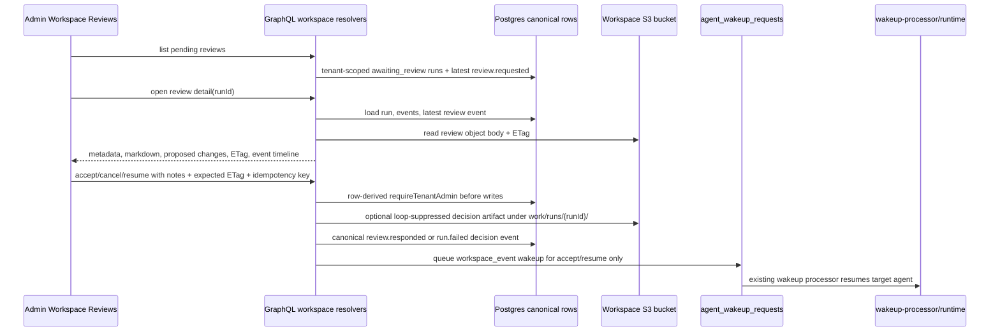

# feat: Complete workspace review detail and decision actions

## Overview

Finish the next operator/HITL slice on top of the merged and deployed workspace orchestration foundation from PRs #606, #607, and #608. The current deployed path can create `agent_workspace_events` from native S3 events, queue wakeups, suppress audit mirror loops, and reject protected generic writes. The remaining gap is that the admin review surface is still queue-shaped: it lists pending review runs and exposes coarse actions, but operators cannot inspect the review file body, proposed changes, ETag/currentness, or decision history before acting.

This plan adds the smallest coherent vertical slice across DB/query/mutations/API/admin UI: verify the live dev shape, expose review detail from canonical rows plus S3 artifacts, harden accept/cancel/resume decisions as auditable workspace events, and render an operator-focused detail surface with focused tests.

---

## Problem Frame

Workspace orchestration is only trustworthy when a human can answer three questions before resuming an agent:

- What exactly is this run asking me to review?
- What file/object and proposed changes will my decision affect?
- What canonical event and wakeup will my action create?

PR #606 created the first GraphQL review list and admin route, but the current contract stops at metadata (`reviewObjectKey`, target, latest event payload) and note-only mutations. The next slice should turn pending reviews into inspectable operational decisions without introducing a workflow console or bypassing the orchestration writer/protection model.

---

## Requirements Trace

- R1. List pending review files/events for a tenant without exposing another tenant's runs.
- R2. Inspect review details: run metadata, latest `review.requested` event, review object body, ETag, parsed proposed changes when available, and recent run event history.
- R3. Accept a review decision as an auditable workspace event and continue the target run through the existing `agent_wakeup_requests` path.
- R4. Cancel/reject a review as an auditable terminal decision without waking the runtime.
- R5. Resume/continue a target run after a decision or when an operator intentionally retries a stuck review wake, without duplicate wakeups for repeated idempotency keys.
- R6. Preserve tenant isolation with row-derived `requireTenantAdmin(ctx, run.tenant_id)` before S3, DB, or wakeup side effects.
- R7. Do not bypass protected generic workspace writes; platform-written decision artifacts must avoid EventBridge feedback loops.
- R8. Keep the UI operator-focused: dense metadata, readable review/proposed-change inspection, clear primary/secondary actions, no marketing-style page.

**Origin actors:** A3 human reviewer, A4 dispatcher, A5 agent builder/operator surface.

**Origin flows:** F2 human review pauses and resumes a run.

**Origin acceptance examples:** AE4 covers the human edit/resume contract; this slice implements the admin-mediated version of that contract.

---

## Scope Boundaries

- Do not build a general run/audit console beyond the detail needed to review and decide a pending HITL item.
- Do not add a DAG, fan-in, dependency graph, or workflow authoring surface.
- Do not make generic `POST /api/workspaces/files` write to protected orchestration paths.
- Do not change the EventBridge/SQS topology from #607 or audit mirror suppression from #608 except to reuse the suppression pattern for platform-written decision artifacts.
- Do not add mobile UI in this slice; mobile can consume the GraphQL detail/action contract later.
- Do not mutate dev data during the verification step except for intentional smoke fixtures if implementation verification needs them later.

---

## Context & Research

### Relevant Code and Patterns

- `packages/database-pg/src/schema/agent-workspace-events.ts` defines `agent_workspace_runs`, `agent_workspace_events`, and `agent_workspace_waits`. Event vocabulary already includes `review.requested` and `review.responded`.
- `packages/database-pg/graphql/types/agent-workspace-events.graphql` currently exposes list queries and three mutations: `acceptAgentWorkspaceReview`, `cancelAgentWorkspaceReview`, and `resumeAgentWorkspaceRun`.
- `packages/api/src/graphql/resolvers/workspace/agentWorkspaceReviews.query.ts` lists runs in `awaiting_review` and finds the latest `review.requested` event, but does not fetch S3 object content or event history.
- `packages/api/src/graphql/resolvers/workspace/reviewDecision.mutation.ts` writes a DB event and queues wakeups for accept/resume, but has no S3 ETag guard, no detail object, no dedicated tests, and permits `resume` without the same status guard as accept/cancel.
- `apps/admin/src/routes/_authed/_tenant/workspace-reviews/index.tsx` renders a compact table with icon actions, but no detail panel, no review body, no proposed-change preview, and no decision history.
- `apps/admin/src/lib/graphql-queries.ts` contains the current workspace review query/mutations and generated admin GraphQL files are already wired into the route.
- `packages/api/src/lib/workspace-events/s3-mirror.ts` writes audit mirrors and PR #608 added suppression metadata coverage. Reuse that pattern for any platform-written decision artifact.
- `packages/api/workspace-files.ts` rejects protected generic writes with `use orchestration writer`, which this slice must preserve.

### Institutional Learnings

- `docs/solutions/best-practices/every-admin-mutation-requires-requiretenantadmin-2026-04-22.md`: every admin mutation must derive the tenant from the row being mutated and gate before external calls or writes.
- `docs/solutions/logic-errors/compile-continuation-dedupe-bucket-2026-04-20.md`: idempotent no-op paths must be visible and tested; silent `ON CONFLICT DO NOTHING` can hide broken chains.
- `docs/solutions/best-practices/defer-integration-tests-until-shared-harness-exists-2026-04-21.md`: prefer focused resolver/service tests for orchestration paths rather than broad AWS integration tests inside unit suites.

### Related PRs

- PR #606 `feat(workspace): add HITL review orchestration` merged 2026-04-26. It added event persistence, review list/action GraphQL, an admin Workspace Reviews page, generated clients, and docs.
- PR #607 `fix(workspace): simplify orchestration event routing` merged 2026-04-26. It broadened accepted EventBridge routing and kept canonical event filtering in code.
- PR #608 `fix(workspace): suppress audit mirror events` merged 2026-04-26. It fixed audit mirror feedback loops with suppression metadata.

### External References

- No new external research is needed. The AWS/EventBridge parts were researched and deployed in the prior slice; this work follows local GraphQL, S3, Drizzle, and admin patterns.

---

## Key Technical Decisions

- **Verify deployed shape before coding.** Start in a new worktree off `origin/main`, then read-only compare the live dev DB/API shape against the merged schema: event type values, columns, tenant flag, sample event `215`, run/wakeup linkage, and protected write response. This protects the slice from coding against a stale pre-#608 assumption.
- **Add a review detail query instead of overloading the list query.** Keep `agentWorkspaceReviews` cheap for the queue. Add `agentWorkspaceReview(runId: ID!)` or equivalent detail query that row-gates by run tenant, fetches S3 review body/ETag, and returns recent canonical events.
- **Represent proposed changes opportunistically but with a stable UI shape.** Review files are markdown artifacts first. The detail query should parse structured proposed changes from known payload/body shapes when present into a small stable shape (`path`, `kind`, `summary`, optional `diff`/`before`/`after` text), but always return raw markdown so operators can act even when the file is free-form.
- **Make decisions a shared API service.** Move mutation logic into a testable `review-actions` service with injectable DB/S3/wakeup dependencies. GraphQL resolvers stay thin and enforce row-derived auth before side effects.
- **Decision artifacts must be platform-written and loop-safe.** If the mutation writes a human response artifact, write it under a non-eventful run path such as `work/runs/{runId}/review/decision-{eventId}.md` and include the same suppression metadata pattern used for audit mirrors. Do not write through the generic workspace-files API and do not write into `review/` via a generic path.
- **Accept means accept-and-continue; resume means continue/retry.** Keep the existing three action names for API compatibility, but make UI copy explicit: `Accept and continue`, `Continue run`, and `Reject / cancel`. Accept records a positive `review.responded` decision and queues one wakeup. Resume is a repair/continue action for an `awaiting_review` run or a `pending` run whose prior decision event exists but no current queued wakeup is attached; it records an audited continue/retry decision and queues one wakeup. Cancel records terminal rejection and does not queue a wakeup.
- **Use idempotency as a safety boundary.** Repeated decisions with the same explicit idempotency key must not create duplicate events or wakeups. If the event insert no-ops, return the current run state and surface that no new wake was queued in logs/tests.

---

## Open Questions

### Resolved During Planning

- Should the UI be in the existing Workspace Reviews route or Inbox? Use the existing `workspace-reviews` route from #606. It is already in the sidebar and avoids mixing workspace-run decisions into generic inbox item state.
- Should review decision writes edit `review/{runId}.needs-human.md` directly? No. That path is eventful and would collide with the detector semantics. Human answers should be represented as canonical events plus optional loop-suppressed run artifacts.
- Should cancel wake the agent? No for this slice. Cancellation/rejection is terminal and auditable; cancellation callbacks can be a future product decision.

### Deferred to Implementation

- Exact proposed-change parser details. Implement the smallest parser that matches current smoke/review payloads and gracefully falls back to raw markdown.
- Exact dev verification query shape. Use available `thinkwork`/Secrets Manager/terraform-output helpers in the new worktree and record the observed shape in the PR notes.

---

## High-Level Technical Design

> _This illustrates the intended approach and is directional guidance for review, not implementation specification. The implementing agent should treat it as context, not code to reproduce._

---

## Implementation Units

- U1. **Create worktree and verify deployed shape**

**Goal:** Start from current `origin/main` and confirm the live dev schema/data matches the merged foundation before implementation.

**Requirements:** R1, R6, R7.

**Dependencies:** None.

**Files:**

- Modify: no feature files expected.
- Test expectation: none -- this is a read-only verification/setup unit.

**Approach:**

- Create a new worktree off `origin/main` using the repo branch prefix convention.
- Fetch latest `origin/main` and ensure PRs #606, #607, and #608 are present.
- Verify local model shape: GraphQL type file, Drizzle schema, review resolvers, current admin route, and migration files.
- Verify dev shape read-only where possible: tenant `sleek-squirrel-230` has `workspace_orchestration_enabled = true`; sample event `215` is present with type `work.requested`; wakeup request `4463cee5-e266-491e-9a60-e8c3ee238ec2` and turn `3ed66262-7517-4db1-b7eb-a6bf913169be` still show the expected completed linkage. Re-check the protected generic-write guard only if a safe existing script/fixture is available; otherwise cite the user's already-passed smoke result and preserve coverage with local tests.
- Record any drift in implementation notes or PR body; adjust later units only if drift is real.

**Patterns to follow:**

- `AGENTS.md` PR/worktree guidance.
- Prior PR #606 dev deployment notes for the smoke identifiers and validation expectations.

**Test scenarios:**

- Test expectation: none -- verification is operational/read-only and should be summarized in the PR, not codified as unit tests.

**Verification:**

- The new worktree is on a feature branch based on `origin/main`.
- The observed deployed shape is consistent with the plan assumptions or the plan is revised before coding.

---

- U2. **Add review detail query and S3-backed inspection service**

**Goal:** Expose the full review context operators need before deciding: body, ETag, proposed changes, run metadata, latest review event, and recent event history.

**Requirements:** R1, R2, R6.

**Dependencies:** U1.

**Files:**

- Modify: `packages/database-pg/graphql/types/agent-workspace-events.graphql`
- Create/modify: `packages/api/src/graphql/resolvers/workspace/agentWorkspaceReview.query.ts`
- Modify: `packages/api/src/graphql/resolvers/workspace/index.ts`
- Create: `packages/api/src/lib/workspace-events/review-detail.ts`
- Create: `packages/api/src/__tests__/workspace-review-detail.test.ts`

**Approach:**

- Add a detail GraphQL type that includes the existing list fields plus `reviewBody`, `reviewEtag`, `proposedChanges`, `events`, and optional `decisionEvents`. `proposedChanges` should use explicit fields rather than opaque JSON so the admin UI can render stable rows while still showing raw markdown fallback.
- Load the run by `runId`; derive tenant from the run; call `requireTenantAdmin(ctx, run.tenant_id)` before S3 reads.
- Resolve the current review object from the latest `review.requested` event source key. If the object is missing, return metadata plus a clear missing-object status rather than hiding the run.
- Parse proposed changes from current known shapes: event payload fields and recognizable markdown sections. Keep fallback raw markdown.
- Keep list query behavior stable and cheap.

**Patterns to follow:**

- `packages/api/src/graphql/resolvers/workspace/agentWorkspaceReviews.query.ts` for row/event joins.
- `packages/api/workspace-files.ts` and `packages/api/src/lib/workspace-overlay.ts` for S3 `GetObject` body and ETag handling.

**Test scenarios:**

- Happy path: a tenant admin loads detail for an awaiting-review run and receives markdown body, ETag, latest event, and event history.
- Edge case: a free-form review markdown file returns raw body with an empty proposed-change list.
- Error path: missing S3 review object returns a structured missing state without creating events or wakeups.
- Security path: an admin from another tenant cannot read detail for the run.

**Verification:**

- The detail query composes through the workspace resolver index and GraphQL schema generation.

---

- U3. **Harden review decision mutations and audit events**

**Goal:** Make accept, cancel/reject, and resume decisions auditable, tenant-safe, loop-safe, and idempotent.

**Requirements:** R3, R4, R5, R6, R7.

**Dependencies:** U2.

**Files:**

- Modify: `packages/database-pg/graphql/types/agent-workspace-events.graphql`
- Modify: `packages/api/src/graphql/resolvers/workspace/reviewDecision.mutation.ts`
- Create: `packages/api/src/lib/workspace-events/review-actions.ts`
- Create: `packages/api/src/__tests__/workspace-review-actions.test.ts`
- Modify: `packages/api/src/lib/workspace-events/s3-mirror.ts` if suppression metadata needs a shared helper.

**Approach:**

- Extend decision input with `expectedReviewEtag`, `decision`, and optional `responseMarkdown` while preserving existing `notes` and `idempotencyKey`.
- Move status validation, event insert, optional decision artifact write, and wakeup enqueue into a service with injectable dependencies for tests.
- Require row-derived tenant admin before S3 reads/writes, event inserts, run updates, or wakeup inserts.
- For accept: validate allowed state, optionally check ETag, write canonical `review.responded` with `decision=accepted`, transition the run to `pending`, and enqueue exactly one `workspace_event` wakeup.
- For cancel/reject: validate allowed state, write canonical terminal event (`run.failed` with `reason=review_cancelled` or `review_rejected`), transition run to `cancelled`, and enqueue no wakeup.
- For resume: allow only an `awaiting_review` run or a `pending` run whose prior review decision event exists but no current queued wakeup is attached. Write an audited continue/retry event and enqueue exactly one wakeup.
- If a duplicate idempotency key is detected, do not enqueue another wakeup; log the collision/no-op clearly.
- Platform-written S3 decision artifacts must use loop-suppression metadata and must not go through protected generic workspace writes.

**Patterns to follow:**

- `packages/api/src/graphql/resolvers/agents/acceptTemplateUpdate.mutation.ts` for row-derived auth before S3 side effects.
- `packages/api/src/lib/workspace-events/processor.ts` for canonical event/wakeup payload shape.
- `docs/solutions/best-practices/every-admin-mutation-requires-requiretenantadmin-2026-04-22.md` for auth ordering.
- `docs/solutions/logic-errors/compile-continuation-dedupe-bucket-2026-04-20.md` for visible idempotent no-ops.

**Test scenarios:**

- Happy path accept: matching ETag writes one decision event, transitions run to `pending`, and enqueues one `workspace_event` wakeup with `workspaceRunId`, `workspaceEventId`, `targetPath`, and `causeType`.
- Error path: ETag mismatch returns a conflict and performs no DB/S3/wakeup writes.
- Happy path cancel/reject: records terminal audit event, marks run `cancelled`, and enqueues no wakeup.
- Idempotency: replaying the same idempotency key creates no duplicate event or wakeup and returns stable run state.
- Security path: cross-tenant caller cannot accept/cancel/resume and no side effects occur.
- State path: completed, failed, cancelled, or expired runs reject decisions unless resume is explicitly allowed for a documented state.

**Verification:**

- Focused API tests cover mutation service behavior without requiring a deployed AWS stack.

---

- U4. **Build operator-focused review detail UI**

**Goal:** Let operators inspect a pending review and take clear actions from the admin app.

**Requirements:** R1, R2, R3, R4, R5, R8.

**Dependencies:** U2, U3.

**Files:**

- Modify: `apps/admin/src/lib/graphql-queries.ts`
- Modify: `apps/admin/src/routes/_authed/_tenant/workspace-reviews/index.tsx`
- Create: `apps/admin/src/routes/_authed/_tenant/workspace-reviews/-review-detail.tsx` or `apps/admin/src/components/workspace-reviews/WorkspaceReviewDetail.tsx`
- Create: `apps/admin/src/lib/workspace-review-state.ts`
- Create: `apps/admin/src/lib/__tests__/workspace-review-state.test.ts`
- Generated: `apps/admin/src/gql/graphql.ts`
- Generated: `apps/admin/src/gql/gql.ts`

**Approach:**

- Keep the table as the operator queue, but add a selected-run detail panel or route-level detail view.
- Show compact run metadata, agent, target path, review object key, ETag/currentness, latest event, raw review markdown, parsed proposed changes, and recent canonical events.
- Present actions with explicit copy: `Accept and continue`, `Continue run`, `Reject / cancel`.
- Require notes or confirmation for destructive reject/cancel if existing admin patterns support it; otherwise use a confirmation dialog with concise copy.
- Disable action buttons while a mutation is in flight and after terminal status returns.
- Refresh detail and list after a decision; surface ETag conflicts as "Review changed since you opened it" rather than a generic failure.
- Keep styling dense and utilitarian: tables, metadata rows, monospace object keys, markdown/proposed-change panes, and icon buttons with tooltips where useful.

**Patterns to follow:**

- Current `apps/admin/src/routes/_authed/_tenant/workspace-reviews/index.tsx` table and dialog patterns.
- `apps/admin/src/routes/_authed/_tenant/inbox/$inboxItemId.tsx` for detail/action ergonomics.
- `apps/admin/src/components/threads/ExecutionTrace.tsx` for dense operational timeline rendering.

**Test scenarios:**

- UI state helper maps statuses to enabled actions: awaiting review allows accept/cancel/resume, terminal states disable all decisions.
- ETag conflict error maps to the specific conflict message used by the detail UI.
- Parsed proposed changes render as a list when returned and raw markdown remains visible when no structured changes exist.
- Existing list state continues to show pending review count and selected review metadata.

**Verification:**

- Admin codegen updates generated GraphQL documents.
- Focused UI state tests cover critical action enablement and error mapping.

---

- U5. **Regenerate clients, run focused verification, and update docs/PR notes**

**Goal:** Verify the vertical slice and leave the operational behavior clear for reviewers.

**Requirements:** R1-R8.

**Dependencies:** U1-U4.

**Files:**

- Modify: `docs/src/content/docs/concepts/agents/workspace-orchestration.mdx` if the review action contract changed materially.
- Modify: PR description/notes after PR creation, not a repo file unless docs changed.

**Approach:**

- Regenerate GraphQL clients for packages that consume the canonical schema and have a `codegen` script if the schema changes: `apps/admin`, `apps/cli`, `apps/mobile`, and `packages/api` as applicable.
- Run focused API tests for review detail/actions and existing workspace event tests that guard audit mirror suppression/protected writes.
- Run admin tests/build/typecheck appropriate to the repo scripts.
- If docs change, keep them operational: review detail, accept/continue, reject/cancel, resume retry, audit event names, and loop-suppression note.
- In the PR body, include the read-only dev verification observations from U1.

**Patterns to follow:**

- PR #606 verification list for workspace orchestration commands.
- AGENTS.md command guidance for codegen and test selection.

**Test scenarios:**

- Existing workspace event processor, dispatcher pattern, S3 mirror, and workspace-files guard tests still pass.
- New review detail/action tests pass.
- Admin UI state tests pass and generated clients compile.

**Verification:**

- `pnpm --filter @thinkwork/api exec vitest run` with the new focused test files and relevant existing workspace tests.
- `pnpm --filter @thinkwork/api typecheck`.
- `pnpm --filter @thinkwork/admin codegen`.
- `pnpm --filter @thinkwork/admin test`.
- `pnpm --filter @thinkwork/admin build`.
- Additional codegen/typecheck commands for other GraphQL consumers if schema generation changes their artifacts.

---

## System-Wide Impact

- **Interaction graph:** Admin UI calls GraphQL; GraphQL reads DB/S3 and writes canonical events; accept/resume enqueue `agent_wakeup_requests`; wakeup-processor remains the only runtime invocation path.
- **Error propagation:** ETag conflicts and invalid state transitions should become explicit GraphQL errors; S3 missing-object detail should be visible but read-only.
- **State lifecycle risks:** Duplicate decisions can create duplicate wakeups unless idempotency is enforced at event and wakeup creation. Terminal cancellation must not be followed by a resume wake.
- **API surface parity:** Admin generated clients update immediately; CLI/mobile generated clients may need schema regeneration even if they do not yet render the new detail.
- **Integration coverage:** Unit tests cover service behavior; deployed smoke still validates native S3/EventBridge/DB linkage.
- **Unchanged invariants:** Protected generic writes still return `use orchestration writer`; audit mirror suppression remains required for platform-written S3 artifacts; tenant isolation remains row-derived.

---

## Risks & Dependencies

| Risk                                                                                                | Mitigation                                                                                           |
| --------------------------------------------------------------------------------------------------- | ---------------------------------------------------------------------------------------------------- |
| GraphQL mutation writes a review artifact that re-enters the dispatcher because #607 routes broadly | Write under a non-eventful run path and include suppression metadata on platform-written S3 objects. |
| Cross-tenant review detail leaks S3 body content                                                    | Load run first, derive tenant from row, call `requireTenantAdmin` before S3 `GetObject`.             |
| Accept/resume double-wakes a run on retry                                                           | Use decision idempotency key for event and wakeup writes; test duplicate no-op behavior.             |
| UI labels blur accept vs resume                                                                     | Use explicit operator copy and status-derived action availability.                                   |
| Live dev schema drift differs from merged assumptions                                               | U1 verifies current deployed shape before coding and feeds adjustments into implementation.          |

---

## Documentation / Operational Notes

- PR notes should include the dev verification IDs from the user context and any new review-detail smoke IDs created during implementation.
- Docs only need an update if the decision artifact path or operator action semantics change from #606 docs.
- Do not paste Secrets Manager values, `.env`, or `terraform.tfvars` contents in the PR.

---

## Sources & References

- **Origin document:** [docs/brainstorms/2026-04-25-s3-file-orchestration-primitive-requirements.md](docs/brainstorms/2026-04-25-s3-file-orchestration-primitive-requirements.md)
- Related requirements: [docs/brainstorms/2026-04-25-s3-event-driven-agent-orchestration-requirements.md](docs/brainstorms/2026-04-25-s3-event-driven-agent-orchestration-requirements.md)
- Prior plan: [docs/plans/2026-04-25-001-feat-s3-file-orchestration-plan.md](docs/plans/2026-04-25-001-feat-s3-file-orchestration-plan.md)
- Current pre-slice plan/history: [docs/plans/2026-04-26-001-feat-workspace-orchestration-hitl-review-plan.md](docs/plans/2026-04-26-001-feat-workspace-orchestration-hitl-review-plan.md)
- Related PRs/issues: #606, #607, #608
- Related code: `packages/api/src/graphql/resolvers/workspace/reviewDecision.mutation.ts`
- Related code: `apps/admin/src/routes/_authed/_tenant/workspace-reviews/index.tsx`
- Institutional learning: [docs/solutions/best-practices/every-admin-mutation-requires-requiretenantadmin-2026-04-22.md](docs/solutions/best-practices/every-admin-mutation-requires-requiretenantadmin-2026-04-22.md)
- Institutional learning: [docs/solutions/logic-errors/compile-continuation-dedupe-bucket-2026-04-20.md](docs/solutions/logic-errors/compile-continuation-dedupe-bucket-2026-04-20.md)
